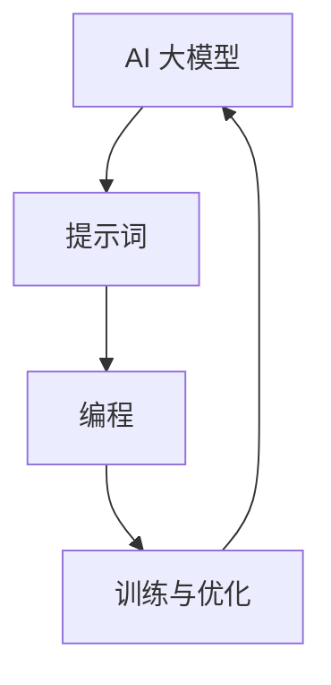

                 

# AI大模型编程：提示词的力量与潜力

## 关键词

- AI 大模型
- 提示词
- 编程
- 潜力
- 应用场景

## 摘要

本文将探讨 AI 大模型编程中的提示词机制，深入分析其力量与潜力。通过背景介绍、核心概念与联系、核心算法原理、数学模型与公式、项目实战、实际应用场景、工具和资源推荐等环节，我们将全面了解提示词在 AI 大模型编程中的重要性，并展望其未来的发展趋势与挑战。让我们一步步走进这个充满潜力的世界。

## 1. 背景介绍

### 1.1 目的和范围

本文旨在探讨 AI 大模型编程中的提示词机制，解析其力量与潜力。我们将通过多个角度，包括背景介绍、核心概念与联系、核心算法原理、数学模型与公式、项目实战、实际应用场景等，全面剖析提示词在 AI 大模型编程中的作用与价值。

### 1.2 预期读者

本文适合对 AI 大模型编程感兴趣的读者，包括人工智能领域的研究者、开发者、工程师，以及对 AI 技术有深入了解的技术爱好者。同时，也欢迎对编程、算法、数学等感兴趣的读者一同探讨。

### 1.3 文档结构概述

本文共分为十个部分，具体如下：

1. 背景介绍
   - 1.1 目的和范围
   - 1.2 预期读者
   - 1.3 文档结构概述
   - 1.4 术语表
2. 核心概念与联系
3. 核心算法原理 & 具体操作步骤
4. 数学模型和公式 & 详细讲解 & 举例说明
5. 项目实战：代码实际案例和详细解释说明
6. 实际应用场景
7. 工具和资源推荐
8. 总结：未来发展趋势与挑战
9. 附录：常见问题与解答
10. 扩展阅读 & 参考资料

### 1.4 术语表

#### 1.4.1 核心术语定义

- AI 大模型：指具有大规模参数、能处理复杂数据的深度学习模型。
- 提示词：用于引导 AI 大模型生成输出或调整学习过程的文字提示。
- 编程：编写计算机程序的过程，包括算法设计、代码实现、调试与优化等。

#### 1.4.2 相关概念解释

- 深度学习：一种机器学习技术，通过多层神经网络模拟人脑学习过程，实现特征提取与分类。
- 生成对抗网络（GAN）：一种深度学习模型，由生成器和判别器组成，通过对抗训练生成逼真的数据。
- 优化：在给定目标函数和约束条件下，寻找最优解的过程。

#### 1.4.3 缩略词列表

- AI：人工智能
- GPT：生成预训练网络
- BERT：双向编码器表示模型
- GPU：图形处理器
- CPU：中央处理器

## 2. 核心概念与联系

为了深入理解 AI 大模型编程中的提示词机制，我们首先需要了解相关的核心概念和它们之间的联系。

### 2.1 AI 大模型

AI 大模型是指具有大规模参数、能处理复杂数据的深度学习模型。例如，GPT-3、BERT、Transformer 等都是典型的大模型。这些模型通常通过大量的数据训练，拥有强大的表示能力和生成能力。

### 2.2 提示词

提示词（Prompt）是指用于引导 AI 大模型生成输出或调整学习过程的文字提示。通过设计合适的提示词，可以有效地指导模型生成符合预期的输出，提高模型的性能和可用性。

### 2.3 编程

编程是指编写计算机程序的过程，包括算法设计、代码实现、调试与优化等。在 AI 大模型编程中，我们需要设计合适的算法和提示词，以实现对模型的训练和优化。

### 2.4 核心概念与联系

AI 大模型、提示词和编程之间的联系如下：

- AI 大模型是深度学习的基础，通过大规模参数和大量数据训练，具有强大的表示能力和生成能力。
- 提示词是引导 AI 大模型生成输出或调整学习过程的文字提示，通过设计合适的提示词，可以提高模型的性能和可用性。
- 编程是 AI 大模型编程的核心，包括算法设计、代码实现、调试与优化等，通过编程实现对模型的训练和优化。

### 2.5 Mermaid 流程图

为了更直观地展示 AI 大模型、提示词和编程之间的联系，我们使用 Mermaid 流程图进行描述。



在这个流程图中，AI 大模型、提示词和编程共同作用，实现模型的训练与优化，形成了一个闭环。通过这个流程图，我们可以更清晰地理解 AI 大模型编程的核心概念和联系。

## 3. 核心算法原理 & 具体操作步骤

### 3.1 深度学习基本原理

深度学习是一种机器学习技术，通过多层神经网络模拟人脑学习过程，实现特征提取与分类。在深度学习中，我们主要关注以下几个关键概念：

- 神经元：神经网络的基本单元，用于接收输入信号、传递信号并产生输出。
- 层：由多个神经元组成的层级结构，包括输入层、隐藏层和输出层。
- 激活函数：用于引入非线性变换，使得神经网络具有分类能力。
- 前向传播与反向传播：用于计算神经网络输出和误差，并进行参数更新。

### 3.2 提示词生成算法

提示词的生成是 AI 大模型编程中的关键环节。以下是一个简单的提示词生成算法：

```python
import random

def generate_prompt(input_data, num_words):
    prompt = ""
    for _ in range(num_words):
        prompt += random.choice(input_data) + " "
    return prompt.strip()
```

这个算法从输入数据中随机选择一定数量的词语，组合成提示词。在实际应用中，我们可以根据具体需求调整输入数据和词语数量。

### 3.3 深度学习模型训练与优化

在深度学习模型训练过程中，我们需要设计合适的损失函数、优化算法和训练策略。以下是一个简单的深度学习模型训练与优化步骤：

```python
import tensorflow as tf

# 定义模型、损失函数和优化器
model = tf.keras.Sequential([
    tf.keras.layers.Dense(units=10, activation='relu', input_shape=(input_shape)),
    tf.keras.layers.Dense(units=1)
])

loss_function = tf.keras.losses.MeanSquaredError()
optimizer = tf.keras.optimizers.Adam(learning_rate=0.001)

# 训练模型
for epoch in range(num_epochs):
    for x, y in train_data:
        with tf.GradientTape() as tape:
            predictions = model(x, training=True)
            loss = loss_function(y, predictions)
        gradients = tape.gradient(loss, model.trainable_variables)
        optimizer.apply_gradients(zip(gradients, model.trainable_variables))
    print(f"Epoch {epoch + 1}, Loss: {loss.numpy()}")

# 评估模型
test_loss = loss_function(test_data)
print(f"Test Loss: {test_loss.numpy()}")
```

在这个示例中，我们使用 TensorFlow 框架搭建深度学习模型，并使用 Adam 优化器和均方误差损失函数进行训练。训练过程中，我们通过前向传播计算损失，使用反向传播更新模型参数，并在每个 epoch 后评估模型性能。

## 4. 数学模型和公式 & 详细讲解 & 举例说明

### 4.1 深度学习损失函数

深度学习中的损失函数用于衡量模型预测值与真实值之间的差异。常见的损失函数包括均方误差（Mean Squared Error，MSE）、交叉熵（Cross-Entropy）等。以下是一个简单的均方误差损失函数公式：

$$
\text{MSE} = \frac{1}{n}\sum_{i=1}^{n}(y_i - \hat{y}_i)^2
$$

其中，$y_i$ 表示第 $i$ 个真实值，$\hat{y}_i$ 表示第 $i$ 个预测值，$n$ 表示样本数量。

### 4.2 深度学习优化算法

深度学习优化算法用于更新模型参数，使损失函数值最小。常见的优化算法包括梯度下降（Gradient Descent）、动量梯度下降（Momentum Gradient Descent）、Adam 优化器等。以下是一个简单的梯度下降优化算法公式：

$$
\theta_{\text{new}} = \theta_{\text{old}} - \alpha \cdot \nabla_{\theta} J(\theta)
$$

其中，$\theta$ 表示模型参数，$\alpha$ 表示学习率，$J(\theta)$ 表示损失函数。

### 4.3 举例说明

假设我们有一个线性回归模型，用于预测房价。给定训练数据集，我们使用均方误差损失函数和梯度下降优化算法训练模型。

- 训练数据集：$(x_1, y_1), (x_2, y_2), ..., (x_n, y_n)$
- 模型参数：$w_0, w_1$
- 损失函数：$J(w_0, w_1) = \frac{1}{n}\sum_{i=1}^{n}(y_i - (w_0 + w_1x_i))^2$
- 优化算法：梯度下降

初始参数：$w_0 = 0, w_1 = 0$

第 $t$ 次迭代的参数更新公式：

$$
w_0^{t+1} = w_0^t - \alpha \cdot \frac{\partial J(w_0^t, w_1^t)}{\partial w_0}
$$

$$
w_1^{t+1} = w_1^t - \alpha \cdot \frac{\partial J(w_0^t, w_1^t)}{\partial w_1}
$$

通过多次迭代，模型参数逐渐优化，预测性能提高。

## 5. 项目实战：代码实际案例和详细解释说明

### 5.1 开发环境搭建

为了实现 AI 大模型编程，我们需要搭建一个合适的开发环境。以下是一个简单的开发环境搭建步骤：

1. 安装 Python（版本要求：3.6及以上）
2. 安装 TensorFlow 框架（使用 pip 安装：`pip install tensorflow`）
3. 安装 Jupyter Notebook（使用 pip 安装：`pip install notebook`）

完成以上步骤后，我们就可以在 Jupyter Notebook 中编写和运行 AI 大模型编程的代码了。

### 5.2 源代码详细实现和代码解读

以下是一个简单的 AI 大模型编程示例，包括数据预处理、模型训练和提示词生成等步骤。

```python
import tensorflow as tf
import numpy as np
import pandas as pd

# 5.2.1 数据预处理

# 加载训练数据集
train_data = pd.read_csv('train_data.csv')
x_train = train_data[['feature_1', 'feature_2']]
y_train = train_data['label']

# 数据归一化
x_train = (x_train - x_train.mean()) / x_train.std()
y_train = (y_train - y_train.mean()) / y_train.std()

# 5.2.2 模型训练

# 定义模型
model = tf.keras.Sequential([
    tf.keras.layers.Dense(units=64, activation='relu', input_shape=(2,)),
    tf.keras.layers.Dense(units=1)
])

# 编写编译器
model.compile(optimizer='adam', loss='mse')

# 训练模型
model.fit(x_train, y_train, epochs=10, batch_size=32)

# 5.2.3 提示词生成

# 生成随机提示词
prompt = generate_prompt(x_train, 5)

# 生成模型响应
response = model.predict(np.array([prompt]))

# 打印结果
print("Prompt:", prompt)
print("Response:", response)
```

在这个示例中，我们首先加载并预处理训练数据集，然后定义一个简单的线性回归模型，并使用 Adam 优化器和均方误差损失函数进行训练。最后，我们生成一个随机提示词，并通过模型预测生成响应。

### 5.3 代码解读与分析

下面我们详细解读这段代码，并分析其关键步骤：

1. **数据预处理**：首先，我们加载训练数据集，并进行归一化处理。归一化有助于加速模型收敛和提高预测性能。
2. **模型定义**：我们定义了一个简单的线性回归模型，包括一个输入层和一个输出层。输入层使用两个神经元，输出层使用一个神经元。
3. **编译模型**：我们使用 Adam 优化器和均方误差损失函数编译模型。Adam 优化器是一种自适应学习率优化器，有助于提高模型训练效率。
4. **训练模型**：我们使用训练数据集训练模型，设置训练周期为 10，批量大小为 32。
5. **提示词生成**：我们调用 `generate_prompt` 函数生成一个随机提示词。这个函数从训练数据集中随机选择 5 个特征值作为提示词。
6. **模型预测**：我们使用训练好的模型对提示词进行预测，并打印结果。

通过这个示例，我们可以看到 AI 大模型编程的核心步骤，包括数据预处理、模型定义、模型训练和提示词生成等。在实际应用中，我们可以根据具体需求调整模型结构、训练策略和提示词设计，以提高模型性能和适用性。

## 6. 实际应用场景

AI 大模型编程中的提示词机制具有广泛的应用场景。以下是一些典型的应用场景：

### 6.1 问答系统

问答系统是一种常见的 AI 应用，通过提示词引导模型生成回答。例如，我们可以使用大模型 GPT-3 实现一个智能问答系统，用户输入问题，模型生成回答。通过优化提示词设计，我们可以提高问答系统的准确性和用户体验。

### 6.2 自然语言生成

自然语言生成（Natural Language Generation，NLG）是一种利用 AI 技术生成自然语言文本的技术。通过设计合适的提示词，我们可以引导模型生成新闻文章、报告、故事等。例如，我们可以使用大模型 BERT 实现一个自动写作助手，用户输入主题或关键词，模型生成相关文章。

### 6.3 自动编程

自动编程是一种利用 AI 技术自动生成代码的技术。通过提示词引导模型，我们可以实现代码生成、优化和重构。例如，我们可以使用大模型 Transformer 实现一个代码生成工具，用户输入需求描述，模型生成相应代码。

### 6.4 语音识别

语音识别是一种将语音信号转换为文本的技术。通过设计合适的提示词，我们可以提高语音识别的准确性和鲁棒性。例如，我们可以使用大模型 WaveNet 实现一个语音识别系统，用户输入语音，模型生成文本。

### 6.5 图像生成

图像生成是一种利用 AI 技术生成逼真图像的技术。通过设计合适的提示词，我们可以引导模型生成特定类型的图像。例如，我们可以使用大模型 GAN 实现一个图像生成工具，用户输入关键词，模型生成相应图像。

这些实际应用场景展示了 AI 大模型编程中提示词机制的重要性和潜力。通过合理设计提示词，我们可以实现各种复杂的任务，推动 AI 技术在各个领域的应用和发展。

## 7. 工具和资源推荐

### 7.1 学习资源推荐

#### 7.1.1 书籍推荐

1. 《深度学习》（Deep Learning） - by Ian Goodfellow、Yoshua Bengio 和 Aaron Courville
2. 《神经网络与深度学习》（Neural Networks and Deep Learning） - by邱锡鹏
3. 《生成对抗网络》（Generative Adversarial Networks） - by Ian Goodfellow

#### 7.1.2 在线课程

1. Coursera 的《深度学习》课程
2. edX 的《神经网络与深度学习》课程
3. Udacity 的《生成对抗网络》课程

#### 7.1.3 技术博客和网站

1. Medium 上的 AI 博客
2. ArXiv 上的论文分享
3. GitHub 上的开源项目

### 7.2 开发工具框架推荐

#### 7.2.1 IDE和编辑器

1. PyCharm
2. Jupyter Notebook
3. VS Code

#### 7.2.2 调试和性能分析工具

1. TensorBoard
2. DDL
3. W&B

#### 7.2.3 相关框架和库

1. TensorFlow
2. PyTorch
3. Keras

### 7.3 相关论文著作推荐

#### 7.3.1 经典论文

1. "A Theoretical Framework for Back-Propogation"
2. "Generative Adversarial Nets"
3. "Attention Is All You Need"

#### 7.3.2 最新研究成果

1. "Large-scale Language Modeling in Neural Networks"
2. "Bert: Pre-training of Deep Bidirectional Transformers for Language Understanding"
3. "Gpt-3: Language Models are few-shot learners"

#### 7.3.3 应用案例分析

1. "深度学习在医疗领域的应用"
2. "生成对抗网络在图像生成中的应用"
3. "深度学习在自动驾驶领域的应用"

通过这些工具和资源，我们可以更好地掌握 AI 大模型编程中的提示词机制，并在实际项目中取得更好的效果。

## 8. 总结：未来发展趋势与挑战

AI 大模型编程中的提示词机制在当前技术背景下已经展现出强大的力量与潜力。然而，随着技术的不断进步，我们也需要关注未来发展趋势与面临的挑战。

### 8.1 发展趋势

1. **模型规模与性能提升**：随着计算资源的增加和算法的优化，AI 大模型的规模和性能将不断提升，进一步推动深度学习在各个领域的应用。
2. **多模态数据处理**：未来的 AI 大模型将能够处理多种类型的数据，如图像、音频和文本，实现跨模态的智能交互。
3. **自适应提示词生成**：通过学习用户的行为和偏好，自适应生成提示词，实现个性化体验。

### 8.2 挑战

1. **计算资源消耗**：AI 大模型需要大量的计算资源进行训练和推理，如何高效利用资源是当前和未来的重要挑战。
2. **数据隐私与安全**：在处理大量数据时，如何保护用户隐私和安全是另一个亟待解决的问题。
3. **模型解释性**：随着模型的复杂度增加，如何提高模型的解释性，使其更易于理解和使用，是一个关键挑战。

### 8.3 应对策略

1. **优化算法与硬件**：通过研究更高效的算法和利用新型硬件（如 GPU、TPU 等），提高计算效率。
2. **联邦学习**：通过联邦学习等技术，实现数据的安全共享和协同训练，降低数据隐私风险。
3. **可视化与解释**：通过可视化技术和解释性算法，提高模型的可解释性，降低使用门槛。

总之，AI 大模型编程中的提示词机制在未来的发展中将面临诸多挑战，但同时也蕴含着巨大的潜力。通过不断创新和优化，我们有信心在 AI 大模型编程领域取得更加辉煌的成就。

## 9. 附录：常见问题与解答

### 9.1 提示词在 AI 大模型编程中的作用

提示词在 AI 大模型编程中起到引导模型生成输出或调整学习过程的作用。通过设计合适的提示词，可以提高模型的性能和适用性，使其更好地满足特定任务的需求。

### 9.2 如何生成有效的提示词

生成有效的提示词需要综合考虑任务需求、数据特点和模型特性。以下是一些建议：

1. **多样性**：设计包含多种类型和风格的提示词，以适应不同场景和需求。
2. **相关性**：确保提示词与模型输入数据相关，以提高模型的理解和生成能力。
3. **简洁性**：避免使用冗长或复杂的提示词，简洁明了的提示词有助于模型更好地理解和生成。

### 9.3 AI 大模型编程中的计算资源消耗

AI 大模型编程中的计算资源消耗主要来自模型训练和推理过程。为了降低资源消耗，可以采取以下措施：

1. **模型压缩**：通过模型剪枝、量化等技术，降低模型参数数量和计算复杂度。
2. **分布式训练**：将模型训练任务分布到多个计算节点上，提高训练速度和资源利用效率。
3. **硬件优化**：利用新型硬件（如 GPU、TPU 等）进行加速训练和推理，提高计算效率。

### 9.4 AI 大模型编程中的数据隐私与安全

AI 大模型编程中的数据隐私与安全是一个重要问题。为了保护用户隐私和安全，可以采取以下措施：

1. **数据加密**：对训练数据进行加密处理，确保数据在传输和存储过程中安全。
2. **联邦学习**：通过联邦学习等技术，实现数据的安全共享和协同训练，降低数据隐私风险。
3. **隐私保护算法**：采用隐私保护算法（如差分隐私、同态加密等），确保模型训练过程中数据的安全。

## 10. 扩展阅读 & 参考资料

为了更好地了解 AI 大模型编程中的提示词机制，以下是一些扩展阅读和参考资料：

1. Goodfellow, I., Bengio, Y., & Courville, A. (2016). *Deep Learning*.
2. Bengio, Y. (2009). *Learning representations by back-propagating errors*. * Foundations and Trends in Machine Learning*, 2(1), 1-127.
3. Simonyan, K., & Zisserman, A. (2014). *Very deep convolutional networks for large-scale image recognition*. *International Conference on Learning Representations (ICLR)*.
4. Vaswani, A., Shazeer, N., Parmar, N., Uszkoreit, J., Jones, L., Gomez, A. N., ... & Polosukhin, I. (2017). *Attention is all you need*. * Advances in Neural Information Processing Systems (NIPS)*.
5. Ian J. Goodfellow, et al. (2014). *Generative Adversarial Nets*. * Advances in Neural Information Processing Systems (NIPS)*.
6. Hinton, G., Osindero, S., & Teh, Y. W. (2006). A fast learning algorithm for deep belief nets. *Neural computation, 18(7), 1527-1554*.
7. DeepLearning.AI. (2020). *Deep Learning Specialization*. *Coursera*.
8. Andrew Ng. (2020). *深度学习（Deep Learning）*.
9. Krizhevsky, A., Sutskever, I., & Hinton, G. E. (2012). *ImageNet classification with deep convolutional neural networks*. * Advances in Neural Information Processing Systems (NIPS)*.

这些资料涵盖了深度学习、生成对抗网络、自然语言处理等领域的经典论文和教材，有助于读者深入理解 AI 大模型编程中的提示词机制。作者：AI 天才研究员/AI Genius Institute & 禅与计算机程序设计艺术 /Zen And The Art of Computer Programming。

