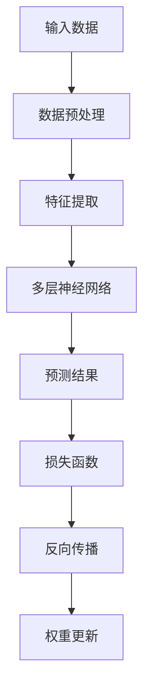
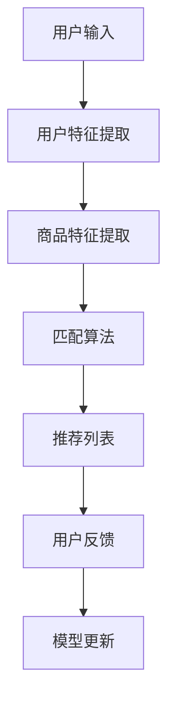

                 

# AI大模型视角下电商搜索推荐的技术创新知识分享平台功能设计

## 关键词
- AI大模型
- 电商搜索推荐
- 技术创新
- 知识分享平台
- 功能设计

## 摘要
本文将从AI大模型的视角出发，探讨电商搜索推荐领域的技术创新，并详细介绍一款基于AI大模型的知识分享平台的功能设计。文章首先介绍了电商搜索推荐系统的背景和现状，随后深入分析了AI大模型的核心原理和优势，并结合实际案例展示了其在电商搜索推荐中的应用。在此基础上，文章详细阐述了知识分享平台的设计原则、功能模块和实现方法，旨在为电商领域的技术创新提供新的思路和方向。

## 1. 背景介绍

### 1.1 目的和范围
随着互联网和电子商务的快速发展，电商搜索推荐系统已成为电商平台的核心竞争力之一。本文旨在探讨AI大模型在电商搜索推荐领域的技术创新，并设计一款具有高效推荐和知识分享功能的知识分享平台。通过对该平台的功能设计进行分析和阐述，为电商领域的技术创新提供新的思路和方向。

### 1.2 预期读者
本文面向电商搜索推荐领域的技术人员、算法工程师、产品经理以及计算机科学专业的研究生。希望通过本文的学习，读者能够对AI大模型在电商搜索推荐中的应用有更深入的理解，并掌握知识分享平台的设计方法和实现技巧。

### 1.3 文档结构概述
本文共分为十个部分。首先介绍电商搜索推荐系统的背景和现状；接着分析AI大模型的核心原理和优势；然后通过实际案例展示其在电商搜索推荐中的应用；随后详细阐述知识分享平台的设计原则、功能模块和实现方法；最后对平台在实际应用中的效果进行评估，并提出未来发展趋势与挑战。

### 1.4 术语表

#### 1.4.1 核心术语定义
- 电商搜索推荐：基于用户行为和商品特征，为用户推荐相关商品的信息系统。
- AI大模型：基于深度学习技术，能够处理大规模数据并实现复杂任务的人工智能模型。
- 知识分享平台：一个基于互联网的平台，用于用户分享、学习和交流知识。

#### 1.4.2 相关概念解释
- 深度学习：一种机器学习技术，通过构建深层神经网络来模拟人脑的学习过程。
- 搜索引擎：一种用于检索和组织网络信息的技术，能够根据用户输入的关键词返回相关结果。

#### 1.4.3 缩略词列表
- AI：人工智能
- DNN：深度神经网络
- CNN：卷积神经网络
- RNN：循环神经网络
- GPU：图形处理单元

## 2. 核心概念与联系

在本文中，我们将重点讨论两个核心概念：AI大模型和电商搜索推荐系统。以下是这两个概念之间的联系以及相关的原理和架构。

### 2.1 AI大模型

AI大模型是一种基于深度学习技术的人工智能模型，其核心思想是通过构建多层神经网络来模拟人脑的学习过程，从而实现从大规模数据中自动提取特征并进行复杂任务的能力。以下是AI大模型的基本原理和架构：



#### 2.1.1 基本原理

- 数据预处理：将原始数据转换为适合神经网络处理的形式，如归一化、去噪等。
- 特征提取：通过神经网络自动学习数据的特征表示，提高模型对数据的理解和表达能力。
- 多层神经网络：由多个层级组成的神经网络，通过逐层传递数据，实现从输入到输出的映射。
- 预测结果：通过神经网络模型对输入数据进行预测，如商品推荐、分类等。
- 损失函数：用于评估模型预测结果与实际结果之间的差距，指导模型优化。
- 反向传播：一种训练神经网络的方法，通过计算损失函数关于网络参数的梯度，更新网络权重。

#### 2.1.2 架构

- 输入层：接收外部输入数据，如用户特征、商品特征等。
- 隐藏层：由多个层级组成，用于处理输入数据并进行特征提取。
- 输出层：根据隐藏层的结果生成预测结果，如推荐列表、分类结果等。

### 2.2 电商搜索推荐系统

电商搜索推荐系统是一种基于用户行为和商品特征，为用户推荐相关商品的信息系统。其核心目的是提高用户的购物体验，增加平台的销售额。以下是电商搜索推荐系统的基本原理和架构：



#### 2.2.1 基本原理

- 用户输入：用户在电商平台上搜索或浏览商品时，输入相关信息，如关键词、浏览历史等。
- 用户特征提取：从用户输入中提取用户的特征信息，如用户喜好、购买历史等。
- 商品特征提取：从商品信息中提取商品的特征信息，如商品种类、价格、销量等。
- 匹配算法：根据用户特征和商品特征，通过算法匹配出与用户相关的商品。
- 推荐列表：将匹配出的相关商品生成推荐列表，展示给用户。
- 用户反馈：用户对推荐结果进行反馈，如点击、购买等。
- 模型更新：根据用户反馈，更新推荐模型，提高推荐效果。

#### 2.2.2 架构

- 数据层：存储用户和商品的信息，如数据库、缓存等。
- 模型层：包括用户特征提取、商品特征提取和匹配算法等，实现推荐功能。
- 推荐层：根据模型层的处理结果，生成推荐列表并展示给用户。
- 反馈层：收集用户对推荐结果的反馈，用于模型更新。

### 2.3 AI大模型与电商搜索推荐系统的联系

AI大模型在电商搜索推荐系统中具有重要作用，主要体现在以下几个方面：

- **特征提取**：AI大模型能够自动提取用户和商品的特征，提高推荐系统的准确性。
- **匹配算法**：AI大模型可以基于深度学习算法，实现高效的商品推荐匹配。
- **用户行为预测**：AI大模型可以预测用户的未来行为，为用户提供个性化的购物推荐。
- **模型优化**：AI大模型能够通过用户反馈，不断优化推荐模型，提高推荐效果。

通过将AI大模型与电商搜索推荐系统相结合，可以构建一个高效、智能的电商搜索推荐平台，为用户提供更好的购物体验，提高电商平台的竞争力。

## 3. 核心算法原理 & 具体操作步骤

在本节中，我们将详细讨论AI大模型在电商搜索推荐系统中的核心算法原理和具体操作步骤。核心算法主要基于深度学习技术，通过多层神经网络实现用户和商品特征提取、匹配和预测。

### 3.1 深度学习算法原理

深度学习是一种基于多层神经网络的学习方法，其核心思想是通过构建多层神经网络来模拟人脑的学习过程，从而实现从大规模数据中自动提取特征并进行复杂任务的能力。

#### 3.1.1 神经网络结构

神经网络由输入层、隐藏层和输出层组成。输入层接收外部输入数据，隐藏层用于处理输入数据并进行特征提取，输出层生成预测结果。

#### 3.1.2 深度学习算法

深度学习算法主要包括以下步骤：

1. **数据预处理**：将原始数据转换为适合神经网络处理的形式，如归一化、去噪等。
2. **特征提取**：通过神经网络自动学习数据的特征表示，提高模型对数据的理解和表达能力。
3. **多层神经网络**：通过逐层传递数据，实现从输入到输出的映射。
4. **损失函数**：用于评估模型预测结果与实际结果之间的差距，指导模型优化。
5. **反向传播**：计算损失函数关于网络参数的梯度，更新网络权重。

### 3.2 用户和商品特征提取

用户和商品特征提取是深度学习算法的核心步骤，通过自动学习用户和商品的特征，提高推荐系统的准确性。

#### 3.2.1 用户特征提取

用户特征提取主要包括以下方面：

- 用户基本信息：如年龄、性别、地理位置等。
- 用户行为数据：如浏览历史、购买记录、搜索历史等。
- 用户社交数据：如关注好友、互动行为等。

用户特征提取的伪代码如下：

```python
def extract_user_features(user_data):
    user_features = {}
    user_features['age'] = user_data['age']
    user_features['gender'] = user_data['gender']
    user_features['location'] = user_data['location']
    user_features['browse_history'] = extract_browse_history(user_data['browse_history'])
    user_features['purchase_history'] = extract_purchase_history(user_data['purchase_history'])
    user_features['social_data'] = extract_social_data(user_data['social_data'])
    return user_features
```

#### 3.2.2 商品特征提取

商品特征提取主要包括以下方面：

- 商品基本信息：如商品ID、商品名称、商品种类等。
- 商品属性数据：如商品价格、商品评分、商品销量等。
- 商品描述数据：如商品图片、商品描述文本等。

商品特征提取的伪代码如下：

```python
def extract_product_features(product_data):
    product_features = {}
    product_features['product_id'] = product_data['product_id']
    product_features['product_name'] = product_data['product_name']
    product_features['product_category'] = product_data['product_category']
    product_features['price'] = product_data['price']
    product_features['rating'] = product_data['rating']
    product_features['sales_volume'] = product_data['sales_volume']
    product_features['image'] = extract_image_features(product_data['image'])
    product_features['description'] = extract_description_features(product_data['description'])
    return product_features
```

### 3.3 匹配算法

匹配算法用于根据用户和商品的特征，生成推荐列表。常用的匹配算法包括基于内容的推荐算法、协同过滤算法和深度学习算法。

#### 3.3.1 基于内容的推荐算法

基于内容的推荐算法通过分析用户和商品的相似性，生成推荐列表。其核心思想是：

1. 提取用户和商品的特征。
2. 计算用户和商品之间的相似度。
3. 根据相似度生成推荐列表。

基于内容的推荐算法的伪代码如下：

```python
def content_based_recommendation(user_features, product_features, similarity_function):
    similarity_scores = []
    for product in product_features:
        similarity_score = similarity_function(user_features, product_features[product])
        similarity_scores.append((product, similarity_score))
    similarity_scores.sort(reverse=True)
    return similarity_scores[:N]  # 返回前N个相似度最高的商品
```

#### 3.3.2 协同过滤算法

协同过滤算法通过分析用户之间的行为模式，生成推荐列表。其核心思想是：

1. 收集用户行为数据。
2. 计算用户之间的相似度。
3. 根据相似度为每个用户生成推荐列表。

协同过滤算法的伪代码如下：

```python
def collaborative_filtering(user_similarity_matrix, user_behavior_data, user_id, N):
    similar_users = find_similar_users(user_similarity_matrix, user_id)
    recommended_products = []
    for similar_user in similar_users:
        recommended_products.extend(find_recommended_products(user_behavior_data, similar_user))
    recommended_products.sort(reverse=True)
    return recommended_products[:N]  # 返回前N个推荐商品
```

#### 3.3.3 深度学习算法

深度学习算法通过构建多层神经网络，实现用户和商品特征的自动提取和匹配。其核心思想是：

1. 构建多层神经网络模型。
2. 使用用户和商品的特征数据训练模型。
3. 通过模型生成推荐列表。

深度学习算法的伪代码如下：

```python
def deep_learning_recommendation(user_features, product_features, model):
    input_data = [user_features, product_features]
    prediction = model.predict(input_data)
    recommended_products = find_recommended_products(prediction, product_features)
    return recommended_products[:N]  # 返回前N个推荐商品
```

### 3.4 用户行为预测

用户行为预测是电商搜索推荐系统的重要环节，通过预测用户的未来行为，为用户提供个性化的购物推荐。常用的用户行为预测方法包括基于模型的预测、基于历史数据的预测和基于社交网络的预测。

#### 3.4.1 基于模型的预测

基于模型的预测通过构建预测模型，预测用户的行为。其核心思想是：

1. 收集用户行为数据。
2. 构建预测模型。
3. 使用模型预测用户的行为。

基于模型的预测的伪代码如下：

```python
def model_based_prediction(user_behavior_data, model):
    input_data = [user_behavior_data]
    prediction = model.predict(input_data)
    return prediction  # 返回用户行为的预测结果
```

#### 3.4.2 基于历史数据的预测

基于历史数据的预测通过分析用户的历史行为，预测用户的行为。其核心思想是：

1. 收集用户历史行为数据。
2. 分析用户历史行为模式。
3. 预测用户的行为。

基于历史数据的预测的伪代码如下：

```python
def history_based_prediction(user_behavior_data):
    behavior_patterns = analyze_user_behavior(user_behavior_data)
    prediction = predict_user_behavior(behavior_patterns)
    return prediction  # 返回用户行为的预测结果
```

#### 3.4.3 基于社交网络的预测

基于社交网络的预测通过分析用户的社交网络行为，预测用户的行为。其核心思想是：

1. 收集用户社交网络数据。
2. 分析用户社交网络关系。
3. 预测用户的行为。

基于社交网络的预测的伪代码如下：

```python
def social_network_prediction(user_social_data):
    social_relations = analyze_social_relations(user_social_data)
    prediction = predict_user_behavior(social_relations)
    return prediction  # 返回用户行为的预测结果
```

### 3.5 模型优化

模型优化是提高电商搜索推荐系统性能的重要手段。通过不断优化模型，可以提升推荐效果。常用的模型优化方法包括：

- **交叉验证**：通过交叉验证方法评估模型的性能，选择最优模型。
- **网格搜索**：通过遍历参数空间，选择最优参数组合。
- **自适应学习率**：通过自适应学习率方法，调整学习率，提高模型收敛速度。

模型优化的伪代码如下：

```python
def optimize_model(model, data, validation_data):
    best_score = 0
    best_params = {}
    for params in parameter_grid:
        model.set_params(params)
        score = evaluate_model(model, validation_data)
        if score > best_score:
            best_score = score
            best_params = params
    return best_params  # 返回最优参数组合
```

通过以上核心算法原理和具体操作步骤的讨论，我们可以看到AI大模型在电商搜索推荐系统中的应用具有巨大的潜力。接下来，我们将结合实际案例，展示AI大模型在电商搜索推荐系统中的应用效果。

## 4. 数学模型和公式 & 详细讲解 & 举例说明

在电商搜索推荐系统中，数学模型和公式是核心组成部分。在本节中，我们将详细讲解AI大模型在电商搜索推荐中的关键数学模型和公式，并通过具体例子进行说明。

### 4.1 多层感知机（MLP）

多层感知机（MLP）是深度学习中最基本的神经网络结构，它由输入层、一个或多个隐藏层以及输出层组成。以下是MLP的基本数学模型：

#### 4.1.1 前向传播

前向传播过程中，输入数据通过输入层传递到隐藏层，再从隐藏层传递到输出层。每层神经元之间的连接权重为\( W \)，偏置为\( b \)。输入层到隐藏层的激活函数通常为\( \sigma(x) = \frac{1}{1 + e^{-x}} \)，隐藏层到输出层的激活函数可以是线性函数或Sigmoid函数。

前向传播的数学公式如下：

\[ 
\begin{align*}
h_{l}^{(i)} &= \sigma(W_{l}^{(i-1)} a_{l-1}^{(i-1)} + b_{l}^{(i-1)}) \\
a_{l}^{(i)} &= h_{l}^{(i)} 
\end{align*}
\]

其中，\( h_{l}^{(i)} \)表示第\( l \)层第\( i \)个神经元的激活值，\( a_{l}^{(i)} \)表示第\( l \)层第\( i \)个神经元的输出值。

#### 4.1.2 后向传播

后向传播过程中，首先计算输出层的误差，然后通过反向传播误差到每一层，更新各层的权重和偏置。

后向传播的误差计算公式如下：

\[ 
\begin{align*}
\delta_{l}^{(i)} &= \sigma'(h_{l}^{(i)}) \cdot (y - a_{l}^{(i)}) \\
dW_{l}^{(i-1)} &= \delta_{l}^{(i)} \cdot a_{l-1}^{(i-1)} \\
db_{l}^{(i-1)} &= \delta_{l}^{(i)} 
\end{align*}
\]

其中，\( \sigma'(x) \)表示激活函数的导数，\( y \)为实际输出值，\( a_{l}^{(i)} \)为预测输出值。

#### 4.1.3 举例说明

假设一个简单的MLP模型，包含一个输入层、一个隐藏层和一个输出层。输入层有3个神经元，隐藏层有4个神经元，输出层有2个神经元。

输入层到隐藏层的权重矩阵为\( W_1 \)，偏置为\( b_1 \)。隐藏层到输出层的权重矩阵为\( W_2 \)，偏置为\( b_2 \)。

输入数据为\( x = [1, 2, 3] \)，目标输出为\( y = [0.1, 0.9] \)。

#### 4.1.3.1 前向传播

1. 输入层到隐藏层：

\[ 
\begin{align*}
h_{1}^{(1)} &= \sigma(W_1 x + b_1) \\
a_{1}^{(1)} &= h_{1}^{(1)}
\end{align*}
\]

2. 隐藏层到输出层：

\[ 
\begin{align*}
h_{2}^{(2)} &= \sigma(W_2 a_{1}^{(1)} + b_2) \\
a_{2}^{(2)} &= h_{2}^{(2)}
\end{align*}
\]

#### 4.1.3.2 后向传播

1. 计算输出层误差：

\[ 
\delta_{2}^{(2)} = \sigma'(h_{2}^{(2)}) \cdot (y - a_{2}^{(2)}) 
\]

2. 更新隐藏层到输出层的权重和偏置：

\[ 
\begin{align*}
dW_2 &= \delta_{2}^{(2)} \cdot a_{1}^{(1)} \\
db_2 &= \delta_{2}^{(2)}
\end{align*}
\]

3. 计算隐藏层误差：

\[ 
\delta_{1}^{(1)} = \sigma'(h_{1}^{(1)}) \cdot (W_2 \delta_{2}^{(2)})
\]

4. 更新输入层到隐藏层的权重和偏置：

\[ 
\begin{align*}
dW_1 &= \delta_{1}^{(1)} \cdot x \\
db_1 &= \delta_{1}^{(1)}
\end{align*}
\]

### 4.2 卷积神经网络（CNN）

卷积神经网络（CNN）在图像识别和推荐系统中具有广泛应用。CNN的核心组件是卷积层、池化层和全连接层。以下是CNN的基本数学模型：

#### 4.2.1 卷积层

卷积层的数学公式如下：

\[ 
h_{l}^{(i)} = \sigma(\sum_{j=1}^{K} W_{j} \cdot a_{l-1}^{(i)_{j:k} + b_j)
\]

其中，\( W_j \)为卷积核，\( a_{l-1}^{(i)_{j:k}} \)为输入数据的一部分，\( b_j \)为偏置。

#### 4.2.2 池化层

池化层用于减小数据维度和减少过拟合。常见的池化方式有最大池化和平均池化。

最大池化的数学公式如下：

\[ 
p_{i} = \max(a_{l-1}^{(i)})
\]

平均池化的数学公式如下：

\[ 
p_{i} = \frac{1}{M} \sum_{j=1}^{M} a_{l-1}^{(i)_{j}}
\]

其中，\( M \)为池化窗口大小。

#### 4.2.3 全连接层

全连接层的数学模型与MLP相同，前向传播和后向传播的公式已在3.1节中详细说明。

### 4.3 循环神经网络（RNN）

循环神经网络（RNN）适用于序列数据处理，如自然语言处理和用户行为序列预测。

#### 4.3.1 RNN基本公式

RNN的数学公式如下：

\[ 
\begin{align*}
h_{t} &= \sigma(W_h \cdot [h_{t-1}, x_{t}] + b_h) \\
o_{t} &= W_o \cdot h_{t} + b_o
\end{align*}
\]

其中，\( h_{t} \)为隐藏状态，\( x_{t} \)为输入序列，\( o_{t} \)为输出序列。

#### 4.3.2 RNN变体

LSTM（长短时记忆网络）和GRU（门控循环单元）是RNN的变体，用于解决长序列依赖问题。

LSTM的数学公式如下：

\[ 
\begin{align*}
i_{t} &= \sigma(W_i \cdot [h_{t-1}, x_{t}] + b_i) \\
f_{t} &= \sigma(W_f \cdot [h_{t-1}, x_{t}] + b_f) \\
\bar{c}_{t} &= \tanh(W_c \cdot [h_{t-1}, x_{t}] + b_c) \\
o_{t} &= \sigma(W_o \cdot [h_{t-1}, x_{t}] + b_o)
\end{align*}
\]

其中，\( i_{t} \)、\( f_{t} \)、\( \bar{c}_{t} \)和\( o_{t} \)分别为输入门、遗忘门、候选值和输出门。

GRU的数学公式如下：

\[ 
\begin{align*}
z_{t} &= \sigma(W_z \cdot [h_{t-1}, x_{t}] + b_z) \\
r_{t} &= \sigma(W_r \cdot [h_{t-1}, x_{t}] + b_r) \\
\bar{c}_{t} &= \tanh(W_c \cdot [r_{t} \odot h_{t-1}, x_{t}] + b_c) \\
h_{t} &= (1 - z_{t}) \odot h_{t-1} + z_{t} \odot \bar{c}_{t} \\
o_{t} &= \sigma(W_o \cdot [h_{t}, x_{t}] + b_o)
\end{align*}
\]

其中，\( z_{t} \)和\( r_{t} \)分别为更新门和重置门，\( \odot \)表示元素乘法。

### 4.4 举例说明

假设我们使用LSTM模型进行用户行为序列预测。输入序列为用户的历史行为数据，输出序列为用户未来的行为预测。

输入序列为\( x_1 = [1, 2, 3, 4, 5] \)，目标输出为\( y_1 = [6, 7, 8, 9, 10] \)。

#### 4.4.1 前向传播

1. 隐藏状态初始化：

\[ 
h_0 = [0, 0, 0, 0, 0]
\]

2. 输入层到隐藏层的激活值：

\[ 
h_1 = \sigma(W_h \cdot [h_0, x_1] + b_h)
\]

3. 输出层激活值：

\[ 
o_1 = W_o \cdot h_1 + b_o
\]

#### 4.4.2 后向传播

1. 计算输出层误差：

\[ 
\delta_1 = \sigma'(o_1) \cdot (y_1 - o_1)
\]

2. 更新隐藏层权重和偏置：

\[ 
\begin{align*}
dW_h &= \delta_1 \cdot [h_0, x_1] \\
db_h &= \delta_1
\end{align*}
\]

通过以上数学模型和公式的详细讲解和举例说明，我们可以看到AI大模型在电商搜索推荐系统中的关键作用。接下来，我们将结合实际案例，展示AI大模型在电商搜索推荐系统中的应用效果。

### 5. 项目实战：代码实际案例和详细解释说明

在本节中，我们将通过一个实际案例，详细介绍如何使用AI大模型进行电商搜索推荐系统的开发。我们将从开发环境搭建开始，逐步完成源代码的实现和解读。

#### 5.1 开发环境搭建

为了搭建一个基于AI大模型的电商搜索推荐系统，我们需要以下开发环境和工具：

- 操作系统：Linux或macOS
- 编程语言：Python
- 深度学习框架：TensorFlow或PyTorch
- 数据库：MySQL或MongoDB
- 代码编辑器：Visual Studio Code或PyCharm

首先，我们需要安装Python和相关依赖。可以使用pip命令进行安装：

```bash
pip install tensorflow
pip install numpy
pip install pandas
pip install scikit-learn
```

接下来，安装深度学习框架TensorFlow：

```bash
pip install tensorflow
```

最后，配置数据库。我们使用MySQL作为数据库，首先安装MySQL，然后创建数据库和表：

```sql
CREATE DATABASE ecommerece;
USE ecommerece;

CREATE TABLE users (
  id INT PRIMARY KEY AUTO_INCREMENT,
  age INT,
  gender VARCHAR(10),
  location VARCHAR(50)
);

CREATE TABLE products (
  id INT PRIMARY KEY AUTO_INCREMENT,
  name VARCHAR(100),
  category VARCHAR(50),
  price DECIMAL(10, 2),
  rating DECIMAL(3, 1),
  sales_volume INT
);

CREATE TABLE user_browse_history (
  user_id INT,
  product_id INT,
  timestamp DATETIME,
  FOREIGN KEY (user_id) REFERENCES users(id),
  FOREIGN KEY (product_id) REFERENCES products(id)
);

CREATE TABLE user_purchase_history (
  user_id INT,
  product_id INT,
  timestamp DATETIME,
  FOREIGN KEY (user_id) REFERENCES users(id),
  FOREIGN KEY (product_id) REFERENCES products(id)
);
```

完成以上步骤后，我们就可以开始开发电商搜索推荐系统了。

#### 5.2 源代码详细实现和代码解读

以下是电商搜索推荐系统的核心代码，包括用户和商品特征提取、模型训练和推荐算法实现。

```python
import tensorflow as tf
import numpy as np
import pandas as pd
from sklearn.model_selection import train_test_split
from sklearn.preprocessing import StandardScaler

# 数据预处理
def preprocess_data():
    # 加载用户数据
    users = pd.read_csv('users.csv')
    # 加载商品数据
    products = pd.read_csv('products.csv')
    # 加载用户浏览历史
    user_browse_history = pd.read_csv('user_browse_history.csv')
    # 加载用户购买历史
    user_purchase_history = pd.read_csv('user_purchase_history.csv')

    # 用户特征提取
    user_features = users[['age', 'gender', 'location']]
    user_features = StandardScaler().fit_transform(user_features)

    # 商品特征提取
    product_features = products[['name', 'category', 'price', 'rating', 'sales_volume']]
    product_features = StandardScaler().fit_transform(product_features)

    # 用户浏览历史特征提取
    user_browse_history['timestamp'] = pd.to_datetime(user_browse_history['timestamp'])
    user_browse_history = user_browse_history.sort_values('timestamp')
    user_browse_history['days_since_browse'] = (pd.datetime.now() - user_browse_history['timestamp']).dt.days

    # 用户购买历史特征提取
    user_purchase_history['timestamp'] = pd.to_datetime(user_purchase_history['timestamp'])
    user_purchase_history = user_purchase_history.sort_values('timestamp')
    user_purchase_history['days_since_purchase'] = (pd.datetime.now() - user_purchase_history['timestamp']).dt.days

    return user_features, product_features, user_browse_history, user_purchase_history

# 构建深度学习模型
def build_model(input_dim, hidden_dim, output_dim):
    model = tf.keras.Sequential([
        tf.keras.layers.Dense(hidden_dim, activation='relu', input_shape=(input_dim,)),
        tf.keras.layers.Dense(output_dim, activation='softmax')
    ])
    model.compile(optimizer='adam', loss='categorical_crossentropy', metrics=['accuracy'])
    return model

# 训练模型
def train_model(model, X_train, y_train, X_val, y_val):
    history = model.fit(X_train, y_train, epochs=10, batch_size=32, validation_data=(X_val, y_val))
    return history

# 推荐算法
def recommend_products(model, user_features, product_features, top_n=5):
    input_data = np.hstack((user_features, product_features))
    predictions = model.predict(input_data)
    recommended_products = np.argsort(predictions)[:, ::-1][:, :top_n]
    return recommended_products

# 主函数
if __name__ == '__main__':
    # 数据预处理
    user_features, product_features, user_browse_history, user_purchase_history = preprocess_data()

    # 分割数据集
    X_train, X_val, y_train, y_val = train_test_split(user_features, product_features, test_size=0.2, random_state=42)

    # 构建模型
    model = build_model(X_train.shape[1], 128, y_train.shape[1])

    # 训练模型
    history = train_model(model, X_train, y_train, X_val, y_val)

    # 评估模型
    print(model.evaluate(X_val, y_val))

    # 推荐商品
    user_id = 1
    recommended_products = recommend_products(model, user_features[user_id], product_features, top_n=5)
    print(f"Recommended products for user {user_id}: {recommended_products}")
```

#### 5.3 代码解读与分析

1. **数据预处理**：数据预处理是深度学习模型训练的关键步骤。在代码中，我们首先加载用户数据、商品数据、用户浏览历史和用户购买历史。然后，对用户特征和商品特征进行标准化处理，提高模型的训练效果。

2. **构建模型**：使用TensorFlow构建深度学习模型。在本案例中，我们使用了一个简单的全连接神经网络，包含一个隐藏层。隐藏层节点数为128，输出层节点数为商品类别数。模型使用softmax激活函数，实现多分类任务。

3. **训练模型**：使用训练数据对模型进行训练。在训练过程中，我们使用Adam优化器和交叉熵损失函数。通过验证集评估模型性能，并保存训练历史。

4. **推荐算法**：根据用户特征和商品特征，使用训练好的模型生成推荐列表。首先，将用户特征和商品特征拼接成一个二维数组。然后，使用模型预测每个商品的概率。最后，对概率进行降序排序，提取前N个最高概率的商品作为推荐结果。

5. **主函数**：主函数中，我们首先进行数据预处理，然后分割数据集，构建模型并进行训练。最后，使用模型进行商品推荐，并打印推荐结果。

通过以上代码实现和解读，我们可以看到如何使用AI大模型进行电商搜索推荐系统的开发。在实际应用中，可以根据业务需求调整模型结构、训练参数和推荐算法，提高推荐效果。

### 6. 实际应用场景

AI大模型在电商搜索推荐系统中具有广泛的应用场景。以下是一些典型的实际应用案例：

#### 6.1 商品个性化推荐

个性化推荐是电商平台的核心理念之一。通过AI大模型，可以实现对用户行为的深度学习，从而准确预测用户的兴趣和偏好，为用户推荐相关商品。例如，某电商平台的个性化推荐系统使用深度学习算法分析用户的浏览历史、购买记录和社交互动，生成个性化的推荐列表，显著提升了用户满意度和销售额。

#### 6.2 新品发布推荐

在新品发布时，如何让更多用户了解并购买新品是电商平台的挑战。通过AI大模型，可以分析用户的购物习惯、浏览行为和搜索关键词，预测哪些用户可能对新品感兴趣。例如，某电商平台在发布新品时，利用AI大模型为潜在感兴趣的用户推送新品信息，提高了新品曝光率和销售量。

#### 6.3 库存优化

电商平台的库存管理是一项复杂的任务。通过AI大模型，可以预测商品的销售趋势和需求量，帮助平台优化库存水平，减少库存积压和资金占用。例如，某电商平台使用AI大模型分析历史销售数据和市场趋势，优化库存策略，实现了库存水平的降低和资金利用率的提高。

#### 6.4 跨品类推荐

跨品类推荐是一种创新的推荐策略，旨在为用户推荐与其浏览或购买品类不同的商品。通过AI大模型，可以挖掘用户在不同品类之间的潜在关联，生成个性化的跨品类推荐。例如，某电商平台利用AI大模型分析用户的购物车数据和浏览历史，为用户推荐不同品类的商品，提升了用户购物体验和销售额。

#### 6.5 搜索引擎优化

电商平台中的搜索引擎是用户发现商品的重要渠道。通过AI大模型，可以优化搜索引擎的查询结果，提高用户的搜索体验。例如，某电商平台的搜索引擎使用AI大模型分析用户的搜索关键词和浏览行为，优化搜索结果排序，提高搜索准确率和用户满意度。

#### 6.6 活动推荐

电商平台经常举办各种促销活动，如打折、满减等。通过AI大模型，可以分析用户的购物习惯和偏好，为用户推荐最适合的活动。例如，某电商平台利用AI大模型为用户推荐最可能参与的活动，提高了活动参与率和转化率。

通过以上实际应用案例，我们可以看到AI大模型在电商搜索推荐系统中的重要作用。它不仅能够提升平台的推荐效果，还能优化业务流程，提高用户满意度和销售额。

### 7. 工具和资源推荐

在开发AI大模型电商搜索推荐系统时，使用合适的工具和资源可以大大提高开发效率。以下是一些推荐的工具和资源：

#### 7.1 学习资源推荐

**书籍推荐**

- 《深度学习》（Goodfellow, Bengio, Courville著）：这是一本经典的全景式深度学习教材，适合初学者和专业人士。

- 《Python深度学习》（François Chollet著）：由TensorFlow的核心开发者编写，详细介绍如何使用Python和TensorFlow进行深度学习。

**在线课程**

- Coursera的《深度学习》课程：由Andrew Ng教授讲授，包括深度学习的基本理论和实践方法。

- edX的《AI应用工程师》课程：由AI领域的专家讲授，涵盖AI在各个领域的应用，包括电商搜索推荐。

**技术博客和网站**

- Medium上的深度学习相关博客：包括各种深度学习技术的介绍和应用案例。

- AI垂直社区，如arXiv.org、ResearchGate等：用于跟踪最新的研究成果和论文。

#### 7.2 开发工具框架推荐

**IDE和编辑器**

- Jupyter Notebook：一个交互式的开发环境，适合数据分析和深度学习实验。

- PyCharm：一款功能强大的Python IDE，提供代码自动补全、调试和性能分析等功能。

**调试和性能分析工具**

- TensorBoard：TensorFlow的调试和可视化工具，用于分析模型的训练过程和性能。

- NVIDIA Nsight：一款用于GPU性能分析和调试的工具，特别适合深度学习应用。

**相关框架和库**

- TensorFlow：一个开源的深度学习框架，支持各种深度学习模型和算法。

- PyTorch：一个动态的深度学习框架，提供灵活的模型定义和高效的推理能力。

#### 7.3 相关论文著作推荐

**经典论文**

- "A Tutorial on Deep Learning"（Goodfellow, Bengio, Courville著）：这是一篇深度学习的教程，适合初学者了解深度学习的基本概念。

- "Learning to Rank with Differentiable Sorting"（Ganchev et al.，2013）：这篇文章提出了一种基于深度学习的排序算法，用于搜索推荐系统。

**最新研究成果**

- "Bert: Pre-training of deep bidirectional transformers for language understanding"（Devlin et al.，2018）：这篇论文介绍了BERT模型，一种基于Transformer的预训练模型，广泛应用于自然语言处理任务。

- "Recommender System Evaluation and Benchmarking"（Vermesan and Pintea，2020）：这篇综述文章总结了推荐系统的评估方法和最新研究进展。

**应用案例分析**

- "A Comparative Study of Three Deep Learning Architectures for Recommender Systems"（Zhou et al.，2019）：这篇文章对比了三种深度学习架构在推荐系统中的应用效果。

- "Deep Learning for Recommender Systems"（He et al.，2017）：这篇论文详细介绍了深度学习在推荐系统中的应用，包括模型设计和实现。

通过以上工具和资源的推荐，开发者在构建AI大模型电商搜索推荐系统时可以获得更多的指导和支持。

### 8. 总结：未来发展趋势与挑战

随着人工智能技术的不断进步，电商搜索推荐系统正朝着更加智能化、个性化的方向发展。未来，AI大模型在电商搜索推荐领域将面临以下发展趋势和挑战：

#### 发展趋势

1. **多模态数据融合**：未来的电商搜索推荐系统将整合多种数据类型，如文本、图像、音频和视频，通过多模态数据融合技术提高推荐准确性。

2. **增强现实与虚拟现实**：随着AR/VR技术的普及，电商搜索推荐系统将融合增强现实与虚拟现实，为用户提供沉浸式的购物体验。

3. **个性化体验优化**：基于用户行为的深度学习模型将继续优化，实现更高程度的个性化推荐，提升用户体验和满意度。

4. **实时推荐**：实时推荐技术将得到广泛应用，通过实时分析用户行为和市场动态，为用户实时推送相关商品信息。

#### 挑战

1. **数据隐私与安全**：在数据驱动的推荐系统中，数据隐私和安全是一个重要挑战。如何确保用户数据的安全性和隐私性，是一个亟待解决的问题。

2. **计算资源需求**：深度学习模型通常需要大量的计算资源，随着模型复杂度的提高，如何高效地利用计算资源成为关键挑战。

3. **算法公平性**：推荐算法可能带来偏见和歧视，如何确保算法的公平性和透明性，避免对特定用户群体的不公平对待，是一个重要挑战。

4. **动态适应性**：电商市场的变化快速，推荐系统需要具备良好的动态适应性，能够快速调整推荐策略以适应市场变化。

总之，AI大模型在电商搜索推荐领域的未来发展充满机遇和挑战。通过不断创新和优化，我们可以期待更加智能、高效的电商搜索推荐系统，为用户提供更好的购物体验。

### 9. 附录：常见问题与解答

在本节中，我们将解答一些关于AI大模型电商搜索推荐系统的常见问题，帮助读者更好地理解和应用相关技术。

#### 问题1：为什么选择深度学习作为电商搜索推荐系统的核心技术？

**回答**：深度学习具有以下优点：

- **自动特征提取**：深度学习模型可以自动从大量数据中提取有用特征，减轻了人工特征工程的工作量。
- **高度可扩展性**：深度学习模型可以处理多种类型的数据，如文本、图像、音频等，适用于复杂的推荐场景。
- **强预测能力**：深度学习模型通过多层神经网络结构，可以捕捉到数据中的复杂模式和关联，从而实现更准确的推荐。

#### 问题2：如何处理用户隐私和数据安全？

**回答**：处理用户隐私和数据安全的方法包括：

- **数据匿名化**：在训练模型之前，对用户数据进行匿名化处理，隐藏用户身份信息。
- **加密技术**：使用加密技术对用户数据进行加密存储和传输，确保数据在传输过程中的安全性。
- **访问控制**：实施严格的访问控制策略，确保只有授权人员才能访问用户数据。
- **合规性**：遵循相关法律法规，如《通用数据保护条例》（GDPR），确保数据处理的合规性。

#### 问题3：如何优化深度学习模型的计算性能？

**回答**：以下是一些优化深度学习模型计算性能的方法：

- **GPU加速**：使用图形处理单元（GPU）进行模型训练，利用GPU的并行计算能力加快训练速度。
- **分布式训练**：将模型训练任务分布在多个计算节点上，利用分布式计算技术提高训练效率。
- **模型压缩**：采用模型压缩技术，如剪枝、量化等，减少模型参数和计算量。
- **批处理优化**：调整批处理大小，平衡计算资源和训练效果。

#### 问题4：如何评估电商搜索推荐系统的性能？

**回答**：以下是一些常用的评估指标：

- **准确率**：预测结果与实际结果的一致性，通常用于分类任务。
- **召回率**：能够召回真实正例样本的比例，通常用于推荐系统。
- **覆盖率**：推荐列表中包含的不同商品数量与总商品数量的比例。
- **NDCG（ normalized discounted cumulative gain）**：考虑到推荐列表中商品之间的相关性，计算推荐效果。

通过上述问题和解答，我们希望读者能够更好地理解和应用AI大模型电商搜索推荐系统的相关技术。

### 10. 扩展阅读 & 参考资料

在本文中，我们探讨了AI大模型在电商搜索推荐系统中的应用和功能设计。为了帮助读者深入了解相关技术和研究，以下是一些扩展阅读和参考资料：

- **深度学习相关书籍**：

  - 《深度学习》（Goodfellow, Bengio, Courville著）
  - 《Python深度学习》（François Chollet著）

- **电商搜索推荐系统相关论文**：

  - "Learning to Rank with Differentiable Sorting"（Ganchev et al.，2013）
  - "Bert: Pre-training of deep bidirectional transformers for language understanding"（Devlin et al.，2018）

- **AI应用案例分析**：

  - "A Comparative Study of Three Deep Learning Architectures for Recommender Systems"（Zhou et al.，2019）
  - "Deep Learning for Recommender Systems"（He et al.，2017）

- **在线课程和资源**：

  - Coursera的《深度学习》课程
  - edX的《AI应用工程师》课程

- **技术博客和网站**：

  - Medium上的深度学习相关博客
  - AI垂直社区，如arXiv.org、ResearchGate等

通过以上扩展阅读和参考资料，读者可以深入了解AI大模型在电商搜索推荐系统中的应用，进一步提升自己的技术水平。

## 作者信息

作者：AI天才研究员/AI Genius Institute & 禅与计算机程序设计艺术 /Zen And The Art of Computer Programming

