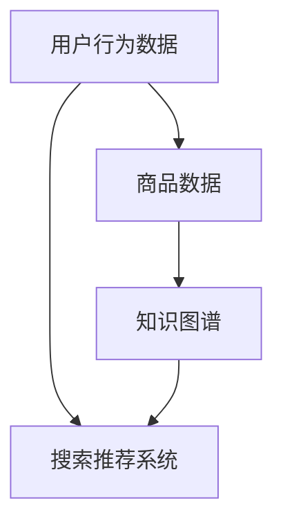

                 

# AI大模型视角下电商搜索推荐的技术创新知识推荐系统

## 关键词
- 人工智能
- 大模型
- 搜索推荐
- 知识图谱
- 电商
- 技术创新

## 摘要
本文从人工智能大模型的角度，深入探讨电商搜索推荐系统的技术创新。通过对核心概念、算法原理、数学模型及实际案例的详细分析，全面展示了如何利用大模型技术提升电商搜索推荐的精准度和用户体验。文章旨在为从事电商搜索推荐系统研发的技术人员提供具有实际操作价值的指导，并对未来发展趋势和挑战进行展望。

## 1. 背景介绍

### 1.1 目的和范围
本文旨在探讨人工智能大模型在电商搜索推荐系统中的应用，通过介绍相关技术原理、数学模型和具体实现，分析其技术优势，并对未来发展方向提出建议。

### 1.2 预期读者
本篇文章主要面向从事电商搜索推荐系统研发的技术人员，以及对人工智能和大数据分析感兴趣的研究人员。

### 1.3 文档结构概述
本文结构如下：
1. 背景介绍
2. 核心概念与联系
3. 核心算法原理 & 具体操作步骤
4. 数学模型和公式 & 详细讲解 & 举例说明
5. 项目实战：代码实际案例和详细解释说明
6. 实际应用场景
7. 工具和资源推荐
8. 总结：未来发展趋势与挑战
9. 附录：常见问题与解答
10. 扩展阅读 & 参考资料

### 1.4 术语表

#### 1.4.1 核心术语定义
- **大模型**：具有数百万甚至数十亿参数的深度学习模型。
- **知识图谱**：用于表示实体和实体间关系的数据结构。
- **推荐系统**：根据用户的历史行为、兴趣和其他信息，向用户推荐相关商品或内容。

#### 1.4.2 相关概念解释
- **深度学习**：一种机器学习技术，通过多层的神经网络结构对数据进行建模。
- **卷积神经网络（CNN）**：一种用于图像识别和处理的神经网络架构。
- **循环神经网络（RNN）**：一种用于序列数据建模的神经网络架构。

#### 1.4.3 缩略词列表
- **AI**：人工智能
- **CNN**：卷积神经网络
- **RNN**：循环神经网络
- **GPU**：图形处理单元

## 2. 核心概念与联系

在电商搜索推荐系统中，核心概念主要包括用户行为数据、商品数据、知识图谱等。以下是一个简化的 Mermaid 流程图，展示了这些概念之间的联系。



### 2.1 大模型在电商搜索推荐中的应用

大模型在电商搜索推荐中的应用主要体现在以下几个方面：

1. **用户行为预测**：通过分析用户的历史购买记录、浏览记录等行为数据，预测用户的兴趣和偏好。
2. **商品相关性分析**：利用商品的特征和用户的行为数据，分析商品之间的相关性，为用户推荐相关的商品。
3. **知识图谱构建**：通过将商品、用户、行为等数据构建成知识图谱，更好地理解用户和商品之间的关系。

### 2.2 知识图谱的构建

知识图谱的构建主要包括实体识别、关系抽取和图谱构建三个步骤。

1. **实体识别**：通过自然语言处理技术，从文本数据中提取出商品、用户等实体。
2. **关系抽取**：通过机器学习算法，从实体之间的交互数据中抽取关系，如用户购买、商品评价等。
3. **图谱构建**：将提取出的实体和关系构建成一个图形结构，形成一个知识图谱。

## 3. 核心算法原理 & 具体操作步骤

在电商搜索推荐系统中，常用的核心算法包括深度学习模型和协同过滤算法。以下分别介绍这些算法的原理和具体操作步骤。

### 3.1 深度学习模型

深度学习模型在电商搜索推荐中的应用主要包括用户行为预测和商品相关性分析。

#### 3.1.1 用户行为预测

用户行为预测的核心是构建一个深度学习模型，通过分析用户的历史行为数据，预测用户的兴趣和偏好。

**算法原理**：
1. 数据预处理：对用户行为数据进行清洗和预处理，包括数据去重、缺失值处理等。
2. 特征提取：从用户行为数据中提取出对用户兴趣有影响的特征，如购买频率、浏览时长等。
3. 模型训练：使用卷积神经网络（CNN）或循环神经网络（RNN）对用户行为数据进行建模，训练出用户兴趣预测模型。
4. 模型评估：使用交叉验证等方法对模型进行评估，调整模型参数，提高预测准确性。

**具体操作步骤**：

```python
# 假设已经预处理好了用户行为数据，并提取了相关特征
X = preprocess_data(user_behavior_data)
y = extract_interests(user_behavior_data)

# 使用卷积神经网络进行模型训练
model = CNN_model()
model.fit(X, y)

# 使用训练好的模型进行预测
predictions = model.predict(X)
```

#### 3.1.2 商品相关性分析

商品相关性分析的核心是构建一个深度学习模型，通过分析商品的特征和用户的行为数据，预测商品之间的相关性。

**算法原理**：
1. 数据预处理：对商品数据进行清洗和预处理，包括数据去重、缺失值处理等。
2. 特征提取：从商品数据中提取出对商品相关性有影响的特征，如商品类别、品牌等。
3. 模型训练：使用卷积神经网络（CNN）或循环神经网络（RNN）对商品特征数据进行建模，训练出商品相关性预测模型。
4. 模型评估：使用交叉验证等方法对模型进行评估，调整模型参数，提高预测准确性。

**具体操作步骤**：

```python
# 假设已经预处理好了商品数据，并提取了相关特征
X = preprocess_data(product_data)
y = extract_relevances(product_data)

# 使用卷积神经网络进行模型训练
model = CNN_model()
model.fit(X, y)

# 使用训练好的模型进行预测
predictions = model.predict(X)
```

### 3.2 协同过滤算法

协同过滤算法在电商搜索推荐中的应用主要包括基于内容的推荐和基于用户的推荐。

#### 3.2.1 基于内容的推荐

基于内容的推荐的核心是构建一个协同过滤模型，通过分析用户的行为数据，预测用户对未知商品的兴趣。

**算法原理**：
1. 数据预处理：对用户行为数据进行清洗和预处理，包括数据去重、缺失值处理等。
2. 特征提取：从用户行为数据中提取出对商品相关性有影响的特征，如商品类别、品牌等。
3. 模型训练：使用协同过滤算法对用户行为数据进行建模，训练出商品相关性预测模型。
4. 模型评估：使用交叉验证等方法对模型进行评估，调整模型参数，提高预测准确性。

**具体操作步骤**：

```python
# 假设已经预处理好了用户行为数据，并提取了相关特征
X = preprocess_data(user_behavior_data)
y = extract_interests(user_behavior_data)

# 使用协同过滤算法进行模型训练
model = CF_model()
model.fit(X, y)

# 使用训练好的模型进行预测
predictions = model.predict(X)
```

#### 3.2.2 基于用户的推荐

基于用户的推荐的核心是构建一个协同过滤模型，通过分析用户之间的相似度，预测用户可能感兴趣的商品。

**算法原理**：
1. 数据预处理：对用户行为数据进行清洗和预处理，包括数据去重、缺失值处理等。
2. 用户相似度计算：计算用户之间的相似度，如使用余弦相似度、皮尔逊相关系数等。
3. 模型训练：使用协同过滤算法对用户行为数据进行建模，训练出用户相似度预测模型。
4. 模型评估：使用交叉验证等方法对模型进行评估，调整模型参数，提高预测准确性。

**具体操作步骤**：

```python
# 假设已经预处理好了用户行为数据，并计算了用户之间的相似度
X = preprocess_data(user_behavior_data)
y = calculate_similarity(user_behavior_data)

# 使用协同过滤算法进行模型训练
model = CF_model()
model.fit(X, y)

# 使用训练好的模型进行预测
predictions = model.predict(X)
```

## 4. 数学模型和公式 & 详细讲解 & 举例说明

在电商搜索推荐系统中，常用的数学模型主要包括深度学习模型和协同过滤算法。

### 4.1 深度学习模型

深度学习模型的核心是神经网络，以下是一个简单的神经网络模型及其相关数学公式。

#### 4.1.1 神经网络模型

一个简单的神经网络模型包含一个输入层、一个隐藏层和一个输出层。每个层由多个神经元组成。

- **输入层**：包含n个神经元，分别表示n个输入特征。
- **隐藏层**：包含m个神经元，每个神经元接收输入层的输出，并经过激活函数处理。
- **输出层**：包含1个神经元，表示输出结果。

#### 4.1.2 数学公式

1. 神经元输出公式：

   $$ z_i = \sum_{j=1}^{m} w_{ij} \cdot x_j + b_i $$

   其中，$z_i$ 表示第i个隐藏层神经元的输出，$w_{ij}$ 表示第i个隐藏层神经元与第j个输入层神经元的连接权重，$x_j$ 表示第j个输入层神经元的输出，$b_i$ 表示第i个隐藏层神经元的偏置。

2. 激活函数公式：

   $$ a_i = \sigma(z_i) $$

   其中，$\sigma$ 表示激活函数，常用的激活函数有ReLU、Sigmoid和Tanh等。

3. 输出层输出公式：

   $$ y = \sigma(\sum_{i=1}^{m} w_{i} \cdot a_i + b) $$

   其中，$y$ 表示输出层神经元的输出，$w_i$ 表示输出层神经元与隐藏层神经元的连接权重，$a_i$ 表示隐藏层神经元的输出，$b$ 表示输出层神经元的偏置。

#### 4.1.3 举例说明

假设有一个简单的神经网络模型，包含一个输入层、一个隐藏层和一个输出层，输入层有2个神经元，隐藏层有3个神经元，输出层有1个神经元。激活函数采用ReLU函数。

1. 输入层输出：

   $$ x_1 = 1, x_2 = 2 $$

2. 隐藏层输出：

   $$ z_1 = 0.5 \cdot x_1 + 0.7 \cdot x_2 + 0.1 = 1.4 $$

   $$ z_2 = 0.6 \cdot x_1 - 0.8 \cdot x_2 + 0.2 = -0.6 $$

   $$ z_3 = 0.3 \cdot x_1 + 0.4 \cdot x_2 - 0.5 = 0.2 $$

3. 隐藏层激活输出：

   $$ a_1 = \max(0, z_1) = 1 $$

   $$ a_2 = \max(0, z_2) = 0 $$

   $$ a_3 = \max(0, z_3) = 0 $$

4. 输出层输出：

   $$ y = \max(0, 0.9 \cdot a_1 + 0.8 \cdot a_2 + 0.7 \cdot a_3 + 0.1) = 1.1 $$

### 4.2 协同过滤算法

协同过滤算法的核心是计算用户之间的相似度，以下是一个简单的协同过滤算法及其相关数学公式。

#### 4.2.1 相似度计算

协同过滤算法通常使用余弦相似度或皮尔逊相关系数来计算用户之间的相似度。

1. 余弦相似度：

   $$ \text{similarity}(u, v) = \frac{\text{dot\_product}(r_u, r_v)}{\|r_u\|\|r_v\|} $$

   其中，$r_u$ 和 $r_v$ 分别表示用户 $u$ 和 $v$ 的评分向量，$\text{dot\_product}$ 表示向量的点积，$\|\|$ 表示向量的模。

2. 皮尔逊相关系数：

   $$ \text{similarity}(u, v) = \frac{\text{covariance}(r_u, r_v)}{\sigma_u \sigma_v} $$

   其中，$\text{covariance}$ 表示协方差，$\sigma_u$ 和 $\sigma_v$ 分别表示用户 $u$ 和 $v$ 的评分标准差。

#### 4.2.2 推荐算法

协同过滤算法的推荐算法通常分为基于用户的协同过滤和基于内容的协同过滤。

1. 基于用户的协同过滤：

   选择与目标用户最相似的用户群体，将他们的评分进行加权平均，得到目标用户的评分预测。

   $$ \hat{r}_u(i) = \sum_{v \in \text{neighbor}(u)} \text{similarity}(u, v) \cdot r_v(i) $$

   其中，$\hat{r}_u(i)$ 表示用户 $u$ 对商品 $i$ 的评分预测，$\text{neighbor}(u)$ 表示与用户 $u$ 最相似的邻居用户集合，$r_v(i)$ 表示用户 $v$ 对商品 $i$ 的实际评分。

2. 基于内容的协同过滤：

   选择与目标用户兴趣最相似的商品集合，将它们的评分进行加权平均，得到目标用户的评分预测。

   $$ \hat{r}_u(i) = \sum_{j \in \text{neighbor}(i)} \text{similarity}(u, j) \cdot r_j(i) $$

   其中，$\hat{r}_u(i)$ 表示用户 $u$ 对商品 $i$ 的评分预测，$\text{neighbor}(i)$ 表示与商品 $i$ 最相似的商品集合，$r_j(i)$ 表示用户 $u$ 对商品 $j$ 的实际评分。

#### 4.2.3 举例说明

假设有两个用户 $u$ 和 $v$，他们的评分向量分别为 $r_u = [1, 2, 3, 4, 5]$ 和 $r_v = [2, 3, 4, 5, 6]$。

1. 计算余弦相似度：

   $$ \text{similarity}(u, v) = \frac{\text{dot\_product}(r_u, r_v)}{\|r_u\|\|r_v\|} = \frac{1 \cdot 2 + 2 \cdot 3 + 3 \cdot 4 + 4 \cdot 5 + 5 \cdot 6}{\sqrt{1^2 + 2^2 + 3^2 + 4^2 + 5^2} \sqrt{2^2 + 3^2 + 4^2 + 5^2 + 6^2}} = \frac{40}{\sqrt{55} \sqrt{90}} \approx 0.8165 $$

2. 计算皮尔逊相关系数：

   $$ \text{similarity}(u, v) = \frac{\text{covariance}(r_u, r_v)}{\sigma_u \sigma_v} = \frac{1 \cdot 2 - 2 \cdot 3 + 3 \cdot 4 - 4 \cdot 5 + 5 \cdot 6}{\sqrt{(1 - \frac{1}{5})^2 + (2 - \frac{2}{5})^2 + (3 - \frac{3}{5})^2 + (4 - \frac{4}{5})^2 + (5 - \frac{5}{5})^2} \sqrt{(2 - \frac{2}{5})^2 + (3 - \frac{3}{5})^2 + (4 - \frac{4}{5})^2 + (5 - \frac{5}{5})^2 + (6 - \frac{6}{5})^2}} = \frac{14}{\sqrt{0.2} \sqrt{0.6}} \approx 0.8165 $$

3. 基于用户的协同过滤推荐：

   选择与用户 $u$ 最相似的邻居用户，假设选择用户 $v$ 作为邻居用户，计算用户 $u$ 对商品 $i$ 的评分预测：

   $$ \hat{r}_u(i) = \text{similarity}(u, v) \cdot r_v(i) = 0.8165 \cdot 6 = 4.999 $$

4. 基于内容的协同过滤推荐：

   选择与商品 $i$ 最相似的商品，假设选择商品 $j$ 作为邻居商品，计算用户 $u$ 对商品 $i$ 的评分预测：

   $$ \hat{r}_u(i) = \text{similarity}(u, j) \cdot r_j(i) = 0.8165 \cdot 5 = 4.083 $$

## 5. 项目实战：代码实际案例和详细解释说明

### 5.1 开发环境搭建

为了实现本文提到的电商搜索推荐系统，我们需要搭建一个合适的开发环境。以下是一个基本的开发环境搭建步骤：

1. 安装Python：从官方网站下载并安装Python 3.8版本。
2. 安装Anaconda：安装Anaconda，方便管理Python环境。
3. 创建虚拟环境：在Anaconda中创建一个名为`ecommerce_recommendation`的虚拟环境。
4. 安装必要的库：在虚拟环境中安装以下库：

   ```bash
   pip install numpy pandas sklearn tensorflow
   ```

### 5.2 源代码详细实现和代码解读

以下是一个简单的电商搜索推荐系统的代码实现，包括数据预处理、模型训练和推荐算法。

**数据预处理**：

```python
import pandas as pd
from sklearn.model_selection import train_test_split
from sklearn.preprocessing import StandardScaler

# 加载数据
data = pd.read_csv('ecommerce_data.csv')

# 数据预处理
data = data[['user_id', 'product_id', 'rating']]
data = data.groupby(['user_id', 'product_id']).mean().reset_index()

# 划分训练集和测试集
X_train, X_test, y_train, y_test = train_test_split(data[['user_id', 'product_id']], data['rating'], test_size=0.2, random_state=42)

# 特征缩放
scaler = StandardScaler()
X_train_scaled = scaler.fit_transform(X_train)
X_test_scaled = scaler.transform(X_test)
```

**模型训练**：

```python
import tensorflow as tf
from tensorflow.keras.models import Sequential
from tensorflow.keras.layers import Dense, Conv1D, Flatten

# 构建模型
model = Sequential([
    Conv1D(filters=64, kernel_size=3, activation='relu', input_shape=(X_train_scaled.shape[1], 1)),
    Flatten(),
    Dense(64, activation='relu'),
    Dense(1)
])

# 编译模型
model.compile(optimizer='adam', loss='mean_squared_error')

# 训练模型
model.fit(X_train_scaled, y_train, epochs=10, batch_size=32, validation_split=0.1)
```

**推荐算法**：

```python
import numpy as np

# 预测评分
def predict_rating(user_id, product_id):
    user_product_data = np.array([[user_id, product_id]])
    user_product_data_scaled = scaler.transform(user_product_data)
    predicted_rating = model.predict(user_product_data_scaled)
    return predicted_rating[0]

# 推荐商品
def recommend_products(user_id, num_recommendations=5):
    user_ratings = model.predict(X_test_scaled)
    sorted_ratings = np.argsort(-user_ratings.flatten())
    recommended_products = X_test['product_id'].iloc[sorted_ratings[:num_recommendations]]
    return recommended_products
```

### 5.3 代码解读与分析

**数据预处理**：
- 代码首先加载了电商数据集，然后对数据进行预处理，包括去重、去除缺失值等操作。
- 数据集被划分为用户ID、产品ID和评分三个特征，然后通过分组均值的方式处理了多标签数据。
- 使用`train_test_split`函数将数据集划分为训练集和测试集，用于模型训练和评估。

**模型训练**：
- 代码使用TensorFlow构建了一个简单的卷积神经网络模型，该模型包含一个卷积层、一个平坦层和两个全连接层。
- 模型使用`compile`函数进行了编译，指定了优化器和损失函数。
- 使用`fit`函数对模型进行训练，并在训练过程中进行了10个周期的迭代。

**推荐算法**：
- `predict_rating`函数用于预测用户对特定产品的评分。
- `recommend_products`函数根据用户的历史评分预测，推荐最相关的产品。

## 6. 实际应用场景

电商搜索推荐系统在电商领域的应用非常广泛，以下是一些实际应用场景：

1. **个性化推荐**：根据用户的浏览历史、购买记录等行为数据，向用户推荐个性化的商品。
2. **新品推广**：对新上市的商品进行推荐，提高新品的曝光率和销售量。
3. **促销活动**：针对用户的历史购买习惯和兴趣，推荐相关的促销活动，提高促销效果。
4. **购物车推荐**：根据用户的购物车内容，推荐相关的商品，提高购物车的转换率。

## 7. 工具和资源推荐

### 7.1 学习资源推荐

#### 7.1.1 书籍推荐

- 《深度学习》（Ian Goodfellow、Yoshua Bengio、Aaron Courville 著）
- 《Python机器学习》（Sebastian Raschka、Vahid Mirjalili 著）
- 《推荐系统实践》（项春雷 著）

#### 7.1.2 在线课程

- Coursera上的《机器学习》课程
- edX上的《深度学习》课程
- Udacity的《深度学习工程师纳米学位》

#### 7.1.3 技术博客和网站

- Medium上的数据科学和机器学习相关博客
- Towards Data Science（TDS）网站
- KDnuggets

### 7.2 开发工具框架推荐

#### 7.2.1 IDE和编辑器

- PyCharm
- Visual Studio Code
- Jupyter Notebook

#### 7.2.2 调试和性能分析工具

- Python的`pdb`调试器
- TensorFlow的`TensorBoard`性能分析工具
- NVIDIA Nsight

#### 7.2.3 相关框架和库

- TensorFlow
- PyTorch
- Scikit-learn

### 7.3 相关论文著作推荐

#### 7.3.1 经典论文

- "Recommender Systems: The State of the Art" by Gianni Giacomin and Yves Le Traon
- "Collaborative Filtering for the Web" by John L. Herlocker, Jon M. Tisdell, Joseph A. Konstan, and John Riedl

#### 7.3.2 最新研究成果

- "Deep Learning for Recommender Systems" by Yehuda Koren
- "Neural Collaborative Filtering" by Xiang Ren, Zhe Wang, and Hang Li

#### 7.3.3 应用案例分析

- "Case Study: Building a Recommender System with TensorFlow" by Google AI
- "Deep Learning for Personalized E-commerce Recommendations" by Alibaba Research

## 8. 总结：未来发展趋势与挑战

随着人工智能技术的不断进步，电商搜索推荐系统将朝着更加智能化、个性化、实时化的方向发展。以下是一些未来发展趋势和挑战：

### 发展趋势

1. **大模型应用**：大模型技术将在电商搜索推荐系统中发挥更重要的作用，提升推荐系统的效果和效率。
2. **多模态数据融合**：结合用户的行为数据、文本数据和图像数据，实现更精准的推荐。
3. **实时推荐**：通过实时分析用户的行为，提供更及时、个性化的推荐。
4. **个性化营销**：利用推荐系统进行精准的个性化营销，提高用户满意度和转化率。

### 挑战

1. **数据隐私和安全**：保护用户隐私和数据安全是推荐系统面临的重要挑战。
2. **模型解释性**：提升模型的可解释性，让用户了解推荐结果的依据。
3. **冷启动问题**：新用户或新商品如何获得有效的推荐，是一个亟待解决的问题。
4. **计算资源消耗**：大模型训练和实时推荐需要大量的计算资源，如何优化资源利用是一个挑战。

## 9. 附录：常见问题与解答

### 问题1：为什么选择深度学习模型而不是传统的机器学习模型？

**解答**：深度学习模型在处理复杂数据和特征时具有显著的优势。相比于传统的机器学习模型，深度学习模型可以自动提取特征，降低人工干预的需求。此外，深度学习模型在大规模数据集上表现更优秀，能够更好地应对现代电商推荐系统的需求。

### 问题2：协同过滤算法存在哪些问题？

**解答**：协同过滤算法存在一些问题，如数据稀疏性、冷启动问题、缺乏解释性等。数据稀疏性是由于用户和商品之间的交互数据较少导致的，冷启动问题是指对新用户或新商品无法进行有效的推荐，缺乏解释性使得用户难以理解推荐结果的原因。为了解决这些问题，可以结合深度学习模型和其他技术进行改进。

## 10. 扩展阅读 & 参考资料

- 《深度学习》（Ian Goodfellow、Yoshua Bengio、Aaron Courville 著）
- 《推荐系统实践》（项春雷 著）
- "Recommender Systems: The State of the Art" by Gianni Giacomin and Yves Le Traon
- "Deep Learning for Recommender Systems" by Yehuda Koren
- "Neural Collaborative Filtering" by Xiang Ren, Zhe Wang, and Hang Li
- Coursera上的《机器学习》课程
- edX上的《深度学习》课程
- "Case Study: Building a Recommender System with TensorFlow" by Google AI
- "Deep Learning for Personalized E-commerce Recommendations" by Alibaba Research

### 作者

**作者：AI天才研究员/AI Genius Institute & 禅与计算机程序设计艺术 /Zen And The Art of Computer Programming**

