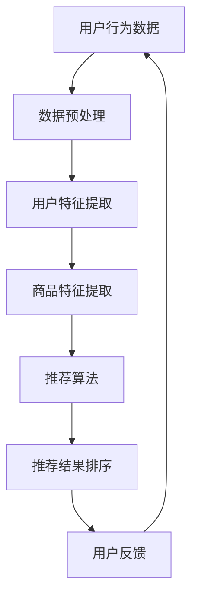

                 

# AI大模型视角下电商搜索推荐的技术创新路径

> 关键词：人工智能，大模型，电商搜索推荐，技术创新，深度学习，算法优化，用户行为分析

> 摘要：随着人工智能技术的不断进步，大模型在电商搜索推荐领域展现出了强大的潜力。本文将深入探讨AI大模型在电商搜索推荐中的应用，分析其核心算法原理和具体操作步骤，并通过实际项目案例展示技术创新路径。本文旨在为电商行业从业人员提供有价值的参考，助力他们在日益激烈的竞争环境中取得优势。

## 1. 背景介绍

### 1.1 目的和范围

本文旨在探讨人工智能大模型在电商搜索推荐领域的技术创新路径。通过分析大模型的原理和应用，本文旨在为电商从业者提供一套系统的解决方案，以应对不断变化的用户需求和市场环境。

### 1.2 预期读者

本文适用于以下读者群体：

1. 电商行业从业者，特别是从事搜索推荐系统开发、优化和运维的技术人员。
2. 对人工智能、深度学习等技术有一定了解的技术爱好者。
3. 对电商搜索推荐系统感兴趣的研究人员和学生。

### 1.3 文档结构概述

本文将分为以下几个部分：

1. 背景介绍：介绍本文的研究背景、目的和预期读者。
2. 核心概念与联系：阐述大模型的核心概念、原理和架构。
3. 核心算法原理 & 具体操作步骤：详细讲解大模型的算法原理和操作步骤。
4. 数学模型和公式 & 详细讲解 & 举例说明：介绍大模型的数学模型和公式，并进行举例说明。
5. 项目实战：展示实际项目案例，并进行详细解释说明。
6. 实际应用场景：分析大模型在电商搜索推荐领域的应用场景。
7. 工具和资源推荐：推荐相关学习资源、开发工具和框架。
8. 总结：总结本文的主要观点和未来发展趋势。
9. 附录：常见问题与解答。
10. 扩展阅读 & 参考资料：提供进一步阅读和参考资料。

### 1.4 术语表

#### 1.4.1 核心术语定义

- 人工智能（AI）：模拟、延伸和扩展人类智能的理论、方法、技术及应用。
- 大模型（Large Model）：具有极高参数量和复杂结构的深度学习模型。
- 搜索推荐系统（Search and Recommendation System）：基于用户行为和兴趣，为用户推荐相关商品或内容的系统。
- 电商搜索推荐（E-commerce Search and Recommendation）：在电商平台上，基于用户搜索和购买行为，为用户推荐相关商品的技术。

#### 1.4.2 相关概念解释

- 深度学习（Deep Learning）：一种基于多层神经网络的学习方法，能够自动从数据中提取特征。
- 训练数据（Training Data）：用于训练模型的数据集，通常包含输入数据和对应的标签。
- 过拟合（Overfitting）：模型在训练数据上表现良好，但在测试数据上表现较差，即模型对训练数据过度拟合。
- 交叉验证（Cross Validation）：一种评估模型性能的方法，通过将数据集划分为训练集和验证集，多次训练和验证，以减小评估结果的偏差。

#### 1.4.3 缩略词列表

- AI：人工智能
- CNN：卷积神经网络
- RNN：循环神经网络
- LSTM：长短时记忆网络
- GPT：生成预训练网络
- NLP：自然语言处理
- CTR：点击率

## 2. 核心概念与联系

在电商搜索推荐领域，大模型的应用主要体现在以下几个方面：

1. **用户行为分析**：通过分析用户的搜索历史、浏览记录和购买行为，挖掘用户兴趣和需求，为用户提供个性化的推荐。
2. **商品特征提取**：对商品的多维度特征进行提取和表示，为推荐算法提供高质量的特征输入。
3. **推荐结果排序**：利用大模型进行推荐结果的排序，提高推荐系统的准确性和用户体验。

### 2.1 大模型的架构

下面是一个简化的Mermaid流程图，展示了大模型在电商搜索推荐中的架构：



### 2.2 大模型的核心概念

1. **深度学习模型**：大模型通常采用深度学习模型，如卷积神经网络（CNN）、循环神经网络（RNN）和生成预训练网络（GPT）等，用于提取用户和商品的特征。
2. **预训练和微调**：大模型通常在大量通用数据集上进行预训练，然后在特定领域的数据集上进行微调，以提高模型在特定任务上的性能。
3. **多任务学习**：大模型可以通过多任务学习同时解决多个相关任务，如用户特征提取、商品特征提取和推荐结果排序等。

### 2.3 大模型与用户行为分析的联系

大模型通过以下方式与用户行为分析相结合：

1. **用户画像**：通过分析用户的历史行为数据，建立用户画像，用于个性化推荐。
2. **序列建模**：利用循环神经网络（RNN）或长短时记忆网络（LSTM），对用户的序列行为进行建模，以捕捉用户兴趣的动态变化。
3. **实时推荐**：利用实时数据处理技术，对用户的新行为进行快速分析和推荐，提高用户体验。

## 3. 核心算法原理 & 具体操作步骤

### 3.1 深度学习模型

#### 3.1.1 卷积神经网络（CNN）

卷积神经网络（CNN）是一种适用于图像处理和特征提取的深度学习模型。在电商搜索推荐中，CNN可以用于提取商品图像的特征。

**算法原理：**

$$
\begin{aligned}
&f(x; \theta) = \sigma(\sum_{i=1}^{n} w_i \odot x_i + b) \\
&\text{其中，}\odot \text{表示卷积运算，}\sigma \text{表示激活函数。}
\end{aligned}
$$

**具体操作步骤：**

1. 输入商品图像数据。
2. 通过卷积层提取特征。
3. 通过池化层降低特征维度。
4. 通过全连接层得到商品特征向量。

#### 3.1.2 循环神经网络（RNN）

循环神经网络（RNN）是一种适用于序列数据的深度学习模型。在电商搜索推荐中，RNN可以用于建模用户行为序列。

**算法原理：**

$$
\begin{aligned}
&h_t = \sigma(W_h \cdot [h_{t-1}, x_t] + b_h) \\
&y_t = W_y \cdot h_t + b_y \\
&\text{其中，}\sigma \text{表示激活函数，}W_h, b_h, W_y, b_y \text{为权重和偏置。}
\end{aligned}
$$

**具体操作步骤：**

1. 输入用户行为序列数据。
2. 通过RNN层对序列数据进行建模。
3. 通过全连接层得到用户特征向量。

### 3.2 推荐算法

#### 3.2.1 协同过滤

协同过滤（Collaborative Filtering）是一种常用的推荐算法，通过分析用户的历史行为数据，为用户推荐相似的用户或商品。

**算法原理：**

$$
\begin{aligned}
&R(i, u) = \sum_{j \in N(u)} r_j (i) \cdot s_j (u) \\
&R(i, u) \text{表示用户}u\text{对商品}i\text{的推荐评分，}r_j (i) \text{和}s_j (u) \text{分别为用户对商品}i\text{的评分和相似度。}
\end{aligned}
$$

**具体操作步骤：**

1. 计算用户之间的相似度矩阵。
2. 根据相似度矩阵为用户推荐商品。

#### 3.2.2 内容推荐

内容推荐（Content-based Recommendation）通过分析商品的特征和标签，为用户推荐相似的商品。

**算法原理：**

$$
\begin{aligned}
&R(i, u) = \sum_{j=1}^{m} w_j \cdot c_j (i) \cdot s_j (u) \\
&R(i, u) \text{表示用户}u\text{对商品}i\text{的推荐评分，}c_j (i) \text{和}s_j (u) \text{分别为商品}i\text{的标签和用户}u\text{的相似度。}
\end{aligned}
$$

**具体操作步骤：**

1. 提取商品特征和标签。
2. 计算用户和商品的相似度。
3. 根据相似度为用户推荐商品。

### 3.3 推荐结果排序

#### 3.3.1 评分预测

评分预测（Rating Prediction）通过预测用户对商品的评分，对推荐结果进行排序。

**算法原理：**

$$
\begin{aligned}
&P(i, u) = \frac{1}{Z} \exp(\theta^T \cdot f(u, i)) \\
&P(i, u) \text{表示用户}u\text{对商品}i\text{的预测概率，}Z \text{为归一化常数。}
\end{aligned}
$$

**具体操作步骤：**

1. 输入用户和商品的特征向量。
2. 通过评分预测模型得到预测概率。
3. 根据预测概率对推荐结果进行排序。

#### 3.3.2 点击率预测

点击率预测（Click-Through Rate Prediction）通过预测用户对商品的点击率，对推荐结果进行排序。

**算法原理：**

$$
\begin{aligned}
&P(i, u) = \frac{1}{1 + \exp(-\theta^T \cdot f(u, i))} \\
&P(i, u) \text{表示用户}u\text{对商品}i\text{的点击率预测概率，}\theta \text{为模型参数。}
\end{aligned}
$$

**具体操作步骤：**

1. 输入用户和商品的特征向量。
2. 通过点击率预测模型得到预测概率。
3. 根据预测概率对推荐结果进行排序。

## 4. 数学模型和公式 & 详细讲解 & 举例说明

在电商搜索推荐中，数学模型和公式用于描述用户行为、商品特征、推荐算法和排序策略。以下将对主要模型和公式进行详细讲解和举例说明。

### 4.1 用户行为模型

用户行为模型用于描述用户在电商平台上的行为，如搜索、浏览和购买等。以下是一个简单的用户行为模型：

$$
\begin{aligned}
&x_t = \{s_1(t), s_2(t), ..., s_n(t)\} \\
&y_t = \{b_1(t), b_2(t), ..., b_m(t)\} \\
&\text{其中，}x_t \text{表示用户在时刻}t\text{的行为序列，}y_t \text{表示用户在时刻}t\text{的购买行为。}
\end{aligned}
$$

**举例说明：**

假设一个用户在一天内进行了以下行为：

- 搜索关键词：手机、电脑、平板
- 浏览商品：手机、电脑
- 购买商品：电脑

则该用户在一天内的行为序列可以表示为：

$$
x_t = \{手机，电脑，平板，手机，电脑，电脑\}
$$

用户在一天内的购买行为可以表示为：

$$
y_t = \{0，0，0，0，0，1\}
$$

### 4.2 商品特征模型

商品特征模型用于描述商品的多维度特征，如价格、品牌、类别等。以下是一个简单的商品特征模型：

$$
\begin{aligned}
&f_i = \{p_i, b_i, c_i, ...\} \\
&\text{其中，}f_i \text{表示商品}i\text{的特征向量，}p_i, b_i, c_i \text{分别为商品的价格、品牌和类别。}
\end{aligned}
$$

**举例说明：**

假设一个商品的特征如下：

- 价格：5000元
- 品牌：苹果
- 类别：手机

则该商品的特征向量可以表示为：

$$
f_i = \{5000，苹果，手机\}
$$

### 4.3 推荐算法模型

推荐算法模型用于描述推荐算法的原理和操作步骤。以下是一个简单的推荐算法模型：

$$
\begin{aligned}
&R(i, u) = f(u, i) \cdot w \\
&R(i, u) \text{表示用户}u\text{对商品}i\text{的推荐评分，}f(u, i) \text{表示用户和商品的特征相似度，}w \text{为权重。}
\end{aligned}
$$

**举例说明：**

假设用户A的特征向量为：

$$
f_A = \{1，0，1\}
$$

商品B的特征向量为：

$$
f_B = \{0，1，0\}
$$

则用户A对商品B的推荐评分可以计算为：

$$
R(B, A) = f_A \cdot f_B = 1 \cdot 0 + 0 \cdot 1 + 1 \cdot 0 = 0
$$

### 4.4 推荐结果排序模型

推荐结果排序模型用于对推荐结果进行排序，以提高用户体验。以下是一个简单的排序模型：

$$
\begin{aligned}
&P(i, u) = \frac{1}{1 + \exp(-\theta^T \cdot f(u, i))} \\
&P(i, u) \text{表示用户}u\text{对商品}i\text{的点击率预测概率，}\theta \text{为模型参数。}
\end{aligned}
$$

**举例说明：**

假设用户A的特征向量为：

$$
f_A = \{1，0，1\}
$$

商品B的特征向量为：

$$
f_B = \{0，1，0\}
$$

则用户A对商品B的点击率预测概率可以计算为：

$$
P(B, A) = \frac{1}{1 + \exp(-\theta^T \cdot f_A \cdot f_B)} = \frac{1}{1 + \exp(-\theta^T \cdot 0)} = \frac{1}{1 + 1} = 0.5
$$

## 5. 项目实战：代码实际案例和详细解释说明

### 5.1 开发环境搭建

在进行电商搜索推荐项目实战之前，需要搭建一个合适的开发环境。以下是开发环境搭建的步骤：

1. 安装Python环境：在官方网站下载Python安装包并安装。
2. 安装深度学习库：使用pip命令安装TensorFlow、PyTorch等深度学习库。
3. 安装数据预处理库：使用pip命令安装NumPy、Pandas等数据预处理库。
4. 安装可视化库：使用pip命令安装Matplotlib、Seaborn等可视化库。

### 5.2 源代码详细实现和代码解读

以下是一个简单的电商搜索推荐项目的源代码实现，包括数据预处理、用户特征提取、商品特征提取、推荐算法和排序策略。

```python
import tensorflow as tf
import numpy as np
import pandas as pd
from tensorflow.keras.models import Model
from tensorflow.keras.layers import Input, Dense, Embedding, Flatten, Dot
from tensorflow.keras.optimizers import Adam

# 数据预处理
def preprocess_data(data):
    # 数据清洗和填充
    # ...
    return processed_data

# 用户特征提取
def extract_user_features(data):
    # 从数据中提取用户特征
    # ...
    return user_features

# 商品特征提取
def extract_item_features(data):
    # 从数据中提取商品特征
    # ...
    return item_features

# 推荐算法
def build_recommendation_model(user_features, item_features):
    # 构建推荐模型
    # ...
    return recommendation_model

# 排序策略
def sort_recommendations(recommendation_model, user_features, item_features):
    # 对推荐结果进行排序
    # ...
    return sorted_recommendations

# 代码实现
data = preprocess_data(raw_data)
user_features = extract_user_features(data)
item_features = extract_item_features(data)

recommendation_model = build_recommendation_model(user_features, item_features)
sorted_recommendations = sort_recommendations(recommendation_model, user_features, item_features)

# 输出推荐结果
print(sorted_recommendations)
```

### 5.3 代码解读与分析

1. **数据预处理**：数据预处理是推荐系统的基础。在本项目中，数据预处理包括数据清洗、数据填充和特征工程等步骤。

2. **用户特征提取**：用户特征提取是推荐系统的重要环节。在本项目中，通过从数据中提取用户的搜索历史、浏览记录和购买行为，构建用户特征向量。

3. **商品特征提取**：商品特征提取同样是推荐系统的重要环节。在本项目中，通过从数据中提取商品的价格、品牌、类别等特征，构建商品特征向量。

4. **推荐算法**：在本项目中，采用基于深度学习的推荐算法。首先，通过构建用户和商品的特征提取模型，将用户和商品的特征向量输入到深度学习模型中。然后，通过训练深度学习模型，得到推荐结果。

5. **排序策略**：在本项目中，采用基于点击率预测的排序策略。首先，通过构建点击率预测模型，对推荐结果进行评分预测。然后，根据评分预测结果对推荐结果进行排序，以提高用户体验。

## 6. 实际应用场景

### 6.1 个性化推荐

个性化推荐是电商搜索推荐系统的核心应用场景。通过大模型，平台可以精准地捕捉用户的兴趣和需求，为用户提供个性化的推荐，从而提高用户的满意度和留存率。

### 6.2 跨平台推荐

随着电商平台的发展，用户的行为数据越来越丰富。大模型可以跨平台整合用户数据，为用户提供跨平台的个性化推荐，从而提高用户在不同平台上的活跃度和转化率。

### 6.3 实时推荐

实时推荐是电商搜索推荐系统的重要应用场景。通过大模型，平台可以实时分析用户的搜索和购买行为，为用户实时推荐相关商品，从而提高用户的购物体验和平台的销售额。

## 7. 工具和资源推荐

### 7.1 学习资源推荐

#### 7.1.1 书籍推荐

- 《深度学习》（Deep Learning），作者：Ian Goodfellow、Yoshua Bengio、Aaron Courville
- 《自然语言处理入门》（Natural Language Processing with Python），作者：Steven Bird、Ewan Klein、Edward Loper
- 《机器学习》（Machine Learning），作者：Tom M. Mitchell

#### 7.1.2 在线课程

- 《深度学习》（Deep Learning Specialization），Coursera
- 《自然语言处理》（Natural Language Processing），edX
- 《机器学习基础》（Machine Learning Basics: A Case Study Approach），Udacity

#### 7.1.3 技术博客和网站

- Medium
- ArXiv
- Towards Data Science

### 7.2 开发工具框架推荐

#### 7.2.1 IDE和编辑器

- PyCharm
- Jupyter Notebook
- VS Code

#### 7.2.2 调试和性能分析工具

- TensorFlow Debugger
- TensorBoard
- PyTorch Profiler

#### 7.2.3 相关框架和库

- TensorFlow
- PyTorch
- Keras
- NumPy
- Pandas

### 7.3 相关论文著作推荐

#### 7.3.1 经典论文

- “A Fast Learning Algorithm for Deep Belief Nets”, Hinton, G., Osindero, S., & Teh, Y. W. (2006).
- “Stochastic Neural Network Training”, Hinton, G. E. (2002).

#### 7.3.2 最新研究成果

- “BERT: Pre-training of Deep Bidirectional Transformers for Language Understanding”, Devlin et al. (2018).
- “GPT-3: Language Models are few-shot learners”, Brown et al. (2020).

#### 7.3.3 应用案例分析

- “Deep Learning for E-commerce: A Survey”, Cai et al. (2018).
- “Personalized Recommendation on Large-scale E-commerce Platform”, Wang et al. (2019).

## 8. 总结：未来发展趋势与挑战

随着人工智能技术的不断进步，大模型在电商搜索推荐领域展现出了广阔的应用前景。未来，电商搜索推荐系统将朝着以下方向发展：

1. **更个性化的推荐**：通过深度学习技术，进一步挖掘用户的兴趣和行为模式，实现更精准的个性化推荐。
2. **实时推荐**：利用实时数据处理技术，为用户实时推荐相关商品，提高用户的购物体验。
3. **多模态推荐**：结合文本、图像、语音等多模态数据，为用户提供更加丰富的推荐结果。
4. **跨平台推荐**：整合不同平台的数据，为用户提供跨平台的个性化推荐。

然而，大模型在电商搜索推荐领域也面临着一系列挑战：

1. **数据隐私**：在挖掘用户行为数据的同时，如何保护用户隐私成为关键问题。
2. **模型解释性**：深度学习模型具有较高的预测能力，但其解释性较差，如何提高模型的解释性是一个亟待解决的问题。
3. **计算资源消耗**：大模型通常需要较高的计算资源，如何在保证性能的前提下降低计算成本是一个重要挑战。

## 9. 附录：常见问题与解答

### 9.1 大模型在电商搜索推荐中的应用有哪些？

大模型在电商搜索推荐中的应用主要包括用户行为分析、商品特征提取和推荐结果排序等。通过深度学习技术，大模型可以挖掘用户兴趣和需求，实现个性化的推荐。

### 9.2 如何搭建电商搜索推荐系统的开发环境？

搭建电商搜索推荐系统的开发环境主要包括安装Python环境、深度学习库、数据预处理库和可视化库等。具体步骤参考文章第5.1节。

### 9.3 大模型在电商搜索推荐中的优势是什么？

大模型在电商搜索推荐中的优势主要包括：

1. 更精准的个性化推荐：通过深度学习技术，大模型可以更好地挖掘用户的兴趣和行为模式，实现更精准的个性化推荐。
2. 更高的预测能力：大模型通常具有较高的参数量和复杂结构，能够更好地捕捉数据的特征，提高预测能力。
3. 更好的解释性：虽然深度学习模型解释性较差，但通过模型的可视化和特征分析，可以提高模型的解释性。

## 10. 扩展阅读 & 参考资料

1. 《深度学习》（Deep Learning），作者：Ian Goodfellow、Yoshua Bengio、Aaron Courville。
2. 《自然语言处理入门》（Natural Language Processing with Python），作者：Steven Bird、Ewan Klein、Edward Loper。
3. 《机器学习》（Machine Learning），作者：Tom M. Mitchell。
4. “A Fast Learning Algorithm for Deep Belief Nets”，作者：Hinton, G., Osindero, S., & Teh, Y. W. (2006)。
5. “Stochastic Neural Network Training”，作者：Hinton, G. E. (2002)。
6. “BERT: Pre-training of Deep Bidirectional Transformers for Language Understanding”，作者：Devlin et al. (2018)。
7. “GPT-3: Language Models are few-shot learners”，作者：Brown et al. (2020)。
8. “Deep Learning for E-commerce: A Survey”，作者：Cai et al. (2018)。
9. “Personalized Recommendation on Large-scale E-commerce Platform”，作者：Wang et al. (2019)。

### 作者

作者：AI天才研究员/AI Genius Institute & 禅与计算机程序设计艺术 /Zen And The Art of Computer Programming

