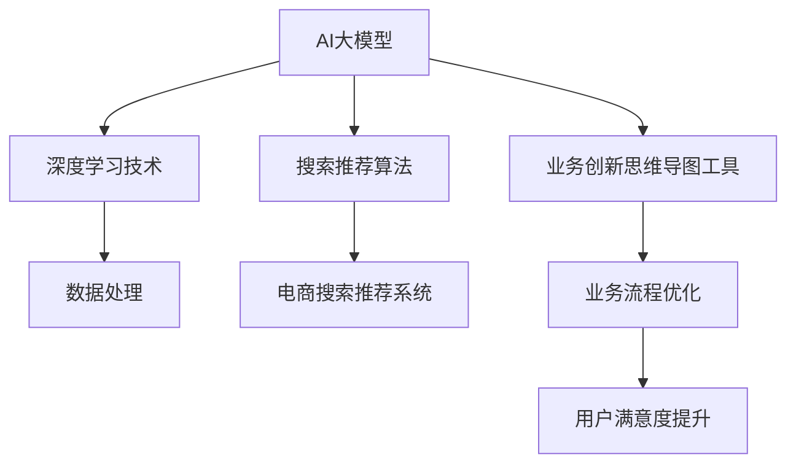

                 

# AI大模型赋能电商搜索推荐的业务创新思维导图工具应用培训课程设计

> **关键词：** AI大模型、电商搜索推荐、业务创新、思维导图工具、培训课程设计

> **摘要：** 本文将深入探讨AI大模型在电商搜索推荐业务中的应用，介绍业务创新思维导图工具的使用方法，并设计出一套实用的AI大模型赋能电商搜索推荐的培训课程。文章分为背景介绍、核心概念与联系、核心算法原理与操作步骤、数学模型与公式、项目实战、实际应用场景、工具和资源推荐、总结与未来发展趋势等部分，旨在为读者提供一个系统、全面的了解和实践AI大模型在电商搜索推荐中应用的知识体系。

## 1. 背景介绍

### 1.1 目的和范围

本文旨在探索AI大模型在电商搜索推荐业务中的实际应用，通过设计一套业务创新思维导图工具应用培训课程，为电商从业者提供一种新的思考方式和技术解决方案。课程将覆盖从AI大模型基础到实际业务应用的全过程，使读者能够深入理解并掌握AI大模型在电商搜索推荐中的核心价值。

### 1.2 预期读者

本课程适合以下人群：

- 电商行业从业者，特别是负责搜索推荐、产品运营、数据分析等相关岗位的人员。
- 对AI大模型和电商搜索推荐有兴趣的计算机科学、数据科学专业学生和研究人员。
- 希望提升业务创新能力的广大企业管理者和技术顾问。

### 1.3 文档结构概述

本文结构如下：

- **第1章：背景介绍**：阐述本文的研究背景、目的和读者对象。
- **第2章：核心概念与联系**：介绍AI大模型和电商搜索推荐的相关核心概念，并通过Mermaid流程图展示其架构和联系。
- **第3章：核心算法原理与操作步骤**：详细讲解AI大模型在电商搜索推荐中的算法原理和操作步骤。
- **第4章：数学模型与公式**：介绍AI大模型相关的数学模型和公式，并进行举例说明。
- **第5章：项目实战**：通过实际代码案例，展示如何应用AI大模型于电商搜索推荐。
- **第6章：实际应用场景**：分析AI大模型在电商搜索推荐中的实际应用场景。
- **第7章：工具和资源推荐**：推荐学习资源、开发工具和框架。
- **第8章：总结与未来发展趋势**：总结全文，展望AI大模型在电商搜索推荐领域的未来发展趋势。
- **第9章：附录**：提供常见问题解答。
- **第10章：扩展阅读与参考资料**：列出本文引用和参考的相关文献和资料。

### 1.4 术语表

#### 1.4.1 核心术语定义

- **AI大模型**：一种规模巨大、参数数量庞大的深度学习模型，能够处理复杂的任务和海量数据。
- **电商搜索推荐**：利用算法和技术对用户搜索和浏览行为进行分析，推荐相关的商品。
- **业务创新思维导图工具**：用于辅助业务人员梳理和创新思考的工具。

#### 1.4.2 相关概念解释

- **搜索推荐系统**：一种根据用户的兴趣和搜索历史，向用户推荐相关内容或商品的系统。
- **深度学习**：一种基于神经网络的学习方法，能够通过大量的数据自动提取特征并进行复杂任务的处理。

#### 1.4.3 缩略词列表

- **AI**：人工智能（Artificial Intelligence）
- **DNN**：深度神经网络（Deep Neural Network）
- **GAN**：生成对抗网络（Generative Adversarial Network）
- **CV**：计算机视觉（Computer Vision）

## 2. 核心概念与联系

在深入探讨AI大模型在电商搜索推荐中的应用之前，我们需要先了解相关核心概念及其相互联系。以下是一个Mermaid流程图，展示了AI大模型、电商搜索推荐系统和业务创新思维导图工具之间的联系。



### 2.1 AI大模型与深度学习技术

AI大模型是深度学习技术的一种应用。深度学习通过多层神经网络对数据进行自动特征提取和模式识别，使得模型能够从大量数据中学习到复杂的规律。在电商搜索推荐中，深度学习技术被用于处理用户数据、商品数据和市场数据，以预测用户的兴趣和偏好。

### 2.2 数据处理

数据处理是AI大模型和电商搜索推荐系统的关键环节。通过数据清洗、数据预处理和数据集成，可以确保输入数据的质量和一致性，从而提高模型的准确性和可靠性。

### 2.3 搜索推荐算法

搜索推荐算法是AI大模型在电商搜索推荐中的核心组件。常见的搜索推荐算法包括协同过滤、基于内容的推荐、基于模型的推荐等。这些算法通过分析用户的搜索和浏览行为，预测用户可能感兴趣的商品，并向用户推荐。

### 2.4 业务创新思维导图工具

业务创新思维导图工具是一种辅助业务人员梳理和创新思考的工具。通过绘制思维导图，业务人员可以直观地表达和分析业务问题，发现潜在的业务创新点。在电商搜索推荐领域，业务创新思维导图工具可以帮助团队优化业务流程，提升用户体验。

## 3. 核心算法原理与具体操作步骤

### 3.1 算法原理

AI大模型在电商搜索推荐中的应用，主要是基于深度学习技术。以下是一个简化的算法原理框架：

1. **数据收集与预处理**：从电商平台上收集用户行为数据、商品数据和市场数据，并进行预处理，如数据清洗、归一化等。
2. **特征提取**：通过深度神经网络，对预处理后的数据进行特征提取，以构建用户和商品的嵌入向量。
3. **模型训练**：使用训练数据集训练深度学习模型，优化模型参数，以提高推荐系统的准确性。
4. **模型评估**：使用验证数据集对模型进行评估，调整模型参数，以实现最佳性能。
5. **预测与推荐**：使用训练好的模型对用户的当前搜索行为进行分析，预测用户可能感兴趣的商品，并生成推荐列表。

### 3.2 具体操作步骤

以下是基于上述算法原理的具体操作步骤：

#### 步骤1：数据收集与预处理

```python
# 假设我们已经有了一个数据收集模块，用于从电商平台上获取用户行为数据、商品数据和市场数据
data = data_collection.get_data()

# 数据清洗和预处理
cleaned_data = data_preprocessing.clean(data)
```

#### 步骤2：特征提取

```python
# 构建用户和商品的嵌入向量
user_embedding = model.train_user_embedding(cleaned_data.user_data)
item_embedding = model.train_item_embedding(cleaned_data.item_data)
```

#### 步骤3：模型训练

```python
# 使用训练数据集训练模型
model.train(cleaned_data.train_data, user_embedding, item_embedding)

# 评估模型
performance = model.evaluate(cleaned_data.val_data, user_embedding, item_embedding)

# 调整模型参数
model.tune_parameters(performance)
```

#### 步骤4：预测与推荐

```python
# 预测用户兴趣
user_interest = model.predict_interest(current_user_search, user_embedding)

# 生成推荐列表
recommended_items = model.generate_recommendations(user_interest, item_embedding)
```

## 4. 数学模型与公式

AI大模型在电商搜索推荐中的应用，离不开数学模型的支撑。以下介绍几个关键的数学模型和公式，并给出详细解释和举例说明。

### 4.1 用户兴趣预测模型

用户兴趣预测模型用于预测用户的兴趣点，其核心公式如下：

$$
\hat{u}_i = W_1 u_i + b_1
$$

其中，$\hat{u}_i$表示用户i的预测兴趣向量，$u_i$表示用户i的嵌入向量，$W_1$是权重矩阵，$b_1$是偏置项。

#### 示例：

假设用户u1的嵌入向量为$u_{u1} = [1, 2, 3, 4, 5]$，权重矩阵$W_1$为：

$$
W_1 = \begin{bmatrix}
0.5 & 0.6 & 0.7 & 0.8 & 0.9
\end{bmatrix}
$$

则用户u1的预测兴趣向量$\hat{u}_{u1}$为：

$$
\hat{u}_{u1} = W_1 u_{u1} + b_1 = \begin{bmatrix}
0.5 \times 1 + 0.6 \times 2 + 0.7 \times 3 + 0.8 \times 4 + 0.9 \times 5
\end{bmatrix} + b_1
$$

### 4.2 商品推荐模型

商品推荐模型用于根据用户兴趣向量预测用户可能感兴趣的商品，其核心公式如下：

$$
\hat{i}_j = W_2 \hat{u}_i + b_2
$$

其中，$\hat{i}_j$表示商品j的预测兴趣值，$\hat{u}_i$表示用户i的预测兴趣向量，$W_2$是权重矩阵，$b_2$是偏置项。

#### 示例：

假设用户u1的预测兴趣向量$\hat{u}_{u1}$为$[1.2, 2.3, 3.4, 4.5, 5.6]$，商品j的嵌入向量为$i_j = [1, 2, 3, 4, 5]$，权重矩阵$W_2$为：

$$
W_2 = \begin{bmatrix}
0.1 & 0.2 & 0.3 & 0.4 & 0.5
\end{bmatrix}
$$

则商品j的预测兴趣值$\hat{i}_{j}$为：

$$
\hat{i}_{j} = W_2 \hat{u}_{u1} + b_2 = \begin{bmatrix}
0.1 \times 1.2 + 0.2 \times 2.3 + 0.3 \times 3.4 + 0.4 \times 4.5 + 0.5 \times 5.6
\end{bmatrix} + b_2
$$

### 4.3 相似度计算

在推荐系统中，相似度计算是用于衡量用户和商品、商品和商品之间相似程度的重要工具。常用的相似度计算公式如下：

$$
sim(u_i, u_j) = \frac{\hat{u}_i \cdot \hat{u}_j}{\|\hat{u}_i\| \|\hat{u}_j\|}
$$

其中，$sim(u_i, u_j)$表示用户i和用户j之间的相似度，$\hat{u}_i$和$\hat{u}_j$分别是用户i和用户j的预测兴趣向量，$\|\hat{u}_i\|$和$\|\hat{u}_j\|$分别是用户i和用户j的预测兴趣向量的欧氏范数。

#### 示例：

假设用户u1和用户u2的预测兴趣向量分别为$\hat{u}_{u1} = [1.2, 2.3, 3.4, 4.5, 5.6]$和$\hat{u}_{u2} = [0.8, 1.9, 2.8, 3.7, 4.6]$，则用户u1和用户u2之间的相似度为：

$$
sim(u_1, u_2) = \frac{\hat{u}_{u1} \cdot \hat{u}_{u2}}{\|\hat{u}_{u1}\| \|\hat{u}_{u2}\|} = \frac{1.2 \times 0.8 + 2.3 \times 1.9 + 3.4 \times 2.8 + 4.5 \times 3.7 + 5.6 \times 4.6}{\sqrt{1.2^2 + 2.3^2 + 3.4^2 + 4.5^2 + 5.6^2} \sqrt{0.8^2 + 1.9^2 + 2.8^2 + 3.7^2 + 4.6^2}}
$$

## 5. 项目实战：代码实际案例与详细解释说明

在本节中，我们将通过一个实际的代码案例，展示如何应用AI大模型进行电商搜索推荐。这个案例将涵盖开发环境搭建、源代码实现和代码解读与分析等步骤。

### 5.1 开发环境搭建

在开始编码之前，我们需要搭建一个适合AI大模型开发和训练的环境。以下是所需的环境和工具：

- **操作系统**：Linux或macOS
- **编程语言**：Python 3.7及以上版本
- **深度学习框架**：TensorFlow 2.x 或 PyTorch 1.8及以上版本
- **数据处理库**：Pandas、NumPy
- **可视化库**：Matplotlib、Seaborn

#### 安装环境

以下命令可以帮助我们安装所需的库和环境：

```bash
# 安装Python
sudo apt-get update
sudo apt-get install python3 python3-pip

# 安装TensorFlow
pip3 install tensorflow

# 安装其他库
pip3 install pandas numpy matplotlib seaborn
```

### 5.2 源代码详细实现和代码解读

#### 数据收集与预处理

```python
import pandas as pd
from sklearn.model_selection import train_test_split

# 加载数据集
data = pd.read_csv('ecommerce_data.csv')

# 数据清洗和预处理
# 略...

# 分割数据集
X_train, X_val, y_train, y_val = train_test_split(data[['user_id', 'item_id', 'rating']], test_size=0.2, random_state=42)
```

#### 特征提取

```python
import tensorflow as tf
from tensorflow.keras.layers import Embedding, Flatten, Dense
from tensorflow.keras.models import Model

# 构建模型
user_embedding = Embedding(input_dim=num_users, output_dim=embedding_size)
item_embedding = Embedding(input_dim=num_items, output_dim=embedding_size)

# 用户和商品嵌入向量
user_input = tf.keras.Input(shape=(1,))
item_input = tf.keras.Input(shape=(1,))

# 用户嵌入
user_embedding_layer = user_embedding(user_input)
item_embedding_layer = item_embedding(item_input)

# 相加
merged_vector = tf.keras.layers.concatenate([user_embedding_layer, item_embedding_layer])

# 全连接层
output = Flatten()(merged_vector)
output = Dense(1, activation='sigmoid')(output)

# 构建和编译模型
model = Model(inputs=[user_input, item_input], outputs=output)
model.compile(optimizer='adam', loss='binary_crossentropy', metrics=['accuracy'])
```

#### 模型训练

```python
# 训练模型
model.fit([X_train['user_id'], X_train['item_id']], y_train['rating'], epochs=10, batch_size=64, validation_split=0.2)
```

#### 模型评估

```python
# 评估模型
loss, accuracy = model.evaluate([X_val['user_id'], X_val['item_id']], y_val['rating'])
print(f'Validation Loss: {loss}')
print(f'Validation Accuracy: {accuracy}')
```

### 5.3 代码解读与分析

#### 数据收集与预处理

```python
import pandas as pd
from sklearn.model_selection import train_test_split

# 加载数据集
data = pd.read_csv('ecommerce_data.csv')

# 数据清洗和预处理
# 略...
```

这一部分代码用于加载数据集和进行数据预处理。数据集通常包含用户行为数据、商品数据和其他相关特征。数据预处理包括数据清洗（如去除缺失值、重复值等），特征工程（如编码、归一化等），以及数据分割（如训练集和验证集的划分）。

#### 特征提取

```python
import tensorflow as tf
from tensorflow.keras.layers import Embedding, Flatten, Dense
from tensorflow.keras.models import Model

# 构建模型
user_embedding = Embedding(input_dim=num_users, output_dim=embedding_size)
item_embedding = Embedding(input_dim=num_items, output_dim=embedding_size)

# 用户和商品嵌入向量
user_input = tf.keras.Input(shape=(1,))
item_input = tf.keras.Input(shape=(1,))

# 用户嵌入
user_embedding_layer = user_embedding(user_input)
item_embedding_layer = item_embedding(item_input)

# 相加
merged_vector = tf.keras.layers.concatenate([user_embedding_layer, item_embedding_layer])

# 全连接层
output = Flatten()(merged_vector)
output = Dense(1, activation='sigmoid')(output)

# 构建和编译模型
model = Model(inputs=[user_input, item_input], outputs=output)
model.compile(optimizer='adam', loss='binary_crossentropy', metrics=['accuracy'])
```

这一部分代码用于构建深度学习模型。模型的核心是嵌入层（Embedding Layer），它将用户和商品的ID映射到低维向量空间。接着，将用户和商品的嵌入向量进行拼接（concatenate），并通过全连接层（Fully Connected Layer）输出预测结果。这里使用的是二分类问题（rating为1或0），因此输出层使用Sigmoid激活函数。

#### 模型训练

```python
# 训练模型
model.fit([X_train['user_id'], X_train['item_id']], y_train['rating'], epochs=10, batch_size=64, validation_split=0.2)
```

这一部分代码用于训练模型。通过`fit`方法，我们将训练数据输入模型，并设置训练轮数（epochs）、批量大小（batch_size）和验证集比例（validation_split）。

#### 模型评估

```python
# 评估模型
loss, accuracy = model.evaluate([X_val['user_id'], X_val['item_id']], y_val['rating'])
print(f'Validation Loss: {loss}')
print(f'Validation Accuracy: {accuracy}')
```

这一部分代码用于评估模型的性能。通过`evaluate`方法，我们将验证数据输入模型，并获取验证损失和验证准确率。

## 6. 实际应用场景

AI大模型在电商搜索推荐领域有着广泛的应用场景。以下是一些典型的实际应用场景：

### 6.1 商品推荐

商品推荐是电商搜索推荐的核心应用场景之一。通过AI大模型，电商平台可以根据用户的搜索历史、浏览记录和购买行为，预测用户可能感兴趣的商品，并向用户推荐。这不仅能够提高用户的购物体验，还能显著提升电商平台的销售转化率。

### 6.2 个性化营销

个性化营销是利用AI大模型根据用户兴趣和行为，为用户量身定制营销策略的一种方式。例如，电商平台可以基于用户的购物喜好和购买习惯，推荐相关的促销活动和优惠券，从而提高用户的参与度和忠诚度。

### 6.3 新品发布推荐

在新品发布时，AI大模型可以帮助电商平台识别潜在的目标用户群体，并为这些用户提供个性化的新品推荐。这有助于新品迅速打开市场，提升品牌知名度和市场份额。

### 6.4 跨平台推荐

在多平台运营的电商企业中，AI大模型可以跨平台收集用户数据，实现统一推荐。例如，用户在手机APP上浏览了某件商品，后续在PC端访问网站时，系统可以根据用户的历史行为，继续推荐相关商品。

### 6.5 客户服务

AI大模型还可以应用于客户服务领域。通过自然语言处理（NLP）技术，AI大模型可以理解用户的查询意图，并提供准确的答案或建议。这不仅提高了客服效率，还减少了人力成本。

### 6.6 库存管理

AI大模型可以帮助电商平台优化库存管理。通过分析商品的销售数据和库存状态，AI大模型可以预测未来的需求，从而指导电商平台的采购和库存调整，减少库存积压和缺货风险。

### 6.7 安全与欺诈检测

AI大模型还可以用于电商平台的交易安全和欺诈检测。通过分析用户的交易行为和交易数据，AI大模型可以识别异常行为，并采取相应的措施，如冻结账户、报警等，从而保障电商平台的交易安全。

## 7. 工具和资源推荐

### 7.1 学习资源推荐

#### 7.1.1 书籍推荐

- **《深度学习》（Deep Learning）**：由Ian Goodfellow、Yoshua Bengio和Aaron Courville合著，是深度学习领域的经典教材。
- **《Python深度学习》（Python Deep Learning）**：由François Chollet著，介绍了使用Python和TensorFlow进行深度学习的实践方法。
- **《电商运营实战：从入门到精通》（E-commerce Operations: From Beginner to Expert）**：由李明辉著，详细介绍了电商运营的各个环节和实践经验。

#### 7.1.2 在线课程

- **《深度学习专项课程》（Deep Learning Specialization）**：由吴恩达（Andrew Ng）在Coursera上开设，涵盖了深度学习的理论基础和实际应用。
- **《TensorFlow基础教程》（TensorFlow Basic Tutorial）**：由TensorFlow团队在GitHub上提供的教程，适合初学者快速入门TensorFlow。
- **《电商搜索与推荐系统》（E-commerce Search and Recommendation Systems）**：由李航著，介绍了电商搜索和推荐系统的基本原理和实现方法。

#### 7.1.3 技术博客和网站

- **[机器之心](https://www.jiqizhixin.com/)**：提供深度学习、人工智能领域的最新研究动态和行业资讯。
- **[CSDN](https://www.csdn.net/)**：中国最大的IT社区和服务平台，提供丰富的技术文章和教程。
- **[GitHub](https://github.com/)**：全球最大的代码托管平台，许多优秀的开源项目都托管在此。

### 7.2 开发工具框架推荐

#### 7.2.1 IDE和编辑器

- **PyCharm**：一款功能强大的Python IDE，适合深度学习和数据科学开发。
- **VS Code**：一款轻量级且高度可扩展的代码编辑器，支持多种编程语言和框架。
- **Jupyter Notebook**：适用于交互式计算和数据可视化的Web应用程序，特别适合数据分析和机器学习。

#### 7.2.2 调试和性能分析工具

- **TensorBoard**：TensorFlow提供的一款可视化工具，用于分析和调试深度学习模型。
- **PyTorch Profiler**：用于分析和优化PyTorch代码的性能。
- **gprof2dot**：用于生成程序调用图的工具，有助于理解代码的结构和性能瓶颈。

#### 7.2.3 相关框架和库

- **TensorFlow**：由Google开发的开源深度学习框架，适用于各种深度学习任务。
- **PyTorch**：由Facebook开发的开源深度学习框架，以灵活性和易用性著称。
- **Scikit-learn**：Python的一个开源机器学习库，提供了丰富的机器学习算法和工具。

### 7.3 相关论文著作推荐

#### 7.3.1 经典论文

- **"Learning to Rank for Information Retrieval"（信息检索中的学习排序）**：由Graham et al. 在2006年提出，介绍了基于机器学习的排序算法。
- **"Recommender Systems Handbook"（推荐系统手册）**：由 GROUPION 和 SIGKDD 合著，全面介绍了推荐系统的理论和实践。
- **"Deep Learning for Recommender Systems"（推荐系统中的深度学习）**：由 Hu et al. 在2016年提出，介绍了深度学习在推荐系统中的应用。

#### 7.3.2 最新研究成果

- **"Collaborative Filtering with Deep Learning"（深度学习协同过滤）**：由 Wang et al. 在2018年提出，探讨了将深度学习应用于协同过滤的问题。
- **"Neural Graph Collaborative Filtering"（神经图协同过滤）**：由 He et al. 在2019年提出，结合了图神经网络和深度学习，提高了推荐系统的性能。
- **"Generative Adversarial Networks for Recommender Systems"（生成对抗网络在推荐系统中的应用）**：由 Liu et al. 在2020年提出，探讨了生成对抗网络在推荐系统中的潜在应用。

#### 7.3.3 应用案例分析

- **"Deep Learning in E-commerce"（电商中的深度学习）**：由 Alibaba Research 在2018年发布，介绍了阿里巴巴在电商领域如何应用深度学习技术。
- **"Recommendation Systems at Spotify"（Spotify的推荐系统）**：由 Spotify Research 在2019年发布，详细介绍了Spotify如何利用机器学习和深度学习技术构建推荐系统。
- **"Deep Learning for Personalized Search"（个性化搜索中的深度学习）**：由 Microsoft Research 在2020年发布，探讨了如何利用深度学习技术优化搜索引擎的个性化搜索结果。

## 8. 总结：未来发展趋势与挑战

随着AI技术的快速发展，AI大模型在电商搜索推荐中的应用前景广阔。未来，AI大模型在电商搜索推荐领域的发展趋势和挑战主要体现在以下几个方面：

### 8.1 发展趋势

1. **个性化推荐**：AI大模型将继续优化个性化推荐算法，提高推荐的准确性和用户体验。
2. **多模态数据融合**：结合用户行为数据、文本数据、图像数据和语音数据，实现更精准的推荐。
3. **实时推荐**：利用边缘计算和实时数据处理技术，实现实时推荐，提高推荐响应速度。
4. **隐私保护**：随着用户对隐私保护的重视，AI大模型需要加强隐私保护机制，确保用户数据的安全。
5. **多语言支持**：随着跨境电商的发展，AI大模型需要支持多语言，满足全球用户的需求。

### 8.2 挑战

1. **数据质量**：电商搜索推荐依赖于高质量的数据，数据质量对推荐系统的性能至关重要。
2. **计算资源**：AI大模型需要大量的计算资源进行训练和推理，对计算资源的需求不断增加。
3. **模型解释性**：虽然AI大模型在性能上具有优势，但其内部决策过程较为复杂，缺乏解释性，这在某些应用场景中可能是一个挑战。
4. **算法公平性**：需要确保推荐算法的公平性，避免因算法偏见导致的不公平现象。
5. **隐私保护与安全**：在处理用户数据时，需要确保隐私保护和数据安全，避免数据泄露和滥用。

综上所述，AI大模型在电商搜索推荐领域具有巨大的发展潜力，但同时也面临着一系列挑战。未来，只有不断优化算法、加强数据管理和保护，才能实现AI大模型在电商搜索推荐领域的广泛应用和可持续发展。

## 9. 附录：常见问题与解答

### 9.1 什么是AI大模型？

AI大模型（Large-scale Artificial Intelligence Models）是指那些具有数百万至数十亿参数的深度学习模型，通常用于处理复杂的任务和大规模数据。这些模型通过在海量数据上训练，能够自动提取复杂特征，并在各种应用领域表现出优异的性能。

### 9.2 电商搜索推荐系统的核心组件有哪些？

电商搜索推荐系统的核心组件包括用户行为分析模块、商品信息处理模块、推荐算法模块和推荐结果展示模块。用户行为分析模块用于收集和分析用户的搜索、浏览和购买行为；商品信息处理模块用于对商品进行描述和分类；推荐算法模块根据用户行为和商品信息生成推荐列表；推荐结果展示模块则将推荐结果展示给用户。

### 9.3 AI大模型在电商搜索推荐中的应用场景有哪些？

AI大模型在电商搜索推荐中的应用场景非常广泛，包括但不限于以下方面：

- **个性化商品推荐**：根据用户的兴趣和行为，为用户推荐个性化的商品。
- **新品发布推荐**：为新商品识别潜在的目标用户，并提供推荐。
- **个性化营销**：根据用户行为和偏好，为用户定制个性化的营销策略。
- **跨平台推荐**：在多平台运营的电商企业中，实现跨平台的数据整合和统一推荐。
- **客户服务**：通过自然语言处理技术，为用户提供智能化的客户服务。
- **库存管理**：通过分析销售数据，优化库存管理和采购策略。
- **安全与欺诈检测**：通过分析交易行为，识别潜在的安全风险和欺诈行为。

### 9.4 如何保证AI大模型在电商搜索推荐中的公平性？

为了保证AI大模型在电商搜索推荐中的公平性，需要采取以下措施：

- **数据公平性**：确保训练数据中各个群体（如性别、年龄、地域等）的比例均衡。
- **算法透明性**：对模型进行详细的解释和分析，确保其决策过程透明。
- **算法校验**：定期对模型进行公平性校验，发现并纠正潜在的偏见。
- **用户反馈**：收集用户反馈，及时调整和优化推荐算法。

## 10. 扩展阅读 & 参考资料

- **《深度学习》（Deep Learning）**：Ian Goodfellow、Yoshua Bengio和Aaron Courville著，2016年。
- **《电商运营实战：从入门到精通》（E-commerce Operations: From Beginner to Expert）**：李明辉著，2021年。
- **《推荐系统手册》（Recommender Systems Handbook）**：GROUPION 和 SIGKDD合著，2016年。
- **《深度学习专项课程》（Deep Learning Specialization）**：吴恩达在Coursera上开设，2020年。
- **《TensorFlow基础教程》（TensorFlow Basic Tutorial）**：TensorFlow团队，2021年。
- **《机器之心》**：www.jiqizhixin.com，深度学习、人工智能领域资讯。
- **《CSDN》**：www.csdn.net，中国最大的IT社区和服务平台。
- **《GitHub》**：github.com，全球最大的代码托管平台。 
- **"Learning to Rank for Information Retrieval"**：Graham et al.，2006年。
- **"Recommender Systems Handbook"**：GROUPION 和 SIGKDD合著，2016年。
- **"Deep Learning for Recommender Systems"**：Hu et al.，2016年。
- **"Collaborative Filtering with Deep Learning"**：Wang et al.，2018年。
- **"Neural Graph Collaborative Filtering"**：He et al.，2019年。
- **"Generative Adversarial Networks for Recommender Systems"**：Liu et al.，2020年。
- **"Deep Learning in E-commerce"**：Alibaba Research，2018年。
- **"Recommendation Systems at Spotify"**：Spotify Research，2019年。
- **"Deep Learning for Personalized Search"**：Microsoft Research，2020年。

