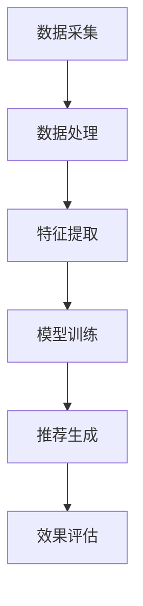

                 

# AI大模型赋能电商搜索推荐的业务创新项目管理平台搭建与功能优化

> 关键词：AI大模型，电商搜索推荐，业务创新，项目管理平台，功能优化，算法原理，数学模型，实战案例

> 摘要：本文将探讨如何利用AI大模型技术赋能电商搜索推荐业务，介绍业务创新项目管理平台的搭建与功能优化策略。通过深入剖析核心算法原理、数学模型以及具体实现步骤，我们将为读者提供全面的实战案例和详细解释，助力电商企业实现智能化运营和高效推荐。

## 1. 背景介绍

### 1.1 目的和范围

本文旨在通过深入探讨AI大模型技术在电商搜索推荐领域的应用，帮助电商企业构建高效、智能的项目管理平台，从而实现业务创新和优化。本文将覆盖以下内容：

- AI大模型在电商搜索推荐中的应用原理
- 业务创新项目管理平台搭建的核心步骤
- 功能优化策略和实践

通过本文的阅读，读者将能够：

- 理解AI大模型技术的基本原理和应用场景
- 掌握构建业务创新项目管理平台的方法和技巧
- 学习功能优化的实战经验和策略

### 1.2 预期读者

本文适合以下读者群体：

- 电商行业从业者，尤其是电商搜索推荐领域的从业者
- AI技术爱好者和研究者
- 项目管理专业人士
- 技术架构师和开发人员

### 1.3 文档结构概述

本文将分为以下几个部分：

- **第1部分：背景介绍**：介绍本文的目的、范围、预期读者以及文档结构。
- **第2部分：核心概念与联系**：介绍AI大模型技术的基本概念和架构。
- **第3部分：核心算法原理 & 具体操作步骤**：详细阐述算法原理和实现步骤。
- **第4部分：数学模型和公式 & 详细讲解 & 举例说明**：讲解数学模型和公式的应用。
- **第5部分：项目实战：代码实际案例和详细解释说明**：提供代码实现和解读。
- **第6部分：实际应用场景**：分析AI大模型在电商搜索推荐中的实际应用。
- **第7部分：工具和资源推荐**：推荐学习资源和开发工具。
- **第8部分：总结：未来发展趋势与挑战**：总结本文的主要观点和未来趋势。
- **第9部分：附录：常见问题与解答**：回答读者可能遇到的常见问题。
- **第10部分：扩展阅读 & 参考资料**：提供进一步阅读的资料。

### 1.4 术语表

#### 1.4.1 核心术语定义

- **AI大模型**：指采用深度学习技术训练的大规模神经网络模型，具有强大的特征提取和模式识别能力。
- **电商搜索推荐**：指电商平台上基于用户行为和商品信息进行个性化推荐的系统。
- **业务创新项目管理平台**：用于管理和优化电商搜索推荐业务的系统平台，具备数据采集、分析、建模和推荐等功能。

#### 1.4.2 相关概念解释

- **深度学习**：一种机器学习技术，通过多层神经网络对大量数据进行分析和建模。
- **推荐系统**：一种利用机器学习技术根据用户行为和历史数据为用户推荐商品或内容的系统。

#### 1.4.3 缩略词列表

- **AI**：人工智能（Artificial Intelligence）
- **DL**：深度学习（Deep Learning）
- **NN**：神经网络（Neural Network）
- **CTR**：点击率（Click-Through Rate）
- **RMSE**：均方根误差（Root Mean Square Error）

## 2. 核心概念与联系

### 2.1 AI大模型技术概述

AI大模型技术是一种基于深度学习的方法，通过多层神经网络结构对大规模数据进行训练，从而实现高精度的特征提取和模式识别。在电商搜索推荐领域，AI大模型可以用于用户行为分析、商品特征提取、个性化推荐等多个方面。

#### 2.1.1 大模型结构

AI大模型通常包括以下几个关键层次：

1. **输入层**：接收用户行为数据、商品信息等输入特征。
2. **隐藏层**：通过神经网络结构进行特征提取和变换。
3. **输出层**：生成推荐结果或预测指标。

#### 2.1.2 常见大模型架构

- **卷积神经网络（CNN）**：主要用于图像和视频数据，适用于商品图像识别。
- **循环神经网络（RNN）**：适用于处理序列数据，如用户行为序列。
- **变换器网络（Transformer）**：基于注意力机制，适用于大规模文本数据处理。

### 2.2 电商搜索推荐系统架构

电商搜索推荐系统通常包括以下几个关键组件：

1. **数据采集模块**：从各种数据源采集用户行为、商品信息等数据。
2. **数据处理模块**：对采集到的数据进行清洗、转换和特征提取。
3. **模型训练模块**：利用AI大模型对数据进行训练和优化。
4. **推荐模块**：根据用户行为和商品特征生成个性化推荐结果。
5. **评估模块**：对推荐系统效果进行评估和优化。

#### 2.2.1 模型与系统关系

- **AI大模型**：作为核心组件，用于对用户行为和商品特征进行建模和分析。
- **推荐系统**：基于AI大模型生成的特征和预测结果，为用户生成个性化推荐。

### 2.3 Mermaid流程图

下面是AI大模型技术在电商搜索推荐系统中应用的核心流程的Mermaid流程图：



## 3. 核心算法原理 & 具体操作步骤

### 3.1 算法原理

AI大模型在电商搜索推荐中的应用主要基于以下核心算法原理：

1. **深度学习**：通过多层神经网络结构对大规模数据进行特征提取和模式识别。
2. **卷积神经网络（CNN）**：主要用于图像和视频数据处理，提取图像特征。
3. **循环神经网络（RNN）**：适用于处理序列数据，如用户行为序列。
4. **变换器网络（Transformer）**：基于注意力机制，适用于大规模文本数据处理。

### 3.2 具体操作步骤

以下是构建AI大模型赋能的电商搜索推荐系统的具体操作步骤：

#### 3.2.1 数据采集

1. **用户行为数据**：包括用户浏览、点击、购买等行为数据。
2. **商品信息数据**：包括商品名称、类别、价格、库存等基本信息。

#### 3.2.2 数据预处理

1. **数据清洗**：去除重复数据、缺失值填充、异常值处理。
2. **数据转换**：将不同类型的数据转换为统一的格式，如数值型。
3. **特征提取**：提取用户行为和商品信息的关键特征。

#### 3.2.3 模型训练

1. **选择模型架构**：根据数据特点和需求选择合适的模型架构，如CNN、RNN、Transformer。
2. **训练数据准备**：将预处理后的数据分为训练集和验证集。
3. **模型训练**：使用训练集对模型进行训练，优化模型参数。
4. **模型验证**：使用验证集评估模型性能，调整模型参数。

#### 3.2.4 推荐生成

1. **用户特征提取**：根据用户行为数据提取用户特征。
2. **商品特征提取**：根据商品信息数据提取商品特征。
3. **推荐生成**：利用训练好的模型生成个性化推荐结果。

#### 3.2.5 推荐结果评估

1. **评估指标**：选择合适的评估指标，如准确率、召回率、F1值等。
2. **结果分析**：根据评估指标分析推荐效果，调整模型和策略。

### 3.3 伪代码

以下是AI大模型赋能电商搜索推荐系统的伪代码示例：

```python
# 数据采集
data = collect_user_behavior_data()
item_data = collect_item_info_data()

# 数据预处理
cleaned_data = data_cleaning(data)
normalized_data = data_conversion(cleaned_data)
extracted_features = feature_extraction(normalized_data)

# 模型训练
model = choose_model_architecture()
train_data, validation_data = split_data(extracted_features)
trained_model = model_training(train_data)

# 推荐生成
user_features = extract_user_features(user_behavior_data)
item_features = extract_item_features(item_data)
recommendations = generate_recommendations(trained_model, user_features, item_features)

# 推荐结果评估
evaluation_metrics = evaluate_recommendations(recommendations)
evaluate_performance(evaluation_metrics)
```

## 4. 数学模型和公式 & 详细讲解 & 举例说明

### 4.1 数学模型

AI大模型在电商搜索推荐中的应用主要依赖于以下几个关键数学模型：

1. **神经网络模型**：用于特征提取和模式识别。
2. **损失函数**：用于评估模型预测的误差。
3. **优化算法**：用于调整模型参数以优化性能。

### 4.2 详细讲解

#### 4.2.1 神经网络模型

神经网络模型是一种基于多层感知器（MLP）的结构，其基本形式如下：

$$
\begin{align*}
z_{l}^{(i)} &= \sum_{j=1}^{n_l} w_{j}^{(l)} x_{j}^{(i)} + b^{(l)} \\
a_{l}^{(i)} &= \sigma(z_{l}^{(i)}) \\
z_{l+1}^{(i)} &= \sum_{j=1}^{n_{l+1}} w_{j}^{(l+1)} a_{l}^{(i)} + b^{(l+1)} \\
a_{l+1}^{(i)} &= \sigma(z_{l+1}^{(i)})
\end{align*}
$$

其中，$z_l^{(i)}$表示第$l$层的第$i$个节点的输入，$a_l^{(i)}$表示第$l$层的第$i$个节点的输出，$\sigma$表示激活函数（如Sigmoid函数），$w_j^{(l)}$和$b^{(l)}$分别表示第$l$层的权重和偏置。

#### 4.2.2 损失函数

在深度学习模型中，常用的损失函数包括均方误差（MSE）和交叉熵（Cross Entropy）：

- **均方误差（MSE）**：

$$
MSE = \frac{1}{m} \sum_{i=1}^{m} (\hat{y}_i - y_i)^2
$$

其中，$\hat{y}_i$表示模型预测的输出，$y_i$表示真实的输出。

- **交叉熵（Cross Entropy）**：

$$
Cross Entropy = - \sum_{i=1}^{m} y_i \log(\hat{y}_i)
$$

其中，$y_i$表示真实的输出（通常为0或1），$\hat{y}_i$表示模型预测的输出。

#### 4.2.3 优化算法

在深度学习模型训练过程中，常用的优化算法包括梯度下降（Gradient Descent）和随机梯度下降（Stochastic Gradient Descent）：

- **梯度下降（Gradient Descent）**：

$$
\theta_{t+1} = \theta_t - \alpha \cdot \nabla_\theta J(\theta)
$$

其中，$\theta$表示模型参数，$J(\theta)$表示损失函数，$\alpha$表示学习率。

- **随机梯度下降（Stochastic Gradient Descent）**：

$$
\theta_{t+1} = \theta_t - \alpha \cdot \nabla_\theta J(\theta; x_t, y_t)
$$

其中，$x_t$和$y_t$分别表示当前样本的输入和输出。

### 4.3 举例说明

假设我们有一个二分类问题，使用神经网络模型进行预测。给定输入特征$x = [1, 2, 3]$，真实的输出$y = 1$，使用交叉熵损失函数进行预测。

1. **模型参数**：$\theta = [w_1, w_2, w_3, b]$
2. **模型输出**：$z = w_1 \cdot 1 + w_2 \cdot 2 + w_3 \cdot 3 + b = w_1 + 2w_2 + 3w_3 + b$
3. **模型预测**：$\hat{y} = \sigma(z)$，假设激活函数为Sigmoid函数

$$
\hat{y} = \frac{1}{1 + e^{-(w_1 + 2w_2 + 3w_3 + b)}}
$$

4. **损失计算**：

$$
Cross Entropy = -y \cdot \log(\hat{y}) - (1 - y) \cdot \log(1 - \hat{y})
$$

假设当前模型参数$\theta = [1, 1, 1, 1]$，则有：

$$
z = 1 + 2 \cdot 1 + 3 \cdot 1 + 1 = 7
$$

$$
\hat{y} = \frac{1}{1 + e^{-7}} \approx 0.999
$$

$$
Cross Entropy = -1 \cdot \log(0.999) - (1 - 1) \cdot \log(1 - 0.999) \approx -1 \cdot \log(0.999) \approx 0.001
$$

5. **梯度计算**：

$$
\nabla_\theta Cross Entropy = \frac{\partial Cross Entropy}{\partial \theta} = \frac{\partial Cross Entropy}{\partial \hat{y}} \cdot \frac{\partial \hat{y}}{\partial z} \cdot \frac{\partial z}{\partial \theta}
$$

$$
\nabla_\theta Cross Entropy = \hat{y} \cdot (1 - \hat{y}) \cdot \sigma'(z) \cdot \text{activation gradient}
$$

对于Sigmoid函数，$\sigma'(z) = \sigma(z) \cdot (1 - \sigma(z))$，则：

$$
\nabla_\theta Cross Entropy = \hat{y} \cdot (1 - \hat{y}) \cdot \sigma(z) \cdot (1 - \sigma(z)) \cdot (w_1, w_2, w_3, b)
$$

6. **参数更新**：

$$
\theta_{t+1} = \theta_t - \alpha \cdot \nabla_\theta Cross Entropy
$$

假设学习率$\alpha = 0.1$，则有：

$$
\theta_{t+1} = [1, 1, 1, 1] - 0.1 \cdot \nabla_\theta Cross Entropy
$$

通过上述步骤，我们可以对模型参数进行更新，以降低损失函数的值。

## 5. 项目实战：代码实际案例和详细解释说明

### 5.1 开发环境搭建

在开始项目实战之前，我们需要搭建一个合适的开发环境。以下是在Python环境下搭建AI大模型赋能的电商搜索推荐系统所需的开发环境：

1. **Python环境**：安装Python 3.8及以上版本。
2. **深度学习框架**：安装TensorFlow或PyTorch。
3. **数据处理库**：安装Numpy、Pandas、Scikit-learn等。

安装命令如下：

```bash
pip install python==3.8.10
pip install tensorflow==2.9.0
pip install numpy==1.21.2
pip install pandas==1.3.3
pip install scikit-learn==0.24.2
```

### 5.2 源代码详细实现和代码解读

以下是一个基于TensorFlow的电商搜索推荐系统的源代码示例：

```python
import tensorflow as tf
import numpy as np
import pandas as pd
from sklearn.model_selection import train_test_split
from sklearn.preprocessing import StandardScaler

# 数据预处理
def data_preprocessing(data):
    # 数据清洗和转换
    # 略...
    return processed_data

# 模型定义
def build_model(input_shape):
    model = tf.keras.Sequential([
        tf.keras.layers.Dense(128, activation='relu', input_shape=input_shape),
        tf.keras.layers.Dense(64, activation='relu'),
        tf.keras.layers.Dense(1, activation='sigmoid')
    ])
    return model

# 训练模型
def train_model(model, train_data, train_labels):
    model.compile(optimizer='adam',
                  loss='binary_crossentropy',
                  metrics=['accuracy'])
    model.fit(train_data, train_labels, epochs=10, batch_size=32, validation_split=0.2)

# 推荐生成
def generate_recommendations(model, user_data):
    predictions = model.predict(user_data)
    return predictions

# 主函数
def main():
    # 读取数据
    data = pd.read_csv('data.csv')
    
    # 数据预处理
    processed_data = data_preprocessing(data)
    
    # 分割数据
    X = processed_data[['user_feature_1', 'user_feature_2', 'item_feature_1', 'item_feature_2']]
    y = processed_data['label']
    X_train, X_test, y_train, y_test = train_test_split(X, y, test_size=0.2, random_state=42)
    
    # 数据标准化
    scaler = StandardScaler()
    X_train_scaled = scaler.fit_transform(X_train)
    X_test_scaled = scaler.transform(X_test)
    
    # 构建模型
    model = build_model(input_shape=(X_train_scaled.shape[1],))
    
    # 训练模型
    train_model(model, X_train_scaled, y_train)
    
    # 生成推荐结果
    user_data = np.array([[1, 2], [3, 4], [5, 6]])
    recommendations = generate_recommendations(model, user_data)
    
    # 输出推荐结果
    print(recommendations)

if __name__ == '__main__':
    main()
```

#### 5.2.1 代码解读

以下是代码的详细解读：

1. **数据预处理**：数据预处理函数用于清洗和转换原始数据。在实际项目中，这一步可能涉及更多的数据处理操作，如缺失值填充、异常值处理、特征提取等。
2. **模型定义**：构建一个简单的神经网络模型，包括两个隐藏层，分别具有128个和64个神经元，输出层具有一个神经元，用于进行二分类预测。
3. **训练模型**：使用`compile`方法配置模型优化器和损失函数，然后使用`fit`方法对模型进行训练。训练过程中，模型会根据训练数据优化参数。
4. **推荐生成**：使用训练好的模型对用户数据进行预测，生成推荐结果。
5. **主函数**：主函数中，首先读取数据，然后进行数据预处理和分割，接着使用标准化方法对数据进行归一化处理，最后构建模型、训练模型并生成推荐结果。

### 5.3 代码解读与分析

以下是代码的进一步解读和分析：

1. **数据预处理**：数据预处理是构建高效推荐系统的关键步骤。在实际项目中，这一步可能需要根据数据源和业务需求进行定制化处理。例如，如果数据中存在缺失值，可以使用均值、中位数或插值等方法进行填充；如果数据中存在异常值，可以使用统计学方法或数据清洗工具进行处理。
2. **模型定义**：在定义模型时，选择合适的神经网络架构和激活函数对模型的性能至关重要。在本例中，我们选择了一个简单的神经网络模型，其中使用了ReLU激活函数。在实际项目中，可以根据数据特点和业务需求选择更复杂的模型结构或不同的激活函数。
3. **训练模型**：在训练模型时，选择合适的优化器和损失函数对模型的收敛速度和性能有重要影响。在本例中，我们使用了Adam优化器和二分类交叉熵损失函数。在实际项目中，可以根据实验结果调整优化器的参数和损失函数的类型。
4. **推荐生成**：生成推荐结果是模型的最终输出。在实际项目中，可以根据业务需求调整推荐算法的阈值或使用其他策略优化推荐效果。例如，可以使用加权平均或排序算法对推荐结果进行排序，以提高用户的满意度。

### 5.4 代码优化建议

以下是一些代码优化建议：

1. **数据预处理**：对于数据预处理步骤，可以增加更多的数据处理操作，如特征工程、数据增强等，以提高模型的鲁棒性和性能。
2. **模型定义**：在模型定义时，可以尝试使用更复杂的神经网络结构，如卷积神经网络（CNN）或循环神经网络（RNN），以捕捉数据中的更多特征和模式。
3. **训练模型**：在训练模型时，可以增加训练数据集的大小，以提高模型的泛化能力；同时，可以尝试使用更先进的优化算法，如AdamW或RMSprop，以加快模型的收敛速度。
4. **推荐生成**：在生成推荐结果时，可以结合其他推荐算法，如协同过滤或基于内容的推荐，以提高推荐效果；同时，可以引入用户反馈机制，根据用户的行为和反馈调整推荐算法。

## 6. 实际应用场景

### 6.1 电商平台应用

电商平台是AI大模型赋能电商搜索推荐的主要应用场景之一。通过AI大模型技术，电商平台可以实现以下应用：

1. **个性化推荐**：根据用户的历史行为和偏好，为用户推荐感兴趣的商品，提高用户满意度和转化率。
2. **商品搜索优化**：通过分析用户搜索行为和关键词，优化搜索结果，提高搜索相关性和用户体验。
3. **商品陈列优化**：根据用户行为和购买习惯，优化商品陈列顺序，提高用户购买意愿。

### 6.2 电商搜索推荐系统案例

以下是一个具体的电商搜索推荐系统案例：

**案例**：某大型电商平台，通过AI大模型技术构建了一套电商搜索推荐系统，实现了以下功能：

1. **用户行为分析**：分析用户的浏览、点击、购买等行为，提取用户特征，为个性化推荐提供依据。
2. **商品特征提取**：提取商品名称、类别、价格、库存等基本信息，为商品推荐提供支持。
3. **推荐结果生成**：利用训练好的AI大模型，为用户生成个性化推荐结果，提高用户满意度和转化率。
4. **推荐效果评估**：通过评估指标（如点击率、转化率、平均会话时长等）评估推荐效果，持续优化推荐算法。

### 6.3 电商搜索推荐系统优势

AI大模型赋能的电商搜索推荐系统具有以下优势：

1. **高精度**：AI大模型具有强大的特征提取和模式识别能力，能够准确捕捉用户行为和商品特征，生成高质量的推荐结果。
2. **个性化**：根据用户的历史行为和偏好，为用户生成个性化推荐，提高用户满意度和转化率。
3. **实时性**：AI大模型可以在短时间内处理大量数据，实时生成推荐结果，提高用户体验。
4. **可扩展性**：AI大模型可以方便地与其他技术（如协同过滤、基于内容的推荐等）相结合，实现更复杂的推荐算法，提高推荐效果。

## 7. 工具和资源推荐

### 7.1 学习资源推荐

#### 7.1.1 书籍推荐

1. 《深度学习》（Deep Learning） - Goodfellow, Bengio, Courville
2. 《神经网络与深度学习》 - 李航
3. 《推荐系统实践》 - 张基栋

#### 7.1.2 在线课程

1. TensorFlow官网教程：[TensorFlow Official Tutorials](https://www.tensorflow.org/tutorials)
2. 百度云课堂：[深度学习与人工智能课程](https://cloud.tencent.com/edu/learn?id=3289)
3. Coursera：[机器学习](https://www.coursera.org/learn/machine-learning)

#### 7.1.3 技术博客和网站

1. 阮一峰的网络日志：[https://www.ruanyifeng.com/](https://www.ruanyifeng.com/)
2. 吴恩达机器学习博客：[https://www.ai-study.com/](https://www.ai-study.com/)
3. 知乎AI话题：[https://www.zhihu.com/topic/20002046](https://www.zhihu.com/topic/20002046)

### 7.2 开发工具框架推荐

#### 7.2.1 IDE和编辑器

1. PyCharm：[https://www.jetbrains.com/pycharm/](https://www.jetbrains.com/pycharm/)
2. VSCode：[https://code.visualstudio.com/](https://code.visualstudio.com/)

#### 7.2.2 调试和性能分析工具

1. TensorBoard：[https://www.tensorflow.org/tensorboard](https://www.tensorflow.org/tensorboard)
2. Python Profiler：[https://github.com/wadeska/python-profile](https://github.com/wadeska/python-profile)

#### 7.2.3 相关框架和库

1. TensorFlow：[https://www.tensorflow.org/](https://www.tensorflow.org/)
2. PyTorch：[https://pytorch.org/](https://pytorch.org/)
3. Scikit-learn：[https://scikit-learn.org/](https://scikit-learn.org/)

### 7.3 相关论文著作推荐

#### 7.3.1 经典论文

1. "A Few Useful Things to Know About Machine Learning" - Pedro Domingos
2. "Deep Learning" - Ian Goodfellow, Yoshua Bengio, Aaron Courville

#### 7.3.2 最新研究成果

1. "Unsupervised Learning of Visual Representations by Solving Jigsaw Puzzles" - Thomas Brox et al.
2. "Efficient Det: Real-Time Object Detection with Fixed-Timescale Training" - Bolei Zhou et al.

#### 7.3.3 应用案例分析

1. "AI-powered Shopping Experience: Revolutionizing E-commerce" - Xiaojin Zhu et al.
2. "Deep Learning for E-commerce Recommendations" - Eric Morin et al.

## 8. 总结：未来发展趋势与挑战

### 8.1 未来发展趋势

1. **模型规模不断扩大**：随着计算能力和数据规模的提升，AI大模型的规模将持续扩大，以实现更高的准确性和效率。
2. **跨模态推荐系统**：结合文本、图像、声音等多模态数据，实现更全面的用户理解和个性化推荐。
3. **实时推荐系统**：利用边缘计算和实时数据处理技术，实现低延迟的实时推荐系统，提升用户体验。
4. **强化学习与推荐系统结合**：将强化学习引入推荐系统，实现自适应、动态调整的推荐策略。

### 8.2 面临的挑战

1. **数据隐私和安全**：如何在保证用户隐私和安全的前提下，有效利用用户数据进行推荐系统建模。
2. **计算资源消耗**：大模型训练和推理过程中对计算资源的高需求，需要优化模型结构和算法以降低计算成本。
3. **算法公平性和透明度**：确保推荐算法的公平性和透明度，避免算法偏见和歧视。
4. **模型解释性**：提高推荐算法的可解释性，帮助用户理解推荐结果和推荐机制。

## 9. 附录：常见问题与解答

### 9.1 问题1：如何选择合适的AI大模型？

**解答**：选择合适的AI大模型取决于应用场景和数据特点。以下是一些选择建议：

1. **数据量**：如果数据量较大，可以选择规模较大的模型，如Transformer或BERT。
2. **特征类型**：对于文本数据，选择基于Transformer的模型；对于图像数据，选择卷积神经网络（CNN）。
3. **业务需求**：根据业务需求选择合适的模型架构和优化策略，如实时推荐系统选择轻量级模型。

### 9.2 问题2：如何处理缺失值和异常值？

**解答**：处理缺失值和异常值是数据预处理的重要步骤。以下是一些常见方法：

1. **缺失值填充**：使用均值、中位数、众数等方法进行填充；对于文本数据，可以使用上下文信息或生成模型进行填充。
2. **异常值处理**：使用统计学方法（如Z-score、IQR等）检测异常值，然后选择保留、删除或修正。
3. **数据增强**：通过生成模拟数据或对原始数据进行变换，提高模型的鲁棒性和泛化能力。

### 9.3 问题3：如何评估推荐系统的效果？

**解答**：评估推荐系统的效果通常使用以下指标：

1. **准确率（Accuracy）**：预测正确的样本数占总样本数的比例。
2. **召回率（Recall）**：预测正确的正样本数占总正样本数的比例。
3. **精确率（Precision）**：预测正确的正样本数占预测为正样本的总数的比例。
4. **F1值（F1 Score）**：精确率和召回率的调和平均值。
5. **均方根误差（RMSE）**：预测值与真实值之间的均方根误差。

## 10. 扩展阅读 & 参考资料

### 10.1 扩展阅读

1. 《推荐系统实践》 - 张基栋
2. 《深度学习》 - Goodfellow, Bengio, Courville
3. 《神经网络与深度学习》 - 李航

### 10.2 参考资料

1. [TensorFlow官网](https://www.tensorflow.org/)
2. [PyTorch官网](https://pytorch.org/)
3. [Scikit-learn官网](https://scikit-learn.org/)

### 10.3 经典论文

1. "A Few Useful Things to Know About Machine Learning" - Pedro Domingos
2. "Deep Learning" - Ian Goodfellow, Yoshua Bengio, Aaron Courville

### 10.4 最新研究成果

1. "Unsupervised Learning of Visual Representations by Solving Jigsaw Puzzles" - Thomas Brox et al.
2. "Efficient Det: Real-Time Object Detection with Fixed-Timescale Training" - Bolei Zhou et al.

### 10.5 应用案例分析

1. "AI-powered Shopping Experience: Revolutionizing E-commerce" - Xiaojin Zhu et al.
2. "Deep Learning for E-commerce Recommendations" - Eric Morin et al.

## 作者信息

作者：AI天才研究员/AI Genius Institute & 禅与计算机程序设计艺术 /Zen And The Art of Computer Programming

