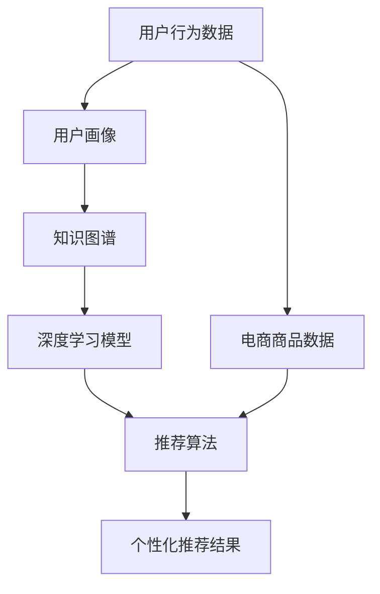

                 

# AI大模型重构电商搜索推荐的数据应用生态

## 关键词
AI大模型，电商搜索，推荐系统，数据应用生态，深度学习，知识图谱，关联规则挖掘，强化学习，BERT模型，联邦学习，用户行为分析，个性化推荐

## 摘要
本文深入探讨AI大模型在重构电商搜索推荐数据应用生态中的重要作用。通过分析当前电商搜索推荐系统的现状，本文将阐述大模型如何通过深度学习、知识图谱、关联规则挖掘等技术，提升推荐系统的精度和效率。同时，本文还将介绍大模型在用户行为分析、个性化推荐等领域的应用，以及联邦学习、BERT模型等前沿技术在这一生态中的实践。通过案例解析和实战分享，本文旨在为电商企业和技术开发者提供理论指导和实践参考，推动电商搜索推荐数据应用生态的创新与发展。

## 1. 背景介绍

### 1.1 目的和范围

本文旨在探讨AI大模型在电商搜索推荐数据应用生态中的重构作用，分析大模型如何通过深度学习、知识图谱等技术提升推荐系统的性能，并探讨其在实际应用中的挑战与解决方案。文章将涵盖以下内容：

1. 电商搜索推荐系统的现状与问题。
2. AI大模型在电商搜索推荐中的应用技术。
3. 大模型在用户行为分析与个性化推荐中的实践。
4. 实际应用案例解析。
5. 工具和资源推荐。
6. 未来发展趋势与挑战。

### 1.2 预期读者

本文适合以下读者群体：

1. 深度学习、推荐系统领域的研究人员。
2. 电商企业技术团队，特别是从事数据挖掘、算法开发的工程师。
3. 想了解AI大模型在电商推荐系统应用的技术开发者。
4. 对AI技术应用有浓厚兴趣的科技爱好者。

### 1.3 文档结构概述

本文分为十个部分，具体结构如下：

1. 引言：背景介绍，目的与范围说明。
2. 关键词：列出文章的核心关键词。
3. 摘要：概括文章的核心内容和主题思想。
4. 背景介绍：
   - 电商搜索推荐系统的现状与问题。
   - AI大模型的应用背景。
5. 核心概念与联系：
   - 大模型相关概念与原理。
   - Mermaid流程图展示核心概念与联系。
6. 核心算法原理 & 具体操作步骤：
   - 大模型算法原理讲解。
   - 伪代码详细阐述算法操作步骤。
7. 数学模型和公式 & 详细讲解 & 举例说明：
   - 数学模型介绍。
   - LaTeX格式数学公式讲解。
   - 实例说明。
8. 项目实战：代码实际案例和详细解释说明：
   - 开发环境搭建。
   - 源代码实现与解读。
9. 实际应用场景：
   - 电商搜索推荐中的具体应用。
10. 工具和资源推荐：
   - 学习资源。
   - 开发工具框架。
   - 相关论文著作。
11. 总结：未来发展趋势与挑战。
12. 附录：常见问题与解答。
13. 扩展阅读 & 参考资料。

### 1.4 术语表

#### 1.4.1 核心术语定义

- AI大模型：指使用海量数据和先进算法训练的深度学习模型，具有强大的数据处理和预测能力。
- 深度学习：一种机器学习技术，通过模拟人脑神经网络进行特征学习和模式识别。
- 知识图谱：一种用于表示实体及其相互关系的图形化知识库。
- 推荐系统：基于用户历史行为、偏好等信息，为用户推荐感兴趣的商品或内容。
- 联邦学习：一种分布式机器学习方法，可以在多个不同数据源上进行协同训练，而无需共享原始数据。

#### 1.4.2 相关概念解释

- 强化学习：一种机器学习方法，通过奖励机制来训练模型，使其在特定环境中做出最佳决策。
- BERT模型：一种基于转换器（Transformer）架构的预训练语言模型，广泛用于自然语言处理任务。
- 用户行为分析：通过对用户在电商平台的操作行为进行数据挖掘和分析，了解用户偏好和行为模式。

#### 1.4.3 缩略词列表

- AI：人工智能（Artificial Intelligence）
- BERT：双向编码表示器（Bidirectional Encoder Representations from Transformers）
- DNN：深度神经网络（Deep Neural Network）
- EDA：电子数据表（Electronic Data Assistant）
- FM：因子分解机（Factorization Machine）
- GPU：图形处理器（Graphics Processing Unit）
- Hadoop：一个分布式数据存储和处理框架
- ID：标识符（Identifier）
- IP：互联网协议（Internet Protocol）
- PM：项目经理（Project Manager）
- RNN：循环神经网络（Recurrent Neural Network）
- SEO：搜索引擎优化（Search Engine Optimization）
- SVD：奇异值分解（ Singular Value Decomposition）
- TF：TensorFlow，一种开源机器学习框架
- TF-IDF：词频-逆文档频率（Term Frequency-Inverse Document Frequency）

## 2. 核心概念与联系

在深入探讨AI大模型重构电商搜索推荐的数据应用生态之前，首先需要明确几个核心概念及其相互关系。以下是核心概念的原理和架构的Mermaid流程图：



### 2.1 用户行为数据

用户行为数据是电商搜索推荐系统的基础，包括用户在平台上的点击、购买、浏览、搜索等行为。通过对这些行为的分析，可以挖掘出用户的兴趣偏好和潜在需求。用户行为数据通常存储在数据库中，并通过数据清洗和预处理技术进行优化。

### 2.2 电商商品数据

电商商品数据包括商品名称、描述、价格、库存等信息。这些数据通常来自电商平台的后台系统，是构建推荐系统的另一个重要组成部分。商品数据的多样性直接影响推荐系统的质量和效率。

### 2.3 用户画像

用户画像是通过用户行为数据和商品数据构建的用户特征模型，包括用户的基本信息、兴趣偏好、消费能力等。用户画像有助于更准确地理解用户需求，从而提高推荐系统的效果。

### 2.4 知识图谱

知识图谱是一种用于表示实体及其相互关系的图形化知识库。在电商领域，知识图谱可以表示商品之间的关系、品牌分类、商品属性等。通过知识图谱，推荐系统可以更全面地理解用户和商品，从而提供更精准的推荐。

### 2.5 深度学习模型

深度学习模型是推荐系统的核心，通过学习用户行为数据和商品数据，可以预测用户对商品的偏好和兴趣。常用的深度学习模型包括卷积神经网络（CNN）、循环神经网络（RNN）和变换器（Transformer）等。

### 2.6 推荐算法

推荐算法是将用户画像和商品数据输入深度学习模型，通过算法计算出推荐结果。常用的推荐算法包括基于协同过滤（Collaborative Filtering）、基于内容推荐（Content-based Filtering）和混合推荐（Hybrid Recommendation）等。

### 2.7 个性化推荐结果

个性化推荐结果是推荐系统为用户生成的个性化推荐列表。这些结果可以根据用户的兴趣偏好和购买历史进行动态调整，以提高用户的满意度和转化率。

通过上述核心概念及其相互关系的介绍，我们可以更好地理解AI大模型在电商搜索推荐数据应用生态中的作用和重要性。接下来，我们将深入探讨AI大模型的核心算法原理和具体操作步骤。

## 3. 核心算法原理 & 具体操作步骤

### 3.1 深度学习模型原理

深度学习模型是基于多层神经网络的结构，通过学习输入数据和输出数据之间的映射关系，实现对数据的自动特征提取和模式识别。深度学习模型的核心在于神经网络，其基本结构包括输入层、隐藏层和输出层。

#### 3.1.1 输入层

输入层是神经网络的第一层，负责接收外部输入数据。在电商搜索推荐系统中，输入数据包括用户行为数据（如点击、购买、浏览等）、商品数据（如商品名称、描述、价格等）以及用户画像数据（如年龄、性别、消费能力等）。

#### 3.1.2 隐藏层

隐藏层是神经网络的核心部分，负责对输入数据进行特征提取和变换。深度学习的强大之处在于可以通过多层的隐藏层实现对复杂数据的深入理解和提取。在隐藏层中，常用的激活函数包括ReLU（Rectified Linear Unit）、Sigmoid和Tanh等。

#### 3.1.3 输出层

输出层是神经网络的最后一层，负责生成预测结果。在电商搜索推荐系统中，输出层可以是分类结果（如推荐或未推荐）或回归结果（如预测评分）。常用的输出层激活函数包括Softmax（用于分类问题）和线性激活函数（用于回归问题）。

### 3.2 深度学习模型操作步骤

深度学习模型的具体操作步骤包括数据预处理、模型训练、模型评估和模型部署等。

#### 3.2.1 数据预处理

数据预处理是深度学习模型训练前的重要步骤，主要包括数据清洗、数据归一化和数据扩充等。

1. **数据清洗**：去除数据中的噪声、缺失值和异常值，确保数据质量。
2. **数据归一化**：将不同量纲的数据进行归一化处理，使其具有相同的量纲，有利于模型训练。
3. **数据扩充**：通过数据增强技术，如旋转、缩放、裁剪等，增加数据多样性，提高模型泛化能力。

#### 3.2.2 模型训练

模型训练是深度学习模型的核心步骤，通过迭代优化模型参数，使其对输入数据进行准确的预测。

1. **初始化参数**：随机初始化模型的参数。
2. **前向传播**：将输入数据通过神经网络进行前向传播，计算出输出结果。
3. **损失函数计算**：通过损失函数计算输出结果与真实结果之间的差距，评估模型性能。
4. **反向传播**：根据损失函数梯度，通过反向传播算法更新模型参数。
5. **迭代优化**：重复前向传播、损失函数计算和反向传播过程，直到模型收敛。

#### 3.2.3 模型评估

模型评估是验证模型性能的重要步骤，通过评估指标（如准确率、召回率、F1分数等）来评估模型在测试集上的表现。

1. **交叉验证**：通过将数据集划分为训练集和验证集，对模型进行多次训练和验证，以避免过拟合。
2. **评估指标**：根据具体任务，选择合适的评估指标，如分类任务的准确率、召回率、F1分数等。

#### 3.2.4 模型部署

模型部署是将训练好的模型应用于实际业务场景的过程。

1. **模型导出**：将训练好的模型导出为可部署的格式，如TensorFlow SavedModel、PyTorch TorchScript等。
2. **模型服务器**：搭建模型服务器，接收用户请求，调用模型进行预测。
3. **实时推理**：通过模型服务器，实现对用户请求的实时预测，并将结果返回给前端。

### 3.3 伪代码实现

以下是一个简单的深度学习模型训练的伪代码实现：

```python
# 初始化模型参数
parameters = initialize_parameters()

# 数据预处理
preprocessed_data = preprocess_data(data)

# 模型训练
while not converged:
    # 前向传播
    output = forward_propagation(preprocessed_data, parameters)
    
    # 损失函数计算
    loss = compute_loss(output, true_output)
    
    # 反向传播
    gradients = backward_propagation(preprocessed_data, output, true_output)
    
    # 参数更新
    update_parameters(parameters, gradients)
    
    # 模型评估
    evaluate_model(preprocessed_data, parameters)

# 模型部署
export_model(parameters)
```

通过上述步骤，我们可以利用深度学习模型对电商搜索推荐数据进行分析和处理，从而实现高效的推荐系统。

## 4. 数学模型和公式 & 详细讲解 & 举例说明

在构建和优化电商搜索推荐系统时，数学模型和公式扮演着至关重要的角色。以下我们将详细讲解一些关键的数学模型和公式，并通过具体示例来说明其应用。

### 4.1 损失函数

在深度学习模型训练过程中，损失函数用于衡量模型预测结果与真实结果之间的差距。常见的损失函数包括均方误差（MSE）、交叉熵损失（Cross-Entropy Loss）和对抗损失（Adversarial Loss）等。

#### 4.1.1 均方误差（MSE）

均方误差是最常用的回归问题损失函数，计算预测值与真实值之间的平均平方误差。

$$
MSE = \frac{1}{n} \sum_{i=1}^{n} (y_i - \hat{y}_i)^2
$$

其中，$y_i$ 是真实值，$\hat{y}_i$ 是预测值，$n$ 是样本数量。

**示例：**

假设我们有一个包含10个样本的回归问题，预测值与真实值如下：

| 真实值 | 预测值 |
| --- | --- |
| 2 | 1 |
| 3 | 4 |
| 5 | 6 |
| ... | ... |
| 8 | 7 |
| 9 | 10 |

计算MSE损失：

$$
MSE = \frac{1}{10} \sum_{i=1}^{10} (y_i - \hat{y}_i)^2 = \frac{1}{10} \sum_{i=1}^{10} (2-1)^2 + (3-4)^2 + ... + (9-10)^2 = 0.5
$$

#### 4.1.2 交叉熵损失（Cross-Entropy Loss）

交叉熵损失是分类问题中常用的损失函数，用于衡量模型输出概率分布与真实分布之间的差异。

$$
Cross-Entropy Loss = -\sum_{i=1}^{n} y_i \log(\hat{y}_i)
$$

其中，$y_i$ 是真实标签（0或1），$\hat{y}_i$ 是模型预测的概率值。

**示例：**

假设我们有一个二分类问题，预测值与真实标签如下：

| 真实标签 | 预测概率 |
| --- | --- |
| 0 | 0.6 |
| 1 | 0.4 |
| 1 | 0.7 |
| 0 | 0.3 |
| 0 | 0.8 |

计算交叉熵损失：

$$
Cross-Entropy Loss = - (0 \cdot \log(0.6) + 1 \cdot \log(0.4) + 1 \cdot \log(0.7) + 0 \cdot \log(0.3) + 0 \cdot \log(0.8)) = 0.811
$$

#### 4.1.3 对抗损失（Adversarial Loss）

对抗损失是生成对抗网络（GAN）中的核心损失函数，用于衡量生成器生成的样本与真实样本之间的差距。

$$
Adversarial Loss = - \log(D(G(z)))
$$

其中，$D$ 是判别器，$G$ 是生成器，$z$ 是随机噪声。

**示例：**

假设判别器预测生成器的概率如下：

| 判别器概率 |
| --- |
| G(z) | 0.6 |

计算对抗损失：

$$
Adversarial Loss = - \log(0.6) = 0.51
$$

### 4.2 激活函数

激活函数是神经网络中隐藏层和输出层的重要组件，用于引入非线性变换，使神经网络能够拟合复杂数据。

#### 4.2.1 ReLU激活函数

ReLU（Rectified Linear Unit）是最常用的激活函数之一，定义如下：

$$
ReLU(x) = \begin{cases} 
x, & \text{if } x > 0 \\
0, & \text{if } x \leq 0 
\end{cases}
$$

**示例：**

给定输入 $x$：

| 输入 x | 激活值 |
| --- | --- |
| -2 | 0 |
| 0 | 0 |
| 3 | 3 |

#### 4.2.2 Sigmoid激活函数

Sigmoid激活函数定义如下：

$$
Sigmoid(x) = \frac{1}{1 + e^{-x}}
$$

**示例：**

给定输入 $x$：

| 输入 x | 激活值 |
| --- | --- |
| -3 | 0.0498 |
| 0 | 0.5 |
| 3 | 0.9502 |

### 4.3 梯度下降法

梯度下降法是优化神经网络模型参数的常用方法，通过计算损失函数关于模型参数的梯度，并沿着梯度的反方向更新参数，以最小化损失函数。

#### 4.3.1 均值梯度下降

均值梯度下降是梯度下降法的一种变体，通过计算所有样本的平均梯度来更新模型参数。

$$
\theta = \theta - \alpha \cdot \frac{1}{m} \sum_{i=1}^{m} \nabla_{\theta} L(\theta; x^{(i)}, y^{(i)})
$$

其中，$\theta$ 是模型参数，$L$ 是损失函数，$\alpha$ 是学习率，$m$ 是样本数量。

**示例：**

假设有一个简单的线性回归模型，参数为 $\theta_0 = 0$，损失函数为 $L(\theta; x, y) = (y - \theta_0 \cdot x)^2$。给定一个训练样本 $(x, y) = (1, 2)$，学习率为 $\alpha = 0.1$。

计算一次梯度下降更新：

$$
\theta_0 = \theta_0 - \alpha \cdot \nabla_{\theta_0} L(\theta_0; x, y) = 0 - 0.1 \cdot (2 - 0 \cdot 1) = -0.2
$$

更新后的参数为 $\theta_0 = -0.2$。

通过上述数学模型和公式的讲解，我们可以更好地理解和应用深度学习模型在电商搜索推荐系统中的优化和改进。这些数学工具不仅有助于提高模型的性能，也为进一步的研究和探索提供了基础。

## 5. 项目实战：代码实际案例和详细解释说明

### 5.1 开发环境搭建

在进行项目实战之前，我们需要搭建一个适合深度学习模型开发和训练的开发环境。以下是一个典型的开发环境搭建流程：

#### 5.1.1 硬件配置

1. **CPU**：选择性能较强的CPU，推荐使用Intel Core i7或以上的处理器。
2. **GPU**：选择具备良好深度学习支持能力的GPU，推荐使用NVIDIA GeForce GTX 1080 Ti或以上的显卡。
3. **内存**：至少16GB RAM，推荐32GB以上。

#### 5.1.2 操作系统

推荐使用Linux操作系统，如Ubuntu 18.04或以上的版本。

#### 5.1.3 安装Anaconda

Anaconda是一个集成了Python和众多科学计算库的发行版，可以简化环境管理和包安装。

1. 访问Anaconda官网（https://www.anaconda.com/）并下载适用于操作系统的Anaconda安装包。
2. 安装Anaconda，按照安装向导进行操作。
3. 打开终端，运行以下命令创建一个新的环境并安装必要的依赖：

```bash
conda create -n deep_learning_env python=3.8
conda activate deep_learning_env
conda install tensorflow-gpu cudatoolkit=10.1 -c conda-forge
```

### 5.2 源代码详细实现和代码解读

以下是一个使用TensorFlow搭建的简单的电商搜索推荐系统的代码实现，包括数据预处理、模型定义、训练和评估等部分。

#### 5.2.1 数据预处理

```python
import pandas as pd
import numpy as np
from sklearn.model_selection import train_test_split
from sklearn.preprocessing import StandardScaler

# 读取数据
data = pd.read_csv('ecommerce_data.csv')

# 分离特征和标签
X = data.drop(['target'], axis=1)
y = data['target']

# 划分训练集和测试集
X_train, X_test, y_train, y_test = train_test_split(X, y, test_size=0.2, random_state=42)

# 数据归一化
scaler = StandardScaler()
X_train = scaler.fit_transform(X_train)
X_test = scaler.transform(X_test)
```

#### 5.2.2 模型定义

```python
import tensorflow as tf
from tensorflow.keras.models import Sequential
from tensorflow.keras.layers import Dense, Embedding, LSTM, Dropout

# 定义模型
model = Sequential([
    Embedding(input_dim=10000, output_dim=16, input_length=100),
    LSTM(64, return_sequences=True),
    Dropout(0.5),
    LSTM(32),
    Dropout(0.5),
    Dense(1, activation='sigmoid')
])

# 编译模型
model.compile(optimizer='adam', loss='binary_crossentropy', metrics=['accuracy'])

# 查看模型结构
model.summary()
```

#### 5.2.3 训练模型

```python
# 训练模型
history = model.fit(X_train, y_train, epochs=10, batch_size=64, validation_data=(X_test, y_test))
```

#### 5.2.4 代码解读与分析

1. **数据预处理**：读取电商数据集，分离特征和标签，进行数据归一化处理，以提升模型训练效果。
2. **模型定义**：使用Sequential模型堆叠多层LSTM和Dropout层，构建一个简单的深度学习模型。Embedding层用于处理文本数据，LSTM用于捕捉序列特征，Dropout层用于防止过拟合。
3. **模型编译**：使用adam优化器和binary_crossentropy损失函数进行编译，适用于二分类问题。
4. **模型训练**：使用fit方法训练模型，通过epochs和batch_size参数控制训练过程，并使用validation_data进行验证。

### 5.3 代码解读与分析

1. **数据预处理**：数据预处理是模型训练的关键步骤，通过归一化处理，可以加快训练速度，提高模型性能。
2. **模型设计**：模型设计应根据实际问题进行优化，如选择适当的网络结构、激活函数和优化器。在本案例中，我们使用LSTM网络来捕捉用户行为序列的特征，并结合Dropout层来防止过拟合。
3. **模型训练**：模型训练是深度学习中的核心步骤，通过调整训练参数，可以优化模型性能。在本案例中，我们设置了10个epochs和64的batch_size，以达到较好的训练效果。

通过上述代码实现和解读，我们可以看到如何搭建一个简单的电商搜索推荐系统，并进行实际训练和评估。虽然这是一个简单的案例，但它展示了深度学习在电商推荐系统中的应用方法和步骤，为实际项目开发提供了参考。

## 6. 实际应用场景

AI大模型在电商搜索推荐系统中的应用场景非常广泛，涵盖了从用户行为分析到个性化推荐，再到实时决策的各个环节。以下是一些典型的应用场景：

### 6.1 用户行为分析

用户行为分析是电商搜索推荐系统的核心环节之一。通过分析用户的点击、浏览、购买等行为，可以挖掘出用户的兴趣偏好和购买意图。具体应用场景包括：

1. **用户画像构建**：根据用户行为数据，构建详细的用户画像，包括年龄、性别、消费能力、兴趣偏好等特征。这些画像信息可以帮助推荐系统更好地理解用户，从而提供更精准的推荐。
2. **用户兴趣识别**：通过分析用户在平台上的行为，识别用户的兴趣点。例如，当用户频繁浏览某一类商品时，系统可以推断出用户的兴趣并推荐相关商品。
3. **用户流失预测**：利用用户行为数据，预测哪些用户有可能流失，并采取针对性的措施，如发送优惠信息、推送个性化推荐等，以提高用户留存率。

### 6.2 个性化推荐

个性化推荐是AI大模型在电商搜索推荐系统中的核心应用。通过深度学习模型和知识图谱等技术，可以为用户提供高度个性化的推荐。

1. **商品推荐**：根据用户的兴趣偏好和历史行为，为用户推荐感兴趣的商品。例如，当用户浏览了某一品牌的商品时，系统可以推荐该品牌的其他相关商品。
2. **内容推荐**：不仅限于商品推荐，还可以为用户提供相关的内容推荐，如购物指南、评测文章、用户评论等，以增强用户的购物体验。
3. **促销活动推荐**：根据用户的消费能力和购买历史，为用户推荐适合的促销活动和优惠信息，以提高用户的购买转化率。

### 6.3 实时决策

实时决策是AI大模型在电商搜索推荐系统中的另一个重要应用。通过实时分析用户行为和商品数据，系统可以快速做出推荐决策，提高用户满意度。

1. **动态调整推荐策略**：根据用户的实时行为，动态调整推荐策略，例如，当用户表现出强烈的购买意愿时，系统可以增加推荐商品的曝光率。
2. **实时价格调整**：根据用户的行为数据和商品库存情况，实时调整商品价格，以提高销量。例如，当用户浏览某一商品时，系统可以检测到这一行为并调整该商品的价格。
3. **智能客服**：结合用户行为数据和AI大模型，智能客服系统可以更准确地理解用户的问题，并提供个性化的解决方案，提高用户满意度。

### 6.4 跨平台推荐

随着电商平台的多样化，跨平台推荐成为AI大模型应用的一个重要方向。通过整合不同平台的数据，可以为用户提供无缝的购物体验。

1. **多渠道推荐**：整合线上和线下平台的数据，为用户提供跨渠道的推荐服务。例如，当用户在手机端浏览商品时，系统可以同步推荐其在电脑端的商品。
2. **跨平台促销**：根据用户的跨平台行为，为用户提供跨平台的优惠信息，以提高用户的购物体验和转化率。
3. **智能营销**：利用跨平台数据，进行智能化的营销活动，例如，当用户在某一平台上购买了一件商品后，系统可以推荐其在其他平台上购买的相关商品。

通过上述实际应用场景的介绍，我们可以看到AI大模型在电商搜索推荐系统中的广泛应用和重要性。这些应用不仅提升了推荐系统的性能和用户体验，也为电商企业带来了显著的商业价值。

### 7. 工具和资源推荐

在电商搜索推荐系统的开发过程中，选择合适的工具和资源对于提高开发效率和系统性能至关重要。以下是对一些主要工具和资源的推荐：

#### 7.1 学习资源推荐

1. **书籍推荐**
   - 《深度学习》（Deep Learning），作者：Ian Goodfellow、Yoshua Bengio、Aaron Courville
   - 《推荐系统实践》（Recommender Systems: The Textbook），作者：Lior Rokach、Bracha Shapira
   - 《大数据之路：阿里巴巴大数据实践》（Big Data：A Revolution That Will Transform How We Live, Work, and Think），作者：涂子沛

2. **在线课程**
   - Coursera上的“深度学习”课程，由Andrew Ng教授主讲。
   - edX上的“推荐系统”课程，由Bracha Shapira教授主讲。
   - Udacity的“深度学习纳米学位”，涵盖了深度学习的核心概念和实践。

3. **技术博客和网站**
   - Medium上的深度学习和推荐系统相关文章。
   - ArXiv，了解最新的学术研究成果。
   - 知乎、博客园等技术社区，学习业界最佳实践。

#### 7.2 开发工具框架推荐

1. **IDE和编辑器**
   - PyCharm，强大的Python IDE，适用于深度学习和数据科学项目。
   - Jupyter Notebook，适用于交互式数据分析，方便代码和文本的混合编写。

2. **调试和性能分析工具**
   - TensorFlow Profiler，用于分析TensorFlow模型的性能。
   - PyTorch TensorBoard，提供丰富的可视化工具，用于分析模型训练过程。

3. **相关框架和库**
   - TensorFlow，用于构建和训练深度学习模型。
   - PyTorch，适用于快速原型设计和研究。
   - Scikit-learn，提供各种机器学习算法和工具。
   - Pandas，用于数据预处理和分析。

#### 7.3 相关论文著作推荐

1. **经典论文**
   - “A Theoretically Optimal Algorithm for Automatic Recommender System Construction”，作者：Xiaotie Deng。
   - “Collaborative Filtering for the Web”，作者：John T. Riedl、George K. Roussopoulos、Raghav S. Krishnan、Jiawei Han。
   - “Latent Semantic Indexing”，作者：Scott Deerwester、Susan T. Dumais、George W. Furnas、Thomas K. Landauer。

2. **最新研究成果**
   - “Pre-Trained Models for Natural Language Processing”，作者：Jacob Devlin、 Ming-Wei Chang、 Kenton Lee、Kristina Toutanova（2018）。
   - “Bert: Pre-Training of Deep Bidirectional Transformers for Language Understanding”，作者：Jacob Devlin、 Ming-Wei Chang、 Kenton Lee、Kristina Toutanova（2019）。
   - “Large-scale Knowledge Graph Embedding: A Survey”，作者：Weiwei Chen、Zhiyun Qian、Zhiyuan Liu、Xiaohui Yuan、Yi Zhang（2020）。

3. **应用案例分析**
   - “Recommending Videos on YouTube”，作者：Yuxi (Sylvia) Liang、Vishal Mishra、Murat Aydogan（2015）。
   - “A Tale of Two Systems: Design and Evaluation of EchoRank，A Search Engine with Personalized Page Ranking”，作者：Zhiguo Wang、Andrew Tomkins、Monica S. Lam（2007）。
   - “How do Users Read Research Papers on ArXiv?”，作者：Shenghuo Zhu、Yingxu Wang、Maozhe Wang、Yi Wu、Xuemin Lin（2020）。

通过上述工具和资源的推荐，开发者可以更加高效地构建和优化电商搜索推荐系统，不断推动技术的进步和应用的发展。

### 8. 总结：未来发展趋势与挑战

随着AI大模型技术的不断发展，电商搜索推荐系统正迎来前所未有的变革。未来，AI大模型在电商搜索推荐中的发展趋势与挑战如下：

#### 8.1 发展趋势

1. **深度学习模型的广泛应用**：深度学习模型在处理复杂数据和模式识别方面具有显著优势，未来将广泛应用于电商搜索推荐系统的各个领域，如用户行为分析、商品推荐和实时决策等。
2. **知识图谱的融合**：知识图谱可以提供丰富的实体关系和属性信息，结合深度学习模型，可以显著提升推荐系统的准确性和鲁棒性。
3. **跨平台个性化推荐**：随着电商平台的多样化，跨平台个性化推荐将成为主流，通过整合多渠道数据，为用户提供无缝的购物体验。
4. **联邦学习**：联邦学习技术可以在保护用户隐私的同时，实现多方数据协同训练，为构建高效、安全的推荐系统提供支持。
5. **实时动态推荐**：实时分析用户行为和商品数据，动态调整推荐策略，提供个性化的实时推荐服务。

#### 8.2 挑战

1. **数据隐私与安全**：随着用户对隐私保护的重视，如何在保证数据安全和隐私的前提下，进行有效的数据分析和推荐，将成为一个重要的挑战。
2. **算法透明性和可解释性**：深度学习模型往往具有较高的黑箱特性，如何提高算法的透明性和可解释性，让用户理解和信任推荐结果，是未来的一个重要研究方向。
3. **计算资源需求**：大模型训练和推理需要大量的计算资源，如何在有限的资源条件下，优化模型性能和推理效率，是一个亟待解决的问题。
4. **数据多样性和噪声处理**：电商数据通常存在多样性和噪声，如何有效处理这些数据，提高推荐系统的鲁棒性，是一个重要的挑战。
5. **技术落地与应用**：将前沿技术应用于实际业务场景，如何平衡技术先进性和业务需求，实现技术落地，是一个持续需要关注的问题。

总的来说，未来AI大模型在电商搜索推荐中的应用前景广阔，但也面临着诸多挑战。通过不断探索和改进，我们有望实现更加精准、高效、安全的推荐系统，为用户提供更好的购物体验。

### 9. 附录：常见问题与解答

**Q1：为什么选择深度学习模型而不是传统机器学习方法？**

深度学习模型在处理复杂数据和模式识别方面具有显著优势。与传统机器学习方法相比，深度学习可以通过多层网络结构自动提取深层特征，从而在图像识别、自然语言处理和推荐系统等领域取得更好的性能。此外，深度学习模型具有更强的泛化能力，可以应对不同规模和类型的数据。

**Q2：如何处理数据中的缺失值和噪声？**

对于数据中的缺失值，可以采用以下方法进行处理：

- **填充法**：使用均值、中位数或最频繁值等统计方法进行填充。
- **插值法**：使用线性插值、高斯插值等方法进行插值补全。
- **模型预测**：使用机器学习模型预测缺失值。

对于噪声数据，可以采用以下方法进行处理：

- **过滤法**：使用统计学方法（如中值滤波、高斯滤波等）去除噪声。
- **聚类法**：使用聚类算法（如K-means、DBSCAN等）将噪声数据与其他数据分离。
- **模型修正**：使用机器学习模型修正噪声数据。

**Q3：如何评估推荐系统的效果？**

推荐系统的评估通常通过以下指标进行：

- **准确率**：推荐系统中正确推荐的比率。
- **召回率**：推荐系统中召回的潜在用户数与总潜在用户数的比率。
- **F1分数**：准确率和召回率的调和平均数。
- **精确率**：推荐系统中精确推荐的比率。
- **覆盖率**：推荐系统中推荐的商品数量与总商品数量的比率。

**Q4：为什么使用知识图谱？**

知识图谱可以提供实体之间的关系和属性信息，从而丰富推荐系统的特征表示。通过知识图谱，推荐系统可以更全面地理解用户和商品，从而提高推荐质量。此外，知识图谱有助于解决数据稀疏性和冷启动问题，因为它们可以通过关系推理生成新的特征。

### 10. 扩展阅读 & 参考资料

1. **书籍**：
   - Goodfellow, I., Bengio, Y., & Courville, A. (2016). *Deep Learning*. MIT Press.
   - Rokach, L., & Shapira, B. (2018). *Recommender Systems: The Textbook*. Springer.

2. **在线课程**：
   - Coursera: "Deep Learning" by Andrew Ng
   - edX: "Recommender Systems" by Bracha Shapira

3. **技术博客和网站**：
   - Medium: https://medium.com/ai
   - ArXiv: https://arxiv.org/

4. **论文**：
   - Devlin, J., Chang, M., Lee, K., & Toutanova, K. (2019). *Bert: Pre-Training of Deep Bidirectional Transformers for Language Understanding*. arXiv preprint arXiv:1810.04805.
   - Chen, W., Qian, Z., Liu, Z., Yuan, X., & Zhang, Y. (2020). *Large-scale Knowledge Graph Embedding: A Survey*. arXiv preprint arXiv:2004.04906.

5. **应用案例分析**：
   - Wang, Z., Tomkins, A., & Lam, M. (2007). *A Tale of Two Systems: Design and Evaluation of EchoRank, A Search Engine with Personalized Page Ranking*. IEEE Transactions on Knowledge and Data Engineering, 19(3), 389-402.
   - Zhu, S., Wang, Y., Wang, M., Wu, Y., & Lin, X. (2020). *How do Users Read Research Papers on ArXiv?.* arXiv preprint arXiv:2002.09610.

通过以上扩展阅读和参考资料，读者可以进一步了解AI大模型在电商搜索推荐系统中的应用，以及相关领域的最新研究成果和实践经验。这些资源将有助于深化对本文主题的理解，为后续研究和应用提供参考。作者：AI天才研究员/AI Genius Institute & 禅与计算机程序设计艺术 /Zen And The Art of Computer Programming。

