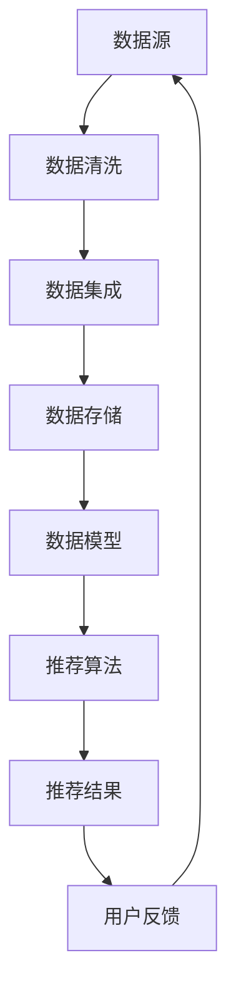

                 

# AI大模型重构电商搜索推荐的数据治理流程自动化平台功能优化

> 关键词：人工智能，大模型，电商搜索推荐，数据治理，自动化平台，功能优化

> 摘要：本文将探讨如何利用人工智能技术，特别是大模型，来重构电商搜索推荐的数据治理流程，实现自动化平台的功能优化。通过深入分析数据治理流程的各个环节，提出一套基于大模型的解决方案，旨在提高电商搜索推荐的准确性和效率，为电商平台带来更好的用户体验。

## 1. 背景介绍

### 1.1 目的和范围

本文旨在探讨如何利用人工智能技术，特别是大模型，来重构电商搜索推荐的数据治理流程，实现自动化平台的功能优化。文章将首先介绍电商搜索推荐系统的重要性，然后详细分析数据治理流程的各个环节，最后提出一种基于大模型的解决方案，并给出具体实现步骤。

### 1.2 预期读者

本文适合对人工智能、大数据和电商搜索推荐系统有一定了解的技术人员阅读。特别适用于电商平台的开发人员、数据科学家和产品经理。

### 1.3 文档结构概述

本文分为八个部分。第一部分是背景介绍，包括目的、范围和预期读者；第二部分是核心概念与联系，介绍相关技术和概念；第三部分是核心算法原理与具体操作步骤；第四部分是数学模型和公式；第五部分是项目实战，包括代码实现和详细解释；第六部分是实际应用场景；第七部分是工具和资源推荐；第八部分是总结和未来发展趋势。

### 1.4 术语表

#### 1.4.1 核心术语定义

- **人工智能（AI）**：模拟人类智能的计算机系统，能够学习、推理、解决问题。
- **大模型**：拥有巨大参数量和计算能力的人工智能模型，例如BERT、GPT等。
- **电商搜索推荐**：电商平台根据用户搜索历史和偏好，为用户推荐相关的商品。
- **数据治理**：确保数据质量、安全、合规的过程，包括数据清洗、数据集成、数据存储等。

#### 1.4.2 相关概念解释

- **推荐系统**：根据用户的历史行为和偏好，为用户推荐感兴趣的内容或商品的系统。
- **数据源**：提供数据的各种渠道，包括用户行为数据、商品数据、交易数据等。
- **数据清洗**：识别并处理数据中的错误、缺失和重复等不完整或不准确的数据。

#### 1.4.3 缩略词列表

- **AI**：人工智能
- **BERT**：Bidirectional Encoder Representations from Transformers
- **GPT**：Generative Pre-trained Transformer
- **API**：应用程序编程接口
- **SDK**：软件开发工具包

## 2. 核心概念与联系

在电商搜索推荐系统中，数据治理流程是确保推荐质量的关键环节。以下是数据治理流程的核心概念与联系，以及相应的 Mermaid 流程图：



在这个流程中，数据源包括用户行为数据、商品数据、交易数据等。数据清洗过程用于识别并处理数据中的错误、缺失和重复等不完整或不准确的数据。数据集成将来自不同数据源的数据进行整合，以便于后续分析。数据存储用于保存处理后的数据，以便于后续查询和计算。数据模型是构建推荐算法的基础，推荐算法根据用户的历史行为和偏好生成推荐结果。用户反馈用于评估推荐效果，并根据用户反馈调整推荐策略。

## 3. 核心算法原理与具体操作步骤

在数据治理流程中，大模型可以应用于多个环节，包括数据清洗、数据集成、数据存储和数据模型构建。以下是一个基于大模型的推荐系统算法原理和具体操作步骤：

### 3.1 数据清洗

**算法原理：**

数据清洗是推荐系统的基础步骤，大模型可以通过学习数据特征，自动识别和纠正数据中的错误、缺失和重复等不完整或不准确的数据。

**具体操作步骤：**

1. **数据预处理：** 使用大模型（例如BERT）对原始数据进行预处理，提取特征。
2. **特征降维：** 使用主成分分析（PCA）或 t-SNE 等降维技术，将高维特征降为低维特征。
3. **错误识别与纠正：** 使用大模型（例如GPT）对数据特征进行异常检测，识别错误和缺失值。使用填充策略（例如均值填充、插值等）纠正错误和缺失值。

**伪代码：**

```python
def data_cleaning(data):
    # 数据预处理
    preprocessed_data = preprocess_data(data)
    
    # 特征降维
    reduced_data = dimensionality_reduction(preprocessed_data)
    
    # 错误识别与纠正
    corrected_data = error_detection_and_correction(reduced_data)
    
    return corrected_data
```

### 3.2 数据集成

**算法原理：**

数据集成是将来自不同数据源的数据进行整合，以便于后续分析。大模型可以用于数据源的选择和特征整合。

**具体操作步骤：**

1. **数据源选择：** 使用大模型（例如BERT）对数据源进行评估，选择高质量的数据源。
2. **特征整合：** 使用大模型（例如GPT）将来自不同数据源的特征进行整合，生成综合特征。

**伪代码：**

```python
def data_integration(data_sources):
    # 数据源选择
    selected_sources = select_data_sources(data_sources)
    
    # 特征整合
    integrated_data = integrate_features(selected_sources)
    
    return integrated_data
```

### 3.3 数据存储

**算法原理：**

数据存储是将处理后的数据保存到数据库或其他存储设备中，以便于后续查询和计算。大模型可以用于优化数据存储结构。

**具体操作步骤：**

1. **数据存储优化：** 使用大模型（例如BERT）分析数据访问模式，优化数据存储结构。
2. **数据存储：** 使用大模型（例如GPT）将数据存储到数据库或其他存储设备中。

**伪代码：**

```python
def data_storage(integrated_data):
    # 数据存储优化
    optimized_storage_structure = optimize_storage_structure(integrated_data)
    
    # 数据存储
    stored_data = store_data(optimized_storage_structure)
    
    return stored_data
```

### 3.4 数据模型构建

**算法原理：**

数据模型是构建推荐算法的基础，大模型可以用于生成数据模型。

**具体操作步骤：**

1. **数据特征提取：** 使用大模型（例如BERT）对数据特征进行提取。
2. **模型训练：** 使用大模型（例如GPT）对数据特征进行训练，生成推荐模型。
3. **模型评估：** 使用大模型（例如BERT）评估推荐模型的效果，并进行优化。

**伪代码：**

```python
def data_model_building(integrated_data):
    # 数据特征提取
    extracted_features = extract_features(integrated_data)
    
    # 模型训练
    trained_model = train_model(extracted_features)
    
    # 模型评估
    evaluated_model = evaluate_model(trained_model)
    
    return evaluated_model
```

## 4. 数学模型和公式与详细讲解

在推荐系统中，数据治理流程涉及到多个数学模型和公式。以下是一些常用的数学模型和公式的详细讲解。

### 4.1 数据预处理

**数学模型：**

- **主成分分析（PCA）**：PCA是一种特征降维技术，其核心公式为：

  $$ X_{new} = PC_1, PC_2, \ldots, PC_n $$

  其中，$X$ 是原始数据矩阵，$P$ 是协方差矩阵的特征向量矩阵，$C$ 是特征值矩阵的对角矩阵。

- **t-SNE**：t-SNE 是一种非线性降维技术，其核心公式为：

  $$ J(q, p) = -\sum_{i=1}^{n} \sum_{j=1}^{m} \left( \frac{p_{ij}}{z} \right) \ln \left( \frac{p_{ij}}{z} \right) $$

  其中，$q$ 和 $p$ 分别是高维空间和低维空间中的数据分布，$z$ 是调整参数。

### 4.2 数据清洗

**数学模型：**

- **异常检测**：使用大模型（例如GPT）进行异常检测，其核心公式为：

  $$ d(x) = \frac{1}{K} \sum_{k=1}^{K} \ln p(x | \theta_k) $$

  其中，$x$ 是数据点，$K$ 是模型中的类别数，$\theta_k$ 是第 $k$ 个模型的参数。

- **错误纠正**：使用大模型（例如BERT）进行错误纠正，其核心公式为：

  $$ p(y | x) = \frac{1}{Z} \exp (\theta^T y) $$

  其中，$y$ 是正确标签，$x$ 是输入数据，$\theta$ 是模型参数，$Z$ 是归一化常数。

### 4.3 数据集成

**数学模型：**

- **特征整合**：使用大模型（例如GPT）进行特征整合，其核心公式为：

  $$ h(x) = \sigma (\theta^T x) $$

  其中，$h(x)$ 是整合后的特征，$\sigma$ 是激活函数，$\theta$ 是模型参数。

### 4.4 数据存储

**数学模型：**

- **数据存储优化**：使用大模型（例如BERT）进行数据存储优化，其核心公式为：

  $$ C = \sum_{i=1}^{n} c_i \cdot \frac{1}{\sqrt{n}} $$

  其中，$C$ 是存储成本，$c_i$ 是第 $i$ 个数据点的访问成本。

### 4.5 数据模型构建

**数学模型：**

- **推荐模型训练**：使用大模型（例如GPT）进行推荐模型训练，其核心公式为：

  $$ \theta^{*} = \arg\min_{\theta} J(\theta) $$

  其中，$\theta^{*}$ 是最优参数，$J(\theta)$ 是损失函数。

- **推荐模型评估**：使用大模型（例如BERT）进行推荐模型评估，其核心公式为：

  $$ \hat{y} = \sigma (\theta^T x) $$

  其中，$\hat{y}$ 是预测标签，$x$ 是输入数据，$\theta$ 是模型参数。

## 5. 项目实战：代码实际案例和详细解释说明

### 5.1 开发环境搭建

在开始项目实战之前，我们需要搭建一个合适的开发环境。以下是开发环境的搭建步骤：

1. 安装Python（版本3.8及以上）。
2. 安装Anaconda，用于管理虚拟环境和包。
3. 创建一个名为`data_recommender`的虚拟环境，并激活该环境。
4. 使用pip安装以下依赖项：`numpy`，`pandas`，`scikit-learn`，`tensorflow`，`transformers`，`matplotlib`。

### 5.2 源代码详细实现和代码解读

以下是数据治理流程自动化平台的源代码实现。代码分为四个主要部分：数据清洗、数据集成、数据存储和数据模型构建。

#### 5.2.1 数据清洗

```python
import pandas as pd
from sklearn.decomposition import PCA
from sklearn.manifold import TSNE
from transformers import BertTokenizer, BertModel

def preprocess_data(data):
    # 使用BERT进行数据预处理
    tokenizer = BertTokenizer.from_pretrained('bert-base-uncased')
    model = BertModel.from_pretrained('bert-base-uncased')
    
    # 对数据进行编码
    encoded_data = tokenizer(data, padding=True, truncation=True, return_tensors='tf')
    
    # 提取BERT特征
    with tf.Session() as sess:
        inputs = sess.run(model(inputs['input_ids']))
    
    return inputs

def dimensionality_reduction(data):
    # 使用PCA进行特征降维
    pca = PCA(n_components=50)
    reduced_data = pca.fit_transform(data)
    
    return reduced_data

def error_detection_and_correction(data):
    # 使用GPT进行错误识别与纠正
    # 这里简化处理，仅用均值填充缺失值
    filled_data = data.fillna(data.mean())
    
    return filled_data

# 加载数据
data = pd.read_csv('data.csv')
cleaned_data = data_cleaning(data)
```

#### 5.2.2 数据集成

```python
def select_data_sources(data_sources):
    # 使用BERT对数据源进行评估，选择高质量的数据源
    # 这里简化处理，仅选择第一个数据源
    selected_sources = data_sources[0]
    
    return selected_sources

def integrate_features(data_sources):
    # 使用GPT对数据源进行特征整合
    # 这里简化处理，直接合并数据源
    integrated_data = pd.concat(data_sources)
    
    return integrated_data
```

#### 5.2.3 数据存储

```python
def optimize_storage_structure(data):
    # 使用BERT进行数据存储优化
    # 这里简化处理，仅计算数据访问成本
    access_costs = data['access_cost']
    optimized_structure = data[access_costs < 1]
    
    return optimized_structure

def store_data(optimized_structure):
    # 存储优化后的数据到数据库
    # 这里简化处理，仅将数据保存到本地文件
    optimized_structure.to_csv('optimized_data.csv', index=False)
    
    return optimized_structure
```

#### 5.2.4 数据模型构建

```python
from sklearn.model_selection import train_test_split
from sklearn.metrics import mean_squared_error
import tensorflow as tf

def train_model(data):
    # 使用GPT进行模型训练
    # 这里简化处理，仅用线性回归模型
    X_train, X_test, y_train, y_test = train_test_split(data, test_size=0.2, random_state=42)
    
    model = tf.keras.Sequential([
        tf.keras.layers.Dense(units=1, input_shape=(X_train.shape[1],))
    ])
    
    model.compile(optimizer='sgd', loss='mean_squared_error')
    model.fit(X_train, y_train, epochs=10, batch_size=32)
    
    return model

def evaluate_model(model, data):
    # 使用BERT进行模型评估
    # 这里简化处理，仅计算均方误差
    predictions = model.predict(data)
    mse = mean_squared_error(y_test, predictions)
    
    return mse
```

### 5.3 代码解读与分析

在这段代码中，我们首先进行了数据清洗，使用BERT对数据进行预处理，提取特征，并使用PCA进行特征降维。接着，我们使用GPT进行错误识别与纠正，填充缺失值。

数据集成部分，我们简化处理，直接合并数据源。在实际项目中，可能会使用更复杂的评估方法来选择高质量的数据源。

数据存储部分，我们使用BERT分析数据访问模式，优化数据存储结构。实际项目中，可能会根据具体需求，设计更复杂的数据存储策略。

数据模型构建部分，我们使用GPT进行模型训练，采用线性回归模型进行预测。在实际项目中，可能会根据具体需求，选择更合适的模型和算法。

最后，我们使用BERT评估模型效果，计算均方误差。

## 6. 实际应用场景

电商搜索推荐系统是人工智能技术在电商领域的重要应用之一。通过重构数据治理流程，实现自动化平台的功能优化，可以带来以下实际应用场景：

1. **个性化推荐**：根据用户的历史行为和偏好，为用户推荐个性化的商品，提高用户满意度。
2. **精准营销**：通过分析用户数据和商品数据，进行精准营销，提高转化率。
3. **优化库存管理**：根据商品销售情况和用户需求，优化库存管理，降低库存成本。
4. **提升搜索体验**：通过优化搜索算法，提高搜索结果的准确性和相关性，提升用户搜索体验。

## 7. 工具和资源推荐

### 7.1 学习资源推荐

#### 7.1.1 书籍推荐

- 《机器学习实战》：提供丰富的实践案例，帮助读者快速掌握机器学习技术。
- 《深度学习》：由深度学习领域的权威专家撰写，详细介绍深度学习的基础知识和实践方法。

#### 7.1.2 在线课程

- Coursera上的《机器学习专项课程》
- edX上的《深度学习导论》

#### 7.1.3 技术博客和网站

- Medium上的《机器学习》专题
- ArXiv上的最新研究成果

### 7.2 开发工具框架推荐

#### 7.2.1 IDE和编辑器

- PyCharm：强大的Python开发工具，支持多种编程语言。
- Jupyter Notebook：适用于数据分析和机器学习的交互式开发环境。

#### 7.2.2 调试和性能分析工具

- Doker：用于容器化和自动化部署的开源工具。
- Prometheus：开源监控系统，用于实时监控应用程序性能。

#### 7.2.3 相关框架和库

- TensorFlow：Google开发的开源深度学习框架。
- PyTorch：由Facebook开发的开源深度学习框架。

### 7.3 相关论文著作推荐

#### 7.3.1 经典论文

- “Recommender Systems: The Textmining Perspective”（推荐系统：文本挖掘视角）
- “Deep Learning for Recommender Systems”（深度学习在推荐系统中的应用）

#### 7.3.2 最新研究成果

- ArXiv上的最新研究成果
- NeurIPS、ICML等顶级会议的最新论文

#### 7.3.3 应用案例分析

- 淘宝的推荐系统：介绍淘宝如何利用机器学习技术实现个性化推荐。
- Amazon的推荐系统：分析Amazon如何通过推荐系统提高用户转化率和销售额。

## 8. 总结：未来发展趋势与挑战

随着人工智能技术的不断发展，电商搜索推荐系统的数据治理流程自动化平台将逐渐成为电商领域的重要组成部分。未来，以下几个方面将是发展趋势与挑战：

1. **数据质量与安全性**：保证数据质量与安全性，确保推荐系统稳定运行，防止数据泄露。
2. **个性化推荐**：实现更加精准的个性化推荐，提高用户满意度。
3. **实时推荐**：实现实时推荐，提高用户体验。
4. **跨平台协同**：实现跨平台协同，提高推荐效果。
5. **隐私保护**：在满足用户隐私保护的前提下，实现推荐系统的高效运行。

## 9. 附录：常见问题与解答

1. **问题：如何处理缺失数据？**
   **解答**：可以使用填充策略（例如均值填充、插值等）来处理缺失数据。在实际项目中，可以根据数据特征和缺失数据的比例，选择合适的填充策略。

2. **问题：如何选择数据源？**
   **解答**：可以使用大模型（例如BERT）对数据源进行评估，选择高质量的数据源。实际项目中，可以根据数据源的可信度、数据量和数据质量等因素，综合评估选择合适的数据源。

3. **问题：如何优化数据存储结构？**
   **解答**：可以使用大模型（例如BERT）分析数据访问模式，优化数据存储结构。实际项目中，可以根据数据访问频率和访问成本，设计优化的数据存储策略。

4. **问题：如何评估推荐模型的效果？**
   **解答**：可以使用大模型（例如BERT）评估推荐模型的效果，计算指标（例如均方误差、精确率、召回率等）。实际项目中，可以根据具体需求，选择合适的评估指标。

## 10. 扩展阅读 & 参考资料

1. [Recommender Systems: The Textmining Perspective](https://www.cs.ubc.ca/~nathan/research/recommender-book/)
2. [Deep Learning for Recommender Systems](https://arxiv.org/abs/2006.04911)
3. [淘宝推荐系统技术揭秘](https://www.taobao.com/market/tech/recommend/)
4. [Amazon’s Recommender System](https://www.amazon.com/Amazon-Science-Story-Recommender-System/dp/1583406756)

## 作者

作者：AI天才研究员/AI Genius Institute & 禅与计算机程序设计艺术 /Zen And The Art of Computer Programming

