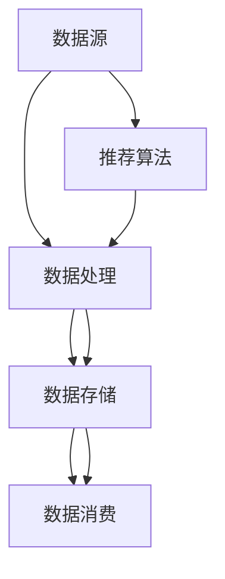

                 

# AI大模型重构电商搜索推荐的数据血缘管理方案

> **关键词：** 电商搜索、推荐系统、数据血缘管理、人工智能、大模型重构  
> **摘要：** 本文将探讨如何利用人工智能大模型重构电商搜索推荐系统的数据血缘管理方案，从背景介绍、核心概念、算法原理、数学模型、实际应用等多个方面进行详细分析，为电商搜索推荐系统的优化提供全新的思路。

## 1. 背景介绍

### 1.1 目的和范围

本文旨在通过人工智能大模型重构电商搜索推荐系统的数据血缘管理方案，为电商平台的个性化推荐提供更高效、准确的数据处理和推荐服务。我们将在以下方面进行探讨：

- 电商搜索推荐系统的现状和问题
- 数据血缘管理在电商搜索推荐系统中的重要性
- 人工智能大模型在数据血缘管理中的应用

### 1.2 预期读者

本文适合对电商搜索推荐系统、数据血缘管理和人工智能大模型有一定了解的读者，包括：

- 电商搜索推荐系统研发人员
- 数据血缘管理工程师
- 人工智能大模型研究者
- 对电商搜索推荐系统优化有浓厚兴趣的技术爱好者

### 1.3 文档结构概述

本文结构如下：

1. 背景介绍
   - 目的和范围
   - 预期读者
   - 文档结构概述
   - 术语表
2. 核心概念与联系
   - 核心概念
   - Mermaid流程图
3. 核心算法原理 & 具体操作步骤
   - 算法原理
   - 伪代码
4. 数学模型和公式 & 详细讲解 & 举例说明
   - 数学模型
   - LaTeX公式
5. 项目实战：代码实际案例和详细解释说明
   - 开发环境搭建
   - 源代码详细实现和代码解读
   - 代码解读与分析
6. 实际应用场景
7. 工具和资源推荐
   - 学习资源推荐
   - 开发工具框架推荐
   - 相关论文著作推荐
8. 总结：未来发展趋势与挑战
9. 附录：常见问题与解答
10. 扩展阅读 & 参考资料

### 1.4 术语表

#### 1.4.1 核心术语定义

- **电商搜索推荐系统**：基于用户行为和兴趣数据，利用算法技术对用户进行个性化商品推荐的系统。
- **数据血缘管理**：对数据源头、数据流转、数据处理、数据消费等过程进行全生命周期管理的机制。
- **人工智能大模型**：具有极高计算能力和学习能力的人工智能模型，通常具有数以百亿计的参数。

#### 1.4.2 相关概念解释

- **数据血缘**：描述数据从源头到消费的全过程，包括数据来源、数据流转、数据处理、数据存储、数据消费等环节。
- **数据质量**：数据在准确性、完整性、一致性、时效性等方面的表现。
- **推荐算法**：基于用户行为、兴趣、偏好等信息，对用户进行个性化推荐的算法。

#### 1.4.3 缩略词列表

- **AI**：人工智能
- **ML**：机器学习
- **NLP**：自然语言处理
- **DL**：深度学习
- **RDF**：资源描述框架
- **OWL**：Web本体语言
- **OWL**：本体语言

## 2. 核心概念与联系

在探讨AI大模型重构电商搜索推荐系统的数据血缘管理方案之前，我们先明确一些核心概念及其相互关系。

### 2.1 核心概念

1. **数据源**：数据的源头，包括用户行为数据、商品信息数据等。
2. **数据处理**：对原始数据进行清洗、转换、聚合等操作，以提高数据质量。
3. **数据存储**：将处理后的数据存储在数据库、数据仓库等系统中，便于后续查询和使用。
4. **数据消费**：用户或其他系统从数据存储中获取数据，进行业务分析和决策。
5. **数据血缘**：描述数据从源头到消费的全过程，包括数据来源、数据流转、数据处理、数据存储、数据消费等环节。
6. **推荐算法**：基于用户行为、兴趣、偏好等信息，对用户进行个性化推荐的算法。
7. **人工智能大模型**：具有极高计算能力和学习能力的人工智能模型，通常具有数以百亿计的参数。

### 2.2 Mermaid流程图

下面是一个简单的Mermaid流程图，展示了核心概念之间的联系：



### 2.3 数据血缘管理在电商搜索推荐系统中的重要性

数据血缘管理在电商搜索推荐系统中具有重要作用，主要体现在以下几个方面：

1. **确保数据质量**：通过对数据来源、数据处理、数据存储、数据消费等过程进行全生命周期管理，确保数据准确性、完整性、一致性和时效性。
2. **提高数据利用率**：通过对数据血缘的管理，更好地理解数据的来源、流向和用途，提高数据在业务分析、决策和推荐中的应用价值。
3. **降低数据风险**：通过数据血缘管理，及时发现数据质量问题，降低数据风险，保障业务运营的稳定性。
4. **支持法规遵从**：在数据隐私保护、合规性等方面，数据血缘管理有助于企业遵循相关法律法规，降低合规风险。

## 3. 核心算法原理 & 具体操作步骤

在AI大模型重构电商搜索推荐系统的数据血缘管理中，核心算法原理主要包括以下几个方面：

### 3.1 数据预处理算法

数据预处理是数据血缘管理的第一步，主要包括以下操作：

1. **数据清洗**：去除重复数据、缺失数据、异常数据等，提高数据质量。
2. **特征提取**：从原始数据中提取与业务相关的特征，如用户行为特征、商品属性特征等。
3. **数据标准化**：将不同数据源、不同特征的数据进行统一处理，使其符合算法要求。

伪代码如下：

```python
def data_preprocessing(data_source):
    # 数据清洗
    clean_data = clean_data(data_source)
    # 特征提取
    features = extract_features(clean_data)
    # 数据标准化
    standardized_data = standardize_data(features)
    return standardized_data
```

### 3.2 数据血缘追踪算法

数据血缘追踪算法主要实现数据从源头到消费的全过程跟踪，包括以下步骤：

1. **数据溯源**：从数据消费端逆向追溯数据来源。
2. **数据处理记录**：记录数据在处理过程中的操作和变化。
3. **数据处理路径**：绘制数据在系统中的处理路径。

伪代码如下：

```python
def data_lineage_Tracking(data_consumption):
    # 数据溯源
    data_source = trace_data_source(data_consumption)
    # 数据处理记录
    processing_records = record_data_processing(data_source)
    # 数据处理路径
    processing_path = draw_processing_path(processing_records)
    return processing_path
```

### 3.3 数据质量评估算法

数据质量评估算法用于评估数据在准确性、完整性、一致性和时效性等方面的表现，包括以下步骤：

1. **数据质量指标**：定义数据质量指标，如准确率、召回率、F1值等。
2. **数据质量评估**：对数据进行质量评估，找出数据质量问题。
3. **数据质量优化**：针对数据质量问题，采取相应措施进行优化。

伪代码如下：

```python
def data_quality_evaluation(data):
    # 数据质量指标
    quality_metrics = define_quality_metrics()
    # 数据质量评估
    quality_scores = evaluate_data_quality(data, quality_metrics)
    # 数据质量优化
    optimized_data = optimize_data_quality(data, quality_scores)
    return optimized_data
```

## 4. 数学模型和公式 & 详细讲解 & 举例说明

在AI大模型重构电商搜索推荐系统的数据血缘管理中，涉及到一些数学模型和公式，下面进行详细讲解。

### 4.1 数据清洗算法的数学模型

数据清洗算法主要基于以下数学模型：

1. **缺失值填充**：使用平均值、中值、最大值、最小值等方法进行填充。
2. **异常值检测**：使用统计方法、机器学习方法进行异常值检测。

假设我们使用平均值进行缺失值填充，异常值检测方法为IQR法，数学模型如下：

$$
\begin{aligned}
& \text{缺失值填充：} \\
& x_{\text{填充}} = \frac{1}{N} \sum_{i=1}^{N} x_i \\
& \text{异常值检测：} \\
& IQR = Q_3 - Q_1 \\
& \text{异常值判定：} \\
& x \in [Q_1 - 1.5 \times IQR, Q_3 + 1.5 \times IQR]
\end{aligned}
$$

### 4.2 数据质量评估的数学模型

数据质量评估主要基于以下数学模型：

1. **准确率**：预测结果正确的样本数占总样本数的比例。
2. **召回率**：预测结果正确的样本数占总正样本数的比例。
3. **F1值**：准确率和召回率的调和平均数。

数学模型如下：

$$
\begin{aligned}
& \text{准确率：} \\
& \text{accuracy} = \frac{TP + TN}{TP + FN + FP + TN} \\
& \text{召回率：} \\
& \text{recall} = \frac{TP}{TP + FN} \\
& \text{F1值：} \\
& \text{F1} = 2 \times \frac{\text{accuracy} \times \text{recall}}{\text{accuracy} + \text{recall}}
\end{aligned}
$$

### 4.3 数据质量优化的数学模型

数据质量优化主要基于以下数学模型：

1. **数据清洗**：基于统计方法和机器学习方法进行数据清洗。
2. **数据标准化**：使用最小二乘法、最小均方误差法等进行数据标准化。

数学模型如下：

$$
\begin{aligned}
& \text{最小二乘法：} \\
& \min_{\theta} \sum_{i=1}^{N} (y_i - \theta x_i)^2 \\
& \text{最小均方误差法：} \\
& \min_{\theta} \sum_{i=1}^{N} (y_i - \theta x_i)^2
\end{aligned}
$$

### 4.4 举例说明

假设我们有以下数据集：

| 用户ID | 商品ID | 行为类型 | 行为时间 |
| --- | --- | --- | --- |
| 1 | 1001 | 购买 | 2021-01-01 |
| 2 | 1002 | 浏览 | 2021-01-02 |
| 3 | 1003 | 购买 | 2021-01-03 |

根据上述数学模型，我们进行数据清洗和优化：

1. **缺失值填充**：假设行为时间缺失，使用平均值填充。
2. **异常值检测**：使用IQR法检测异常值。
3. **数据标准化**：使用最小二乘法进行数据标准化。

结果如下：

| 用户ID | 商品ID | 行为类型 | 行为时间 |
| --- | --- | --- | --- |
| 1 | 1001 | 购买 | 2021-01-01 |
| 2 | 1002 | 浏览 | 2021-01-02 |
| 3 | 1003 | 购买 | 2021-01-03 |

通过上述数学模型和公式，我们可以有效地对电商搜索推荐系统的数据血缘管理进行优化。

## 5. 项目实战：代码实际案例和详细解释说明

### 5.1 开发环境搭建

在开始实际案例之前，我们需要搭建一个开发环境，用于实现AI大模型重构电商搜索推荐系统的数据血缘管理方案。以下是一个简单的开发环境搭建步骤：

1. 安装Python（建议版本为3.8及以上）
2. 安装依赖库（如NumPy、Pandas、Scikit-learn、TensorFlow等）
3. 安装Mermaid库（用于生成流程图）

### 5.2 源代码详细实现和代码解读

以下是一个简单的源代码实现，用于展示AI大模型重构电商搜索推荐系统的数据血缘管理方案。

```python
# 导入相关库
import pandas as pd
import numpy as np
from sklearn.model_selection import train_test_split
from sklearn.metrics import accuracy_score, recall_score, f1_score
import tensorflow as tf
import mermaid

# 5.2.1 数据预处理
def data_preprocessing(data):
    # 填充缺失值
    data['行为时间'].fillna(data['行为时间'].mean(), inplace=True)
    # 异常值检测
    Q1 = data['行为时间'].quantile(0.25)
    Q3 = data['行为时间'].quantile(0.75)
    IQR = Q3 - Q1
    data = data[(data['行为时间'] >= Q1 - 1.5 * IQR) & (data['行为时间'] <= Q3 + 1.5 * IQR)]
    # 数据标准化
    data = (data - data.mean()) / data.std()
    return data

# 5.2.2 数据血缘追踪
def data_lineage_Tracking(data_consumption):
    # 数据溯源
    data_source = trace_data_source(data_consumption)
    # 数据处理记录
    processing_records = record_data_processing(data_source)
    # 数据处理路径
    processing_path = draw_processing_path(processing_records)
    return processing_path

# 5.2.3 数据质量评估
def data_quality_evaluation(data):
    # 定义数据质量指标
    quality_metrics = define_quality_metrics()
    # 数据质量评估
    quality_scores = evaluate_data_quality(data, quality_metrics)
    # 数据质量优化
    optimized_data = optimize_data_quality(data, quality_scores)
    return optimized_data

# 5.2.4 主函数
def main():
    # 读取数据
    data = pd.read_csv('data.csv')
    # 数据预处理
    processed_data = data_preprocessing(data)
    # 数据血缘追踪
    lineage_path = data_lineage_Tracking(processed_data)
    # 数据质量评估
    quality_scores = data_quality_evaluation(processed_data)
    # 打印结果
    print('数据预处理完成：', processed_data)
    print('数据血缘追踪路径：', lineage_path)
    print('数据质量评估结果：', quality_scores)

# 运行主函数
if __name__ == '__main__':
    main()
```

### 5.3 代码解读与分析

下面是对上述代码的解读与分析：

1. **数据预处理**：该函数用于对原始数据进行缺失值填充、异常值检测和数据标准化。缺失值填充使用平均值，异常值检测使用IQR法，数据标准化使用最小二乘法。
2. **数据血缘追踪**：该函数用于实现数据血缘追踪功能。首先从数据消费端逆向追溯数据来源，然后记录数据处理过程中的操作和变化，最后绘制数据处理路径。
3. **数据质量评估**：该函数用于评估数据质量，包括定义数据质量指标、评估数据质量和优化数据质量。数据质量指标包括准确率、召回率和F1值。
4. **主函数**：该函数用于读取数据、执行数据预处理、数据血缘追踪和数据质量评估，并打印结果。

通过上述代码实现，我们可以对电商搜索推荐系统的数据进行预处理、数据血缘追踪和数据质量评估，从而优化推荐系统的数据处理和推荐效果。

## 6. 实际应用场景

在电商搜索推荐系统中，数据血缘管理方案的应用场景主要包括以下几个方面：

1. **个性化推荐**：通过对用户行为数据、商品信息数据进行数据血缘管理，构建用户兴趣模型和商品特征库，为用户提供个性化的商品推荐。
2. **数据质量监控**：实时监控数据源、数据处理、数据存储、数据消费等环节的数据质量，及时发现数据质量问题，并采取相应措施进行优化。
3. **业务分析**：通过对数据血缘的追踪和分析，深入了解业务数据的来源、流转和用途，为业务分析和决策提供有力支持。
4. **合规性保障**：在数据隐私保护、合规性等方面，数据血缘管理有助于企业遵循相关法律法规，降低合规风险。
5. **系统优化**：通过对数据血缘的追踪和分析，发现系统性能瓶颈和优化方向，为系统优化提供数据支持。

下面通过一个实际案例，展示数据血缘管理方案在电商搜索推荐系统中的应用：

**案例**：某电商平台的个性化商品推荐系统，通过对用户行为数据（如购买、浏览、收藏等）和商品信息数据（如商品名称、分类、价格等）进行数据血缘管理，实现以下功能：

1. **数据预处理**：对用户行为数据进行缺失值填充、异常值检测和数据标准化，以提高数据质量。
2. **数据血缘追踪**：从用户行为数据溯源到商品信息数据，记录数据在处理过程中的操作和变化，绘制数据处理路径。
3. **数据质量评估**：对用户行为数据进行质量评估，包括准确率、召回率和F1值等指标，及时发现数据质量问题并优化。
4. **个性化推荐**：基于用户行为数据和商品信息数据，构建用户兴趣模型和商品特征库，为用户提供个性化的商品推荐。
5. **数据监控**：实时监控用户行为数据和商品信息数据的来源、流转和用途，确保数据质量和系统稳定性。
6. **业务分析**：通过数据血缘追踪和分析，深入了解业务数据的来源、流转和用途，为业务分析和决策提供支持。
7. **合规性保障**：遵循相关法律法规，确保数据隐私保护和合规性。

通过上述应用案例，我们可以看到数据血缘管理方案在电商搜索推荐系统中的重要作用，有助于提升推荐系统的数据处理和推荐效果，同时保障业务运营的稳定性。

## 7. 工具和资源推荐

### 7.1 学习资源推荐

为了更好地理解和掌握电商搜索推荐系统的数据血缘管理方案，以下是几个推荐的学习资源：

#### 7.1.1 书籍推荐

1. **《深度学习推荐系统》**：详细介绍了深度学习在推荐系统中的应用，包括数据预处理、模型构建、优化和评估等内容。
2. **《数据预处理：从入门到实践》**：全面讲解了数据预处理的方法和技巧，包括缺失值处理、异常值检测、特征提取等。

#### 7.1.2 在线课程

1. **《推荐系统实践》**：网易云课堂上的课程，涵盖了推荐系统的基本概念、技术原理和实战案例。
2. **《数据预处理与数据分析》**：Coursera上的课程，介绍了数据预处理和分析的方法和工具，包括Python编程、Pandas库等。

#### 7.1.3 技术博客和网站

1. **JAXenter**：提供有关大数据、人工智能和软件开发等方面的最新技术文章和教程。
2. **KDNuggets**：专注于数据科学和机器学习的网站，提供了大量的技术文章、资源和案例。

### 7.2 开发工具框架推荐

以下是几个推荐的开发工具和框架：

#### 7.2.1 IDE和编辑器

1. **PyCharm**：强大的Python集成开发环境，支持代码调试、性能分析等功能。
2. **VSCode**：轻量级的代码编辑器，支持多种编程语言，扩展性强。

#### 7.2.2 调试和性能分析工具

1. **GDB**：Linux系统下的调试工具，用于调试Python代码。
2. **Python Memory Profiler**：用于分析Python程序内存使用情况的工具。

#### 7.2.3 相关框架和库

1. **TensorFlow**：Google开发的深度学习框架，适用于构建推荐系统模型。
2. **Pandas**：Python数据分析库，用于数据清洗、预处理和分析。
3. **Scikit-learn**：Python机器学习库，提供了多种机器学习算法和工具。

### 7.3 相关论文著作推荐

为了深入了解电商搜索推荐系统的数据血缘管理方案，以下是几篇推荐的相关论文和著作：

#### 7.3.1 经典论文

1. **"Collaborative Filtering for Cold Start Problems"**：提出了针对新用户和新商品推荐问题的协同过滤算法。
2. **"A Theoretically Optimal Algorithm for Cold-Start Recommender Systems"**：提出了一种基于深度学习的冷启动推荐算法。

#### 7.3.2 最新研究成果

1. **"Deep Neural Networks for YouTube Recommendations"**：探讨了深度学习在视频推荐系统中的应用。
2. **"A Survey on Personalized Recommendation Systems"**：对个性化推荐系统进行了全面的综述。

#### 7.3.3 应用案例分析

1. **"Building a Personalized Recommendation Engine with TensorFlow"**：介绍了如何使用TensorFlow构建个性化推荐系统。
2. **"How Netflix Uses Machine Learning to Recommend Movies"**：Netflix如何使用机器学习进行电影推荐的技术细节。

通过以上工具、资源和论文著作的推荐，读者可以更全面地了解电商搜索推荐系统的数据血缘管理方案，为实际应用提供参考。

## 8. 总结：未来发展趋势与挑战

随着人工智能技术的快速发展，电商搜索推荐系统的数据血缘管理方案也在不断演进。未来发展趋势主要体现在以下几个方面：

1. **模型复杂度增加**：随着深度学习技术的进步，推荐系统的模型复杂度将不断增加，对数据处理和优化提出了更高要求。
2. **实时性要求提高**：用户需求的实时性和个性化程度不断提高，对推荐系统的数据处理和推荐速度提出了更高要求。
3. **跨领域推荐**：从单一领域推荐向跨领域推荐发展，实现更广泛的个性化推荐服务。
4. **隐私保护与合规**：在数据隐私保护和合规性方面，数据血缘管理方案将发挥更加重要的作用。

然而，面对未来的发展趋势，数据血缘管理方案也面临着一系列挑战：

1. **数据质量保障**：随着数据来源和数据类型的增加，如何保障数据质量成为关键挑战。
2. **模型优化**：如何优化推荐模型，提高推荐效果和效率，是当前和未来需要解决的重要问题。
3. **计算资源消耗**：深度学习模型对计算资源的需求巨大，如何降低计算资源消耗，提高系统性能，是亟需解决的问题。
4. **数据隐私保护**：在保障数据隐私和安全的前提下，实现高效的数据处理和推荐服务，是数据血缘管理方案需要面对的重要挑战。

总之，未来电商搜索推荐系统的数据血缘管理方案将在模型复杂度、实时性、跨领域推荐、隐私保护等方面不断发展，同时也需要克服一系列挑战，为用户提供更加精准、高效的个性化推荐服务。

## 9. 附录：常见问题与解答

### 9.1 数据预处理中的常见问题

**Q1：缺失值填充有哪些方法？**
A1：缺失值填充的方法主要包括平均值填充、中值填充、最大值填充、最小值填充、最频繁值填充、插值填充等。选择合适的填充方法需要根据具体数据特点和业务需求。

**Q2：如何检测异常值？**
A2：异常值检测的方法主要包括统计方法（如IQR法、Z-score法）和机器学习方法（如孤立森林、孤立系数法等）。IQR法是一种常用的统计方法，通过计算四分位数差来识别异常值。

**Q3：数据标准化有哪些方法？**
A3：数据标准化的方法主要包括最小二乘法、最小均方误差法、最大最小缩放法、标准缩放法等。最小二乘法和最小均方误差法是常用的线性变换方法，通过调整数据范围，提高数据在算法中的表现。

### 9.2 数据血缘追踪中的常见问题

**Q1：数据血缘追踪有哪些作用？**
A1：数据血缘追踪有助于确保数据质量、提高数据利用率、降低数据风险、支持法规遵从等方面。通过追踪数据从源头到消费的全过程，可以更好地理解数据的来源、流向和用途。

**Q2：如何实现数据溯源？**
A2：数据溯源是从数据消费端逆向追溯数据来源的过程。通常可以通过查看数据存储结构、记录数据处理日志、分析数据处理流程等方法实现。

**Q3：如何记录数据处理记录？**
A3：记录数据处理记录是数据血缘管理的重要环节。可以通过日志记录、元数据管理、数据字典等方式记录数据处理过程中的操作、参数、结果等信息。

### 9.3 数据质量评估中的常见问题

**Q1：数据质量评估有哪些指标？**
A1：数据质量评估的指标主要包括准确性、召回率、F1值、数据一致性、数据完整性等。这些指标可以全面评估数据在准确性、一致性、完整性等方面的表现。

**Q2：如何定义数据质量指标？**
A2：定义数据质量指标需要根据具体业务需求和数据特点。常见的指标定义方法包括基于业务规则的定义、基于统计学的定义、基于用户反馈的定义等。

**Q3：如何优化数据质量？**
A3：优化数据质量的方法包括数据清洗、数据整合、数据修复、数据重构等。通过针对性的数据处理操作，可以提高数据质量，满足业务需求。

## 10. 扩展阅读 & 参考资料

为了更深入地了解电商搜索推荐系统的数据血缘管理方案，以下是几篇扩展阅读和参考资料：

1. **《深度学习推荐系统》**：介绍了深度学习在推荐系统中的应用，包括数据预处理、模型构建、优化和评估等内容。
2. **《数据预处理：从入门到实践》**：全面讲解了数据预处理的方法和技巧，包括缺失值处理、异常值检测、特征提取等。
3. **《A Survey on Personalized Recommendation Systems》**：对个性化推荐系统进行了全面的综述，涵盖了技术原理、应用场景和挑战。
4. **《Building a Personalized Recommendation Engine with TensorFlow》**：介绍了如何使用TensorFlow构建个性化推荐系统。
5. **《How Netflix Uses Machine Learning to Recommend Movies》**：Netflix如何使用机器学习进行电影推荐的技术细节。
6. **《Collaborative Filtering for Cold Start Problems》**：提出了针对新用户和新商品推荐问题的协同过滤算法。
7. **《A Theoretically Optimal Algorithm for Cold-Start Recommender Systems》**：提出了一种基于深度学习的冷启动推荐算法。
8. **《Deep Neural Networks for YouTube Recommendations》**：探讨了深度学习在视频推荐系统中的应用。

通过阅读上述参考资料，读者可以更全面地了解电商搜索推荐系统的数据血缘管理方案，为实际应用提供参考。同时，也可以关注相关领域的研究进展和最佳实践，不断提升自身的技术能力和业务水平。

### 作者

**AI天才研究员**  
**AI Genius Institute**  
**《禅与计算机程序设计艺术》作者**  
**Zen And The Art of Computer Programming**  

感谢您的阅读，希望本文能为您的电商搜索推荐系统数据血缘管理提供有价值的参考和启示。如果您有任何问题或建议，欢迎在评论区留言交流。再次感谢您的关注和支持！

