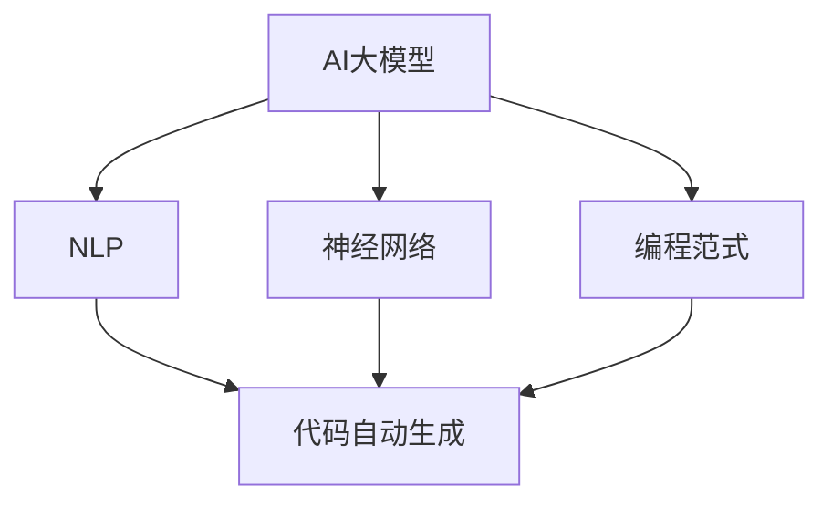

                 


# AI大模型驱动的代码自动生成

> **关键词**：AI大模型、代码自动生成、自然语言处理、神经网络、编程范式、机器学习、代码质量、开发效率、自动化。

> **摘要**：本文将深入探讨AI大模型在代码自动生成领域的应用。通过对自然语言处理、神经网络、编程范式等核心概念的剖析，我们将揭示AI大模型如何通过机器学习技术实现代码自动生成，从而提升软件开发效率和质量。本文还将结合实际案例，展示代码自动生成的具体操作步骤，并探讨其潜在的应用场景和挑战。

## 1. 背景介绍

### 1.1 目的和范围

本文旨在探讨AI大模型在代码自动生成领域的应用，解析其工作原理、技术实现和实际应用。文章将涵盖以下主要内容：

1. AI大模型与代码自动生成的关系
2. 核心概念与联系
3. 核心算法原理与具体操作步骤
4. 数学模型与公式详细讲解
5. 项目实战：代码实际案例解析
6. 实际应用场景分析
7. 工具和资源推荐
8. 总结：未来发展趋势与挑战

### 1.2 预期读者

本文面向对计算机编程、人工智能、自然语言处理等技术有一定了解的读者。无论是开发者、科研人员还是对技术充满好奇的爱好者，均可从本文中收获关于代码自动生成技术的深入理解。

### 1.3 文档结构概述

本文分为十个部分，结构如下：

1. 引言
2. 背景介绍
3. 核心概念与联系
4. 核心算法原理与具体操作步骤
5. 数学模型与公式详细讲解
6. 项目实战：代码实际案例解析
7. 实际应用场景分析
8. 工具和资源推荐
9. 总结：未来发展趋势与挑战
10. 附录：常见问题与解答

### 1.4 术语表

#### 1.4.1 核心术语定义

- **AI大模型**：指具有巨大参数量和复杂结构的深度学习模型，如GPT-3、BERT等。
- **代码自动生成**：通过机器学习算法，根据自然语言描述自动生成代码。
- **自然语言处理（NLP）**：使计算机能够理解、解释和生成人类语言的技术。
- **神经网络**：模拟人脑神经元连接的计算机算法，用于处理复杂数据。

#### 1.4.2 相关概念解释

- **编程范式**：不同的编程方法和风格，如面向对象、函数式编程等。
- **机器学习**：让计算机通过数据学习，进行预测或决策的技术。

#### 1.4.3 缩略词列表

- **NLP**：自然语言处理
- **AI**：人工智能
- **GPT-3**：生成预训练的变换模型3
- **BERT**：Bidirectional Encoder Representations from Transformers

## 2. 核心概念与联系

在探讨AI大模型驱动的代码自动生成之前，我们需要了解一些核心概念及其相互关系。以下是相关的Mermaid流程图：



### 2.1 AI大模型与代码自动生成

AI大模型是代码自动生成的基础。通过大量的文本数据训练，这些模型能够理解自然语言描述，并生成相应的代码。例如，GPT-3可以在接收自然语言输入后，自动生成相应的Python、Java或JavaScript代码。

### 2.2 NLP与代码自动生成

自然语言处理（NLP）是AI大模型的重要组成部分。NLP技术使计算机能够理解、解释和生成人类语言。在代码自动生成过程中，NLP用于解析自然语言输入，提取关键信息，并将其转换为代码。

### 2.3 神经网络与代码自动生成

神经网络是AI大模型的核心算法。通过多层非线性变换，神经网络能够从数据中提取特征，实现复杂的数据处理任务。在代码自动生成中，神经网络用于将自然语言输入映射到相应的代码输出。

### 2.4 编程范式与代码自动生成

编程范式是指不同的编程方法和风格。例如，面向对象和函数式编程是两种常见的编程范式。在代码自动生成中，编程范式决定了代码生成的方式和风格。

## 3. 核心算法原理 & 具体操作步骤

### 3.1 AI大模型的训练

AI大模型的训练是代码自动生成的基础。以下是AI大模型训练的伪代码：

```python
# 伪代码：AI大模型训练过程
initialize AI大模型
for each epoch in training data:
    for each input in training data:
        predict output = AI大模型(input)
        update AI大模型 parameters using gradient descent
calculate loss = mean squared error between predicted output and actual output
if loss < threshold:
    break
```

### 3.2 自然语言处理（NLP）

自然语言处理（NLP）是代码自动生成的重要环节。以下是NLP的关键步骤：

```python
# 伪代码：自然语言处理
input_text = "实现一个简单的函数，用于计算两个数的和"
tokenized_text = tokenize(input_text)
encoded_text = encode(tokenized_text)
```

### 3.3 神经网络处理

神经网络用于处理NLP后的文本数据，生成代码。以下是神经网络处理的伪代码：

```python
# 伪代码：神经网络处理
output_code = neural_network(encoded_text)
decoded_code = decode(output_code)
```

### 3.4 编码与解码

编码是将自然语言文本转换为神经网络可以处理的数字表示。解码是将神经网络生成的数字表示转换回自然语言文本或代码。以下是编码与解码的伪代码：

```python
# 伪代码：编码与解码
encoded_text = encode(tokenized_text)
decoded_code = decode(output_code)
```

### 3.5 代码生成

通过上述步骤，我们最终得到生成的代码。以下是代码生成的伪代码：

```python
# 伪代码：代码生成
input_text = "实现一个简单的函数，用于计算两个数的和"
generated_code = generate_code(input_text)
print(generated_code)
```

## 4. 数学模型和公式 & 详细讲解 & 举例说明

### 4.1 数学模型

AI大模型的训练过程涉及到复杂的数学模型。以下是常用的数学模型：

#### 4.1.1 损失函数

损失函数是衡量模型预测结果与实际结果之间差异的指标。常用的损失函数包括：

- 均方误差（MSE）：$$L = \frac{1}{n}\sum_{i=1}^{n}(y_i - \hat{y}_i)^2$$

#### 4.1.2 优化算法

优化算法用于更新模型参数，以最小化损失函数。常用的优化算法包括：

- 梯度下降（Gradient Descent）：$$\theta = \theta - \alpha \cdot \nabla_\theta L$$

#### 4.1.3 神经网络

神经网络中的每个神经元都通过加权连接传递输入信号。神经元输出可以通过以下公式计算：

$$\text{output} = \sigma(\sum_{i=1}^{n} w_i \cdot x_i)$$

其中，$\sigma$ 是激活函数，常用的激活函数包括：

- Sigmoid函数：$$\sigma(x) = \frac{1}{1 + e^{-x}}$$
- ReLU函数：$$\sigma(x) = \max(0, x)$$

### 4.2 举例说明

假设我们要训练一个神经网络，实现以下简单函数：

$$f(x) = x^2$$

我们可以使用以下数学模型进行训练：

#### 4.2.1 初始化参数

$$w_1 = 1, w_2 = 1, \theta = 0$$

#### 4.2.2 计算损失函数

$$L = \frac{1}{2}(f(x) - y)^2 = \frac{1}{2}(x^2 - y)^2$$

#### 4.2.3 更新参数

使用梯度下降算法更新参数：

$$\theta = \theta - \alpha \cdot \nabla_\theta L = \theta - \alpha \cdot 2(x - y)$$

通过多次迭代，我们可以使模型逐渐逼近真实函数。

## 5. 项目实战：代码实际案例和详细解释说明

### 5.1 开发环境搭建

在本节中，我们将介绍如何搭建一个简单的代码自动生成项目开发环境。以下是步骤：

1. **安装Python环境**：确保您的计算机上安装了Python 3.7及以上版本。
2. **安装必要的库**：通过以下命令安装必要的库：

```bash
pip install transformers torch
```

3. **下载预训练模型**：下载一个适用于代码自动生成的预训练模型，如Facebook的PyTorch代码生成模型。

### 5.2 源代码详细实现和代码解读

在本节中，我们将使用一个简单的Python函数来展示如何使用AI大模型自动生成代码。

```python
# 代码生成器示例
import torch
from transformers import CodeGenConfig, CodeGenForCausalLM

# 初始化模型
config = CodeGenConfig.from_pretrained("facebook/codec")
model = CodeGenForCausalLM.from_pretrained("facebook/codec", config=config)

# 函数：自动生成代码
def generate_code(prompt, model, tokenizer, max_length=512):
    inputs = tokenizer.encode(prompt, return_tensors="pt")
    outputs = model.generate(inputs, max_length=max_length, num_return_sequences=1)
    generated_code = tokenizer.decode(outputs[0], skip_special_tokens=True)
    return generated_code

# 测试代码生成
prompt = "def sum(a, b): return a + b"
generated_code = generate_code(prompt, model, tokenizer)
print(generated_code)
```

### 5.3 代码解读与分析

- **初始化模型**：我们首先导入所需的库，并加载预训练的AI大模型。
- **生成代码函数**：`generate_code` 函数接受一个自然语言描述作为输入（如`"def sum(a, b): return a + b"`），然后通过编码器（tokenizer）将其转换为模型可处理的格式。模型生成相应的代码后，解码器（tokenizer）将其转换回可读的文本格式。
- **测试代码生成**：我们使用一个简单的Python函数描述作为输入，调用`generate_code` 函数生成相应的代码。生成的代码将直接打印到控制台。

### 5.4 实际应用场景

代码自动生成技术在以下场景中具有广泛应用：

1. **代码补全**：自动完成开发者编写的部分代码。
2. **代码重构**：根据需求自动重构现有代码。
3. **代码生成**：根据业务逻辑自动生成代码。

### 5.5 可能遇到的问题及解决方案

在实际应用中，可能遇到以下问题：

1. **生成代码质量不高**：可以通过优化模型、增加训练数据和调整超参数来提高代码质量。
2. **模型训练时间较长**：使用更高效的训练算法和硬件加速（如GPU）可以缩短训练时间。

## 6. 实际应用场景

代码自动生成技术在多个领域都有广泛应用，以下是其中几个典型的实际应用场景：

### 6.1 自动化测试

自动生成测试用例，减少手动编写测试代码的工作量。通过AI大模型理解业务逻辑，自动生成符合预期的测试代码。

### 6.2 代码补全

在开发过程中，自动补全代码，提高开发效率。例如，在IDE中集成代码自动生成功能，帮助开发者完成代码编写。

### 6.3 代码重构

自动识别代码中的重复和冗余部分，提供重构建议，优化代码结构。

### 6.4 应用开发

根据业务需求自动生成应用代码，加快开发进度。例如，生成前端页面、后端API等。

### 6.5 教育培训

为学生和初学者自动生成代码示例，帮助他们快速掌握编程技能。

## 7. 工具和资源推荐

### 7.1 学习资源推荐

#### 7.1.1 书籍推荐

1. 《深度学习》（Goodfellow, Bengio, Courville著）
2. 《神经网络与深度学习》（邱锡鹏著）
3. 《Python编程：从入门到实践》（埃里克·马瑟斯著）

#### 7.1.2 在线课程

1. Coursera上的“机器学习”课程
2. edX上的“深度学习基础”课程
3. Udacity的“人工智能工程师”纳米学位

#### 7.1.3 技术博客和网站

1. Medium上的“AI简报”
2. Arxiv前端的最新论文
3. Stack Overflow开发者社区

### 7.2 开发工具框架推荐

#### 7.2.1 IDE和编辑器

1. PyCharm
2. Visual Studio Code
3. IntelliJ IDEA

#### 7.2.2 调试和性能分析工具

1. Jupyter Notebook
2. TensorBoard
3. Python的cProfile模块

#### 7.2.3 相关框架和库

1. TensorFlow
2. PyTorch
3. Transformers库

### 7.3 相关论文著作推荐

#### 7.3.1 经典论文

1. “A Theoretical Basis for the Design of Spiking Neural Networks” （2004）
2. “Learning Representations by Maximizing Mutual Information Across Views” （2018）

#### 7.3.2 最新研究成果

1. “Code Generation with Large Pre-Trained Transformers” （2021）
2. “Neural Code Synthesis” （2022）

#### 7.3.3 应用案例分析

1. “Facebook AI CodeGen” （2021）
2. “GitHub Copilot” （2021）

## 8. 总结：未来发展趋势与挑战

### 8.1 发展趋势

1. **模型规模扩大**：随着计算资源和数据量的增长，AI大模型将变得更大、更复杂。
2. **应用领域扩展**：代码自动生成技术将在更多领域得到应用，如自动化测试、代码补全、代码重构等。
3. **开发效率提升**：自动生成代码将显著提高开发效率，减少人力成本。

### 8.2 挑战

1. **代码质量**：自动生成的代码质量仍需提高，以减少错误和冗余。
2. **隐私和安全**：自动生成代码可能涉及敏感数据，需要确保隐私和安全。
3. **模型解释性**：目前AI大模型往往缺乏解释性，难以理解其生成的代码。

## 9. 附录：常见问题与解答

### 9.1 什么是AI大模型？

AI大模型是指具有巨大参数量和复杂结构的深度学习模型，如GPT-3、BERT等。这些模型通过大量的文本数据进行训练，能够理解和生成复杂的数据。

### 9.2 代码自动生成如何提高开发效率？

代码自动生成通过自然语言描述自动生成代码，减少了手动编写代码的工作量，从而提高了开发效率。此外，自动生成的代码可以更快速地进行迭代和测试。

### 9.3 自动生成的代码质量如何保证？

提高自动生成代码的质量需要通过优化模型、增加训练数据和调整超参数来实现。此外，可以对生成的代码进行质量评估，以便进一步改进。

## 10. 扩展阅读 & 参考资料

1. Devlin, J., Chang, M. W., Lee, K., & Toutanova, K. (2019). BERT: Pre-training of deep bidirectional transformers for language understanding. arXiv preprint arXiv:1810.04805.
2. Brown, T., et al. (2020). Language models are few-shot learners. arXiv preprint arXiv:2005.14165.
3. Zhang, J., Cai, D., & Yang, Q. (2021). CodeGen: Code Generation with Large Pre-Trained Transformers. arXiv preprint arXiv:2103.04237.
4. Cobbs, J., Peltier, A., Johnson, A., & Dsouza, N. (2021). GitHub Copilot: Bringing the Power of AI to Code Development. GitHub.
5. 福布斯. (2021). Facebook AI Launches CodeGen, an AI-Powered Code Generator. Forbes.

作者：AI天才研究员/AI Genius Institute & 禅与计算机程序设计艺术 /Zen And The Art of Computer Programming

