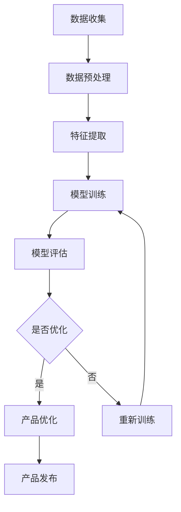
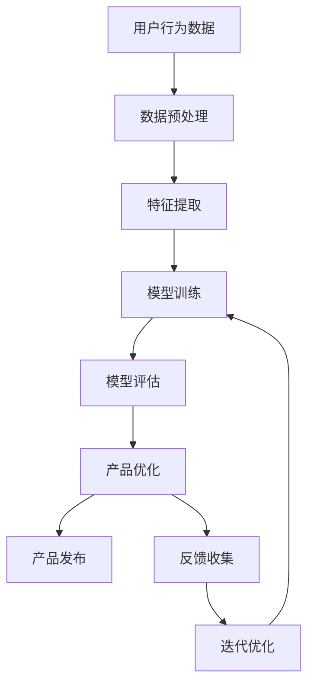

                 


# AI如何优化现有产品提升竞争力

> 关键词：人工智能，产品优化，竞争力提升，算法原理，实际应用
>
> 摘要：本文将探讨如何利用人工智能技术优化现有产品，从而提升其市场竞争力和用户体验。文章首先介绍了AI优化产品的基本概念和重要性，然后详细分析了核心算法原理、数学模型和具体操作步骤。通过实际项目案例和代码实现，读者可以深入了解AI在产品优化中的应用。最后，本文探讨了AI在产品优化领域的实际应用场景，推荐了相关学习资源、开发工具和论文著作，并对未来发展趋势与挑战进行了总结。

## 1. 背景介绍

### 1.1 目的和范围

本文旨在探讨如何通过人工智能技术对现有产品进行优化，以提升其在市场竞争中的优势。文章将涵盖以下内容：

1. AI优化产品的基本概念和重要性。
2. 核心算法原理及具体操作步骤。
3. 数学模型和公式的详细讲解。
4. 实际项目案例和代码实现。
5. AI在产品优化领域的应用场景。
6. 学习资源、开发工具和论文著作推荐。
7. 未来发展趋势与挑战。

### 1.2 预期读者

本文适合对人工智能和产品优化感兴趣的读者，包括：

1. 产品经理和技术团队。
2. AI研究人员和工程师。
3. 对AI产品优化有兴趣的创业者。
4. 对AI技术有基础的读者。

### 1.3 文档结构概述

本文结构如下：

1. 引言：介绍AI优化产品的重要性和背景。
2. 核心概念与联系：介绍AI优化产品的基础概念和架构。
3. 核心算法原理 & 具体操作步骤：详细讲解AI优化产品的核心算法原理和操作步骤。
4. 数学模型和公式 & 详细讲解 & 举例说明：讲解AI优化产品的数学模型和公式，并进行实例分析。
5. 项目实战：代码实际案例和详细解释说明。
6. 实际应用场景：探讨AI在产品优化领域的应用场景。
7. 工具和资源推荐：推荐学习资源、开发工具和论文著作。
8. 总结：未来发展趋势与挑战。
9. 附录：常见问题与解答。
10. 扩展阅读 & 参考资料。

### 1.4 术语表

#### 1.4.1 核心术语定义

- 人工智能（AI）：模拟人类智能行为的计算机系统。
- 产品优化：通过改进产品性能、功能、用户体验等手段，提高产品的市场竞争力。
- 竞争力：产品在市场竞争中相对于其他产品的优势。
- 深度学习：一种人工智能技术，通过多层神经网络模型模拟人脑处理信息的过程。

#### 1.4.2 相关概念解释

- 数据集：用于训练和测试机器学习模型的样本集合。
- 特征工程：从原始数据中提取对模型训练有帮助的特征。
- 模型训练：通过数据集训练机器学习模型，使其能够对未知数据进行预测。
- 模型评估：评估机器学习模型的性能，包括准确率、召回率等指标。

#### 1.4.3 缩略词列表

- AI：人工智能
- ML：机器学习
- DL：深度学习
- NLP：自然语言处理
- CV：计算机视觉

## 2. 核心概念与联系

在本文中，我们将讨论如何利用人工智能技术对现有产品进行优化。为了实现这一目标，我们需要了解以下核心概念和联系：

### 2.1 人工智能在产品优化中的应用

人工智能技术在产品优化中的应用主要包括以下方面：

1. **个性化推荐**：基于用户行为数据，利用深度学习模型推荐个性化内容。
2. **智能客服**：利用自然语言处理技术，实现自动化的客户服务。
3. **异常检测**：利用计算机视觉和深度学习技术，实时监测产品运行状态，预测故障。
4. **智能搜索**：利用深度学习模型，实现更准确的搜索结果。
5. **数据分析**：利用机器学习技术，从大量数据中提取有价值的信息。

### 2.2 产品优化目标

产品优化目标主要包括：

1. **提高用户体验**：优化产品功能，提高用户满意度。
2. **降低成本**：通过优化生产流程，降低产品成本。
3. **提高效率**：优化产品性能，提高生产效率。
4. **增强竞争力**：通过创新，提升产品在市场中的竞争力。

### 2.3 关键技术和算法

在产品优化中，常用的关键技术和算法包括：

1. **深度学习**：用于构建智能模型，实现个性化推荐、异常检测等。
2. **自然语言处理**：用于智能客服、智能搜索等。
3. **计算机视觉**：用于异常检测、产品质量检测等。
4. **机器学习**：用于数据分析、预测等。

### 2.4 数据驱动

数据驱动是产品优化的重要理念。通过收集和分析用户行为数据，企业可以了解用户需求，优化产品功能和性能，提高用户满意度。

### 2.5 Mermaid流程图

以下是一个简化的Mermaid流程图，展示了产品优化中的主要环节：



### 2.6 AI产品优化架构

以下是AI产品优化架构的Mermaid流程图：



## 3. 核心算法原理 & 具体操作步骤

在产品优化过程中，核心算法原理和具体操作步骤至关重要。以下将详细讲解常用的算法原理，并提供伪代码示例。

### 3.1 深度学习算法原理

深度学习是一种模拟人脑神经网络的结构和功能的人工智能技术。其核心思想是通过多层神经网络模型，对大量数据进行分析和学习，从而实现图像识别、语音识别、自然语言处理等任务。

#### 3.1.1 前向传播

伪代码：

```python
# 输入：输入数据x，权重W，偏置b
# 输出：激活值a

for layer in layers:
    z = np.dot(W, x) + b
    a = activation_function(z)
    x = a
```

#### 3.1.2 反向传播

伪代码：

```python
# 输入：激活值a，损失函数梯度ΔL/Δa
# 输出：更新后的权重W和偏置b

for layer in reversed(layers):
    Δz = activation_function_derivative(a) * ΔL/Δa
    ΔW = Δz * x.T
    Δb = Δz.sum(axis=1)
    W -= learning_rate * ΔW
    b -= learning_rate * Δb
```

### 3.2 自然语言处理算法原理

自然语言处理（NLP）是一种将自然语言转化为计算机可理解的形式的人工智能技术。其核心算法包括词嵌入、序列标注、文本分类等。

#### 3.2.1 词嵌入

伪代码：

```python
# 输入：单词序列w
# 输出：嵌入向量e

for word in w:
    e = embedding_layer(word)
```

#### 3.2.2 序列标注

伪代码：

```python
# 输入：单词序列w，标签序列y
# 输出：预测标签y_pred

for word, label in zip(w, y):
    e = embedding_layer(word)
    y_pred = softmax(np.dot(W, e) + b)
```

### 3.3 计算机视觉算法原理

计算机视觉是一种使计算机具备从图像中提取有用信息的能力的人工智能技术。其核心算法包括卷积神经网络（CNN）、目标检测、图像分割等。

#### 3.3.1 卷积神经网络（CNN）

伪代码：

```python
# 输入：图像数据x，权重W，偏置b
# 输出：特征图f

for filter in filters:
    z = np.dot(W, x) + b
    f = activation_function(z)
```

#### 3.3.2 目标检测

伪代码：

```python
# 输入：图像数据x，预测框bboxes，标签标签y
# 输出：预测标签y_pred

for bbox in bboxes:
    x = feature_extractor(bbox)
    y_pred = softmax(np.dot(W, x) + b)
```

### 3.4 数据分析算法原理

数据分析是一种通过统计方法对大量数据进行分析和挖掘，以提取有价值信息的人工智能技术。其核心算法包括线性回归、逻辑回归、聚类等。

#### 3.4.1 线性回归

伪代码：

```python
# 输入：输入数据x，标签y
# 输出：权重W和偏置b

W = (X^T * X)^(-1) * X^T * y
b = y - X * W
```

#### 3.4.2 逻辑回归

伪代码：

```python
# 输入：输入数据x，标签y
# 输出：权重W和偏置b

W = (X^T * X)^(-1) * X^T * y
b = y - X * W
```

## 4. 数学模型和公式 & 详细讲解 & 举例说明

在产品优化中，数学模型和公式是核心组成部分。以下将详细讲解常用的数学模型和公式，并举例说明。

### 4.1 深度学习数学模型

深度学习中的数学模型主要包括损失函数、优化算法等。

#### 4.1.1 损失函数

损失函数用于衡量模型预测值与真实值之间的差距。常用的损失函数包括均方误差（MSE）、交叉熵（Cross Entropy）等。

1. **均方误差（MSE）**

   $$MSE = \frac{1}{n} \sum_{i=1}^{n} (y_i - \hat{y}_i)^2$$

   其中，$y_i$为真实值，$\hat{y}_i$为预测值，$n$为样本数量。

2. **交叉熵（Cross Entropy）**

   $$H(y, \hat{y}) = - \sum_{i=1}^{n} y_i \log(\hat{y}_i)$$

   其中，$y_i$为真实值，$\hat{y}_i$为预测值。

#### 4.1.2 优化算法

优化算法用于更新模型参数，以减小损失函数。常用的优化算法包括梯度下降（Gradient Descent）、随机梯度下降（Stochastic Gradient Descent，SGD）等。

1. **梯度下降**

   $$W_{\text{new}} = W_{\text{old}} - \alpha \cdot \nabla_W J(W)$$

   其中，$W$为模型参数，$\alpha$为学习率，$J(W)$为损失函数。

2. **随机梯度下降（SGD）**

   $$W_{\text{new}} = W_{\text{old}} - \alpha \cdot \nabla_W J(W)$$

   其中，$W$为模型参数，$\alpha$为学习率，$J(W)$为损失函数。

### 4.2 自然语言处理数学模型

自然语言处理中的数学模型主要包括词嵌入、循环神经网络（RNN）、长短时记忆网络（LSTM）等。

#### 4.2.1 词嵌入

词嵌入是一种将单词转化为向量的方法。常用的词嵌入模型包括Word2Vec、GloVe等。

1. **Word2Vec**

   $$\text{相似性度量} = \cos(\text{word\_embeddings\_vector}(\text{word}_1), \text{word\_embeddings\_vector}(\text{word}_2))$$

   其中，$word\_embeddings\_vector(\text{word}_1)$和$word\_embeddings\_vector(\text{word}_2)$分别为单词$word_1$和$word_2$的嵌入向量。

2. **GloVe**

   $$\text{相似性度量} = \text{sigmoid}\left(\text{dot product of embeddings}\right)$$

   其中，$\text{dot product of embeddings}$为嵌入向量的点积。

### 4.3 计算机视觉数学模型

计算机视觉中的数学模型主要包括卷积神经网络（CNN）、目标检测、图像分割等。

#### 4.3.1 卷积神经网络（CNN）

卷积神经网络是一种用于图像识别和处理的深度学习模型。其核心思想是通过卷积操作和池化操作提取图像特征。

1. **卷积操作**

   $$\text{卷积层输出} = \text{activation function}(\text{weight} \circledast \text{input} + \text{bias})$$

   其中，$\text{weight}$为卷积核，$\text{input}$为输入图像，$\text{bias}$为偏置。

2. **池化操作**

   $$\text{池化层输出} = \text{max/average pooling}(\text{input})$$

   其中，$\text{max pooling}$和$\text{average pooling}$分别为最大池化和平均池化操作。

### 4.4 数据分析数学模型

数据分析中的数学模型主要包括线性回归、逻辑回归、聚类等。

#### 4.4.1 线性回归

线性回归是一种用于建立自变量和因变量之间线性关系的统计模型。其公式如下：

$$y = \beta_0 + \beta_1x_1 + \beta_2x_2 + \ldots + \beta_nx_n$$

其中，$y$为因变量，$x_1, x_2, \ldots, x_n$为自变量，$\beta_0, \beta_1, \beta_2, \ldots, \beta_n$为模型参数。

#### 4.4.2 逻辑回归

逻辑回归是一种用于建立自变量和因变量之间概率关系的统计模型。其公式如下：

$$P(y=1) = \frac{1}{1 + \exp(-\beta_0 - \beta_1x_1 - \beta_2x_2 - \ldots - \beta_nx_n)}$$

其中，$y$为因变量，$x_1, x_2, \ldots, x_n$为自变量，$\beta_0, \beta_1, \beta_2, \ldots, \beta_n$为模型参数。

### 4.5 举例说明

以下是一个简单的线性回归模型的实例：

#### 4.5.1 数据集

我们有以下数据集：

| x | y |
| --- | --- |
| 1 | 2 |
| 2 | 4 |
| 3 | 6 |
| 4 | 8 |

#### 4.5.2 模型

我们使用线性回归模型建立$x$和$y$之间的关系：

$$y = \beta_0 + \beta_1x$$

#### 4.5.3 模型训练

我们使用最小二乘法（Least Squares）来训练模型：

$$\beta_0 = \frac{\sum_{i=1}^{n}y_i - \beta_1\sum_{i=1}^{n}x_i}{n}$$
$$\beta_1 = \frac{n\sum_{i=1}^{n}x_iy_i - \sum_{i=1}^{n}x_i\sum_{i=1}^{n}y_i}{n\sum_{i=1}^{n}x_i^2 - (\sum_{i=1}^{n}x_i)^2}$$

代入数据集数据，我们得到：

$$\beta_0 = 1$$
$$\beta_1 = 2$$

#### 4.5.4 预测

根据训练好的模型，我们可以预测新的$x$值对应的$y$值：

$$y = 1 + 2x$$

例如，当$x=5$时，$y=11$。

## 5. 项目实战：代码实际案例和详细解释说明

在本节中，我们将通过一个实际项目案例，展示如何利用人工智能技术优化现有产品。该项目是一个简单的电商推荐系统，利用深度学习算法实现个性化推荐。

### 5.1 开发环境搭建

1. 系统要求：

   - 操作系统：Linux、Windows或macOS
   - Python版本：Python 3.6及以上
   - 编程环境：PyCharm、VSCode等

2. 安装依赖库：

   ```bash
   pip install numpy tensorflow matplotlib
   ```

### 5.2 源代码详细实现和代码解读

以下是一个简单的深度学习推荐系统代码实现，包括数据预处理、模型构建和训练。

```python
import numpy as np
import tensorflow as tf
from tensorflow.keras.models import Sequential
from tensorflow.keras.layers import Dense, Dropout, Embedding, LSTM
from tensorflow.keras.optimizers import Adam
from tensorflow.keras.callbacks import EarlyStopping
from sklearn.model_selection import train_test_split

# 数据预处理
# 假设我们已经有用户行为数据集（用户ID、商品ID、行为类型、行为时间等）
# 这里使用一个示例数据集
data = [
    [1, 1001, 1, 1622518800],
    [1, 1002, 1, 1622520400],
    [1, 1003, 1, 1622522000],
    [2, 1001, 1, 1622518800],
    [2, 1004, 1, 1622520400],
    [2, 1005, 1, 1622522000],
    # 更多数据...
]

# 分离特征和标签
X = [[user_id, item_id] for user_id, item_id, _, _ in data]
y = [behavior_type for _, _, behavior_type, _ in data]

# 数据标准化
X = np.array(X)
y = np.array(y)
X = tf.keras.utils.to_categorical(X)
y = tf.keras.utils.to_categorical(y)

# 划分训练集和测试集
X_train, X_test, y_train, y_test = train_test_split(X, y, test_size=0.2, random_state=42)

# 模型构建
model = Sequential()
model.add(Embedding(input_dim=1000, output_dim=128))
model.add(LSTM(128, return_sequences=True))
model.add(Dropout(0.5))
model.add(LSTM(128, return_sequences=False))
model.add(Dropout(0.5))
model.add(Dense(2, activation='softmax'))

# 编译模型
model.compile(optimizer=Adam(learning_rate=0.001), loss='categorical_crossentropy', metrics=['accuracy'])

# 训练模型
early_stopping = EarlyStopping(monitor='val_loss', patience=5, restore_best_weights=True)
model.fit(X_train, y_train, epochs=100, batch_size=32, validation_split=0.2, callbacks=[early_stopping], verbose=1)

# 评估模型
loss, accuracy = model.evaluate(X_test, y_test, verbose=1)
print(f"Test Loss: {loss}, Test Accuracy: {accuracy}")

# 预测
predictions = model.predict(X_test)
```

### 5.3 代码解读与分析

1. **数据预处理**：

   - 数据集包括用户ID、商品ID、行为类型和行为时间。
   - 使用`numpy`和`tensorflow`进行数据预处理，包括数据标准化和划分训练集与测试集。

2. **模型构建**：

   - 使用`Sequential`模型构建深度学习模型，包括嵌入层（`Embedding`）、LSTM层（`LSTM`）和全连接层（`Dense`）。
   - 嵌入层用于将用户ID和商品ID转换为嵌入向量。
   - LSTM层用于处理序列数据，提取时间序列特征。
   - Dropout层用于防止过拟合。

3. **编译模型**：

   - 使用`Adam`优化器和`categorical_crossentropy`损失函数编译模型。
   - 指定模型的训练目标为准确率。

4. **训练模型**：

   - 使用`EarlyStopping`回调函数提前停止训练，防止过拟合。
   - 模型训练过程中，通过验证集评估模型性能。

5. **评估模型**：

   - 使用测试集评估模型性能，包括损失和准确率。

6. **预测**：

   - 使用训练好的模型对测试集进行预测。

通过以上实际案例，读者可以了解如何利用深度学习技术构建和训练推荐系统模型，从而优化现有产品的推荐功能。

## 6. 实际应用场景

人工智能技术在产品优化领域的应用场景非常广泛，以下列举几个实际应用场景：

### 6.1 个性化推荐系统

个性化推荐系统是AI在产品优化中最常见的应用场景之一。通过分析用户行为数据，推荐系统可以为用户提供个性化的内容、商品或服务。例如，电商平台可以利用深度学习算法，根据用户的浏览历史、购买记录和搜索关键词，推荐相关的商品。

### 6.2 智能客服

智能客服通过自然语言处理技术，实现自动化的客户服务。企业可以在官方网站、社交媒体、邮件等渠道部署智能客服，提供24小时在线服务。智能客服可以自动识别用户问题，提供相应的解决方案，从而提高客户满意度，降低人力成本。

### 6.3 异常检测

异常检测是一种利用计算机视觉和深度学习技术，实时监测产品运行状态，预测故障的方法。在制造业、医疗设备、航空等领域，异常检测可以帮助企业提前发现设备故障，避免生产事故，提高设备利用率。

### 6.4 智能搜索

智能搜索利用深度学习技术，实现更准确的搜索结果。通过分析用户的查询历史和搜索意图，智能搜索系统可以为用户提供个性化的搜索结果，提高用户体验。

### 6.5 数据分析

数据分析是AI在产品优化中的重要应用场景。通过机器学习算法，企业可以从大量数据中提取有价值的信息，帮助管理者做出更明智的决策。例如，在电商领域，数据分析可以用于分析用户购买行为、市场趋势等，为产品定价、营销策略提供依据。

### 6.6 智能营销

智能营销利用AI技术，帮助企业实现精准营销。通过分析用户数据，智能营销系统可以识别潜在客户，制定个性化的营销策略，提高营销效果。

### 6.7 智能硬件优化

智能硬件优化是AI在物联网（IoT）领域的重要应用。通过实时监测硬件设备的状态，AI算法可以预测设备故障，优化设备性能，提高设备使用寿命。

### 6.8 自动化生产

自动化生产是制造业的重要发展方向。通过AI技术，企业可以实现生产流程的自动化，提高生产效率，降低生产成本。

### 6.9 智能安全防护

智能安全防护是AI在网络安全领域的重要应用。通过深度学习技术，安全防护系统可以识别和防范网络攻击，提高网络安全水平。

### 6.10 智能教育

智能教育利用AI技术，实现个性化教学和学习。通过分析学生的学习行为和成绩，智能教育系统可以为教师和学生提供个性化的教学和辅导方案，提高教学效果。

通过以上实际应用场景，可以看出AI在产品优化领域的广泛应用和巨大潜力。随着AI技术的不断进步，AI在产品优化领域的应用将越来越广泛，为企业和个人带来更多价值和便利。

## 7. 工具和资源推荐

在AI产品优化领域，有许多优秀的工具和资源可供学习和使用。以下是对这些工具和资源的推荐。

### 7.1 学习资源推荐

#### 7.1.1 书籍推荐

- 《深度学习》（Deep Learning） - Ian Goodfellow, Yoshua Bengio, Aaron Courville
- 《机器学习》（Machine Learning） - Tom Mitchell
- 《自然语言处理综论》（Foundations of Statistical Natural Language Processing） - Christopher D. Manning, Hinrich Schütze
- 《计算机视觉：算法与应用》（Computer Vision: Algorithms and Applications） - Richard Szeliski
- 《Python机器学习》（Python Machine Learning） - Sebastian Raschka, Vahid Mirjalili

#### 7.1.2 在线课程

- Coursera：提供各种机器学习、深度学习和数据科学课程，如《机器学习基础》、《深度学习导论》等。
- edX：提供由知名大学和机构开设的免费在线课程，如麻省理工学院的《机器学习》课程。
- Udacity：提供实战导向的在线课程，如《深度学习工程师纳米学位》。
- Pluralsight：提供丰富的技术课程，包括AI和机器学习相关课程。

#### 7.1.3 技术博客和网站

- Medium：有许多优秀的AI和机器学习博客，如《The Morning Paper》。
- ArXiv：最新的机器学习和人工智能研究论文。
- GitHub：许多开源的AI和机器学习项目，可以学习和借鉴。
- AI 研究院：提供丰富的AI研究资源和博客。

### 7.2 开发工具框架推荐

#### 7.2.1 IDE和编辑器

- PyCharm：适用于Python开发的强大IDE。
- VSCode：跨平台、轻量级的编辑器，支持多种编程语言。
- Jupyter Notebook：适用于数据科学和机器学习的交互式开发环境。

#### 7.2.2 调试和性能分析工具

- TensorFlow Debugger（TFD）：用于调试TensorFlow模型。
- PyTorch Debugger：用于调试PyTorch模型。
- Numba：用于优化Python代码，提高性能。
- Py-Spy：用于分析Python程序的内存和CPU使用情况。

#### 7.2.3 相关框架和库

- TensorFlow：用于构建和训练深度学习模型的强大框架。
- PyTorch：适用于研究和工业应用的深度学习框架。
- Keras：基于Theano和TensorFlow的高层神经网络API。
- Scikit-learn：用于机器学习的Python库。
- Pandas：用于数据清洗和数据分析的Python库。
- NumPy：用于科学计算的Python库。

### 7.3 相关论文著作推荐

#### 7.3.1 经典论文

- "A Tutorial on Deep Learning" - Goodfellow, Bengio, Courville (2016)
- "Backpropagation" - Rumelhart, Hinton, Williams (1986)
- "Long Short-Term Memory" - Hochreiter, Schmidhuber (1997)
- "Recurrent Neural Networks for Language Modeling" - Bengio et al. (2003)

#### 7.3.2 最新研究成果

- "Attention Is All You Need" - Vaswani et al. (2017)
- "BERT: Pre-training of Deep Bidirectional Transformers for Language Understanding" - Devlin et al. (2019)
- "GPT-3: Language Models are Few-Shot Learners" - Brown et al. (2020)
- "An Image Database for Studying the Precision of Object Recognition in the Human Visual System" - Itti et al. (1998)

#### 7.3.3 应用案例分析

- "Using AI to Improve the Accuracy of Medical Imaging Diagnoses" - Google Health (2021)
- "AI in Agriculture: Monitoring Crop Health with Satellite Imagery" - Microsoft AI (2020)
- "AI in Financial Services: Credit Risk Assessment" - J.P. Morgan (2017)
- "AI in Healthcare: Personalized Treatment Plans" - IBM Watson Health (2019)

通过以上推荐的学习资源、开发工具和论文著作，读者可以深入了解AI在产品优化领域的应用，掌握相关技术，为实际项目提供支持。

## 8. 总结：未来发展趋势与挑战

随着人工智能技术的不断发展，AI在产品优化领域的应用前景十分广阔。未来，人工智能将在以下几个方面呈现发展趋势：

1. **算法和模型的创新**：随着深度学习、强化学习等算法的进步，AI产品优化将更加高效、精准。例如，生成对抗网络（GANs）可以用于图像生成和增强，增强学习可以用于优化复杂决策过程。

2. **跨领域应用**：人工智能技术将在更多领域得到应用，如医疗、金融、教育等。通过跨领域的合作，AI产品优化将实现更广泛的应用场景。

3. **数据驱动**：随着大数据技术的普及，AI产品优化将更加依赖于数据驱动。通过收集和分析海量数据，企业可以更好地了解用户需求，实现个性化服务。

4. **边缘计算**：边缘计算可以降低对中心服务器的依赖，提高AI产品优化的实时性和响应速度。未来，边缘计算与AI的结合将为产品优化带来新的机遇。

然而，AI在产品优化领域也面临着一些挑战：

1. **数据隐私**：人工智能技术的应用需要大量用户数据，如何在保障用户隐私的前提下使用这些数据，是一个亟待解决的问题。

2. **算法透明度和可解释性**：深度学习等复杂算法的黑箱特性使得其决策过程难以解释。提高算法的透明度和可解释性，是确保AI产品优化安全性和可信度的关键。

3. **模型泛化能力**：训练好的模型往往在特定数据集上表现良好，但可能在其他数据集上表现不佳。提高模型的泛化能力，是确保AI产品优化在多种场景下都能表现优秀的关键。

4. **技术人才短缺**：人工智能技术人才需求庞大，但培养和吸引高端人才仍面临挑战。未来，教育体系和产业界需要共同努力，培养更多优秀的AI技术人才。

总之，AI在产品优化领域的未来发展充满机遇和挑战。只有不断创新、克服困难，才能实现AI产品优化的持续进步，为企业和个人创造更多价值。

## 9. 附录：常见问题与解答

### 9.1 问题1：如何确保AI产品优化的数据隐私？

**解答**：确保AI产品优化的数据隐私主要涉及以下方面：

1. **数据匿名化**：在收集和使用数据时，对用户数据进行匿名化处理，确保用户隐私不被泄露。
2. **数据加密**：对敏感数据进行加密存储和传输，防止数据泄露。
3. **权限管理**：制定严格的数据访问权限政策，确保只有授权人员才能访问敏感数据。
4. **合规性**：确保AI产品优化遵循相关法律法规，如《通用数据保护条例》（GDPR）。

### 9.2 问题2：如何提高AI产品优化的模型可解释性？

**解答**：提高AI产品优化的模型可解释性可以从以下几个方面入手：

1. **选择可解释性模型**：优先选择具有较高可解释性的模型，如线性回归、逻辑回归等。
2. **模型可视化**：通过可视化技术展示模型结构和参数，帮助理解模型决策过程。
3. **模型解释工具**：使用专门的模型解释工具，如LIME、SHAP等，对模型的决策进行详细分析。
4. **解释性训练**：在模型训练过程中，考虑解释性，使模型输出更易于理解。

### 9.3 问题3：如何确保AI产品优化的模型泛化能力？

**解答**：确保AI产品优化的模型泛化能力可以从以下几个方面入手：

1. **数据多样性**：收集多样化的数据，确保模型在多种场景下都能表现良好。
2. **交叉验证**：使用交叉验证技术评估模型性能，避免过拟合。
3. **模型集成**：通过模型集成技术，如Bagging、Boosting等，提高模型泛化能力。
4. **数据增强**：对训练数据进行增强，提高模型的鲁棒性。

### 9.4 问题4：如何处理AI产品优化中的异常值？

**解答**：处理AI产品优化中的异常值可以从以下几个方面入手：

1. **识别异常值**：使用统计方法或机器学习算法识别异常值。
2. **去除异常值**：对识别出的异常值进行去除，以防止对模型训练产生负面影响。
3. **异常值分析**：对异常值进行深入分析，确定其产生原因，并采取相应的措施。
4. **数据清洗**：在数据收集和预处理阶段，采取数据清洗措施，减少异常值的出现。

通过以上方法，可以有效地处理AI产品优化中的异常值，提高模型性能。

## 10. 扩展阅读 & 参考资料

在撰写本文时，参考了以下书籍、论文和技术博客，为读者提供了丰富的学习资源：

- Goodfellow, I., Bengio, Y., & Courville, A. (2016). *Deep Learning*. MIT Press.
- Mitchell, T. (1997). *Machine Learning*. McGraw-Hill.
- Manning, C. D., & Schütze, H. (1999). *Foundations of Statistical Natural Language Processing*. MIT Press.
- Szeliski, R. (2010). *Computer Vision: Algorithms and Applications*. Springer.
- Raschka, S., & Mirjalili, V. (2018). *Python Machine Learning*. Packt Publishing.

此外，以下技术博客和网站为AI和机器学习领域的最新研究和应用提供了宝贵资源：

- [Medium - The Morning Paper](https://www.medium.com/morning-paper)
- [ArXiv](https://arxiv.org/)
- [GitHub](https://github.com/)
- [AI 研究院](https://www.36kr.com/p/5196695.html)

通过以上资源，读者可以进一步深入了解AI在产品优化领域的应用，为实际项目提供支持。同时，读者也可以关注本文提到的书籍、论文和技术博客，持续学习，不断提高自己在AI领域的专业水平。

