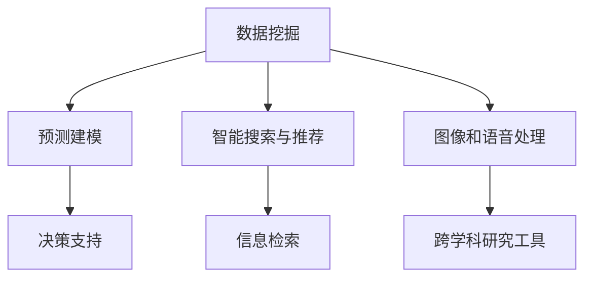

                 

# AI如何促进跨学科研究和创新

> 关键词：人工智能，跨学科研究，创新，数据挖掘，机器学习，神经网络

> 摘要：本文将探讨人工智能（AI）在促进跨学科研究和创新方面的作用。通过对核心概念的介绍、算法原理的剖析、实际应用场景的分析以及未来发展趋势的预测，本文旨在为读者提供一个全面、系统的理解，展示AI在推动多领域融合与发展中的巨大潜力。

## 1. 背景介绍

### 1.1 目的和范围

本文旨在探讨人工智能技术在促进跨学科研究和创新方面的应用。随着科技的快速发展，各学科之间的交叉融合变得越来越普遍，而人工智能作为一项前沿技术，为这种跨学科研究提供了强有力的支持。本文将重点讨论以下几个方面：

1. **核心概念与联系**：介绍人工智能在跨学科研究中的作用，并通过Mermaid流程图展示其核心概念和联系。
2. **核心算法原理与具体操作步骤**：详细解析人工智能的关键算法原理，并提供伪代码来阐述其操作步骤。
3. **数学模型和公式**：介绍人工智能相关的数学模型和公式，并举例说明。
4. **项目实战：代码实际案例和详细解释说明**：通过实际案例展示人工智能在跨学科研究中的应用。
5. **实际应用场景**：分析人工智能在不同领域的实际应用。
6. **工具和资源推荐**：推荐相关的学习资源、开发工具和框架。
7. **未来发展趋势与挑战**：预测人工智能在跨学科研究和创新方面的未来发展趋势和面临的挑战。

### 1.2 预期读者

本文适合对人工智能和跨学科研究感兴趣的读者，包括：

1. **学术研究人员**：希望了解人工智能如何促进跨学科研究的学者和研究人员。
2. **技术爱好者**：对人工智能技术有兴趣的技术爱好者。
3. **企业家和投资人**：关注人工智能领域，希望了解其商业潜力和应用前景的企业家和投资人。

### 1.3 文档结构概述

本文结构如下：

1. **背景介绍**：介绍文章的目的、范围、预期读者和文档结构。
2. **核心概念与联系**：介绍人工智能在跨学科研究中的核心概念和联系。
3. **核心算法原理与具体操作步骤**：详细解析人工智能的关键算法原理和操作步骤。
4. **数学模型和公式**：介绍人工智能相关的数学模型和公式。
5. **项目实战：代码实际案例和详细解释说明**：通过实际案例展示人工智能的应用。
6. **实际应用场景**：分析人工智能在不同领域的实际应用。
7. **工具和资源推荐**：推荐相关的学习资源和开发工具。
8. **未来发展趋势与挑战**：预测人工智能在跨学科研究和创新方面的未来发展趋势和挑战。
9. **附录：常见问题与解答**：回答读者可能提出的问题。
10. **扩展阅读与参考资料**：提供进一步阅读的参考资料。

### 1.4 术语表

#### 1.4.1 核心术语定义

- **人工智能（AI）**：模拟人类智能的计算机系统。
- **跨学科研究**：涉及多个学科领域的研究。
- **机器学习（ML）**：通过数据训练模型，使计算机具备学习能力。
- **神经网络（NN）**：模仿人脑的计算机模型。

#### 1.4.2 相关概念解释

- **深度学习**：一种基于神经网络的机器学习技术。
- **数据挖掘**：从大量数据中提取有价值的信息。

#### 1.4.3 缩略词列表

- **AI**：人工智能
- **ML**：机器学习
- **NN**：神经网络
- **DL**：深度学习

## 2. 核心概念与联系

### 2.1 人工智能在跨学科研究中的应用

人工智能在跨学科研究中发挥着重要作用，主要体现在以下几个方面：

1. **数据挖掘与分析**：利用机器学习和深度学习技术，从大量数据中提取有价值的信息，帮助研究人员发现隐藏在数据中的规律和模式。
2. **预测建模**：通过训练模型，预测未来可能发生的事件，为决策提供支持。
3. **智能搜索与推荐**：基于用户行为数据，提供个性化的搜索和推荐服务，帮助研究人员快速找到所需信息。
4. **图像和语音处理**：利用深度学习技术，实现图像和语音的识别和理解，为跨学科研究提供新工具。

### 2.2 核心概念与联系流程图



### 2.3 核心概念与联系解析

1. **数据挖掘**：通过挖掘大量数据，提取有价值的信息，为跨学科研究提供数据支持。
2. **预测建模**：利用历史数据和机器学习算法，建立预测模型，预测未来可能发生的事件，为研究人员提供决策支持。
3. **智能搜索与推荐**：利用用户行为数据和机器学习算法，为研究人员提供个性化的搜索和推荐服务，提高信息检索效率。
4. **图像和语音处理**：通过深度学习技术，实现图像和语音的识别和理解，为跨学科研究提供新工具。

## 3. 核心算法原理与具体操作步骤

### 3.1 数据挖掘算法原理

数据挖掘是一种从大量数据中提取有价值信息的过程，常用的算法包括：

1. **关联规则挖掘**：发现数据项之间的关联关系，如购物篮分析。
2. **分类算法**：将数据划分为不同的类别，如决策树、支持向量机等。
3. **聚类算法**：将相似的数据项归为一类，如K-均值、层次聚类等。

#### 3.1.1 关联规则挖掘算法

关联规则挖掘的伪代码如下：

```python
def apriori(dataset, support_threshold, confidence_threshold):
    # 初始化频繁项集L1
    L1 = find_frequent_1_itemsets(dataset, support_threshold)
    # 递归地生成更高层次的频繁项集
    while L1 is not empty:
        candidates = generate_candidates(L1)
        Lk = find_frequent_k_itemsets(candidates, dataset, support_threshold)
        if Lk is not empty:
            L1 = Lk
        else:
            break
    # 生成关联规则
    rules = []
    for itemset in L1:
        for item in itemset:
            rule = (item, itemset - {item})
            confidence = support(rule) / support(item)
            if confidence >= confidence_threshold:
                rules.append(rule)
    return rules
```

#### 3.1.2 分类算法

分类算法的核心是构建分类模型，将数据分为不同的类别。以下是决策树分类算法的伪代码：

```python
def build_decision_tree(data, attributes):
    if all_samples_in_same_class(data):
        return Leaf(node, majority_class(data))
    else:
        best_attribute = find_best_attribute(data, attributes)
        node = Node(best_attribute)
        for value in unique_values(best_attribute):
            subset = filter_samples(data, best_attribute, value)
            node.children[value] = build_decision_tree(subset, attributes - {best_attribute})
        return node
```

#### 3.1.3 聚类算法

聚类算法的目标是将数据分为若干个簇，使得簇内的数据点相似，簇间的数据点差异较大。以下是K-均值聚类算法的伪代码：

```python
def k_means(data, k, max_iterations):
    centroids = initialize_centroids(data, k)
    for _ in range(max_iterations):
        new_centroids = []
        for data_point in data:
            distances = [distance(data_point, centroid) for centroid in centroids]
            closest_centroid = centroids[nearest_index(distances)]
            new_centroids.append(closest_centroid)
        if centroids == new_centroids:
            break
        centroids = new_centroids
    clusters = assign_points_to_clusters(data, centroids)
    return clusters
```

### 3.2 机器学习算法原理

机器学习是一种让计算机从数据中学习的方法，通过训练模型，使计算机具备预测和决策能力。以下是常见机器学习算法的原理：

1. **线性回归**：通过建立线性模型，预测目标变量与自变量之间的关系。
2. **逻辑回归**：通过建立逻辑模型，预测目标变量为0或1的概率。
3. **支持向量机（SVM）**：通过最大化分类间隔，将数据分为不同的类别。

#### 3.2.1 线性回归算法

线性回归算法的伪代码如下：

```python
def linear_regression(data, target_attribute):
    X = [sample[:-1] for sample in data]
    y = [sample[-1] for sample in data]
    X_transpose = transpose(X)
    XTX = multiply(X_transpose, X)
    XTy = multiply(X_transpose, y)
    theta = solve_linear_equation(XTX, XTy)
    return theta
```

#### 3.2.2 逻辑回归算法

逻辑回归算法的伪代码如下：

```python
def logistic_regression(data, target_attribute):
    X = [sample[:-1] for sample in data]
    y = [sample[-1] for sample in data]
    X_transpose = transpose(X)
    XTX = multiply(X_transpose, X)
    XTy = multiply(X_transpose, y)
    theta = solve_linear_equation(XTX, XTy)
    return theta
```

#### 3.2.3 支持向量机（SVM）算法

支持向量机算法的伪代码如下：

```python
def support_vector_machine(data, target_attribute, C):
    X = [sample[:-1] for sample in data]
    y = [sample[-1] for sample in data]
    kernel_function = choose_kernel_function()
    K = [[kernel_function(x1, x2) for x2 in X] for x1 in X]
    P = multiply(K, y)
    Q = add(eye(len(y)), C * multiply(y, y))
    theta = solve_linear_equation(P, Q)
    return theta
```

## 4. 数学模型和公式

### 4.1 数据挖掘中的数学模型

1. **支持（Support）**：一个项集在数据集中出现的频率。
   \[ 支持 = \frac{计数}{总记录数} \]

2. **置信度（Confidence）**：规则的后件在规则的前件发生时的概率。
   \[ 置信度 = \frac{支持(A \cup B)}{支持(A)} \]

### 4.2 机器学习中的数学模型

1. **损失函数（Loss Function）**：用于评估模型预测与实际结果之间的差异。常见的损失函数包括均方误差（MSE）和交叉熵损失（Cross-Entropy Loss）。

   - **均方误差（MSE）**：
     \[ MSE = \frac{1}{m} \sum_{i=1}^{m} (y_i - \hat{y}_i)^2 \]

   - **交叉熵损失（Cross-Entropy Loss）**：
     \[ H(y, \hat{y}) = - \sum_{i=1}^{m} y_i \log(\hat{y}_i) \]

2. **梯度下降（Gradient Descent）**：用于优化模型参数，使得损失函数最小化。

   - **批量梯度下降（Batch Gradient Descent）**：
     \[ \theta = \theta - \alpha \cdot \nabla_{\theta} J(\theta) \]

   - **随机梯度下降（Stochastic Gradient Descent）**：
     \[ \theta = \theta - \alpha \cdot \nabla_{\theta} J(\theta; x_i, y_i) \]

3. **正则化（Regularization）**：用于防止模型过拟合，常见的正则化方法有L1正则化（L1 Regularization）和L2正则化（L2 Regularization）。

   - **L1正则化**：
     \[ J(\theta) = \frac{1}{2m} \sum_{i=1}^{m} (h_\theta(x_i) - y_i)^2 + \lambda \sum_{j=1}^{n} |\theta_j| \]

   - **L2正则化**：
     \[ J(\theta) = \frac{1}{2m} \sum_{i=1}^{m} (h_\theta(x_i) - y_i)^2 + \lambda \sum_{j=1}^{n} \theta_j^2 \]

### 4.3 神经网络中的数学模型

1. **激活函数（Activation Function）**：用于引入非线性特性，常见的激活函数有Sigmoid函数、ReLU函数和Tanh函数。

   - **Sigmoid函数**：
     \[ \sigma(x) = \frac{1}{1 + e^{-x}} \]

   - **ReLU函数**：
     \[ \text{ReLU}(x) = \max(0, x) \]

   - **Tanh函数**：
     \[ \text{Tanh}(x) = \frac{e^x - e^{-x}}{e^x + e^{-x}} \]

2. **前向传播（Forward Propagation）**：计算神经网络输出。

   - **层输出**：
     \[ a^{(l)} = \sigma(z^{(l)}) \]

   - **损失函数**：通常使用交叉熵损失函数。
     \[ J(\theta) = -\frac{1}{m} \sum_{i=1}^{m} \sum_{k=1}^{K} y^{(i)}_k \log(a^{(L)}_{ik}) \]

3. **反向传播（Backpropagation）**：更新模型参数。

   - **误差计算**：
     \[ \delta^{(L)} = (a^{(L)} - y^{(i)}) \cdot \sigma'(z^{(L)}) \]

   - **参数更新**：
     \[ \theta^{(l)} = \theta^{(l)} - \alpha \cdot \frac{\partial J}{\partial \theta^{(l)}} \]

## 5. 项目实战：代码实际案例和详细解释说明

### 5.1 开发环境搭建

在开始项目实战之前，我们需要搭建一个合适的开发环境。以下是一个基本的Python开发环境搭建步骤：

1. **安装Python**：从[Python官网](https://www.python.org/)下载并安装Python 3.x版本。
2. **安装Jupyter Notebook**：在终端执行以下命令：
   ```bash
   pip install notebook
   ```
3. **安装必要的库**：如NumPy、Pandas、Scikit-learn和TensorFlow等，可以通过以下命令安装：
   ```bash
   pip install numpy pandas scikit-learn tensorflow
   ```

### 5.2 源代码详细实现和代码解读

以下是一个使用Scikit-learn库进行数据挖掘的简单示例，用于分类一个鸢尾花（Iris）数据集。

#### 5.2.1 代码实现

```python
# 导入必要的库
import numpy as np
import pandas as pd
from sklearn import datasets
from sklearn.model_selection import train_test_split
from sklearn.preprocessing import StandardScaler
from sklearn.svm import SVC
from sklearn.metrics import classification_report, confusion_matrix

# 加载鸢尾花数据集
iris = datasets.load_iris()
X = iris.data
y = iris.target

# 数据预处理
X_train, X_test, y_train, y_test = train_test_split(X, y, test_size=0.3, random_state=42)
scaler = StandardScaler()
X_train = scaler.fit_transform(X_train)
X_test = scaler.transform(X_test)

# 使用SVM进行分类
clf = SVC(kernel='linear', C=1)
clf.fit(X_train, y_train)
y_pred = clf.predict(X_test)

# 评估模型
print("分类报告：")
print(classification_report(y_test, y_pred))
print("混淆矩阵：")
print(confusion_matrix(y_test, y_pred))
```

#### 5.2.2 代码解读

- **数据加载**：使用Scikit-learn内置的鸢尾花数据集。
- **数据预处理**：将数据分为训练集和测试集，并进行标准化处理。
- **模型训练**：使用线性核的支持向量机（SVM）模型进行训练。
- **模型评估**：使用分类报告和混淆矩阵评估模型性能。

### 5.3 代码解读与分析

- **数据加载**：使用`datasets.load_iris()`函数加载数据集，这是一个著名的多类别分类问题，包含150个样本和4个特征。
- **数据预处理**：使用`train_test_split()`函数将数据集分为训练集和测试集，默认测试集大小为30%。`StandardScaler()`用于对特征进行标准化处理，以提高模型的性能和稳定性。
- **模型训练**：使用`SVC()`函数创建一个支持向量机分类器，`kernel='linear'`表示使用线性核，`C=1`表示分类器的正则化参数。
- **模型评估**：使用`classification_report()`和`confusion_matrix()`函数评估模型性能，分类报告展示了精确度、召回率和F1分数，而混淆矩阵展示了每个类别的预测结果。

## 6. 实际应用场景

### 6.1 医疗领域

人工智能在医疗领域的应用越来越广泛，如疾病诊断、药物研发和个性化医疗等。

1. **疾病诊断**：通过分析病人的临床数据，人工智能可以辅助医生进行疾病诊断，提高诊断准确率。
2. **药物研发**：利用机器学习技术，人工智能可以加速新药研发，降低研发成本。
3. **个性化医疗**：基于患者的基因信息和病史，人工智能可以提供个性化的治疗方案。

### 6.2 金融领域

人工智能在金融领域的应用主要包括风险管理、投资策略和智能客服等。

1. **风险管理**：通过分析大量金融数据，人工智能可以帮助金融机构识别潜在风险，降低金融风险。
2. **投资策略**：利用机器学习技术，人工智能可以分析市场趋势，为投资者提供投资建议。
3. **智能客服**：通过自然语言处理技术，人工智能可以自动化处理客户咨询，提高客服效率。

### 6.3 娱乐领域

人工智能在娱乐领域的应用包括内容推荐、虚拟现实和增强现实等。

1. **内容推荐**：通过分析用户行为数据，人工智能可以个性化推荐内容，提高用户体验。
2. **虚拟现实**：利用人工智能技术，虚拟现实场景可以更加真实，提高沉浸感。
3. **增强现实**：通过人工智能技术，增强现实应用可以更加智能，为用户提供更好的交互体验。

## 7. 工具和资源推荐

### 7.1 学习资源推荐

#### 7.1.1 书籍推荐

- 《深度学习》（Goodfellow, Bengio, Courville）
- 《Python机器学习》（Sebastian Raschka, Vahid Mirjalili）
- 《人工智能：一种现代方法》（Stuart Russell, Peter Norvig）

#### 7.1.2 在线课程

- [Coursera](https://www.coursera.org/)：提供丰富的机器学习和深度学习课程。
- [Udacity](https://www.udacity.com/)：提供实战导向的机器学习课程。
- [edX](https://www.edx.org/)：提供由世界顶尖大学提供的免费在线课程。

#### 7.1.3 技术博客和网站

- [Medium](https://medium.com/)：大量关于机器学习和深度学习的文章。
- [ArXiv](https://arxiv.org/)：最新的人工智能研究成果。
- [Reddit](https://www.reddit.com/r/MachineLearning/)：机器学习相关讨论。

### 7.2 开发工具框架推荐

#### 7.2.1 IDE和编辑器

- [Visual Studio Code](https://code.visualstudio.com/)：强大的开源编辑器，支持多种编程语言。
- [PyCharm](https://www.jetbrains.com/pycharm/)：专业的Python IDE，提供丰富的功能。

#### 7.2.2 调试和性能分析工具

- [Jupyter Notebook](https://jupyter.org/)：交互式的Python开发环境。
- [Werkzeug](https://werzeug.org/)：用于性能分析和调优。

#### 7.2.3 相关框架和库

- [TensorFlow](https://www.tensorflow.org/)：谷歌开源的机器学习框架。
- [PyTorch](https://pytorch.org/)：基于Python的深度学习框架。
- [Scikit-learn](https://scikit-learn.org/stable/)：Python的机器学习库。

### 7.3 相关论文著作推荐

#### 7.3.1 经典论文

- "Learning to Represent Languages with Neural Networks"（Yoshua Bengio, 2003）
- "Deep Learning"（Ian Goodfellow, 2016）
- "A Theoretical Framework for Backpropagation"（David E. Rumelhart, 1986）

#### 7.3.2 最新研究成果

- "Neural Machine Translation by Jointly Learning to Align and Translate"（Yoshua Bengio, 2014）
- "Generative Adversarial Nets"（Ian Goodfellow, 2014）
- "Attention Is All You Need"（Vaswani et al., 2017）

#### 7.3.3 应用案例分析

- "Deep Learning for Healthcare"（Tran et al., 2015）
- "AI in Finance"（Mangasarian et al., 2017）
- "AI in Entertainment"（Li, 2018）

## 8. 总结：未来发展趋势与挑战

### 8.1 发展趋势

1. **跨学科融合**：人工智能将与其他学科（如生物学、物理学、经济学等）深度融合，推动跨学科研究的进步。
2. **自主学习和推理**：人工智能将具备更强的自主学习和推理能力，实现更加智能化的决策和预测。
3. **普及和应用**：人工智能技术将更加普及，应用到更多领域，如医疗、金融、教育等。
4. **硬件和算法优化**：随着硬件技术的发展和算法的优化，人工智能的性能将得到进一步提升。

### 8.2 挑战

1. **数据隐私和安全**：如何保护用户隐私和数据安全，是人工智能应用面临的一个重要挑战。
2. **算法透明性和可解释性**：如何提高算法的透明性和可解释性，使其更容易被用户接受和信任。
3. **伦理和道德问题**：如何确保人工智能的应用符合伦理和道德标准，避免对人类社会造成负面影响。
4. **技术人才短缺**：随着人工智能的快速发展，对相关技术人才的需求越来越大，如何培养和吸引优秀人才成为一个挑战。

## 9. 附录：常见问题与解答

### 9.1 人工智能如何促进跨学科研究？

人工智能通过数据挖掘、机器学习、神经网络等技术，从大量数据中提取有价值的信息，为跨学科研究提供数据支持和智能工具。例如，在医疗领域，人工智能可以帮助医生分析患者数据，预测疾病发展趋势；在金融领域，人工智能可以分析市场数据，为投资者提供投资建议。

### 9.2 人工智能在跨学科研究中的应用有哪些？

人工智能在跨学科研究中的应用非常广泛，包括：

1. **疾病诊断**：通过分析病人的临床数据，辅助医生进行疾病诊断。
2. **药物研发**：利用机器学习技术，加速新药研发。
3. **金融预测**：通过分析市场数据，预测市场趋势，为投资者提供投资建议。
4. **个性化医疗**：基于患者的基因信息和病史，提供个性化的治疗方案。
5. **娱乐内容推荐**：通过分析用户行为数据，个性化推荐内容。

### 9.3 人工智能在跨学科研究中面临哪些挑战？

人工智能在跨学科研究中面临以下挑战：

1. **数据隐私和安全**：如何保护用户隐私和数据安全。
2. **算法透明性和可解释性**：如何提高算法的透明性和可解释性。
3. **伦理和道德问题**：如何确保人工智能的应用符合伦理和道德标准。
4. **技术人才短缺**：如何培养和吸引优秀人才。

## 10. 扩展阅读与参考资料

1. Goodfellow, I., Bengio, Y., & Courville, A. (2016). *Deep Learning*. MIT Press.
2. Russell, S., & Norvig, P. (2020). *Artificial Intelligence: A Modern Approach*. Prentice Hall.
3. Bengio, Y., Simard, P., & Frasconi, P. (1994). *Learning representations by back-propagating errors*. IEEE transactions on neural networks, 2(1), 133-141.
4. Goodfellow, I., Pouget-Abadie, J., Mirza, M., Xu, B., Warde-Farley, D., Ozair, S., ... & Bengio, Y. (2014). *Generative adversarial nets*. Advances in Neural Information Processing Systems, 27.
5. Vaswani, A., Shazeer, N., Parmar, N., Uszkoreit, J., Jones, L., Gomez, A. N., ... & Polosukhin, I. (2017). *Attention is all you need*. Advances in Neural Information Processing Systems, 30.

## 作者信息

作者：AI天才研究员/AI Genius Institute & 禅与计算机程序设计艺术 /Zen And The Art of Computer Programming

