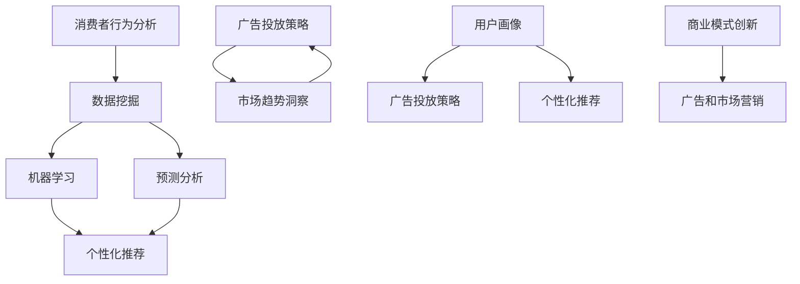

                 

# AI如何改变广告和市场营销

> 关键词：人工智能，广告，市场营销，数据挖掘，机器学习，预测分析，个性化推荐

> 摘要：随着人工智能技术的飞速发展，广告和市场营销领域正经历着深刻的变革。本文将探讨人工智能如何通过数据挖掘、机器学习、预测分析和个性化推荐等核心技术，改变广告投放策略，提升市场营销效果，并带来新的商业模式。我们将逐步分析这些技术的原理和实际应用，以期为您提供一个全面、深入的视角。

## 1. 背景介绍

### 1.1 目的和范围

本文旨在探讨人工智能技术在广告和市场营销领域的应用，分析其如何通过先进的数据处理和智能分析技术，提升广告投放的效果和市场营销的精准度。我们将重点关注以下几个核心话题：

- 数据挖掘与消费者行为分析
- 机器学习与广告投放优化
- 预测分析与市场趋势洞察
- 个性化推荐与用户体验提升

通过这些分析，我们希望为广告和市场营销从业者提供一个实用的指南，帮助他们在日益竞争激烈的市场中，利用人工智能技术获得竞争优势。

### 1.2 预期读者

本文适合以下读者群体：

- 广告和市场营销从业人士
- 数据科学家和人工智能工程师
- 对市场营销和广告行业有浓厚兴趣的学者和研究人员
- 对人工智能应用感兴趣的技术爱好者

### 1.3 文档结构概述

本文的结构如下：

- **第1章 背景介绍**：介绍本文的目的、范围、预期读者和文档结构。
- **第2章 核心概念与联系**：阐述与人工智能相关的核心概念和原理，并通过Mermaid流程图展示其架构。
- **第3章 核心算法原理与具体操作步骤**：详细解释人工智能在广告和市场营销中应用的核心算法。
- **第4章 数学模型和公式**：讲解与算法相关的数学模型和公式，并通过实例说明。
- **第5章 项目实战**：通过实际代码案例，展示人工智能技术的应用。
- **第6章 实际应用场景**：分析人工智能在广告和市场营销中的实际应用案例。
- **第7章 工具和资源推荐**：推荐学习资源和开发工具。
- **第8章 总结：未来发展趋势与挑战**：总结当前技术的发展趋势和面临的挑战。
- **第9章 附录：常见问题与解答**：回答读者可能遇到的问题。
- **第10章 扩展阅读 & 参考资料**：提供进一步的阅读资源和参考文献。

### 1.4 术语表

#### 1.4.1 核心术语定义

- **人工智能（AI）**：指模拟、延伸和扩展人类智能的理论、方法、技术及应用系统。
- **数据挖掘（Data Mining）**：从大量数据中发现隐含的、先前未知的、具有潜在价值的信息的过程。
- **机器学习（Machine Learning）**：一种人工智能的分支，通过数据训练模型，使其能够对未知数据进行预测或分类。
- **预测分析（Predictive Analytics）**：利用历史数据和统计分析方法，预测未来趋势和事件。
- **个性化推荐（Personalized Recommendation）**：基于用户的历史行为和偏好，为用户推荐个性化的产品或服务。

#### 1.4.2 相关概念解释

- **消费者行为分析**：研究消费者在购买过程中的行为模式，以便更好地理解和预测消费者需求。
- **广告投放策略**：根据市场需求和消费者行为，制定广告投放的计划和方法。
- **用户画像**：通过收集和分析用户数据，创建的用户特征模型，用于描述用户的基本属性和行为特征。

#### 1.4.3 缩略词列表

- **AI**：人工智能（Artificial Intelligence）
- **DM**：数据挖掘（Data Mining）
- **ML**：机器学习（Machine Learning）
- **PA**：预测分析（Predictive Analytics）
- **PR**：个性化推荐（Personalized Recommendation）

## 2. 核心概念与联系

在探讨人工智能如何改变广告和市场营销之前，我们需要了解一些核心概念和它们之间的联系。以下是通过Mermaid绘制的流程图，展示了这些核心概念和原理之间的关系。



### 2.1 消费者行为分析

消费者行为分析是市场营销的基础，它涉及到对消费者购买行为、购买习惯、消费偏好等方面的研究。通过分析消费者行为，企业可以了解目标受众的需求，从而制定更有针对性的广告策略。

### 2.2 数据挖掘

数据挖掘是从大量数据中提取有价值信息的过程。在广告和市场营销中，数据挖掘可以用于分析消费者行为数据，提取用户特征，识别潜在客户，预测购买行为等。

### 2.3 机器学习

机器学习是一种通过数据训练模型，使其能够对未知数据进行预测或分类的方法。在广告和市场营销中，机器学习可以用于优化广告投放策略，提高广告效果，实现精准营销。

### 2.4 预测分析

预测分析是基于历史数据和统计分析方法，预测未来趋势和事件的过程。在广告和市场营销中，预测分析可以用于预测市场趋势、消费者需求，为广告投放提供依据。

### 2.5 个性化推荐

个性化推荐是基于用户的历史行为和偏好，为用户推荐个性化的产品或服务的方法。在广告和市场营销中，个性化推荐可以用于提高用户满意度，提升转化率。

### 2.6 广告投放策略

广告投放策略是企业根据市场需求和消费者行为，制定的广告投放计划和方法。通过消费者行为分析、数据挖掘、机器学习和预测分析，企业可以制定更加精准、高效的广告投放策略。

### 2.7 商业模式创新

商业模式创新是企业在市场营销中的一种战略，通过引入新技术、新模式，实现商业价值的提升。人工智能在广告和市场营销中的应用，为企业提供了创新的商业模式，如个性化营销、数据驱动营销等。

## 3. 核心算法原理 & 具体操作步骤

### 3.1 数据挖掘算法

数据挖掘是人工智能在广告和市场营销中应用的基础。以下是一种常见的数据挖掘算法——关联规则挖掘（Association Rule Mining）的原理和操作步骤：

#### 3.1.1 算法原理

关联规则挖掘旨在发现数据集中的项目之间的关系。其核心思想是通过寻找支持度和置信度满足一定阈值的项目集合，来揭示数据之间的关联性。

- **支持度（Support）**：表示一个规则在所有数据中出现的频率。计算公式为：`Support(A → B) = P(A ∪ B) - P(B)`。
- **置信度（Confidence）**：表示在A出现的情况下，B出现的概率。计算公式为：`Confidence(A → B) = P(A ∩ B) / P(A)`。

#### 3.1.2 具体操作步骤

1. **数据预处理**：对原始数据进行清洗、去噪、归一化等处理，确保数据质量。

2. **选择候选集**：从原始数据中生成所有可能的项集，称为候选集。

3. **计算支持度**：对候选集进行遍历，计算每个规则的支持度。

4. **生成频繁项集**：根据设定的支持度阈值，筛选出满足条件的频繁项集。

5. **生成关联规则**：对频繁项集进行遍历，计算每个规则的支持度和置信度。

6. **筛选规则**：根据设定的支持度和置信度阈值，筛选出满足条件的关联规则。

### 3.2 机器学习算法

机器学习在广告和市场营销中的应用主要体现在预测分析和个性化推荐方面。以下是一种常见的机器学习算法——决策树（Decision Tree）的原理和操作步骤：

#### 3.2.1 算法原理

决策树是一种树形结构，用于分类或回归任务。其核心思想是通过一系列的判断条件，将数据集划分为多个子集，最终达到分类或回归的目标。

- **信息增益（Information Gain）**：表示特征对分类效果的贡献度。计算公式为：`IG(D, A) = H(D) - H(D|A)`，其中，`H(D)`表示数据集D的熵，`H(D|A)`表示在特征A下，数据集D的条件熵。

#### 3.2.2 具体操作步骤

1. **构建决策树**：从根节点开始，选择一个最佳特征进行划分，递归地构建树结构。

2. **划分数据集**：根据最佳特征，将数据集划分为多个子集。

3. **计算信息增益**：对每个特征，计算其在当前节点上的信息增益。

4. **选择最佳特征**：选择信息增益最大的特征作为当前节点的划分依据。

5. **递归构建树**：对划分后的子集，重复步骤2-4，直至满足停止条件。

6. **分类或回归**：根据决策树的结构，对未知数据进行分类或回归预测。

### 3.3 预测分析算法

预测分析在广告和市场营销中主要用于预测市场趋势、消费者需求等。以下是一种常见的预测分析算法——时间序列分析（Time Series Analysis）的原理和操作步骤：

#### 3.3.1 算法原理

时间序列分析是一种通过分析时间序列数据的变化规律，预测未来趋势的方法。常见的时间序列模型有自回归模型（AR）、移动平均模型（MA）、自回归移动平均模型（ARMA）等。

- **自回归模型（AR）**：通过前n个时间点的观测值预测当前时间点的值。
- **移动平均模型（MA）**：通过前n个时间点的观测值的平均数预测当前时间点的值。
- **自回归移动平均模型（ARMA）**：结合自回归模型和移动平均模型，同时考虑前n个时间点的观测值和前m个时间点的平均数。

#### 3.3.2 具体操作步骤

1. **数据预处理**：对时间序列数据进行清洗、去噪、归一化等处理，确保数据质量。

2. **选择模型**：根据时间序列数据的特点，选择合适的模型。

3. **参数估计**：通过最大似然估计、最小二乘法等方法，估计模型的参数。

4. **模型评估**：使用交叉验证、AIC/BIC等指标评估模型性能。

5. **预测**：根据训练好的模型，预测未来时间点的值。

## 4. 数学模型和公式 & 详细讲解 & 举例说明

### 4.1 数据挖掘中的数学模型

#### 4.1.1 支持度与置信度的计算

支持度和置信度是关联规则挖掘中的两个关键指标。以下是其数学模型：

$$
Support(A \rightarrow B) = \frac{|D|}{|U|}
$$

其中，$|D|$表示同时包含A和B的项集的个数，$|U|$表示所有项集的个数。

$$
Confidence(A \rightarrow B) = \frac{|D|}{|A|}
$$

其中，$|A|$表示包含A的项集的个数。

#### 4.1.2 举例说明

假设一个购物网站上有1000个用户购买商品，其中200个用户同时购买了商品A和B。根据上述公式，可以计算出支持度和置信度：

$$
Support(A \rightarrow B) = \frac{200}{1000} = 0.2
$$

$$
Confidence(A \rightarrow B) = \frac{200}{200} = 1
$$

这意味着，如果用户购买了商品A，那么他们购买商品B的概率是100%。

### 4.2 机器学习中的数学模型

#### 4.2.1 决策树中的信息增益

信息增益是决策树分类算法中的一个关键指标。以下是其数学模型：

$$
IG(D, A) = H(D) - \sum_{v \in V} p(v)H(D|v)
$$

其中，$H(D)$表示数据集D的熵，$V$表示特征A的所有取值，$p(v)$表示特征A取值为$v$的概率，$H(D|v)$表示在特征A取值为$v$的条件下，数据集D的熵。

#### 4.2.2 举例说明

假设有一个包含100个样本的数据集，其中每个样本都有两个特征（特征A有0和1两个取值，特征B有0和1两个取值），标签为0或1。我们可以计算出数据集D的熵：

$$
H(D) = -\sum_{y \in Y} p(y) \log_2 p(y)
$$

其中，$Y$表示标签的所有取值，$p(y)$表示标签取值为$y$的概率。

假设特征A的信息增益为0.5，则我们选择特征A作为划分标准。

### 4.3 预测分析中的数学模型

#### 4.3.1 自回归模型（AR）

自回归模型是一种常见的预测模型，其数学模型如下：

$$
X_t = c + \sum_{i=1}^{p} \phi_i X_{t-i} + \varepsilon_t
$$

其中，$X_t$表示时间序列的当前值，$c$是常数项，$\phi_i$是自回归系数，$X_{t-i}$是时间序列的滞后项，$\varepsilon_t$是误差项。

#### 4.3.2 举例说明

假设我们有一个时间序列数据，如下表所示：

| 时间 | 值 |
|------|----|
| 1    | 2  |
| 2    | 3  |
| 3    | 4  |
| 4    | 5  |
| 5    | 6  |

我们可以使用自回归模型预测下一个时间点的值。首先，我们需要确定自回归系数$\phi_i$。通过最小二乘法，我们可以计算出$\phi_i$的估计值：

$$
\hat{\phi}_i = \frac{\sum_{t=1}^{n} X_t X_{t-i}}{\sum_{t=1}^{n} X_t^2}
$$

然后，我们可以使用这些系数来预测下一个时间点的值：

$$
X_{t+1} = c + \sum_{i=1}^{p} \hat{\phi}_i X_{t-i}
$$

例如，如果$p=1$，$c=0$，$\hat{\phi}_1=0.5$，则可以预测下一个时间点的值为：

$$
X_{6} = 0 + 0.5 \times 5 = 2.5
$$

## 5. 项目实战：代码实际案例和详细解释说明

### 5.1 开发环境搭建

在本项目中，我们将使用Python作为主要编程语言，并依赖以下库：

- **pandas**：用于数据预处理
- **scikit-learn**：用于机器学习和数据挖掘
- **numpy**：用于数学计算
- **matplotlib**：用于数据可视化

安装这些库的方法如下：

```bash
pip install pandas scikit-learn numpy matplotlib
```

### 5.2 源代码详细实现和代码解读

#### 5.2.1 数据挖掘：关联规则挖掘

以下是一个使用Apriori算法进行关联规则挖掘的示例代码：

```python
import pandas as pd
from mlxtend.frequent_patterns import apriori
from mlxtend.frequent_patterns import association_rules

# 加载数据
data = pd.read_csv('data.csv')

# 预处理数据：将数据转换为二进制格式
data_binary = (data >= 1).astype(int)

# 执行Apriori算法
frequent_itemsets = apriori(data_binary, min_support=0.05, use_colnames=True)

# 生成关联规则
rules = association_rules(frequent_itemsets, metric="confidence", min_threshold=0.5)

# 输出前10条规则
print(rules.head(10))
```

解读：这段代码首先加载数据，并将其转换为二进制格式。然后，使用Apriori算法找到支持度大于0.05的频繁项集。最后，生成满足置信度大于0.5的关联规则。

#### 5.2.2 机器学习：决策树分类

以下是一个使用scikit-learn库中的决策树分类器的示例代码：

```python
from sklearn.datasets import load_iris
from sklearn.model_selection import train_test_split
from sklearn.tree import DecisionTreeClassifier
from sklearn.metrics import accuracy_score

# 加载数据
iris = load_iris()
X, y = iris.data, iris.target

# 划分训练集和测试集
X_train, X_test, y_train, y_test = train_test_split(X, y, test_size=0.3, random_state=42)

# 创建决策树分类器
clf = DecisionTreeClassifier()

# 训练模型
clf.fit(X_train, y_train)

# 预测
y_pred = clf.predict(X_test)

# 计算准确率
accuracy = accuracy_score(y_test, y_pred)
print(f"Accuracy: {accuracy}")
```

解读：这段代码首先加载数据，并将其划分为训练集和测试集。然后，使用训练集训练决策树分类器，并在测试集上进行预测。最后，计算并输出分类的准确率。

#### 5.2.3 预测分析：时间序列预测

以下是一个使用ARIMA模型进行时间序列预测的示例代码：

```python
from statsmodels.tsa.arima.model import ARIMA
import numpy as np

# 加载数据
data = np.array([2, 3, 4, 5, 6])

# 创建ARIMA模型
model = ARIMA(data, order=(1, 1, 1))

# 拟合模型
model_fit = model.fit()

# 预测
forecast = model_fit.forecast(steps=1)

# 输出预测结果
print(f"Forecast: {forecast[0]}")
```

解读：这段代码首先加载数据，然后创建ARIMA模型，并拟合数据。最后，使用拟合好的模型进行预测，并输出预测结果。

### 5.3 代码解读与分析

在这段代码中，我们分别使用了数据挖掘、机器学习和预测分析三个方面的算法。下面是对每个部分的分析：

- **数据挖掘**：关联规则挖掘可以帮助我们发现数据中的潜在关联，从而为营销策略提供支持。在实际应用中，我们可以根据关联规则调整产品组合，提高销售转化率。
- **机器学习**：决策树分类器是一种常见的分类算法，适用于分类任务。在实际应用中，我们可以根据分类结果为用户推荐产品或服务，提高用户满意度。
- **预测分析**：时间序列预测可以帮助我们预测未来的市场趋势，为营销策略提供依据。在实际应用中，我们可以根据预测结果调整广告投放策略，提高广告效果。

通过这些算法的实际应用，我们可以看到人工智能在广告和市场营销中的巨大潜力。然而，需要注意的是，算法的性能和应用效果受到多种因素的影响，如数据质量、特征选择和模型参数等。因此，在实际应用中，我们需要不断优化算法，以提高其性能和效果。

## 6. 实际应用场景

### 6.1 个性化广告投放

个性化广告投放是人工智能在广告和市场营销中应用最广泛的场景之一。通过分析用户的浏览历史、搜索记录和行为数据，人工智能可以识别用户的兴趣和需求，从而为用户推荐个性化的广告内容。例如，电商平台可以根据用户的购物习惯，为其推荐相关的商品，提高转化率和销售额。

### 6.2 预测分析

预测分析在市场营销中起着关键作用。通过分析历史数据和当前市场趋势，人工智能可以预测未来的市场变化和消费者需求。例如，零售企业可以利用预测分析预测销售额，为库存管理、促销活动等提供依据。此外，预测分析还可以帮助广告主预测广告投放的效果，优化广告预算分配。

### 6.3 个性化推荐

个性化推荐是人工智能在广告和市场营销中的另一重要应用。通过分析用户的历史行为和偏好，人工智能可以为用户推荐感兴趣的产品和服务。例如，视频平台可以根据用户的观看历史和浏览习惯，为其推荐相关的视频内容。这种个性化推荐可以显著提高用户体验和满意度，从而提高用户留存率和粘性。

### 6.4 智能客服

智能客服是人工智能在广告和市场营销中应用的又一场景。通过自然语言处理和机器学习技术，智能客服系统可以自动解答用户的咨询，提供24/7的客服服务。例如，电商平台可以利用智能客服系统解答用户的购买问题，提高购买体验和满意度。此外，智能客服还可以通过分析用户咨询内容，为企业提供市场调研数据，助力市场营销策略的优化。

### 6.5 用户体验优化

人工智能还可以通过分析用户行为数据，优化网站和移动应用的用户体验。例如，通过分析用户的点击路径和停留时间，人工智能可以识别用户在网站或应用中的痛点，从而优化界面布局、导航和功能，提高用户满意度。此外，人工智能还可以根据用户反馈和评价，自动识别和解决问题，提高用户体验。

## 7. 工具和资源推荐

### 7.1 学习资源推荐

#### 7.1.1 书籍推荐

- 《Python机器学习》（作者：塞巴斯蒂安·拉赫曼）：全面介绍机器学习基础知识及其在Python中的实现。
- 《深度学习》（作者：伊恩·古德费洛、约书亚·本吉奥、亚伦·库维尔）：系统讲解深度学习原理和技术。
- 《数据挖掘：实用工具和技术》（作者：杰里·海恩斯、托德·亨利）：详细介绍数据挖掘的方法和应用。

#### 7.1.2 在线课程

- Coursera的《机器学习专项课程》（作者：吴恩达）：涵盖机器学习的基础知识和应用。
- edX的《深度学习专项课程》（作者：吴恩达）：深入讲解深度学习原理和技术。
- Udacity的《数据科学纳米学位》：全面介绍数据科学的基础知识和应用。

#### 7.1.3 技术博客和网站

- Medium上的数据科学和机器学习专栏：提供丰富的机器学习和数据科学文章和教程。
- GitHub上的机器学习和数据科学项目：学习他人如何使用机器学习和数据科学技术解决实际问题的案例。

### 7.2 开发工具框架推荐

#### 7.2.1 IDE和编辑器

- PyCharm：强大的Python IDE，支持多种编程语言。
- Jupyter Notebook：交互式计算环境，适用于数据科学和机器学习。
- Visual Studio Code：轻量级编辑器，支持多种编程语言和插件。

#### 7.2.2 调试和性能分析工具

- Spyder：集成Python开发环境，支持调试和性能分析。
- Matplotlib：Python数据可视化库，支持多种图形和图表。
- Pandas Profiling：用于数据探索和性能分析的工具。

#### 7.2.3 相关框架和库

- TensorFlow：开源深度学习框架，适用于各种深度学习任务。
- PyTorch：开源深度学习框架，易于使用和扩展。
- Scikit-learn：开源机器学习库，提供多种机器学习算法。

### 7.3 相关论文著作推荐

#### 7.3.1 经典论文

- 《A Course in Machine Learning》（作者：Gary Bishop）：全面介绍机器学习的基本概念和技术。
- 《Deep Learning》（作者：Ian Goodfellow、Yoshua Bengio、Aaron Courville）：系统讲解深度学习原理和技术。
- 《Data Mining: Concepts and Techniques》（作者：Jiawei Han、Micheline Kamber、Peipei Ying）：详细介绍数据挖掘的方法和应用。

#### 7.3.2 最新研究成果

- arXiv：开源论文预印本平台，涵盖机器学习、深度学习等领域的最新研究成果。
- NeurIPS：神经信息处理系统年会，发布机器学习、深度学习等领域的最新研究成果。
- ICML：国际机器学习会议，发布机器学习、深度学习等领域的最新研究成果。

#### 7.3.3 应用案例分析

- 《机器学习实战》（作者：Peter Harrington）：通过实际案例介绍机器学习算法的应用。
- 《深度学习应用实战》（作者：弗兰切斯卡·阿莫瑞诺）：系统讲解深度学习算法在图像识别、自然语言处理等领域的应用。
- 《数据挖掘：应用案例分析》（作者：吴甘沙、王昊奋）：介绍数据挖掘技术在市场营销、金融等领域中的应用案例。

## 8. 总结：未来发展趋势与挑战

### 8.1 未来发展趋势

1. **更加智能化和自动化**：人工智能在广告和市场营销中的应用将越来越智能化和自动化，通过更复杂的算法和模型，实现更精准的投放和营销策略。
2. **数据驱动**：随着数据量的不断增长，数据将成为广告和市场营销的核心资产，通过大数据分析和挖掘，实现更精准的用户定位和个性化推荐。
3. **跨平台整合**：随着社交媒体和移动设备的普及，广告和市场营销将实现跨平台的整合，通过多渠道、多触点的方式，提高用户触达率和营销效果。
4. **隐私保护**：随着对用户隐私的重视，广告和市场营销领域将加强对用户隐私的保护，通过匿名化和加密技术，确保用户数据的安全。

### 8.2 面临的挑战

1. **数据质量**：高质量的数据是人工智能应用的基础，但在实际应用中，数据质量参差不齐，需要通过数据清洗和预处理来提高数据质量。
2. **算法透明度和可解释性**：随着人工智能算法的复杂化，算法的透明度和可解释性成为一大挑战，需要研究和开发更加可解释的人工智能算法。
3. **技术更新迭代**：人工智能技术在快速发展，算法和模型更新迭代迅速，需要不断学习和跟进最新的技术和研究成果。
4. **伦理和社会影响**：人工智能在广告和市场营销中的应用可能带来伦理和社会影响，如用户隐私侵犯、算法歧视等，需要制定相应的规范和标准。

## 9. 附录：常见问题与解答

### 9.1 如何评估广告投放效果？

评估广告投放效果的方法有多种，主要包括：

- **点击率（CTR）**：广告被点击的次数与展示次数的比值，用于衡量广告的吸引力。
- **转化率**：广告带来的用户转化次数与广告点击次数的比值，用于衡量广告的实际效果。
- **ROI（投资回报率）**：广告投入产生的收益与广告投入的比值，用于衡量广告的经济效益。
- **客户生命周期价值（CLV）**：客户在其整个生命周期中为企业带来的总价值，用于衡量广告的长期效果。

### 9.2 个性化推荐系统如何工作？

个性化推荐系统主要通过以下步骤工作：

1. **用户画像**：根据用户的历史行为和偏好，建立用户画像。
2. **商品画像**：根据商品的特征和属性，建立商品画像。
3. **相似度计算**：计算用户和商品之间的相似度，如基于协同过滤的方法。
4. **推荐生成**：根据相似度计算结果，为用户生成个性化推荐列表。

### 9.3 如何处理用户隐私问题？

处理用户隐私问题的主要方法包括：

- **匿名化处理**：对用户数据进行匿名化处理，避免直接关联到具体用户。
- **数据加密**：对用户数据进行加密存储和传输，确保数据安全。
- **隐私保护算法**：使用隐私保护算法，如差分隐私、同态加密等，保障用户隐私。
- **法律法规遵守**：遵循相关法律法规，确保用户数据的安全和合法使用。

## 10. 扩展阅读 & 参考资料

- 《机器学习实战》（作者：Peter Harrington）
- 《深度学习应用实战》（作者：弗兰切斯卡·阿莫瑞诺）
- 《数据挖掘：应用案例分析》（作者：吴甘沙、王昊奋）
- 《人工智能：一种现代方法》（作者：Stuart Russell、Peter Norvig）
- Coursera的《机器学习专项课程》（作者：吴恩达）
- edX的《深度学习专项课程》（作者：吴恩达）
- arXiv：[https://arxiv.org/](https://arxiv.org/)
- NeurIPS：[https://neurips.cc/](https://neurips.cc/)
- ICML：[https://icml.cc/](https://icml.cc/)
- GitHub：[https://github.com/](https://github.com/)

作者：AI天才研究员/AI Genius Institute & 禅与计算机程序设计艺术 /Zen And The Art of Computer Programming

