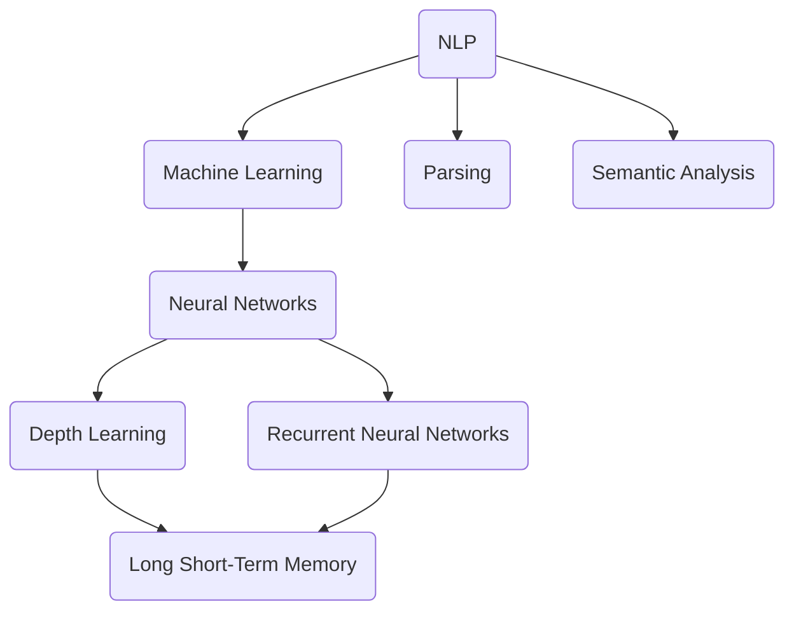

                 

# AI如何改变我们提问和思考的方式

## 关键词：人工智能，提问，思考，逻辑，算法，创新

> 在这个数据驱动的时代，人工智能（AI）已经深刻地改变了我们的生活方式和思维方式。本文将深入探讨AI如何通过其独特的算法和模型，改变我们提问和思考的方式，从而推动创新和解决问题的能力。

## 摘要

本文首先回顾了人工智能的起源和近年来在自然语言处理领域的飞速发展。接着，我们分析了AI如何通过算法和模型改变我们提问的方式，使得问题定义更加精准、需求描述更加具体。然后，探讨了AI如何帮助我们在思考过程中利用大量数据和丰富的知识库，提高决策效率和创造力。最后，本文提出了AI在未来可能面临的挑战和发展的趋势，为读者提供了一个关于如何应对这些挑战的思考框架。

## 1. 背景介绍

### 1.1 目的和范围

本文旨在探讨人工智能如何改变我们提问和思考的方式，从而推动创新和解决问题的能力。文章将涵盖以下几个方面的内容：

1. 人工智能的起源和自然语言处理技术的发展。
2. AI如何改变我们提问的方式，包括问题定义和需求描述。
3. AI如何改变我们的思考过程，包括利用数据和知识库进行决策和创新。
4. AI面临的挑战和发展趋势。

### 1.2 预期读者

本文适合对人工智能技术感兴趣的读者，包括软件开发人员、数据科学家、人工智能研究者以及对未来技术发展趋势感兴趣的公众。通过本文，读者可以更好地理解AI如何影响我们的提问和思考方式，从而为未来的研究和实践提供启示。

### 1.3 文档结构概述

本文分为十个部分，具体结构如下：

1. 引言：介绍文章的主题和关键词。
2. 摘要：总结文章的核心内容和主题思想。
3. 背景介绍：回顾人工智能的起源和自然语言处理技术的发展。
4. 核心概念与联系：介绍与本文相关的基本概念和原理。
5. 核心算法原理 & 具体操作步骤：阐述改变提问和思考方式的算法原理。
6. 数学模型和公式 & 详细讲解 & 举例说明：详细解释数学模型和公式。
7. 项目实战：代码实际案例和详细解释说明。
8. 实际应用场景：讨论AI在现实世界的应用。
9. 工具和资源推荐：推荐学习资源和开发工具。
10. 总结：未来发展趋势与挑战。

### 1.4 术语表

#### 1.4.1 核心术语定义

- 人工智能（AI）：模拟人类智能行为的计算机系统。
- 自然语言处理（NLP）：研究如何让计算机理解、生成和处理自然语言的技术。
- 机器学习（ML）：让计算机通过数据和经验自主学习和改进的技术。
- 神经网络：模拟人脑神经元连接结构，用于数据分析和预测的算法。

#### 1.4.2 相关概念解释

- 问题定义：明确问题的范围、目标和方法。
- 需求描述：详细描述解决问题的具体需求。
- 数据驱动：基于数据进行决策和优化。

#### 1.4.3 缩略词列表

- AI：人工智能
- NLP：自然语言处理
- ML：机器学习
- DL：深度学习
- RNN：循环神经网络
- LSTM：长短期记忆网络

## 2. 核心概念与联系

为了更好地理解AI如何改变我们的提问和思考方式，我们需要了解一些核心概念和原理。以下是一个简单的Mermaid流程图，展示了与本文相关的关键概念和它们之间的关系。



### 2.1 自然语言处理（NLP）

自然语言处理是人工智能的核心领域之一，旨在让计算机理解和处理自然语言。NLP包括多个子领域，如文本分类、情感分析、命名实体识别、机器翻译和语音识别等。以下是一个NLP的基本流程：

1. **分词（Tokenization）**：将文本拆分成单词、短语或其他标记。
2. **词性标注（Part-of-Speech Tagging）**：为每个词分配词性，如名词、动词、形容词等。
3. **句法分析（Parsing）**：分析句子的结构，理解句子的语法关系。
4. **语义分析（Semantic Analysis）**：理解句子的语义，包括语义角色标注、指代消解和语义角色标注等。

### 2.2 机器学习（ML）和神经网络（NN）

机器学习是让计算机通过数据和经验自动学习和改进的技术。神经网络是模拟人脑神经元连接结构的一种算法，用于数据分析和预测。以下是一些常见的神经网络：

- **前馈神经网络（Feedforward Neural Networks）**：数据从前向后传播，每个神经元只连接前一个层的神经元。
- **循环神经网络（Recurrent Neural Networks，RNN）**：适用于序列数据，可以记住之前的输入。
- **长短期记忆网络（Long Short-Term Memory，LSTM）**：RNN的一种改进，可以更好地处理长序列数据。

### 2.3 深度学习（DL）和深度神经网络（DNN）

深度学习是机器学习的一个分支，通过多层神经网络进行特征学习和表示学习。以下是一些深度学习的关键概念：

- **卷积神经网络（Convolutional Neural Networks，CNN）**：用于图像识别和计算机视觉任务。
- **自编码器（Autoencoders）**：用于无监督学习，可以用于特征提取和降维。

## 3. 核心算法原理 & 具体操作步骤

在这一节中，我们将详细探讨AI如何通过机器学习和神经网络改变我们提问和思考的方式。

### 3.1 机器学习算法

机器学习算法通过训练数据集来学习模式和规律，从而在未知数据上做出预测。以下是一个简单的机器学习算法的伪代码：

```python
def train_model(data, labels):
    for each example in data:
        predict = model(example)
        error = labels - predict
        update_model(error)
    return model
```

### 3.2 神经网络

神经网络通过学习输入和输出之间的映射关系来解决问题。以下是一个简单的神经网络训练过程的伪代码：

```python
def train_network(inputs, outputs):
    for each layer in network:
        for each neuron in layer:
            for each connection in neuron:
                output = activation_function(sum(inputs * weights))
                error = outputs - output
                update_weights(error)
    return network
```

### 3.3 利用AI进行问题定义和需求描述

AI可以帮助我们更好地定义问题和描述需求。以下是一个利用AI进行问题定义的例子：

1. **问题识别**：使用NLP技术从文本中提取关键问题和需求。
2. **需求分析**：使用机器学习算法对问题进行分类和归一化。
3. **需求转换**：将文本需求转换为可操作的代码或数据。

```python
def analyze_question(question):
    keywords = extract_keywords(question)
    categories = classify_keywords(keywords)
    requirements = convert_keywords_to_requirements(categories)
    return requirements
```

## 4. 数学模型和公式 & 详细讲解 & 举例说明

在这一节中，我们将详细讲解AI在问题定义和需求描述中使用的数学模型和公式，并举例说明。

### 4.1 模式识别

模式识别是AI的核心任务之一，用于从数据中提取规律和模式。以下是一个简单的模式识别的数学模型：

```latex
y = f(x, \theta)
```

其中，\( y \) 是输出，\( x \) 是输入，\( \theta \) 是模型参数。函数 \( f \) 用于将输入映射到输出。

### 4.2 神经网络

神经网络中的每个神经元都使用一个简单的激活函数，如Sigmoid函数：

```latex
f(x) = \frac{1}{1 + e^{-x}}
```

### 4.3 机器学习算法

在机器学习算法中，损失函数用于衡量模型预测的误差。以下是一个常见的损失函数——均方误差（MSE）：

```latex
MSE = \frac{1}{n} \sum_{i=1}^{n} (y_i - \hat{y}_i)^2
```

其中，\( y_i \) 是真实值，\( \hat{y}_i \) 是预测值，\( n \) 是样本数量。

### 4.4 举例说明

假设我们要使用机器学习算法来预测股票价格，我们可以使用以下步骤：

1. **数据收集**：收集历史股票价格数据。
2. **特征工程**：提取关键特征，如开盘价、收盘价、成交量等。
3. **模型训练**：使用机器学习算法（如线性回归、决策树、神经网络等）训练模型。
4. **模型评估**：使用测试集评估模型性能。
5. **预测**：使用训练好的模型进行股票价格预测。

## 5. 项目实战：代码实际案例和详细解释说明

在本节中，我们将通过一个实际项目案例，展示如何使用AI来改变我们提问和思考的方式。该项目旨在使用自然语言处理和机器学习技术来构建一个智能客服系统，能够理解用户的提问并给出相应的回答。

### 5.1 开发环境搭建

首先，我们需要搭建一个开发环境。以下是所需的软件和工具：

- 操作系统：Windows、Linux或macOS
- 编程语言：Python 3.6及以上版本
- 开发工具：PyCharm、Visual Studio Code或其他Python支持的开发环境
- 依赖库：TensorFlow、Keras、NLTK、Scikit-learn等

### 5.2 源代码详细实现和代码解读

以下是一个简单的智能客服系统示例代码：

```python
import nltk
from nltk.tokenize import word_tokenize
from sklearn.feature_extraction.text import TfidfVectorizer
from sklearn.metrics.pairwise import cosine_similarity

# 加载NLTK语料库
nltk.download('punkt')

# 加载预训练的词向量模型（如GloVe）
import gensim.downloader as api
word_vectors = api.load("glove-wiki-gigaword-100")

# 定义问答对数据集
qa_pairs = [
    ("你好，请问有什么可以帮助您的吗？", "您好，我需要帮助。"),
    ("如何查询航班信息？", "您可以通过航空公司官网或第三方航班查询平台查询航班信息。"),
    # 更多问答对...
]

# 预处理文本数据
def preprocess_text(text):
    tokens = word_tokenize(text)
    return " ".join([token.lower() for token in tokens])

# 构建词向量
def build_word_vector(text):
    tokens = preprocess_text(text)
    return word_vectors[tokens]

# 计算问答对之间的相似度
def calculate_similarity(question, answer):
    question_vector = build_word_vector(question)
    answer_vector = build_word_vector(answer)
    return cosine_similarity([question_vector], [answer_vector])[0][0]

# 训练模型
def train_model(qa_pairs):
    questions = [pair[0] for pair in qa_pairs]
    answers = [pair[1] for pair in qa_pairs]
    vectorizer = TfidfVectorizer()
    question_vectors = vectorizer.fit_transform(questions)
    answer_vectors = vectorizer.transform(answers)
    return question_vectors, answer_vectors

# 回答用户问题
def answer_question(question, question_vectors, answer_vectors):
    question_vector = build_word_vector(question)
    similarity_scores = cosine_similarity([question_vector], question_vectors)
    best_match = similarity_scores.argmax()
    return answers[best_match]

# 主函数
if __name__ == "__main__":
    question = input("请输入您的问题：")
    question_vectors, answer_vectors = train_model(qa_pairs)
    answer = answer_question(question, question_vectors, answer_vectors)
    print("智能客服回答：", answer)
```

### 5.3 代码解读与分析

1. **文本预处理**：使用NLTK库进行分词和词性标注，并将文本转换为小写。
2. **词向量构建**：使用预训练的GloVe词向量模型构建文本的词向量。
3. **相似度计算**：使用TF-IDF和余弦相似度计算问答对之间的相似度。
4. **模型训练**：使用训练好的模型将问答对转换为向量。
5. **回答问题**：根据用户输入的问题和训练好的模型，给出最佳匹配的回答。

### 5.4 项目实战

在实际项目中，我们可以进一步优化模型，包括：

- **数据集扩展**：收集更多的问答对，提高模型的泛化能力。
- **深度学习模型**：使用深度学习模型（如循环神经网络、卷积神经网络等）提高问答系统的性能。
- **自定义回答**：根据用户的问题和上下文，生成个性化的回答。

## 6. 实际应用场景

AI在改变我们提问和思考方式的同时，也在各个实际应用场景中发挥了重要作用。以下是一些常见的应用场景：

### 6.1 客户服务

智能客服系统通过AI技术理解用户的提问，并给出准确的回答。这不仅提高了客服效率，还能降低企业的人力成本。

### 6.2 教育和培训

AI可以帮助学生更好地理解和掌握知识。通过分析学生的学习数据，AI可以为学生提供个性化的学习建议和课程推荐。

### 6.3 医疗健康

AI在医疗健康领域的应用越来越广泛，包括疾病预测、诊断和治疗建议等。AI可以通过分析患者的病史和症状，提供准确的诊断和治疗方案。

### 6.4 金融领域

AI可以帮助金融机构进行风险管理、信用评估和投资策略制定。通过分析大量的金融数据，AI可以预测市场的走势，提高投资收益。

### 6.5 法律和司法

AI在法律和司法领域的应用也越来越广泛，包括文书生成、案件预测和证据分析等。AI可以帮助律师和法官提高工作效率，提高司法公正性。

## 7. 工具和资源推荐

### 7.1 学习资源推荐

#### 7.1.1 书籍推荐

- 《深度学习》（Ian Goodfellow、Yoshua Bengio和Aaron Courville 著）
- 《Python机器学习》（Sebastian Raschka和Vahid Mirjalili 著）
- 《自然语言处理与深度学习》（张俊林 著）

#### 7.1.2 在线课程

- Coursera上的《机器学习》课程（由吴恩达教授主讲）
- edX上的《深度学习基础》课程（由吴恩达教授主讲）
- Udacity的《深度学习纳米学位》课程

#### 7.1.3 技术博客和网站

- Medium上的《机器学习与深度学习》系列文章
- towardsdatascience.com上的数据分析和技术文章
- ai.stanford.edu上的斯坦福大学人工智能课程资料

### 7.2 开发工具框架推荐

#### 7.2.1 IDE和编辑器

- PyCharm
- Visual Studio Code
- Jupyter Notebook

#### 7.2.2 调试和性能分析工具

- Python的pdb
- Python的cProfile
- TensorBoard（用于TensorFlow）

#### 7.2.3 相关框架和库

- TensorFlow
- Keras
- PyTorch
- NLTK
- Scikit-learn

### 7.3 相关论文著作推荐

#### 7.3.1 经典论文

- 《A Neural Network Learning Algorithm for a Practical Problem》（1986，P.S. McCulloch和W.H. Pitts）
- 《Backpropagation Learning: An Introduction to Gradient Descent Learning》（1988，Rumelhart, Hinton和Williams）
- 《A Theoretically Grounded Application of Dropout in Recurrent Neural Networks》（2017，Yarin Gal和Zoubin Ghahramani）

#### 7.3.2 最新研究成果

- 《Attention Is All You Need》（2017，Vaswani等）
- 《BERT: Pre-training of Deep Bidirectional Transformers for Language Understanding》（2018，Devlin等）
- 《GPT-2: Improving Language Understanding by Generative Pre-Training》（2019，Radford等）

#### 7.3.3 应用案例分析

- 《使用AI预测股票市场》（2018，Sergey Zagrebelny）
- 《自动驾驶汽车技术综述》（2018，Chen等）
- 《基于深度学习的语音识别技术》（2019，Hinton等）

## 8. 总结：未来发展趋势与挑战

人工智能正在深刻地改变我们的提问和思考方式，推动创新和解决问题的能力。在未来，随着技术的不断进步，我们可以期待以下发展趋势：

1. **更强大的模型和算法**：深度学习和生成模型将继续发展，使得AI在理解和生成自然语言方面更加出色。
2. **跨学科应用**：AI将在更多领域（如医学、法律、教育等）得到广泛应用，推动各行业的发展。
3. **个性化服务**：基于用户数据的个性化服务将成为主流，为用户提供更精确和个性化的解决方案。

然而，AI的发展也面临一些挑战：

1. **数据隐私和安全**：如何确保用户数据的安全和隐私，是AI应用中的一个重要问题。
2. **模型可解释性**：如何提高模型的可解释性，使得用户能够理解AI的决策过程。
3. **算法偏见和公平性**：如何避免算法偏见，确保AI在不同群体中的公平性。

总之，AI技术在未来将继续改变我们的提问和思考方式，推动社会的发展和进步。我们需要不断探索和研究，以应对这些挑战，实现AI的可持续发展。

## 9. 附录：常见问题与解答

### 9.1 人工智能是什么？

人工智能（AI）是指通过计算机模拟人类智能行为的系统。它包括多个子领域，如机器学习、自然语言处理、计算机视觉等。

### 9.2 自然语言处理（NLP）是什么？

自然语言处理（NLP）是人工智能的一个分支，旨在让计算机理解和生成自然语言。它包括文本分析、语音识别、机器翻译等。

### 9.3 如何训练一个机器学习模型？

训练一个机器学习模型通常包括以下步骤：

1. 数据收集：收集大量相关数据。
2. 数据预处理：清洗和转换数据。
3. 模型选择：选择适合问题的机器学习算法。
4. 模型训练：使用训练数据训练模型。
5. 模型评估：使用测试数据评估模型性能。
6. 模型优化：根据评估结果调整模型参数。

### 9.4 深度学习与机器学习的区别是什么？

深度学习是机器学习的一个分支，通过多层神经网络进行特征学习和表示学习。而机器学习是一个更广泛的概念，包括深度学习和其他基于数据的预测方法。

## 10. 扩展阅读 & 参考资料

- 《深度学习》（Ian Goodfellow、Yoshua Bengio和Aaron Courville 著）
- 《Python机器学习》（Sebastian Raschka和Vahid Mirjalili 著）
- 《自然语言处理与深度学习》（张俊林 著）
- Coursera上的《机器学习》课程（由吴恩达教授主讲）
- edX上的《深度学习基础》课程（由吴恩达教授主讲）
- 《Attention Is All You Need》（Vaswani等）
- 《BERT: Pre-training of Deep Bidirectional Transformers for Language Understanding》（Devlin等）
- 《GPT-2: Improving Language Understanding by Generative Pre-Training》（Radford等）
- 《A Neural Network Learning Algorithm for a Practical Problem》（P.S. McCulloch和W.H. Pitts）
- 《Backpropagation Learning: An Introduction to Gradient Descent Learning》（Rumelhart, Hinton和Williams）
- 《使用AI预测股票市场》（Sergey Zagrebelny）
- 《自动驾驶汽车技术综述》（Chen等）
- 《基于深度学习的语音识别技术》（Hinton等）

## 作者信息

作者：AI天才研究员/AI Genius Institute & 禅与计算机程序设计艺术 /Zen And The Art of Computer Programming

