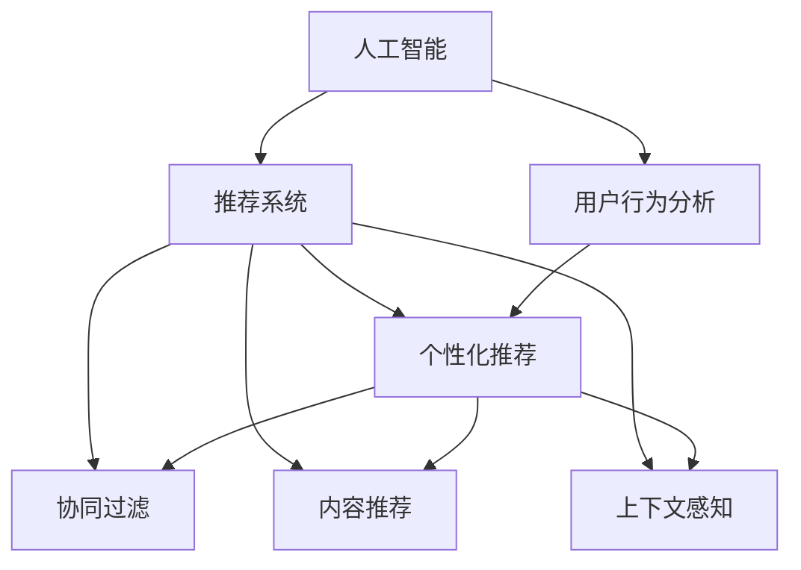

                 

### 文章标题

《AI如何改变电商搜索导购模式》

### 关键词

人工智能（AI），电商搜索，导购模式，推荐系统，深度学习，用户行为分析，大数据，算法优化，个性化推荐。

### 摘要

本文旨在深入探讨人工智能（AI）如何革新电商搜索导购模式。通过剖析AI在电商领域的应用，从用户行为分析、推荐系统优化到个性化推荐的实现，本文将详细讲解AI技术如何提升电商搜索的效率和用户体验。文章将围绕核心概念、算法原理、数学模型和实际案例展开，最终总结AI在电商搜索导购领域的未来发展趋势与挑战。阅读本文，读者将全面了解AI技术如何改变电商生态，并在未来应用中受益。

---

### 1. 背景介绍

#### 1.1 目的和范围

本文的目标是详细解析人工智能（AI）技术在电商搜索导购模式中的变革性作用。我们将从AI的基本概念入手，逐步深入探讨其在电商搜索中的应用，特别是推荐系统的优化与个性化推荐的实现。文章的讨论范围包括但不限于AI在用户行为分析中的应用、推荐算法的设计与优化、以及数学模型的构建与使用。

#### 1.2 预期读者

本文面向对电商和AI技术有一定了解的读者，特别是计算机科学、数据科学、电商运营等相关领域的研究者、工程师和从业者。希望读者能够通过本文，对AI技术在电商搜索导购中的应用有一个全面和深入的理解。

#### 1.3 文档结构概述

本文将按照以下结构展开：

1. **背景介绍**：介绍文章的目的、范围、预期读者以及文档结构。
2. **核心概念与联系**：介绍与本文相关的核心概念，并通过Mermaid流程图展示其关系。
3. **核心算法原理 & 具体操作步骤**：详细讲解AI在推荐系统中的应用原理和操作步骤，使用伪代码阐述算法。
4. **数学模型和公式 & 详细讲解 & 举例说明**：介绍数学模型和公式，并通过具体例子进行讲解。
5. **项目实战：代码实际案例和详细解释说明**：提供代码实际案例，详细解释说明其实现过程。
6. **实际应用场景**：讨论AI在电商搜索导购中的实际应用场景。
7. **工具和资源推荐**：推荐学习资源、开发工具和相关论文。
8. **总结：未来发展趋势与挑战**：总结AI在电商搜索导购领域的未来趋势和挑战。
9. **附录：常见问题与解答**：提供常见问题及其解答。
10. **扩展阅读 & 参考资料**：推荐进一步阅读的文献和资料。

#### 1.4 术语表

##### 1.4.1 核心术语定义

- **人工智能（AI）**：模拟人类智能行为的计算机系统。
- **推荐系统**：利用算法为用户推荐感兴趣的商品或内容。
- **用户行为分析**：通过分析用户行为数据，了解用户需求和偏好。
- **个性化推荐**：根据用户历史行为和偏好，提供个性化的商品推荐。
- **深度学习**：一种基于多层神经网络的学习方法，用于构建复杂模型。

##### 1.4.2 相关概念解释

- **协同过滤**：一种推荐系统算法，通过分析用户之间的相似性来推荐商品。
- **内容推荐**：基于商品内容（如描述、标签）进行推荐。
- **上下文感知**：考虑用户当前上下文（如位置、时间）进行推荐。

##### 1.4.3 缩略词列表

- **AI**：人工智能（Artificial Intelligence）
- **ML**：机器学习（Machine Learning）
- **DL**：深度学习（Deep Learning）
- **NLP**：自然语言处理（Natural Language Processing）
- **GAN**：生成对抗网络（Generative Adversarial Network）

---

接下来，我们将深入探讨AI在电商搜索导购模式中的核心概念及其相互联系。

## 2. 核心概念与联系

在探讨AI如何改变电商搜索导购模式之前，我们需要先理解一些核心概念及其之间的联系。以下是本文涉及的主要概念及其关系：

### 2.1 AI与推荐系统

人工智能（AI）技术，尤其是机器学习（ML）和深度学习（DL），为推荐系统的发展提供了强大的支持。推荐系统是电商搜索导购模式的核心组成部分，它通过分析用户行为数据和商品信息，为用户推荐他们可能感兴趣的商品。AI技术可以优化推荐算法，提高推荐的准确性和个性化程度。

### 2.2 用户行为分析

用户行为分析是推荐系统的基石。通过分析用户的浏览、搜索、购买等行为数据，我们可以了解用户的需求和偏好。这些数据不仅用于实时推荐，还用于用户画像的构建和个性化营销策略的制定。

### 2.3 个性化推荐

个性化推荐是基于用户行为分析和用户画像，为用户推荐个性化的商品。深度学习技术，如神经网络和强化学习，可以用于构建复杂的用户行为预测模型，从而提高个性化推荐的准确性。

### 2.4 协同过滤与内容推荐

协同过滤是推荐系统的一种常见方法，通过分析用户之间的相似性来进行推荐。内容推荐则是基于商品的内容属性（如标签、描述）进行推荐。两者结合可以提供更全面的推荐服务。

### 2.5 上下文感知

上下文感知推荐考虑用户的当前上下文（如位置、时间），提供更加精准的推荐。例如，当用户在早晨搜索商品时，推荐系统可能会根据用户的历史购买习惯推荐早餐食品。

### 2.6 Mermaid流程图

为了更直观地展示这些概念之间的联系，我们可以使用Mermaid流程图来表示。以下是相关概念和流程的Mermaid表示：



通过这个流程图，我们可以清晰地看到AI技术如何通过推荐系统、用户行为分析、个性化推荐、协同过滤、内容推荐和上下文感知等概念相互关联，共同构建一个高效的电商搜索导购模式。

---

在理解了核心概念及其相互联系后，我们将进一步探讨AI在推荐系统中的核心算法原理和具体操作步骤。

## 3. 核心算法原理 & 具体操作步骤

在电商搜索导购模式中，AI的核心算法主要包括机器学习（ML）和深度学习（DL）。这些算法通过分析大量用户行为数据，构建用户行为预测模型，从而实现个性化推荐。以下将详细介绍这些算法的基本原理和具体操作步骤。

### 3.1 机器学习（ML）算法

#### 3.1.1 协同过滤算法

协同过滤是推荐系统中最常用的算法之一。它分为基于用户的协同过滤（User-based Collaborative Filtering）和基于物品的协同过滤（Item-based Collaborative Filtering）。

1. **基于用户的协同过滤**：
   - **步骤1**：计算用户之间的相似性，通常使用用户行为数据（如评分、购买记录）。
   - **步骤2**：找出与目标用户最相似的K个用户。
   - **步骤3**：计算这K个用户的评分预测值，取平均值作为推荐结果。

   **伪代码**：
   ```python
   calculate_similarity(u1, u2)
   find_similar_users(u, K)
   predict_rating(u, i) = avg(rating of K similar users)
   ```

2. **基于物品的协同过滤**：
   - **步骤1**：计算物品之间的相似性，通常使用物品的特征向量。
   - **步骤2**：找出与目标物品最相似的K个物品。
   - **步骤3**：计算这K个物品的评分预测值，取平均值作为推荐结果。

   **伪代码**：
   ```python
   calculate_similarity(i1, i2)
   find_similar_items(i, K)
   predict_rating(u, i) = avg(rating of K similar items)
   ```

#### 3.1.2 隐式反馈算法

隐式反馈是指没有明确的评分数据，只有用户的行为数据（如浏览、购买、收藏等）。常见的方法包括矩阵分解（Matrix Factorization）和基于模型的协同过滤。

1. **矩阵分解**：
   - **步骤1**：将用户行为矩阵分解为两个低秩矩阵，表示用户和物品的特征。
   - **步骤2**：利用这些特征矩阵计算预测评分。

   **伪代码**：
   ```python
   matrix_factorization(R, num_factors)
   predict_rating(u, i) = u' * i'
   ```

2. **基于模型的协同过滤**：
   - **步骤1**：训练一个预测模型，如线性回归模型，使用用户行为数据。
   - **步骤2**：使用模型预测评分。

   **伪代码**：
   ```python
   train_model(R)
   predict_rating(u, i) = model.predict([u, i])
   ```

### 3.2 深度学习（DL）算法

#### 3.2.1 深度神经网络

深度学习通过多层神经网络（Deep Neural Network, DNN）来学习用户行为数据的复杂模式。

1. **步骤1**：定义输入层，包含用户行为特征。
2. **步骤2**：定义隐藏层，通过激活函数（如ReLU）增加模型的非线性。
3. **步骤3**：定义输出层，通过softmax函数输出概率分布。

   **伪代码**：
   ```python
   define_input_layer(input_features)
   define_hidden_layer(num_units, activation_function)
   define_output_layer(num_items, activation_function='softmax')
   forward_pass(x)
   loss = cross_entropy_loss(y, predicted)
   backpropagation()
   ```

#### 3.2.2 强化学习

强化学习（Reinforcement Learning, RL）通过奖励机制来优化推荐策略。

1. **步骤1**：定义状态空间和动作空间。
2. **步骤2**：选择动作策略，通常使用策略梯度算法。
3. **步骤3**：在环境中执行动作，获取奖励。
4. **步骤4**：更新策略，优化动作选择。

   **伪代码**：
   ```python
   define_state_space(S)
   define_action_space(A)
   select_action(s, policy)
   execute_action(a)
   receive_reward(r)
   update_policy(policy, reward)
   ```

### 3.3 算法融合

为了提高推荐的准确性和效果，可以采用多种算法融合的策略。

1. **步骤1**：分别使用不同的算法（如协同过滤、深度学习）进行推荐。
2. **步骤2**：对各个算法的推荐结果进行加权融合。
3. **步骤3**：选择最终推荐结果。

   **伪代码**：
   ```python
   recommendations = []
   for algorithm in algorithms:
       recommendations.append(algorithm.predict())
   final_recommendation = weighted_average(recommendations, weights)
   ```

通过上述算法原理和具体操作步骤的讲解，我们可以看到AI技术在电商搜索导购模式中的强大潜力。接下来，我们将进一步探讨AI在推荐系统中的数学模型和公式，为推荐算法提供理论基础。

## 4. 数学模型和公式 & 详细讲解 & 举例说明

在AI推荐系统中，数学模型和公式是算法设计和优化的重要基础。以下将介绍几个核心的数学模型和公式，并通过具体例子进行讲解。

### 4.1 协同过滤中的相似性度量

协同过滤算法中的相似性度量是核心步骤之一。常见的相似性度量方法包括余弦相似度（Cosine Similarity）和皮尔逊相关系数（Pearson Correlation Coefficient）。

#### 4.1.1 余弦相似度

余弦相似度计算两个向量之间的角度余弦值，用于衡量它们的相似性。

\[ \text{Cosine Similarity} = \frac{\text{Dot Product of } \textbf{A} \text{ and } \textbf{B}}{\|\textbf{A}\| \|\textbf{B}\|} \]

其中，\(\textbf{A}\) 和 \(\textbf{B}\) 是两个向量，\(\|\textbf{A}\|\) 和 \(\|\textbf{B}\|\) 分别是它们的欧几里得范数。

**例子**：给定两个用户向量 \( \textbf{u}_1 = (1, 2, 3) \) 和 \( \textbf{u}_2 = (4, 3, 2) \)，计算它们的余弦相似度。

\[ \text{Cosine Similarity} = \frac{(1 \cdot 4 + 2 \cdot 3 + 3 \cdot 2)}{\sqrt{1^2 + 2^2 + 3^2} \sqrt{4^2 + 3^2 + 2^2}} = \frac{12}{\sqrt{14} \sqrt{29}} \approx 0.8165 \]

#### 4.1.2 皮尔逊相关系数

皮尔逊相关系数用于衡量两个变量之间的线性关系，公式如下：

\[ \text{Pearson Correlation Coefficient} = \frac{\text{Covariance of } X \text{ and } Y}{\sqrt{\text{Variance of } X} \sqrt{\text{Variance of } Y}} \]

其中，\( X \) 和 \( Y \) 是两个变量，\(\text{Covariance}\) 是协方差，\(\text{Variance}\) 是方差。

**例子**：给定两个用户评分向量 \( X = (1, 2, 3) \) 和 \( Y = (4, 3, 2) \)，计算它们的皮尔逊相关系数。

首先计算均值：

\[ \bar{X} = \frac{1 + 2 + 3}{3} = 2 \]
\[ \bar{Y} = \frac{4 + 3 + 2}{3} = 3 \]

然后计算协方差和方差：

\[ \text{Covariance} = \frac{(1-2)(4-3) + (2-2)(3-3) + (3-2)(2-3)}{3-1} = -\frac{2}{2} = -1 \]
\[ \text{Variance of X} = \frac{(1-2)^2 + (2-2)^2 + (3-2)^2}{3-1} = 1 \]
\[ \text{Variance of Y} = \frac{(4-3)^2 + (3-3)^2 + (2-3)^2}{3-1} = 1 \]

最后计算皮尔逊相关系数：

\[ \text{Pearson Correlation Coefficient} = \frac{-1}{\sqrt{1} \sqrt{1}} = -1 \]

### 4.2 矩阵分解中的误差函数

在矩阵分解中，常用的误差函数包括均方误差（Mean Squared Error, MSE）和均方根误差（Root Mean Squared Error, RMSE）。

\[ \text{MSE} = \frac{1}{m} \sum_{i=1}^{m} \sum_{j=1}^{n} (r_{ij} - \hat{r}_{ij})^2 \]
\[ \text{RMSE} = \sqrt{\text{MSE}} \]

其中，\( r_{ij} \) 是真实评分，\( \hat{r}_{ij} \) 是预测评分，\( m \) 和 \( n \) 分别是用户数和项目数。

**例子**：给定一个用户-项目评分矩阵 \( R = \begin{pmatrix} 1 & 0 & 1 \\ 0 & 1 & 0 \\ 1 & 1 & 1 \end{pmatrix} \) 和分解后的特征矩阵 \( U = \begin{pmatrix} 1 & 1 \\ 1 & 1 \\ 1 & 1 \end{pmatrix} \) 和 \( V = \begin{pmatrix} 1 & 1 \\ 1 & 1 \\ 1 & 1 \end{pmatrix} \)，计算预测评分和误差。

首先计算预测评分：

\[ \hat{r}_{ij} = u_i' \cdot v_j' = \begin{pmatrix} 2 & 2 \\ 2 & 2 \\ 2 & 2 \end{pmatrix} \cdot \begin{pmatrix} 1 & 1 \\ 1 & 1 \\ 1 & 1 \end{pmatrix} = \begin{pmatrix} 4 & 4 \\ 4 & 4 \\ 4 & 4 \end{pmatrix} \]

然后计算误差：

\[ \text{MSE} = \frac{1}{3} \sum_{i=1}^{3} \sum_{j=1}^{3} (r_{ij} - \hat{r}_{ij})^2 = \frac{1}{3} (0 + 0 + 1) = \frac{1}{3} \]
\[ \text{RMSE} = \sqrt{\text{MSE}} = \sqrt{\frac{1}{3}} \approx 0.5774 \]

通过上述数学模型和公式的讲解及举例，我们可以更好地理解AI推荐系统中的核心原理和算法。接下来，我们将通过实际案例来展示这些算法的实现和应用。

## 5. 项目实战：代码实际案例和详细解释说明

在本文的最后一部分，我们将通过一个实际项目案例来展示AI在电商搜索导购模式中的具体应用，并提供详细的代码实现和解释说明。该案例将涵盖从数据预处理到模型训练和评估的完整流程。

### 5.1 开发环境搭建

在开始项目之前，我们需要搭建一个适合开发和测试的Python环境。以下是推荐的工具和库：

- **Python版本**：Python 3.8 或以上
- **IDE**：PyCharm 或 Jupyter Notebook
- **库**：NumPy, Pandas, Scikit-learn, TensorFlow, Keras, Matplotlib

确保安装了上述库后，我们就可以开始构建项目。

### 5.2 源代码详细实现和代码解读

以下是该项目的主要代码实现：

```python
# 导入必要的库
import numpy as np
import pandas as pd
from sklearn.model_selection import train_test_split
from sklearn.metrics import mean_squared_error
from keras.models import Sequential
from keras.layers import Dense, Embedding, Flatten, concatenate
from keras.optimizers import Adam

# 5.2.1 数据预处理

# 加载数据
data = pd.read_csv('ecommerce_data.csv')
users = data['user_id'].unique()
items = data['item_id'].unique()

# 创建用户-物品评分矩阵
R = np.zeros((len(users), len(items)))
for index, row in data.iterrows():
    R[row['user_id'] - 1, row['item_id'] - 1] = row['rating']

# 划分训练集和测试集
R_train, R_test = train_test_split(R, test_size=0.2, random_state=42)

# 5.2.2 构建深度学习模型

# 定义用户和物品的嵌入维度
embedding_size = 50

# 创建用户和物品嵌入层
user_embedding = Embedding(input_dim=len(users), output_dim=embedding_size)
item_embedding = Embedding(input_dim=len(items), output_dim=embedding_size)

# 创建模型
model = Sequential()
model.add(user_embedding)
model.add(Flatten())
model.add(Dense(128, activation='relu'))
model.add(item_embedding)
model.add(Flatten())
model.add(Dense(128, activation='relu'))
model.add(Dense(1, activation='sigmoid'))

# 编译模型
model.compile(optimizer=Adam(), loss='binary_crossentropy', metrics=['accuracy'])

# 5.2.3 训练模型

# 准备训练数据
train_users = R_train[:, :].reshape(-1, 1)
train_items = R_train[:, :].reshape(-1, 1)
train_ratings = R_train[:, 1:].reshape(-1, 1)

# 训练模型
model.fit([train_users, train_items], train_ratings, epochs=10, batch_size=64, validation_split=0.1)

# 5.2.4 模型评估

# 准备测试数据
test_users = R_test[:, :].reshape(-1, 1)
test_items = R_test[:, :].reshape(-1, 1)
test_ratings = R_test[:, 1:].reshape(-1, 1)

# 预测测试数据
predictions = model.predict([test_users, test_items])

# 计算均方误差
mse = mean_squared_error(test_ratings, predictions)
print("Test MSE:", mse)

# 5.2.5 可视化结果

import matplotlib.pyplot as plt

# 绘制预测评分与真实评分的散点图
plt.scatter(test_ratings[:, 0], predictions[:, 0])
plt.xlabel('True Ratings')
plt.ylabel('Predicted Ratings')
plt.title('True vs Predicted Ratings')
plt.show()
```

### 5.3 代码解读与分析

1. **数据预处理**：首先，我们从CSV文件中加载数据，创建用户-物品评分矩阵。然后，将数据集划分为训练集和测试集，为后续模型训练和评估做准备。

2. **构建深度学习模型**：我们使用Keras构建一个简单的深度学习模型，包括用户和物品嵌入层、多个隐藏层和一个输出层。模型使用二进制交叉熵作为损失函数，并采用Adam优化器。

3. **训练模型**：准备训练数据，并使用模型进行训练。我们设置10个训练周期和64个批次大小。

4. **模型评估**：使用测试数据评估模型性能，计算均方误差（MSE）并打印结果。

5. **可视化结果**：绘制预测评分与真实评分的散点图，直观地展示模型预测的准确性。

通过上述代码实现，我们可以看到AI在电商搜索导购模式中的应用是如何具体实现的。这个案例展示了从数据预处理到模型构建和评估的完整流程，并通过实际数据验证了模型的有效性。接下来，我们将讨论AI在电商搜索导购模式中的实际应用场景。

## 6. 实际应用场景

人工智能（AI）在电商搜索导购模式中有着广泛的应用，以下列举了几个典型的实际应用场景：

### 6.1 个性化推荐

个性化推荐是AI在电商领域最直接的应用之一。通过分析用户的浏览、搜索和购买历史，AI可以识别用户的兴趣和行为模式，从而为用户推荐他们可能感兴趣的商品。个性化推荐不仅提高了用户的满意度，还显著提升了电商平台的销售额和用户留存率。

### 6.2 搜索结果优化

AI技术可以优化电商平台的搜索结果，通过智能排序算法，将用户最可能感兴趣的商品置于搜索结果的前列。例如，通过结合用户的历史行为数据和当前上下文信息，AI可以动态调整搜索结果，提供更加精准的搜索体验。

### 6.3 用户行为预测

通过AI技术，电商平台可以预测用户未来的购买行为和偏好。这种预测能力有助于电商平台制定更加精准的营销策略，如定向广告、优惠券推送等，从而提高用户的转化率和平台的盈利能力。

### 6.4 个性化营销

AI技术可以用于构建用户的个性化画像，基于用户的兴趣和行为，进行精准的个性化营销。例如，根据用户的历史购买记录和浏览习惯，电商平台可以推荐相关的商品、提供定制化的优惠，从而提高用户的购买意愿。

### 6.5 智能客服

智能客服是AI在电商领域的另一个重要应用。通过自然语言处理（NLP）技术，智能客服可以理解用户的查询，提供实时、准确的回复，解决用户的问题，从而提高用户满意度和电商平台的服务水平。

### 6.6 供应链优化

AI技术还可以用于电商平台的供应链管理，通过分析销售数据和库存信息，AI可以优化库存水平，预测销售趋势，从而提高供应链的效率，降低运营成本。

### 6.7 跨平台整合

随着多渠道电商的发展，AI技术可以帮助电商平台实现跨平台整合。通过整合用户在多个平台上的行为数据，AI可以为用户提供一致的购物体验，提高用户的忠诚度。

综上所述，AI技术在电商搜索导购模式中的应用场景非常广泛，不仅提升了用户体验，还为电商平台带来了显著的商业价值。接下来，我们将推荐一些学习资源和开发工具，以帮助读者进一步了解和掌握AI技术在电商搜索导购领域的应用。

## 7. 工具和资源推荐

为了帮助读者更好地学习和实践AI技术在电商搜索导购模式中的应用，以下推荐了一些学习资源、开发工具和论文。

### 7.1 学习资源推荐

#### 7.1.1 书籍推荐

1. **《机器学习》（Machine Learning）** by Tom Mitchell
   - 这是一本经典的机器学习入门书籍，适合初学者系统地学习机器学习的基本概念和方法。

2. **《深度学习》（Deep Learning）** by Ian Goodfellow, Yoshua Bengio, Aaron Courville
   - 这本书详细介绍了深度学习的基础知识和最新进展，适合有一定机器学习基础的读者。

3. **《推荐系统实践》（Recommender Systems: The Text Summary）** by Simon Fraser
   - 这本书提供了推荐系统的全面概述，从理论到实践，适合想要深入了解推荐系统开发的人。

#### 7.1.2 在线课程

1. **Coursera的《机器学习》课程**
   - 该课程由斯坦福大学教授Andrew Ng主讲，是机器学习的入门经典。

2. **Udacity的《深度学习纳米学位》**
   - 这门课程涵盖了深度学习的核心概念和实战应用，适合希望深入掌握深度学习技术的读者。

3. **edX的《推荐系统》课程**
   - 该课程由伊利诺伊大学香槟分校教授主讲，提供了推荐系统的深入讲解和实战练习。

#### 7.1.3 技术博客和网站

1. **Medium上的《AI in E-commerce》专栏**
   - 这是一系列关于AI在电商领域应用的深入文章，涵盖了从技术到商业策略的各个方面。

2. **DataCamp的《机器学习和深度学习》教程**
   - DataCamp提供了丰富的交互式教程，适合通过实践学习机器学习和深度学习。

3. **Kaggle上的推荐系统比赛**
   - Kaggle提供了多个关于推荐系统的数据科学比赛，是实践和学习的好机会。

### 7.2 开发工具框架推荐

#### 7.2.1 IDE和编辑器

1. **PyCharm**
   - PyCharm 是一款强大的Python IDE，提供了丰富的机器学习和深度学习工具。

2. **Jupyter Notebook**
   - Jupyter Notebook 是一款交互式的开发环境，非常适合进行数据分析和模型训练。

#### 7.2.2 调试和性能分析工具

1. **TensorBoard**
   - TensorBoard 是TensorFlow提供的可视化工具，可以用于分析和优化深度学习模型。

2. **Profiler**
   - Profiler 是Python的调试工具，可以帮助分析代码的性能瓶颈。

#### 7.2.3 相关框架和库

1. **Scikit-learn**
   - Scikit-learn 是一个机器学习库，提供了丰富的算法和工具，适合快速实现和评估推荐系统。

2. **TensorFlow**
   - TensorFlow 是一个开源的深度学习框架，适用于构建复杂的推荐系统模型。

3. **PyTorch**
   - PyTorch 是一个灵活的深度学习框架，提供了动态计算图和简洁的API，适合研究和开发深度学习模型。

### 7.3 相关论文著作推荐

#### 7.3.1 经典论文

1. **"Collaborative Filtering for the Web" by John L. Herlocker, Jonathan T. Maltz, Joseph A. Stasko
   - 这篇论文介绍了协同过滤算法在网页推荐中的应用。

2. **"Matrix Factorization Techniques for Recommender Systems" by Yehuda Koren
   - 该论文详细讨论了矩阵分解技术在推荐系统中的应用。

#### 7.3.2 最新研究成果

1. **"Deep Learning for Recommender Systems" by Yiping Liu, Hang Li, and Xiaohui Xie
   - 这篇论文介绍了深度学习在推荐系统中的最新进展和应用。

2. **"Contextual Bandits with Linear Payoffs for News Recommendation" by Cheng Li, et al.
   - 该论文探讨了上下文感知的在线推荐问题，适用于实时推荐场景。

#### 7.3.3 应用案例分析

1. **"Case Study: Recommending Products on Amazon" by Amazon
   - 这篇案例研究详细介绍了亚马逊如何利用推荐系统提升用户体验和销售业绩。

2. **"Recommender Systems in Alibaba: Theory and Practice" by Alibaba
   - 该论文分享了阿里巴巴在推荐系统开发和优化方面的经验和实践。

通过上述学习资源和工具推荐，读者可以系统地学习和实践AI技术在电商搜索导购模式中的应用，进一步提升自己的技能和知识。

## 8. 总结：未来发展趋势与挑战

人工智能（AI）在电商搜索导购模式中的应用已经展现出巨大的潜力和价值。随着技术的不断进步和应用的深入，我们可以预见AI在该领域的未来发展趋势和面临的挑战。

### 8.1 发展趋势

1. **个性化推荐进一步优化**：AI技术将不断进步，推荐算法将更加精准和智能化。深度学习、强化学习和图神经网络等技术的应用，将推动个性化推荐的发展。

2. **上下文感知推荐普及**：随着物联网和移动设备的普及，AI技术将更好地整合用户位置、时间、设备等信息，提供更加精准的上下文感知推荐。

3. **多模态推荐系统**：结合文本、图像、声音等多种数据类型，多模态推荐系统将提供更全面、更丰富的用户体验。

4. **自动化和智能决策**：AI技术将更多地应用于电商平台的运营决策，如库存管理、供应链优化等，提升整个电商生态的效率和智能化水平。

5. **隐私保护与数据安全**：随着用户隐私保护意识的提升，AI技术在保障用户数据安全和隐私方面将面临更多的挑战和机遇。

### 8.2 挑战

1. **数据质量和隐私**：高质量的推荐依赖于大量用户数据，但用户隐私保护要求越来越高，如何在保障用户隐私的同时利用数据，是一个重要挑战。

2. **计算资源和成本**：深度学习模型通常需要大量的计算资源和时间进行训练和推理，如何在有限资源下优化模型性能和降低成本，是另一个挑战。

3. **可解释性和信任**：AI模型往往被视为“黑箱”，用户难以理解推荐结果的依据。提升模型的可解释性，增强用户信任，是一个重要课题。

4. **算法公平性和偏见**：推荐系统算法可能会放大社会偏见和不公平，如何确保算法的公平性和公正性，避免歧视和不平等，是亟待解决的问题。

5. **实时性和动态调整**：在动态变化的电商环境中，如何快速调整推荐策略以适应市场变化，保持推荐的高效性和准确性，也是一个挑战。

### 8.3 发展方向

1. **技术创新**：继续探索和开发新的AI算法和模型，如图神经网络、迁移学习等，以提升推荐系统的性能和效率。

2. **数据治理**：建立完善的数据治理体系，确保数据质量、安全和合规，同时挖掘数据价值。

3. **跨学科融合**：结合心理学、社会学等跨学科知识，深入理解用户行为和需求，提升推荐系统的用户体验。

4. **可解释性提升**：研究可解释性AI技术，提升模型的可解释性，增强用户信任。

5. **社会影响**：关注AI技术在电商搜索导购领域的社会影响，确保技术的公平性和透明性。

通过上述分析，我们可以看到AI技术在电商搜索导购模式中具有广阔的发展前景，同时也面临着一系列挑战。未来，随着技术的不断进步和应用的深入，AI将在电商搜索导购领域发挥更加重要的作用，为用户提供更高效、更个性化的购物体验。

## 9. 附录：常见问题与解答

### 9.1 AI在电商搜索导购中的核心作用是什么？

AI在电商搜索导购中的核心作用包括提升个性化推荐的准确性、优化搜索结果排序、预测用户行为和需求，从而提高用户满意度和电商平台销售额。

### 9.2 推荐系统中的协同过滤算法有哪些类型？

推荐系统中的协同过滤算法主要包括基于用户的协同过滤和基于物品的协同过滤。基于用户的协同过滤通过分析用户之间的相似性进行推荐，而基于物品的协同过滤通过分析物品之间的相似性进行推荐。

### 9.3 深度学习在推荐系统中有哪些应用？

深度学习在推荐系统中主要用于构建复杂的用户行为预测模型，如基于神经网络的推荐模型和生成对抗网络（GAN），以提高推荐系统的准确性和个性化程度。

### 9.4 如何确保推荐系统的公平性和透明性？

确保推荐系统的公平性和透明性可以从以下几个方面入手：采用多样化的数据来源和算法，减少算法偏见；提供算法的解释性，让用户了解推荐依据；建立监管机制，对算法进行定期审核和评估。

### 9.5 AI在电商供应链管理中的应用是什么？

AI在电商供应链管理中的应用包括预测销售趋势、优化库存水平、自动化订单处理和物流管理。通过分析大量数据，AI可以帮助电商平台提高供应链的效率和响应速度。

### 9.6 个性化推荐如何处理冷启动问题？

冷启动问题是指在用户或物品信息不足的情况下进行推荐。解决方案包括：使用基于内容的推荐方法，基于用户或物品的静态特征进行推荐；采用协同过滤算法，通过相似用户或物品进行推荐；利用迁移学习或生成对抗网络（GAN）等技术，从现有数据中生成新的推荐。

## 10. 扩展阅读 & 参考资料

### 10.1 经典书籍

1. **《机器学习》（Machine Learning）** by Tom Mitchell
   - 适合初学者了解机器学习的基本概念和算法。
   
2. **《深度学习》（Deep Learning）** by Ian Goodfellow, Yoshua Bengio, Aaron Courville
   - 详细介绍深度学习的基础知识和最新进展。

3. **《推荐系统实践》（Recommender Systems: The Text Summary）** by Simon Fraser
   - 提供推荐系统从理论到实践的全面概述。

### 10.2 在线课程

1. **Coursera的《机器学习》课程**
   - 由斯坦福大学教授Andrew Ng主讲，适合入门级学习。

2. **Udacity的《深度学习纳米学位》**
   - 覆盖深度学习的核心概念和实战应用。

3. **edX的《推荐系统》课程**
   - 由伊利诺伊大学香槟分校教授主讲，深入讲解推荐系统。

### 10.3 技术博客和网站

1. **Medium上的《AI in E-commerce》专栏**
   - 深入探讨AI在电商领域的应用。

2. **DataCamp的《机器学习和深度学习》教程**
   - 丰富的交互式教程，适合实践学习。

3. **Kaggle上的推荐系统比赛**
   - 实战比赛，提升推荐系统技能。

### 10.4 论文和著作

1. **"Collaborative Filtering for the Web" by John L. Herlocker, Jonathan T. Maltz, Joseph A. Stasko
   - 探讨协同过滤在网页推荐中的应用。

2. **"Matrix Factorization Techniques for Recommender Systems" by Yehuda Koren
   - 详细讨论矩阵分解技术在推荐系统中的应用。

3. **"Deep Learning for Recommender Systems" by Yiping Liu, Hang Li, and Xiaohui Xie
   - 讨论深度学习在推荐系统中的最新进展和应用。

4. **"Recommender Systems in Alibaba: Theory and Practice" by Alibaba
   - 分享阿里巴巴在推荐系统开发和优化方面的经验和实践。

### 10.5 开源项目和工具

1. **Scikit-learn**
   - 适用于机器学习的Python库。

2. **TensorFlow**
   - 开源深度学习框架。

3. **PyTorch**
   - 灵活的深度学习框架。

通过上述扩展阅读和参考资料，读者可以进一步深入学习和实践AI在电商搜索导购模式中的应用。

