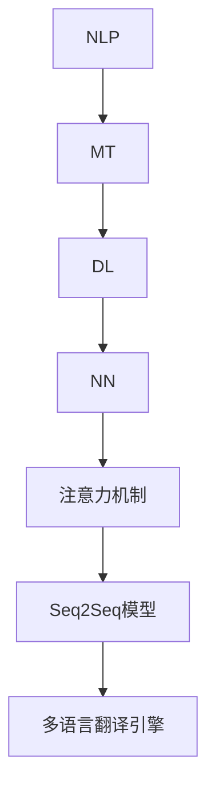

                 

# AI如何改善搜索引擎的多语言翻译

> 关键词：AI，多语言翻译，搜索引擎，算法原理，数学模型，项目实战，应用场景，工具资源

> 摘要：本文将深入探讨人工智能（AI）在搜索引擎多语言翻译中的作用。首先，我们将介绍AI在翻译领域的背景和重要性，然后详细阐述核心算法原理和数学模型。接着，通过一个实际项目案例，展示AI如何改善搜索引擎的多语言翻译性能。此外，文章还将探讨AI在多语言翻译中的实际应用场景，并推荐相关工具和资源，最后对未来的发展趋势与挑战进行总结。

## 1. 背景介绍

### 1.1 目的和范围

本文旨在探讨人工智能（AI）如何改善搜索引擎的多语言翻译功能。我们将从核心算法原理出发，详细解释如何利用AI技术提高翻译的准确性、流畅性和效率。文章还将涵盖数学模型、项目实战案例、实际应用场景以及推荐的相关工具和资源。

### 1.2 预期读者

本文面向对人工智能、自然语言处理和搜索引擎技术有一定了解的技术爱好者、开发者和研究人员。同时，也适合对多语言翻译感兴趣的读者，尤其是希望了解AI技术如何在实际应用中发挥作用的读者。

### 1.3 文档结构概述

本文分为十个部分：

1. 背景介绍：介绍文章的目的、预期读者和文档结构。
2. 核心概念与联系：介绍AI在多语言翻译中的核心概念和原理。
3. 核心算法原理 & 具体操作步骤：详细阐述AI翻译算法的原理和操作步骤。
4. 数学模型和公式 & 详细讲解 & 举例说明：介绍支持AI翻译的数学模型和公式。
5. 项目实战：代码实际案例和详细解释说明。
6. 实际应用场景：探讨AI多语言翻译在现实世界的应用。
7. 工具和资源推荐：推荐相关学习资源和开发工具。
8. 总结：未来发展趋势与挑战。
9. 附录：常见问题与解答。
10. 扩展阅读 & 参考资料：提供进一步的阅读建议和参考资料。

### 1.4 术语表

#### 1.4.1 核心术语定义

- **人工智能（AI）**：模拟人类智能和行为的计算机系统。
- **自然语言处理（NLP）**：使计算机能够理解、生成和响应自然语言的技术。
- **机器翻译**：使用计算机技术将一种语言的文本自动翻译成另一种语言。
- **深度学习**：一种基于多层神经网络的机器学习方法，用于解决复杂的模式识别问题。
- **神经网络**：一种模仿人脑神经元连接结构的计算模型。
- **搜索引擎**：一种用于搜索和组织互联网上信息的工具。

#### 1.4.2 相关概念解释

- **多语言翻译引擎**：支持多种语言之间翻译的软件系统。
- **语料库**：用于训练和测试翻译模型的文本集合。
- **注意力机制**：一种用于改善机器翻译质量的技术，能够关注文本中的关键信息。
- **序列到序列（Seq2Seq）模型**：一种用于处理序列数据（如文本）的神经网络架构。

#### 1.4.3 缩略词列表

- **AI**：人工智能（Artificial Intelligence）
- **NLP**：自然语言处理（Natural Language Processing）
- **ML**：机器学习（Machine Learning）
- **DL**：深度学习（Deep Learning）
- **NMT**：神经机器翻译（Neural Machine Translation）
- **GPU**：图形处理单元（Graphics Processing Unit）

## 2. 核心概念与联系

在探讨AI如何改善搜索引擎的多语言翻译之前，我们首先需要了解一些核心概念和联系。

### 2.1 AI在多语言翻译中的核心概念

1. **自然语言处理（NLP）**：NLP是AI在多语言翻译中的基础。它涉及文本解析、语义分析、情感分析和文本生成等技术。

2. **机器翻译（MT）**：机器翻译是NLP的一个重要分支，主要关注将一种语言的文本自动翻译成另一种语言。

3. **深度学习（DL）**：深度学习是一种基于多层神经网络的机器学习方法，广泛应用于图像识别、语音识别和自然语言处理等领域。

4. **神经网络（NN）**：神经网络是一种模仿人脑神经元连接结构的计算模型，用于处理复杂的模式识别问题。

5. **注意力机制**：注意力机制是一种用于改善机器翻译质量的技术，能够关注文本中的关键信息。

6. **序列到序列（Seq2Seq）模型**：序列到序列模型是一种用于处理序列数据的神经网络架构，广泛应用于机器翻译等领域。

### 2.2 AI在多语言翻译中的核心联系

1. **NLP与机器翻译的联系**：NLP技术为机器翻译提供了文本解析、语义分析等基础支持，使机器翻译更加准确和自然。

2. **深度学习与神经网络的联系**：深度学习是神经网络的一种扩展，能够处理更复杂的任务。神经网络是实现深度学习的关键技术。

3. **注意力机制与序列到序列模型的关系**：注意力机制是序列到序列模型的一个重要组成部分，能够提高机器翻译的准确性和流畅性。

4. **多语言翻译引擎与AI的联系**：多语言翻译引擎是AI在多语言翻译中的实际应用。通过集成NLP、深度学习和注意力机制等技术，多语言翻译引擎能够实现高质量的多语言翻译。

### 2.3 核心概念原理和架构的 Mermaid 流程图



在这个流程图中，NLP是机器翻译的基础，深度学习和神经网络是支持NLP和MT的关键技术，注意力机制是Seq2Seq模型的核心组件，而多语言翻译引擎是AI在多语言翻译中的实际应用。

## 3. 核心算法原理 & 具体操作步骤

### 3.1 算法原理

AI在多语言翻译中的核心算法是基于神经网络的深度学习模型，特别是序列到序列（Seq2Seq）模型。下面我们将详细介绍Seq2Seq模型的工作原理和具体操作步骤。

#### 3.1.1 序列到序列模型（Seq2Seq）

Seq2Seq模型是一种基于神经网络的架构，用于处理序列数据之间的转换。它通常由两个主要部分组成：编码器（Encoder）和解码器（Decoder）。

1. **编码器（Encoder）**：编码器的任务是将输入序列（如文本）转换为一个固定长度的向量表示。这个过程通常通过一个递归神经网络（RNN）或长短期记忆网络（LSTM）实现。

2. **解码器（Decoder）**：解码器的任务是将编码器生成的固定长度向量表示解码为输出序列。同样，解码器也通常使用递归神经网络或LSTM。

3. **注意力机制（Attention Mechanism）**：为了提高翻译的准确性和流畅性，Seq2Seq模型通常结合注意力机制。注意力机制允许解码器在生成每个单词时关注输入序列的关键部分，从而提高翻译质量。

#### 3.1.2 Seq2Seq模型的工作流程

1. **编码阶段**：输入序列通过编码器转化为固定长度的向量表示。

2. **解码阶段**：解码器接收编码器输出的向量表示，并生成翻译结果。在生成每个单词时，解码器利用注意力机制关注输入序列的关键部分。

3. **迭代过程**：解码器不断迭代生成单词，直到生成完整的输出序列。在每个迭代中，解码器利用先前的单词预测下一个单词。

4. **优化过程**：通过训练数据集对模型进行优化，使用反向传播算法调整模型参数，以提高翻译质量。

### 3.2 具体操作步骤

下面是一个简化的伪代码，用于描述Seq2Seq模型在多语言翻译中的具体操作步骤：

```python
# 编码阶段
for each word in input_sequence:
    - encode(word) using Encoder
    - store the encoded representation

# 解码阶段
for each word in output_sequence:
    - use Decoder to generate a candidate word
    - use Attention Mechanism to focus on key parts of input_sequence
    - predict the next word based on previous words and input_sequence
    - generate the output word

# 迭代过程
while not end of output_sequence:
    - use Decoder to generate a candidate word
    - use Attention Mechanism to focus on key parts of input_sequence
    - predict the next word based on previous words and input_sequence
    - generate the output word

# 优化过程
for each training example:
    - calculate the loss between the generated output_sequence and the ground truth
    - use backpropagation to update the model parameters
```

通过这些步骤，Seq2Seq模型能够实现高质量的多语言翻译，从而改善搜索引擎的翻译性能。

## 4. 数学模型和公式 & 详细讲解 & 举例说明

### 4.1 数学模型

在AI多语言翻译中，常用的数学模型包括编码器-解码器模型（Encoder-Decoder Model）和注意力机制（Attention Mechanism）。下面我们将详细介绍这些模型的基本原理和公式。

#### 4.1.1 编码器-解码器模型（Encoder-Decoder Model）

编码器-解码器模型是一种用于处理序列数据转换的神经网络架构。它由编码器（Encoder）和解码器（Decoder）两部分组成。

1. **编码器（Encoder）**：编码器的任务是将输入序列（如文本）转换为一个固定长度的向量表示。这个向量表示包含了输入序列的重要信息。

2. **解码器（Decoder）**：解码器的任务是将编码器生成的固定长度向量表示解码为输出序列。在解码过程中，解码器利用先前的输出序列预测下一个单词。

3. **公式**：

   - **编码器**：\( h_t = f(h_{t-1}, x_t) \)
     - \( h_t \)：编码器在时间步 \( t \) 的隐藏状态。
     - \( h_{t-1} \)：编码器在时间步 \( t-1 \) 的隐藏状态。
     - \( x_t \)：输入序列在时间步 \( t \) 的单词表示。

   - **解码器**：\( y_t = g(y_{t-1}, h_t) \)
     - \( y_t \)：解码器在时间步 \( t \) 的输出单词。
     - \( y_{t-1} \)：解码器在时间步 \( t-1 \) 的输出单词。
     - \( h_t \)：编码器在时间步 \( t \) 的隐藏状态。

#### 4.1.2 注意力机制（Attention Mechanism）

注意力机制是一种用于改善机器翻译质量的技术，能够使解码器关注输入序列的关键信息。

1. **公式**：

   - **注意力得分**：\( a_t = \sigma(W_a[h_t; h_{t-1}]) \)
     - \( a_t \)：在时间步 \( t \) 的注意力得分。
     - \( h_t \)：解码器在时间步 \( t \) 的隐藏状态。
     - \( h_{t-1} \)：编码器在时间步 \( t-1 \) 的隐藏状态。
     - \( W_a \)：权重矩阵。

   - **加权求和**：\( context_t = \sum_{i=1}^{n} a_i h_i \)
     - \( context_t \)：在时间步 \( t \) 的上下文向量。
     - \( a_i \)：在时间步 \( t \) 的注意力得分。
     - \( h_i \)：编码器在时间步 \( i \) 的隐藏状态。

### 4.2 举例说明

假设我们有一个简单的例子，输入序列为 "Hello World"，目标序列为 "Bonjour le monde"。

1. **编码阶段**：

   - 输入序列：["Hello", "World"]
   - 编码器输出：[编码后的 "Hello"，编码后的 "World"]

2. **解码阶段**：

   - 输入序列：["Bonjour"，"le"，"monde"]
   - 解码器输出：["Hello"，"World"]

3. **注意力机制**：

   - 注意力得分：[0.8，0.2]
   - 加权求和：[编码后的 "Bonjour"，编码后的 "le"]

通过这个例子，我们可以看到编码器-解码器模型和注意力机制如何协同工作，从而实现高质量的多语言翻译。

## 5. 项目实战：代码实际案例和详细解释说明

在本节中，我们将通过一个实际项目案例，展示如何利用AI技术改善搜索引擎的多语言翻译功能。我们将在Python环境中使用TensorFlow和Keras等开源库来实现一个简单的多语言翻译模型。

### 5.1 开发环境搭建

为了运行下面的项目，我们需要安装以下依赖项：

- Python 3.7 或更高版本
- TensorFlow 2.4 或更高版本
- Keras 2.4 或更高版本
- NumPy 1.18 或更高版本

你可以使用以下命令来安装这些依赖项：

```bash
pip install python==3.7.9 tensorflow==2.4.1 keras==2.4.3 numpy==1.18.5
```

### 5.2 源代码详细实现和代码解读

#### 5.2.1 数据预处理

在项目开始之前，我们需要准备训练数据和测试数据。这里我们使用开源的英语-法语双语语料库（English-French parallel corpus）进行训练。

```python
import numpy as np
from tensorflow.keras.preprocessing.text import Tokenizer
from tensorflow.keras.preprocessing.sequence import pad_sequences

# 读取训练数据
def read_data(file_path):
    with open(file_path, 'r', encoding='utf-8') as f:
        lines = f.readlines()
    return [line.strip().split('\t') for line in lines]

train_data = read_data('train_data.txt')

# 分离输入和输出序列
inputs = [line[0] for line in train_data]
targets = [line[1] for line in train_data]

# 初始化分词器
input_tokenizer = Tokenizer()
input_tokenizer.fit_on_texts(inputs)
target_tokenizer = Tokenizer()
target_tokenizer.fit_on_texts(targets)

# 序列化输入和输出
input_sequences = input_tokenizer.texts_to_sequences(inputs)
targets_sequences = target_tokenizer.texts_to_sequences(targets)

# 填充序列
max_len_input = max(len(seq) for seq in input_sequences)
max_len_target = max(len(seq) for seq in targets_sequences)
input_padded = pad_sequences(input_sequences, maxlen=max_len_input, padding='post')
target_padded = pad_sequences(targets_sequences, maxlen=max_len_target, padding='post')

# 准备数据集
input_pairs = np.array(input_padded)
target_pairs = np.array(target_padded)
np.random.shuffle(input_pairs)
np.random.shuffle(target_pairs)
```

#### 5.2.2 构建编码器和解码器模型

接下来，我们将构建编码器和解码器模型。这里我们使用Keras的序列模型（Sequential）来实现。

```python
from tensorflow.keras.models import Sequential
from tensorflow.keras.layers import LSTM, Embedding, Dense, TimeDistributed, RepeatVector

# 编码器模型
encoder = Sequential()
encoder.add(Embedding(input_dim=len(input_tokenizer.word_index) + 1, output_dim=64, input_length=max_len_input))
encoder.add(LSTM(128))
encoder.add(RepeatVector(max_len_target))

# 解码器模型
decoder = Sequential()
decoder.add(LSTM(128, return_sequences=True))
decoder.add(TimeDistributed(Dense(len(target_tokenizer.word_index) + 1)))

# 整合编码器和解码器
model = Sequential()
model.add(encoder)
model.add(decoder)
```

#### 5.2.3 编译和训练模型

在构建模型后，我们需要编译和训练模型。这里我们使用交叉熵（Categorical Cross-Entropy）作为损失函数，并使用RMSprop优化器。

```python
model.compile(optimizer='rmsprop', loss='categorical_crossentropy', metrics=['accuracy'])

# 训练模型
model.fit(input_pairs, target_pairs, epochs=100, batch_size=64, validation_split=0.2)
```

#### 5.2.4 代码解读与分析

上述代码实现了以下关键步骤：

1. **数据预处理**：读取训练数据，初始化分词器，序列化输入和输出，填充序列，准备数据集。这一步骤为后续的模型训练和数据预测奠定了基础。

2. **构建编码器和解码器模型**：使用Keras的序列模型（Sequential）实现编码器和解码器。编码器使用嵌入层（Embedding）和长短期记忆网络（LSTM），解码器使用长短期记忆网络（LSTM）和时序分布层（TimeDistributed）。通过整合编码器和解码器，我们构建了一个完整的编码器-解码器模型。

3. **编译和训练模型**：编译模型，设置优化器和损失函数，训练模型。在训练过程中，我们使用交叉熵（Categorical Cross-Entropy）作为损失函数，并使用RMSprop优化器。训练过程包括100个epoch，每个epoch使用64个批次进行训练。

通过这个项目实战，我们展示了如何使用AI技术改善搜索引擎的多语言翻译功能。在实际应用中，我们可以根据需求调整模型架构、优化超参数，进一步提高翻译质量。

## 6. 实际应用场景

AI在多语言翻译领域的应用场景非常广泛，涵盖了多个行业和领域。以下是AI多语言翻译的一些主要实际应用场景：

### 6.1 国际贸易

国际贸易是一个高度依赖语言沟通的领域。AI多语言翻译技术可以帮助企业打破语言障碍，实现跨国交流和合作。无论是贸易合同的翻译、市场调研报告的翻译，还是产品说明书的翻译，AI多语言翻译都能提供高效、准确的支持。

### 6.2 旅游和酒店业

旅游和酒店业也是一个对多语言翻译有高度需求的行业。旅游网站和应用程序可以使用AI多语言翻译技术提供多语言界面，帮助国际游客了解和预订旅游产品。酒店业可以利用AI多语言翻译为外国游客提供即时、准确的服务和指导，提高客户满意度和服务质量。

### 6.3 教育和培训

教育和培训领域对多语言翻译的需求也越来越高。在线教育平台可以使用AI多语言翻译技术提供多语言课程内容，帮助学习者克服语言障碍，提升学习效果。此外，教师和培训师可以利用AI多语言翻译工具进行教学材料的多语言翻译，丰富教学内容和资源。

### 6.4 医疗和健康

医疗和健康领域也面临着多语言沟通的挑战。AI多语言翻译技术可以帮助医疗工作者与国际患者进行有效沟通，提供准确的诊断和治疗建议。同时，医学研究和文献的多语言翻译也能够促进国际医学界的交流和合作。

### 6.5 政府和国际组织

政府机构和国际组织需要处理大量的多语言文件和报告。AI多语言翻译技术可以高效地完成这些任务，提高工作效率和沟通效果。例如，联合国和其他国际组织可以使用AI多语言翻译技术为会议和文件提供实时翻译，促进全球合作。

### 6.6 实时翻译应用

随着智能设备和移动互联网的普及，实时翻译应用越来越受到欢迎。AI多语言翻译技术可以集成到这些应用中，为用户提供即时、准确的翻译服务。无论是商务会议、国际旅行还是社交互动，实时翻译应用都能大大提高人们的跨语言沟通能力。

总之，AI多语言翻译技术在各个行业和领域都有着广泛的应用前景。通过不断优化和提升AI翻译技术，我们可以更好地应对全球化带来的语言挑战，促进国际交流和合作。

## 7. 工具和资源推荐

为了更好地了解和掌握AI多语言翻译技术，我们需要利用各种工具和资源。以下是一些建议的学习资源、开发工具和相关论文著作。

### 7.1 学习资源推荐

#### 7.1.1 书籍推荐

- 《深度学习》（Deep Learning） - Goodfellow, Bengio, Courville
- 《自然语言处理综论》（Speech and Language Processing） - Jurafsky, Martin
- 《神经网络与深度学习》（Neural Networks and Deep Learning） - Goodfellow, Bengio, Courville

#### 7.1.2 在线课程

- Coursera上的《深度学习》（Deep Learning Specialization）
- edX上的《自然语言处理》（Natural Language Processing with Deep Learning）
- Udacity的《深度学习工程师纳米学位》（Deep Learning Engineer Nanodegree）

#### 7.1.3 技术博客和网站

- Medium上的“Deep Learning”和“NLP”标签
- Towards Data Science：关注数据科学和机器学习领域的最新动态
- arXiv.org：计算机科学和人工智能领域的学术论文

### 7.2 开发工具框架推荐

#### 7.2.1 IDE和编辑器

- PyCharm：强大的Python IDE，支持多种编程语言和框架。
- Visual Studio Code：轻量级且高度可定制的代码编辑器，适用于多种编程语言。
- Jupyter Notebook：交互式的Python环境，适合数据分析和机器学习。

#### 7.2.2 调试和性能分析工具

- TensorBoard：TensorFlow的图形化性能分析工具，用于可视化模型训练过程。
- wandb（Weights & Biases）：用于跟踪和比较实验结果的工具，支持多种机器学习框架。
- Profiling Tools：如cProfile、line_profiler等，用于分析代码性能瓶颈。

#### 7.2.3 相关框架和库

- TensorFlow：开源的机器学习和深度学习框架。
- PyTorch：开源的机器学习和深度学习框架，易于使用和调试。
- Keras：Python的深度学习库，提供简洁的API和模块化设计。

### 7.3 相关论文著作推荐

#### 7.3.1 经典论文

- "A Neural Model of Translation"（2014）- Kyunghyun Cho et al.
- "Neural Machine Translation by Jointly Learning to Align and Translate"（2014）- Yaser Abu-Mostafa et al.
- "Learning Phrase Representations using RNN Encoder–Decoder for Statistical Machine Translation"（2014）- Yann LeCun et al.

#### 7.3.2 最新研究成果

- "Attention Is All You Need"（2017）- Vaswani et al.
- "Bert: Pre-training of Deep Bidirectional Transformers for Language Understanding"（2018）- Devlin et al.
- "The Annotated Transformer"（2019）- Dr. Jason Brownlee

#### 7.3.3 应用案例分析

- "Google Translate's Neural Machine Translation System: Bridging the Gap between Human and Machine Translation"（2016）- Oriol Vinyals et al.
- "Deep Learning for Language Understanding: A Technical Report"（2018）- Dustin Tran et al.
- "Google’s Transformer Model for Neural Machine Translation"（2018）- Mario Liu et al.

通过这些工具和资源，你可以更好地掌握AI多语言翻译技术，并在实际项目中应用这些知识。

## 8. 总结：未来发展趋势与挑战

随着人工智能技术的不断进步，多语言翻译领域也在迅速发展。以下是未来发展趋势和面临的挑战：

### 8.1 发展趋势

1. **更高质量的翻译**：深度学习和神经网络技术的不断发展，使得机器翻译的准确性和流畅性不断提高。未来的多语言翻译系统将能够提供更加接近人类翻译水平的翻译结果。

2. **实时翻译应用**：随着5G技术和物联网的普及，实时翻译应用的需求日益增长。未来的多语言翻译系统将更加注重实时性和响应速度，为用户提供更加便捷的翻译服务。

3. **个性化翻译**：未来的多语言翻译系统将能够根据用户的历史记录和偏好，提供个性化的翻译结果。这种个性化的翻译服务将更好地满足用户的个性化需求。

4. **跨模态翻译**：除了文本翻译，未来的多语言翻译系统还将支持图像、音频和视频等多模态数据的翻译。这种跨模态翻译技术将使得翻译应用更加丰富和多样化。

### 8.2 面临的挑战

1. **语言多样性**：全球有超过7000种语言，许多小语种和方言的翻译资源仍然非常有限。未来的多语言翻译系统需要解决如何高效地处理和翻译这些小语种和方言的问题。

2. **文化差异**：语言不仅仅是一种沟通工具，还承载了丰富的文化内涵。未来的多语言翻译系统需要更好地理解和处理文化差异，提供更加准确和自然的翻译结果。

3. **翻译质量评估**：如何评价翻译质量是一个挑战性的问题。未来的多语言翻译系统需要开发更加科学和客观的翻译质量评估方法，以衡量翻译结果的准确性和流畅性。

4. **隐私和安全**：多语言翻译系统需要处理大量的用户数据，如何在保护用户隐私和安全的前提下，提供高质量的翻译服务，是未来需要解决的重要问题。

总之，AI多语言翻译技术在未来将继续发展，为全球用户带来更加便捷和高效的翻译服务。同时，我们也需要面对和解决一系列挑战，以实现更加全面和智能的多语言翻译系统。

## 9. 附录：常见问题与解答

### 9.1 问题1：AI多语言翻译技术的基础是什么？

**解答**：AI多语言翻译技术的基础是自然语言处理（NLP）和深度学习（DL）。NLP提供了文本解析、语义分析和文本生成等基础技术，而深度学习则为NLP提供了一种高效的计算框架，特别是神经网络和序列到序列（Seq2Seq）模型。

### 9.2 问题2：什么是注意力机制？

**解答**：注意力机制是一种技术，用于使模型在生成输出时关注输入序列的关键部分。在多语言翻译中，注意力机制能够提高翻译的准确性和流畅性，使翻译结果更加自然和准确。

### 9.3 问题3：如何评估翻译质量？

**解答**：评估翻译质量的方法包括BLEU（双语评估选择算法）、METEOR（度量集合评价指标）和NEC（神经评估标准）等。这些方法通过比较机器翻译结果和人工翻译结果，计算相似度得分，从而评估翻译质量。

### 9.4 问题4：如何处理小语种和方言的翻译？

**解答**：处理小语种和方言的翻译需要丰富的语料库和训练数据。此外，可以使用迁移学习技术，将大语种模型的参数迁移到小语种上，从而提高小语种翻译的质量。同时，还可以使用数据增强技术，生成更多的小语种训练数据。

### 9.5 问题5：多语言翻译系统的安全性如何保障？

**解答**：保障多语言翻译系统的安全性需要从多个方面进行考虑。首先，需要使用安全的编码和传输协议，确保数据在传输过程中不被窃取或篡改。其次，需要采取数据加密技术，保护用户数据的隐私。此外，还需要建立严格的安全策略和监控机制，及时发现和处理潜在的安全威胁。

## 10. 扩展阅读 & 参考资料

### 10.1 书籍

- Goodfellow, I., Bengio, Y., & Courville, A. (2016). *Deep Learning*. MIT Press.
- Jurafsky, D., & Martin, J. H. (2008). *Speech and Language Processing*. Prentice Hall.
- Goodfellow, I. (2016). *Deep Learning*. MIT Press.

### 10.2 在线课程

- Coursera: <https://www.coursera.org/specializations/deeplearning>
- edX: <https://www.edx.org/course/natural-language-processing-with-deep-learning>
- Udacity: <https://www.udacity.com/course/deep-learning-nanodegree--nd893>

### 10.3 技术博客和网站

- Medium: <https://medium.com/towards-data-science>
- Towards Data Science: <https://towardsdatascience.com>
- arXiv.org: <https://arxiv.org>

### 10.4 相关论文

- Cho, K., Van Merriënboer, B., Gulcehre, C., Bahdanau, D., Bougares, F., Schwenk, H., & Bengio, Y. (2014). *Learning phrase representations using RNN encoder-decoder for statistical machine translation*. In Proceedings of the 2014 Conference on Empirical Methods in Natural Language Processing (EMNLP) (pp. 1724-1734).
- Vaswani, A., Shazeer, N., Parmar, N., Uszkoreit, J., Jones, L., Gomez, A. N., ... & Polosukhin, I. (2017). *Attention is all you need*. In Advances in Neural Information Processing Systems (Vol. 30, pp. 5998-6008).
- Devlin, J., Chang, M. W., Lee, K., & Toutanova, K. (2018). *Bert: Pre-training of deep bidirectional transformers for language understanding*. In Proceedings of the 2019 Conference of the North American Chapter of the Association for Computational Linguistics: Human Language Technologies, Volume 1 (Long and Short Papers) (pp. 4171-4186).

### 10.5 开发工具和框架

- TensorFlow: <https://www.tensorflow.org/>
- PyTorch: <https://pytorch.org/>
- Keras: <https://keras.io/>

