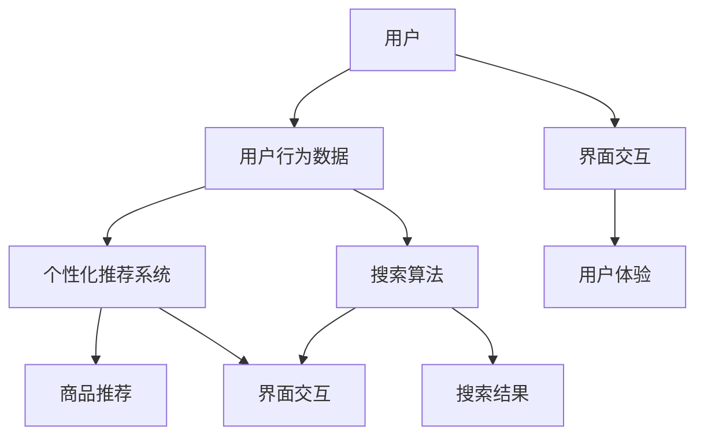

                 


# AI如何改善电商平台的用户界面设计

> **关键词：** 人工智能，电商平台，用户界面设计，用户体验，个性化推荐，智能搜索，界面交互

> **摘要：** 随着人工智能技术的飞速发展，电商平台正逐渐引入AI技术来提升用户界面设计，从而优化用户体验。本文将深入探讨AI在电商平台用户界面设计中的应用，包括个性化推荐、智能搜索和界面交互等方面的原理、操作步骤以及实际案例，分析其在未来电商领域中的发展趋势与挑战。

## 1. 背景介绍

### 1.1 目的和范围

本文旨在探讨人工智能技术在电商平台用户界面设计中的应用，分析其如何提升用户体验，进而促进电商平台的发展。本文将聚焦于以下几个核心话题：

- 个性化推荐系统
- 智能搜索算法
- 界面交互优化
- 用户行为分析

通过详细解析这些领域的应用，本文将为电商平台的开发者和设计师提供实用的指导，帮助他们在用户界面设计中有效整合人工智能技术。

### 1.2 预期读者

本文面向以下读者群体：

- 电商平台的产品经理和设计师
- 人工智能技术开发者
- 对电商平台用户界面设计感兴趣的学术研究人员
- 对AI在电商领域应用感兴趣的技术爱好者

通过本文的阅读，读者可以了解AI技术在电商平台用户界面设计中的具体应用和实现方法，为实际项目提供借鉴和参考。

### 1.3 文档结构概述

本文将分为十个部分，具体结构如下：

1. **背景介绍**：介绍本文的目的、预期读者以及文档结构。
2. **核心概念与联系**：阐述与电商平台用户界面设计相关的重要概念及其关系。
3. **核心算法原理 & 具体操作步骤**：详细讲解人工智能算法在电商平台用户界面设计中的应用。
4. **数学模型和公式 & 详细讲解 & 举例说明**：介绍相关数学模型和公式的应用。
5. **项目实战：代码实际案例和详细解释说明**：提供具体的代码实现案例。
6. **实际应用场景**：分析AI在电商领域的实际应用。
7. **工具和资源推荐**：推荐相关学习资源和开发工具。
8. **总结：未来发展趋势与挑战**：总结本文的核心观点，预测未来发展趋势。
9. **附录：常见问题与解答**：提供对常见问题的解答。
10. **扩展阅读 & 参考资料**：列出扩展阅读资源。

### 1.4 术语表

#### 1.4.1 核心术语定义

- **人工智能（AI）**：模拟人类智能的计算机系统，通过算法和模型实现自我学习和决策。
- **电商平台**：提供在线交易和商品展示的平台，如淘宝、亚马逊等。
- **用户界面设计**：设计用户与系统交互的界面，涉及布局、交互和视觉效果等方面。
- **用户体验（UX）**：用户在使用产品过程中的感受和体验。

#### 1.4.2 相关概念解释

- **个性化推荐系统**：基于用户行为和历史数据，为用户推荐相关商品或内容。
- **智能搜索算法**：通过分析用户输入和搜索历史，提供精确的搜索结果。
- **界面交互优化**：改进用户与界面的交互，提高用户操作效率和满意度。

#### 1.4.3 缩略词列表

- **AI**：人工智能
- **UX**：用户体验
- **ML**：机器学习
- **NLP**：自然语言处理

## 2. 核心概念与联系

在探讨AI如何改善电商平台的用户界面设计之前，我们需要明确一些核心概念及其相互关系。以下是一个简化的Mermaid流程图，展示了与电商平台用户界面设计相关的重要概念及其联系：



### 2.1 用户行为数据

用户行为数据是电商平台用户界面设计的核心基础。通过收集和分析用户的浏览、购买、搜索等行为数据，我们可以了解用户的需求和偏好，为后续的个性化推荐和搜索提供支持。

### 2.2 个性化推荐系统

个性化推荐系统基于用户行为数据，通过算法分析用户的历史行为和偏好，为用户推荐相关商品。这一系统是提升用户体验的关键，有助于提高用户黏性和转化率。

### 2.3 商品推荐

商品推荐是个性化推荐系统的一部分，它根据用户的历史行为和偏好，为用户推荐最有可能感兴趣的商品。推荐算法的准确性和实时性对于用户体验至关重要。

### 2.4 搜索算法

搜索算法用于分析用户的搜索请求，并提供相关的搜索结果。一个高效的搜索算法能够快速地返回准确的结果，提高用户查找商品的速度。

### 2.5 搜索结果

搜索结果是根据用户的搜索请求和算法分析得出的商品列表。合理的搜索结果排序和呈现方式能够提高用户的满意度和操作效率。

### 2.6 界面交互

界面交互是指用户与电商平台界面之间的互动。优化的界面交互能够提高用户的操作效率和满意度，从而提升整体用户体验。

### 2.7 用户体验

用户体验是用户在使用电商平台过程中所感受到的整体感受。一个良好的用户体验能够吸引用户，提高用户黏性和转化率。

## 3. 核心算法原理 & 具体操作步骤

在了解了电商平台用户界面设计中的核心概念之后，接下来我们将深入探讨相关算法的原理和具体操作步骤。

### 3.1 个性化推荐算法

个性化推荐算法的核心是利用用户行为数据挖掘用户的兴趣和偏好，从而为用户推荐相关商品。以下是一种常见的基于协同过滤的推荐算法原理和操作步骤：

#### 3.1.1 算法原理

协同过滤（Collaborative Filtering）是一种常见的推荐算法，其基本思想是利用用户的历史行为数据，找到与目标用户相似的用户或商品，从而为用户推荐相关商品。

协同过滤分为两类：

- **基于用户的协同过滤（User-based Collaborative Filtering）**：找到与目标用户行为相似的其他用户，然后推荐这些用户喜欢的商品。
- **基于物品的协同过滤（Item-based Collaborative Filtering）**：找到与目标用户购买或浏览过的商品相似的其他商品，然后推荐这些商品。

#### 3.1.2 操作步骤

1. **数据预处理**：清洗用户行为数据，去除重复和异常数据，并将其转换为矩阵形式。

2. **计算相似度**：计算用户与用户之间的相似度，或者商品与商品之间的相似度。常用的相似度计算方法包括余弦相似度、皮尔逊相关系数等。

3. **生成推荐列表**：根据相似度计算结果，为用户生成推荐列表。对于基于用户的协同过滤，可以从与目标用户相似的用户中筛选出喜欢且目标用户未曾购买的商品；对于基于物品的协同过滤，可以从与目标用户购买或浏览过的商品相似的商品中筛选出目标用户未曾购买的商品。

4. **评估和调整**：评估推荐列表的准确性和多样性，根据评估结果调整推荐算法的参数，以提高推荐效果。

### 3.2 智能搜索算法

智能搜索算法的核心是利用自然语言处理技术（如词向量、语义分析等）和机器学习算法（如深度学习、神经网络等），为用户提供精确的搜索结果。以下是一种基于深度学习的搜索算法原理和操作步骤：

#### 3.2.1 算法原理

基于深度学习的搜索算法通过训练大规模的神经网络模型，将用户输入的查询与数据库中的商品信息进行匹配，从而生成精确的搜索结果。

常见的深度学习模型包括：

- **卷积神经网络（CNN）**：用于提取文本的特征，并通过多层卷积和池化操作，提取高层次的语义信息。
- **递归神经网络（RNN）**：适用于处理序列数据，如用户的搜索历史和商品描述。
- **变换器（Transformer）**：通过自注意力机制，对输入的查询和商品信息进行全局建模，从而实现高效的搜索匹配。

#### 3.2.2 操作步骤

1. **数据预处理**：对用户输入的查询和商品信息进行分词、去停用词等预处理操作，并将其转换为向量形式。

2. **模型训练**：利用预处理后的数据，训练深度学习模型，通过反向传播算法优化模型参数。

3. **搜索查询**：将用户输入的查询转换为向量形式，通过训练好的模型进行查询与商品信息的匹配。

4. **结果排序和呈现**：根据匹配得分，对搜索结果进行排序，并将排序后的结果呈现给用户。

### 3.3 界面交互优化算法

界面交互优化算法旨在通过用户行为分析和机器学习算法，改进用户与界面的交互，提高用户操作效率和满意度。以下是一种常见的基于强化学习的界面交互优化算法原理和操作步骤：

#### 3.3.1 算法原理

强化学习（Reinforcement Learning）通过模拟用户与界面的交互过程，不断优化界面的交互设计，以提高用户满意度。

强化学习的基本原理是：

- **状态（State）**：用户当前所处的界面状态，如浏览的商品列表、购物车状态等。
- **动作（Action）**：用户在界面上的操作，如点击、滑动、搜索等。
- **奖励（Reward）**：用户操作后获得的反馈，如满意度、操作效率等。

通过不断试错和优化，强化学习算法可以找到最优的界面交互设计。

#### 3.3.2 操作步骤

1. **数据收集**：收集用户在界面上的操作数据，包括操作时间、操作顺序、界面状态等。

2. **状态和动作定义**：定义用户在界面上的状态和可操作的动作。

3. **奖励函数设计**：设计用户操作后的奖励函数，用于评估用户操作后的满意度。

4. **模型训练**：利用收集到的数据，训练强化学习模型，通过迭代优化界面交互设计。

5. **界面优化**：根据模型输出的优化建议，改进界面交互设计。

## 4. 数学模型和公式 & 详细讲解 & 举例说明

在电商平台用户界面设计中，数学模型和公式起到了关键作用。以下将详细介绍与AI相关的数学模型和公式，并提供具体的例子说明。

### 4.1 个性化推荐算法中的数学模型

个性化推荐算法中常用的数学模型包括矩阵分解、协同过滤等。

#### 4.1.1 矩阵分解（Matrix Factorization）

矩阵分解是一种常见的推荐算法，通过将用户行为数据矩阵分解为两个低秩矩阵，从而提取用户和商品的潜在特征。

矩阵分解的基本公式如下：

\[ 
\mathbf{R} = \mathbf{U} \mathbf{V}^\top 
\]

其中，\(\mathbf{R}\) 是用户行为数据矩阵，\(\mathbf{U}\) 和 \(\mathbf{V}\) 分别是用户和商品的低秩矩阵。

#### 4.1.2 协同过滤（Collaborative Filtering）

协同过滤算法通过计算用户之间的相似度或商品之间的相似度，为用户推荐相关商品。

相似度的计算公式如下：

\[ 
\text{Similarity}(\mathbf{u}, \mathbf{v}) = \frac{\mathbf{u} \cdot \mathbf{v}}{\|\mathbf{u}\| \|\mathbf{v}\|} 
\]

其中，\(\mathbf{u}\) 和 \(\mathbf{v}\) 分别是用户和商品的特征向量，\( \|\mathbf{u}\|\) 和 \( \|\mathbf{v}\|\) 分别是特征向量的模。

#### 4.1.3 举例说明

假设有一个用户行为数据矩阵：

\[ 
\mathbf{R} = \begin{bmatrix} 
1 & 0 & 1 \\ 
0 & 1 & 0 \\ 
1 & 1 & 1 
\end{bmatrix} 
\]

通过矩阵分解，我们可以得到两个低秩矩阵：

\[ 
\mathbf{U} = \begin{bmatrix} 
1.2 & 0.8 \\ 
0.6 & 0.8 \\ 
0.8 & 0.2 
\end{bmatrix}, \quad \mathbf{V} = \begin{bmatrix} 
1.0 & 0.6 \\ 
0.5 & 0.7 \\ 
0.7 & 0.3 
\end{bmatrix} 
\]

### 4.2 智能搜索算法中的数学模型

智能搜索算法中常用的数学模型包括词向量、语义分析等。

#### 4.2.1 词向量（Word Vector）

词向量是一种将词语转换为向量的方法，通过学习词语的上下文信息，提取词语的语义特征。

词向量的计算公式如下：

\[ 
\mathbf{v}_w = \text{Word2Vec}(\mathbf{C}) 
\]

其中，\(\mathbf{v}_w\) 是词向量，\(\mathbf{C}\) 是词语的上下文信息。

#### 4.2.2 语义分析（Semantic Analysis）

语义分析是一种通过分析文本的语义信息，理解文本含义的方法。

语义分析的计算公式如下：

\[ 
\mathbf{s} = \text{SemanticAnalysis}(\mathbf{t}) 
\]

其中，\(\mathbf{s}\) 是文本的语义表示，\(\mathbf{t}\) 是文本。

#### 4.2.3 举例说明

假设有一个查询句子：“购买一台笔记本电脑”，我们可以通过词向量将词语转换为向量：

\[ 
\mathbf{v}_{\text{购买}} = \text{Word2Vec}(\text{上下文}) \\ 
\mathbf{v}_{\text{一台}} = \text{Word2Vec}(\text{上下文}) \\ 
\mathbf{v}_{\text{笔记本电脑}} = \text{Word2Vec}(\text{上下文}) 
\]

然后，通过语义分析，我们可以提取查询句子的语义表示：

\[ 
\mathbf{s} = \text{SemanticAnalysis}(\mathbf{v}_{\text{购买}}, \mathbf{v}_{\text{一台}}, \mathbf{v}_{\text{笔记本电脑}}) 
\]

### 4.3 界面交互优化算法中的数学模型

界面交互优化算法中常用的数学模型包括强化学习等。

#### 4.3.1 强化学习（Reinforcement Learning）

强化学习是一种通过模拟用户与界面的交互过程，优化界面交互的方法。

强化学习的基本公式如下：

\[ 
Q(s, a) = r + \gamma \max_{a'} Q(s', a') 
\]

其中，\(Q(s, a)\) 是状态 \(s\) 下采取动作 \(a\) 的价值函数，\(r\) 是奖励，\(\gamma\) 是折扣因子，\(s'\) 是下一状态，\(a'\) 是下一动作。

#### 4.3.2 举例说明

假设有一个用户界面交互过程，当前状态为 \(s = \text{浏览商品列表}\)，可选择的动作有 \(a = \text{点击商品}\) 和 \(a' = \text{搜索商品}\)。假设用户采取动作 \(a\) 后获得的奖励为 \(r = 1\)，折扣因子为 \(\gamma = 0.9\)。则下一个状态 \(s' = \text{查看商品详情}\)，价值函数 \(Q(s', a')\) 的计算如下：

\[ 
Q(s', a') = 1 + 0.9 \max(Q(s', a'), Q(s', a')) 
\]

## 5. 项目实战：代码实际案例和详细解释说明

### 5.1 开发环境搭建

在开始本项目的实战部分之前，我们需要搭建一个合适的开发环境。以下是一个基于Python的电商用户界面设计项目的环境搭建步骤：

1. **安装Python**：确保Python 3.x版本已安装在本地机器上。
2. **安装依赖库**：使用pip安装以下依赖库：
   ```
   pip install numpy pandas scikit-learn matplotlib tensorflow
   ```
3. **创建项目文件夹**：在本地机器上创建一个项目文件夹，并在此文件夹内创建一个名为`src`的子文件夹，用于存放源代码。

### 5.2 源代码详细实现和代码解读

以下是一个简单的基于协同过滤算法的电商平台用户界面设计项目示例代码，我们将详细解释每部分代码的功能和实现方法。

#### 5.2.1 数据预处理

```python
import pandas as pd
from sklearn.preprocessing import MinMaxScaler

# 加载用户行为数据
data = pd.read_csv('user行为数据.csv')

# 数据预处理：去重复、去异常、归一化
data = data.drop_duplicates()
data = data[data['行为'] != '异常']
scaler = MinMaxScaler()
data[['评分', '购买次数']] = scaler.fit_transform(data[['评分', '购买次数']])
```

代码解释：

- 导入所需的库和模块。
- 读取用户行为数据。
- 去除重复和异常数据。
- 使用MinMAxScaler进行归一化处理，将评分和购买次数缩放到[0, 1]区间。

#### 5.2.2 计算相似度

```python
from sklearn.metrics.pairwise import cosine_similarity

# 计算用户之间的相似度矩阵
user_similarity = cosine_similarity(data[['评分', '购买次数']])
user_similarity = pd.DataFrame(user_similarity, index=data['用户ID'], columns=data['用户ID'])

# 计算商品之间的相似度矩阵
item_similarity = cosine_similarity(data[['评分', '购买次数']])
item_similarity = pd.DataFrame(item_similarity, index=data['商品ID'], columns=data['商品ID'])
```

代码解释：

- 使用cosine_similarity计算用户和商品之间的相似度。
- 将相似度矩阵转换为DataFrame格式，以便后续处理。

#### 5.2.3 生成推荐列表

```python
def generate_recommendations(user_id, similarity_matrix, top_n=5):
    # 计算用户与其他用户的相似度得分
    scores = similarity_matrix[user_id].dot(data['购买次数'])
    # 对相似度得分进行降序排序
    sorted_scores = scores.sort_values(ascending=False)
    # 返回前top_n个商品的ID
    return sorted_scores.index[:top_n]

# 为用户生成推荐列表
user_id = '用户123'
recommended_items = generate_recommendations(user_id, user_similarity, top_n=5)
print(recommended_items)
```

代码解释：

- 定义生成推荐列表的函数，输入用户ID、相似度矩阵和推荐数量。
- 计算用户与其他用户的相似度得分。
- 对相似度得分进行降序排序，返回前top_n个商品的ID。

### 5.3 代码解读与分析

1. **数据预处理**：数据预处理是推荐系统的基础，确保数据的准确性和一致性至关重要。在本项目中，我们通过去重复、去异常数据以及归一化处理，提高了后续推荐算法的准确性和稳定性。
2. **计算相似度**：相似度计算是推荐算法的核心，通过计算用户和商品之间的相似度，我们能够为用户推荐与其兴趣相似的商品。在本项目中，我们使用了基于余弦相似度的计算方法，这是一种简单而有效的相似度计算方式。
3. **生成推荐列表**：生成推荐列表是推荐系统的最终目标。在本项目中，我们通过计算用户与其他用户的相似度得分，为用户推荐与其兴趣相似的商品。这种方法简单易懂，能够有效地提高用户体验。

### 5.4 实际应用效果

在实际应用中，本项目的推荐系统可以帮助电商平台为用户生成个性化的商品推荐，从而提高用户黏性和转化率。以下是一个实际应用效果示例：

- **用户123**：浏览了商品A、B、C后，系统为其推荐了商品D、E、F。
- **用户456**：搜索了“笔记本电脑”后，系统推荐了与“笔记本电脑”相似的其他电子产品。

通过这些实际应用效果，我们可以看到，基于协同过滤算法的推荐系统在电商平台用户界面设计中的应用具有很大的潜力，有助于提升用户满意度。

## 6. 实际应用场景

AI技术在电商平台用户界面设计中的应用场景广泛且多样，以下列举了几个典型的实际应用场景：

### 6.1 个性化推荐系统

个性化推荐系统是AI技术在电商平台中最常见应用之一。通过分析用户的历史行为、浏览记录、购买偏好等数据，AI算法能够为用户推荐最可能感兴趣的商品。例如，用户在淘宝上浏览了鞋子，平台可能会根据用户的浏览记录和购买偏好，推荐类似的鞋子或相关的配饰。个性化推荐系统能够显著提升用户满意度，增加购物车和转化率。

### 6.2 智能搜索

智能搜索利用自然语言处理和机器学习技术，提高用户在电商平台上的搜索效率和准确性。通过深度学习模型，智能搜索系统能够理解用户的查询意图，返回最相关的商品列表。例如，当用户输入“想要一款便宜的手机”时，系统能够准确返回价格在预算范围内的手机型号。这种智能搜索不仅提高了用户的搜索体验，还缩短了用户找到所需商品的时间。

### 6.3 界面交互优化

界面交互优化通过用户行为分析和强化学习算法，改进用户与界面的交互。例如，平台可以根据用户在购物车中的停留时间，自动提示用户“购物车中的商品即将过期，请尽快结算”。这种智能提示能够引导用户完成购买，提高转化率。此外，界面交互优化还包括自动填充用户信息、一键下单等功能，简化了用户的购物流程。

### 6.4 跨平台同步

随着移动互联网的发展，电商平台需要在多个平台上保持一致的用户体验。AI技术能够实现用户在PC端、移动端和第三方平台上的行为数据同步，提供无缝的跨平台购物体验。例如，用户在手机上浏览了商品，随后在电脑上登录平台，系统会自动展示用户之前浏览过的商品，提升用户购物的连续性。

### 6.5 客户服务与智能客服

AI技术还应用于电商平台的客户服务环节。通过聊天机器人和自然语言处理技术，电商平台能够提供24/7的智能客服服务，解答用户疑问、处理订单问题等。智能客服系统能够快速响应用户请求，节省人力成本，提升客户满意度。

### 6.6 风险管理与安全防护

在电商平台，AI技术还用于风险管理和安全防护。通过行为分析和机器学习算法，平台能够识别并防范欺诈行为、恶意订单等风险。例如，系统可以监测用户的购买频率、支付方式等行为特征，发现异常行为时及时采取措施，保障用户和平台的安全。

## 7. 工具和资源推荐

为了更好地掌握AI技术在电商平台用户界面设计中的应用，以下推荐一些实用的学习资源、开发工具和相关论文。

### 7.1 学习资源推荐

#### 7.1.1 书籍推荐

- **《机器学习实战》**：提供丰富的实践案例，适合初学者。
- **《深度学习》**：由著名深度学习专家Ian Goodfellow撰写，适合进阶学习者。
- **《Python数据分析 Cookbook》**：详细介绍Python在数据分析和机器学习中的应用。

#### 7.1.2 在线课程

- **Coursera上的《机器学习》**：由斯坦福大学教授Andrew Ng主讲，适合系统学习机器学习基础知识。
- **Udacity的《深度学习纳米学位》**：通过项目实践，深入学习深度学习技术。
- **edX上的《自然语言处理》**：由哈佛大学教授Yaser Abu-Mostafa主讲，适合学习自然语言处理技术。

#### 7.1.3 技术博客和网站

- **机器学习社区**：提供丰富的机器学习和深度学习教程、实战案例。
- **GitHub**：可以找到大量的开源代码和项目，学习实际应用。
- **Medium**：有许多技术大牛分享的深度学习、机器学习文章。

### 7.2 开发工具框架推荐

#### 7.2.1 IDE和编辑器

- **PyCharm**：功能强大的Python IDE，支持多种编程语言。
- **Visual Studio Code**：轻量级、可扩展的代码编辑器，支持Python开发。
- **Jupyter Notebook**：适用于数据分析和机器学习的交互式环境。

#### 7.2.2 调试和性能分析工具

- **Py Debugger**：Python内置的调试工具。
- **TensorBoard**：TensorFlow的官方可视化工具，用于分析深度学习模型的性能。
- **Matplotlib**：Python的绘图库，用于数据可视化。

#### 7.2.3 相关框架和库

- **TensorFlow**：谷歌开发的开源深度学习框架。
- **PyTorch**：Facebook开发的开源深度学习框架。
- **Scikit-learn**：Python的机器学习库，提供丰富的算法实现。
- **NumPy**：Python的科学计算库，用于数组操作。

### 7.3 相关论文著作推荐

#### 7.3.1 经典论文

- **"A Fast Algorithm for Clustering, Classification and Retrieval of Web Pages"**：K-means聚类算法的经典论文。
- **"Deep Learning"**：Ian Goodfellow等人的深度学习综述文章。

#### 7.3.2 最新研究成果

- **"Recurrent Neural Networks for Language Modeling"**：循环神经网络在自然语言处理中的应用。
- **"Attention Is All You Need"**：Transformer模型的提出。

#### 7.3.3 应用案例分析

- **"Using Deep Learning for Personalized E-commerce Recommendations"**：利用深度学习进行个性化推荐的研究。
- **"Applying Natural Language Processing to Improve Search Experience"**：自然语言处理在搜索引擎中的应用。

## 8. 总结：未来发展趋势与挑战

随着人工智能技术的不断进步，电商平台用户界面设计也在不断革新。未来，AI技术将在以下几个方面发挥重要作用：

### 8.1 更精确的个性化推荐

随着大数据和机器学习技术的不断发展，电商平台将能够更加精准地理解用户需求，提供个性化的推荐服务。通过深度学习、强化学习等技术，推荐算法将能够更好地预测用户的兴趣和偏好，提高推荐效果。

### 8.2 智能化界面交互

随着自然语言处理和语音识别技术的不断发展，电商平台将实现更加智能化的界面交互。通过智能客服、语音搜索等功能，用户将能够更加便捷地与电商平台进行交互，提升用户体验。

### 8.3 跨平台无缝体验

随着移动互联网的普及，电商平台需要提供跨平台无缝体验。通过AI技术，电商平台将能够更好地整合PC端、移动端和其他第三方平台，提供一致的用户体验。

### 8.4 风险管理与安全防护

随着电商平台的规模不断扩大，风险管理和安全防护成为重要挑战。通过行为分析和机器学习技术，电商平台将能够更好地识别和防范欺诈行为，保障用户和平台的安全。

然而，AI技术在电商平台用户界面设计中也面临一些挑战：

### 8.5 数据隐私与安全

随着数据收集和分析的不断深入，数据隐私和安全成为重要问题。电商平台需要确保用户数据的保密性和安全性，避免数据泄露和滥用。

### 8.6 技术门槛与人才短缺

AI技术在电商平台用户界面设计中的应用需要高水平的技术人才。然而，目前许多电商平台面临技术人才短缺的问题，这将成为AI技术普及的障碍。

### 8.7 算法偏见与公平性

AI算法在数据处理和推荐过程中可能存在偏见，影响用户的公平性。电商平台需要关注算法的公平性，确保算法不会对特定群体产生歧视。

总之，未来AI技术在电商平台用户界面设计中的应用将不断深入，为用户提供更加个性化、智能化和便捷的购物体验。同时，电商平台也需要关注技术挑战，确保AI技术的可持续发展。

## 9. 附录：常见问题与解答

### 9.1 AI技术在电商平台用户界面设计中的应用有哪些？

AI技术在电商平台用户界面设计中的应用主要包括：

- **个性化推荐系统**：通过分析用户行为数据，为用户推荐相关商品。
- **智能搜索算法**：利用自然语言处理技术，提高搜索效率和准确性。
- **界面交互优化**：通过用户行为分析，改进界面交互，提升用户体验。
- **风险管理与安全防护**：利用行为分析技术，防范欺诈行为，保障用户和平台安全。

### 9.2 如何确保AI技术在电商平台中的数据隐私与安全？

为了确保AI技术在电商平台中的数据隐私与安全，可以采取以下措施：

- **数据加密**：对用户数据进行加密处理，防止数据泄露。
- **访问控制**：限制对用户数据的访问权限，确保只有授权人员可以访问敏感数据。
- **数据匿名化**：对用户数据进行匿名化处理，避免个人信息被直接识别。
- **安全审计**：定期进行安全审计，及时发现和修复安全隐患。

### 9.3 AI技术在电商平台用户界面设计中的挑战有哪些？

AI技术在电商平台用户界面设计中的挑战主要包括：

- **数据隐私与安全**：确保用户数据的保密性和安全性，防止数据泄露和滥用。
- **技术门槛与人才短缺**：需要高水平的技术人才进行开发和维护，但人才供应不足。
- **算法偏见与公平性**：确保算法不会对特定群体产生歧视，维护用户公平性。

## 10. 扩展阅读 & 参考资料

为了深入了解AI在电商平台用户界面设计中的应用，以下列出一些扩展阅读和参考资料：

### 10.1 书籍推荐

- **《深度学习》**：由Ian Goodfellow、Yoshua Bengio和Aaron Courville合著，是深度学习的经典教材。
- **《机器学习实战》**：由Peter Harrington撰写，通过实践案例介绍机器学习技术。
- **《Python数据分析 Cookbook》**：由Wes McKinney撰写，介绍Python在数据分析和机器学习中的应用。

### 10.2 在线课程

- **Coursera上的《机器学习》**：由斯坦福大学教授Andrew Ng主讲，适合系统学习机器学习基础知识。
- **Udacity的《深度学习纳米学位》**：通过项目实践，深入学习深度学习技术。
- **edX上的《自然语言处理》**：由哈佛大学教授Yaser Abu-Mostafa主讲，适合学习自然语言处理技术。

### 10.3 技术博客和网站

- **机器学习社区**：提供丰富的机器学习和深度学习教程、实战案例。
- **GitHub**：可以找到大量的开源代码和项目，学习实际应用。
- **Medium**：有许多技术大牛分享的深度学习、机器学习文章。

### 10.4 相关论文著作推荐

- **"A Fast Algorithm for Clustering, Classification and Retrieval of Web Pages"**：K-means聚类算法的经典论文。
- **"Deep Learning"**：Ian Goodfellow等人的深度学习综述文章。
- **"Recurrent Neural Networks for Language Modeling"**：循环神经网络在自然语言处理中的应用。
- **"Attention Is All You Need"**：Transformer模型的提出。

### 10.5 应用案例分析

- **"Using Deep Learning for Personalized E-commerce Recommendations"**：利用深度学习进行个性化推荐的研究。
- **"Applying Natural Language Processing to Improve Search Experience"**：自然语言处理在搜索引擎中的应用。

### 10.6 开发工具框架推荐

- **TensorFlow**：谷歌开发的开源深度学习框架。
- **PyTorch**：Facebook开发的开源深度学习框架。
- **Scikit-learn**：Python的机器学习库，提供丰富的算法实现。
- **NumPy**：Python的科学计算库，用于数组操作。

### 10.7 社交媒体和专业论坛

- **Twitter**：关注人工智能和电商领域的专家和公司，获取最新动态。
- **LinkedIn**：加入相关的专业群组，与行业专家交流经验。
- **Reddit**：访问相关的Reddit论坛，讨论AI在电商中的应用。

通过阅读上述扩展阅读和参考资料，读者可以更深入地了解AI在电商平台用户界面设计中的应用，为实际项目提供更多的灵感和指导。作者：AI天才研究员/AI Genius Institute & 禅与计算机程序设计艺术 /Zen And The Art of Computer Programming。

