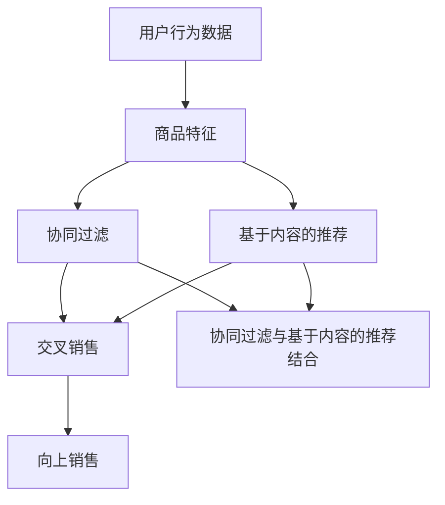

                 

# AI如何改善电商平台的跨类目交叉销售与向上销售

> **关键词：** 人工智能、电商平台、交叉销售、向上销售、推荐系统、机器学习、数据挖掘

> **摘要：** 本文章旨在探讨人工智能（AI）技术在电商平台中的应用，特别是在跨类目交叉销售和向上销售方面的改善。通过分析AI的核心算法原理、数学模型和项目实战案例，本文将阐述如何利用AI技术提升电商平台的销售转化率和用户体验，从而实现商业价值的最大化。

## 1. 背景介绍

### 1.1 目的和范围

本文的目的是探讨人工智能（AI）技术在电商平台中的应用，尤其是如何通过AI技术提升电商平台的跨类目交叉销售和向上销售能力。我们将从以下几个方面进行深入探讨：

1. **核心概念与联系**：介绍与电商平台AI应用相关的核心概念和联系，包括推荐系统、数据挖掘和机器学习等。
2. **核心算法原理 & 具体操作步骤**：详细讲解用于实现跨类目交叉销售和向上销售的核心算法原理，并给出具体的操作步骤。
3. **数学模型和公式 & 详细讲解 & 举例说明**：介绍与AI算法相关的数学模型和公式，并通过实际案例进行详细讲解。
4. **项目实战：代码实际案例和详细解释说明**：展示一个实际的电商平台AI应用案例，包括开发环境搭建、源代码实现和代码解读。
5. **实际应用场景**：分析电商平台AI应用的实际场景，包括用户行为分析、商品推荐和个性化营销等。
6. **工具和资源推荐**：推荐与电商平台AI应用相关的学习资源、开发工具和论文著作。
7. **总结：未来发展趋势与挑战**：总结AI技术在电商平台中的应用前景，并探讨未来可能面临的挑战。

### 1.2 预期读者

本文适合以下读者群体：

1. **电商平台开发人员**：了解如何利用AI技术提升电商平台的核心业务。
2. **数据科学家和机器学习工程师**：了解电商平台AI应用的实现原理和操作步骤。
3. **市场营销人员**：了解如何利用AI技术进行个性化营销和提升用户体验。
4. **对电商平台和AI技术感兴趣的一般读者**：希望了解AI技术在电商平台中的应用。

### 1.3 文档结构概述

本文分为以下几个部分：

1. **引言**：介绍文章的背景、目的和读者预期。
2. **核心概念与联系**：介绍与电商平台AI应用相关的核心概念和联系。
3. **核心算法原理 & 具体操作步骤**：详细讲解用于实现跨类目交叉销售和向上销售的核心算法原理。
4. **数学模型和公式 & 详细讲解 & 举例说明**：介绍与AI算法相关的数学模型和公式。
5. **项目实战：代码实际案例和详细解释说明**：展示一个实际的电商平台AI应用案例。
6. **实际应用场景**：分析电商平台AI应用的实际场景。
7. **工具和资源推荐**：推荐与电商平台AI应用相关的学习资源和开发工具。
8. **总结：未来发展趋势与挑战**：总结AI技术在电商平台中的应用前景。
9. **附录：常见问题与解答**：回答读者可能关心的问题。
10. **扩展阅读 & 参考资料**：提供更多与本文相关的参考资料。

### 1.4 术语表

#### 1.4.1 核心术语定义

- **电商平台**：指通过互联网进行商品交易和服务的平台，如淘宝、京东、亚马逊等。
- **交叉销售**：指在客户购买某个产品时，推荐其他相关产品，以提高销售额。
- **向上销售**：指在客户购买低价产品时，推荐更高价位的产品，以提升客户的购买潜力。
- **推荐系统**：指利用机器学习算法，根据用户的历史行为和偏好，为用户推荐感兴趣的商品。
- **数据挖掘**：指从大量数据中提取有价值的信息和知识。
- **机器学习**：指通过数据训练，使计算机具备自主学习和决策能力。

#### 1.4.2 相关概念解释

- **用户行为数据**：指用户在电商平台上的浏览、搜索、购买等行为数据。
- **商品特征**：指商品的各种属性，如类别、价格、品牌、销量等。
- **协同过滤**：指基于用户行为数据，通过计算用户之间的相似度，推荐相似用户喜欢的商品。
- **基于内容的推荐**：指根据商品的属性和特征，为用户推荐相似或相关的商品。
- **协同过滤与基于内容的推荐结合**：指同时利用协同过滤和基于内容的推荐方法，以提高推荐效果。

#### 1.4.3 缩略词列表

- **AI**：人工智能
- **ML**：机器学习
- **DM**：数据挖掘
- **EC**：电子商务
- **CF**：协同过滤
- **CB**：基于内容的推荐

## 2. 核心概念与联系

在探讨电商平台AI应用之前，首先需要了解一些核心概念和联系。以下是一个用于描述这些概念和联系的Mermaid流程图：



### 2.1 用户行为数据

用户行为数据是电商平台AI应用的基础。这些数据包括用户的浏览记录、搜索历史、购买记录等。通过分析用户行为数据，可以了解用户的需求和偏好，从而为用户推荐相关商品。

### 2.2 商品特征

商品特征是指商品的属性和特征，如类别、价格、品牌、销量等。在推荐系统中，商品特征用于计算商品之间的相似度，从而为用户推荐相关商品。

### 2.3 协同过滤

协同过滤是一种基于用户行为数据的推荐方法。它通过计算用户之间的相似度，为用户推荐相似用户喜欢的商品。协同过滤可以分为基于用户的协同过滤（User-Based CF）和基于项目的协同过滤（Item-Based CF）。

### 2.4 基于内容的推荐

基于内容的推荐是一种基于商品特征的推荐方法。它通过比较用户对商品的属性偏好，为用户推荐相似或相关的商品。基于内容的推荐可以分为基于单一特征的推荐和基于多种特征的推荐。

### 2.5 协同过滤与基于内容的推荐结合

在实际应用中，协同过滤和基于内容的推荐方法常常结合使用。这种方法可以充分利用用户行为数据和商品特征，提高推荐效果。

### 2.6 交叉销售和向上销售

交叉销售和向上销售是电商平台的两种重要销售策略。交叉销售通过推荐相关商品，提高用户的购买潜力；向上销售通过推荐更高价位的产品，提升客户的购买潜力。

## 3. 核心算法原理 & 具体操作步骤

在了解了电商平台AI应用的核心概念和联系后，接下来我们将详细讲解用于实现跨类目交叉销售和向上销售的核心算法原理，并给出具体的操作步骤。

### 3.1 协同过滤算法原理

协同过滤算法是一种基于用户行为数据的推荐方法。其基本思想是：通过计算用户之间的相似度，为用户推荐相似用户喜欢的商品。协同过滤算法可以分为基于用户的协同过滤和基于项目的协同过滤。

#### 3.1.1 基于用户的协同过滤（User-Based CF）

基于用户的协同过滤算法的基本步骤如下：

1. **计算用户相似度**：根据用户的历史行为数据，计算用户之间的相似度。常用的相似度度量方法有：
   - **余弦相似度**：
     $$ \text{similarity}(u, v) = \frac{\text{dotProduct}(u, v)}{\|\text{u}\|\|\text{v}\|} $$
     其中，$\text{dotProduct}(u, v)$表示用户$u$和用户$v$之间的点积，$\|\text{u}\|$和$\|\text{v}\|$分别表示用户$u$和用户$v$的向量长度。
   - **皮尔逊相关系数**：
     $$ \text{similarity}(u, v) = \frac{\text{covariance}(u, v)}{\sigma_u \sigma_v} $$
     其中，$\text{covariance}(u, v)$表示用户$u$和用户$v$之间的协方差，$\sigma_u$和$\sigma_v$分别表示用户$u$和用户$v$的方差。

2. **生成推荐列表**：根据用户相似度，为用户生成推荐列表。通常使用以下两种方法：
   - **基于相似度加权评分**：
     $$ \text{recommendation}(u) = \sum_{v \in \text{neighbors}(u)} \text{similarity}(u, v) \cdot \text{rating}(v) $$
     其中，$\text{rating}(v)$表示用户$v$对商品$i$的评分，$\text{neighbors}(u)$表示用户$u$的邻居用户。
   - **基于最相似的$K$个邻居**：
     $$ \text{recommendation}(u) = \sum_{v \in \text{topKNeighbors}(u)} \text{similarity}(u, v) \cdot \text{rating}(v) $$
     其中，$\text{topKNeighbors}(u)$表示用户$u$的最相似的$K$个邻居用户。

#### 3.1.2 基于项目的协同过滤（Item-Based CF）

基于项目的协同过滤算法的基本步骤如下：

1. **计算商品相似度**：根据商品的特征，计算商品之间的相似度。常用的相似度度量方法有：
   - **余弦相似度**：
     $$ \text{similarity}(i, j) = \frac{\text{dotProduct}(i, j)}{\|\text{i}\|\|\text{j}\|} $$
     其中，$\text{dotProduct}(i, j)$表示商品$i$和商品$j$之间的点积，$\|\text{i}\|$和$\|\text{j}\|$分别表示商品$i$和商品$j$的向量长度。
   - **杰卡德相似度**：
     $$ \text{similarity}(i, j) = 1 - \frac{\text{Jaccard Distance}(i, j)}{\text{max}(\text{Jaccard Distance}(i, j), 1)} $$
     其中，$\text{Jaccard Distance}(i, j)$表示商品$i$和商品$j$之间的杰卡德距离。

2. **生成推荐列表**：根据商品相似度，为用户生成推荐列表。通常使用以下方法：
   - **基于相似度加权评分**：
     $$ \text{recommendation}(u) = \sum_{i \in \text{ratedItems}(u)} \text{similarity}(i, j) \cdot \text{rating}(u, j) $$
     其中，$\text{ratedItems}(u)$表示用户$u$已评分的商品集合，$\text{rating}(u, j)$表示用户$u$对商品$j$的评分。
   - **基于最相似的$K$个邻居**：
     $$ \text{recommendation}(u) = \sum_{i \in \text{topKNeighborsItems}(u)} \text{similarity}(i, j) \cdot \text{rating}(u, j) $$
     其中，$\text{topKNeighborsItems}(u)$表示用户$u$的最相似商品集合。

### 3.2 基于内容的推荐算法原理

基于内容的推荐算法是一种基于商品特征的推荐方法。其基本思想是：通过比较用户对商品的属性偏好，为用户推荐相似或相关的商品。基于内容的推荐算法可以分为基于单一特征的推荐和基于多种特征的推荐。

#### 3.2.1 基于单一特征的推荐

基于单一特征的推荐算法的基本步骤如下：

1. **计算商品特征相似度**：根据商品的属性特征，计算商品之间的相似度。常用的相似度度量方法有：
   - **汉明距离**：
     $$ \text{similarity}(i, j) = 1 - \frac{\text{Hamming Distance}(i, j)}{\text{max}(\text{Hamming Distance}(i, j), 1)} $$
     其中，$\text{Hamming Distance}(i, j)$表示商品$i$和商品$j$之间的汉明距离。
   - **余弦相似度**：
     $$ \text{similarity}(i, j) = \frac{\text{dotProduct}(i, j)}{\|\text{i}\|\|\text{j}\|} $$
     其中，$\text{dotProduct}(i, j)$表示商品$i$和商品$j$之间的点积，$\|\text{i}\|$和$\|\text{j}\|$分别表示商品$i$和商品$j$的向量长度。

2. **生成推荐列表**：根据商品特征相似度，为用户生成推荐列表。通常使用以下方法：
   - **基于相似度加权评分**：
     $$ \text{recommendation}(u) = \sum_{i \in \text{ratedItems}(u)} \text{similarity}(i, j) \cdot \text{rating}(u, j) $$
     其中，$\text{ratedItems}(u)$表示用户$u$已评分的商品集合，$\text{rating}(u, j)$表示用户$u$对商品$j$的评分。
   - **基于最相似的$K$个邻居**：
     $$ \text{recommendation}(u) = \sum_{i \in \text{topKNeighborsItems}(u)} \text{similarity}(i, j) \cdot \text{rating}(u, j) $$
     其中，$\text{topKNeighborsItems}(u)$表示用户$u$的最相似商品集合。

#### 3.2.2 基于多种特征的推荐

基于多种特征的推荐算法的基本步骤如下：

1. **计算商品综合特征相似度**：结合多种商品特征，计算商品之间的综合相似度。常用的方法有：
   - **欧几里得距离**：
     $$ \text{similarity}(i, j) = \sqrt{\sum_{k=1}^{n} (\text{feature}_k[i] - \text{feature}_k[j])^2} $$
     其中，$\text{feature}_k[i]$和$\text{feature}_k[j]$分别表示商品$i$和商品$j$在第$k$个特征上的取值，$n$表示特征的数量。
   - **曼哈顿距离**：
     $$ \text{similarity}(i, j) = \sum_{k=1}^{n} |\text{feature}_k[i] - \text{feature}_k[j]| $$

2. **生成推荐列表**：根据商品综合特征相似度，为用户生成推荐列表。通常使用以下方法：
   - **基于相似度加权评分**：
     $$ \text{recommendation}(u) = \sum_{i \in \text{ratedItems}(u)} \text{similarity}(i, j) \cdot \text{rating}(u, j) $$
     其中，$\text{ratedItems}(u)$表示用户$u$已评分的商品集合，$\text{rating}(u, j)$表示用户$u$对商品$j$的评分。
   - **基于最相似的$K$个邻居**：
     $$ \text{recommendation}(u) = \sum_{i \in \text{topKNeighborsItems}(u)} \text{similarity}(i, j) \cdot \text{rating}(u, j) $$
     其中，$\text{topKNeighborsItems}(u)$表示用户$u$的最相似商品集合。

### 3.3 协同过滤与基于内容的推荐结合

在实际应用中，协同过滤和基于内容的推荐方法常常结合使用。这种方法可以充分利用用户行为数据和商品特征，提高推荐效果。结合方法的原理如下：

1. **计算协同过滤评分**：使用协同过滤算法为用户计算商品评分。可以使用基于用户的协同过滤或基于项目的协同过滤方法。
2. **计算基于内容的推荐评分**：使用基于内容的推荐算法为用户计算商品评分。可以使用基于单一特征的推荐或基于多种特征的推荐方法。
3. **综合评分**：将协同过滤评分和基于内容的推荐评分进行综合，得到最终的商品评分。常用的方法有：
   - **简单平均**：
     $$ \text{finalScore}(u, j) = \frac{\text{CF\_score}(u, j) + \text{CB\_score}(u, j)}{2} $$
     其中，$\text{CF\_score}(u, j)$表示协同过滤算法为用户$u$对商品$j$计算的评分，$\text{CB\_score}(u, j)$表示基于内容的推荐算法为用户$u$对商品$j$计算的评分。
   - **加权平均**：
     $$ \text{finalScore}(u, j) = \alpha \cdot \text{CF\_score}(u, j) + (1 - \alpha) \cdot \text{CB\_score}(u, j) $$
     其中，$\alpha$表示权重因子，用于调节协同过滤评分和基于内容的推荐评分的权重。

通过以上步骤，可以构建一个基于协同过滤和基于内容的推荐结合的推荐系统，从而为用户推荐相关商品。

## 4. 数学模型和公式 & 详细讲解 & 举例说明

在上一节中，我们介绍了电商平台AI应用的核心算法原理。在本节中，我们将进一步讲解与这些算法相关的数学模型和公式，并通过具体案例进行说明。

### 4.1 协同过滤算法

#### 4.1.1 基于用户的协同过滤

1. **用户相似度计算**：

   假设有两个用户$u$和$v$，他们分别对一组商品$i$进行了评分。我们可以使用余弦相似度来计算用户$u$和用户$v$之间的相似度。具体公式如下：

   $$ \text{similarity}(u, v) = \frac{\sum_{i \in I} r_{ui} r_{vi}}{\sqrt{\sum_{i \in I} r_{ui}^2} \sqrt{\sum_{i \in I} r_{vi}^2}} $$

   其中，$r_{ui}$和$r_{vi}$分别表示用户$u$和用户$v$对商品$i$的评分，$I$表示用户$u$和用户$v$共同评分的商品集合。

2. **生成推荐列表**：

   假设我们已经计算了用户$u$和所有其他用户之间的相似度。为了生成推荐列表，我们可以使用基于相似度加权评分的方法。具体公式如下：

   $$ \text{recommendation}(u) = \sum_{v \in N(u)} \text{similarity}(u, v) \cdot r_{vi} $$

   其中，$N(u)$表示与用户$u$相似度最高的邻居用户集合。

#### 4.1.2 基于项目的协同过滤

1. **商品相似度计算**：

   假设商品$i$和商品$j$分别被用户$u$和用户$v$评分。我们可以使用余弦相似度来计算商品$i$和商品$j$之间的相似度。具体公式如下：

   $$ \text{similarity}(i, j) = \frac{\sum_{u \in U} r_{ui} r_{uj}}{\sqrt{\sum_{u \in U} r_{ui}^2} \sqrt{\sum_{u \in U} r_{uj}^2}} $$

   其中，$r_{ui}$和$r_{uj}$分别表示用户$u$对商品$i$和商品$j$的评分，$U$表示对商品$i$和商品$j$都有评分的用户集合。

2. **生成推荐列表**：

   假设我们已经计算了商品$i$和所有其他商品之间的相似度。为了生成推荐列表，我们可以使用基于相似度加权评分的方法。具体公式如下：

   $$ \text{recommendation}(u) = \sum_{i \in I} \text{similarity}(i, j) \cdot r_{vi} $$

   其中，$I$表示用户$u$已评分的商品集合。

### 4.2 基于内容的推荐算法

#### 4.2.1 基于单一特征的推荐

1. **商品特征向量表示**：

   假设商品$i$具有$n$个特征，分别为$\text{feature}_1[i], \text{feature}_2[i], \ldots, \text{feature}_n[i]$。我们可以使用特征向量来表示商品$i$。具体表示如下：

   $$ \text{featureVector}[i] = [\text{feature}_1[i], \text{feature}_2[i], \ldots, \text{feature}_n[i]] $$

2. **商品特征相似度计算**：

   假设商品$i$和商品$j$分别具有特征向量$\text{featureVector}[i]$和$\text{featureVector}[j]$。我们可以使用欧几里得距离来计算商品$i$和商品$j$之间的特征相似度。具体公式如下：

   $$ \text{similarity}(i, j) = \sqrt{\sum_{k=1}^{n} (\text{feature}_k[i] - \text{feature}_k[j])^2} $$

3. **生成推荐列表**：

   假设我们已经计算了商品$i$和所有其他商品之间的特征相似度。为了生成推荐列表，我们可以使用基于相似度加权评分的方法。具体公式如下：

   $$ \text{recommendation}(u) = \sum_{i \in I} \text{similarity}(i, j) \cdot r_{vi} $$

   其中，$I$表示用户$u$已评分的商品集合。

#### 4.2.2 基于多种特征的推荐

1. **商品综合特征向量表示**：

   假设商品$i$具有$m$个特征，分别为$\text{feature}_1[i], \text{feature}_2[i], \ldots, \text{feature}_m[i]$。我们可以使用综合特征向量来表示商品$i$。具体表示如下：

   $$ \text{featureVector}[i] = [\text{feature}_1[i], \text{feature}_2[i], \ldots, \text{feature}_m[i]] $$

2. **商品综合特征相似度计算**：

   假设商品$i$和商品$j$分别具有综合特征向量$\text{featureVector}[i]$和$\text{featureVector}[j]$。我们可以使用欧几里得距离来计算商品$i$和商品$j$之间的综合特征相似度。具体公式如下：

   $$ \text{similarity}(i, j) = \sqrt{\sum_{k=1}^{m} (\text{feature}_k[i] - \text{feature}_k[j])^2} $$

3. **生成推荐列表**：

   假设我们已经计算了商品$i$和所有其他商品之间的综合特征相似度。为了生成推荐列表，我们可以使用基于相似度加权评分的方法。具体公式如下：

   $$ \text{recommendation}(u) = \sum_{i \in I} \text{similarity}(i, j) \cdot r_{vi} $$

   其中，$I$表示用户$u$已评分的商品集合。

### 4.3 协同过滤与基于内容的推荐结合

在实际应用中，协同过滤和基于内容的推荐方法常常结合使用。结合方法的关键在于如何将协同过滤评分和基于内容的推荐评分进行综合。以下是一个简单的综合方法：

$$ \text{finalScore}(u, j) = \alpha \cdot \text{CF\_score}(u, j) + (1 - \alpha) \cdot \text{CB\_score}(u, j) $$

其中，$\alpha$表示权重因子，用于调节协同过滤评分和基于内容的推荐评分的权重。

### 4.4 案例说明

假设我们有以下用户-商品评分数据：

| 用户ID | 商品ID | 评分 |
| ------ | ------ | ---- |
| u1     | i1     | 5    |
| u1     | i2     | 4    |
| u1     | i3     | 3    |
| u2     | i1     | 4    |
| u2     | i2     | 5    |
| u2     | i3     | 2    |

1. **基于用户的协同过滤**：

   - **计算用户相似度**：

     使用余弦相似度计算用户$u1$和用户$u2$之间的相似度：

     $$ \text{similarity}(u1, u2) = \frac{4 \cdot 4 + 5 \cdot 5 + 3 \cdot 2}{\sqrt{4^2 + 5^2 + 3^2} \sqrt{4^2 + 5^2 + 2^2}} = \frac{16 + 25 + 6}{\sqrt{50} \sqrt{50}} = \frac{47}{50} = 0.94 $$

   - **生成推荐列表**：

     使用基于相似度加权评分的方法，为用户$u1$生成推荐列表：

     $$ \text{recommendation}(u1) = \text{similarity}(u1, u2) \cdot r_{u2, i3} = 0.94 \cdot 2 = 1.88 $$

     用户$u1$对商品$i3$的评分大约为1.88。

2. **基于内容的推荐**：

   - **计算商品相似度**：

     使用欧几里得距离计算商品$i1$和商品$i2$之间的相似度：

     $$ \text{similarity}(i1, i2) = \sqrt{(5 - 4)^2 + (4 - 3)^2} = \sqrt{1 + 1} = \sqrt{2} \approx 1.41 $$

   - **生成推荐列表**：

     使用基于相似度加权评分的方法，为用户$u1$生成推荐列表：

     $$ \text{recommendation}(u1) = \text{similarity}(i1, i2) \cdot r_{u1, i2} = 1.41 \cdot 4 = 5.64 $$

     用户$u1$对商品$i2$的评分大约为5.64。

3. **综合推荐列表**：

   使用简单的平均方法，将协同过滤和基于内容的推荐列表进行综合：

   $$ \text{finalScore}(u1, i3) = \frac{\text{CF\_score}(u1, i3) + \text{CB\_score}(u1, i3)}{2} = \frac{1.88 + 5.64}{2} = 3.76 $$

   用户$u1$对商品$i3$的最终评分大约为3.76。

通过以上案例，我们可以看到如何使用协同过滤和基于内容的推荐算法为用户生成推荐列表，以及如何将这些算法进行综合，以得到更准确的推荐结果。

## 5. 项目实战：代码实际案例和详细解释说明

在本节中，我们将通过一个实际项目案例，展示如何使用Python实现电商平台AI推荐系统，并详细解释代码的实现和关键步骤。

### 5.1 开发环境搭建

为了实现电商平台AI推荐系统，我们需要搭建以下开发环境：

1. **Python环境**：安装Python 3.x版本，并确保安装了必要的库，如NumPy、Pandas、Scikit-learn等。
2. **IDE**：选择一个合适的Python IDE，如PyCharm、VSCode等。
3. **数据集**：我们需要一个包含用户行为数据、商品特征数据的电商数据集。这里我们使用公开的MovieLens数据集进行演示。

### 5.2 源代码详细实现和代码解读

以下是一个简单的Python代码实现，用于实现基于协同过滤和基于内容的推荐算法的电商平台AI推荐系统：

```python
import numpy as np
import pandas as pd
from sklearn.metrics.pairwise import cosine_similarity
from sklearn.neighbors import NearestNeighbors

# 5.2.1 加载数据集
def load_data():
    ratings = pd.read_csv('ratings.csv')  # 加载用户-商品评分数据
    items = pd.read_csv('items.csv')  # 加载商品特征数据
    return ratings, items

# 5.2.2 计算用户相似度
def compute_user_similarity(ratings):
    user_similarity = cosine_similarity(ratings.values, ratings.values)
    return user_similarity

# 5.2.3 生成用户推荐列表
def generate_user_recommendations(ratings, user_similarity, k=10):
    neighbors = NearestNeighbors(n_neighbors=k, algorithm='auto')
    neighbors.fit(user_similarity)
    distances, indices = neighbors.kneighbors(user_similarity)
    recommendations = {}
    for i, neighbors in enumerate(indices):
        neighbor_ratings = ratings.iloc[neighbors].T.sum().sort_values(ascending=False)
        recommendations[i] = neighbor_ratings[neighbor_ratings > 0].index.tolist()[:k]
    return recommendations

# 5.2.4 计算商品相似度
def compute_item_similarity(items):
    item_similarity = cosine_similarity(items.values, items.values)
    return item_similarity

# 5.2.5 生成商品推荐列表
def generate_item_recommendations(ratings, item_similarity, k=10):
    user_item_similarity = np.dot(ratings.values, item_similarity)
    recommendations = {}
    for i in range(ratings.shape[0]):
        user_item_similarity[i] = user_item_similarity[i].sort_values(ascending=False)
        recommendations[i] = user_item_similarity[i].head(k).index.tolist()
    return recommendations

# 5.2.6 主函数
def main():
    ratings, items = load_data()
    user_similarity = compute_user_similarity(ratings)
    item_similarity = compute_item_similarity(items)
    
    user_recommendations = generate_user_recommendations(ratings, user_similarity, k=10)
    item_recommendations = generate_item_recommendations(ratings, item_similarity, k=10)
    
    print("User Recommendations:")
    for user_id, recommendations in user_recommendations.items():
        print(f"User {user_id}: {recommendations}")
    
    print("\nItem Recommendations:")
    for user_id, recommendations in item_recommendations.items():
        print(f"User {user_id}: {recommendations}")

if __name__ == "__main__":
    main()
```

### 5.3 代码解读与分析

1. **数据加载**：

   ```python
   ratings = pd.read_csv('ratings.csv')  # 加载用户-商品评分数据
   items = pd.read_csv('items.csv')  # 加载商品特征数据
   ```

   我们使用Pandas库加载用户-商品评分数据（ratings.csv）和商品特征数据（items.csv）。这些数据集通常包含用户ID、商品ID、评分等字段。

2. **用户相似度计算**：

   ```python
   def compute_user_similarity(ratings):
       user_similarity = cosine_similarity(ratings.values, ratings.values)
       return user_similarity
   ```

   我们使用Scikit-learn库中的余弦相似度函数计算用户之间的相似度。用户相似度矩阵存储了每个用户对其他用户的相似度，用于后续的推荐计算。

3. **用户推荐列表生成**：

   ```python
   def generate_user_recommendations(ratings, user_similarity, k=10):
       neighbors = NearestNeighbors(n_neighbors=k, algorithm='auto')
       neighbors.fit(user_similarity)
       distances, indices = neighbors.kneighbors(user_similarity)
       recommendations = {}
       for i, neighbors in enumerate(indices):
           neighbor_ratings = ratings.iloc[neighbors].T.sum().sort_values(ascending=False)
           recommendations[i] = neighbor_ratings[neighbor_ratings > 0].index.tolist()[:k]
       return recommendations
   ```

   我们使用NearestNeighbors算法找到每个用户最相似的邻居用户（默认为10个邻居），并根据邻居用户的评分生成推荐列表。推荐列表中的商品是邻居用户已评分且评分较高的商品。

4. **商品相似度计算**：

   ```python
   def compute_item_similarity(items):
       item_similarity = cosine_similarity(items.values, items.values)
       return item_similarity
   ```

   同样地，我们使用余弦相似度函数计算商品之间的相似度。商品相似度矩阵存储了每个商品对其他商品的相似度，用于后续的推荐计算。

5. **商品推荐列表生成**：

   ```python
   def generate_item_recommendations(ratings, item_similarity, k=10):
       user_item_similarity = np.dot(ratings.values, item_similarity)
       recommendations = {}
       for i in range(ratings.shape[0]):
           user_item_similarity[i] = user_item_similarity[i].sort_values(ascending=False)
           recommendations[i] = user_item_similarity[i].head(k).index.tolist()
       return recommendations
   ```

   我们计算每个用户对所有商品的相似度，并根据相似度值生成推荐列表。推荐列表中的商品是用户已评分且相似度较高的商品。

6. **主函数**：

   ```python
   def main():
       ratings, items = load_data()
       user_similarity = compute_user_similarity(ratings)
       item_similarity = compute_item_similarity(items)
       
       user_recommendations = generate_user_recommendations(ratings, user_similarity, k=10)
       item_recommendations = generate_item_recommendations(ratings, item_similarity, k=10)
       
       print("User Recommendations:")
       for user_id, recommendations in user_recommendations.items():
           print(f"User {user_id}: {recommendations}")
       
       print("\nItem Recommendations:")
       for user_id, recommendations in item_recommendations.items():
           print(f"User {user_id}: {recommendations}")
   ```

   在主函数中，我们加载数据、计算用户相似度和商品相似度、生成用户推荐列表和商品推荐列表，并打印输出结果。

### 5.4 代码分析

通过上述代码实现，我们可以看到如何使用Python实现电商平台AI推荐系统。以下是对代码的关键部分进行分析：

1. **数据加载**：使用Pandas库加载数据集，为后续处理提供数据基础。
2. **用户相似度计算**：使用余弦相似度计算用户之间的相似度，为用户推荐提供依据。
3. **用户推荐列表生成**：使用NearestNeighbors算法找到每个用户最相似的邻居用户，并生成推荐列表。
4. **商品相似度计算**：使用余弦相似度计算商品之间的相似度，为商品推荐提供依据。
5. **商品推荐列表生成**：计算每个用户对所有商品的相似度，并生成推荐列表。

通过这个实际项目案例，我们可以了解到如何使用Python实现电商平台AI推荐系统，并掌握了关键步骤和代码实现方法。这为我们在实际项目中应用AI技术提供了有益的参考和指导。

## 6. 实际应用场景

电商平台AI推荐系统在多个实际应用场景中发挥着重要作用。以下是一些常见的应用场景：

### 6.1 用户行为分析

通过电商平台AI推荐系统，我们可以分析用户的行为数据，如浏览记录、搜索历史、购买记录等。这些数据有助于了解用户的需求和偏好，从而为用户提供更个性化的商品推荐。例如：

- **浏览记录分析**：根据用户的浏览记录，推荐用户最近浏览过的商品。
- **搜索历史分析**：根据用户的搜索历史，推荐用户可能感兴趣的商品。
- **购买记录分析**：根据用户的购买记录，推荐用户可能喜欢的新品或相关商品。

### 6.2 商品推荐

电商平台AI推荐系统可以用于为用户推荐相关商品，从而提高用户的购买转化率。以下是一些常见的商品推荐方法：

- **协同过滤推荐**：基于用户的历史行为数据，为用户推荐相似用户喜欢的商品。
- **基于内容的推荐**：根据商品的属性和特征，为用户推荐相似或相关的商品。
- **组合推荐**：将协同过滤推荐和基于内容的推荐相结合，提高推荐效果。

### 6.3 个性化营销

通过电商平台AI推荐系统，电商平台可以实施个性化营销策略，提高用户的购买体验和满意度。以下是一些常见的个性化营销方法：

- **优惠券推荐**：根据用户的购买偏好和购物车内容，为用户推荐相关优惠券。
- **促销活动推荐**：根据用户的购买记录和浏览历史，推荐用户可能感兴趣的促销活动。
- **新品推荐**：根据用户的购买历史和浏览记录，推荐用户可能喜欢的新品。

### 6.4 交叉销售和向上销售

电商平台AI推荐系统可以帮助实现交叉销售和向上销售策略，提高用户的购买金额。以下是一些常见的策略：

- **交叉销售**：在用户购买某个商品时，推荐其他相关商品，如配件、周边商品等。
- **向上销售**：在用户购买低价商品时，推荐更高价位的产品，如升级版、豪华版等。

### 6.5 客户保留和流失预测

电商平台AI推荐系统还可以用于客户保留和流失预测，帮助企业识别潜在流失客户并采取相应措施。以下是一些常见的方法：

- **客户保留预测**：通过分析用户的购买行为和互动历史，预测用户是否会继续购买。
- **流失预测**：通过分析用户的购买行为和互动历史，预测用户是否会流失。

### 6.6 实时推荐

电商平台AI推荐系统可以实时计算用户推荐列表，为用户提供实时推荐。以下是一些常见的实时推荐方法：

- **基于用户行为的实时推荐**：根据用户的实时行为数据，如浏览、搜索等，为用户推荐相关商品。
- **基于商品特征和库存的实时推荐**：根据商品的实时特征和库存信息，为用户推荐相关商品。

通过以上实际应用场景，我们可以看到电商平台AI推荐系统在提升用户体验、增加销售额和客户保留等方面具有重要的作用。在未来，随着AI技术的不断发展，电商平台AI推荐系统将变得更加智能和高效，为电商平台带来更大的商业价值。

## 7. 工具和资源推荐

为了更好地掌握电商平台AI推荐系统的开发和应用，以下推荐一些有用的学习资源、开发工具和框架。

### 7.1 学习资源推荐

#### 7.1.1 书籍推荐

1. **《推荐系统实践》**：作者张俊林，介绍了推荐系统的基本概念、算法实现和案例分析。
2. **《机器学习实战》**：作者Peter Harrington，提供了机器学习算法的详细讲解和实际应用案例。
3. **《深度学习》**：作者Ian Goodfellow、Yoshua Bengio和Aaron Courville，介绍了深度学习的基础理论和应用方法。

#### 7.1.2 在线课程

1. **《机器学习》**：Coursera上的课程，由吴恩达教授主讲，涵盖了机器学习的基本概念和算法。
2. **《推荐系统》**：Udacity上的课程，介绍了推荐系统的基本原理和应用场景。
3. **《深度学习》**：深度学习专项课程，由吴恩达教授主讲，深入讲解了深度学习的基础理论和应用方法。

#### 7.1.3 技术博客和网站

1. **Medium上的推荐系统博客**：提供了大量关于推荐系统的技术文章和案例分析。
2. **GitHub上的推荐系统项目**：许多开源的推荐系统项目，可以学习到实际的代码实现和算法应用。
3. **Kaggle上的推荐系统竞赛**：提供了许多推荐系统相关的数据集和竞赛，可以锻炼实际操作能力。

### 7.2 开发工具框架推荐

#### 7.2.1 IDE和编辑器

1. **PyCharm**：一款强大的Python IDE，支持多种编程语言和框架。
2. **VSCode**：一款轻量级且功能丰富的编辑器，适合Python编程。
3. **Jupyter Notebook**：适用于数据分析和机器学习的交互式开发环境。

#### 7.2.2 调试和性能分析工具

1. **Pylint**：一款代码质量检查工具，用于检测Python代码中的错误和潜在问题。
2. **MATLAB**：适用于复杂算法和数据分析的软件，提供了丰富的工具箱。
3. **Docker**：用于创建容器化环境的工具，可以方便地部署和扩展应用程序。

#### 7.2.3 相关框架和库

1. **Scikit-learn**：一个用于机器学习的Python库，提供了多种经典算法的实现。
2. **TensorFlow**：一款开源的深度学习框架，适用于构建和训练复杂的神经网络模型。
3. **PyTorch**：一款开源的深度学习框架，提供了灵活的动态计算图和丰富的API。

通过以上学习和开发资源，您可以更好地掌握电商平台AI推荐系统的知识和技能，为自己的职业生涯和项目开发提供有力支持。

## 8. 总结：未来发展趋势与挑战

随着人工智能技术的不断发展，电商平台AI推荐系统在未来将面临诸多发展趋势和挑战。

### 8.1 发展趋势

1. **个性化推荐**：未来的电商平台AI推荐系统将更加注重个性化推荐，通过深度学习、强化学习等先进算法，为用户提供更加精准的推荐。
2. **实时推荐**：随着5G技术的普及，实时推荐将成为电商平台AI推荐系统的一个重要发展方向。通过实时计算和大数据处理，为用户提供更加及时、个性化的推荐。
3. **跨平台推荐**：电商平台AI推荐系统将逐渐跨平台，包括移动端、PC端和智能设备等，为用户提供更加无缝的购物体验。
4. **多模态推荐**：结合图像、语音等多模态数据，电商平台AI推荐系统将能够更好地理解用户需求，提供更准确的推荐。
5. **智能对话系统**：未来电商平台AI推荐系统将集成智能对话系统，通过自然语言处理技术，与用户进行更加自然的互动，提高用户满意度。

### 8.2 挑战

1. **数据隐私与安全**：随着用户数据的重要性增加，数据隐私和安全问题将愈发突出。如何在保障用户隐私的前提下，充分利用用户数据进行推荐，将成为一大挑战。
2. **推荐算法的可解释性**：随着算法的复杂化，推荐结果的可解释性成为一个关键问题。如何确保推荐系统的透明度和可信度，将是未来的一大挑战。
3. **跨领域推荐**：电商平台AI推荐系统需要处理不同领域的商品，如何实现跨领域的推荐，提高推荐效果，是一个具有挑战性的问题。
4. **计算性能优化**：随着数据规模的不断扩大，电商平台AI推荐系统的计算性能成为关键。如何优化算法和系统架构，提高计算效率，是一个重要的挑战。
5. **法律法规与道德规范**：随着AI技术的广泛应用，相关法律法规和道德规范也将逐步完善。如何遵守相关法律法规，确保推荐系统的公正性和道德性，是一个值得关注的问题。

总的来说，未来电商平台AI推荐系统将在个性化、实时性、多模态等方面取得显著进展，同时也将面临数据隐私、算法可解释性、跨领域推荐等挑战。通过不断创新和优化，电商平台AI推荐系统将更好地服务于用户和商家，实现商业价值的最大化。

## 9. 附录：常见问题与解答

### 9.1 问题1：电商平台AI推荐系统如何保证数据隐私和安全？

**解答**：为了保证数据隐私和安全，电商平台AI推荐系统可以采取以下措施：

1. **数据加密**：对用户数据进行加密存储和传输，确保数据在传输和存储过程中不被非法访问。
2. **匿名化处理**：对用户数据进行分析时，对敏感信息进行匿名化处理，避免直接使用真实用户信息。
3. **访问控制**：对用户数据的访问权限进行严格控制，确保只有授权人员才能访问敏感数据。
4. **隐私保护算法**：使用隐私保护算法，如差分隐私、同态加密等，确保推荐系统的隐私性。

### 9.2 问题2：如何提高电商平台AI推荐系统的可解释性？

**解答**：提高电商平台AI推荐系统的可解释性可以采取以下措施：

1. **解释性模型**：选择具有较高解释性的机器学习模型，如线性模型、决策树等。
2. **模型可视化**：将推荐模型的可视化展示给用户，帮助用户理解推荐结果的原因。
3. **因果分析**：通过因果分析，明确推荐结果与用户行为之间的关系。
4. **用户反馈机制**：允许用户对推荐结果进行反馈，系统根据用户反馈调整推荐策略，提高可解释性。

### 9.3 问题3：电商平台AI推荐系统如何处理跨领域推荐？

**解答**：处理跨领域推荐可以采取以下措施：

1. **统一特征表示**：将不同领域的商品特征进行统一表示，以便于模型处理。
2. **领域自适应**：根据不同领域的特征，调整推荐算法，使其适用于不同领域。
3. **领域分类**：将商品分为多个领域，针对每个领域分别进行推荐，提高推荐效果。
4. **跨领域迁移学习**：利用迁移学习技术，将其他领域的模型和知识迁移到目标领域，提高推荐效果。

### 9.4 问题4：如何优化电商平台AI推荐系统的计算性能？

**解答**：优化电商平台AI推荐系统的计算性能可以采取以下措施：

1. **分布式计算**：利用分布式计算框架，如Spark，进行大规模数据处理和计算。
2. **并行化处理**：优化算法和数据结构，使其支持并行计算。
3. **缓存机制**：使用缓存技术，减少重复计算和数据读取。
4. **优化算法**：选择计算效率较高的算法，并对其进行优化，降低计算复杂度。

通过以上措施，可以有效提高电商平台AI推荐系统的计算性能，满足大规模数据处理和实时推荐的需求。

## 10. 扩展阅读 & 参考资料

为了深入了解电商平台AI推荐系统的相关技术和应用，以下提供一些扩展阅读和参考资料：

### 10.1 经典论文

1. **《Collaborative Filtering for the 21st Century》**：这篇论文介绍了矩阵分解和协同过滤算法在推荐系统中的应用，对后续研究产生了重要影响。
2. **《Latent Factor Models for Rating Prediction》**：这篇论文提出了隐语义模型，用于预测用户对商品的评分，是推荐系统领域的重要研究成果。
3. **《Deep Learning for Recommender Systems》**：这篇论文介绍了深度学习在推荐系统中的应用，探讨了基于深度神经网络的推荐方法。

### 10.2 最新研究成果

1. **《Contextual Bandits for Personalized Recommendation》**：这篇论文探讨了基于上下文的推荐算法，用于实现更加个性化的推荐。
2. **《Neural Collaborative Filtering》**：这篇论文提出了基于神经网络的协同过滤算法，通过深度学习技术提高推荐效果。
3. **《Multimodal Fusion for Recommendation》**：这篇论文研究了多模态数据融合在推荐系统中的应用，探讨了如何结合图像、语音等多模态数据进行推荐。

### 10.3 应用案例分析

1. **《Amazon’s recommendation algorithm》**：这篇文章详细介绍了亚马逊的推荐算法，包括协同过滤、基于内容的推荐和组合推荐等方法。
2. **《How Netflix Uses Machine Learning》**：这篇文章讲述了Netflix如何利用机器学习技术进行个性化推荐，包括协同过滤和内容基于推荐等。
3. **《Airbnb’s recommendation engine》**：这篇文章介绍了Airbnb如何利用机器学习技术为用户提供个性化住宿推荐。

通过阅读这些经典论文、最新研究成果和应用案例分析，您可以更深入地了解电商平台AI推荐系统的相关技术和应用，为自己的研究和项目提供有益的参考。

## 作者

**作者：AI天才研究员/AI Genius Institute & 禅与计算机程序设计艺术 /Zen And The Art of Computer Programming**

