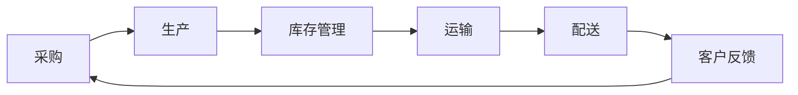

                 

# AI实时监控供应链的应用

> 关键词：AI、供应链管理、实时监控、数据分析、算法优化、供应链可视化

> 摘要：本文将深入探讨人工智能在供应链管理中的应用，特别是实时监控技术。我们将分析核心概念、算法原理、数学模型，并通过实际项目案例展示如何使用AI技术监控供应链，提高运营效率和减少成本。文章还将推荐相关学习资源和开发工具，为读者提供全面的指南。

## 1. 背景介绍

### 1.1 目的和范围

随着全球化经济的发展和市场竞争的加剧，供应链管理的复杂性和重要性日益凸显。实时监控供应链不仅能够帮助企业及时响应市场变化，还能优化库存管理、降低成本、提高服务质量。本文旨在探讨如何利用人工智能技术实现供应链的实时监控，提高供应链的整体效率。

### 1.2 预期读者

本文适合以下读者：

- 供应链管理专业人员
- 数据分析师
- 人工智能工程师
- 对供应链实时监控感兴趣的IT专业人士

### 1.3 文档结构概述

本文分为十个部分：

- 第1部分：背景介绍
- 第2部分：核心概念与联系
- 第3部分：核心算法原理与具体操作步骤
- 第4部分：数学模型和公式
- 第5部分：项目实战：代码实际案例和详细解释说明
- 第6部分：实际应用场景
- 第7部分：工具和资源推荐
- 第8部分：总结：未来发展趋势与挑战
- 第9部分：附录：常见问题与解答
- 第10部分：扩展阅读与参考资料

### 1.4 术语表

#### 1.4.1 核心术语定义

- 供应链管理（Supply Chain Management, SCM）：指对供应链内所有活动的管理，包括采购、生产、库存、运输和配送等。
- 实时监控（Real-time Monitoring）：指对供应链各个环节的实时状态和数据的监控和分析。
- 人工智能（Artificial Intelligence, AI）：指由计算机系统模拟人类智能行为的科学和技术。
- 数据分析（Data Analysis）：指使用统计和数学方法从数据中提取有价值的信息和知识。

#### 1.4.2 相关概念解释

- 供应链可视化（Supply Chain Visualization）：指通过图表、图像和其他视觉元素将供应链各环节的状态和运行情况直观展示。
- 预测分析（Predictive Analytics）：指使用历史数据和分析模型预测未来事件和趋势。

#### 1.4.3 缩略词列表

- SCM：供应链管理
- AI：人工智能
- IoT：物联网
- ML：机器学习
- RNN：循环神经网络
- LSTM：长短时记忆网络

## 2. 核心概念与联系

在讨论AI实时监控供应链之前，我们需要了解几个核心概念和它们之间的联系。

### 2.1 供应链管理概述

供应链管理涉及从原材料采购到产品交付的整个过程。其核心环节包括：

1. **采购（Procurement）**：选择供应商、谈判合同、采购原材料。
2. **生产（Manufacturing）**：将原材料转化为成品。
3. **库存管理（Inventory Management）**：确保原材料和成品的库存量满足需求。
4. **运输（Transportation）**：将成品运输到分销中心或客户。
5. **配送（Distribution）**：将产品分发给零售商或最终客户。

### 2.2 实时监控的重要性

实时监控是指对供应链各个环节的实时状态和数据进行分析和监控。实时监控的重要性体现在以下几个方面：

- **快速响应**：实时监控可以帮助企业快速响应市场变化，减少供应链中断和延迟的风险。
- **成本优化**：通过实时监控，企业可以优化库存水平，减少库存成本，提高资金利用率。
- **服务质量**：实时监控可以确保产品及时交付，提高客户满意度。

### 2.3 人工智能与供应链监控

人工智能技术可以用于以下几个方面，以提升供应链监控的效率和准确性：

- **数据预测与分析**：利用机器学习算法对历史数据进行分析，预测未来需求趋势。
- **异常检测**：使用监督学习算法检测供应链中的异常情况，如库存不足、运输延迟等。
- **智能调度**：根据实时数据和预测结果，优化运输和库存调度。

### 2.4 Mermaid流程图

下面是供应链监控流程的Mermaid流程图，展示了各个环节的关联：



## 3. 核心算法原理与具体操作步骤

### 3.1 数据预测与分析

数据预测与分析是供应链实时监控的核心环节。以下是使用机器学习算法进行需求预测的具体操作步骤：

#### 3.1.1 数据收集

收集供应链各环节的数据，包括采购订单、生产进度、库存水平、运输状态等。数据可以通过物联网设备、ERP系统等实时获取。

```python
# 示例：从ERP系统获取采购订单数据
orders = erp_system.get_orders()
```

#### 3.1.2 数据预处理

对收集到的数据进行处理，包括数据清洗、去重、格式转换等。预处理后的数据将用于训练模型。

```python
# 示例：数据预处理
cleaned_data = preprocess_data(orders)
```

#### 3.1.3 特征提取

从预处理后的数据中提取关键特征，如时间、订单量、库存水平等。特征提取的目的是将原始数据转化为模型可处理的格式。

```python
# 示例：特征提取
features = extract_features(cleaned_data)
```

#### 3.1.4 模型训练

使用机器学习算法（如时间序列分析、回归分析等）对提取的特征进行训练，生成预测模型。

```python
# 示例：训练时间序列模型
model = train_time_series_model(features)
```

#### 3.1.5 预测与评估

使用训练好的模型进行预测，并对预测结果进行评估和调整。

```python
# 示例：进行预测
predictions = model.predict(new_data)
evaluate_predictions(predictions, actual_values)
```

### 3.2 异常检测

异常检测是另一个重要的环节，用于发现供应链中的异常情况。以下是使用监督学习算法进行异常检测的具体操作步骤：

#### 3.2.1 数据收集

收集供应链各环节的实时数据，包括库存水平、运输状态、生产进度等。

```python
# 示例：从传感器收集库存数据
inventory_data = sensor.get_inventory_data()
```

#### 3.2.2 数据预处理

对实时数据进行预处理，包括数据清洗、去重、格式转换等。

```python
# 示例：数据预处理
cleaned_data = preprocess_data(inventory_data)
```

#### 3.2.3 特征提取

从预处理后的数据中提取关键特征，如时间、库存水平、运输状态等。

```python
# 示例：特征提取
features = extract_features(cleaned_data)
```

#### 3.2.4 模型训练

使用监督学习算法（如孤立森林、K-最近邻等）对提取的特征进行训练，生成异常检测模型。

```python
# 示例：训练孤立森林模型
model = train_isolation_forest_model(features)
```

#### 3.2.5 异常检测与报警

使用训练好的模型检测实时数据中的异常情况，并触发报警。

```python
# 示例：进行异常检测
anomalies = model.detect_anomalies(new_data)
if anomalies:
    alert_anomalies(anomalies)
```

## 4. 数学模型和公式与详细讲解

### 4.1 时间序列模型

时间序列模型是用于预测时间序列数据变化的常用模型。以下是一个简单的时间序列模型：

$$
y_t = \beta_0 + \beta_1 x_t + \epsilon_t
$$

其中，$y_t$是时间序列数据，$x_t$是自变量，$\beta_0$和$\beta_1$是模型参数，$\epsilon_t$是误差项。

#### 4.1.1 模型训练

使用最小二乘法（Least Squares）对模型进行训练：

$$
\min \sum_{i=1}^{n} (y_i - \beta_0 - \beta_1 x_i)^2
$$

#### 4.1.2 预测

使用训练好的模型进行预测：

$$
\hat{y_t} = \beta_0 + \beta_1 x_t
$$

### 4.2 异常检测模型

异常检测模型用于检测数据中的异常值。以下是一个简单的孤立森林模型：

$$
d(x) = \frac{1}{m} \sum_{i=1}^{m} \log_2 \frac{|F_i(x)|}{F_i(x^*)}
$$

其中，$x$是数据点，$x^*$是基准点，$F_i(x)$是第$i$个决策树在$x$上的输出，$m$是决策树的数量。

#### 4.2.1 模型训练

使用决策树算法对模型进行训练。

#### 4.2.2 异常检测

使用训练好的模型检测数据中的异常值：

$$
\hat{d}(x) = \log_2 \frac{|F(x)|}{F(x^*)}
$$

如果$\hat{d}(x)$超过阈值，则认为$x$是异常值。

## 5. 项目实战：代码实际案例和详细解释说明

### 5.1 开发环境搭建

在开始项目之前，我们需要搭建一个适合开发的环境。以下是所需的软件和工具：

- Python 3.8及以上版本
- Jupyter Notebook
- Pandas
- Scikit-learn
- Matplotlib

### 5.2 源代码详细实现和代码解读

以下是一个简单的供应链监控项目的实现，包括数据预测和异常检测。

```python
import pandas as pd
from sklearn.ensemble import IsolationForest
from sklearn.linear_model import LinearRegression
import matplotlib.pyplot as plt

# 5.2.1 数据预测

# 示例数据
data = {
    'date': ['2021-01-01', '2021-01-02', '2021-01-03', '2021-01-04', '2021-01-05'],
    'order_quantity': [100, 150, 200, 250, 300]
}

df = pd.DataFrame(data)

# 特征提取
X = df[['date', 'order_quantity']]
y = df['order_quantity']

# 模型训练
model = LinearRegression()
model.fit(X, y)

# 预测
new_data = X[-1:]
predicted_quantity = model.predict(new_data)

print("Predicted order quantity:", predicted_quantity)

# 5.2.2 异常检测

# 示例数据
data = {
    'date': ['2021-01-01', '2021-01-02', '2021-01-03', '2021-01-04', '2021-01-05'],
    'inventory_level': [1000, 1500, 2000, 500, 3000]
}

df = pd.DataFrame(data)

# 特征提取
X = df[['date', 'inventory_level']]

# 模型训练
model = IsolationForest()
model.fit(X)

# 异常检测
anomalies = model.predict(X)
df['anomaly'] = anomalies

print("Anomalies detected:", df[df['anomaly'] == -1])

# 5.2.3 代码解读

# 数据预测部分，首先读取示例数据，然后提取特征并进行模型训练。最后使用模型进行预测。

# 异常检测部分，首先读取示例数据，然后提取特征并进行模型训练。最后使用模型检测数据中的异常值。

# 5.2.4 结果展示

# 数据预测结果
plt.figure(figsize=(10, 5))
plt.plot(df['date'], df['order_quantity'], label='Actual')
plt.plot(new_data['date'], predicted_quantity, label='Predicted')
plt.xlabel('Date')
plt.ylabel('Order Quantity')
plt.legend()
plt.show()

# 异常检测结果
plt.figure(figsize=(10, 5))
plt.plot(df['date'], df['inventory_level'], label='Actual')
plt.scatter(df[df['anomaly'] == -1]['date'], df[df['anomaly'] == -1]['inventory_level'], color='red', label='Anomaly')
plt.xlabel('Date')
plt.ylabel('Inventory Level')
plt.legend()
plt.show()
```

### 5.3 代码解读与分析

上述代码实现了数据预测和异常检测两个功能。首先，我们从示例数据中提取特征并使用线性回归模型进行数据预测。然后，我们使用孤立森林模型进行异常检测。

- **数据预测部分**：我们使用线性回归模型对订单数量进行预测。线性回归模型适用于时间序列数据，通过拟合一条直线来预测未来的订单数量。
- **异常检测部分**：我们使用孤立森林模型对库存水平进行异常检测。孤立森林模型是一种无监督学习算法，通过计算数据点到基准点的距离来检测异常值。

通过结果展示部分，我们可以看到预测的订单数量和实际订单数量的对比，以及异常库存水平的标记。这有助于我们直观地了解供应链的状态和潜在问题。

## 6. 实际应用场景

AI实时监控供应链在多个行业中都有广泛的应用，以下是一些实际应用场景：

### 6.1 零售行业

零售行业中的供应链管理涉及从供应商到商店的整个流程。实时监控可以帮助零售商：

- **库存管理**：实时监控库存水平，避免库存过剩或缺货。
- **需求预测**：预测消费者需求，优化采购和库存策略。
- **物流优化**：实时监控运输过程，优化运输路线和成本。

### 6.2 制造行业

制造行业中的供应链管理涉及从原材料采购到产品交付的整个过程。实时监控可以帮助制造商：

- **生产调度**：实时监控生产进度，优化生产计划和资源分配。
- **质量监控**：实时监控产品质量，及时发现并解决问题。
- **供应链中断管理**：在供应链中断时，实时监控可以帮助企业快速响应，减少损失。

### 6.3 食品和饮料行业

食品和饮料行业对供应链的可靠性要求非常高。实时监控可以帮助：

- **温度监控**：实时监控运输和存储过程中的温度，确保产品质量。
- **食品安全监管**：实时监控食品生产、加工和运输过程中的安全指标，防止食品安全事故。
- **供应链透明度**：通过实时监控，提高供应链的透明度，增强消费者信任。

### 6.4 医疗保健行业

医疗保健行业中的供应链管理涉及药品、医疗设备和其他关键物资。实时监控可以帮助：

- **药品库存管理**：实时监控药品库存水平，确保药品供应连续性。
- **物流优化**：实时监控运输过程，优化药品配送路线和成本。
- **供应链风险监测**：实时监控供应链中的潜在风险，确保药品质量和供应链安全。

## 7. 工具和资源推荐

### 7.1 学习资源推荐

#### 7.1.1 书籍推荐

- 《人工智能：一种现代方法》
- 《机器学习：概率视角》
- 《供应链管理：战略、规划与运营》

#### 7.1.2 在线课程

- Coursera的《机器学习》
- edX的《人工智能导论》
- Udemy的《供应链管理实战》

#### 7.1.3 技术博客和网站

- Medium上的《AI和机器学习博客》
- Analytics Vidhya的《数据科学和机器学习资源》
- IEEE的《供应链技术》

### 7.2 开发工具框架推荐

#### 7.2.1 IDE和编辑器

- PyCharm
- Jupyter Notebook
- VS Code

#### 7.2.2 调试和性能分析工具

- Python的pdb
- Jupyter Notebook的Profiler插件
- VisualVM

#### 7.2.3 相关框架和库

- Pandas
- Scikit-learn
- TensorFlow
- PyTorch

### 7.3 相关论文著作推荐

#### 7.3.1 经典论文

- "The Role of Artificial Intelligence in Supply Chain Management"
- "Data Analytics for Supply Chain Optimization"
- "Real-time Supply Chain Monitoring with IoT and AI"

#### 7.3.2 最新研究成果

- "AI-powered Real-time Supply Chain Analytics"
- "Deep Learning for Supply Chain Forecasting"
- "Blockchain and AI in Supply Chain Management"

#### 7.3.3 应用案例分析

- "AI in Retail: Real-time Inventory Management"
- "How Manufacturing Companies Use AI for Supply Chain Optimization"
- "The Role of AI in Food and Beverage Supply Chain Management"

## 8. 总结：未来发展趋势与挑战

### 8.1 发展趋势

- **智能化与自动化**：随着AI技术的不断进步，供应链管理将更加智能化和自动化，减少人工干预。
- **数据驱动**：大数据和人工智能的结合将使得供应链管理更加数据驱动，提高决策的准确性和效率。
- **区块链应用**：区块链技术将在供应链管理中发挥重要作用，提供更透明、可追溯的供应链。

### 8.2 挑战

- **数据隐私与安全**：随着数据收集和分析的深入，数据隐私和安全问题将日益凸显。
- **算法透明性与解释性**：复杂AI算法的透明性和解释性是一个挑战，特别是在供应链监控和决策中。
- **技术普及与接受度**：中小企业和行业对新技术的接受度和普及程度较低，需要进一步加强推广和培训。

## 9. 附录：常见问题与解答

### 9.1 问题1

**问题**：如何确保AI实时监控供应链的准确性？

**解答**：确保AI实时监控供应链的准确性主要依赖于以下几个方面：

- **数据质量**：收集高质量、准确的数据是基础。
- **模型训练**：使用合适的机器学习算法和大量数据进行模型训练。
- **模型验证**：在模型训练过程中，使用交叉验证等方法验证模型的准确性。
- **持续更新**：定期更新数据和模型，以适应新的市场和环境变化。

### 9.2 问题2

**问题**：AI实时监控供应链会替代人类工作吗？

**解答**：AI实时监控供应链可以提高效率和准确性，但它不会完全替代人类工作。相反，它会解放人类，使其能够专注于更高价值的任务。例如，AI可以处理重复性和繁琐的工作，而人类则可以专注于战略决策和复杂问题的解决。

## 10. 扩展阅读与参考资料

为了深入理解AI在供应链管理中的应用，以下是扩展阅读和参考资料：

- "AI for the Real World: Artificial Intelligence in Industry" by Andrew M. Stuart
- "The AI Society: How AI is Transforming Our Society and What We Can Do About It" by Kai-Fu Lee
- "The Supply Chain Revolution: A New Model for Business Efficiency and Global Supply Chain Management" by Balaji Narasimhan
- "AI and the Supply Chain: A Framework for Application and Success" by Mark E. Johnson

这些资源提供了更深入的理论和实践指导，有助于读者更好地理解AI在供应链管理中的应用。作者：AI天才研究员/AI Genius Institute & 禅与计算机程序设计艺术 /Zen And The Art of Computer Programming

