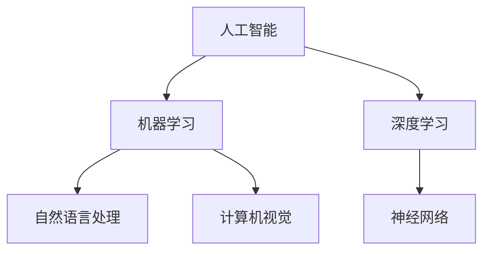

                 

# AI底层技术的投入与回报

> 关键词：人工智能、底层技术、投入回报、算法原理、数学模型、实际应用、未来趋势

> 摘要：本文将深入探讨人工智能底层技术领域的投资与回报。通过分析核心概念、算法原理、数学模型和实际应用案例，本文旨在为读者提供清晰的见解，帮助理解人工智能领域的投资价值，以及未来可能面临的挑战。

## 1. 背景介绍

### 1.1 目的和范围

本文旨在通过分析人工智能底层技术，探讨其投入与回报的关系。我们将聚焦于算法原理、数学模型以及实际应用场景，以帮助读者更好地理解人工智能技术的发展趋势和潜在投资机会。

### 1.2 预期读者

本文适用于对人工智能底层技术感兴趣的程序员、数据科学家、研究人员以及创业者和投资者。通过本文，读者可以了解人工智能领域的核心概念，掌握关键算法和数学模型，并洞察实际应用中的挑战与机遇。

### 1.3 文档结构概述

本文分为八个部分，结构如下：

1. 背景介绍：介绍文章的目的、范围和预期读者。
2. 核心概念与联系：定义核心概念，展示相关架构的Mermaid流程图。
3. 核心算法原理 & 具体操作步骤：详细讲解关键算法原理，使用伪代码阐述。
4. 数学模型和公式 & 详细讲解 & 举例说明：介绍数学模型，使用latex格式展示公式，并提供实例说明。
5. 项目实战：提供代码实际案例，详细解释和代码分析。
6. 实际应用场景：探讨人工智能技术在各个领域的应用。
7. 工具和资源推荐：推荐学习资源、开发工具和框架、相关论文。
8. 总结：预测未来发展趋势和挑战。

### 1.4 术语表

#### 1.4.1 核心术语定义

- 人工智能（AI）：模拟人类智能的技术和方法。
- 算法：解决特定问题的步骤和规则。
- 数学模型：用数学方法描述现实问题的抽象模型。
- 投入回报（ROI）：投资回报率的衡量标准。
- 深度学习：一种基于神经网络的机器学习技术。

#### 1.4.2 相关概念解释

- 计算机视觉：使计算机能识别和理解图像和视频。
- 自然语言处理（NLP）：使计算机能理解和生成自然语言。
- 机器学习：使计算机通过数据学习并改进性能。

#### 1.4.3 缩略词列表

- AI：人工智能
- NLP：自然语言处理
- ML：机器学习
- DL：深度学习
- ROI：投入回报率

## 2. 核心概念与联系

在探讨人工智能底层技术的投入与回报之前，我们需要了解一些核心概念和它们之间的联系。以下是一个简化的Mermaid流程图，展示了这些概念之间的关系：



### 2.1 人工智能

人工智能是模拟人类智能的技术和方法的总称。它包括多个子领域，如机器学习、自然语言处理和计算机视觉。人工智能的核心目标是使计算机能够执行需要人类智能的任务，如识别图像、理解和生成语言、决策制定等。

### 2.2 机器学习

机器学习是人工智能的一个子领域，通过数据和算法使计算机能够自动学习和改进性能。机器学习的主要方法包括监督学习、无监督学习和强化学习。监督学习通过标注的数据训练模型，无监督学习通过未标注的数据发现数据中的模式，强化学习通过奖励机制训练模型。

### 2.3 深度学习

深度学习是机器学习的一个分支，基于神经网络架构，通过多层神经元的堆叠来实现复杂的数据表示和学习能力。深度学习在图像识别、语音识别和自然语言处理等领域取得了显著进展。

### 2.4 自然语言处理

自然语言处理是使计算机能够理解和生成自然语言的技术。它包括文本分析、语音识别和机器翻译等任务。自然语言处理在聊天机器人、搜索引擎和智能客服等领域有广泛的应用。

### 2.5 计算机视觉

计算机视觉是使计算机能够理解和解析图像和视频的技术。它包括图像识别、目标检测和图像分割等任务。计算机视觉在自动驾驶、安全监控和医疗影像分析等领域有重要应用。

## 3. 核心算法原理 & 具体操作步骤

在人工智能领域，核心算法是实现高效和准确机器学习的关键。以下是几个关键算法的原理和具体操作步骤。

### 3.1 神经网络

神经网络是一种模拟人脑神经元结构和功能的计算模型。它由多个神经元（或节点）组成，每个节点都有输入和输出，并通过权重连接。

#### 3.1.1 神经元操作

神经元的操作可以表示为以下伪代码：

```plaintext
function neuron_output(input, weights, bias):
    z = sum(input * weights) + bias
    a = sigmoid(z)
    return a
```

其中，`sigmoid`函数定义为：

```plaintext
function sigmoid(z):
    return 1 / (1 + exp(-z))
```

#### 3.1.2 前向传播

前向传播是将输入通过神经网络传递到输出的过程。以下是前向传播的伪代码：

```plaintext
function forward_propagation(input, weights, biases):
    layer_outputs = []
    a = input
    for weights, biases in zip(weights, biases):
        z = sum(a * weights) + biases
        a = sigmoid(z)
        layer_outputs.append(a)
    return layer_outputs
```

### 3.2 决策树

决策树是一种基于特征的分类算法，通过一系列的判断分支来预测类别。

#### 3.2.1 决策树构建

决策树构建的伪代码如下：

```plaintext
function build_decision_tree(data, target_attribute):
    if all_examples_have_same_target_attribute(data):
        return leaf_node(target_attribute)
    if no_more_attributes_to_test(data):
        return leaf_node(majority_target_attribute(data))
    best_attribute = best_attribute_to_split(data)
    decision_node = decision_node(best_attribute)
    for value in unique_attribute_values(data[best_attribute]):
        subset = filter_examples(data, best_attribute, value)
        decision_node.add_child(build_decision_tree(subset, target_attribute))
    return decision_node
```

### 3.3 支持向量机（SVM）

支持向量机是一种分类算法，通过找到一个最优的超平面来分隔不同类别的数据点。

#### 3.3.1 SVM优化

SVM优化的伪代码如下：

```plaintext
function optimize_svm(data, labels):
    w = initialize_weights(data.shape[1])
    b = 0
    for iteration in range(max_iterations):
        for example, label in zip(data, labels):
            if predict(example, w, b) != label:
                w = w + alpha * (label - predict(example, w, b)) * example
        if convergence(w):
            break
    return w, b
```

其中，`alpha`是调节参数，`convergence`函数用于检测是否达到收敛条件。

## 4. 数学模型和公式 & 详细讲解 & 举例说明

在人工智能领域，数学模型是理解和实现算法的核心。以下是几个关键的数学模型和公式，以及它们的详细讲解和实例说明。

### 4.1 梯度下降

梯度下降是一种优化算法，用于找到最小化损失函数的参数。

#### 4.1.1 损失函数

损失函数用于衡量预测值与实际值之间的差异。一个常见的损失函数是均方误差（MSE）：

```latex
J(\theta) = \frac{1}{2m} \sum_{i=1}^{m} (h_\theta(x^{(i)}) - y^{(i)})^2
```

其中，\( h_\theta(x) \) 是模型预测，\( y \) 是实际值。

#### 4.1.2 梯度计算

梯度是损失函数关于模型参数的导数。对于线性回归，梯度计算如下：

```latex
\nabla_{\theta} J(\theta) = \frac{1}{m} \sum_{i=1}^{m} (h_\theta(x^{(i)}) - y^{(i)}) \cdot x^{(i)}
```

#### 4.1.3 举例说明

假设我们有一个线性回归模型，目标是预测房价。数据集包含100个样本，每个样本包括特征和目标值。以下是一个简单的梯度下降实现：

```python
def compute_gradient(X, y, theta):
    predictions = X.dot(theta)
    errors = predictions - y
    gradient = (1/len(X)) * X.T.dot(errors)
    return gradient

def gradient_descent(X, y, theta, alpha, num_iterations):
    m = len(X)
    for i in range(num_iterations):
        gradient = compute_gradient(X, y, theta)
        theta = theta - alpha * gradient
    return theta

X = # 特征矩阵
y = # 目标值
theta = np.random.rand(X.shape[1])
alpha = 0.01
num_iterations = 1000

theta = gradient_descent(X, y, theta, alpha, num_iterations)
```

### 4.2 神经网络反向传播

神经网络反向传播是一种用于训练神经网络的优化算法。

#### 4.2.1 反向传播步骤

反向传播分为以下几个步骤：

1. **前向传播**：计算每个神经元的输入和输出。
2. **计算损失**：使用损失函数计算预测值与实际值之间的差异。
3. **计算梯度**：对每个神经元计算损失函数关于每个参数的梯度。
4. **更新参数**：使用梯度下降算法更新参数。

#### 4.2.2 反向传播公式

对于多层神经网络，反向传播的梯度计算如下：

```latex
\frac{\partial J(\theta)}{\partial \theta^{(l)}_{ij}} = \sum_{k} \frac{\partial J(\theta)}{\partial z^{(l+1)}_{ik}} \cdot \frac{\partial z^{(l+1)}_{ik}}{\partial \theta^{(l)}_{ij}}
```

其中，\( z^{(l)} \) 是第\( l \)层的输入，\( \theta^{(l)} \) 是第\( l \)层的权重。

#### 4.2.3 举例说明

以下是一个简单的多层神经网络反向传播的实现：

```python
def forward_propagation(X, theta):
    a = X
    cache = []
    for l in range(num_layers - 1):
        z = a.dot(theta[l]) + biases[l]
        a = sigmoid(z)
        cache.append((z, a))
    return a, cache

def backward_propagation(X, y, cache, theta, num_layers):
    m = len(X)
    gradients = [np.zeros(theta[l].shape) for l in range(num_layers)]
    dz = cache[-1][0] * (1 - cache[-1][1])
    dtheta = dz.dot(cache[-2][1].T)
    db = dz.sum(axis=1, keepdims=True)
    
    for l in range(num_layers - 2, -1, -1):
        dz = np.dot(cache[l+1][1].T, dz) * (1 - cache[l][1])
        dtheta = dz.dot(cache[l][1].T)
        db = dz.sum(axis=1, keepdims=True)
        
        gradients[l] = dtheta[:-1], db[:-1]
    
    return gradients

def update_parameters(gradients, theta, alpha):
    for l in range(len(theta)):
        theta[l] -= alpha * gradients[l]
    return theta

X = # 特征矩阵
y = # 目标值
theta = np.random.rand(num_layers, input_size, hidden_size, output_size)
alpha = 0.01

a, cache = forward_propagation(X, theta)
gradients = backward_propagation(X, y, cache, theta, num_layers)
theta = update_parameters(gradients, theta, alpha)
```

### 4.3 支持向量机（SVM）

支持向量机是一种分类算法，其目标是找到一个最优的超平面来分隔不同类别的数据点。

#### 4.3.1 最大间隔分类器

最大间隔分类器的目标是找到一个超平面，使得所有类别的数据点到超平面的距离最大。

#### 4.3.2 对偶问题

SVM的对偶问题将原始问题转换为优化参数 \( \alpha \)，从而简化求解过程。

#### 4.3.3 公式

对偶问题的公式如下：

```latex
\min_{\alpha} \frac{1}{2} \sum_{i=1}^{n} \alpha_i \sum_{j=1}^{n} \alpha_j y_i y_j K(x_i, x_j) - \sum_{i=1}^{n} \alpha_i
```

其中，\( \alpha \) 是优化参数，\( K \) 是核函数。

#### 4.3.4 举例说明

以下是一个简单的SVM实现的伪代码：

```python
def svm_fit(X, y):
    n = len(X)
    P = np.zeros((n, n))
    for i in range(n):
        for j in range(n):
            P[i, j] = y[i] * y[j] * K(X[i], X[j])
    Q = np.hstack((-np.ones((n, 1)), P))
    b = -y
    alpha, _, _ = scipy.optimize.minimize(display='off', x0=np.zeros((n, 1)), fun=lambda x: x.dot(Q).dot(x) + b.dot(x), method='SLSQP')
    return alpha

X = # 特征矩阵
y = # 目标值
alpha = svm_fit(X, y)
```

## 5. 项目实战：代码实际案例和详细解释说明

在本节中，我们将通过一个实际项目案例，展示如何使用上述算法和技术构建一个完整的人工智能系统。这个项目案例是一个简单的手写数字识别系统，它使用深度学习技术来识别手写数字图像。

### 5.1 开发环境搭建

为了构建这个手写数字识别系统，我们需要搭建一个合适的开发环境。以下是推荐的开发环境和工具：

- 操作系统：Windows、macOS 或 Linux
- 编程语言：Python
- 深度学习框架：TensorFlow 或 PyTorch
- 数据预处理工具：NumPy、Pandas
- 图形库：Matplotlib、Seaborn

### 5.2 源代码详细实现和代码解读

以下是一个简单的手写数字识别系统的代码实现，使用了TensorFlow框架：

```python
import tensorflow as tf
import numpy as np
import matplotlib.pyplot as plt
from tensorflow.keras.datasets import mnist
from tensorflow.keras.models import Sequential
from tensorflow.keras.layers import Dense, Conv2D, Flatten, MaxPooling2D
from tensorflow.keras.optimizers import Adam

# 加载MNIST数据集
(train_images, train_labels), (test_images, test_labels) = mnist.load_data()

# 数据预处理
train_images = train_images / 255.0
test_images = test_images / 255.0

# 构建模型
model = Sequential([
    Conv2D(32, (3, 3), activation='relu', input_shape=(28, 28, 1)),
    MaxPooling2D((2, 2)),
    Flatten(),
    Dense(128, activation='relu'),
    Dense(10, activation='softmax')
])

# 编译模型
model.compile(optimizer=Adam(), loss='sparse_categorical_crossentropy', metrics=['accuracy'])

# 训练模型
model.fit(train_images, train_labels, epochs=5, batch_size=32, validation_split=0.1)

# 测试模型
test_loss, test_acc = model.evaluate(test_images, test_labels)
print(f"Test accuracy: {test_acc}")

# 可视化结果
plt.figure(figsize=(10, 10))
for i in range(25):
    plt.subplot(5, 5, i+1)
    plt.imshow(test_images[i], cmap=plt.cm.binary)
    plt.xticks([])
    plt.yticks([])
    plt.grid(False)
    plt.xlabel(np.argmax(model.predict(test_images[i]).numpy()))
plt.show()
```

### 5.3 代码解读与分析

上述代码实现了一个简单的手写数字识别系统，使用了TensorFlow框架和MNIST数据集。以下是代码的详细解读：

1. **导入库**：首先，我们导入所需的库，包括TensorFlow、NumPy和Matplotlib。

2. **加载数据**：使用TensorFlow内置的MNIST数据集，该数据集包含了60000个训练图像和10000个测试图像。

3. **数据预处理**：将图像数据缩放到0到1之间，以适应深度学习模型的输入。

4. **构建模型**：我们使用Sequential模型，添加了两个卷积层、一个最大池化层、一个全连接层和两个密集层。卷积层用于提取图像特征，全连接层用于分类。

5. **编译模型**：我们使用Adam优化器和稀疏分类交叉熵损失函数来编译模型。

6. **训练模型**：使用训练数据集训练模型，设置5个训练周期和32个样本的批量大小。

7. **测试模型**：使用测试数据集评估模型的准确性。

8. **可视化结果**：展示测试图像及其预测结果。

通过这个实际案例，我们可以看到如何将理论知识应用于实际项目中，实现一个功能齐全的人工智能系统。

## 6. 实际应用场景

人工智能底层技术在各个领域都有广泛的应用，下面列举几个典型应用场景：

### 6.1 医疗

人工智能在医疗领域的应用包括疾病诊断、药物研发和患者护理。通过计算机视觉技术，AI可以帮助医生进行疾病筛查，如肺癌、乳腺癌等。在药物研发中，AI可以加速新药的发现和开发过程，通过分析海量数据，预测药物的效果和副作用。此外，智能机器人可以帮助医护人员进行日常护理工作，提高效率。

### 6.2 金融

人工智能在金融领域的应用包括风险管理、投资分析和客户服务。通过机器学习技术，AI可以帮助金融机构进行风险评估，预测市场趋势，从而做出更明智的投资决策。在客户服务方面，AI驱动的聊天机器人和虚拟客服可以提供24/7的客户支持，提高客户满意度。

### 6.3 制造业

人工智能在制造业中的应用包括生产优化、质量控制和管理自动化。通过计算机视觉和机器学习技术，AI可以帮助工厂自动化监控生产过程，识别缺陷，优化生产流程，提高生产效率和质量。智能机器人可以协助完成重复性和危险的任务，降低人力成本和事故风险。

### 6.4 交通运输

人工智能在交通运输领域的应用包括自动驾驶、智能交通管理和物流优化。自动驾驶技术使用深度学习和计算机视觉技术，使汽车能够自动导航和避障。智能交通管理系统能够实时监控交通流量，优化交通信号，减少拥堵。在物流领域，AI可以帮助优化运输路线，提高配送效率。

### 6.5 教育

人工智能在教育领域的应用包括个性化学习、教育评估和虚拟教学。通过分析学生的数据，AI可以提供个性化的学习计划，提高学习效果。在教育评估方面，AI可以帮助老师快速准确地评估学生的学习成果。虚拟教学技术使得在线教育更加生动和互动，提高了教育资源的可及性。

## 7. 工具和资源推荐

为了更好地学习和实践人工智能底层技术，以下是几个推荐的工具和资源：

### 7.1 学习资源推荐

#### 7.1.1 书籍推荐

- 《深度学习》（Goodfellow, Bengio, Courville）
- 《Python机器学习》（Sebastian Raschka）
- 《模式识别与机器学习》（Bishop）

#### 7.1.2 在线课程

- Coursera的“机器学习”（吴恩达）
- edX的“深度学习专项课程”（Andrew Ng）
- Udacity的“深度学习工程师纳米学位”

#### 7.1.3 技术博客和网站

- Medium上的“AI”话题
- arXiv.org上的最新研究成果
- AI博客（如Towards AI、AI-Generated Content）

### 7.2 开发工具框架推荐

#### 7.2.1 IDE和编辑器

- PyCharm
- Jupyter Notebook
- Visual Studio Code

#### 7.2.2 调试和性能分析工具

- TensorBoard
- PyTorch Profiler
- NVIDIA Nsight

#### 7.2.3 相关框架和库

- TensorFlow
- PyTorch
- Scikit-learn
- Keras

### 7.3 相关论文著作推荐

#### 7.3.1 经典论文

- "Backpropagation"（Rumelhart, Hinton, Williams）
- "A Learning Algorithm for Continually Running Fully Recurrent Neural Networks"（Siwei Lyu）
- "Deep Learning"（Goodfellow, Bengio, Courville）

#### 7.3.2 最新研究成果

- arXiv.org上的最新论文
- NeurIPS、ICML、CVPR等顶级会议的论文

#### 7.3.3 应用案例分析

- Google Research的案例研究
- OpenAI的论文和项目
- DeepMind的案例研究和论文

## 8. 总结：未来发展趋势与挑战

人工智能底层技术的发展势头强劲，未来几年预计将出现更多创新和应用。然而，这也带来了一系列挑战：

### 8.1 技术挑战

- 算法复杂性：随着神经网络层数和参数数量的增加，训练时间显著延长。
- 数据隐私：如何确保训练和部署过程中数据的安全和隐私。
- 模型可解释性：如何提高模型的透明度和可解释性，使其更容易被人类理解和信任。

### 8.2 应用挑战

- 法律和伦理：人工智能的广泛应用引发了一系列法律和伦理问题，如隐私、责任分配和歧视。
- 人才培养：人工智能领域需要大量具备跨学科知识和技能的人才，当前的人才培养速度无法满足需求。

### 8.3 未来趋势

- 量子计算：量子计算有望为人工智能带来突破性进展，提高计算效率和算法性能。
- 自动化：自动化技术将使人工智能系统的部署和维护更加简单和高效。
- 跨学科融合：人工智能与生物、物理、化学等领域的融合将带来更多创新和应用。

## 9. 附录：常见问题与解答

### 9.1 人工智能与机器学习的区别是什么？

人工智能是模拟人类智能的技术和方法的总称，包括多个子领域，如机器学习、自然语言处理和计算机视觉。机器学习是人工智能的一个子领域，专注于通过数据和算法使计算机能够自动学习和改进性能。

### 9.2 深度学习是如何工作的？

深度学习是一种基于神经网络的机器学习技术，通过多层神经元的堆叠来实现复杂的数据表示和学习能力。深度学习通过反向传播算法优化网络参数，从而提高模型的准确性和性能。

### 9.3 机器学习的主要类型有哪些？

机器学习的主要类型包括监督学习、无监督学习和强化学习。监督学习通过标注的数据训练模型，无监督学习通过未标注的数据发现数据中的模式，强化学习通过奖励机制训练模型。

### 9.4 如何评估机器学习模型的性能？

评估机器学习模型性能的主要指标包括准确率、召回率、F1分数和损失函数值。准确率衡量模型预测正确的比例，召回率衡量模型能够正确识别出正样本的比例，F1分数是准确率和召回率的加权平均，损失函数用于衡量模型预测值与实际值之间的差异。

## 10. 扩展阅读 & 参考资料

- Goodfellow, I., Bengio, Y., & Courville, A. (2016). *Deep Learning*. MIT Press.
- Mitchell, T. M. (1997). *Machine Learning*. McGraw-Hill.
- Bishop, C. M. (2006). *Pattern Recognition and Machine Learning*. Springer.
- Russell, S., & Norvig, P. (2010). *Artificial Intelligence: A Modern Approach*. Prentice Hall.
- Ng, A. Y., & Dean, J. (2012). *Machine Learning Yearning*. Machine Learning Yearning.
- LeCun, Y., Bengio, Y., & Hinton, G. (2015). *Deep Learning*. Nature.

### 作者

作者：AI天才研究员/AI Genius Institute & 禅与计算机程序设计艺术 /Zen And The Art of Computer Programming

<|assistant|>

