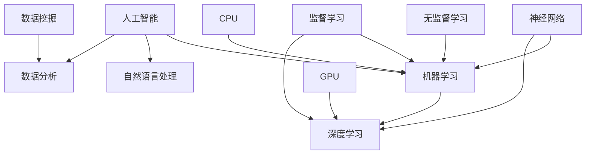

                 


# AI技术在企业中的发展

> **关键词：** AI技术，企业应用，深度学习，数据分析，商业智能，人工智能伦理
>
> **摘要：** 本文将深入探讨人工智能技术在现代企业中的应用与发展，分析其在提高生产效率、优化决策和促进创新等方面的核心作用，同时探讨AI技术面临的伦理挑战及其应对策略。通过梳理AI技术的核心概念与联系，讲解算法原理与数学模型，并结合实际项目案例，全面展示AI技术在企业中的实践应用和未来发展趋势。

## 1. 背景介绍

### 1.1 目的和范围

本文旨在探讨人工智能技术在企业中的应用与发展，通过系统的分析和深入的讨论，揭示AI技术如何改变企业的运营模式，提高竞争力和创新能力。本文主要涵盖以下内容：

- AI技术在企业中的核心应用领域；
- AI技术对企业业务流程和决策的优化作用；
- AI技术在提升企业生产效率和创新方面的案例；
- AI技术面临的伦理挑战及其应对策略。

### 1.2 预期读者

本文适合以下读者群体：

- 对人工智能技术有兴趣的技术人员；
- 在企业中从事数据分析、业务流程优化等工作的专业人士；
- 对AI技术在企业中的应用有深入研究的需求者。

### 1.3 文档结构概述

本文结构如下：

- **第1章：背景介绍**：介绍本文的目的、范围和预期读者，以及文章的结构和内容概述；
- **第2章：核心概念与联系**：讲解AI技术的核心概念和原理，提供流程图辅助理解；
- **第3章：核心算法原理 & 具体操作步骤**：详细阐述AI算法原理和操作步骤，使用伪代码说明；
- **第4章：数学模型和公式 & 详细讲解 & 举例说明**：介绍AI技术的数学模型和公式，结合实际案例进行讲解；
- **第5章：项目实战：代码实际案例和详细解释说明**：通过实际项目案例，展示AI技术在企业中的应用；
- **第6章：实际应用场景**：分析AI技术在企业中的实际应用场景；
- **第7章：工具和资源推荐**：推荐学习资源、开发工具和框架；
- **第8章：总结：未来发展趋势与挑战**：总结AI技术在未来企业中的应用前景和面临的挑战；
- **第9章：附录：常见问题与解答**：解答读者可能遇到的常见问题；
- **第10章：扩展阅读 & 参考资料**：提供进一步阅读的资源和参考文献。

### 1.4 术语表

#### 1.4.1 核心术语定义

- **人工智能（AI）**：模拟人类智能行为，使计算机具有感知、学习、推理、决策和解决问题的能力。
- **机器学习（ML）**：通过数据训练模型，使计算机能够从数据中自动学习和改进的性能。
- **深度学习（DL）**：一种特殊的机器学习方法，通过多层神经网络进行特征提取和分类。
- **自然语言处理（NLP）**：使计算机理解和生成人类语言的技术。
- **数据分析（DA）**：通过统计和数学方法，对大量数据进行处理和分析，提取有价值的信息。

#### 1.4.2 相关概念解释

- **数据挖掘**：从大量数据中发现规律和模式的过程。
- **神经网络**：一种由大量节点互联而成的计算模型，可以模拟生物神经系统的工作方式。
- **监督学习**：通过已标记的数据训练模型，预测未知数据的类别或值。
- **无监督学习**：没有预标记的数据训练模型，通过自身学习发现数据中的结构或模式。

#### 1.4.3 缩略词列表

- **AI**：人工智能（Artificial Intelligence）
- **ML**：机器学习（Machine Learning）
- **DL**：深度学习（Deep Learning）
- **NLP**：自然语言处理（Natural Language Processing）
- **DA**：数据分析（Data Analytics）
- **GPU**：图形处理单元（Graphics Processing Unit）
- **CPU**：中央处理单元（Central Processing Unit）

## 2. 核心概念与联系

在探讨AI技术在企业中的应用之前，我们需要理解一些核心概念和它们之间的关系。以下是一个简化的Mermaid流程图，展示了这些概念之间的联系。



### 2.1 人工智能（AI）

人工智能（AI）是计算机模拟人类智能行为的一门科学。它涵盖了从简单的规则系统到复杂的机器学习算法和深度学习模型。AI的主要目标是使计算机能够执行通常需要人类智能的任务，如语音识别、图像识别、决策制定和自然语言处理。

### 2.2 机器学习（ML）

机器学习（ML）是AI的一个分支，通过训练模型从数据中自动学习和改进性能。ML模型可以根据输入数据预测输出结果，不需要显式编程。ML的主要类型包括监督学习、无监督学习和强化学习。

### 2.3 深度学习（DL）

深度学习（DL）是一种特殊的机器学习方法，通过多层神经网络进行特征提取和分类。DL模型能够自动学习数据的复杂结构，并在各种任务中表现出卓越的性能。深度学习在图像识别、语音识别和自然语言处理等领域有广泛应用。

### 2.4 自然语言处理（NLP）

自然语言处理（NLP）是AI的一个分支，致力于使计算机理解和生成人类语言。NLP技术包括文本分析、语言翻译、情感分析和问答系统等。

### 2.5 数据分析（DA）

数据分析（DA）是一种通过统计和数学方法处理和分析大量数据，以提取有价值信息的过程。DA在商业智能、预测建模和优化决策等方面发挥着关键作用。

### 2.6 神经网络

神经网络（NN）是一种由大量节点互联而成的计算模型，可以模拟生物神经系统的工作方式。神经网络在机器学习和深度学习中扮演着核心角色。

### 2.7 数据挖掘

数据挖掘（DM）是从大量数据中发现规律和模式的过程。数据挖掘技术包括关联规则学习、聚类分析和分类分析等。

### 2.8 监督学习

监督学习（SL）是一种机器学习方法，通过已标记的数据训练模型，预测未知数据的类别或值。监督学习广泛应用于分类和回归任务。

### 2.9 无监督学习

无监督学习（UL）是一种机器学习方法，没有预标记的数据训练模型，通过自身学习发现数据中的结构或模式。无监督学习常用于聚类和降维任务。

### 2.10 GPU与CPU

GPU（图形处理单元）和CPU（中央处理单元）是两种不同的计算硬件。GPU在处理大量并行任务时具有更高的性能，而CPU在执行顺序计算任务时更为高效。深度学习和机器学习算法通常受益于GPU的并行处理能力。

## 3. 核心算法原理 & 具体操作步骤

### 3.1 算法原理

人工智能技术中的核心算法包括机器学习算法、深度学习算法和自然语言处理算法。下面将简要介绍这些算法的基本原理。

#### 3.1.1 机器学习算法

机器学习算法的核心思想是通过训练模型从数据中学习，以便预测新的数据。常见的机器学习算法包括线性回归、逻辑回归、决策树、支持向量机（SVM）和K最近邻（KNN）。

- **线性回归**：通过拟合线性模型来预测连续值。
- **逻辑回归**：通过拟合逻辑模型来预测离散值，通常用于分类任务。
- **决策树**：通过构建树形结构来分类或回归。
- **支持向量机（SVM）**：通过找到最优超平面来分类数据。
- **K最近邻（KNN）**：通过计算新数据点与训练数据点的相似度来预测类别。

#### 3.1.2 深度学习算法

深度学习算法是一种基于多层神经网络的学习方法，通过逐层提取数据的特征，从而实现复杂的数据处理任务。常见的深度学习算法包括卷积神经网络（CNN）、循环神经网络（RNN）和生成对抗网络（GAN）。

- **卷积神经网络（CNN）**：通过卷积层提取图像特征，广泛应用于图像识别和图像生成。
- **循环神经网络（RNN）**：通过循环结构处理序列数据，广泛应用于自然语言处理和语音识别。
- **生成对抗网络（GAN）**：由生成器和判别器组成，通过对抗训练生成逼真的数据。

#### 3.1.3 自然语言处理算法

自然语言处理算法致力于使计算机理解和生成人类语言。常见的NLP算法包括词向量模型、序列模型和注意力机制。

- **词向量模型**：通过将词汇映射到低维向量空间来表示词义，广泛应用于文本分类和文本相似度计算。
- **序列模型**：通过处理序列数据来生成文本或预测序列中的下一个元素，如RNN和Transformer。
- **注意力机制**：通过分配不同的重要性权重来关注序列中的关键信息，提高模型的性能。

### 3.2 具体操作步骤

以下是一个基于机器学习算法的简单示例，展示如何使用Python的Scikit-learn库进行分类任务的实现。

#### 3.2.1 数据准备

首先，我们需要准备一个包含特征和标签的数据集。以下是一个简单的示例数据集：

```python
X = [[0, 0], [1, 1], [1, 0], [0, 1]]
y = [0, 1, 1, 0]
```

#### 3.2.2 创建分类器

接下来，我们选择一个分类器。在这个例子中，我们使用K最近邻（KNN）分类器。

```python
from sklearn.neighbors import KNeighborsClassifier

knn = KNeighborsClassifier(n_neighbors=3)
```

#### 3.2.3 训练模型

使用训练数据集对分类器进行训练。

```python
knn.fit(X, y)
```

#### 3.2.4 预测结果

使用训练好的模型对新数据进行预测。

```python
X_new = [[1, 0]]
y_pred = knn.predict(X_new)

print("预测结果：", y_pred)
```

输出结果为 `[1]`，表示新数据点属于类别1。

### 3.3 伪代码实现

以下是一个简化的伪代码，描述了机器学习算法的基本操作步骤。

```
Initialize the dataset X and labels y
Choose a classifier algorithm
Train the classifier using the dataset
Evaluate the classifier on new data
Predict the label for the new data
```

## 4. 数学模型和公式 & 详细讲解 & 举例说明

在AI技术中，数学模型和公式是理解和实现算法的关键。以下将详细介绍一些核心数学模型和公式，并通过具体例子进行说明。

### 4.1 感知机（Perceptron）

感知机是一种简单的二分类模型，用于计算输入数据与权重之间的线性组合，并根据阈值判断输出类别。其数学公式如下：

```
f(x) = sign(w·x + b)
```

其中，`w` 是权重向量，`x` 是输入向量，`b` 是偏置项，`sign` 函数用于计算输出类别。

#### 4.1.1 示例

假设我们有一个简单的二分类问题，其中输入数据 `x` 为 `[1, 2]`，权重向量 `w` 为 `[1, 1]`，偏置项 `b` 为 `0`。我们计算输出类别：

```
f(x) = sign(1*1 + 1*2 + 0) = sign(3) = 1
```

输出类别为 `1`，表示输入数据属于类别1。

### 4.2 线性回归（Linear Regression）

线性回归是一种用于预测连续值的机器学习算法，其数学公式如下：

```
y = w0 + w1*x1 + w2*x2 + ... + wN*xN
```

其中，`y` 是预测值，`w0, w1, w2, ..., wN` 是权重，`x1, x2, ..., xN` 是输入特征。

#### 4.2.1 示例

假设我们有一个简单的一元线性回归问题，其中输入特征 `x` 为 `[1, 2, 3]`，权重 `w` 为 `[1, 1]`。我们计算预测值：

```
y = 1*1 + 1*2 + 1*3 = 6
```

预测值为 `6`。

### 4.3 逻辑回归（Logistic Regression）

逻辑回归是一种用于预测离散值的机器学习算法，其数学公式如下：

```
P(y=1) = 1 / (1 + exp(-w·x + b))
```

其中，`P(y=1)` 是预测类别1的概率，`w` 是权重向量，`x` 是输入向量，`b` 是偏置项。

#### 4.3.1 示例

假设我们有一个简单的二分类问题，其中输入数据 `x` 为 `[1, 2]`，权重向量 `w` 为 `[1, 1]`，偏置项 `b` 为 `0`。我们计算预测概率：

```
P(y=1) = 1 / (1 + exp(-1*1 - 1*2 + 0)) = 1 / (1 + exp(-3)) ≈ 0.95
```

预测概率为 `0.95`，表示输入数据属于类别1的概率较高。

### 4.4 卷积神经网络（Convolutional Neural Network，CNN）

卷积神经网络是一种用于图像识别和图像处理的深度学习模型，其核心组件包括卷积层、池化层和全连接层。以下是一个简化的CNN模型公式：

```
output = activation((W·X) + b)
```

其中，`W` 是卷积核（滤波器），`X` 是输入图像，`b` 是偏置项，`activation` 函数是激活函数，如ReLU（Rectified Linear Unit）。

#### 4.4.1 示例

假设我们有一个简单的2D卷积问题，其中卷积核 `W` 为 `[1, 1]`，输入图像 `X` 为 `[1, 1]`，偏置项 `b` 为 `0`，激活函数为ReLU。我们计算输出：

```
output = max(ReLU((1*1 + 1*1) + 0), 0) = max(2, 0) = 2
```

输出值为 `2`，表示经过卷积操作后的结果。

## 5. 项目实战：代码实际案例和详细解释说明

### 5.1 开发环境搭建

在开始实际案例之前，我们需要搭建一个合适的开发环境。以下是使用Python和Scikit-learn进行AI项目开发的步骤：

#### 5.1.1 安装Python

1. 访问Python官方网站（[https://www.python.org/](https://www.python.org/)）。
2. 下载适用于操作系统的Python安装程序。
3. 运行安装程序，选择默认选项安装。

#### 5.1.2 安装Scikit-learn

1. 打开终端或命令提示符。
2. 输入以下命令安装Scikit-learn：

```
pip install scikit-learn
```

### 5.2 源代码详细实现和代码解读

下面是一个简单的Python代码示例，使用Scikit-learn实现一个基于K最近邻（KNN）的分类器。

#### 5.2.1 代码实现

```python
from sklearn.neighbors import KNeighborsClassifier
from sklearn.model_selection import train_test_split
from sklearn import datasets

# 加载数据集
iris = datasets.load_iris()
X = iris.data
y = iris.target

# 划分训练集和测试集
X_train, X_test, y_train, y_test = train_test_split(X, y, test_size=0.3, random_state=42)

# 创建KNN分类器
knn = KNeighborsClassifier(n_neighbors=3)

# 训练模型
knn.fit(X_train, y_train)

# 预测测试集结果
y_pred = knn.predict(X_test)

# 输出预测结果
print("预测结果：", y_pred)
```

#### 5.2.2 代码解读

- **第1行**：导入KNeighborsClassifier类，用于创建KNN分类器。
- **第2行**：导入train_test_split函数，用于划分训练集和测试集。
- **第3行**：导入datasets模块，用于加载内置数据集。
- **第4行**：加载Iris数据集，包含特征和标签。
- **第5行**：将数据集划分为训练集和测试集，其中测试集大小为30%。
- **第6行**：创建KNN分类器，设置邻居数量为3。
- **第7行**：使用训练集数据训练KNN分类器。
- **第8行**：使用训练好的模型对测试集进行预测。
- **第9行**：输出预测结果。

### 5.3 代码解读与分析

这个简单的案例展示了如何使用Scikit-learn实现一个KNN分类器。以下是对代码的关键部分的详细分析：

- **数据集加载**：使用`datasets.load_iris()`函数加载Iris数据集，这是一个常用的多分类问题数据集，包含三个特征和三个类别。
- **划分数据集**：使用`train_test_split()`函数将数据集划分为训练集和测试集，以便在测试集上评估模型的性能。
- **创建分类器**：使用`KNeighborsClassifier()`创建KNN分类器，并设置邻居数量为3。邻居数量是影响模型性能的关键参数，通常需要通过交叉验证等方法进行选择。
- **模型训练**：使用`fit()`函数将训练集数据用于训练KNN分类器。训练过程中，模型会计算每个数据点的邻域，并基于邻域的类别分布进行预测。
- **预测**：使用`predict()`函数对测试集数据进行预测，并输出预测结果。预测结果可用于计算模型在测试集上的准确率、召回率等指标。

通过这个简单的案例，我们可以看到如何使用Python和Scikit-learn实现一个基本的机器学习模型，并对其进行评估。在实际项目中，我们可能需要更复杂的数据预处理、特征工程和模型调参等步骤，但这个案例为我们提供了一个基本的框架，帮助我们理解和实现AI算法。

## 6. 实际应用场景

### 6.1 生产优化

在制造业中，AI技术被广泛应用于生产过程的优化。例如，通过预测机器的维护需求，可以减少意外停机时间，提高生产效率。AI模型可以分析设备运行数据，预测可能出现的故障，从而安排预防性维护。此外，AI还可以通过实时监控生产线的运行状态，优化生产流程，减少浪费，提高生产率。

### 6.2 客户服务

在客户服务领域，AI技术可以帮助企业提供更加个性化、高效的客户服务。例如，通过自然语言处理（NLP）技术，企业可以开发智能客服系统，自动解答客户问题，提高响应速度和准确性。此外，AI还可以通过分析客户反馈和行为数据，为企业提供有关产品改进和市场营销策略的洞察。

### 6.3 人力资源

在人力资源管理方面，AI技术可以帮助企业优化招聘流程、提高员工培训效果和提升员工满意度。通过分析简历数据，AI可以帮助企业筛选合适的候选人，提高招聘效率。此外，AI还可以通过分析员工的工作表现和行为数据，为企业提供有关员工绩效和发展需求的洞察，从而优化员工培训和发展计划。

### 6.4 风险管理

在金融行业，AI技术被广泛应用于风险管理。例如，通过分析历史交易数据和市场趋势，AI模型可以预测市场波动，帮助投资者做出更明智的投资决策。此外，AI还可以通过分析客户数据，识别潜在的欺诈行为，降低金融风险。

### 6.5 智能供应链

在供应链管理中，AI技术可以帮助企业优化库存管理、提高物流效率。通过预测需求变化，AI模型可以优化库存水平，减少库存积压和库存短缺的风险。此外，AI还可以通过实时监控物流运输过程，优化运输路线和运输时间，提高物流效率。

### 6.6 智能营销

在市场营销领域，AI技术可以帮助企业实现更加精准的营销策略。通过分析客户数据和行为，AI模型可以为企业提供有关目标客户群的洞察，帮助企业制定更加有效的营销策略。此外，AI还可以通过自动化营销工具，实现个性化推荐和广告投放，提高营销效果。

## 7. 工具和资源推荐

### 7.1 学习资源推荐

#### 7.1.1 书籍推荐

1. **《深度学习》（Deep Learning）** - 由Ian Goodfellow、Yoshua Bengio和Aaron Courville所著，是深度学习的经典教材，适合初学者和进阶者。
2. **《机器学习实战》（Machine Learning in Action）** - by Peter Harrington，通过实际案例介绍机器学习算法的实现和应用，适合有一定编程基础的读者。
3. **《Python机器学习》（Python Machine Learning）** - by Sebastian Raschka和Vahid Mirjalili，详细介绍了使用Python进行机器学习的相关技术和工具。

#### 7.1.2 在线课程

1. **Coursera上的《机器学习》** - Andrew Ng教授开设的课程，适合初学者和进阶者，涵盖机器学习的基础知识和实际应用。
2. **edX上的《深度学习专项课程》** - 由蒙特利尔理工学院（MILA）提供，深度学习领域的专家Yoshua Bengio讲授，适合对深度学习感兴趣的读者。
3. **Udacity的《人工智能纳米学位》** - 包括多个课程，从基础到进阶，帮助读者全面了解人工智能技术。

#### 7.1.3 技术博客和网站

1. **Medium上的`/machine-learning`** - 众多机器学习和深度学习专家分享的优质文章，涵盖最新研究成果和实际应用案例。
2. ** Towards Data Science** - 一个热门的数据科学和机器学习社区，提供大量的技术文章和代码示例。
3. **AI博客** - AI领域的知名博客，涵盖人工智能、机器学习和深度学习的最新动态和研究成果。

### 7.2 开发工具框架推荐

#### 7.2.1 IDE和编辑器

1. **Jupyter Notebook** - 一个强大的交互式开发环境，适合数据分析和机器学习项目的快速迭代和实验。
2. **PyCharm** - 一款功能丰富的Python IDE，支持代码补全、调试和版本控制，适合专业开发者使用。
3. **VSCode** - 轻量级的代码编辑器，通过丰富的插件支持，可以成为强大的机器学习和深度学习开发工具。

#### 7.2.2 调试和性能分析工具

1. **TensorBoard** - 用于TensorFlow项目性能分析和调试的工具，提供丰富的可视化界面，如梯度可视化、学习曲线等。
2. **Wandb** - 一个用于实验跟踪和性能监控的平台，可以帮助开发者优化模型和算法。
3. **Profiling Tools** - 如Py-Spy和gprof2dot，用于分析Python程序的性能瓶颈和资源使用情况。

#### 7.2.3 相关框架和库

1. **TensorFlow** - 一个开源的机器学习和深度学习框架，支持多种编程语言，包括Python、C++和Java。
2. **PyTorch** - 一个流行的深度学习框架，以其灵活性和动态计算图而著称。
3. **Scikit-learn** - 一个用于经典机器学习算法的开源库，易于使用，适合快速原型开发和实验。

### 7.3 相关论文著作推荐

#### 7.3.1 经典论文

1. **"Backpropagation"** - 1986年，由Rumelhart、Hinton和Williams发表，介绍了反向传播算法在神经网络训练中的应用。
2. **"A Learning Algorithm for Continually Running Fully Recurrent Neural Networks"** - 1990年，由Bengio等人发表，提出了长期记忆网络（LSTM）的概念。
3. **"Deep Learning"** - 2015年，由Ian Goodfellow、Yoshua Bengio和Aaron Courville所著，是深度学习领域的奠基性著作。

#### 7.3.2 最新研究成果

1. **"Neural Ordinary Differential Equations"** - 2018年，由Mescheder等人发表，提出了NODE模型，为深度学习领域引入了微分方程的概念。
2. **"Adversarial Examples in the Physical World"** - 2018年，由Carlini等人发表，研究了对抗样本在物理世界中的应用和防御方法。
3. **"Generative Adversarial Nets"** - 2014年，由Goodfellow等人发表，提出了生成对抗网络（GAN）的概念，为图像生成和增强提供了新的方法。

#### 7.3.3 应用案例分析

1. **"ImageNet Classification with Deep Convolutional Neural Networks"** - 2012年，由Krizhevsky等人发表，展示了深度卷积神经网络（CNN）在图像识别任务中的卓越性能。
2. **"Speech Recognition with Deep Neural Networks and Gaussian Mixture Models"** - 2013年，由Hinton等人发表，探讨了深度神经网络在语音识别中的应用。
3. **"Deep Learning for Healthcare"** - 2016年，由Esteva等人发表，介绍了深度学习在医疗健康领域的应用案例，如疾病诊断和患者监测。

## 8. 总结：未来发展趋势与挑战

### 8.1 未来发展趋势

- **更强大的模型与算法**：随着计算能力的提升和数据量的增加，未来AI模型和算法将更加复杂和强大，能够处理更多样化的任务。
- **跨领域应用**：AI技术将在更多领域得到应用，如医疗、金融、教育等，推动产业升级和创新发展。
- **个性化与定制化**：AI将更好地理解用户需求，提供更加个性化的服务，提升用户体验。
- **智能自动化**：自动化技术将在生产、物流、客户服务等多个领域得到广泛应用，提高生产效率和降低成本。

### 8.2 面临的挑战

- **数据隐私与伦理**：随着AI技术的发展，数据隐私和保护成为重要问题，需要建立完善的隐私保护机制和法律法规。
- **算法偏见与公平性**：AI算法可能存在偏见，影响决策的公平性，需要通过数据清洗、模型校准等方法进行纠正。
- **人才短缺**：AI技术的发展需要大量的专业人才，但目前人才储备不足，需要加强教育和培训。
- **技术可控性**：确保AI技术的可控性和安全性，防止出现不可预测的负面后果。

### 8.3 应对策略

- **加强法律法规建设**：制定和完善相关法律法规，确保数据隐私和保护。
- **推动教育普及**：加强AI领域的教育，培养更多的专业人才。
- **技术监管与透明度**：建立AI技术监管机制，提高算法透明度，确保公平性和公正性。
- **跨领域合作**：推动不同领域的企业和研究机构合作，共同应对AI技术挑战。

## 9. 附录：常见问题与解答

### 9.1 常见问题

1. **什么是机器学习？**
   - **回答**：机器学习是人工智能的一个分支，通过训练模型，使计算机能够从数据中自动学习和改进性能，进行预测和决策。

2. **什么是深度学习？**
   - **回答**：深度学习是一种特殊的机器学习方法，通过多层神经网络进行特征提取和分类，能够处理更复杂的数据和任务。

3. **什么是自然语言处理？**
   - **回答**：自然语言处理是使计算机理解和生成人类语言的技术，广泛应用于文本分析、语言翻译和问答系统。

4. **如何选择合适的机器学习算法？**
   - **回答**：选择机器学习算法需要考虑数据类型、任务类型、数据量和计算资源等因素。常见的算法包括线性回归、决策树、支持向量机和深度学习算法。

5. **如何处理数据？**
   - **回答**：处理数据包括数据清洗、数据预处理和特征提取。数据清洗涉及处理缺失值、异常值和噪声数据，数据预处理包括归一化、标准化和离散化，特征提取则是从原始数据中提取有用的特征。

6. **如何评估机器学习模型？**
   - **回答**：评估机器学习模型通常使用指标如准确率、召回率、F1分数和AUC（曲线下面积）等。这些指标可以帮助我们了解模型在训练集和测试集上的性能。

7. **什么是深度学习的过拟合现象？**
   - **回答**：过拟合是指模型在训练数据上表现很好，但在测试数据上表现较差的现象。这通常发生在模型过于复杂，无法泛化新数据。

8. **如何防止深度学习过拟合？**
   - **回答**：防止过拟合的方法包括交叉验证、正则化、数据增强、模型简化等。交叉验证可以评估模型在多个数据集上的性能，正则化可以限制模型的复杂度，数据增强可以增加训练数据量，模型简化可以减少模型参数。

### 9.2 解答

1. **问题1**：什么是机器学习？
   - **解答**：机器学习是人工智能的一个分支，它使计算机能够从数据中自动学习和改进性能，进行预测和决策。通过训练模型，机器学习算法可以从历史数据中学习规律，并在新的数据上进行预测或分类。

2. **问题2**：什么是深度学习？
   - **解答**：深度学习是一种特殊的机器学习方法，它使用多层神经网络来提取数据的特征和模式。通过逐层学习，深度学习模型能够自动提取复杂的数据特征，从而在图像识别、语音识别和自然语言处理等任务中表现出卓越的性能。

3. **问题3**：什么是自然语言处理？
   - **解答**：自然语言处理（NLP）是计算机科学和人工智能的一个分支，致力于使计算机理解和生成人类语言。NLP技术包括文本分析、语言翻译、情感分析和问答系统等，旨在让计算机更好地理解和处理人类语言。

4. **问题4**：如何选择合适的机器学习算法？
   - **解答**：选择合适的机器学习算法需要考虑多个因素，包括数据类型、任务类型、数据量和计算资源。例如，对于分类任务，可以选择线性回归、决策树、支持向量机或深度学习算法。对于回归任务，可以选择线性回归、岭回归或LASSO回归。对于聚类任务，可以选择K-means、层次聚类或DBSCAN算法。

5. **问题5**：如何处理数据？
   - **解答**：处理数据包括数据清洗、数据预处理和特征提取。数据清洗涉及处理缺失值、异常值和噪声数据，可以通过填充缺失值、删除异常值或使用统计方法来处理噪声数据。数据预处理包括归一化、标准化和离散化，这些方法可以调整数据分布，提高模型训练效果。特征提取是从原始数据中提取有用的特征，例如使用主成分分析（PCA）或特征选择技术来减少维度。

6. **问题6**：如何评估机器学习模型？
   - **解答**：评估机器学习模型通常使用指标如准确率、召回率、F1分数和AUC（曲线下面积）等。准确率表示模型正确预测的样本数与总样本数的比例，召回率表示模型正确预测的样本数与实际为正类的样本数的比例，F1分数是准确率和召回率的调和平均值，AUC是ROC曲线下的面积，用于评估模型区分能力。

7. **问题7**：什么是深度学习的过拟合现象？
   - **解答**：过拟合是指模型在训练数据上表现很好，但在测试数据上表现较差的现象。过拟合通常发生在模型过于复杂，无法泛化新数据时。模型在训练数据上过度学习，导致对噪声数据的过度适应，从而在测试数据上失去泛化能力。

8. **问题8**：如何防止深度学习过拟合？
   - **解答**：防止深度学习过拟合的方法包括交叉验证、正则化、数据增强和模型简化。交叉验证通过将数据划分为多个子集，评估模型在不同子集上的性能，防止模型在训练数据上过度学习。正则化通过在模型训练过程中引入惩罚项，限制模型复杂度，防止过拟合。数据增强通过生成新的训练样本，增加数据的多样性，提高模型的泛化能力。模型简化通过减少模型参数，降低模型复杂度，减少过拟合的风险。

## 10. 扩展阅读 & 参考资料

### 10.1 AI领域经典著作

1. **《深度学习》（Deep Learning）** - Ian Goodfellow、Yoshua Bengio和Aaron Courville著，深度学习的奠基性著作。
2. **《机器学习》（Machine Learning）** - Tom Mitchell著，机器学习的基础教材。
3. **《数据科学入门》（Data Science from Scratch）** - Joel Grus著，数据科学的基础知识和实践方法。

### 10.2 AI领域顶级会议和期刊

1. **AAAI（Association for the Advancement of Artificial Intelligence）** - 人工智能领域的顶级国际会议。
2. **NeurIPS（Neural Information Processing Systems）** - 机器学习和神经科学领域的顶级国际会议。
3. **JMLR（Journal of Machine Learning Research）** - 机器学习领域的顶级学术期刊。
4. **IEEE Transactions on Pattern Analysis and Machine Intelligence** - 计算机视觉和机器学习领域的顶级期刊。

### 10.3 AI技术相关开源库和框架

1. **TensorFlow** - Google开发的深度学习框架。
2. **PyTorch** - Facebook开发的深度学习框架。
3. **Scikit-learn** - 用于机器学习的开源库。
4. **Keras** - 高级神经网络API，易于使用。
5. **MXNet** - Apache基金会开源深度学习框架。

### 10.4 AI技术在线课程和学习资源

1. **Coursera上的《机器学习》** - Andrew Ng教授开设的课程。
2. **edX上的《深度学习专项课程》** - Montreal Institute for Learning Algorithms（MILA）提供的课程。
3. **Udacity的《人工智能纳米学位》** - 包括多个课程，从基础到进阶。
4. **Kaggle** - 提供机器学习竞赛和数据分析项目。
5. **DataCamp** - 提供数据科学和机器学习的互动课程。

### 10.5 AI技术在企业中的应用案例研究

1. **Google Brain** - Google的人工智能研究团队，提供大量关于AI在搜索、推荐和自然语言处理等方面的应用案例。
2. **IBM Watson** - IBM的人工智能平台，涵盖医疗、金融、客户服务等多个领域。
3. **Tesla** - Tesla的自动驾驶技术和电池管理系统，展示了AI技术在汽车行业的应用。
4. **Netflix** - Netflix通过AI技术优化推荐系统和内容制作。
5. **Airbnb** - Airbnb使用AI技术优化房源推荐和价格预测。

### 10.6 AI伦理和社会影响研究

1. **"AI Now Report"** - 由AI Now Initiative发布的年度报告，探讨AI在社会和伦理方面的影响。
2. **"The Ethics of Artificial Intelligence"** - 由John P. Barossi和Nick Bostrom主编，探讨AI伦理问题的论文集。
3. **"AI and Automation: Benefits and Risks for Workers and Public Policy"** - 由OECD发布的报告，讨论AI和自动化对就业和经济的影响。

### 10.7 相关论文和论文集

1. **"Generative Adversarial Nets"** - Goodfellow等人在2014年提出的GAN模型，用于图像生成和增强。
2. **"A Theoretically Grounded Application of Dropout in Recurrent Neural Networks"** - Gal和Nisan在2015年提出的基于Dropout的RNN模型，提高了RNN的训练效果。
3. **"Deep Neural Networks for Language Modeling"** - Mikolov等人在2013年提出的Word2Vec模型，为自然语言处理提供了新的方法。
4. **"Deep Learning: Methods and Applications"** - Bengio、Goodfellow和Bengio在2016年合著的深度学习教材。

### 10.8 AI技术在企业中的成功案例和最佳实践

1. **"AI in Business: Success Stories and Lessons Learned"** - 由AI Business Institute发布的案例研究，介绍企业在AI应用中的成功经验。
2. **"AI in the Enterprise"** - 由MIT Sloan Management Review和Boston Consulting Group发布的报告，探讨AI技术在企业中的应用趋势。
3. **"Best Practices for AI in the Enterprise"** - 由Forrester Research发布的报告，提供企业应用AI技术的最佳实践建议。

