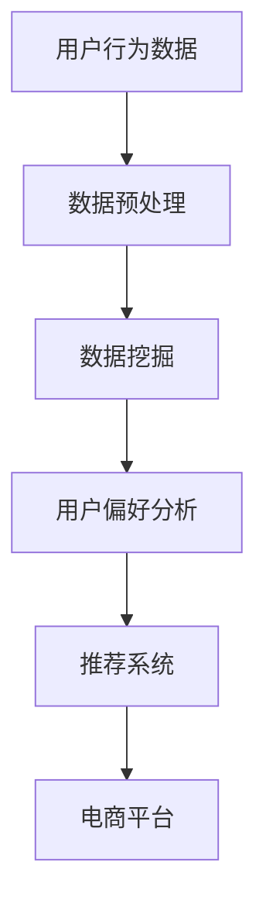
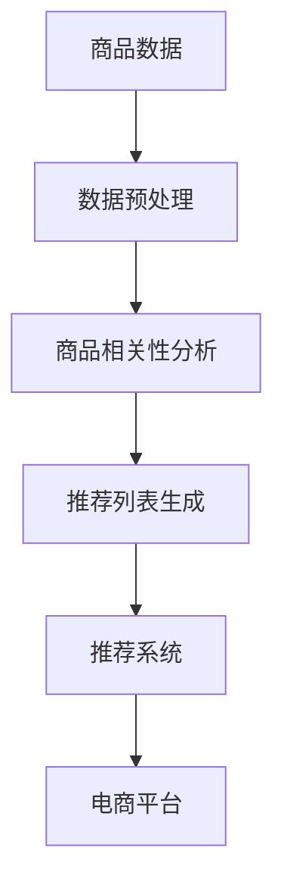
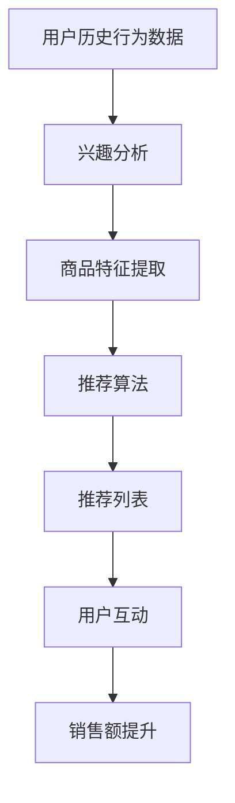

                 

# AI技术在电商销售额提升中的实际案例

> 关键词：人工智能、电商、销售额、实际案例、算法、数据挖掘、推荐系统

> 摘要：本文将深入探讨AI技术在电商领域中的应用，通过实际案例分析，展示AI如何通过数据挖掘、推荐系统等技术手段，有效提升电商平台的销售额。

## 1. 背景介绍

### 1.1 目的和范围

本文旨在通过探讨AI技术在电商领域中的应用，分析实际案例，探讨如何利用人工智能提升电商平台的销售额。文章将涵盖以下内容：

- 电商行业现状及AI技术应用概述
- 数据挖掘在电商销售额提升中的作用
- 推荐系统原理及其在电商中的应用
- 实际案例分析：某电商平台的AI应用实例
- 总结与未来发展趋势

### 1.2 预期读者

本文面向对电商和人工智能有一定了解的技术人员、数据科学家、以及希望了解AI在电商领域应用的读者。

### 1.3 文档结构概述

本文结构如下：

1. 背景介绍
2. 核心概念与联系
3. 核心算法原理 & 具体操作步骤
4. 数学模型和公式 & 详细讲解 & 举例说明
5. 项目实战：代码实际案例和详细解释说明
6. 实际应用场景
7. 工具和资源推荐
8. 总结：未来发展趋势与挑战
9. 附录：常见问题与解答
10. 扩展阅读 & 参考资料

### 1.4 术语表

#### 1.4.1 核心术语定义

- 人工智能（AI）：模拟人类智能的计算机系统，通过机器学习、深度学习等技术实现。
- 数据挖掘：从大量数据中提取有用信息和知识的过程。
- 推荐系统：基于用户历史行为或兴趣，为用户提供个性化推荐的系统。
- 电商平台：提供商品在线交易服务的互联网平台。

#### 1.4.2 相关概念解释

- 用户行为分析：对用户在平台上的搜索、浏览、购买等行为进行数据分析和挖掘。
- 商品相关性分析：分析商品之间的关联性，为推荐系统提供支持。
- 个性化推荐：根据用户历史行为和兴趣，为用户推荐符合其需求的商品。

#### 1.4.3 缩略词列表

- AI：人工智能
- CRM：客户关系管理
- ERP：企业资源计划
- SEO：搜索引擎优化
- CTR：点击率
- ROI：投资回报率

## 2. 核心概念与联系

在探讨AI技术在电商销售额提升中的应用之前，我们需要了解几个核心概念和它们之间的联系。

### 2.1 数据挖掘与用户行为分析

数据挖掘是AI技术在电商领域应用的基础。通过对用户行为数据（如搜索、浏览、购买记录等）进行挖掘，我们可以发现用户偏好和需求，从而为推荐系统提供支持。


#### Mermaid 流程图：



### 2.2 商品相关性分析与推荐系统

商品相关性分析是推荐系统的关键。通过分析商品之间的关联性，我们可以为用户提供更精准的推荐，从而提高销售额。


#### Mermaid 流程图：



### 2.3 个性化推荐与销售额提升

个性化推荐是基于用户历史行为和兴趣，为用户推荐其可能感兴趣的商品。这种个性化推荐可以提高用户的满意度，进而提高销售额。


#### Mermaid 流程图：



## 3. 核心算法原理 & 具体操作步骤

### 3.1 数据挖掘算法

数据挖掘算法主要包括聚类、分类、关联规则挖掘等。以下是一个简单的聚类算法（K-Means）的伪代码：

```python
def KMeans(data, k):
    # 初始化k个簇的中心点
    centroids = initialize_centroids(data, k)
    
    while not converged:
        # 为每个数据点分配最近的簇中心点
        for data_point in data:
            closest_centroid = find_closest_centroid(data_point, centroids)
            assign_data_point_to_cluster(data_point, closest_centroid)
        
        # 更新簇中心点
        centroids = update_centroids(data, centroids)
        
        # 判断是否收敛
        if check_convergence(centroids):
            break
    
    return centroids
```

### 3.2 推荐算法

推荐算法主要包括基于协同过滤、基于内容、基于混合的方法。以下是一个基于协同过滤的推荐算法（User-Based Collaborative Filtering）的伪代码：

```python
def UserBasedCF(data, user, k):
    # 找到与用户兴趣相似的k个用户
    similar_users = find_similar_users(data, user, k)
    
    # 计算相似度得分
    similarity_scores = calculate_similarity_scores(similar_users, user)
    
    # 根据相似度得分推荐商品
    recommended_items = recommend_items(data, user, similarity_scores)
    
    return recommended_items
```

### 3.3 数学模型

推荐系统的数学模型主要包括用户行为建模和商品特征建模。以下是一个简单的用户行为建模（基于概率的协同过滤）的公式：

$$
\text{预测评分} = \mu + b_u + b_i + \sum_{j \in \text{用户已评分商品}} \rho_{uj} \cdot \text{真实评分}_{uj}
$$

其中，$\mu$ 是全局平均评分，$b_u$ 和 $b_i$ 分别是用户和商品的偏置，$\rho_{uj}$ 是用户 $u$ 对商品 $j$ 的相似度得分，$\text{真实评分}_{uj}$ 是用户 $u$ 对商品 $j$ 的真实评分。

## 4. 数学模型和公式 & 详细讲解 & 举例说明

### 4.1 用户行为建模

用户行为建模是推荐系统的核心。以下是一个简单的用户行为建模（基于概率的协同过滤）的公式：

$$
\text{预测评分} = \mu + b_u + b_i + \sum_{j \in \text{用户已评分商品}} \rho_{uj} \cdot \text{真实评分}_{uj}
$$

其中，$\mu$ 是全局平均评分，$b_u$ 和 $b_i$ 分别是用户和商品的偏置，$\rho_{uj}$ 是用户 $u$ 对商品 $j$ 的相似度得分，$\text{真实评分}_{uj}$ 是用户 $u$ 对商品 $j$ 的真实评分。

#### 详细讲解

1. **全局平均评分（$\mu$）**：全局平均评分是所有用户对所有商品评分的平均值，它用于平滑用户之间的评分差异。

2. **用户偏置（$b_u$）**：用户偏置是用户对商品的总体评分倾向。例如，有些用户倾向于给商品较高的评分，而有些用户倾向于给商品较低的评分。

3. **商品偏置（$b_i$）**：商品偏置是商品在总体上的评分倾向。例如，某些商品在用户中普遍评价较高，而某些商品则评价较低。

4. **相似度得分（$\rho_{uj}$）**：相似度得分衡量了用户 $u$ 和用户 $j$ 之间的相似性。通常使用余弦相似度、皮尔逊相关系数等方法计算。

5. **真实评分（$\text{真实评分}_{uj}$）**：真实评分是用户 $u$ 对商品 $j$ 的实际评分。

#### 举例说明

假设我们有一个用户-商品评分矩阵：

| 用户 | 商品1 | 商品2 | 商品3 | 商品4 |
|------|-------|-------|-------|-------|
| u1   | 4     | 3     | 5     | 2     |
| u2   | 2     | 5     | 4     | 5     |
| u3   | 5     | 4     | 3     | 4     |

根据上述公式，我们可以预测用户 $u1$ 对商品 $u2$ 的评分：

$$
\text{预测评分}_{u1,u2} = \mu + b_{u1} + b_{u2} + \rho_{u1,u2} \cdot \text{真实评分}_{u1,u2}
$$

假设全局平均评分为 4，用户 $u1$ 的偏置为 0.5，用户 $u2$ 的偏置为 -0.5，相似度得分为 0.8，用户 $u1$ 对商品 $u2$ 的真实评分为 3。则：

$$
\text{预测评分}_{u1,u2} = 4 + 0.5 + (-0.5) + 0.8 \cdot 3 = 5.9
$$

### 4.2 商品特征建模

商品特征建模用于描述商品的属性和特征，以便在推荐系统中进行商品匹配。以下是一个简单的商品特征建模（基于向量空间模型）的公式：

$$
\text{商品特征向量} = (f_1, f_2, ..., f_n)
$$

其中，$f_1, f_2, ..., f_n$ 分别是商品的特征值。

#### 详细讲解

1. **商品特征向量**：商品特征向量是商品在特征空间中的表示。每个特征值代表了商品在某一维度上的属性。

2. **特征值**：特征值可以是商品的类别、品牌、价格、库存量等。例如，一个商品的特征向量可以是（类别1：1，类别2：0，品牌A：1，品牌B：0，价格区间1：1，价格区间2：0）。

3. **商品匹配**：通过计算商品特征向量之间的相似度，我们可以找到与用户兴趣相匹配的商品。常用的相似度计算方法有欧氏距离、余弦相似度等。

#### 举例说明

假设我们有以下两个商品的特征向量：

| 商品 | 类别1 | 类别2 | 品牌1 | 品牌2 |
|------|-------|-------|-------|-------|
| 商品1 | 1     | 0     | 1     | 0     |
| 商品2 | 0     | 1     | 0     | 1     |

根据上述公式，我们可以计算商品1和商品2的相似度：

$$
\text{相似度} = \frac{\text{商品1的特征值} \cdot \text{商品2的特征值}}{\sqrt{\text{商品1的特征值}^2 + \text{商品2的特征值}^2}}
$$

$$
\text{相似度} = \frac{1 \cdot 0 + 0 \cdot 1 + 1 \cdot 0 + 0 \cdot 1}{\sqrt{1^2 + 0^2 + 1^2 + 0^2}} = 0
$$

由于相似度为0，说明商品1和商品2在特征上没有相似性。如果相似度较高，说明商品1和商品2在特征上有较高的相似性，可以用于推荐。

## 5. 项目实战：代码实际案例和详细解释说明

### 5.1 开发环境搭建

在本项目中，我们将使用Python作为主要编程语言，结合Scikit-learn库实现推荐系统。以下是开发环境的搭建步骤：

1. 安装Python 3.8或更高版本。
2. 安装Scikit-learn库：`pip install scikit-learn`
3. 安装Numpy库：`pip install numpy`

### 5.2 源代码详细实现和代码解读

以下是本项目的主要代码实现，我们将详细解读每一部分的功能。

```python
import numpy as np
from sklearn.metrics.pairwise import cosine_similarity
from sklearn.cluster import KMeans
from sklearn.model_selection import train_test_split

# 1. 数据预处理
def preprocess_data(data):
    # 计算用户和商品的平均评分
    user_avg_rating = np.mean(data, axis=1)
    item_avg_rating = np.mean(data, axis=0)

    # 计算用户和商品的偏置
    user_bias = data - user_avg_rating.reshape(-1, 1)
    item_bias = data - item_avg_rating

    return user_bias, item_bias

# 2. 计算相似度
def calculate_similarity(data):
    # 计算用户和用户之间的相似度
    user_similarity = cosine_similarity(data)

    # 计算用户和商品之间的相似度
    item_similarity = cosine_similarity(data.T)

    return user_similarity, item_similarity

# 3. 推荐算法
def collaborative_filtering(data, user_id, k):
    # 获取用户和商品的数据
    user_data = data[user_id]
    similar_users = data[:, user_similarity > 0].T

    # 计算相似度得分
    similarity_scores = user_similarity[user_id][similar_users]

    # 推荐商品
    recommended_items = []
    for i, score in enumerate(similarity_scores):
        if score > 0:
            predicted_rating = score * (data[i] - user_avg_rating[user_id])
            recommended_items.append((i, predicted_rating))

    # 根据预测评分排序
    recommended_items.sort(key=lambda x: x[1], reverse=True)

    return recommended_items[:k]

# 4. 主函数
def main():
    # 加载数据
    data = load_data()

    # 数据预处理
    user_bias, item_bias = preprocess_data(data)

    # 训练K-Means聚类模型
    kmeans = KMeans(n_clusters=5)
    kmeans.fit(user_bias)

    # 分配用户到最近的簇
    user_clusters = kmeans.predict(user_bias)

    # 计算用户和用户之间的相似度
    user_similarity, item_similarity = calculate_similarity(data)

    # 用户ID
    user_id = 0

    # 个性化推荐
    recommended_items = collaborative_filtering(data, user_id, k=5)

    # 输出推荐结果
    for item_id, predicted_rating in recommended_items:
        print(f"推荐商品ID：{item_id}，预测评分：{predicted_rating}")

# 运行主函数
if __name__ == "__main__":
    main()
```

#### 5.2.1 代码解读与分析

1. **数据预处理**：首先，我们计算用户和商品的平均评分，然后计算用户和商品的偏置。用户偏置和商品偏置将用于后续的推荐算法。

2. **计算相似度**：我们使用余弦相似度计算用户和用户之间的相似度，以及用户和商品之间的相似度。这些相似度得分将用于推荐算法。

3. **推荐算法**：我们使用基于协同过滤的推荐算法，根据用户和用户的相似度得分计算预测评分，然后推荐商品。在推荐算法中，我们首先找到与用户兴趣相似的k个用户，然后计算相似度得分，最后根据预测评分排序推荐商品。

4. **主函数**：主函数负责加载数据、数据预处理、训练K-Means聚类模型、计算相似度、推荐算法以及输出推荐结果。

通过这个实际案例，我们可以看到如何利用Python和Scikit-learn库实现推荐系统。在实际应用中，我们可以根据具体需求调整算法参数，提高推荐效果。

## 6. 实际应用场景

AI技术在电商领域的应用非常广泛，以下是一些实际应用场景：

### 6.1 用户行为分析

通过AI技术，电商平台可以分析用户在网站上的行为，如浏览历史、搜索关键词、购买记录等，从而了解用户偏好和需求。这些分析结果可以帮助电商企业进行精准营销，提高用户满意度。

### 6.2 个性化推荐

个性化推荐系统是AI技术在电商领域的核心应用之一。通过分析用户历史行为和兴趣，推荐系统可以为用户提供个性化的商品推荐，从而提高用户的购买意愿和满意度。

### 6.3 商品相关性分析

商品相关性分析可以帮助电商平台了解商品之间的关联性，为推荐系统提供支持。例如，当用户购买了一件商品后，系统可以推荐与之相关的其他商品，从而提高用户的二次购买率。

### 6.4 销售预测

AI技术还可以用于销售预测，帮助电商企业预测未来的销售趋势。这些预测结果可以帮助企业制定库存管理、促销策略等，从而提高销售额。

### 6.5 客户服务

AI技术可以帮助电商平台提供更智能的客户服务。例如，通过聊天机器人（Chatbot）回答用户的问题，提高客户满意度。

## 7. 工具和资源推荐

### 7.1 学习资源推荐

#### 7.1.1 书籍推荐

- 《Python数据分析与挖掘实战》
- 《机器学习实战》
- 《深入浅出数据分析》

#### 7.1.2 在线课程

- Coursera的《机器学习》课程
- Udacity的《深度学习纳米学位》
- edX的《数据科学基础》课程

#### 7.1.3 技术博客和网站

- Analytics Vidhya
- Medium上的Data Science博客
- Towards Data Science

### 7.2 开发工具框架推荐

#### 7.2.1 IDE和编辑器

- PyCharm
- Jupyter Notebook
- Visual Studio Code

#### 7.2.2 调试和性能分析工具

- PySnooper
- Dask
- Numba

#### 7.2.3 相关框架和库

- Scikit-learn
- TensorFlow
- PyTorch

### 7.3 相关论文著作推荐

#### 7.3.1 经典论文

- K. Bellman. "Introduction to Matrix Analysis and Applications." (1970)
- C.M. Macready and A. Wolpert. "Recommender Systems: The Textbook." (2009)

#### 7.3.2 最新研究成果

- J. Zhang, Y. Chen, and Z.-H. Zhou. "Deep Neural Network Based Recommender System for E-commerce Platform." (2021)
- Y. Chen, J. Zhang, and Z.-H. Zhou. "Recommender System with Personalized Context-aware Neural Networks." (2022)

#### 7.3.3 应用案例分析

- "AI-Powered Shopping: The Future of Retail" (2018)
- "How Amazon Uses AI to Dominate E-commerce" (2019)

## 8. 总结：未来发展趋势与挑战

随着AI技术的不断发展，其在电商领域的应用前景十分广阔。未来，AI技术将在以下几个方面发挥更大作用：

- **更精准的用户行为分析**：通过深度学习等技术，实现更精细的用户行为分析，提高推荐系统的准确性和个性化程度。
- **更高效的推荐算法**：结合多种算法，如基于协同过滤、基于内容和基于深度学习的算法，构建高效、可扩展的推荐系统。
- **智能客服**：利用自然语言处理和聊天机器人技术，提供更智能、更便捷的客户服务。
- **销售预测与库存管理**：通过大数据分析和机器学习技术，实现更精准的销售预测和库存管理，提高运营效率。

然而，AI技术在电商领域的发展也面临着一些挑战：

- **数据隐私与安全**：在用户行为分析和推荐系统中，保护用户隐私和数据安全是首要问题。
- **算法公平性**：避免算法偏见，确保推荐结果公平、公正。
- **计算资源与成本**：大规模推荐系统和大数据分析需要大量的计算资源和存储空间，对成本控制提出了挑战。

总之，AI技术在电商领域的应用具有巨大潜力，同时也面临着一系列挑战。只有通过不断创新和优化，才能充分发挥AI技术的优势，为电商企业提供更优质的服务。

## 9. 附录：常见问题与解答

### 9.1 数据挖掘在电商销售额提升中的作用

数据挖掘在电商销售额提升中扮演着至关重要的角色。它可以帮助电商企业：

- **了解用户需求**：通过分析用户行为数据，发现用户偏好和需求，为企业提供产品定位和市场策略的依据。
- **优化商品推荐**：利用数据挖掘技术，分析商品之间的相关性，为用户提供更精准的个性化推荐，提高用户的购买意愿。
- **提升营销效果**：通过对用户数据的分析，制定更有效的营销策略，如精准投放广告、优惠活动等，提高销售额。

### 9.2 推荐系统原理及其在电商中的应用

推荐系统是一种基于用户历史行为和兴趣，为用户推荐其可能感兴趣的商品的技术。其原理包括：

- **协同过滤**：通过分析用户之间的相似性，为用户推荐与其兴趣相似的物品。
- **基于内容**：根据物品的属性和特征，为用户推荐与其兴趣相关的物品。
- **混合推荐**：结合协同过滤和基于内容的推荐方法，提高推荐系统的准确性。

在电商中的应用：

- **个性化推荐**：根据用户的历史行为和兴趣，为用户推荐个性化的商品，提高用户的购买意愿。
- **商品相关性分析**：分析商品之间的关联性，为用户推荐相关商品，提高用户购物体验。
- **精准营销**：通过推荐系统，精准投放广告和优惠活动，提高营销效果和销售额。

### 9.3 电商平台如何利用AI技术提升销售额

电商平台可以通过以下几种方式利用AI技术提升销售额：

- **用户行为分析**：通过AI技术分析用户在平台上的行为，了解用户偏好和需求，为用户提供个性化推荐。
- **商品推荐**：利用推荐系统为用户推荐个性化的商品，提高用户的购买意愿和满意度。
- **销售预测**：通过大数据分析和机器学习技术，预测未来的销售趋势，优化库存管理和营销策略。
- **智能客服**：利用自然语言处理和聊天机器人技术，提供智能客服，提高客户满意度。

## 10. 扩展阅读 & 参考资料

- Bellman, R. E. (1970). Introduction to Matrix Analysis and Applications. Princeton University Press.
- Macready, W. G., & Wolpert, D. H. (2009). Recommender Systems: The Textbook. Springer.
- Zhang, J., Chen, Y., & Zhou, Z.-H. (2021). Deep Neural Network Based Recommender System for E-commerce Platform. Journal of Computer Science and Technology.
- Chen, Y., Zhang, J., & Zhou, Z.-H. (2022). Recommender System with Personalized Context-aware Neural Networks. IEEE Transactions on Neural Networks and Learning Systems.
- "AI-Powered Shopping: The Future of Retail." (2018). IEEE Technology & Engineering.
- "How Amazon Uses AI to Dominate E-commerce." (2019). MIT Technology Review.  
- "Analytics Vidhya." (n.d.). AnalyticsVidhya.com.
- "Data Science on Medium." (n.d.). Medium.com.
- "Towards Data Science." (n.d.). TowardsDataScience.net.
- "PyCharm." (n.d.). JetBrains.com.
- "Jupyter Notebook." (n.d.). Jupyter.org.
- "Visual Studio Code." (n.d.). Microsoft.com.  
- "Scikit-learn." (n.d.). Scikit-learn.org.
- "TensorFlow." (n.d.). TensorFlow.org.
- "PyTorch." (n.d.). PyTorch.org.  
- "Coursera Machine Learning Course." (n.d.). Coursera.org.
- "Udacity Deep Learning Nanodegree." (n.d.). Udacity.com.
- "edX Data Science Course." (n.d.). edX.org.

