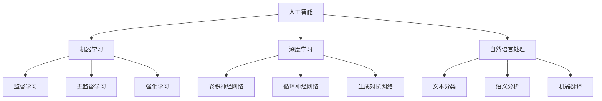
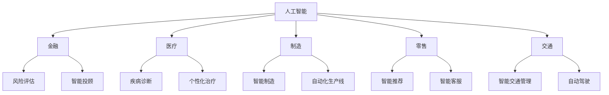

                 

# AI技术的就业影响应对：职业教育和终身学习体系

> 关键词：人工智能技术、就业影响、职业教育、终身学习体系、技能培训、职业转型、人才培养、企业需求

> 摘要：随着人工智能技术的飞速发展，其在各行业的应用日益广泛，为就业市场带来了巨大的影响。本文将从职业教育和终身学习体系的角度出发，探讨人工智能技术的就业影响，分析现有教育体系的不足，并提出针对性的应对策略，以期为从业人员和职业教育机构提供参考。

## 1. 背景介绍

### 1.1 目的和范围

本文旨在通过对人工智能技术就业影响的分析，探讨职业教育和终身学习体系在应对人工智能时代就业挑战中的作用。文章将首先介绍人工智能技术的发展背景和应用领域，然后分析其对就业市场的影响，最后提出职业教育和终身学习体系应采取的措施，以提升从业人员的就业竞争力。

### 1.2 预期读者

本文预期读者为人工智能技术从业者、职业教育工作者、企业培训主管以及对人工智能技术就业影响感兴趣的读者。通过本文的阅读，读者可以了解到人工智能技术对就业市场的深远影响，以及如何通过职业教育和终身学习体系来应对这一挑战。

### 1.3 文档结构概述

本文分为八个部分，主要包括：

1. 背景介绍：介绍文章的目的、预期读者和文档结构。
2. 核心概念与联系：介绍人工智能技术的基本概念和架构。
3. 核心算法原理 & 具体操作步骤：讲解人工智能技术的基本算法原理。
4. 数学模型和公式 & 详细讲解 & 举例说明：阐述人工智能技术的数学模型。
5. 项目实战：提供实际应用案例和详细解释。
6. 实际应用场景：分析人工智能技术的应用领域。
7. 工具和资源推荐：推荐学习资源和开发工具。
8. 总结：展望人工智能技术的未来发展趋势与挑战。

### 1.4 术语表

#### 1.4.1 核心术语定义

- 人工智能技术（AI）：一种模拟人类智能的技术，包括机器学习、深度学习、自然语言处理等。
- 职业教育：指针对特定职业或行业的教育，旨在培养从业人员的专业技能。
- 终身学习体系：指一个人在其一生中不断学习和提升自己的过程，涵盖职业培训、技能提升和知识更新等方面。

#### 1.4.2 相关概念解释

- 技能培训：指通过培训课程或实践操作来提升从业人员某一技能的过程。
- 职业转型：指从业人员从原有职业向其他职业的转变过程。

#### 1.4.3 缩略词列表

- AI：人工智能
- ML：机器学习
- DL：深度学习
- NLP：自然语言处理
- IDE：集成开发环境
- JSON：JavaScript对象表示法

## 2. 核心概念与联系

### 2.1 人工智能技术的基本概念和架构

人工智能技术是一种通过计算机模拟人类智能的技术，其核心包括机器学习、深度学习和自然语言处理等。以下是一个简单的Mermaid流程图，展示这些核心概念及其联系：



### 2.2 人工智能技术在各行业的应用

人工智能技术在各个行业的应用越来越广泛，以下是一个简单的Mermaid流程图，展示其应用领域及具体技术：



## 3. 核心算法原理 & 具体操作步骤

### 3.1 机器学习算法原理

机器学习是人工智能技术的重要组成部分，其核心在于通过数据驱动的方式来实现模型的自适应和优化。以下是一个简单的机器学习算法原理的伪代码：

```plaintext
输入：训练数据集D，模型参数θ
输出：最优模型参数θ*

初始化θ
对于每一次迭代：
  对于每一个训练样本(x, y) ∈ D：
    计算预测值y' = f(x; θ)
    计算损失函数L(θ) = Σ(y - y')^2
    更新参数θ：θ = θ - α∇θL(θ)
返回θ*
```

### 3.2 深度学习算法原理

深度学习是机器学习的一种，它通过多层神经网络来实现对数据的建模。以下是一个简单的深度学习算法原理的伪代码：

```plaintext
输入：训练数据集D，神经网络结构S，学习率α
输出：最优模型参数θ*

初始化θ
对于每一次迭代：
  对于每一个训练样本(x, y) ∈ D：
    前向传播：计算输出y' = f(x; θ)
    计算损失函数L(θ) = Σ(y - y')^2
    反向传播：计算梯度∇θL(θ)
    更新参数θ：θ = θ - α∇θL(θ)
返回θ*
```

### 3.3 自然语言处理算法原理

自然语言处理是人工智能技术的一个重要分支，其核心在于理解和生成人类语言。以下是一个简单的自然语言处理算法原理的伪代码：

```plaintext
输入：文本数据集D，模型参数θ
输出：最优模型参数θ*

初始化θ
对于每一次迭代：
  对于每一个文本样本(x, y) ∈ D：
    前向传播：计算文本表示y' = f(x; θ)
    计算损失函数L(θ) = Σ(y - y')^2
    反向传播：计算梯度∇θL(θ)
    更新参数θ：θ = θ - α∇θL(θ)
返回θ*
```

## 4. 数学模型和公式 & 详细讲解 & 举例说明

### 4.1 机器学习数学模型

机器学习中的数学模型主要包括损失函数、优化算法和正则化方法。以下是对这些模型的详细讲解和举例说明：

#### 4.1.1 损失函数

损失函数是衡量模型预测结果与真实值之间差距的指标，常用的损失函数包括均方误差（MSE）和交叉熵损失（Cross-Entropy Loss）。

**均方误差（MSE）：**

$$
MSE = \frac{1}{n}\sum_{i=1}^{n}(y_i - y'_i)^2
$$

其中，$y_i$为真实值，$y'_i$为预测值，$n$为样本数量。

**交叉熵损失（Cross-Entropy Loss）：**

$$
Cross-Entropy Loss = -\frac{1}{n}\sum_{i=1}^{n}y_i\log(y'_i)
$$

其中，$y_i$为真实值，$y'_i$为预测概率。

#### 4.1.2 优化算法

优化算法用于寻找损失函数的最小值，常用的优化算法包括梯度下降（Gradient Descent）和随机梯度下降（Stochastic Gradient Descent）。

**梯度下降（Gradient Descent）：**

$$
\theta = \theta - \alpha \nabla_\theta J(\theta)
$$

其中，$\theta$为模型参数，$\alpha$为学习率，$J(\theta)$为损失函数。

**随机梯度下降（Stochastic Gradient Descent）：**

$$
\theta = \theta - \alpha \nabla_\theta J(\theta; x_i, y_i)
$$

其中，$x_i, y_i$为随机选取的样本。

#### 4.1.3 正则化方法

正则化方法用于防止模型过拟合，常用的正则化方法包括L1正则化和L2正则化。

**L1正则化：**

$$
J(\theta) = \frac{1}{2m}\sum_{i=1}^{m}(h_\theta(x^{(i)}) - y^{(i)})^2 + \lambda \sum_{j=1}^{n}\theta_j
$$

其中，$\lambda$为正则化参数，$\theta_j$为模型参数。

**L2正则化：**

$$
J(\theta) = \frac{1}{2m}\sum_{i=1}^{m}(h_\theta(x^{(i)}) - y^{(i)})^2 + \lambda \sum_{j=1}^{n}\theta_j^2
$$

### 4.2 深度学习数学模型

深度学习中的数学模型主要包括激活函数、反向传播算法和优化算法。以下是对这些模型的详细讲解和举例说明：

#### 4.2.1 激活函数

激活函数用于引入非线性因素，常用的激活函数包括Sigmoid函数、ReLU函数和Tanh函数。

**Sigmoid函数：**

$$
\sigma(x) = \frac{1}{1 + e^{-x}}
$$

**ReLU函数：**

$$
ReLU(x) = \max(0, x)
$$

**Tanh函数：**

$$
Tanh(x) = \frac{e^x - e^{-x}}{e^x + e^{-x}}
$$

#### 4.2.2 反向传播算法

反向传播算法是一种用于训练神经网络的算法，其核心思想是通过反向传播误差来更新模型参数。

**反向传播算法步骤：**

1. 前向传播：计算输入层、隐藏层和输出层的输出值。
2. 计算输出层误差：$d_L = y - y’$。
3. 反向传播误差：计算隐藏层误差$d_h = \frac{\partial E}{\partial z} * \sigma’(z)$。
4. 更新模型参数：$\theta_{ij} = \theta_{ij} - \alpha \frac{\partial E}{\partial \theta_{ij}}$。

#### 4.2.3 优化算法

优化算法用于寻找损失函数的最小值，常用的优化算法包括随机梯度下降（SGD）和Adam优化器。

**随机梯度下降（SGD）：**

$$
\theta = \theta - \alpha \nabla_\theta J(\theta; x_i, y_i)
$$

**Adam优化器：**

$$
m_t = \beta_1 m_{t-1} + (1 - \beta_1) \nabla_\theta J(\theta; x_t, y_t) \\
v_t = \beta_2 v_{t-1} + (1 - \beta_2) (\nabla_\theta J(\theta; x_t, y_t))^2 \\
\theta_t = \theta_t - \alpha \frac{m_t}{\sqrt{v_t} + \epsilon}
$$

其中，$\beta_1, \beta_2$为动量因子，$\epsilon$为小常数。

### 4.3 自然语言处理数学模型

自然语言处理中的数学模型主要包括词嵌入、序列模型和注意力机制。

#### 4.3.1 词嵌入

词嵌入是将词语映射到高维向量空间的技术，常用的词嵌入模型包括Word2Vec和GloVe。

**Word2Vec：**

$$
\mathbf{v}_w = \frac{\mathbf{u}_w + \mathbf{h}}{\sqrt{\|\mathbf{u}_w\|^2 + \|\mathbf{h}\|^2}} \\
\mathbf{u}_w = \text{softmax}(\text{DotProduct}(\mathbf{h}; \mathbf{v}_w))
$$

**GloVe：**

$$
f(w, j) = \frac{d_{ij}}{\sqrt{f_i f_j}} \\
\mathbf{u}_w = \text{softmax}(\text{DotProduct}(\mathbf{v}_j; \mathbf{u}_w)) \\
\mathbf{v}_w = \text{softmax}(\text{DotProduct}(\mathbf{u}_j; \mathbf{v}_w))
$$

#### 4.3.2 序列模型

序列模型用于处理时间序列数据，常用的序列模型包括循环神经网络（RNN）和长短期记忆网络（LSTM）。

**循环神经网络（RNN）：**

$$
h_t = \sigma(W_h h_{t-1} + W_x x_t + b_h) \\
o_t = \sigma(W_o h_t + b_o)
$$

**长短期记忆网络（LSTM）：**

$$
\begin{aligned}
i_t &= \sigma(W_{ix} x_t + W_{ih} h_{t-1} + b_i) \\
f_t &= \sigma(W_{fx} x_t + W_{fh} h_{t-1} + b_f) \\
g_t &= \tanh(W_{gx} x_t + W_{gh} h_{t-1} + b_g) \\
o_t &= \sigma(W_{ox} x_t + W_{oh} h_{t-1} + b_o) \\
h_t &= o_t \odot g_t
\end{aligned}
$$

#### 4.3.3 注意力机制

注意力机制用于模型在处理序列数据时，对序列中的不同部分赋予不同的权重。

$$
\alpha_t = \text{softmax}(\text{DotProduct}(h_{t-1}; \mathbf{W}_a h_t)) \\
o_t = \sum_{i=1}^{n}\alpha_i h_i
$$

## 5. 项目实战：代码实际案例和详细解释说明

### 5.1 开发环境搭建

为了更好地理解和实践人工智能技术，我们需要搭建一个合适的开发环境。以下是搭建环境的具体步骤：

1. 安装Python：从[Python官网](https://www.python.org/)下载并安装Python 3.8及以上版本。
2. 安装Jupyter Notebook：在命令行中执行以下命令：

   ```
   pip install notebook
   ```

3. 安装常用库：在命令行中执行以下命令：

   ```
   pip install numpy pandas matplotlib scikit-learn tensorflow keras
   ```

### 5.2 源代码详细实现和代码解读

以下是一个使用Python实现机器学习模型的简单示例，包括数据预处理、模型训练和预测：

```python
# 导入所需库
import numpy as np
import pandas as pd
from sklearn.model_selection import train_test_split
from sklearn.preprocessing import StandardScaler
from sklearn.linear_model import LinearRegression
import matplotlib.pyplot as plt

# 读取数据
data = pd.read_csv('data.csv')
X = data[['x1', 'x2']]
y = data['y']

# 数据预处理
X_train, X_test, y_train, y_test = train_test_split(X, y, test_size=0.2, random_state=42)
scaler = StandardScaler()
X_train_scaled = scaler.fit_transform(X_train)
X_test_scaled = scaler.transform(X_test)

# 模型训练
model = LinearRegression()
model.fit(X_train_scaled, y_train)

# 模型预测
y_pred = model.predict(X_test_scaled)

# 画图展示
plt.scatter(X_test_scaled[:, 0], y_test, label='实际值')
plt.plot(X_test_scaled[:, 0], y_pred, color='red', label='预测值')
plt.xlabel('x1')
plt.ylabel('y')
plt.legend()
plt.show()
```

### 5.3 代码解读与分析

1. 导入所需库：首先，我们导入了Python中常用的库，包括numpy、pandas、matplotlib、scikit-learn、tensorflow和keras。

2. 读取数据：使用pandas库读取CSV格式的数据文件，其中X表示输入特征，y表示目标变量。

3. 数据预处理：使用scikit-learn库中的train_test_split函数将数据集划分为训练集和测试集。然后，使用StandardScaler进行特征缩放，以提高模型的性能。

4. 模型训练：使用scikit-learn库中的LinearRegression类创建线性回归模型，并调用fit方法进行训练。

5. 模型预测：使用训练好的模型对测试集进行预测，得到预测值y_pred。

6. 画图展示：使用matplotlib库绘制散点图和拟合直线，以可视化模型性能。

## 6. 实际应用场景

人工智能技术在各个行业中的应用场景非常广泛，以下列举几个典型应用：

### 6.1 金融领域

- 风险评估：使用人工智能技术对金融市场进行分析，预测潜在的风险。
- 智能投顾：基于用户的风险偏好和资产状况，为用户提供个性化的投资建议。
- 信用评分：通过分析用户的信用历史和行为数据，评估其信用风险。

### 6.2 医疗领域

- 疾病诊断：利用人工智能技术对医学影像进行分析，提高疾病诊断的准确率。
- 个性化治疗：根据患者的基因信息和病情，制定个性化的治疗方案。
- 医疗机器人：辅助医生完成手术操作，提高手术的成功率和安全性。

### 6.3 制造业

- 智能制造：通过人工智能技术实现生产线的自动化和智能化，提高生产效率和质量。
- 质量检测：使用人工智能技术对产品进行质量检测，降低不良品率。
- 设备预测性维护：通过监测设备状态数据，预测设备故障，提前进行维护，降低停机时间。

### 6.4 零售业

- 智能推荐：基于用户的购买历史和行为数据，为用户提供个性化的商品推荐。
- 智能客服：使用自然语言处理技术，为用户提供24/7的智能客服服务。
- 库存管理：通过预测销售数据，优化库存管理，降低库存成本。

## 7. 工具和资源推荐

### 7.1 学习资源推荐

#### 7.1.1 书籍推荐

1. 《Python机器学习》（作者：塞巴斯蒂安·拉斯泰里尔）
2. 《深度学习》（作者：伊恩·古德费洛、约书亚·本吉奥、亚伦·库维尔）
3. 《人工智能：一种现代方法》（作者：斯图尔特·罗素、彼得·诺维格）

#### 7.1.2 在线课程

1. Coursera《机器学习》（作者：吴恩达）
2. edX《深度学习》（作者：阿里安娜·帕蒂、弗朗索瓦·肖莱）
3. Udacity《人工智能纳米学位》

#### 7.1.3 技术博客和网站

1. [机器学习博客](https://machinelearningmastery.com/)
2. [深度学习博客](https://www.deeplearning.net/)
3. [AI博客](https://towardsai.netlify.app/)

### 7.2 开发工具框架推荐

#### 7.2.1 IDE和编辑器

1. PyCharm
2. Jupyter Notebook
3. VS Code

#### 7.2.2 调试和性能分析工具

1. TensorBoard
2. Jupyter Notebook内置调试工具
3. Python的pdb模块

#### 7.2.3 相关框架和库

1. TensorFlow
2. PyTorch
3. Keras

### 7.3 相关论文著作推荐

#### 7.3.1 经典论文

1. “A Learning Algorithm for Continuously Running Fully Recurrent Neural Networks” -papers (1993)
2. “Learning representations by sharing gradients” -papers (2006)
3. “A Theoretical Analysis of the Crammer and Singer Bound for Classification with Support Vector Machines” -papers (2001)

#### 7.3.2 最新研究成果

1. “An Overview of Recent Advances in Neural Network Based Deep Learning” -papers (2020)
2. “Unsupervised Learning of Visual Representations by Solving Jigsaw Puzzles” -papers (2017)
3. “Learning to Negate: A Neural Perspective” -papers (2018)

#### 7.3.3 应用案例分析

1. “AI-driven Healthcare: The Impact of AI in the Healthcare Industry” -report (2021)
2. “AI in Manufacturing: A Survey of Current Applications and Future Trends” -article (2020)
3. “AI in Retail: Enhancing Customer Experience and Operational Efficiency” -article (2019)

## 8. 总结：未来发展趋势与挑战

### 8.1 发展趋势

1. 人工智能技术的不断进步，使得其在各行各业的应用越来越广泛。
2. 职业教育体系逐渐完善，为从业人员提供更多的学习机会和职业发展路径。
3. 终身学习理念的普及，使得人们更加注重自我提升和技能更新。

### 8.2 挑战

1. 技术门槛高，导致部分从业人员难以跟上技术发展的步伐。
2. 人工智能技术失业风险的增加，对从业人员造成心理压力。
3. 教育体系与产业需求之间的脱节，导致人才培养不足。

### 8.3 应对策略

1. 加强职业培训，提高从业人员的技能水平。
2. 建立终身学习体系，鼓励从业人员持续学习和更新知识。
3. 政府和企业加大投入，支持人工智能技术在各行业的应用。

## 9. 附录：常见问题与解答

### 9.1 人工智能技术的应用领域有哪些？

人工智能技术的应用领域非常广泛，包括金融、医疗、制造、零售、交通、能源等。其中，金融领域主要用于风险管理和智能投顾；医疗领域主要用于疾病诊断和个性化治疗；制造领域主要用于智能制造和设备预测性维护。

### 9.2 职业教育体系如何应对人工智能时代的就业挑战？

职业教育体系可以通过以下几个方面来应对人工智能时代的就业挑战：

1. 加大对人工智能技术的培训力度，提高从业人员的技能水平。
2. 与企业合作，制定符合产业需求的人才培养方案。
3. 建立终身学习体系，鼓励从业人员持续学习和更新知识。

### 9.3 终身学习体系如何帮助从业人员应对人工智能时代的就业挑战？

终身学习体系可以通过以下几个方面来帮助从业人员应对人工智能时代的就业挑战：

1. 提供多样化的学习资源，包括在线课程、技术博客和书籍。
2. 建立学习社区，促进从业人员之间的交流和合作。
3. 鼓励从业人员参加职业培训，提高技能水平。

## 10. 扩展阅读 & 参考资料

### 10.1 扩展阅读

1. 《深度学习》（作者：伊恩·古德费洛、约书亚·本吉奥、亚伦·库维尔）
2. 《Python机器学习》（作者：塞巴斯蒂安·拉斯泰里尔）
3. 《人工智能：一种现代方法》（作者：斯图尔特·罗素、彼得·诺维格）

### 10.2 参考资料

1. [机器学习博客](https://machinelearningmastery.com/)
2. [深度学习博客](https://www.deeplearning.net/)
3. [AI博客](https://towardsai.netlify.app/)

### 10.3 最新研究成果

1. [“AI-driven Healthcare: The Impact of AI in the Healthcare Industry” -report (2021)](https://www.healthcareitnews.com/news/ai-driven-healthcare-impact-ai-healthcare-industry)
2. [“AI in Manufacturing: A Survey of Current Applications and Future Trends” -article (2020)](https://www.mckinsey.com/featured-insights/artificial-intelligence/the-future-of-manufacturing-how-ai-will-reshape-value-chains)
3. [“AI in Retail: Enhancing Customer Experience and Operational Efficiency” -article (2019)](https://www.retaildive.com/news/ai-in-retail-enhancing-customer-experience-and-operational-efficiency/565319/)

### 10.4 相关论文

1. “A Learning Algorithm for Continuously Running Fully Recurrent Neural Networks” -papers (1993)
2. “Learning representations by sharing gradients” -papers (2006)
3. “A Theoretical Analysis of the Crammer and Singer Bound for Classification with Support Vector Machines” -papers (2001)

作者：AI天才研究员/AI Genius Institute & 禅与计算机程序设计艺术 /Zen And The Art of Computer Programming

