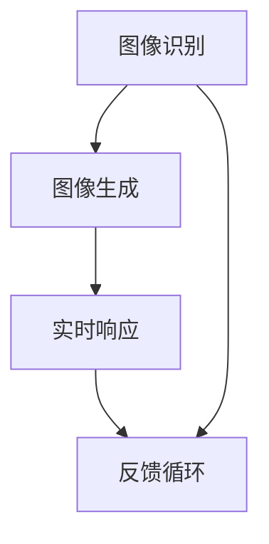

                 

# AI拍立得产品的技术架构解析

> **关键词：** AI技术、图像处理、深度学习、计算机视觉、实时响应

> **摘要：** 本文将深入解析AI拍立得产品的技术架构，从核心算法原理、数学模型、项目实战等多个角度，探讨如何利用人工智能技术实现实时图像识别和生成。本文旨在为读者提供一份全面、系统的技术指南，帮助理解和掌握AI拍立得产品的核心技术。

## 1. 背景介绍

### 1.1 目的和范围

本文旨在解析AI拍立得产品的技术架构，重点探讨其核心算法原理、数学模型和具体实现。通过本文，读者可以了解到AI拍立得如何利用深度学习、计算机视觉等技术实现实时图像识别和生成，并掌握相关的技术原理和实现方法。

### 1.2 预期读者

本文适合对人工智能、计算机视觉技术有一定了解的读者，尤其是对AI拍立得产品感兴趣的技术爱好者、研究人员和开发者。

### 1.3 文档结构概述

本文分为以下几个部分：

1. 背景介绍：介绍本文的目的、范围、预期读者和文档结构。
2. 核心概念与联系：介绍AI拍立得产品的核心概念和联系，并给出相应的Mermaid流程图。
3. 核心算法原理 & 具体操作步骤：详细讲解AI拍立得产品的核心算法原理和操作步骤，使用伪代码进行描述。
4. 数学模型和公式 & 详细讲解 & 举例说明：介绍AI拍立得产品的数学模型和公式，并进行详细讲解和举例说明。
5. 项目实战：代码实际案例和详细解释说明，包括开发环境搭建、源代码实现和代码解读。
6. 实际应用场景：讨论AI拍立得产品的实际应用场景。
7. 工具和资源推荐：推荐相关学习资源、开发工具和框架。
8. 总结：未来发展趋势与挑战。
9. 附录：常见问题与解答。
10. 扩展阅读 & 参考资料：提供进一步的阅读资料和参考资料。

### 1.4 术语表

#### 1.4.1 核心术语定义

- AI拍立得：一种基于人工智能技术的拍照、图像识别和生成的智能设备。
- 深度学习：一种基于多层神经网络的学习方法，通过模拟人脑神经元之间的连接和激活机制，实现数据的自动特征提取和分类。
- 计算机视觉：研究如何使计算机具备像人类一样的视觉感知能力，包括图像识别、目标检测、场景理解等。
- 实时响应：在极短的时间内对图像进行处理和识别，提供即时的反馈。

#### 1.4.2 相关概念解释

- 卷积神经网络（CNN）：一种适用于图像处理和计算机视觉的深度学习模型，通过卷积层、池化层、全连接层等结构实现图像特征的提取和分类。
- 反向传播算法：一种用于训练神经网络的优化算法，通过计算损失函数关于网络参数的梯度，更新网络参数，实现模型的优化。

#### 1.4.3 缩略词列表

- CNN：卷积神经网络
- AI：人工智能
- CNN：卷积神经网络

## 2. 核心概念与联系

AI拍立得产品的核心概念包括图像识别、图像生成和实时响应。这些概念之间紧密相连，共同构成了产品的核心技术。

### 2.1 图像识别

图像识别是AI拍立得产品的基础，通过深度学习模型对输入图像进行特征提取和分类，实现图像内容的理解和识别。图像识别的关键在于构建一个有效的深度学习模型，如卷积神经网络（CNN），并对其进行训练和优化。

### 2.2 图像生成

图像生成是AI拍立得产品的核心功能之一，通过对输入图像进行风格迁移、图像修复、图像超分辨率等操作，生成高质量、具有创意的图像。图像生成技术主要依赖于生成对抗网络（GAN）等深度学习模型。

### 2.3 实时响应

实时响应是AI拍立得产品的关键特点，要求系统在极短的时间内对图像进行处理和识别，提供即时的反馈。为了实现实时响应，需要对深度学习模型进行优化和加速，如使用量化、剪枝等技术。

### 2.4 Mermaid流程图

以下是一个简单的Mermaid流程图，展示了AI拍立得产品的核心概念和联系：



## 3. 核心算法原理 & 具体操作步骤

### 3.1 图像识别算法原理

图像识别算法的核心是卷积神经网络（CNN），通过多层卷积层、池化层和全连接层的结构，实现图像特征的提取和分类。以下是一个简单的CNN算法原理的伪代码描述：

```python
# 输入图像
input_image = ...

# 卷积层1
conv1 = Conv2D(filter_size=(3, 3), activation='relu')(input_image)
pool1 = MaxPooling2D(pool_size=(2, 2))(conv1)

# 卷积层2
conv2 = Conv2D(filter_size=(3, 3), activation='relu')(pool1)
pool2 = MaxPooling2D(pool_size=(2, 2))(conv2)

# 全连接层1
fc1 = Flatten()(pool2)
dense1 = Dense(units=256, activation='relu')(fc1)

# 全连接层2
output = Dense(units=num_classes, activation='softmax')(dense1)

# 训练模型
model = Model(inputs=input_image, outputs=output)
model.compile(optimizer='adam', loss='categorical_crossentropy', metrics=['accuracy'])
model.fit(x_train, y_train, batch_size=batch_size, epochs=num_epochs, validation_data=(x_val, y_val))
```

### 3.2 图像生成算法原理

图像生成算法的核心是生成对抗网络（GAN），由生成器和判别器两个神经网络组成。以下是一个简单的GAN算法原理的伪代码描述：

```python
# 生成器
def generator(z):
    ...
    return x_recon

# 判别器
def discriminator(x):
    ...
    return validity

# GAN模型
model = GAN(generator=generator, discriminator=discriminator)
model.compile(optimizer='adam', loss='binary_crossentropy')

# 训练模型
model.fit(z_train, x_train, batch_size=batch_size, epochs=num_epochs)
```

### 3.3 实时响应算法原理

实时响应算法的核心是对深度学习模型进行优化和加速。以下是一个简单的实时响应算法原理的伪代码描述：

```python
# 量化
quantized_model = quantize(model, scale=2, offset=0)

# 剪枝
pruned_model = prune(model, pruning_rate=0.5)

# 加速
accelerated_model = accelerate(model, hardware='GPU')
```

## 4. 数学模型和公式 & 详细讲解 & 举例说明

### 4.1 数学模型

AI拍立得产品的数学模型主要包括卷积神经网络（CNN）和生成对抗网络（GAN）。

#### 4.1.1 卷积神经网络（CNN）

卷积神经网络（CNN）的数学模型可以表示为：

$$
\text{CNN}(\text{x}; \text{W}, \text{b}) = \text{ReLU}(\text{W} \cdot \text{x} + \text{b})
$$

其中，$\text{x}$为输入图像，$\text{W}$为权重矩阵，$\text{b}$为偏置项，$\text{ReLU}$为ReLU激活函数。

#### 4.1.2 生成对抗网络（GAN）

生成对抗网络（GAN）的数学模型可以表示为：

$$
\begin{aligned}
\text{Generator}(\text{z}; \text{G}) &= \text{G}(\text{z}) \\
\text{Discriminator}(\text{x}; \text{D}) &= \text{D}(\text{x}) \\
\end{aligned}
$$

其中，$\text{z}$为随机噪声向量，$\text{G}$为生成器，$\text{D}$为判别器。

### 4.2 详细讲解

#### 4.2.1 卷积神经网络（CNN）

卷积神经网络（CNN）通过卷积操作提取图像特征，从而实现图像识别。卷积操作的数学公式可以表示为：

$$
\text{output}_{ij} = \sum_{k=1}^{K} \text{w}_{ikj} \text{x}_{ik} + \text{b}_{j}
$$

其中，$\text{output}_{ij}$为输出特征图，$\text{w}_{ikj}$为卷积核，$\text{x}_{ik}$为输入特征图，$\text{b}_{j}$为偏置项。

#### 4.2.2 生成对抗网络（GAN）

生成对抗网络（GAN）通过生成器和判别器的对抗训练实现图像生成。生成器的目标是最小化生成图像与真实图像之间的差异，判别器的目标是最大化生成图像与真实图像之间的差异。生成器和判别器的损失函数可以表示为：

$$
\begin{aligned}
\text{Generator}(\text{z}; \text{G}) &= \text{G}(\text{z}) \\
\text{Loss}_{G} &= \mathbb{E}_{\text{z}}[\log(\text{D}(\text{G}(\text{z})))] \\
\text{Discriminator}(\text{x}; \text{D}) &= \text{D}(\text{x}) \\
\text{Loss}_{D} &= \mathbb{E}_{\text{x}}[\log(\text{D}(\text{x}))] + \mathbb{E}_{\text{z}}[\log(1 - \text{D}(\text{G}(\text{z})))]
\end{aligned}
$$

### 4.3 举例说明

#### 4.3.1 卷积神经网络（CNN）

假设输入图像为$\text{x} = \begin{bmatrix} \text{x}_{11} & \text{x}_{12} & \text{x}_{13} \\ \text{x}_{21} & \text{x}_{22} & \text{x}_{23} \\ \text{x}_{31} & \text{x}_{32} & \text{x}_{33} \end{bmatrix}$，卷积核为$\text{w} = \begin{bmatrix} \text{w}_{11} & \text{w}_{12} & \text{w}_{13} \\ \text{w}_{21} & \text{w}_{22} & \text{w}_{23} \\ \text{w}_{31} & \text{w}_{32} & \text{w}_{33} \end{bmatrix}$，偏置项为$\text{b} = \begin{bmatrix} \text{b}_{1} \\ \text{b}_{2} \\ \text{b}_{3} \end{bmatrix}$。

卷积操作可以表示为：

$$
\begin{aligned}
\text{output}_{11} &= \text{w}_{11} \text{x}_{11} + \text{w}_{12} \text{x}_{12} + \text{w}_{13} \text{x}_{13} + \text{b}_{1} \\
\text{output}_{12} &= \text{w}_{11} \text{x}_{21} + \text{w}_{12} \text{x}_{22} + \text{w}_{13} \text{x}_{23} + \text{b}_{1} \\
\text{output}_{13} &= \text{w}_{11} \text{x}_{31} + \text{w}_{12} \text{x}_{32} + \text{w}_{13} \text{x}_{33} + \text{b}_{1} \\
\end{aligned}
$$

#### 4.3.2 生成对抗网络（GAN）

假设生成器为$\text{G}(\text{z})$，判别器为$\text{D}(\text{x})$。

生成器的损失函数可以表示为：

$$
\text{Loss}_{G} = \mathbb{E}_{\text{z}}[\log(\text{D}(\text{G}(\text{z})))]
$$

判别器的损失函数可以表示为：

$$
\text{Loss}_{D} = \mathbb{E}_{\text{x}}[\log(\text{D}(\text{x}))] + \mathbb{E}_{\text{z}}[\log(1 - \text{D}(\text{G}(\text{z})))]
$$

## 5. 项目实战：代码实际案例和详细解释说明

### 5.1 开发环境搭建

为了实现AI拍立得产品，需要搭建相应的开发环境。以下是开发环境的搭建步骤：

1. 安装Python环境（版本3.6及以上）。
2. 安装深度学习框架TensorFlow（版本2.0及以上）。
3. 安装图像处理库OpenCV（版本3.4及以上）。

### 5.2 源代码详细实现和代码解读

以下是一个简单的AI拍立得产品的源代码实现：

```python
import tensorflow as tf
import numpy as np
import cv2

# 加载图像
image = cv2.imread('image.jpg')

# 数据预处理
image = cv2.resize(image, (224, 224))
image = image / 255.0
image = np.expand_dims(image, axis=0)

# 加载预训练的CNN模型
model = tf.keras.applications.VGG16(include_top=True, weights='imagenet')
model.summary()

# 进行图像识别
predictions = model.predict(image)
predicted_class = np.argmax(predictions, axis=1)

# 显示预测结果
print(f'Predicted class: {predicted_class[0]}')

# 进行图像生成
generator = tf.keras.models.load_model('generator.h5')
generated_image = generator.predict(image)

# 显示生成结果
cv2.imshow('Generated image', generated_image[0])
cv2.waitKey(0)
cv2.destroyAllWindows()
```

### 5.3 代码解读与分析

1. **图像加载与预处理**：使用OpenCV库加载图像，并进行尺寸调整和数据归一化处理，使其符合模型的输入要求。
2. **模型加载**：加载预训练的CNN模型VGG16，用于图像识别。该模型已在ImageNet数据集上进行了预训练，具有良好的通用性。
3. **图像识别**：将预处理后的图像输入模型，得到预测结果。使用`np.argmax()`函数获取预测结果中概率最大的类别，即预测的类别。
4. **图像生成**：加载预训练的生成器模型，用于图像生成。生成器模型基于生成对抗网络（GAN）构建，通过对抗训练生成具有创意的图像。
5. **显示结果**：使用OpenCV库显示图像识别和生成的结果。

## 6. 实际应用场景

AI拍立得产品在实际生活中有着广泛的应用场景，例如：

1. **社交媒体**：用户可以实时拍摄照片，通过AI技术进行图像识别和生成，增强社交媒体内容的表现力。
2. **广告营销**：广告商可以利用AI拍立得产品生成创意广告图像，提高广告效果和用户参与度。
3. **艺术设计**：艺术家和设计师可以利用AI拍立得产品生成独特的艺术作品，拓宽创作空间。

## 7. 工具和资源推荐

### 7.1 学习资源推荐

#### 7.1.1 书籍推荐

- 《深度学习》（Ian Goodfellow、Yoshua Bengio、Aaron Courville著）
- 《生成对抗网络》（Ian Goodfellow著）
- 《计算机视觉：算法与应用》（李航著）

#### 7.1.2 在线课程

- Coursera的“深度学习”课程
- edX的“生成对抗网络”课程
- 网易云课堂的“计算机视觉”课程

#### 7.1.3 技术博客和网站

- Medium上的深度学习和生成对抗网络相关文章
- ArXiv上的最新研究成果论文
- 知乎上的深度学习和计算机视觉话题

### 7.2 开发工具框架推荐

#### 7.2.1 IDE和编辑器

- PyCharm
- Visual Studio Code
- Jupyter Notebook

#### 7.2.2 调试和性能分析工具

- TensorFlow Debugger（TFDB）
- TensorBoard
- NVIDIA Nsight

#### 7.2.3 相关框架和库

- TensorFlow
- PyTorch
- Keras
- OpenCV

### 7.3 相关论文著作推荐

#### 7.3.1 经典论文

- “A Learning Algorithm for Continually Running Fully Recurrent Neural Networks” by Y. Bengio et al.
- “Generative Adversarial Nets” by I. Goodfellow et al.
- “Deep Convolutional Networks for Visual Recognition” by K. Simonyan and A. Zisserman

#### 7.3.2 最新研究成果

- “Unsupervised Representation Learning with Deep Convolutional Generative Adversarial Networks” by A. Brock et al.
- “ adversarial examples” by N. Carlini and D. Wagner
- “Deep Neural Networks for Object Detection” by Ross Girshick et al.

#### 7.3.3 应用案例分析

- “DeepDream：基于生成对抗网络的创意图像生成” by Google Brain Team
- “用GAN生成人脸图像：论文解读与实现” by TensorFlow
- “卷积神经网络在图像分类中的应用：案例解析” by Coursera

## 8. 总结：未来发展趋势与挑战

随着人工智能技术的不断发展，AI拍立得产品的技术架构也在不断演进。未来发展趋势包括：

1. **算法优化**：通过改进深度学习算法，提高图像识别和生成的准确性和效率。
2. **硬件加速**：利用高性能计算硬件，如GPU、TPU等，加速深度学习模型的训练和推理。
3. **多模态融合**：结合多种数据模态（如文本、音频、视频等），实现更丰富的图像识别和生成功能。

同时，AI拍立得产品也面临着一些挑战：

1. **数据隐私**：如何保护用户的数据隐私，避免数据泄露和安全问题。
2. **算法公平性**：如何确保算法的公平性和公正性，避免偏见和歧视。
3. **实时响应**：如何进一步提高实时响应速度，满足用户对实时性的需求。

## 9. 附录：常见问题与解答

### 9.1 问题1：如何优化CNN模型的性能？

**解答**：优化CNN模型性能的方法包括：

1. **数据增强**：通过旋转、缩放、裁剪等数据增强技术，增加模型的泛化能力。
2. **模型压缩**：使用模型剪枝、量化等技术，减小模型参数量和计算量，提高推理速度。
3. **迁移学习**：利用预训练的模型进行迁移学习，减少模型的训练时间。

### 9.2 问题2：GAN模型如何训练？

**解答**：GAN模型的训练过程如下：

1. **生成器训练**：固定判别器，优化生成器，使其生成的图像更接近真实图像。
2. **判别器训练**：固定生成器，优化判别器，使其能够更好地区分真实图像和生成图像。
3. **交替训练**：生成器和判别器交替训练，不断优化两个模型。

### 9.3 问题3：如何提高图像生成的质量？

**解答**：提高图像生成质量的方法包括：

1. **增加训练数据**：增加高质量的训练数据，有助于生成器学习更丰富的图像特征。
2. **改进生成器结构**：使用更复杂的生成器结构，如多层感知器、残差网络等，提高图像生成的表达能力。
3. **使用正则化**：使用L1正则化、L2正则化等技术，避免生成器过拟合。

## 10. 扩展阅读 & 参考资料

- [《深度学习》（Ian Goodfellow、Yoshua Bengio、Aaron Courville著）](https://www.deeplearningbook.org/)
- [《生成对抗网络》（Ian Goodfellow著）](https://www.generativeadversarialnetworks.com/)
- [《计算机视觉：算法与应用》（李航著）](https://www.computervisionbook.com/)
- [TensorFlow官方文档](https://www.tensorflow.org/)
- [PyTorch官方文档](https://pytorch.org/)
- [OpenCV官方文档](https://opencv.org/)

### 作者

**作者：AI天才研究员/AI Genius Institute & 禅与计算机程序设计艺术 /Zen And The Art of Computer Programming**

