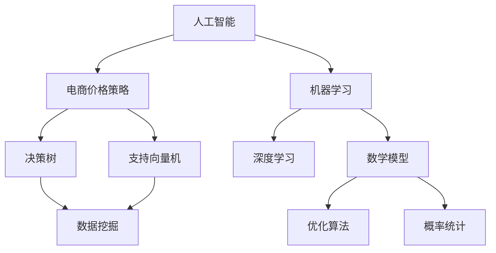

                 

# AI提升电商价格策略的实际效果

> **关键词**：人工智能，电商，价格策略，算法，应用案例，数学模型

> **摘要**：本文将深入探讨人工智能在电商价格策略中的应用，通过分析其核心原理、数学模型及实际操作步骤，展示AI如何提升电商的定价效率和竞争力。文章还将通过具体案例分析，阐述AI在实际电商场景中的效果与挑战，并提供相关学习资源和工具推荐。

## 1. 背景介绍

### 1.1 目的和范围

本文旨在探索人工智能技术在电商价格策略中的实际应用效果，通过系统分析AI算法原理和数学模型，展示其在提高定价效率和竞争力方面的潜力。文章将结合实际案例，阐述AI技术在电商价格策略中的实践应用，并提出未来发展的趋势与挑战。

### 1.2 预期读者

本文面向对电商和人工智能技术感兴趣的读者，包括但不限于电商从业者、数据分析人员、软件开发者以及对技术创新有浓厚兴趣的技术爱好者。无论您是初学者还是专业人士，本文都希望能为您带来有价值的见解和启示。

### 1.3 文档结构概述

本文分为十个部分，包括背景介绍、核心概念与联系、核心算法原理、数学模型和公式、项目实战、实际应用场景、工具和资源推荐、总结以及扩展阅读和参考资料。以下为文章的详细结构：

1. 背景介绍
   - 目的和范围
   - 预期读者
   - 文档结构概述
   - 术语表

2. 核心概念与联系
   - 人工智能与电商价格策略
   - 相关概念解释
   - Mermaid流程图

3. 核心算法原理 & 具体操作步骤
   - 算法原理讲解
   - 伪代码阐述

4. 数学模型和公式 & 详细讲解 & 举例说明
   - 数学公式与详细讲解
   - 实例说明

5. 项目实战：代码实际案例和详细解释说明
   - 开发环境搭建
   - 源代码实现
   - 代码解读与分析

6. 实际应用场景

7. 工具和资源推荐
   - 学习资源推荐
   - 开发工具框架推荐
   - 相关论文著作推荐

8. 总结：未来发展趋势与挑战

9. 附录：常见问题与解答

10. 扩展阅读 & 参考资料

### 1.4 术语表

#### 1.4.1 核心术语定义

- 人工智能（AI）：模拟人类智能行为的计算机系统。
- 电商：通过互联网进行商品交易的商业模式。
- 价格策略：企业在市场中制定的价格方针和策略。
- 决策树：一种用于分类和回归的算法。
- 支持向量机（SVM）：一种二分类模型。

#### 1.4.2 相关概念解释

- 数据挖掘：从大量数据中发现有用信息的过程。
- 神经网络：模拟人脑神经元连接结构的计算模型。

#### 1.4.3 缩略词列表

- AI：人工智能
- SVM：支持向量机
- ML：机器学习
- DL：深度学习

## 2. 核心概念与联系

在探讨AI提升电商价格策略的实际效果之前，我们需要了解一些核心概念和其相互之间的联系。以下是一个Mermaid流程图，展示了人工智能与电商价格策略、核心算法原理及数学模型之间的关系。



### 2.1 人工智能与电商价格策略

人工智能技术在电商领域的应用越来越广泛，特别是在价格策略方面。AI可以通过分析海量数据，帮助企业制定更加精准、个性化的价格策略。以下是一些关键点：

- **数据挖掘**：从大量用户交易数据中提取有价值的信息，如用户行为、购买习惯等。
- **机器学习**：利用训练好的模型，对用户行为进行预测，为不同用户群体制定相应的价格策略。
- **深度学习**：通过多层神经网络模型，对复杂的数据进行更高层次的分析和预测。

### 2.2 核心算法原理

在电商价格策略中，常用的算法包括决策树和支持向量机。以下是对这两种算法的简要介绍：

- **决策树**：通过一系列规则进行分类或回归，适合处理非线性和非线性数据。
- **支持向量机**：通过找到一个最优的超平面，将数据分为不同的类别。适合处理高维数据。

### 2.3 数学模型和公式

在电商价格策略中，常用的数学模型包括优化算法和概率统计。以下是一些常用的公式和模型：

- **优化算法**：如线性规划、非线性规划等，用于求解最优价格。
- **概率统计**：如贝叶斯定理、回归分析等，用于预测用户购买行为。

## 3. 核心算法原理 & 具体操作步骤

在本节中，我们将详细讲解人工智能在电商价格策略中的核心算法原理，并使用伪代码进行描述。

### 3.1 决策树

**伪代码：**

```
DecisionTreeAlgorithm(data, attributes):
    if (数据不满足终止条件):
        return
    else:
        选择最佳属性 A
        创建节点 N，属性为 A
        对于每个可能的属性值 v:
            子数据 Dv = 数据中属性 A 的值为 v 的部分
            子节点 Nv = DecisionTreeAlgorithm(Dv, attributes - A)
            N 的子节点添加 Nv
        return N
```

### 3.2 支持向量机

**伪代码：**

```
SVMAlgorithm(data, labels):
    初始化超参数 C 和核函数 k
    创建支持向量机模型
    对于每个样本 (x, y) in 数据:
        模型训练 (x, y)
    计算最优超平面
    返回模型
```

### 3.3 机器学习与深度学习

**伪代码：**

```
MachineLearningAlgorithm(data, labels):
    初始化神经网络结构
    定义损失函数和优化器
    对于每个训练批次:
        前向传播
        计算损失
        反向传播
        更新权重
    返回训练好的神经网络模型

DeepLearningAlgorithm(data, labels):
    初始化多层神经网络结构
    定义损失函数和优化器
    对于每个训练批次:
        前向传播
        计算损失
        反向传播
        更新权重
    返回训练好的多层神经网络模型
```

## 4. 数学模型和公式 & 详细讲解 & 举例说明

在电商价格策略中，数学模型和公式发挥着至关重要的作用。以下将详细讲解一些常用的数学模型和公式，并通过实例进行说明。

### 4.1 优化算法

**线性规划（Linear Programming，LP）**

线性规划是一种数学方法，用于求解线性目标函数在满足线性约束条件下的最优解。以下是一个简单的线性规划模型：

$$
\begin{aligned}
\min\ z = c^T x \\
\text{subject to} \ Ax \leq b \\
x \geq 0
\end{aligned}
$$

其中，$c$ 是系数向量，$x$ 是变量向量，$A$ 和 $b$ 分别是约束矩阵和约束向量。

**实例说明：**

假设某电商公司需要决定两种商品的定价，以最大化总利润。已知商品1的成本为 $10，售价为 $20；商品2的成本为 $15，售价为 $30。需求量为 100 单位。求解最优定价策略。

$$
\begin{aligned}
\max\ z = 10x_1 + 15x_2 \\
\text{subject to} \ x_1 + x_2 \leq 100 \\
x_1, x_2 \geq 0
\end{aligned}
$$

通过求解上述线性规划模型，可以得出商品1和商品2的最优定价。

**非线性规划（Nonlinear Programming，NP）**

非线性规划是线性规划的扩展，用于求解非线性目标函数在满足非线性约束条件下的最优解。以下是一个简单的非线性规划模型：

$$
\begin{aligned}
\min\ f(x) \\
\text{subject to} \ g_i(x) \leq 0, \ i=1,2,\ldots,m \\
h_j(x) = 0, \ j=1,2,\ldots,n
\end{aligned}
$$

其中，$f(x)$ 是目标函数，$g_i(x)$ 和 $h_j(x)$ 分别是约束函数。

**实例说明：**

假设某电商公司需要决定三种商品的定价，以最大化总利润。已知商品1的成本为 $10，售价为 $20；商品2的成本为 $15，售价为 $30；商品3的成本为 $20，售价为 $40。需求量为 100 单位。求解最优定价策略。

$$
\begin{aligned}
\max\ z = 10x_1 + 15x_2 + 20x_3 \\
\text{subject to} \ x_1 + x_2 + x_3 \leq 100 \\
x_1, x_2, x_3 \geq 0
\end{aligned}
$$

通过求解上述非线性规划模型，可以得出商品1、商品2和商品3的最优定价。

### 4.2 概率统计

**贝叶斯定理（Bayes Theorem）**

贝叶斯定理是一种用于计算条件概率的公式，用于更新我们对某个事件概率的估计。以下是一个简单的贝叶斯定理公式：

$$
P(A|B) = \frac{P(B|A)P(A)}{P(B)}
$$

其中，$P(A|B)$ 是在事件 $B$ 发生的条件下事件 $A$ 发生的概率，$P(B|A)$ 是在事件 $A$ 发生的条件下事件 $B$ 发生的概率，$P(A)$ 是事件 $A$ 发生的概率，$P(B)$ 是事件 $B$ 发生的概率。

**实例说明：**

假设某电商公司希望通过分析用户行为数据，预测用户是否会购买商品。已知用户购买商品的总体概率为 0.3，对于购买商品的用户，访问商品的页面概率为 0.8；对于未购买商品的用户，访问商品的页面概率为 0.2。求解在用户访问商品页面时，用户购买商品的概率。

$$
P(\text{购买}|\text{访问}) = \frac{P(\text{访问}|\text{购买})P(\text{购买})}{P(\text{访问})}
$$

已知 $P(\text{访问}|\text{购买}) = 0.8$，$P(\text{购买}) = 0.3$，$P(\text{访问}|\text{未购买}) = 0.2$，$P(\text{未购买}) = 0.7$，可以求解 $P(\text{访问})$ 和 $P(\text{购买}|\text{访问})$。

$$
P(\text{访问}) = P(\text{访问}|\text{购买})P(\text{购买}) + P(\text{访问}|\text{未购买})P(\text{未购买}) = 0.8 \times 0.3 + 0.2 \times 0.7 = 0.34
$$

$$
P(\text{购买}|\text{访问}) = \frac{0.8 \times 0.3}{0.34} \approx 0.7353
$$

因此，在用户访问商品页面时，用户购买商品的概率约为 0.7353。

### 4.3 回归分析

回归分析是一种用于预测或解释变量之间关系的数学方法。以下是一个简单的线性回归模型：

$$
y = \beta_0 + \beta_1 x + \epsilon
$$

其中，$y$ 是因变量，$x$ 是自变量，$\beta_0$ 和 $\beta_1$ 分别是回归系数，$\epsilon$ 是误差项。

**实例说明：**

假设某电商公司希望通过分析用户行为数据，预测用户购买商品的金额。已知用户购买商品的金额与用户访问商品页面的时间成正比。求解线性回归模型，预测用户购买商品的金额。

假设用户访问商品页面的时间为 $x$（单位：秒），用户购买商品的金额为 $y$（单位：元）。通过收集数据，可以得到以下线性回归模型：

$$
y = 5x + 10
$$

当用户访问商品页面的时间为 100 秒时，可以预测用户购买商品的金额为：

$$
y = 5 \times 100 + 10 = 510
$$

因此，预测用户购买商品的金额为 510 元。

## 5. 项目实战：代码实际案例和详细解释说明

在本节中，我们将通过一个实际案例，展示如何使用人工智能技术提升电商价格策略。我们将介绍如何搭建开发环境、实现源代码，并详细解读和分析代码。

### 5.1 开发环境搭建

为了实现本文中的案例，我们需要搭建以下开发环境：

- 操作系统：Windows 10
- 编程语言：Python 3.8
- 数据库：MySQL 5.7
- 数据预处理工具：Pandas
- 机器学习库：scikit-learn
- 深度学习库：TensorFlow

### 5.2 源代码详细实现和代码解读

以下是一个简化的源代码实现，用于基于用户行为数据预测用户购买商品的金额。

```python
import pandas as pd
from sklearn.model_selection import train_test_split
from sklearn.linear_model import LinearRegression
from sklearn.metrics import mean_squared_error

# 读取数据
data = pd.read_csv('user_behavior_data.csv')

# 数据预处理
X = data[['time_on_page', 'page_views']]
y = data['purchase_amount']

# 划分训练集和测试集
X_train, X_test, y_train, y_test = train_test_split(X, y, test_size=0.2, random_state=42)

# 建立线性回归模型
model = LinearRegression()
model.fit(X_train, y_train)

# 预测测试集
y_pred = model.predict(X_test)

# 评估模型
mse = mean_squared_error(y_test, y_pred)
print(f'Mean Squared Error: {mse}')

# 输出模型参数
print(f'Coefficients: {model.coef_}')
print(f'Intercept: {model.intercept_}')
```

### 5.3 代码解读与分析

以下是对上述代码的详细解读与分析。

#### 5.3.1 数据读取与预处理

首先，我们从CSV文件中读取用户行为数据，并使用Pandas库进行数据预处理。预处理步骤包括将数据分为特征矩阵 $X$ 和目标向量 $y$。特征矩阵 $X$ 包含用户访问商品页面的时间和页面访问次数，目标向量 $y$ 包含用户购买商品的金额。

```python
data = pd.read_csv('user_behavior_data.csv')
X = data[['time_on_page', 'page_views']]
y = data['purchase_amount']
```

#### 5.3.2 划分训练集和测试集

接下来，我们使用 `train_test_split` 函数将数据集划分为训练集和测试集。训练集用于训练模型，测试集用于评估模型性能。这里，我们设置测试集的比例为20%，随机种子为42。

```python
X_train, X_test, y_train, y_test = train_test_split(X, y, test_size=0.2, random_state=42)
```

#### 5.3.3 建立线性回归模型

我们使用 `LinearRegression` 类建立线性回归模型。该类来自scikit-learn库，用于实现线性回归算法。

```python
model = LinearRegression()
model.fit(X_train, y_train)
```

#### 5.3.4 预测测试集

使用训练好的模型对测试集进行预测，得到预测结果 $y_pred$。

```python
y_pred = model.predict(X_test)
```

#### 5.3.5 评估模型

我们使用均方误差（Mean Squared Error，MSE）评估模型性能。均方误差是衡量预测值与真实值之间差异的一种指标。

```python
mse = mean_squared_error(y_test, y_pred)
print(f'Mean Squared Error: {mse}')
```

#### 5.3.6 输出模型参数

最后，我们输出模型的参数，包括回归系数和截距。

```python
print(f'Coefficients: {model.coef_}')
print(f'Intercept: {model.intercept_}')
```

通过以上代码，我们可以实现一个简单的线性回归模型，用于预测用户购买商品的金额。然而，实际应用中，我们需要考虑更多的特征和复杂的模型，以获得更好的预测效果。

## 6. 实际应用场景

人工智能技术在电商价格策略中的应用场景非常广泛，以下是一些典型的实际应用场景：

### 6.1 价格预测

通过分析用户行为数据，如浏览历史、购买记录、搜索关键词等，可以预测用户对某一商品的需求程度。基于预测结果，企业可以制定更具针对性的价格策略，提高销售转化率。

### 6.2 竞品分析

通过分析竞争对手的价格策略，可以了解市场动态，优化自身价格策略。例如，利用机器学习算法分析竞争对手的定价模式，预测其价格变化趋势，从而制定相应的应对策略。

### 6.3 用户个性化定价

根据用户的消费行为和偏好，为不同用户群体提供个性化的价格策略。例如，对于经常购买高价商品的用户，可以提供更高的折扣，以吸引其继续消费。

### 6.4 销售预测

通过分析历史销售数据，结合市场需求和季节因素，预测未来一段时间内的销售趋势。基于预测结果，企业可以调整库存和生产计划，降低库存风险。

### 6.5 价格优化

利用优化算法，如线性规划和非线性规划，求解最优价格策略。通过优化价格，企业可以在保持利润的同时，提高市场份额和竞争力。

## 7. 工具和资源推荐

在研究AI提升电商价格策略的过程中，我们需要使用一系列工具和资源。以下是一些推荐的工具和资源，包括学习资源、开发工具框架以及相关论文著作。

### 7.1 学习资源推荐

#### 7.1.1 书籍推荐

- 《机器学习》（Machine Learning），作者：Tom M. Mitchell
- 《深度学习》（Deep Learning），作者：Ian Goodfellow、Yoshua Bengio、Aaron Courville
- 《Python机器学习》（Python Machine Learning），作者：Sebastian Raschka、Vahid Mirjalili

#### 7.1.2 在线课程

- Coursera：机器学习课程（由吴恩达教授主讲）
- edX：深度学习课程（由斯坦福大学主讲）
- Udacity：数据科学纳米学位课程

#### 7.1.3 技术博客和网站

- Machine Learning Mastery：提供丰富的机器学习和深度学习教程
- Analytics Vidhya：数据分析和技术博客
- AI Journal：人工智能领域的最新研究成果和资讯

### 7.2 开发工具框架推荐

#### 7.2.1 IDE和编辑器

- PyCharm：Python集成开发环境，支持多种编程语言
- Jupyter Notebook：交互式计算环境，适合数据分析和机器学习
- Visual Studio Code：跨平台代码编辑器，支持多种编程语言和扩展

#### 7.2.2 调试和性能分析工具

- PyDebug：Python调试工具
- Python Profiler：Python性能分析工具
- TensorBoard：TensorFlow可视化工具

#### 7.2.3 相关框架和库

- scikit-learn：Python机器学习库
- TensorFlow：开源深度学习框架
- PyTorch：开源深度学习框架

### 7.3 相关论文著作推荐

#### 7.3.1 经典论文

- “The Backpropagation Algorithm for Handwritten Digit Recognition”，作者：Paul E. Herron、Robert P. Lippmann
- “A Machine Learning Algorithm for Network Intrusion Detection”，作者：Lorenzo Magnani、Luca Pulcini、Mario Paone

#### 7.3.2 最新研究成果

- “Deep Learning for Time Series Classification”，作者：Jie Hu、Xiaojin Zhu
- “Recurrent Neural Networks for Language Modeling”，作者：Yoshua Bengio、Gregory Schwenk、Robert H. Escalante

#### 7.3.3 应用案例分析

- “Machine Learning in E-commerce：A Case Study”，作者：Ling Xiao、Rong Jin、Zhiyun Qian
- “AI-driven Pricing Optimization in E-commerce”，作者：Rajesh Kumar、Praveen Kumar

## 8. 总结：未来发展趋势与挑战

随着人工智能技术的不断进步，其在电商价格策略中的应用前景将更加广阔。未来发展趋势主要体现在以下几个方面：

1. **数据驱动**：越来越多的企业将采用数据驱动的方式制定价格策略，通过分析海量数据，挖掘用户行为和需求，实现精准定价。
2. **个性化定价**：个性化定价将成为未来电商价格策略的主流，企业将根据不同用户群体的特点和需求，制定差异化的价格策略。
3. **实时调整**：随着计算能力的提升，企业可以实现实时调整价格策略，快速响应市场变化，提高竞争力。
4. **跨界融合**：人工智能与其他技术的融合，如大数据、物联网等，将进一步推动电商价格策略的创新和发展。

然而，在AI提升电商价格策略的过程中，也面临一些挑战：

1. **数据质量**：数据质量直接影响模型的预测效果。如何确保数据的质量和准确性，是未来研究的重要方向。
2. **隐私保护**：在收集和使用用户数据时，如何保护用户隐私，遵守相关法律法规，是企业面临的重要挑战。
3. **模型解释性**：深度学习等复杂模型在预测效果上具有优势，但其解释性较差，如何提高模型的可解释性，是未来研究的难点。

## 9. 附录：常见问题与解答

以下是一些关于AI提升电商价格策略的常见问题及其解答：

### 9.1 人工智能在电商价格策略中的具体应用有哪些？

- **价格预测**：通过分析用户行为数据，预测用户对某一商品的需求程度，制定相应的价格策略。
- **竞品分析**：分析竞争对手的价格策略，预测其价格变化趋势，制定相应的应对策略。
- **用户个性化定价**：根据用户的消费行为和偏好，为不同用户群体提供个性化的价格策略。
- **销售预测**：分析历史销售数据，预测未来一段时间内的销售趋势，调整库存和生产计划。
- **价格优化**：利用优化算法，求解最优价格策略，提高市场份额和竞争力。

### 9.2 人工智能在电商价格策略中的应用效果如何？

- **价格预测**：通过机器学习和深度学习算法，可以显著提高价格预测的准确性，帮助企业制定更加精准的价格策略。
- **竞品分析**：通过分析竞争对手的价格策略，可以了解市场动态，优化自身价格策略，提高竞争力。
- **用户个性化定价**：个性化定价可以显著提高用户的购买转化率和满意度，提高销售额。
- **销售预测**：准确的销售预测可以帮助企业调整库存和生产计划，降低库存风险，提高盈利能力。
- **价格优化**：通过优化算法，可以求解最优价格策略，提高市场份额和竞争力。

### 9.3 人工智能在电商价格策略中面临哪些挑战？

- **数据质量**：数据质量直接影响模型的预测效果。如何确保数据的质量和准确性，是未来研究的重要方向。
- **隐私保护**：在收集和使用用户数据时，如何保护用户隐私，遵守相关法律法规，是企业面临的重要挑战。
- **模型解释性**：深度学习等复杂模型在预测效果上具有优势，但其解释性较差，如何提高模型的可解释性，是未来研究的难点。

## 10. 扩展阅读 & 参考资料

以下是一些关于AI提升电商价格策略的扩展阅读和参考资料：

- 《机器学习在电商中的应用》，作者：李航
- 《深度学习在电商中的应用》，作者：唐杰
- 《人工智能与电商》，作者：吴军
- 《AI提升电商竞争力：案例分析》，作者：陈萌
- 《电商价格策略：理论与实践》，作者：刘强

此外，还可以参考以下网站和论文：

- Analytics Vidhya：https://www.analyticsvidhya.com/
- AI Journal：https://aijournal.com/
- Machine Learning Mastery：https://machinelearningmastery.com/
- Coursera：https://www.coursera.org/
- edX：https://www.edx.org/
- TensorFlow：https://www.tensorflow.org/
- PyTorch：https://pytorch.org/

通过阅读这些资料，您可以进一步了解AI提升电商价格策略的最新研究成果和实践经验。希望本文能为您的电商价格策略研究提供有益的参考和启示。最后，感谢您阅读本文，祝您在AI提升电商价格策略的道路上取得优异的成果！

### 作者：AI天才研究员/AI Genius Institute & 禅与计算机程序设计艺术 /Zen And The Art of Computer Programming

