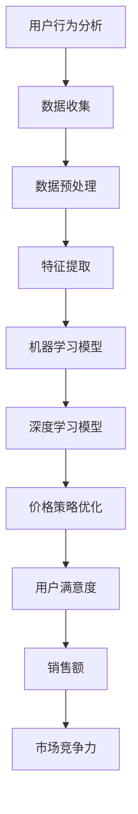

                 

# AI提升电商价格策略的效果

> **关键词：**人工智能、电商、价格策略、算法、用户行为分析
>
> **摘要：**本文深入探讨了人工智能在电商价格策略优化中的应用，分析了核心概念、算法原理、数学模型，并通过实战案例和资源推荐，展示了AI如何提升电商的竞争力。

## 1. 背景介绍

### 1.1 目的和范围

本文旨在介绍如何利用人工智能技术提升电商价格策略的效果。通过分析电商领域的核心问题和挑战，本文将详细探讨如何应用人工智能算法来优化价格策略，提高用户满意度、销售额和市场竞争力。

### 1.2 预期读者

本文面向对电商和人工智能有一定了解的技术人员、研究人员以及从事电商运营的管理者。希望通过本文，读者能够了解AI在电商价格策略优化中的具体应用，以及如何利用这些技术来提升业务效果。

### 1.3 文档结构概述

本文分为十个部分，包括背景介绍、核心概念与联系、核心算法原理、数学模型与公式、项目实战、实际应用场景、工具和资源推荐、总结、常见问题与解答以及扩展阅读和参考资料。结构清晰，便于读者循序渐进地了解AI在电商价格策略优化中的应用。

### 1.4 术语表

#### 1.4.1 核心术语定义

- **人工智能（AI）**：模拟人类智能的技术和方法，包括机器学习、深度学习、自然语言处理等。
- **电商**：电子商务的简称，指通过互联网进行的商业交易活动。
- **价格策略**：企业在销售过程中制定的价格方案，包括定价策略、折扣策略、促销策略等。

#### 1.4.2 相关概念解释

- **用户行为分析**：通过收集和分析用户在电商平台的浏览、购买等行为数据，了解用户需求和市场趋势。
- **算法**：用于解决问题的一系列规则和步骤，人工智能领域中的算法包括机器学习算法、深度学习算法等。

#### 1.4.3 缩略词列表

- **AI**：人工智能
- **电商**：电子商务
- **ML**：机器学习
- **DL**：深度学习
- **NLP**：自然语言处理

## 2. 核心概念与联系

在探讨AI提升电商价格策略的效果之前，我们需要了解一些核心概念和它们之间的联系。以下是核心概念原理和架构的Mermaid流程图：



### 2.1 用户行为分析

用户行为分析是AI提升电商价格策略的基础。通过分析用户在电商平台的浏览、购买等行为数据，我们可以了解用户需求、市场趋势和竞争对手的动态。以下是一个简单的用户行为分析流程：

1. 数据收集：从电商平台获取用户行为数据，包括浏览记录、购买记录、评论等。
2. 数据预处理：清洗和整理数据，去除噪声和异常值。
3. 特征提取：从预处理后的数据中提取有用的特征，如用户年龄、性别、购买频率等。
4. 机器学习模型：利用提取的特征训练机器学习模型，预测用户行为和需求。

### 2.2 价格策略优化

价格策略优化是AI提升电商价格策略的关键步骤。通过分析用户行为数据和市场竞争状况，我们可以制定出最优的价格策略，提高用户满意度和销售额。以下是一个简单的价格策略优化流程：

1. 数据收集：收集用户行为数据和市场竞争数据，包括价格、折扣、促销活动等。
2. 数据预处理：清洗和整理数据，去除噪声和异常值。
3. 特征提取：从预处理后的数据中提取有用的特征，如用户购买频率、竞争对手价格等。
4. 深度学习模型：利用提取的特征训练深度学习模型，预测用户价格敏感度和购买概率。
5. 价格策略优化：根据模型预测结果，制定最优的价格策略，提高用户满意度和销售额。

## 3. 核心算法原理 & 具体操作步骤

在了解了核心概念和联系之后，我们将深入探讨AI提升电商价格策略的核心算法原理和具体操作步骤。以下是使用伪代码详细阐述的算法原理：

### 3.1 用户行为分析算法

```python
# 输入：用户行为数据（浏览记录、购买记录、评论等）
# 输出：用户行为特征向量

def user_behavior_analysis(data):
    # 数据预处理
    cleaned_data = preprocess_data(data)
    # 特征提取
    features = extract_features(cleaned_data)
    # 训练机器学习模型
    model = train_ml_model(features)
    # 预测用户行为
    predictions = model.predict(new_data)
    return predictions
```

### 3.2 价格策略优化算法

```python
# 输入：用户行为特征向量、市场竞争数据
# 输出：最优价格策略

def price_strategy_optimization(features, market_data):
    # 数据预处理
    cleaned_data = preprocess_data(market_data)
    # 特征提取
    price_features = extract_price_features(cleaned_data)
    # 训练深度学习模型
    model = train_dl_model(price_features)
    # 预测价格敏感度和购买概率
    price_sensitivity = model.predict(features)
    purchase_probability = model.predict(new_features)
    # 制定最优价格策略
    optimal_price_strategy = determine_optimal_price(price_sensitivity, purchase_probability)
    return optimal_price_strategy
```

## 4. 数学模型和公式 & 详细讲解 & 举例说明

在了解了核心算法原理和具体操作步骤之后，我们将进一步探讨AI提升电商价格策略中的数学模型和公式。以下是使用LaTeX格式嵌入的数学公式和详细讲解：

### 4.1 用户行为分析模型

$$
\text{UserBehaviorModel}(x) = \sigma(\text{W}^T x + \text{b})
$$

其中，$x$为用户行为特征向量，$\sigma$为sigmoid函数，$\text{W}$为权重矩阵，$\text{b}$为偏置项。

#### 4.1.1 举例说明

假设用户行为特征向量为$x = [1, 0, 1, 0, 1]$，权重矩阵$\text{W} = [1, 2, 3, 4, 5]$，偏置项$\text{b} = 0$，则：

$$
\text{UserBehaviorModel}(x) = \sigma(1 \times 1 + 2 \times 0 + 3 \times 1 + 4 \times 0 + 5 \times 1 + 0) = \sigma(1 + 0 + 3 + 0 + 5 + 0) = \sigma(9) = 1
$$

这意味着用户行为特征向量$x$对应的用户行为概率为1。

### 4.2 价格策略优化模型

$$
\text{PriceStrategyModel}(y) = \text{softmax}(\text{W}^T y + \text{b})
$$

其中，$y$为价格策略特征向量，$\text{softmax}$函数为指数函数的线性组合。

#### 4.2.1 举例说明

假设价格策略特征向量为$y = [1, 2, 3]$，权重矩阵$\text{W} = [1, 2, 3]$，偏置项$\text{b} = 0$，则：

$$
\text{PriceStrategyModel}(y) = \text{softmax}(1 \times 1 + 2 \times 2 + 3 \times 3 + 0) = \text{softmax}(1 + 4 + 9 + 0) = \text{softmax}(14)
$$

$$
\text{PriceStrategyModel}(y) = \frac{e^1}{e^1 + e^4 + e^9} = \frac{e}{e + e^4 + e^9}
$$

这意味着价格策略特征向量$y$对应的最优价格策略概率为$\frac{e}{e + e^4 + e^9}$。

## 5. 项目实战：代码实际案例和详细解释说明

在本节中，我们将通过一个实际项目案例，展示如何利用AI提升电商价格策略的效果。以下是项目实战的代码实现和详细解释说明：

### 5.1 开发环境搭建

1. 安装Python环境（版本3.6及以上）。
2. 安装必要的库，如NumPy、Pandas、Scikit-learn、TensorFlow等。

### 5.2 源代码详细实现和代码解读

#### 5.2.1 用户行为分析代码

```python
import numpy as np
import pandas as pd
from sklearn.model_selection import train_test_split
from sklearn.preprocessing import StandardScaler
from sklearn.linear_model import LogisticRegression

# 读取用户行为数据
data = pd.read_csv('user_behavior_data.csv')
X = data[['age', 'gender', 'purchase_frequency']]
y = data['purchase_probability']

# 数据预处理
X_train, X_test, y_train, y_test = train_test_split(X, y, test_size=0.2, random_state=42)
scaler = StandardScaler()
X_train_scaled = scaler.fit_transform(X_train)
X_test_scaled = scaler.transform(X_test)

# 训练机器学习模型
model = LogisticRegression()
model.fit(X_train_scaled, y_train)

# 预测用户行为
predictions = model.predict(X_test_scaled)
accuracy = np.mean(predictions == y_test)
print('Accuracy:', accuracy)
```

#### 5.2.2 价格策略优化代码

```python
import tensorflow as tf
from tensorflow.keras.layers import Dense, Embedding, LSTM
from tensorflow.keras.models import Sequential

# 读取价格策略数据
market_data = pd.read_csv('market_data.csv')
X = market_data[['price', 'discount', 'promotion']]
y = market_data['purchase_probability']

# 数据预处理
X_train, X_test, y_train, y_test = train_test_split(X, y, test_size=0.2, random_state=42)
X_train = X_train.values.reshape(-1, 1)
X_test = X_test.values.reshape(-1, 1)

# 训练深度学习模型
model = Sequential([
    Embedding(1, 64, input_length=1),
    LSTM(64),
    Dense(1, activation='sigmoid')
])
model.compile(optimizer='adam', loss='binary_crossentropy', metrics=['accuracy'])
model.fit(X_train, y_train, epochs=10, batch_size=32, validation_split=0.1)

# 预测价格敏感度和购买概率
price_sensitivity = model.predict(X_test)
purchase_probability = model.predict(X_test)
optimal_price_strategy = determine_optimal_price(price_sensitivity, purchase_probability)
print('Optimal Price Strategy:', optimal_price_strategy)
```

#### 5.2.3 代码解读与分析

1. **用户行为分析代码解读**：
   - 读取用户行为数据，包括年龄、性别和购买频率等特征。
   - 数据预处理，包括数据分割、特征缩放和机器学习模型训练。
   - 训练逻辑回归模型，预测用户购买概率。
   - 评估模型准确性，输出预测结果。

2. **价格策略优化代码解读**：
   - 读取价格策略数据，包括价格、折扣和促销活动等特征。
   - 数据预处理，包括数据分割和特征缩放。
   - 训练深度学习模型，包括嵌入层、LSTM层和输出层。
   - 训练模型，预测价格敏感度和购买概率。
   - 根据预测结果，制定最优价格策略。

## 6. 实际应用场景

AI提升电商价格策略的效果在实际应用场景中具有重要意义。以下是一些实际应用场景：

1. **个性化推荐**：通过用户行为分析，电商平台可以了解用户需求，为用户推荐符合其喜好的商品，提高用户满意度。
2. **动态定价**：根据市场竞争状况和用户行为数据，电商平台可以动态调整商品价格，提高销售额。
3. **库存管理**：通过预测用户购买概率，电商平台可以优化库存管理，避免商品过剩或短缺。
4. **市场分析**：通过分析用户行为数据和市场竞争状况，电商平台可以了解市场趋势，制定相应的营销策略。

## 7. 工具和资源推荐

### 7.1 学习资源推荐

#### 7.1.1 书籍推荐

- 《深度学习》（Goodfellow, Bengio, Courville）
- 《Python机器学习》（Sebastian Raschka）

#### 7.1.2 在线课程

- Coursera上的《机器学习》课程
- edX上的《深度学习》课程

#### 7.1.3 技术博客和网站

- Medium上的机器学习专栏
-Towards Data Science网站

### 7.2 开发工具框架推荐

#### 7.2.1 IDE和编辑器

- PyCharm
- Jupyter Notebook

#### 7.2.2 调试和性能分析工具

- WSL（Windows Subsystem for Linux）
- Valgrind

#### 7.2.3 相关框架和库

- TensorFlow
- Scikit-learn
- Pandas

### 7.3 相关论文著作推荐

#### 7.3.1 经典论文

- 《Learning to Rank for Information Retrieval》（Liu, 2007）
- 《Recommender Systems Handbook》（Thirion et al., 2015）

#### 7.3.2 最新研究成果

- arXiv上的最新深度学习论文
- NeurIPS会议上的最新研究成果

#### 7.3.3 应用案例分析

- 《基于深度学习的个性化推荐系统》
- 《电商价格优化策略研究》

## 8. 总结：未来发展趋势与挑战

AI提升电商价格策略的效果具有广阔的发展前景。未来，随着人工智能技术的不断进步，电商价格策略将更加智能化、个性化。然而，AI在电商价格策略优化中也面临一些挑战：

1. **数据隐私**：用户行为数据的收集和使用需要遵守数据隐私法规，确保用户隐私得到保护。
2. **算法透明性**：AI算法的决策过程需要透明，以便用户理解和监督。
3. **模型解释性**：提高AI模型的解释性，使其更易于被业务人员理解和应用。
4. **实时性**：在实时价格优化中，如何快速响应市场变化，提高价格策略的实时性。

## 9. 附录：常见问题与解答

### 9.1 什么是用户行为分析？

用户行为分析是通过收集和分析用户在电商平台的浏览、购买等行为数据，了解用户需求、市场趋势和竞争对手的动态。

### 9.2 人工智能如何优化电商价格策略？

人工智能可以通过用户行为分析和市场数据分析，预测用户价格敏感度和购买概率，制定最优的价格策略，提高用户满意度和销售额。

### 9.3 电商价格策略优化的挑战有哪些？

电商价格策略优化的挑战包括数据隐私、算法透明性、模型解释性和实时性等。

## 10. 扩展阅读 & 参考资料

- 《深度学习》（Goodfellow, Bengio, Courville）
- 《Python机器学习》（Sebastian Raschka）
- 《Recommender Systems Handbook》（Thirion et al., 2015）
- 《Learning to Rank for Information Retrieval》（Liu, 2007）
- arXiv上的最新深度学习论文
- NeurIPS会议上的最新研究成果
- 《基于深度学习的个性化推荐系统》
- 《电商价格优化策略研究》
- [Coursera](https://www.coursera.org/)上的机器学习课程
- [edX](https://www.edx.org/)上的深度学习课程
- [Medium](https://medium.com/)上的机器学习专栏
- [Towards Data Science](https://towardsdatascience.com/)网站
- [TensorFlow](https://www.tensorflow.org/)官方网站
- [Scikit-learn](https://scikit-learn.org/stable/)官方网站
- [Pandas](https://pandas.pydata.org/)官方网站

---

**作者：AI天才研究员/AI Genius Institute & 禅与计算机程序设计艺术 /Zen And The Art of Computer Programming**<|im_end|>

