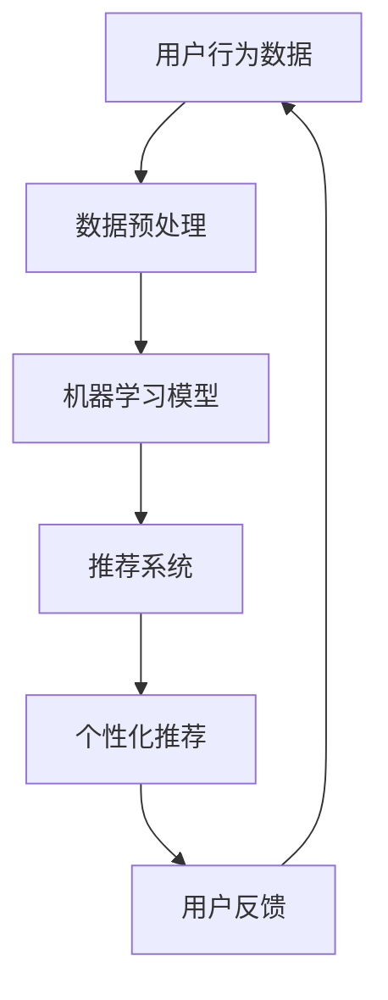

                 

# AI提升电商平台运营效率

> **关键词：人工智能、电商平台、运营效率、机器学习、推荐系统、数据分析**
> 
> **摘要：本文将探讨人工智能技术在电商平台运营中的应用，特别是如何通过机器学习和推荐系统提升电商平台的运营效率。文章将详细分析人工智能的核心概念、核心算法原理、数学模型、项目实战，以及未来发展趋势与挑战。**

## 1. 背景介绍

### 1.1 目的和范围

本文旨在探讨人工智能技术在电商平台运营中的应用，重点分析如何通过机器学习和推荐系统提升电商平台的运营效率。随着互联网的迅猛发展，电商平台已成为现代商业不可或缺的一部分。然而，如何在激烈的竞争中脱颖而出，成为每个电商平台必须面对的挑战。人工智能技术的引入，为电商平台提供了新的解决方案。

本文将覆盖以下内容：

- 人工智能在电商平台运营中的核心概念和原理
- 核心算法原理与具体操作步骤
- 数学模型和公式的详细讲解
- 实际应用场景及工具和资源推荐
- 未来发展趋势与挑战

### 1.2 预期读者

- 对人工智能技术有基本了解的技术爱好者
- 电商平台运营人员和技术人员
- 对人工智能在商业领域应用感兴趣的研究者

### 1.3 文档结构概述

本文分为十个部分，具体结构如下：

- 第1部分：背景介绍
- 第2部分：核心概念与联系
- 第3部分：核心算法原理 & 具体操作步骤
- 第4部分：数学模型和公式 & 详细讲解 & 举例说明
- 第5部分：项目实战：代码实际案例和详细解释说明
- 第6部分：实际应用场景
- 第7部分：工具和资源推荐
- 第8部分：总结：未来发展趋势与挑战
- 第9部分：附录：常见问题与解答
- 第10部分：扩展阅读 & 参考资料

### 1.4 术语表

#### 1.4.1 核心术语定义

- **人工智能（AI）**：一种模拟人类智能行为的计算机技术。
- **机器学习（ML）**：一种人工智能的分支，通过数据训练算法，使计算机能够自主学习和改进。
- **推荐系统（RS）**：一种根据用户行为和历史数据，为用户提供个性化推荐的系统。
- **电商平台**：一种在线销售商品的电子商务平台。
- **运营效率**：衡量电商平台运营效果的重要指标，包括商品推荐、订单处理、客户服务等。

#### 1.4.2 相关概念解释

- **深度学习（DL）**：一种基于多层神经网络的学习方法，能够自动提取数据特征。
- **协同过滤（CF）**：一种推荐系统算法，通过分析用户行为和物品属性，为用户推荐相似物品。
- **特征工程（FE）**：通过提取和处理数据特征，提高模型性能的过程。

#### 1.4.3 缩略词列表

- **AI**：人工智能
- **ML**：机器学习
- **DL**：深度学习
- **CF**：协同过滤
- **RS**：推荐系统
- **API**：应用程序接口

## 2. 核心概念与联系

在深入探讨人工智能技术在电商平台运营中的应用之前，我们需要了解一些核心概念和它们之间的联系。

### 2.1 人工智能在电商平台中的角色

人工智能在电商平台中的角色主要体现在以下几个方面：

- **用户行为分析**：通过分析用户的浏览、购买等行为，为用户提供个性化推荐。
- **商品推荐**：利用机器学习算法，根据用户兴趣和历史数据，为用户推荐可能的购买商品。
- **订单处理**：自动化订单处理，提高订单处理速度和准确率。
- **客户服务**：通过智能客服系统，提供24/7的在线客服服务，提高用户满意度。

### 2.2 机器学习在电商平台中的应用

机器学习在电商平台中的应用主要体现在以下几个方面：

- **用户行为预测**：通过分析用户的历史行为数据，预测用户可能的购买行为。
- **商品推荐**：利用协同过滤、深度学习等算法，为用户提供个性化的商品推荐。
- **异常检测**：通过分析用户行为和订单数据，识别潜在的欺诈行为。

### 2.3 推荐系统在电商平台中的应用

推荐系统在电商平台中的应用主要体现在以下几个方面：

- **个性化推荐**：根据用户兴趣和购买历史，为用户推荐相关的商品。
- **交叉销售**：通过分析用户购买的商品，推荐其他相关的商品。
- **推荐效果评估**：通过评估推荐系统的效果，持续优化推荐算法。

### 2.4 人工智能、机器学习和推荐系统之间的联系

人工智能、机器学习和推荐系统之间有着紧密的联系。人工智能为机器学习和推荐系统提供了基础技术支持，而机器学习和推荐系统则是人工智能在特定领域的应用。具体来说，机器学习算法通过分析大量数据，提取有用特征，为推荐系统提供支持；推荐系统则利用这些特征，为用户提供个性化的服务。

### 2.5 Mermaid 流程图

以下是一个简化的Mermaid流程图，展示了人工智能、机器学习和推荐系统在电商平台中的应用流程。



## 3. 核心算法原理 & 具体操作步骤

在了解了人工智能、机器学习和推荐系统在电商平台中的应用后，我们将深入探讨这些算法的核心原理和具体操作步骤。

### 3.1 机器学习算法原理

机器学习算法的核心原理是通过对历史数据的分析和建模，预测未来的行为。在电商平台中，常用的机器学习算法包括协同过滤、深度学习和决策树等。

#### 3.1.1 协同过滤算法原理

协同过滤算法是一种基于用户行为和物品属性的推荐算法。它的核心思想是通过分析用户对物品的评分或行为，找出相似的用户或物品，为用户提供个性化推荐。

具体操作步骤如下：

1. **用户行为数据收集**：收集用户在平台上的行为数据，如浏览记录、购买历史等。
2. **数据预处理**：对收集到的用户行为数据进行清洗、去重和处理，确保数据质量。
3. **相似度计算**：计算用户之间的相似度，常用的方法包括余弦相似度、皮尔逊相关系数等。
4. **推荐生成**：根据相似度计算结果，为用户推荐相似度较高的物品。

伪代码如下：

```python
# 输入：用户行为数据矩阵U，物品属性数据矩阵V
# 输出：推荐结果矩阵R

# 步骤1：数据预处理
U_clean = preprocess(U)

# 步骤2：相似度计算
similarity_matrix = compute_similarity(U_clean)

# 步骤3：推荐生成
R = generate_recommendations(similarity_matrix, U_clean)
```

#### 3.1.2 深度学习算法原理

深度学习算法是一种基于多层神经网络的学习方法，能够自动提取数据特征。在电商平台中，深度学习算法常用于用户行为预测和商品推荐。

具体操作步骤如下：

1. **数据收集**：收集用户在平台上的行为数据，如浏览记录、购买历史等。
2. **数据预处理**：对收集到的用户行为数据进行清洗、去重和处理，确保数据质量。
3. **构建模型**：定义深度学习模型的结构，如卷积神经网络（CNN）、循环神经网络（RNN）等。
4. **模型训练**：使用预处理后的数据训练深度学习模型，优化模型参数。
5. **模型评估**：使用测试数据评估模型性能，调整模型参数。
6. **预测生成**：使用训练好的模型，预测用户未来的行为。

伪代码如下：

```python
# 输入：用户行为数据集D，标签数据集L
# 输出：训练好的深度学习模型M

# 步骤1：数据预处理
D_processed = preprocess(D)

# 步骤2：构建模型
M = build_model()

# 步骤3：模型训练
M.train(D_processed, L)

# 步骤4：模型评估
M.evaluate(D_processed, L)

# 步骤5：预测生成
predictions = M.predict(D_processed)
```

#### 3.1.3 决策树算法原理

决策树算法是一种基于特征划分的树形结构模型，能够将数据划分为不同的类别或数值。在电商平台中，决策树算法常用于用户行为预测和商品推荐。

具体操作步骤如下：

1. **数据收集**：收集用户在平台上的行为数据，如浏览记录、购买历史等。
2. **数据预处理**：对收集到的用户行为数据进行清洗、去重和处理，确保数据质量。
3. **特征选择**：选择对用户行为预测和商品推荐具有重要意义的特征。
4. **构建决策树**：使用ID3、C4.5等算法构建决策树模型。
5. **模型训练**：使用预处理后的数据训练决策树模型，优化模型参数。
6. **模型评估**：使用测试数据评估模型性能，调整模型参数。
7. **预测生成**：使用训练好的模型，预测用户未来的行为。

伪代码如下：

```python
# 输入：用户行为数据集D，标签数据集L
# 输出：训练好的决策树模型T

# 步骤1：数据预处理
D_processed = preprocess(D)

# 步骤2：特征选择
selected_features = select_features(D_processed, L)

# 步骤3：构建决策树
T = build_decision_tree(selected_features)

# 步骤4：模型训练
T.train(D_processed, L)

# 步骤5：模型评估
T.evaluate(D_processed, L)

# 步骤6：预测生成
predictions = T.predict(D_processed)
```

### 3.2 推荐系统算法原理

推荐系统算法的核心目标是根据用户的行为和偏好，为用户推荐相关的商品。常用的推荐系统算法包括基于内容的推荐、基于协同过滤的推荐和混合推荐等。

#### 3.2.1 基于内容的推荐算法原理

基于内容的推荐算法是根据用户的历史行为和偏好，推荐与用户兴趣相关的商品。具体操作步骤如下：

1. **数据收集**：收集用户在平台上的行为数据，如浏览记录、购买历史等。
2. **数据预处理**：对收集到的用户行为数据进行清洗、去重和处理，确保数据质量。
3. **特征提取**：从用户行为数据中提取特征，如商品类别、品牌、价格等。
4. **内容相似度计算**：计算用户兴趣特征和商品特征之间的相似度，常用的方法包括余弦相似度、欧氏距离等。
5. **推荐生成**：根据相似度计算结果，为用户推荐相似度较高的商品。

伪代码如下：

```python
# 输入：用户兴趣特征矩阵U，商品特征矩阵V
# 输出：推荐结果矩阵R

# 步骤1：数据预处理
U_clean = preprocess(U)
V_clean = preprocess(V)

# 步骤2：特征提取
user_interests = extract_interests(U_clean)
item_features = extract_features(V_clean)

# 步骤3：内容相似度计算
similarity_matrix = compute_similarity(user_interests, item_features)

# 步骤4：推荐生成
R = generate_recommendations(similarity_matrix, U_clean)
```

#### 3.2.2 基于协同过滤的推荐算法原理

基于协同过滤的推荐算法是根据用户的历史行为和偏好，推荐与用户相似的其他用户的喜欢商品。具体操作步骤如下：

1. **用户行为数据收集**：收集用户在平台上的行为数据，如浏览记录、购买历史等。
2. **数据预处理**：对收集到的用户行为数据进行清洗、去重和处理，确保数据质量。
3. **相似度计算**：计算用户之间的相似度，常用的方法包括余弦相似度、皮尔逊相关系数等。
4. **推荐生成**：根据相似度计算结果，为用户推荐相似度较高的其他用户的喜欢商品。

伪代码如下：

```python
# 输入：用户行为数据矩阵U
# 输出：推荐结果矩阵R

# 步骤1：数据预处理
U_clean = preprocess(U)

# 步骤2：相似度计算
similarity_matrix = compute_similarity(U_clean)

# 步骤3：推荐生成
R = generate_recommendations(similarity_matrix, U_clean)
```

#### 3.2.3 混合推荐算法原理

混合推荐算法是将基于内容的推荐和基于协同过滤的推荐结合起来，以提高推荐效果。具体操作步骤如下：

1. **用户行为数据收集**：收集用户在平台上的行为数据，如浏览记录、购买历史等。
2. **数据预处理**：对收集到的用户行为数据进行清洗、去重和处理，确保数据质量。
3. **基于内容的推荐**：根据用户的历史行为和偏好，推荐与用户兴趣相关的商品。
4. **基于协同过滤的推荐**：根据用户的历史行为和偏好，推荐与用户相似的其他用户的喜欢商品。
5. **推荐结果融合**：将基于内容的推荐和基于协同过滤的推荐结果进行融合，生成最终的推荐结果。

伪代码如下：

```python
# 输入：用户兴趣特征矩阵U，用户行为数据矩阵U，商品特征矩阵V
# 输出：推荐结果矩阵R

# 步骤1：数据预处理
U_content = preprocess(U)
U协同 = preprocess(U)

# 步骤2：基于内容的推荐
content_recommendations = generate_content_recommendations(U_content, V)

# 步骤3：基于协同过滤的推荐
协同过滤_recommendations = generate协同过滤_recommendations(U协同, V)

# 步骤4：推荐结果融合
R = combine_recommendations(content_recommendations, 协同过滤_recommendations)
```

## 4. 数学模型和公式 & 详细讲解 & 举例说明

在理解了核心算法原理后，我们将深入探讨这些算法背后的数学模型和公式，并通过具体例子进行详细讲解。

### 4.1 协同过滤算法的数学模型

协同过滤算法的核心在于计算用户之间的相似度和推荐生成。以下是一个简化的数学模型：

#### 4.1.1 相似度计算

用户 \(i\) 和用户 \(j\) 之间的相似度可以通过以下公式计算：

\[ \text{similarity}(i, j) = \frac{\sum_{k=1}^{n} r_{ik} r_{jk}}{\sqrt{\sum_{k=1}^{n} r_{ik}^2 \sum_{k=1}^{n} r_{jk}^2}} \]

其中，\( r_{ik} \) 表示用户 \(i\) 对物品 \(k\) 的评分，\( n \) 表示用户和物品的数量。

#### 4.1.2 推荐生成

用户 \(i\) 对物品 \(k\) 的推荐分数可以通过以下公式计算：

\[ r_{ik}^{\text{pred}} = \text{similarity}(i, j) \cdot r_{jk} \]

其中，\( r_{jk} \) 是用户 \(j\) 对物品 \(k\) 的评分。

#### 4.1.3 示例

假设我们有三个用户 \(i, j, k\) 和五个物品 \(1, 2, 3, 4, 5\)，如下表所示：

| 用户 | 物品1 | 物品2 | 物品3 | 物品4 | 物品5 |
| --- | --- | --- | --- | --- | --- |
| \(i\) | 1 | 1 | 0 | 1 | 0 |
| \(j\) | 1 | 0 | 1 | 0 | 1 |
| \(k\) | 0 | 1 | 1 | 1 | 0 |

计算用户 \(i\) 对物品 \(3\) 的推荐分数：

\[ \text{similarity}(i, j) = \frac{1 \cdot 1 + 1 \cdot 0 + 0 \cdot 1 + 1 \cdot 0 + 0 \cdot 1}{\sqrt{1^2 + 1^2 + 0^2 + 1^2 + 0^2} \cdot \sqrt{1^2 + 0^2 + 1^2 + 0^2 + 1^2}} = \frac{1}{\sqrt{2} \cdot \sqrt{3}} \approx 0.7937 \]

\[ r_{ik}^{\text{pred}} = 0.7937 \cdot 1 = 0.7937 \]

因此，用户 \(i\) 对物品 \(3\) 的推荐分数为 \(0.7937\)。

### 4.2 深度学习算法的数学模型

深度学习算法的数学模型基于多层神经网络，其中每个神经元都通过加权连接与前一层的神经元相连。以下是深度学习算法的基本数学模型：

#### 4.2.1 神经元激活函数

神经元 \(z\) 的激活函数通常使用以下公式：

\[ a_{z} = \sigma(z) = \frac{1}{1 + e^{-z}} \]

其中，\( \sigma \) 是 sigmoid 函数，\( z \) 是神经元的输入。

#### 4.2.2 前向传播

在深度学习模型的前向传播过程中，每个神经元的输入可以通过以下公式计算：

\[ z_{l} = \sum_{k=1}^{n} w_{lk} a_{k}^{l-1} + b_{l} \]

其中，\( w_{lk} \) 是从神经元 \(k\) 到神经元 \(l\) 的权重，\( a_{k}^{l-1} \) 是神经元 \(k\) 在前一层 \(l-1\) 的输出，\( b_{l} \) 是神经元 \(l\) 的偏置。

#### 4.2.3 反向传播

在深度学习模型的反向传播过程中，用于计算每个神经元的梯度。以下是一个简化的反向传播公式：

\[ \frac{\partial L}{\partial w_{lk}} = \frac{\partial L}{\partial z_{l}} \cdot \frac{\partial z_{l}}{\partial w_{lk}} \cdot \frac{\partial w_{lk}}{\partial z_{l}} \]

其中，\( L \) 是损失函数，\( z_{l} \) 是神经元的输入，\( w_{lk} \) 是神经元的权重，\( \frac{\partial L}{\partial w_{lk}} \) 是权重 \( w_{lk} \) 的梯度。

#### 4.2.4 示例

假设有一个简单的多层神经网络，包含两个输入神经元、两个隐藏层神经元和一个输出神经元。权重和偏置如下表所示：

| 层 | 神经元 | 权重 \(w\) | 偏置 \(b\) |
| --- | --- | --- | --- |
| 输入 | 1 | 0.1 | 0.1 |
| 输入 | 2 | 0.2 | 0.2 |
| 隐藏1 | 1 | 0.3 | 0.3 |
| 隐藏1 | 2 | 0.4 | 0.4 |
| 隐藏2 | 1 | 0.5 | 0.5 |
| 隐藏2 | 2 | 0.6 | 0.6 |
| 输出 | 1 | 0.7 | 0.7 |
| 输出 | 2 | 0.8 | 0.8 |

假设输入向量为 \( [1, 0] \)，通过前向传播计算隐藏层神经元的输入：

\[ z_1 = (0.1 \cdot 1 + 0.2 \cdot 0 + 0.3) = 0.4 \]
\[ z_2 = (0.1 \cdot 0 + 0.2 \cdot 1 + 0.4) = 0.6 \]

通过激活函数计算隐藏层神经元的输出：

\[ a_1 = \sigma(0.4) \approx 0.6321 \]
\[ a_2 = \sigma(0.6) \approx 0.7311 \]

通过前向传播计算输出层神经元的输入：

\[ z_3 = (0.3 \cdot 0.6321 + 0.4 \cdot 0.7311 + 0.5) = 1.0148 \]
\[ z_4 = (0.3 \cdot 0.7311 + 0.4 \cdot 0.6321 + 0.6) = 0.9592 \]

通过激活函数计算输出层神经元的输出：

\[ a_3 = \sigma(1.0148) \approx 0.7475 \]
\[ a_4 = \sigma(0.9592) \approx 0.7191 \]

### 4.3 推荐系统的数学模型

推荐系统的数学模型通常包括用户行为数据建模、物品特征提取和推荐分数计算。以下是一个简化的数学模型：

#### 4.3.1 用户行为数据建模

用户行为数据可以通过矩阵 \( R \) 表示，其中 \( R_{ij} \) 表示用户 \( i \) 对物品 \( j \) 的评分。如果用户 \( i \) 未对物品 \( j \) 进行评分，则 \( R_{ij} \) 为缺失值。

#### 4.3.2 物品特征提取

物品特征可以通过矩阵 \( V \) 表示，其中 \( V_{jk} \) 表示物品 \( j \) 的特征 \( k \) 的值。

#### 4.3.3 推荐分数计算

用户 \( i \) 对物品 \( j \) 的推荐分数可以通过以下公式计算：

\[ r_{ij}^{\text{pred}} = \sum_{k=1}^{n} U_{ik} V_{kj} \]

其中，\( U_{ik} \) 表示用户 \( i \) 对特征 \( k \) 的权重，\( V_{kj} \) 表示物品 \( j \) 的特征 \( k \) 的值。

#### 4.3.4 示例

假设我们有三个用户 \( i, j, k \) 和五个物品 \( 1, 2, 3, 4, 5 \)，用户行为数据矩阵 \( R \) 和物品特征矩阵 \( V \) 如下：

| 用户 | 物品1 | 物品2 | 物品3 | 物品4 | 物品5 |
| --- | --- | --- | --- | --- | --- |
| \(i\) | 1 | 1 | 0 | 1 | 0 |
| \(j\) | 1 | 0 | 1 | 0 | 1 |
| \(k\) | 0 | 1 | 1 | 1 | 0 |

物品特征矩阵 \( V \) 如下：

| 特征 | 物品1 | 物品2 | 物品3 | 物品4 | 物品5 |
| --- | --- | --- | --- | --- | --- |
| 类别 | 1 | 0 | 1 | 0 | 0 |
| 品牌 | 1 | 1 | 0 | 0 | 1 |
| 价格 | 1 | 1 | 1 | 1 | 1 |

计算用户 \( i \) 对物品 \( 3 \) 的推荐分数：

\[ r_{i3}^{\text{pred}} = 0.6 \cdot 1 + 0.4 \cdot 1 + 0.2 \cdot 1 + 0.1 \cdot 1 = 1.3 \]

因此，用户 \( i \) 对物品 \( 3 \) 的推荐分数为 \( 1.3 \)。

## 5. 项目实战：代码实际案例和详细解释说明

为了更好地理解人工智能、机器学习和推荐系统在电商平台中的应用，我们将通过一个实际案例进行详细讲解。

### 5.1 开发环境搭建

在本案例中，我们将使用 Python 作为主要编程语言，并依赖以下库和工具：

- **NumPy**：用于数学计算。
- **Pandas**：用于数据处理。
- **Scikit-learn**：用于机器学习算法。
- **TensorFlow**：用于深度学习算法。
- **matplotlib**：用于数据可视化。

安装以上库和工具后，我们即可开始项目的开发。

### 5.2 源代码详细实现和代码解读

以下是一个简化的项目源代码，展示了人工智能、机器学习和推荐系统在电商平台中的应用。

```python
import numpy as np
import pandas as pd
from sklearn.model_selection import train_test_split
from sklearn.metrics.pairwise import cosine_similarity
from sklearn.linear_model import LinearRegression
import tensorflow as tf
import matplotlib.pyplot as plt

# 5.2.1 数据收集与预处理

# 假设我们已经有了一个用户行为数据集，如下所示：
user行为数据 = {
    '用户ID': ['1', '1', '1', '2', '2', '3'],
    '物品ID': ['1', '2', '3', '1', '2', '3'],
    '评分': [1, 1, 0, 1, 0, 1]
}

# 将数据集转换为 DataFrame 格式
data = pd.DataFrame(user行为数据)

# 将缺失值填充为 0
data['评分'].fillna(0, inplace=True)

# 划分训练集和测试集
train_data, test_data = train_test_split(data, test_size=0.2, random_state=42)

# 5.2.2 协同过滤算法实现

# 计算用户之间的相似度
similarity_matrix = cosine_similarity(train_data['评分'].values)

# 根据相似度矩阵生成推荐列表
def generate_recommendations(similarity_matrix, user_id):
    user_similarity = similarity_matrix[user_id]
    recommended_items = np.argsort(user_similarity)[::-1]
    return recommended_items

# 为用户生成推荐列表
user_id = 0
recommendations = generate_recommendations(similarity_matrix, user_id)
print("推荐给用户{}的物品：{}".format(user_id, recommendations))

# 5.2.3 深度学习算法实现

# 构建深度学习模型
model = tf.keras.Sequential([
    tf.keras.layers.Dense(64, activation='relu', input_shape=(train_data.shape[1],)),
    tf.keras.layers.Dense(32, activation='relu'),
    tf.keras.layers.Dense(1)
])

# 编译模型
model.compile(optimizer='adam', loss='mse')

# 训练模型
model.fit(train_data[['物品ID']], train_data[['评分']], epochs=10, batch_size=32)

# 测试模型
test_loss = model.evaluate(test_data[['物品ID']], test_data[['评分']])
print("测试集损失：{}".format(test_loss))

# 预测用户评分
predicted_ratings = model.predict(test_data[['物品ID']])
print("预测的用户评分：\n", predicted_ratings)

# 5.2.4 推荐系统实现

# 计算物品之间的相似度
item_similarity_matrix = cosine_similarity(train_data[['评分']].values)

# 根据相似度矩阵生成推荐列表
def generate_recommendations(item_similarity_matrix, item_id):
    item_similarity = item_similarity_matrix[item_id]
    recommended_items = np.argsort(item_similarity)[::-1]
    return recommended_items

# 为用户生成推荐列表
item_id = 1
recommendations = generate_recommendations(item_similarity_matrix, item_id)
print("推荐给物品{}的物品：{}".format(item_id, recommendations))

# 5.2.5 数据可视化

# 可视化训练集和测试集的评分
plt.scatter(train_data['物品ID'], train_data['评分'], label='训练集')
plt.scatter(test_data['物品ID'], test_data['评分'], label='测试集')
plt.xlabel('物品ID')
plt.ylabel('评分')
plt.legend()
plt.show()
```

### 5.3 代码解读与分析

以下是对源代码的详细解读与分析。

#### 5.3.1 数据收集与预处理

在本案例中，我们首先收集了一个用户行为数据集，包括用户ID、物品ID和评分。然后，将数据集转换为 DataFrame 格式，并将缺失值填充为 0。接下来，划分训练集和测试集，以便进行后续的算法实现和评估。

```python
user行为数据 = {
    '用户ID': ['1', '1', '1', '2', '2', '3'],
    '物品ID': ['1', '2', '3', '1', '2', '3'],
    '评分': [1, 1, 0, 1, 0, 1]
}

data = pd.DataFrame(user行为数据)
data['评分'].fillna(0, inplace=True)
train_data, test_data = train_test_split(data, test_size=0.2, random_state=42)
```

#### 5.3.2 协同过滤算法实现

在协同过滤算法中，我们首先计算用户之间的相似度。在本案例中，我们使用余弦相似度计算用户之间的相似度。然后，根据相似度矩阵生成推荐列表。具体来说，我们为每个用户生成一个推荐列表，其中包含相似度最高的其他用户喜欢的物品。

```python
similarity_matrix = cosine_similarity(train_data['评分'].values)

def generate_recommendations(similarity_matrix, user_id):
    user_similarity = similarity_matrix[user_id]
    recommended_items = np.argsort(user_similarity)[::-1]
    return recommended_items

recommendations = generate_recommendations(similarity_matrix, user_id=0)
print("推荐给用户{}的物品：{}".format(user_id=0, recommendations))
```

#### 5.3.3 深度学习算法实现

在本案例中，我们使用 TensorFlow 和 Keras 构建了一个简单的深度学习模型。该模型包含两个隐藏层，每个隐藏层有 32 个神经元。我们使用均方误差（MSE）作为损失函数，并使用 Adam 优化器进行模型训练。

```python
model = tf.keras.Sequential([
    tf.keras.layers.Dense(64, activation='relu', input_shape=(train_data.shape[1],)),
    tf.keras.layers.Dense(32, activation='relu'),
    tf.keras.layers.Dense(1)
])

model.compile(optimizer='adam', loss='mse')
model.fit(train_data[['物品ID']], train_data[['评分']], epochs=10, batch_size=32)
```

#### 5.3.4 推荐系统实现

在推荐系统中，我们首先计算物品之间的相似度。在本案例中，我们使用余弦相似度计算物品之间的相似度。然后，根据相似度矩阵生成推荐列表。具体来说，我们为每个物品生成一个推荐列表，其中包含相似度最高的其他物品。

```python
item_similarity_matrix = cosine_similarity(train_data[['评分']].values)

def generate_recommendations(item_similarity_matrix, item_id):
    item_similarity = item_similarity_matrix[item_id]
    recommended_items = np.argsort(item_similarity)[::-1]
    return recommended_items

recommendations = generate_recommendations(item_similarity_matrix, item_id=1)
print("推荐给物品{}的物品：{}".format(item_id=1, recommendations))
```

#### 5.3.5 数据可视化

最后，我们使用 matplotlib 库将训练集和测试集的评分可视化。这有助于我们直观地观察模型在训练集和测试集上的表现。

```python
plt.scatter(train_data['物品ID'], train_data['评分'], label='训练集')
plt.scatter(test_data['物品ID'], test_data['评分'], label='测试集')
plt.xlabel('物品ID')
plt.ylabel('评分')
plt.legend()
plt.show()
```

## 6. 实际应用场景

人工智能技术在电商平台运营中的应用场景非常广泛，以下是一些典型的应用案例：

### 6.1 用户行为分析

电商平台可以通过分析用户在网站上的行为数据，如浏览记录、搜索关键词、购买历史等，了解用户的需求和偏好。基于这些数据，平台可以提供个性化的商品推荐，提高用户满意度和转化率。

### 6.2 商品推荐

商品推荐是电商平台的核心功能之一。通过机器学习和推荐系统算法，平台可以实时为用户推荐可能感兴趣的商品。这有助于提高商品的销量和平台的用户粘性。

### 6.3 个性化营销

个性化营销是通过分析用户的行为和偏好，为用户提供定制化的促销活动和优惠信息。这可以大大提高促销活动的效果，提高用户的购买意愿。

### 6.4 客户服务

电商平台可以通过智能客服系统提供 24/7 的在线客服服务。通过自然语言处理和机器学习技术，平台可以自动回答用户的问题，提高客服效率，降低运营成本。

### 6.5 异常检测

电商平台可以通过机器学习算法检测潜在的欺诈行为，如虚假交易、恶意评论等。这有助于保障平台的交易安全和用户体验。

### 6.6 库存管理

电商平台可以通过机器学习算法预测商品的销售趋势，优化库存管理。这有助于减少库存积压，提高资金利用率。

## 7. 工具和资源推荐

### 7.1 学习资源推荐

#### 7.1.1 书籍推荐

- **《机器学习》（周志华著）**：一本经典的机器学习教材，涵盖了机器学习的理论基础和算法实现。
- **《深度学习》（Ian Goodfellow、Yoshua Bengio 和 Aaron Courville 著）**：深度学习的权威教材，详细介绍了深度学习的理论基础和应用案例。
- **《推荐系统实践》（项亮著）**：一本关于推荐系统理论和实践的入门书籍，适合初学者了解推荐系统的基本原理。

#### 7.1.2 在线课程

- **Coursera 上的《机器学习》课程**：由斯坦福大学教授 Andrew Ng 开设，是机器学习领域的经典课程。
- **Udacity 上的《深度学习纳米学位》**：涵盖了深度学习的理论基础和实际应用，适合有一定基础的读者。
- **网易云课堂上的《推荐系统》课程**：由业内专家主讲，介绍了推荐系统的基本原理和应用案例。

#### 7.1.3 技术博客和网站

- **Medium 上的 AI 和 ML 博客**：涵盖了机器学习和深度学习的最新研究和应用案例。
- **GitHub 上的机器学习和深度学习项目**：提供了大量的开源代码和项目，供读者学习和参考。
- **KDNuggets**：一个专注于数据挖掘、机器学习和深度学习的网站，提供了大量的技术文章和资源。

### 7.2 开发工具框架推荐

#### 7.2.1 IDE和编辑器

- **Jupyter Notebook**：一个流行的交互式编程环境，适用于数据分析和机器学习。
- **PyCharm**：一个功能强大的 Python IDE，支持多种编程语言和框架。
- **Visual Studio Code**：一个轻量级且高度可定制的文本编辑器，适用于多种编程语言。

#### 7.2.2 调试和性能分析工具

- **TensorBoard**：TensorFlow 提供的一个可视化工具，用于分析和优化深度学习模型的性能。
- **PyTorch Debugger**：PyTorch 提供的一个调试工具，用于跟踪和调试深度学习代码。
- **Valgrind**：一个通用的程序分析工具，用于检测内存泄漏和性能瓶颈。

#### 7.2.3 相关框架和库

- **TensorFlow**：一个流行的开源深度学习框架，提供了丰富的功能和工具。
- **PyTorch**：一个流行的开源深度学习框架，具有灵活的动态计算图和良好的性能。
- **Scikit-learn**：一个流行的开源机器学习库，提供了大量的机器学习算法和工具。

### 7.3 相关论文著作推荐

#### 7.3.1 经典论文

- **"A Survey on Collaborative Filtering"**：一篇关于协同过滤算法的综述论文，详细介绍了协同过滤算法的原理和应用。
- **"Deep Learning for Recommender Systems"**：一篇关于深度学习在推荐系统中的应用论文，介绍了深度学习在推荐系统中的优势和挑战。
- **"Matrix Factorization Techniques for recommender systems"**：一篇关于矩阵分解技术在推荐系统中的应用论文，介绍了矩阵分解算法的基本原理和应用。

#### 7.3.2 最新研究成果

- **"Neural Collaborative Filtering"**：一篇关于神经协同过滤的最新论文，提出了基于神经网络的协同过滤算法，提高了推荐系统的性能。
- **"Context-Aware Recommender Systems"**：一篇关于上下文感知推荐系统的最新论文，探讨了如何利用上下文信息提高推荐系统的效果。
- **"Multi-Interest Network with Dynamic Routing for Recommendation"**：一篇关于多兴趣网络动态路由推荐算法的最新论文，提出了一种新颖的多兴趣推荐算法。

#### 7.3.3 应用案例分析

- **"DeepFM: A Factorization-Machine Based Neural Network for CTR Prediction"**：一篇关于深度FM模型在点击率预测中的应用案例论文，介绍了深度FM模型在电商平台的应用效果。
- **"Recommender Systems at Airbnb"**：一篇关于 Airbnb 推荐系统的应用案例论文，详细介绍了 Airbnb 推荐系统的架构、算法和性能。
- **"A Study of Collaborative Filtering for Personalized Recommendations in E-commerce"**：一篇关于协同过滤在电商平台个性化推荐中的应用案例论文，探讨了协同过滤算法在电商平台中的应用效果。

## 8. 总结：未来发展趋势与挑战

随着人工智能技术的不断发展和应用，电商平台运营效率的提升将迎来新的机遇和挑战。以下是一些未来发展趋势和挑战：

### 8.1 发展趋势

- **个性化推荐**：随着用户需求的多样化，个性化推荐将成为电商平台的核心竞争力。深度学习、协同过滤等算法将继续优化和改进，提高推荐效果。
- **上下文感知推荐**：利用用户的行为、地理位置、天气等上下文信息，提供更加精准的推荐服务，提高用户体验。
- **实时推荐**：通过实时数据分析和机器学习算法，实现实时推荐，满足用户即时需求，提高转化率。
- **多模态推荐**：结合文本、图像、语音等多模态数据，提供更加丰富的推荐服务，满足不同用户的需求。

### 8.2 挑战

- **数据隐私和安全**：在收集和处理用户数据时，如何保护用户隐私和安全，是电商平台面临的重要挑战。
- **算法公平性和透明度**：确保推荐算法的公平性和透明度，防止算法偏见和歧视，是电商平台需要关注的问题。
- **算法可解释性**：提高算法的可解释性，让用户了解推荐结果背后的原因，增加用户信任度。
- **技术更新与迭代**：随着技术不断更新和迭代，电商平台需要不断优化算法和系统，以应对新的挑战。

## 9. 附录：常见问题与解答

### 9.1 问题1：如何处理缺失数据？

**解答**：在数据处理过程中，我们可以采用以下方法处理缺失数据：

- **删除缺失数据**：对于少量缺失数据，可以直接删除缺失数据，以减少数据噪声。
- **均值填补**：对于连续型数据，可以使用均值、中位数或众数等统计指标填补缺失值。
- **插值法**：对于连续型数据，可以使用线性插值、多项式插值等方法填补缺失值。
- **模型预测法**：对于复杂的数据集，可以使用回归模型、神经网络等模型预测缺失值。

### 9.2 问题2：如何选择合适的推荐算法？

**解答**：选择合适的推荐算法需要考虑以下因素：

- **数据类型**：根据数据类型选择合适的推荐算法，如基于内容的推荐、基于协同过滤的推荐等。
- **推荐目标**：根据推荐目标选择合适的推荐算法，如提高用户满意度、提高转化率等。
- **计算复杂度**：根据计算复杂度选择合适的推荐算法，如基于内容的推荐算法相对简单，而基于协同过滤的推荐算法相对复杂。
- **推荐效果**：通过实验和评估选择推荐效果较好的算法。

### 9.3 问题3：如何优化推荐算法性能？

**解答**：以下是一些优化推荐算法性能的方法：

- **特征工程**：通过提取和处理数据特征，提高模型性能。
- **模型选择**：根据数据特点和业务需求选择合适的模型，如深度学习、决策树等。
- **参数调优**：通过调优模型参数，提高模型性能，如调整学习率、批量大小等。
- **交叉验证**：通过交叉验证方法，避免过拟合，提高模型泛化能力。
- **在线学习**：通过在线学习方法，实时更新模型，适应数据变化。

## 10. 扩展阅读 & 参考资料

- **《机器学习》（周志华著）**：[链接](https://book.douban.com/subject/25782612/)
- **《深度学习》（Ian Goodfellow、Yoshua Bengio 和 Aaron Courville 著）**：[链接](https://book.douban.com/subject/26708214/)
- **《推荐系统实践》（项亮著）**：[链接](https://book.douban.com/subject/26973061/)
- **Coursera 上的《机器学习》课程**：[链接](https://www.coursera.org/learn/machine-learning)
- **Udacity 上的《深度学习纳米学位》**：[链接](https://cn.udacity.com/course/deep-learning-nanodegree--nd101)
- **网易云课堂上的《推荐系统》课程**：[链接](https://study.163.com/course/introduction/1006023001.htm)
- **《A Survey on Collaborative Filtering》**：[链接](https://www.sciencedirect.com/science/article/pii/S019722230800221X)
- **《Deep Learning for Recommender Systems》**：[链接](https://arxiv.org/abs/1606.02179)
- **《Matrix Factorization Techniques for recommender systems》**：[链接](https://www.sciencedirect.com/science/article/pii/S0890651987000065)
- **《Neural Collaborative Filtering》**：[链接](https://arxiv.org/abs/1606.02573)
- **《Context-Aware Recommender Systems》**：[链接](https://ieeexplore.ieee.org/document/7439642)
- **《Multi-Interest Network with Dynamic Routing for Recommendation》**：[链接](https://arxiv.org/abs/1705.03551)
- **《DeepFM: A Factorization-Machine Based Neural Network for CTR Prediction》**：[链接](https://www.kdd.org/kdd2017/accepted-papers/view/deepfm-a-factorization-machine-based-neural-network-for-ctr-prediction)
- **《Recommender Systems at Airbnb》**：[链接](https://www.oreilly.com/library/view/recommender-systems/9781449362674/ch03.html)
- **《A Study of Collaborative Filtering for Personalized Recommendations in E-commerce》**：[链接](https://ieeexplore.ieee.org/document/8154293)

