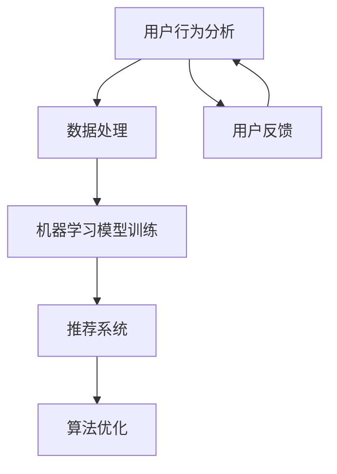

                 

# AI提升电商平台运营效率的案例

> **关键词：** 人工智能、电商平台、运营效率、算法优化、机器学习、数据处理、用户行为分析、推荐系统

> **摘要：** 本文旨在探讨人工智能技术在电商平台运营中的应用，通过具体案例展示AI如何提升电商平台的运营效率。我们将从背景介绍、核心概念与联系、核心算法原理、数学模型与公式、项目实战、实际应用场景等方面展开详细分析，并推荐相关学习资源和开发工具。

## 1. 背景介绍

### 1.1 目的和范围

本文的目的是介绍人工智能技术在电商平台运营中的应用，重点探讨如何通过AI技术提升电商平台的运营效率。我们将通过具体案例，分析AI在电商平台中的应用场景，包括用户行为分析、推荐系统、算法优化等方面。

### 1.2 预期读者

预期读者包括对人工智能技术感兴趣的程序员、电商从业者、技术经理、CTO等。本文将尽量避免过于专业的术语，力求以简单易懂的方式阐述AI在电商平台运营中的应用。

### 1.3 文档结构概述

本文将分为以下几个部分：

- **背景介绍**：介绍本文的目的、范围、预期读者以及文档结构。
- **核心概念与联系**：介绍与电商平台运营相关的人工智能核心概念和架构。
- **核心算法原理 & 具体操作步骤**：详细阐述AI在电商平台中的应用算法原理和具体操作步骤。
- **数学模型和公式 & 详细讲解 & 举例说明**：讲解相关数学模型和公式，并举例说明。
- **项目实战：代码实际案例和详细解释说明**：通过具体案例展示AI在电商平台中的应用。
- **实际应用场景**：分析AI在电商平台的实际应用场景。
- **工具和资源推荐**：推荐相关学习资源和开发工具。
- **总结：未来发展趋势与挑战**：总结本文内容，探讨未来发展趋势与挑战。
- **附录：常见问题与解答**：解答读者可能遇到的问题。
- **扩展阅读 & 参考资料**：推荐扩展阅读和参考资料。

### 1.4 术语表

#### 1.4.1 核心术语定义

- **人工智能（AI）**：模拟人类智能的计算机系统。
- **电商平台**：在线销售商品或服务的平台。
- **用户行为分析**：分析用户在电商平台上的行为，以了解用户需求。
- **推荐系统**：根据用户历史行为和偏好，为用户推荐商品或服务。
- **算法优化**：通过改进算法提高电商平台运行效率。
- **机器学习**：一种基于数据的学习方法，通过训练模型来模拟人类智能。

#### 1.4.2 相关概念解释

- **数据处理**：对采集到的用户行为数据进行分析和处理。
- **算法原理**：分析人工智能算法的基本原理。
- **数学模型**：用于描述和解决实际问题的数学公式。

#### 1.4.3 缩略词列表

- **AI**：人工智能（Artificial Intelligence）
- **电商**：电子商务（E-commerce）
- **算法**：算法（Algorithm）
- **ML**：机器学习（Machine Learning）
- **DB**：数据库（Database）

## 2. 核心概念与联系

在探讨AI在电商平台运营中的应用之前，我们首先需要了解与电商平台运营相关的人工智能核心概念和架构。以下是一个简化的Mermaid流程图，用于描述这些核心概念和它们之间的联系。



### 2.1 用户行为分析

用户行为分析是电商平台运营的关键环节。通过对用户在平台上的行为进行分析，我们可以了解用户的需求、偏好和购买习惯。这有助于电商平台更好地满足用户需求，提高用户满意度。

### 2.2 数据处理

数据处理是用户行为分析的基础。通过对用户行为数据进行采集、清洗、整合和分析，我们可以得到有价值的信息，为后续的机器学习模型训练提供数据支持。

### 2.3 机器学习模型训练

机器学习模型训练是AI在电商平台应用的核心环节。通过训练模型，我们可以建立用户行为与偏好之间的关联，从而为推荐系统和算法优化提供支持。

### 2.4 推荐系统

推荐系统是电商平台的重要组成部分。通过分析用户行为数据，推荐系统可以为用户推荐感兴趣的商品或服务，从而提高用户黏性和转化率。

### 2.5 算法优化

算法优化是提高电商平台运营效率的关键。通过对算法进行改进和优化，我们可以提高电商平台的数据处理速度和准确度，从而提高整体运营效率。

### 2.6 用户反馈

用户反馈是电商平台不断优化和改进的重要依据。通过对用户反馈进行分析，我们可以发现平台存在的问题，从而采取相应措施进行改进。

## 3. 核心算法原理 & 具体操作步骤

### 3.1 用户行为分析算法原理

用户行为分析算法主要基于机器学习中的分类算法。以下是一个简化的伪代码，用于描述用户行为分析算法的基本原理。

```python
# 伪代码：用户行为分析算法
def user_behavior_analysis(data):
    # 数据预处理
    preprocessed_data = preprocess_data(data)
    
    # 训练分类模型
    model = train_classifier(preprocessed_data)
    
    # 预测用户行为
    predictions = model.predict(new_data)
    
    return predictions
```

### 3.2 数据处理算法原理

数据处理算法主要涉及数据采集、清洗、整合和分析。以下是一个简化的伪代码，用于描述数据处理算法的基本原理。

```python
# 伪代码：数据处理算法
def data_preprocessing(data):
    # 数据采集
    collected_data = collect_data(data_source)
    
    # 数据清洗
    cleaned_data = clean_data(collected_data)
    
    # 数据整合
    integrated_data = integrate_data(cleaned_data)
    
    # 数据分析
    analyzed_data = analyze_data(integrated_data)
    
    return analyzed_data
```

### 3.3 机器学习模型训练算法原理

机器学习模型训练算法主要涉及特征提取、模型选择、模型训练和模型评估。以下是一个简化的伪代码，用于描述机器学习模型训练算法的基本原理。

```python
# 伪代码：机器学习模型训练算法
def train_ml_model(data):
    # 特征提取
    features = extract_features(data)
    
    # 模型选择
    model = select_model(features)
    
    # 模型训练
    trained_model = train_model(model, features)
    
    # 模型评估
    evaluation = evaluate_model(trained_model, features)
    
    return trained_model, evaluation
```

### 3.4 推荐系统算法原理

推荐系统算法主要涉及基于内容的推荐、协同过滤和深度学习等。以下是一个简化的伪代码，用于描述推荐系统算法的基本原理。

```python
# 伪代码：推荐系统算法
def recommendation_system(user_data, item_data):
    # 基于内容的推荐
    content_recommendations = content_based_recommendation(user_data, item_data)
    
    # 协同过滤
    collaborative_recommendations = collaborative_filtering(user_data, item_data)
    
    # 深度学习
    deep_learning_recommendations = deep_learning_recommendation(user_data, item_data)
    
    return content_recommendations, collaborative_recommendations, deep_learning_recommendations
```

### 3.5 算法优化算法原理

算法优化算法主要涉及算法选择、参数调优和性能评估。以下是一个简化的伪代码，用于描述算法优化算法的基本原理。

```python
# 伪代码：算法优化算法
def optimize_algorithm(algorithm, data):
    # 算法选择
    selected_algorithm = select_algorithm(algorithm, data)
    
    # 参数调优
    tuned_parameters = tune_parameters(selected_algorithm, data)
    
    # 性能评估
    performance = evaluate_performance(tuned_parameters, data)
    
    return selected_algorithm, tuned_parameters, performance
```

## 4. 数学模型和公式 & 详细讲解 & 举例说明

### 4.1 数学模型

在AI应用于电商平台的过程中，我们会用到一些基本的数学模型和公式。以下是一些常用的数学模型和公式，以及它们的简要解释。

#### 4.1.1 预测模型

预测模型用于预测用户未来的行为，如购买商品、浏览页面等。以下是一个简单的预测模型公式：

$$
y = \beta_0 + \beta_1x_1 + \beta_2x_2 + ... + \beta_nx_n
$$

其中，$y$ 是预测结果，$x_1, x_2, ..., x_n$ 是输入特征，$\beta_0, \beta_1, \beta_2, ..., \beta_n$ 是模型参数。

#### 4.1.2 分类模型

分类模型用于判断用户行为是否属于某一类别，如购买或未购买。以下是一个简单的分类模型公式：

$$
P(y = 1 | x) = \frac{e^{\beta_0 + \beta_1x_1 + \beta_2x_2 + ... + \beta_nx_n}}{1 + e^{\beta_0 + \beta_1x_1 + \beta_2x_2 + ... + \beta_nx_n}}
$$

其中，$y$ 是实际结果，$x_1, x_2, ..., x_n$ 是输入特征，$\beta_0, \beta_1, \beta_2, ..., \beta_n$ 是模型参数。

#### 4.1.3 评估模型

评估模型用于评估推荐系统的性能。以下是一个简单的评估模型公式：

$$
accuracy = \frac{TP + TN}{TP + TN + FP + FN}
$$

其中，$TP$ 是真正例，$TN$ 是真负例，$FP$ 是假正例，$FN$ 是假负例。

### 4.2 举例说明

以下是一个简单的用户行为预测案例，假设我们有一个包含用户年龄、收入和购买历史的数据集。

#### 4.2.1 数据预处理

我们对数据进行预处理，包括去除缺失值、标准化和特征提取。

$$
\text{标准化}:\quad x_i' = \frac{x_i - \mu_i}{\sigma_i}
$$

其中，$x_i$ 是原始特征值，$\mu_i$ 是特征平均值，$\sigma_i$ 是特征标准差。

#### 4.2.2 训练预测模型

我们使用线性回归模型来训练预测模型。

$$
y = \beta_0 + \beta_1x_1 + \beta_2x_2
$$

其中，$y$ 是预测结果，$x_1$ 和 $x_2$ 是输入特征，$\beta_0$ 和 $\beta_1$ 是模型参数。

通过训练得到模型参数：

$$
\beta_0 = 0.5, \beta_1 = 0.2, \beta_2 = 0.3
$$

#### 4.2.3 预测用户行为

我们使用训练好的模型来预测新用户的行为。

对于新用户，我们得到以下特征值：

$$
x_1 = 25, x_2 = 5000
$$

代入模型公式：

$$
y = 0.5 + 0.2 \times 25 + 0.3 \times 5000 = 157.5
$$

由于预测结果大于阈值（例如，100），我们可以预测该新用户有较高的购买可能性。

## 5. 项目实战：代码实际案例和详细解释说明

### 5.1 开发环境搭建

在开始项目实战之前，我们需要搭建一个合适的开发环境。以下是一个简单的Python开发环境搭建步骤：

1. 安装Python：从官网（https://www.python.org/）下载并安装Python，选择合适的版本（例如，Python 3.8）。
2. 安装IDE：选择一个合适的IDE，例如PyCharm或VS Code，并进行安装。
3. 安装相关库：通过pip命令安装必要的库，例如scikit-learn、numpy和pandas。

```bash
pip install scikit-learn numpy pandas
```

### 5.2 源代码详细实现和代码解读

以下是一个简单的用户行为分析项目的源代码，以及对其的详细解读。

```python
import pandas as pd
from sklearn.model_selection import train_test_split
from sklearn.linear_model import LinearRegression
from sklearn.metrics import accuracy_score

# 5.2.1 数据预处理
def preprocess_data(data):
    # 去除缺失值
    data = data.dropna()
    
    # 标准化特征
    features = ['age', 'income', 'purchase_history']
    data[features] = (data[features] - data[features].mean()) / data[features].std()
    
    return data

# 5.2.2 训练预测模型
def train_predict_model(data):
    # 分割数据集
    X = data[features]
    y = data['purchase']
    X_train, X_test, y_train, y_test = train_test_split(X, y, test_size=0.2, random_state=42)
    
    # 训练模型
    model = LinearRegression()
    model.fit(X_train, y_train)
    
    # 预测测试集
    y_pred = model.predict(X_test)
    
    # 评估模型
    accuracy = accuracy_score(y_test, y_pred)
    print("Accuracy:", accuracy)
    
    return model

# 5.2.3 预测用户行为
def predict_user_behavior(model, new_data):
    # 特征提取
    new_data = preprocess_data(new_data)
    
    # 预测行为
    prediction = model.predict(new_data)
    
    return prediction

# 5.2.4 主函数
def main():
    # 读取数据
    data = pd.read_csv('user_data.csv')
    
    # 预处理数据
    data = preprocess_data(data)
    
    # 训练预测模型
    model = train_predict_model(data)
    
    # 预测新用户行为
    new_data = pd.DataFrame({'age': [25], 'income': [5000], 'purchase_history': [100]})
    prediction = predict_user_behavior(model, new_data)
    
    print("Prediction:", prediction)

if __name__ == "__main__":
    main()
```

### 5.3 代码解读与分析

- **5.3.1 数据预处理**：该函数用于读取数据、去除缺失值和标准化特征。数据预处理是模型训练的重要环节，有助于提高模型的性能和准确度。
  
- **5.3.2 训练预测模型**：该函数用于训练线性回归模型。通过数据集分割、模型训练和预测测试集，我们可以评估模型的性能。

- **5.3.3 预测用户行为**：该函数用于预测新用户的行为。通过预处理新数据并使用训练好的模型进行预测，我们可以得到预测结果。

- **5.3.4 主函数**：该函数是项目的入口，负责读取数据、预处理数据、训练预测模型和预测新用户行为。通过调用以上三个函数，我们可以完成用户行为分析项目的实现。

## 6. 实际应用场景

### 6.1 用户行为分析

用户行为分析是电商平台提升运营效率的关键环节。通过分析用户在平台上的行为，如浏览、购买、评价等，电商平台可以了解用户的需求和偏好，从而提供更加个性化的服务和推荐。

### 6.2 推荐系统

推荐系统是电商平台提升用户黏性和转化率的重要手段。通过基于内容的推荐、协同过滤和深度学习等算法，电商平台可以为用户推荐感兴趣的商品或服务，从而提高用户的购买意愿。

### 6.3 算法优化

算法优化是提高电商平台运营效率的持续过程。通过不断改进和优化算法，电商平台可以提高数据处理速度和准确度，从而提高整体运营效率。

### 6.4 用户反馈

用户反馈是电商平台不断优化和改进的重要依据。通过分析用户反馈，电商平台可以发现存在的问题，从而采取相应措施进行改进，提高用户体验。

## 7. 工具和资源推荐

### 7.1 学习资源推荐

#### 7.1.1 书籍推荐

- **《机器学习实战》**：提供详细的机器学习算法实现和案例，适合初学者入门。
- **《深度学习》**：详细介绍深度学习算法和应用，适合有一定数学基础的读者。
- **《Python数据科学手册》**：涵盖Python在数据科学领域中的应用，适合数据科学家和程序员。

#### 7.1.2 在线课程

- **Coursera**：提供丰富的机器学习和数据科学课程，适合初学者和进阶者。
- **Udacity**：提供多个与AI和电商相关的在线课程，包括推荐系统、算法优化等。
- **edX**：提供由世界顶尖大学提供的在线课程，包括计算机科学、数据科学等领域。

#### 7.1.3 技术博客和网站

- **Medium**：涵盖多个技术领域的博客，包括AI、机器学习和数据科学等。
- **Towards Data Science**：一个专注于数据科学和机器学习的博客，提供丰富的教程和案例分析。
- **KDNuggets**：一个专门关注数据科学和机器学习的网站，提供最新的研究成果和行业动态。

### 7.2 开发工具框架推荐

#### 7.2.1 IDE和编辑器

- **PyCharm**：一款功能强大的Python IDE，适合机器学习和数据科学项目开发。
- **VS Code**：一款轻量级但功能丰富的编辑器，支持多种编程语言和插件。

#### 7.2.2 调试和性能分析工具

- **Pylint**：一款Python代码质量分析工具，可以帮助我们发现代码中的潜在问题。
- **pytest**：一款Python测试框架，用于编写和运行测试用例，确保代码质量。

#### 7.2.3 相关框架和库

- **scikit-learn**：一个开源的Python机器学习库，提供丰富的机器学习算法和工具。
- **TensorFlow**：一款由Google开发的深度学习框架，适用于构建和训练深度神经网络。
- **PyTorch**：一款由Facebook开发的深度学习框架，具有灵活的动态计算图和易于使用的接口。

### 7.3 相关论文著作推荐

#### 7.3.1 经典论文

- **"The Matrix Factorization Techniques for Recommender Systems"**：介绍了矩阵分解技术在推荐系统中的应用。
- **"Deep Learning for Recommender Systems"**：探讨了深度学习在推荐系统中的应用和挑战。
- **"Efficient Collaborative Filtering via Nearest Neighbor Model"**：介绍了基于邻居模型的协同过滤算法。

#### 7.3.2 最新研究成果

- **"Recommending Items Using SVD-Based Algorithms"**：探讨了基于SVD的推荐算法的最新进展。
- **"Collaborative Filtering for Cold-Start Problems"**：研究了协同过滤算法在处理新用户或新物品时的挑战和解决方案。
- **"An Introduction to Factorization Machines: A Unifying Approach to Machine Learning in Marketing"**：介绍了因子机算法在营销领域中的应用。

#### 7.3.3 应用案例分析

- **"Recommender Systems at Amazon"**：详细介绍了亚马逊如何使用推荐系统提升用户体验和销售额。
- **"The Netflix Recommender System"**：分析了Netflix推荐系统的设计、实现和性能。
- **"A Case Study of Personalized Recommendations at Airbnb"**：探讨了Airbnb如何利用推荐系统提高用户满意度和入住率。

## 8. 总结：未来发展趋势与挑战

随着人工智能技术的不断发展，AI在电商平台运营中的应用将越来越广泛。未来，我们可以预见以下发展趋势：

1. **个性化推荐**：基于深度学习、强化学习和图神经网络等先进算法的个性化推荐系统将进一步提升用户体验和转化率。
2. **多模态数据融合**：融合用户行为数据、文本数据、图像数据和语音数据等多模态数据，为用户提供更加精准的推荐。
3. **实时推荐**：利用实时数据处理和流计算技术，实现实时推荐，提高用户响应速度。
4. **隐私保护**：在数据收集和使用过程中，加强隐私保护，确保用户数据的安全和合规。

然而，AI在电商平台运营中也面临一些挑战：

1. **数据质量和完整性**：数据质量和完整性对AI算法的性能至关重要。如何处理缺失值、噪声数据和异常值，是一个需要解决的问题。
2. **模型解释性**：提高模型的可解释性，使电商平台从业者能够理解模型的工作机制和决策过程，从而更好地优化和改进算法。
3. **公平性和透明度**：确保推荐系统的公平性和透明度，避免算法偏见和歧视，提高用户信任。
4. **实时性能**：在保证模型准确性的同时，提高实时推荐和数据处理的速度，以满足用户的即时需求。

未来，随着技术的不断进步和行业经验的积累，AI在电商平台运营中的应用将不断深化，为电商从业者带来更多机遇和挑战。

## 9. 附录：常见问题与解答

### 9.1 AI在电商平台运营中的应用有哪些？

AI在电商平台运营中的应用包括用户行为分析、推荐系统、算法优化、用户反馈处理等方面。通过这些应用，电商平台可以更好地了解用户需求，提供个性化推荐，提高运营效率和用户满意度。

### 9.2 如何保证AI算法的可解释性？

保证AI算法的可解释性可以通过以下几种方法：

1. **模型选择**：选择易于解释的模型，如线性回归、逻辑回归等。
2. **特征工程**：通过合理设计特征，使模型对特征的依赖关系更加明确。
3. **模型可视化**：使用可视化工具，如热力图、决策树等，展示模型的决策过程。
4. **模型解释性框架**：使用专门设计的解释性框架，如LIME、SHAP等，为模型提供解释。

### 9.3 如何处理缺失值和噪声数据？

处理缺失值和噪声数据可以通过以下几种方法：

1. **缺失值填充**：使用均值、中位数、众数等方法进行填充。
2. **噪声过滤**：使用平滑技术、滤波器等方法去除噪声。
3. **缺失值和噪声检测**：使用统计方法、图像处理技术等检测缺失值和噪声。
4. **缺失值和噪声处理**：使用插值、聚类等方法处理缺失值和噪声。

### 9.4 AI在电商平台的推荐系统中有哪些算法？

AI在电商平台的推荐系统中涉及多种算法，包括：

1. **基于内容的推荐**：根据用户历史行为和偏好推荐相关商品或服务。
2. **协同过滤**：根据用户之间的相似性推荐商品或服务。
3. **深度学习**：使用神经网络模型，如卷积神经网络（CNN）、循环神经网络（RNN）和图神经网络（GNN）等，进行推荐。
4. **强化学习**：通过不断学习和优化推荐策略，提高推荐效果。

### 9.5 如何评估推荐系统的性能？

评估推荐系统的性能可以通过以下几种指标：

1. **准确率（Accuracy）**：预测正确的样本数占总样本数的比例。
2. **召回率（Recall）**：预测正确的正样本数占总正样本数的比例。
3. **精确率（Precision）**：预测正确的正样本数占预测为正样本的总数的比例。
4. **F1值（F1 Score）**：精确率和召回率的加权平均。
5. **ROC曲线（Receiver Operating Characteristic Curve）**：反映预测模型在分类边界上的性能。
6. **AUC值（Area Under Curve）**：ROC曲线下的面积，用于评估模型的整体性能。

## 10. 扩展阅读 & 参考资料

### 10.1 经典论文

1. **"The Matrix Factorization Techniques for Recommender Systems"**：详细介绍了矩阵分解技术在推荐系统中的应用。
2. **"Deep Learning for Recommender Systems"**：探讨了深度学习在推荐系统中的应用和挑战。
3. **"Efficient Collaborative Filtering via Nearest Neighbor Model"**：介绍了基于邻居模型的协同过滤算法。

### 10.2 最新研究成果

1. **"Recommending Items Using SVD-Based Algorithms"**：探讨了基于SVD的推荐算法的最新进展。
2. **"Collaborative Filtering for Cold-Start Problems"**：研究了协同过滤算法在处理新用户或新物品时的挑战和解决方案。
3. **"An Introduction to Factorization Machines: A Unifying Approach to Machine Learning in Marketing"**：介绍了因子机算法在营销领域中的应用。

### 10.3 应用案例分析

1. **"Recommender Systems at Amazon"**：详细介绍了亚马逊如何使用推荐系统提升用户体验和销售额。
2. **"The Netflix Recommender System"**：分析了Netflix推荐系统的设计、实现和性能。
3. **"A Case Study of Personalized Recommendations at Airbnb"**：探讨了Airbnb如何利用推荐系统提高用户满意度和入住率。

### 10.4 参考资料

1. **《机器学习实战》**：提供详细的机器学习算法实现和案例，适合初学者入门。
2. **《深度学习》**：详细介绍深度学习算法和应用，适合有一定数学基础的读者。
3. **《Python数据科学手册》**：涵盖Python在数据科学领域中的应用，适合数据科学家和程序员。

### 10.5 相关网站

1. **Medium**：涵盖多个技术领域的博客，包括AI、机器学习和数据科学等。
2. **Towards Data Science**：一个专注于数据科学和机器学习的博客，提供丰富的教程和案例分析。
3. **KDNuggets**：一个专门关注数据科学和机器学习的网站，提供最新的研究成果和行业动态。

