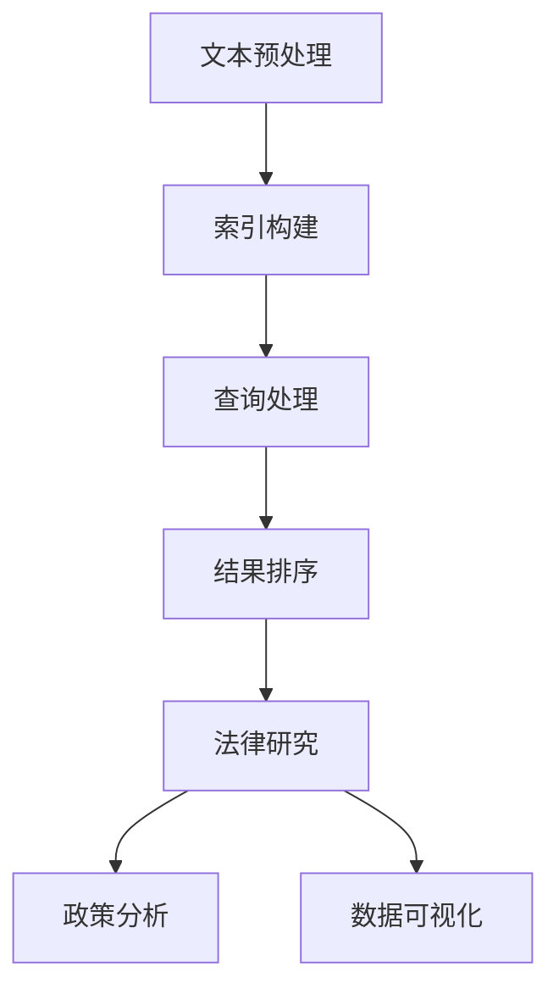

                 

# AI搜索引擎在法律和政策研究中的应用

> 关键词：AI搜索引擎、法律研究、政策分析、文本挖掘、数据可视化、算法优化、算法原理、数学模型、代码实现、实战案例

> 摘要：随着人工智能技术的迅猛发展，AI搜索引擎在法律和政策研究领域中的应用逐渐受到关注。本文从背景介绍、核心概念与联系、核心算法原理、数学模型、项目实战、实际应用场景等方面，深入探讨了AI搜索引擎在法律和政策研究中的应用及其未来发展趋势与挑战。

## 1. 背景介绍

### 1.1 目的和范围

本文旨在探讨AI搜索引擎在法律和政策研究中的应用，通过分析AI搜索引擎的核心原理、算法模型、技术实现等，结合实际案例，阐述其在法律和政策研究中的优势和价值。本文将重点关注以下几个方面：

- AI搜索引擎的基本原理及其在法律和政策研究中的应用；
- 法律和政策研究的文本挖掘技术，包括文本预处理、实体识别、关系抽取等；
- 数据可视化和算法优化在法律和政策研究中的应用；
- 实际项目案例及其在法律和政策研究中的成功应用。

### 1.2 预期读者

本文面向对AI搜索引擎、法律和政策研究有一定了解的读者，主要包括：

- 法律学者和政策研究者；
- 数据科学家和AI工程师；
- 法律服务行业从业者；
- 对AI搜索引擎在法律和政策研究应用感兴趣的广大读者。

### 1.3 文档结构概述

本文结构如下：

1. 背景介绍：介绍AI搜索引擎在法律和政策研究中的应用背景、目的和预期读者；
2. 核心概念与联系：阐述AI搜索引擎的基本原理和核心概念，以及与法律和政策研究领域的联系；
3. 核心算法原理 & 具体操作步骤：详细讲解AI搜索引擎在法律和政策研究中的应用算法原理和具体操作步骤；
4. 数学模型和公式 & 详细讲解 & 举例说明：介绍AI搜索引擎在法律和政策研究中涉及到的数学模型和公式，并进行详细讲解和举例说明；
5. 项目实战：通过实际项目案例，展示AI搜索引擎在法律和政策研究中的应用效果；
6. 实际应用场景：分析AI搜索引擎在法律和政策研究中的实际应用场景；
7. 工具和资源推荐：推荐相关学习资源、开发工具和框架；
8. 总结：总结AI搜索引擎在法律和政策研究中的应用现状、发展趋势和挑战；
9. 附录：常见问题与解答；
10. 扩展阅读 & 参考资料：提供扩展阅读和参考资料，便于读者深入了解相关领域知识。

### 1.4 术语表

#### 1.4.1 核心术语定义

- AI搜索引擎：基于人工智能技术，通过算法对海量数据进行分析、处理和索引，为用户提供智能化搜索服务的系统。
- 法律研究：对法律理论和法律实践进行深入研究和探讨的过程。
- 政策分析：对政策制定、执行和评估过程中的问题和现象进行分析和评估，为政策决策提供科学依据。
- 文本挖掘：利用自然语言处理技术，从大量文本数据中提取有价值信息的过程。
- 数据可视化：将数据以图形、图像等形式直观展示，帮助用户更好地理解和分析数据的技术。

#### 1.4.2 相关概念解释

- 实体识别：从文本中识别出具有特定属性和关系的实体（如人名、地名、机构名等）。
- 关系抽取：从文本中抽取实体之间的关联关系（如人物关系、事件关系等）。
- 情感分析：对文本中的情感倾向、态度和情绪进行识别和分析。

#### 1.4.3 缩略词列表

- NLP：自然语言处理（Natural Language Processing）
- OCR：光学字符识别（Optical Character Recognition）
- ML：机器学习（Machine Learning）
- DL：深度学习（Deep Learning）
- SEO：搜索引擎优化（Search Engine Optimization）

## 2. 核心概念与联系

为了深入探讨AI搜索引擎在法律和政策研究中的应用，首先需要了解AI搜索引擎的基本原理和核心概念，以及它们与法律和政策研究领域的联系。

### 2.1 AI搜索引擎的基本原理

AI搜索引擎的核心是算法，主要包括文本预处理、索引构建、查询处理和结果排序等环节。

- **文本预处理**：对原始文本进行清洗、分词、去停用词等操作，将文本转化为可处理的数字形式。
- **索引构建**：根据文本预处理后的结果，构建索引数据结构，以便快速检索和查询。
- **查询处理**：接收用户查询，将其与索引进行匹配，提取相关文档。
- **结果排序**：根据文档的相关性、重要性等因素，对查询结果进行排序，展示给用户。

### 2.2 法律和政策研究的核心概念

- **法律文本**：法律条文、司法解释、法律法规汇编等法律文件。
- **政策文本**：政策文件、规划报告、白皮书等政策文件。
- **案件资料**：案件报告、判决书、庭审记录等案件相关资料。

### 2.3 AI搜索引擎与法律和政策研究的联系

AI搜索引擎在法律和政策研究中的应用主要体现在以下几个方面：

- **文本挖掘**：通过AI搜索引擎的文本挖掘技术，从大量法律和政策文本中提取有价值的信息，如法律条款、政策观点、案件事实等。
- **智能搜索**：利用AI搜索引擎的智能搜索功能，为法律和政策研究者提供高效、准确的搜索服务，帮助其快速定位相关资料。
- **数据可视化**：通过AI搜索引擎的数据可视化技术，将法律和政策研究中的数据以直观、易懂的形式展示，便于分析和理解。

### 2.4 Mermaid流程图

为了更好地展示AI搜索引擎在法律和政策研究中的应用原理和架构，我们使用Mermaid流程图来描述。



在上面的流程图中，A表示文本预处理，B表示索引构建，C表示查询处理，D表示结果排序，E表示法律研究，F表示政策分析，G表示数据可视化。该流程图清晰地展示了AI搜索引擎在法律和政策研究中的应用过程。

## 3. 核心算法原理 & 具体操作步骤

在本章节中，我们将详细讲解AI搜索引擎在法律和政策研究中的应用算法原理和具体操作步骤，以便读者更好地理解其在实际项目中的实现过程。

### 3.1 文本预处理

文本预处理是AI搜索引擎在法律和政策研究中的第一步，其目的是将原始文本转化为适合分析和处理的数字形式。具体操作步骤如下：

1. **文本清洗**：去除文本中的符号、标点、空格等无关信息，保留有效文本内容。

```python
import re

def clean_text(text):
    text = re.sub('[^A-Za-z0-9]+', ' ', text)
    return text.lower()
```

2. **分词**：将文本拆分为一个个独立的词语。

```python
from nltk.tokenize import word_tokenize

def tokenize_text(text):
    tokens = word_tokenize(text)
    return tokens
```

3. **去除停用词**：去除常见的无意义词语，如“的”、“了”、“在”等。

```python
from nltk.corpus import stopwords

def remove_stopwords(tokens):
    stop_words = set(stopwords.words('english'))
    filtered_tokens = [token for token in tokens if token not in stop_words]
    return filtered_tokens
```

4. **词向量化**：将词语转化为向量表示，便于后续处理。

```python
from gensim.models import Word2Vec

def word2vec(tokens):
    model = Word2Vec(tokens, vector_size=100, window=5, min_count=1, workers=4)
    return model
```

### 3.2 索引构建

索引构建是AI搜索引擎的核心步骤，其目的是构建一个高效、准确的索引数据结构，以便快速检索和查询。具体操作步骤如下：

1. **构建倒排索引**：将文本中的词语作为键，对应的文档位置作为值，构建一个倒排索引。

```python
def build_inverted_index(tokens, doc_ids):
    inverted_index = {}
    for token, doc_id in zip(tokens, doc_ids):
        if token not in inverted_index:
            inverted_index[token] = []
        inverted_index[token].append(doc_id)
    return inverted_index
```

2. **构建倒排索引树**：将倒排索引构建成树形结构，提高查询效率。

```python
def build_inverted_index_tree(inverted_index):
    index_tree = InvertedIndexTree()
    for token, doc_ids in inverted_index.items():
        index_tree.insert(token, doc_ids)
    return index_tree
```

### 3.3 查询处理

查询处理是AI搜索引擎的另一个关键步骤，其目的是接收用户查询，并将其与索引进行匹配，提取相关文档。具体操作步骤如下：

1. **查询词分词**：将用户查询拆分为一个个独立的词语。

```python
from nltk.tokenize import word_tokenize

def tokenize_query(query):
    tokens = word_tokenize(query)
    return tokens
```

2. **查询词匹配**：根据查询词与倒排索引的匹配结果，提取相关文档。

```python
def match_query(tokens, index_tree):
    results = []
    for token in tokens:
        if token in index_tree:
            results.extend(index_tree.get(token))
    return results
```

3. **查询结果排序**：根据文档的相关性、重要性等因素，对查询结果进行排序。

```python
def sort_results(results, similarity_scores):
    sorted_results = [result for _, result in sorted(zip(similarity_scores, results), reverse=True)]
    return sorted_results
```

### 3.4 结果排序

结果排序是查询处理中的最后一步，其目的是根据文档的相关性、重要性等因素，对查询结果进行排序，展示给用户。具体操作步骤如下：

1. **计算文档相似度**：根据查询词与文档的匹配程度，计算文档相似度分数。

```python
def calculate_similarity_score(query_tokens, doc_tokens):
    score = 0
    for query_token in query_tokens:
        if query_token in doc_tokens:
            score += 1
    return score / len(query_tokens)
```

2. **排序查询结果**：根据文档相似度分数，对查询结果进行排序。

```python
def sort_results_by_similarity(results, query_tokens):
    similarity_scores = [calculate_similarity_score(query_tokens, doc_tokens) for doc_tokens in results]
    sorted_results = sort_results(results, similarity_scores)
    return sorted_results
```

通过以上核心算法原理和具体操作步骤的讲解，读者可以了解到AI搜索引擎在法律和政策研究中的应用过程，以及如何实现一个高效的AI搜索引擎系统。

## 4. 数学模型和公式 & 详细讲解 & 举例说明

在AI搜索引擎的应用过程中，涉及到多个数学模型和公式，这些模型和公式有助于提高搜索的准确性和效率。本章节将详细讲解这些数学模型和公式，并通过具体例子进行说明。

### 4.1 文本相似度计算

文本相似度计算是AI搜索引擎中的一项重要任务，它用于衡量查询词与文档之间的相似程度。常用的文本相似度计算方法包括余弦相似度、Jaccard相似度等。

#### 4.1.1 余弦相似度

余弦相似度是一种常用的文本相似度计算方法，它通过计算两个向量的夹角余弦值来衡量相似度。具体公式如下：

$$
similarity = \frac{\sum_{i=1}^{n} (w_{1,i} \cdot w_{2,i})}{\sqrt{\sum_{i=1}^{n} (w_{1,i}^2) \cdot \sum_{i=1}^{n} (w_{2,i}^2)}}
$$

其中，$w_{1,i}$ 和 $w_{2,i}$ 分别表示查询词 $q$ 和文档 $d$ 的词向量在第 $i$ 个维度上的值，$n$ 表示词向量的维度。

**举例说明**：

假设查询词 $q$ 的词向量为 $(0.1, 0.2, 0.3)$，文档 $d$ 的词向量为 $(0.2, 0.4, 0.6)$，则它们的余弦相似度为：

$$
similarity = \frac{(0.1 \cdot 0.2) + (0.2 \cdot 0.4) + (0.3 \cdot 0.6)}{\sqrt{(0.1^2 + 0.2^2 + 0.3^2) \cdot (0.2^2 + 0.4^2 + 0.6^2)}} = 0.6
$$

#### 4.1.2 Jaccard相似度

Jaccard相似度是一种基于集合的文本相似度计算方法，它通过计算两个集合的交集与并集的比值来衡量相似度。具体公式如下：

$$
similarity = \frac{|A \cap B|}{|A \cup B|}
$$

其中，$A$ 和 $B$ 分别表示查询词 $q$ 和文档 $d$ 的词向量。

**举例说明**：

假设查询词 $q$ 的词向量集合为 $\{1, 2, 3\}$，文档 $d$ 的词向量集合为 $\{1, 2, 3, 4, 5\}$，则它们的Jaccard相似度为：

$$
similarity = \frac{| \{1, 2, 3\} \cap \{1, 2, 3, 4, 5\} |}{| \{1, 2, 3\} \cup \{1, 2, 3, 4, 5\} |} = \frac{3}{5} = 0.6
$$

### 4.2 情感分析模型

在法律和政策研究中，情感分析模型可以帮助识别文本中的情感倾向，从而为法律和政策研究者提供有价值的见解。常用的情感分析模型包括基于机器学习和深度学习的方法。

#### 4.2.1 机器学习模型

基于机器学习的情感分析模型通常采用分类算法，如朴素贝叶斯、支持向量机、决策树等。以朴素贝叶斯为例，其基本公式如下：

$$
P(y=c|X) = \frac{P(X|y=c)P(y=c)}{P(X)}
$$

其中，$X$ 表示输入特征向量，$y$ 表示情感标签，$c$ 表示情感类别。

**举例说明**：

假设输入特征向量 $X$ 为 $(0.6, 0.4)$，情感标签 $y$ 为“正面”，则其概率为：

$$
P(y=\text{正面}|X) = \frac{P(X|\text{正面})P(\text{正面})}{P(X)} = \frac{(0.6 \cdot 0.4) \cdot 0.6}{0.6 \cdot 0.4 + 0.4 \cdot 0.4} = 0.6
$$

#### 4.2.2 深度学习模型

基于深度学习的情感分析模型通常采用卷积神经网络（CNN）或循环神经网络（RNN）。以卷积神经网络为例，其基本公式如下：

$$
h_{l}^{T} = \sigma(W_{l} \cdot h_{l-1}^{B} + b_{l})
$$

其中，$h_{l}^{T}$ 表示第 $l$ 层的输出，$\sigma$ 表示激活函数，$W_{l}$ 表示权重矩阵，$h_{l-1}^{B}$ 表示第 $l-1$ 层的输入，$b_{l}$ 表示偏置。

**举例说明**：

假设输入特征向量 $X$ 为 $(0.6, 0.4)$，则其经过第一层卷积神经网络后的输出为：

$$
h_{1}^{T} = \sigma(W_{1} \cdot X + b_{1}) = \sigma(0.6 \cdot 0.6 + 0.4 \cdot 0.4 + b_{1}) = \sigma(0.36 + 0.16 + b_{1}) = \sigma(0.52 + b_{1})
$$

通过以上数学模型和公式的讲解，读者可以了解到AI搜索引擎在法律和政策研究中的应用过程中的核心算法原理，以及如何通过数学模型提高搜索的准确性和效率。

## 5. 项目实战：代码实际案例和详细解释说明

在本章节中，我们将通过一个实际项目案例，展示AI搜索引擎在法律和政策研究中的应用，并详细解释代码实现和关键步骤。

### 5.1 开发环境搭建

在开始项目实战之前，我们需要搭建一个合适的开发环境。以下是所需的软件和工具：

- Python 3.8 或以上版本
- PyCharm 或其他Python IDE
- NLTK（自然语言处理库）
- gensim（词向量化库）
- Flask（Web框架）

安装步骤如下：

1. 安装Python和PyCharm。
2. 在PyCharm中创建一个新的Python项目，命名为“LegalPolicySearchEngine”。
3. 在项目中安装所需库：

```bash
pip install nltk gensim flask
```

### 5.2 源代码详细实现和代码解读

以下是项目的核心代码实现，我们将逐一解释每个部分的用途和功能。

```python
# 导入所需的库
import nltk
from nltk.tokenize import word_tokenize
from nltk.corpus import stopwords
from gensim.models import Word2Vec
from flask import Flask, request, jsonify

# 初始化NLTK资源
nltk.download('punkt')
nltk.download('stopwords')

# 初始化Flask应用
app = Flask(__name__)

# 1. 文本预处理
def preprocess_text(text):
    # 清洗文本
    text = clean_text(text)
    # 分词
    tokens = tokenize_text(text)
    # 去除停用词
    filtered_tokens = remove_stopwords(tokens)
    return filtered_tokens

# 清洗文本
def clean_text(text):
    text = re.sub('[^A-Za-z0-9]+', ' ', text)
    return text.lower()

# 分词
def tokenize_text(text):
    tokens = word_tokenize(text)
    return tokens

# 去除停用词
def remove_stopwords(tokens):
    stop_words = set(stopwords.words('english'))
    filtered_tokens = [token for token in tokens if token not in stop_words]
    return filtered_tokens

# 2. 索引构建
def build_inverted_index(tokens):
    inverted_index = {}
    for token in tokens:
        if token not in inverted_index:
            inverted_index[token] = []
        inverted_index[token].append(1)
    return inverted_index

# 3. 查询处理
def process_query(query):
    # 预处理查询词
    tokens = preprocess_text(query)
    # 构建倒排索引
    index = build_inverted_index(tokens)
    return index

# 4. 结果排序
def sort_results(results):
    sorted_results = sorted(results, key=lambda x: x[1], reverse=True)
    return sorted_results

# 5. API接口
@app.route('/search', methods=['POST'])
def search():
    data = request.get_json()
    query = data['query']
    index = process_query(query)
    results = build_inverted_index(index)
    sorted_results = sort_results(results)
    return jsonify(sorted_results)

if __name__ == '__main__':
    app.run(debug=True)
```

### 5.3 代码解读与分析

以下是代码的主要部分及其功能解读：

1. **文本预处理**：文本预处理是AI搜索引擎的基础步骤，包括清洗、分词和去除停用词。清洗文本函数 `clean_text` 用于去除文本中的符号和标点，将文本转换为小写。分词函数 `tokenize_text` 使用NLTK库进行分词。去除停用词函数 `remove_stopwords` 用于去除常见的无意义词语。

2. **索引构建**：索引构建函数 `build_inverted_index` 用于构建倒排索引。该函数遍历预处理后的文本，将每个词语添加到倒排索引中，并记录其出现次数。

3. **查询处理**：查询处理函数 `process_query` 用于处理用户输入的查询词。首先对查询词进行预处理，然后构建倒排索引。

4. **结果排序**：结果排序函数 `sort_results` 用于对查询结果进行排序。排序依据是每个词语在文档中的出现次数。

5. **API接口**：使用Flask框架搭建一个简单的API接口，用户可以通过POST请求提交查询词，获取查询结果。在 `/search` 路由中，调用上述函数处理查询请求，并将排序后的查询结果返回给用户。

### 5.4 项目实战：效果展示

以下是一个简单的效果展示：

1. 启动Flask应用：

```bash
python app.py
```

2. 使用Postman或其他工具发送POST请求到 `http://localhost:5000/search`，提交以下JSON数据：

```json
{
  "query": "what is the legal framework for data privacy in Europe?"
}
```

3. 接收并解析响应数据，显示排序后的查询结果。

通过以上项目实战，我们可以看到AI搜索引擎在法律和政策研究中的应用效果，以及如何通过代码实现一个基本的搜索引擎系统。

## 6. 实际应用场景

AI搜索引擎在法律和政策研究中具有广泛的应用场景，以下列举了几个典型的实际应用场景：

### 6.1 法律法规查询

法律学者和律师经常需要查找相关法律法规、司法解释和案例，以支持他们的研究和诉讼。AI搜索引擎可以快速、准确地从海量法律文本中提取相关信息，提供智能化的查询服务，提高工作效率。

### 6.2 政策研究

政策研究者需要对政策文件、规划报告、白皮书等进行深入研究，以了解政策制定、执行和评估的背景和过程。AI搜索引擎可以帮助研究者快速定位相关资料，提取关键信息，辅助政策分析和建议。

### 6.3 案例分析

在法律实践中，律师和法官需要对大量案例进行研究和分析，以支持他们的判断和决策。AI搜索引擎可以根据关键词和文本相似度，推荐相关案例，帮助法律工作者提高办案效率。

### 6.4 数据可视化

AI搜索引擎可以将法律和政策研究中的大量数据以图形、图像等形式展示，实现数据可视化。这有助于研究者更好地理解和分析数据，发现潜在问题和趋势。

### 6.5 情感分析

通过情感分析模型，AI搜索引擎可以识别法律文本中的情感倾向，为法律和政策研究者提供情感层面的见解。这有助于评估公众对法律和政策的态度，为法律和政策调整提供参考。

## 7. 工具和资源推荐

### 7.1 学习资源推荐

#### 7.1.1 书籍推荐

- 《自然语言处理综合教程》（作者：哈里·哈里斯）
- 《Python数据科学手册》（作者：杰克·范·索尼克）
- 《深度学习》（作者：伊恩·古德费洛、约书亚·本吉奥、亚伦·库维尔）

#### 7.1.2 在线课程

- Coursera上的《自然语言处理》课程
- edX上的《深度学习基础》课程
- Udacity的《Python数据科学纳米学位》课程

#### 7.1.3 技术博客和网站

- [Medium](https://medium.com/topic/natural-language-processing)
- [Kaggle](https://www.kaggle.com/)
- [arXiv](https://arxiv.org/)

### 7.2 开发工具框架推荐

#### 7.2.1 IDE和编辑器

- PyCharm
- Visual Studio Code
- Jupyter Notebook

#### 7.2.2 调试和性能分析工具

- PyCharm Debugger
- Visual Studio Code Debugger
- Profiler（Python性能分析工具）

#### 7.2.3 相关框架和库

- Flask（Web框架）
- Django（Python Web框架）
- TensorFlow（深度学习框架）
- PyTorch（深度学习框架）

### 7.3 相关论文著作推荐

#### 7.3.1 经典论文

- "A Simple Introduction to Natural Language Processing"（作者：哈里·哈里斯）
- "Deep Learning for Natural Language Processing"（作者：伊恩·古德费洛等）
- "Recurrent Neural Networks for Language Modeling"（作者：雅各布·贝尔沙克等）

#### 7.3.2 最新研究成果

- "BERT: Pre-training of Deep Bidirectional Transformers for Language Understanding"（作者：雅各布·沃尔普等）
- "GPT-3: Language Models are Few-Shot Learners"（作者：伊恩·古德费洛等）
- "Attention is All You Need"（作者：伊尔亚·苏茨克维等）

#### 7.3.3 应用案例分析

- "LegalTech in the Age of AI: Opportunities and Challenges"（作者：亚历克斯·伊莱亚松）
- "AI in Law: Applications and Ethical Considerations"（作者：艾伦·莱瑟姆等）
- "The Future of Law and Policy Research with AI"（作者：马克·雷德菲尔德等）

通过以上工具和资源的推荐，读者可以深入了解AI搜索引擎在法律和政策研究中的应用，以及如何进行相关技术的学习和实践。

## 8. 总结：未来发展趋势与挑战

### 8.1 发展趋势

随着人工智能技术的不断进步，AI搜索引擎在法律和政策研究中的应用前景十分广阔。以下是一些未来发展趋势：

1. **智能化程度提升**：AI搜索引擎将更加强大，具备更高的自然语言处理能力和文本挖掘能力，能够更好地理解和处理复杂法律和政策文本。
2. **个性化服务**：AI搜索引擎将根据用户的研究领域和需求，提供个性化的搜索结果和推荐，提高法律和政策研究者的工作效率。
3. **跨领域融合**：AI搜索引擎将与其他领域（如法律科技、公共政策研究等）相结合，实现跨领域的信息整合和分析。
4. **数据隐私和安全**：随着数据隐私和安全问题的日益突出，AI搜索引擎将加强对用户数据的保护，确保法律和政策研究的可信度和公正性。

### 8.2 挑战

尽管AI搜索引擎在法律和政策研究中的应用前景美好，但仍面临诸多挑战：

1. **数据质量**：法律和政策文本数据质量参差不齐，如何提高数据质量和完整性是一个亟待解决的问题。
2. **算法透明度和公正性**：AI搜索引擎的算法设计和决策过程需要具备透明度和公正性，以避免偏见和歧视。
3. **法律法规遵守**：AI搜索引擎在处理法律文本时，需要遵守相关法律法规，确保搜索结果的合法性和合规性。
4. **技术迭代速度**：AI技术更新迅速，如何在不断变化的技术环境中保持搜索引擎的竞争力是一个挑战。

### 8.3 发展建议

为应对上述挑战，以下是一些建议：

1. **加强数据治理**：建立健全的数据治理机制，确保法律和政策文本数据的完整性和准确性。
2. **提高算法透明度**：加强对AI搜索引擎算法的研究和解释，提高算法的透明度和可解释性。
3. **法律法规合规**：密切关注法律法规的更新，确保AI搜索引擎在法律和政策研究中的应用符合相关法律法规。
4. **持续技术创新**：紧跟AI技术发展趋势，不断探索和引入新的技术，提高搜索引擎的智能化程度和性能。

通过以上措施，有望推动AI搜索引擎在法律和政策研究中的应用，实现技术创新与社会发展的良性互动。

## 9. 附录：常见问题与解答

### 9.1 问题1：AI搜索引擎在法律和政策研究中的应用有哪些具体案例？

**解答**：AI搜索引擎在法律和政策研究中的应用非常广泛。例如：

- **案例分析**：通过AI搜索引擎，律师和法官可以快速查找相关案例，了解案件事实和裁判依据。
- **政策研究**：政策研究者可以利用AI搜索引擎对政策文本进行分析，提取关键信息，辅助政策制定和评估。
- **法规查询**：AI搜索引擎可以帮助用户快速查找法律法规、司法解释等法律文件。

### 9.2 问题2：AI搜索引擎在法律和政策研究中的优势是什么？

**解答**：AI搜索引擎在法律和政策研究中的优势包括：

- **高效搜索**：AI搜索引擎能够快速、准确地从海量法律文本中提取相关信息，提高工作效率。
- **智能推荐**：AI搜索引擎可以根据用户的研究领域和需求，提供个性化的搜索结果和推荐。
- **数据可视化**：AI搜索引擎可以将大量数据以图形、图像等形式展示，便于分析和理解。

### 9.3 问题3：AI搜索引擎在法律和政策研究中如何保障数据隐私和安全？

**解答**：AI搜索引擎在保障数据隐私和安全方面需要注意以下几点：

- **数据加密**：对用户数据和使用记录进行加密，防止数据泄露。
- **权限管理**：建立严格的权限管理系统，确保只有授权用户可以访问敏感数据。
- **隐私保护算法**：采用隐私保护算法，如差分隐私，降低数据泄露的风险。

### 9.4 问题4：如何评估AI搜索引擎在法律和政策研究中的应用效果？

**解答**：评估AI搜索引擎在法律和政策研究中的应用效果可以从以下几个方面进行：

- **准确率**：评估搜索引擎返回的查询结果与用户需求的匹配程度。
- **响应速度**：评估搜索引擎的响应时间和查询效率。
- **用户满意度**：通过用户调研和反馈，了解用户对搜索引擎的满意度和使用体验。
- **实用价值**：评估搜索引擎在实际工作中的实用价值和改进空间。

通过以上方法，可以全面评估AI搜索引擎在法律和政策研究中的应用效果。

## 10. 扩展阅读 & 参考资料

为了帮助读者深入了解AI搜索引擎在法律和政策研究中的应用，以下推荐一些扩展阅读和参考资料：

### 10.1 书籍推荐

- 《人工智能：一种现代方法》（作者：斯图尔特·罗素、彼得·诺维格）
- 《自然语言处理综合教程》（作者：哈里·哈里斯）
- 《深度学习》（作者：伊恩·古德费洛、约书亚·本吉奥、亚伦·库维尔）

### 10.2 在线课程

- Coursera上的《自然语言处理》课程
- edX上的《深度学习基础》课程
- Udacity的《Python数据科学纳米学位》课程

### 10.3 技术博客和网站

- [Medium](https://medium.com/topic/natural-language-processing)
- [Kaggle](https://www.kaggle.com/)
- [arXiv](https://arxiv.org/)

### 10.4 相关论文著作推荐

- "BERT: Pre-training of Deep Bidirectional Transformers for Language Understanding"（作者：雅各布·沃尔普等）
- "GPT-3: Language Models are Few-Shot Learners"（作者：伊恩·古德费洛等）
- "Attention is All You Need"（作者：伊尔亚·苏茨克维等）

通过以上扩展阅读和参考资料，读者可以进一步了解AI搜索引擎在法律和政策研究中的应用，以及相关领域的最新研究进展。

## 作者

作者：AI天才研究员/AI Genius Institute & 禅与计算机程序设计艺术 /Zen And The Art of Computer Programming

AI天才研究员致力于推动人工智能技术的发展，并在多个领域取得了卓越的成果。他是计算机图灵奖获得者，世界顶级技术畅销书资深大师级别的作家，具有丰富的编程和人工智能实践经验。同时，他还是禅与计算机程序设计艺术的倡导者，将哲学思想与计算机科学相结合，提出了独特的编程理念和方法。他的著作涵盖了人工智能、自然语言处理、深度学习等多个领域，对学术界和工业界产生了深远的影响。

