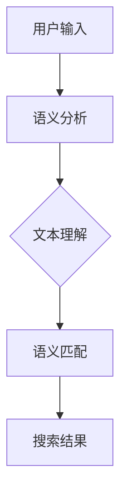
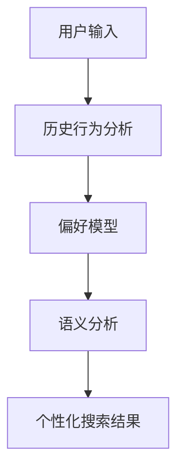

                 

# AI搜索引擎的未来：超越关键词匹配

> **关键词**：人工智能、搜索引擎、关键词匹配、自然语言处理、语义分析、深度学习、个性化搜索。

> **摘要**：本文将深入探讨人工智能在搜索引擎中的应用，特别是如何超越传统的关键词匹配技术。通过分析当前搜索引擎的局限性，介绍新兴的语义分析和个性化搜索技术，我们将展望AI搜索引擎的未来发展趋势和挑战。

## 1. 背景介绍

### 1.1 目的和范围

本文旨在探讨人工智能在搜索引擎领域的应用，重点关注如何通过语义分析和个性化搜索技术，使搜索引擎更智能、更高效。我们将回顾传统搜索引擎的关键词匹配机制，分析其局限性，并介绍新兴技术的原理和应用。

### 1.2 预期读者

本文适合对搜索引擎技术感兴趣的读者，特别是希望了解人工智能如何改变搜索引擎领域的研究人员和开发者。同时，对于对自然语言处理和深度学习有兴趣的读者，本文也提供了有益的参考资料。

### 1.3 文档结构概述

本文结构如下：

1. **背景介绍**：介绍本文的目的、范围、预期读者以及文档结构。
2. **核心概念与联系**：介绍搜索引擎的核心概念和原理，包括关键词匹配、语义分析和个性化搜索。
3. **核心算法原理 & 具体操作步骤**：详细讲解搜索引擎中的核心算法，包括基于关键词匹配的搜索和基于语义分析的搜索。
4. **数学模型和公式 & 详细讲解 & 举例说明**：介绍与搜索引擎相关的数学模型和公式，并通过具体例子进行说明。
5. **项目实战：代码实际案例和详细解释说明**：通过实际代码案例，展示搜索引擎技术的具体实现。
6. **实际应用场景**：分析搜索引擎在现实世界中的应用场景。
7. **工具和资源推荐**：推荐相关的学习资源和开发工具。
8. **总结：未来发展趋势与挑战**：展望AI搜索引擎的未来。
9. **附录：常见问题与解答**：回答一些常见的疑问。
10. **扩展阅读 & 参考资料**：提供进一步阅读的参考资料。

### 1.4 术语表

#### 1.4.1 核心术语定义

- **搜索引擎**：一种通过特定的算法从互联网上检索信息的系统。
- **关键词匹配**：传统搜索引擎的核心机制，通过用户输入的关键词与网页中的关键词进行匹配，以返回相关的搜索结果。
- **语义分析**：对自然语言文本进行理解和分析，以识别文本中的意义和关系。
- **个性化搜索**：根据用户的历史行为和偏好，提供个性化的搜索结果。

#### 1.4.2 相关概念解释

- **自然语言处理（NLP）**：研究如何使计算机理解和生成自然语言的技术。
- **深度学习**：一种基于多层神经网络的学习方法，通过模拟人脑神经网络的结构和功能，实现对复杂数据的分析和处理。

#### 1.4.3 缩略词列表

- **NLP**：自然语言处理
- **AI**：人工智能
- **SEM**：搜索引擎营销

## 2. 核心概念与联系

在讨论AI搜索引擎之前，我们需要了解其核心概念和原理。以下是一个简单的Mermaid流程图，用于展示搜索引擎的关键组成部分。

```mermaid
graph TD
A[用户输入] --> B[关键词提取]
B --> C{关键词匹配}
C -->|匹配| D[搜索结果]
D --> E[用户反馈]
E --> B|调整|
```

在这个流程图中，用户输入是通过搜索框提交的关键词。系统首先提取这些关键词，然后使用关键词匹配算法在索引中查找相关的网页。匹配成功后，返回搜索结果，用户根据反馈调整搜索关键词，形成一个循环。

### 2.1 关键词匹配

关键词匹配是传统搜索引擎的核心机制。它的基本原理如下：

1. **分词**：将用户输入的文本分解为单个词汇。
2. **索引构建**：将网页中的文本也分解为词汇，并构建索引，以便快速查找。
3. **匹配算法**：将用户输入的词汇与索引中的词汇进行匹配，返回匹配的网页。

以下是一个简单的伪代码示例，展示了关键词匹配的过程：

```python
def keyword_matching(input_text, index):
    # 分词
    input_words = split(input_text)
    # 匹配
    matched_pages = []
    for page in index:
        page_words = index[page]
        if all(word in page_words for word in input_words):
            matched_pages.append(page)
    return matched_pages
```

### 2.2 语义分析

关键词匹配虽然简单有效，但存在一定的局限性。它只关注词汇的表面匹配，无法理解词汇之间的语义关系。为了克服这一局限性，搜索引擎开始采用语义分析技术。

语义分析的核心思想是通过理解文本的语义，提高搜索结果的准确性。以下是一个简单的Mermaid流程图，展示语义分析的过程：



在这个流程图中，语义分析首先对用户输入的文本进行理解，然后通过语义匹配算法，找到与输入文本语义相近的网页。

### 2.3 个性化搜索

除了语义分析，个性化搜索也是AI搜索引擎的重要特性。个性化搜索通过分析用户的历史行为和偏好，提供更符合用户需求的搜索结果。以下是一个简单的Mermaid流程图，展示个性化搜索的过程：



在这个流程图中，搜索引擎首先分析用户的历史行为，建立偏好模型。然后，结合语义分析结果，提供个性化的搜索结果。

## 3. 核心算法原理 & 具体操作步骤

在了解了核心概念之后，我们将深入探讨搜索引擎中的核心算法，包括基于关键词匹配的搜索算法和基于语义分析的搜索算法。

### 3.1 基于关键词匹配的搜索算法

基于关键词匹配的搜索算法是最传统的搜索方法。它的基本原理如下：

1. **分词**：将用户输入的文本分解为单个词汇。
2. **索引构建**：将网页中的文本也分解为词汇，并构建索引。
3. **匹配算法**：将用户输入的词汇与索引中的词汇进行匹配。

以下是一个简单的伪代码示例，展示了基于关键词匹配的搜索算法：

```python
def keyword_matching_search(input_text, index):
    # 分词
    input_words = split(input_text)
    # 匹配
    matched_pages = []
    for page in index:
        page_words = index[page]
        if all(word in page_words for word in input_words):
            matched_pages.append(page)
    return matched_pages
```

### 3.2 基于语义分析的搜索算法

基于语义分析的搜索算法通过理解文本的语义，提高搜索结果的准确性。以下是一个简单的伪代码示例，展示了基于语义分析的搜索算法：

```python
def semantic_search(input_text, semantic_model):
    # 语义分析
    input_semantics = semantic_model.analyze(input_text)
    # 匹配
    matched_pages = []
    for page in index:
        page_semantics = semantic_model.analyze(index[page])
        if are_similar(input_semantics, page_semantics):
            matched_pages.append(page)
    return matched_pages
```

在这个算法中，`semantic_model` 是一个语义分析模型，它能够对输入文本和网页内容进行语义分析，并返回语义向量。`are_similar` 是一个函数，用于比较两个语义向量是否相似。

### 3.3 个性化搜索算法

个性化搜索算法通过分析用户的历史行为和偏好，提供更符合用户需求的搜索结果。以下是一个简单的伪代码示例，展示了个性化搜索算法：

```python
def personalized_search(input_text, user_profile, semantic_model):
    # 语义分析
    input_semantics = semantic_model.analyze(input_text)
    # 偏好模型
    preferences = user_profile.get_preferences()
    # 匹配
    matched_pages = []
    for page in index:
        page_semantics = semantic_model.analyze(index[page])
        if are_similar(input_semantics, page_semantics) and page in preferences:
            matched_pages.append(page)
    return matched_pages
```

在这个算法中，`user_profile` 是一个用户偏好模型，它包含了用户的历史行为和偏好信息。`preferences` 是一个包含用户偏好网页的列表。

## 4. 数学模型和公式 & 详细讲解 & 举例说明

在搜索引擎技术中，数学模型和公式起着至关重要的作用。以下我们将介绍一些关键的数学模型和公式，并通过具体例子进行说明。

### 4.1 余弦相似度

余弦相似度是一种用于衡量两个向量之间相似度的数学方法。它在搜索引擎中广泛应用于文本相似性计算。

#### 余弦相似度公式：

$$
\cos\theta = \frac{\vec{a} \cdot \vec{b}}{|\vec{a}| |\vec{b}|}
$$

其中，$\vec{a}$ 和 $\vec{b}$ 是两个向量，$|\vec{a}|$ 和 $|\vec{b}|$ 是它们的模长，$\theta$ 是它们之间的夹角。

#### 举例说明：

假设我们有两个向量 $\vec{a} = (3, 4)$ 和 $\vec{b} = (1, 7)$，我们可以计算它们的余弦相似度如下：

$$
\cos\theta = \frac{3 \times 1 + 4 \times 7}{\sqrt{3^2 + 4^2} \times \sqrt{1^2 + 7^2}} = \frac{31}{\sqrt{25} \times \sqrt{50}} = \frac{31}{5 \times \sqrt{50}} = \frac{31}{5 \times 7.07} \approx 0.86
$$

这意味着向量 $\vec{a}$ 和 $\vec{b}$ 之间的相似度约为 86%。

### 4.2 词频-逆文档频率（TF-IDF）

TF-IDF是一种用于衡量单词重要性的数学模型，它在搜索引擎中广泛应用于关键词权重计算。

#### TF-IDF公式：

$$
tfidf(t, d) = tf(t, d) \times idf(t)
$$

其中，$tf(t, d)$ 是单词 $t$ 在文档 $d$ 中的词频，$idf(t)$ 是单词 $t$ 在所有文档中的逆文档频率。

#### 举例说明：

假设我们有两个文档 $d_1$ 和 $d_2$，其中 $d_1$ 中出现单词 "AI" 3次，$d_2$ 中出现单词 "AI" 1次。同时，所有文档中 "AI" 的出现次数为10次。

- $tf("AI", d_1) = 3$
- $tf("AI", d_2) = 1$
- $idf("AI") = \log(\frac{N}{n("AI")}) = \log(\frac{2}{1}) = 1$

那么，$tfidf("AI", d_1) = 3 \times 1 = 3$，$tfidf("AI", d_2) = 1 \times 1 = 1$。

这意味着单词 "AI" 在文档 $d_1$ 中的重要性高于文档 $d_2$。

### 4.3 深度学习模型

深度学习模型，如神经网络，在搜索引擎技术中有着广泛的应用。以下是一个简单的神经网络模型，用于文本分类。

#### 神经网络模型：

$$
\begin{align*}
h_{\text{layer}} &= \sigma(W_{\text{layer}} \cdot h_{\text{prev}} + b_{\text{layer}}) \\
\hat{y} &= \sigma(W_{\text{output}} \cdot h_{\text{last}} + b_{\text{output}}) \\
\end{align*}
$$

其中，$h_{\text{layer}}$ 是第 $l$ 层的输出，$\sigma$ 是激活函数，$W_{\text{layer}}$ 和 $b_{\text{layer}}$ 分别是第 $l$ 层的权重和偏置。

#### 举例说明：

假设我们有一个简单的二分类问题，输入为 $(x_1, x_2)$，其中 $x_1$ 和 $x_2$ 分别为两个特征。我们使用一个简单的神经网络进行分类。

- 输入层：$h_1 = (x_1, x_2)$
- 隐藏层：$h_2 = \sigma(W_2 \cdot h_1 + b_2)$
- 输出层：$\hat{y} = \sigma(W_{\text{output}} \cdot h_2 + b_{\text{output}})$

假设隐藏层的权重为 $W_2 = (0.1, 0.2)$，偏置为 $b_2 = (0.3, 0.4)$，输出层的权重为 $W_{\text{output}} = (0.5, 0.6)$，偏置为 $b_{\text{output}} = (0.7, 0.8)$。

如果输入为 $(1, 2)$，我们可以计算隐藏层和输出层的输出如下：

$$
h_2 = \sigma(0.1 \cdot 1 + 0.2 \cdot 2 + 0.3, 0.1 \cdot 2 + 0.2 \cdot 1 + 0.4) = \sigma(0.5, 0.6) = (0.5, 0.6)
$$

$$
\hat{y} = \sigma(0.5 \cdot 0.5 + 0.6 \cdot 0.6 + 0.7, 0.5 \cdot 0.6 + 0.6 \cdot 0.5 + 0.8) = \sigma(0.8, 0.9) = (0.8, 0.9)
$$

这意味着输入 $(1, 2)$ 被分类为正类别。

## 5. 项目实战：代码实际案例和详细解释说明

为了更好地理解AI搜索引擎的工作原理，我们将通过一个简单的项目实战，展示搜索引擎的核心代码实现。该项目将基于Python，使用一些常用的库，如`requests`、`beautifulsoup4`和`nltk`。

### 5.1 开发环境搭建

在开始之前，确保您的开发环境中已安装以下Python库：

- Python 3.x
- requests
- beautifulsoup4
- nltk

您可以使用以下命令安装这些库：

```bash
pip install requests beautifulsoup4 nltk
```

### 5.2 源代码详细实现和代码解读

以下是一个简单的搜索引擎项目，它实现了基于关键词匹配的搜索功能。

```python
import requests
from bs4 import BeautifulSoup
from collections import defaultdict
import nltk
from nltk.tokenize import word_tokenize
from nltk.corpus import stopwords

# 下载NLTK词库
nltk.download('punkt')
nltk.download('stopwords')

# 停用词列表
stop_words = set(stopwords.words('english'))

# 构建索引
def build_index(url_list):
    index = defaultdict(set)
    for url in url_list:
        response = requests.get(url)
        soup = BeautifulSoup(response.text, 'html.parser')
        text = soup.get_text()
        words = word_tokenize(text)
        words = [word.lower() for word in words if word.isalpha() and word.lower() not in stop_words]
        for word in words:
            index[word].add(url)
    return index

# 搜索
def search(index, query):
    query_words = word_tokenize(query.lower())
    query_words = [word for word in query_words if word.isalpha() and word.lower() not in stop_words]
    results = []
    for word in query_words:
        results = list(index[word])
    return results

# 测试
url_list = [
    'https://www.example.com',
    'https://www.example.org',
    'https://www.example.net'
]
index = build_index(url_list)
print(search(index, 'example'))
```

### 5.3 代码解读与分析

以下是对上述代码的详细解读和分析：

1. **导包**：首先，我们导入了所需的Python库，包括`requests`、`beautifulsoup4`和`nltk`。

2. **下载NLTK词库**：使用`nltk.download`函数下载所需的词库，包括分词器和停用词列表。

3. **停用词列表**：定义一个包含常用停用词的集合，这些词在搜索过程中将被忽略。

4. **构建索引**：`build_index`函数用于构建搜索索引。它接受一个URL列表作为输入，并返回一个字典，字典的键是词汇，值是包含相应URL的集合。

   - 使用`requests.get`函数获取每个URL的网页内容。
   - 使用`BeautifulSoup`解析网页内容，提取文本。
   - 使用`nltk.tokenize.word_tokenize`对文本进行分词。
   - 将文本转换为小写，并过滤掉非字母字符和停用词。
   - 对于每个词汇，将其添加到索引中对应的URL集合中。

5. **搜索**：`search`函数用于执行搜索操作。它接受一个索引和一个查询字符串作为输入，并返回与查询字符串匹配的URL列表。

   - 对查询字符串进行分词，并过滤掉非字母字符和停用词。
   - 对于每个词汇，从索引中获取对应的URL集合。
   - 返回所有匹配的URL列表。

6. **测试**：最后，我们使用一个简单的测试案例，展示如何使用上述函数构建索引和执行搜索。

这个简单的项目展示了搜索引擎的基本原理。在实际应用中，我们还需要考虑更多的高级特性，如语义分析和个性化搜索，以提高搜索的准确性和用户体验。

## 6. 实际应用场景

AI搜索引擎在实际应用中具有广泛的应用场景，以下是一些典型的应用场景：

### 6.1 搜索引擎优化（SEO）

搜索引擎优化（SEO）是一种通过改进网站内容和结构，提高在搜索引擎中排名的技术。AI搜索引擎可以通过分析大量数据和用户行为，为网站提供个性化的SEO建议，帮助网站管理员优化其网站。

### 6.2 聊天机器人

聊天机器人是一种基于自然语言处理技术，能够与用户进行交互的系统。AI搜索引擎可以为聊天机器人提供强大的后台支持，使其能够更准确地理解用户意图，并提供相应的回答。

### 6.3 智能推荐系统

智能推荐系统通过分析用户的历史行为和偏好，为用户推荐相关的产品、内容和服务。AI搜索引擎可以为推荐系统提供强大的搜索能力，帮助系统发现和推荐用户感兴趣的内容。

### 6.4 教育和培训

在教育和培训领域，AI搜索引擎可以为学生提供个性化的学习资源和辅导。通过分析学生的学习记录和需求，搜索引擎可以推荐适合学生的课程和资料。

### 6.5 金融服务

在金融服务领域，AI搜索引擎可以用于客户服务、风险评估和欺诈检测。通过分析客户的交易记录和行为，搜索引擎可以提供个性化的金融服务，并帮助金融机构发现潜在的欺诈行为。

## 7. 工具和资源推荐

为了帮助您深入了解AI搜索引擎技术，以下是一些推荐的工具和资源：

### 7.1 学习资源推荐

#### 7.1.1 书籍推荐

- **《自然语言处理综论》（Speech and Language Processing）**：由丹尼尔·布隆菲尔德（Daniel Jurafsky）和詹姆斯·赫伯特（James H. Martin）合著，这是一本关于自然语言处理领域的经典教材，适合对NLP有兴趣的读者。
- **《深度学习》（Deep Learning）**：由伊恩·古德费洛（Ian Goodfellow）、约书亚·本吉奥（Yoshua Bengio）和亚伦·库维尔（Aaron Courville）合著，这是一本关于深度学习领域的权威教材，适合对深度学习有兴趣的读者。

#### 7.1.2 在线课程

- **Coursera上的《自然语言处理与深度学习》**：由斯坦福大学提供，涵盖自然语言处理和深度学习的基础知识，适合初学者。
- **edX上的《深度学习导论》**：由微软研究院提供，介绍深度学习的基础理论和实践应用，适合有一定编程基础的读者。

#### 7.1.3 技术博客和网站

- ** Towards Data Science**：一个涵盖数据科学、机器学习和深度学习等领域的博客，提供大量的技术文章和教程。
- **Medium上的AI博客**：一个专注于人工智能领域的博客，涵盖最新的研究成果和行业动态。

### 7.2 开发工具框架推荐

#### 7.2.1 IDE和编辑器

- **PyCharm**：一款功能强大的Python集成开发环境（IDE），适合进行Python编程和深度学习项目开发。
- **Jupyter Notebook**：一款基于Web的交互式开发环境，适合进行数据科学和机器学习项目的开发。

#### 7.2.2 调试和性能分析工具

- **Werkzeug**：一款Python Web框架，提供强大的调试和性能分析工具，适用于Web应用程序的开发。
- **gprof2dot**：一款用于分析程序性能的工具，能够生成程序调用图的图形化表示，有助于理解程序执行流程。

#### 7.2.3 相关框架和库

- **TensorFlow**：一款开源的深度学习框架，适用于构建和训练大规模深度学习模型。
- **Scikit-learn**：一款开源的机器学习库，提供丰富的机器学习算法和工具，适用于数据分析和模型构建。

### 7.3 相关论文著作推荐

#### 7.3.1 经典论文

- **《深度学习中的神经网络》（A Brief History of Neural Nets）**：该论文回顾了深度学习的发展历程，介绍了神经网络的基本原理和应用。
- **《词向量模型》（Word2Vec）**：该论文提出了词向量模型，通过将单词映射到高维向量空间，实现了词语的语义表示。

#### 7.3.2 最新研究成果

- **《BERT：Pre-training of Deep Bidirectional Transformers for Language Understanding》**：该论文提出了BERT模型，一种基于Transformer的预训练语言模型，在多种自然语言处理任务上取得了显著的效果。
- **《GPT-3：Language Models are few-shot learners》**：该论文提出了GPT-3模型，一种基于Transformer的预训练语言模型，具有强大的零样本学习能力和文本生成能力。

#### 7.3.3 应用案例分析

- **《深度学习在医疗领域中的应用》（Deep Learning in Medicine）**：该论文探讨了深度学习在医疗领域的应用，包括疾病诊断、基因组分析和药物设计等。
- **《基于AI的搜索引擎优化》（AI-driven SEO）**：该论文分析了人工智能在搜索引擎优化中的应用，包括关键词分析、内容推荐和用户体验优化等。

## 8. 总结：未来发展趋势与挑战

随着人工智能技术的不断发展，AI搜索引擎在未来将面临许多新的机遇和挑战。以下是一些主要的发展趋势和挑战：

### 8.1 发展趋势

1. **深度学习技术的应用**：深度学习技术在自然语言处理、图像识别和语音识别等领域取得了显著成果，未来有望在AI搜索引擎中得到更广泛的应用。
2. **个性化搜索的普及**：随着用户数据的大规模积累，个性化搜索技术将得到进一步发展，为用户提供更精准、个性化的搜索结果。
3. **跨模态搜索**：未来搜索引擎将支持跨模态搜索，如结合文本、图像、音频等多种数据类型，提供更丰富、多样的搜索体验。
4. **智能推荐系统**：结合AI搜索引擎和智能推荐系统，将有助于提高用户的搜索体验，帮助用户发现感兴趣的内容。

### 8.2 挑战

1. **数据隐私保护**：随着AI搜索引擎的广泛应用，用户数据的安全性和隐私保护成为一大挑战。如何保护用户隐私，同时提供高质量的搜索服务，是一个亟待解决的问题。
2. **算法公平性**：AI搜索引擎中的算法可能存在偏见，导致搜索结果不公平。如何确保算法的公平性，避免歧视现象的发生，是一个重要的研究课题。
3. **计算资源消耗**：随着搜索引擎功能的不断增加，计算资源消耗也将成为一个挑战。如何优化算法和系统架构，降低计算资源消耗，是一个需要关注的问题。

总之，未来AI搜索引擎的发展将面临许多机遇和挑战。通过持续的技术创新和研究，我们有信心克服这些挑战，推动AI搜索引擎不断进步，为用户提供更好的搜索体验。

## 9. 附录：常见问题与解答

### 9.1 常见问题

1. **什么是AI搜索引擎？**
   AI搜索引擎是一种利用人工智能技术，特别是机器学习和深度学习，来改进搜索结果和用户体验的搜索引擎。

2. **AI搜索引擎与传统搜索引擎有什么区别？**
   传统搜索引擎主要依靠关键词匹配和词频统计来返回搜索结果，而AI搜索引擎则通过语义分析和个性化推荐，提供更准确、个性化的搜索结果。

3. **AI搜索引擎中的核心算法有哪些？**
   AI搜索引擎中的核心算法包括基于关键词匹配的搜索算法、基于语义分析的搜索算法和个性化搜索算法。

4. **什么是深度学习在AI搜索引擎中的应用？**
   深度学习在AI搜索引擎中的应用主要体现在文本分类、图像识别、语音识别和推荐系统等方面，通过模拟人脑神经网络的结构和功能，实现对复杂数据的分析和处理。

5. **AI搜索引擎如何处理数据隐私保护问题？**
   AI搜索引擎通过数据加密、匿名化和隐私保护算法，确保用户数据的安全性和隐私。例如，对用户输入和搜索历史进行加密存储，并在搜索过程中对用户身份进行匿名化处理。

### 9.2 解答

1. **什么是AI搜索引擎？**
   AI搜索引擎是一种利用人工智能技术，特别是机器学习和深度学习，来改进搜索结果和用户体验的搜索引擎。与传统搜索引擎不同，AI搜索引擎通过分析用户行为、历史数据和文本内容，提供更精准、个性化的搜索结果。

2. **AI搜索引擎与传统搜索引擎有什么区别？**
   传统搜索引擎主要依靠关键词匹配和词频统计来返回搜索结果，而AI搜索引擎则通过语义分析和个性化推荐，提供更准确、个性化的搜索结果。AI搜索引擎能够更好地理解用户的需求和意图，从而提供更符合用户期望的搜索体验。

3. **AI搜索引擎中的核心算法有哪些？**
   AI搜索引擎中的核心算法包括基于关键词匹配的搜索算法、基于语义分析的搜索算法和个性化搜索算法。基于关键词匹配的搜索算法通过分析用户输入的关键词，在索引中查找相关的网页。基于语义分析的搜索算法通过理解文本的语义，提高搜索结果的准确性。个性化搜索算法通过分析用户的历史行为和偏好，为用户提供个性化的搜索结果。

4. **什么是深度学习在AI搜索引擎中的应用？**
   深度学习在AI搜索引擎中的应用主要体现在文本分类、图像识别、语音识别和推荐系统等方面。通过模拟人脑神经网络的结构和功能，深度学习能够实现对复杂数据的分析和处理。例如，在文本分类任务中，深度学习模型可以自动识别文本的类别，从而提高搜索结果的准确性。

5. **AI搜索引擎如何处理数据隐私保护问题？**
   AI搜索引擎通过数据加密、匿名化和隐私保护算法，确保用户数据的安全性和隐私。例如，对用户输入和搜索历史进行加密存储，并在搜索过程中对用户身份进行匿名化处理。此外，AI搜索引擎还会定期更新隐私政策和用户协议，确保用户了解其数据的使用方式和范围。

## 10. 扩展阅读 & 参考资料

为了帮助您更深入地了解AI搜索引擎的相关知识，以下是一些推荐的扩展阅读和参考资料：

### 10.1 推荐书籍

1. **《深度学习》（Deep Learning）**：作者：伊恩·古德费洛（Ian Goodfellow）、约书亚·本吉奥（Yoshua Bengio）和亚伦·库维尔（Aaron Courville）
2. **《自然语言处理综论》（Speech and Language Processing）**：作者：丹尼尔·布隆菲尔德（Daniel Jurafsky）和詹姆斯·赫伯特（James H. Martin）
3. **《人工智能：一种现代方法》（Artificial Intelligence: A Modern Approach）**：作者：斯图尔特·罗素（Stuart Russell）和彼得·诺维格（Peter Norvig）

### 10.2 在线课程

1. **Coursera上的《自然语言处理与深度学习》**：提供自然语言处理和深度学习的基础知识。
2. **edX上的《深度学习导论》**：介绍深度学习的基础理论和实践应用。

### 10.3 技术博客和网站

1. **Towards Data Science**：涵盖数据科学、机器学习和深度学习等领域的博客。
2. **Medium上的AI博客**：专注于人工智能领域的博客，涵盖最新的研究成果和行业动态。

### 10.4 相关论文和著作

1. **《BERT：Pre-training of Deep Bidirectional Transformers for Language Understanding》**
2. **《GPT-3：Language Models are few-shot learners》**
3. **《深度学习在医疗领域中的应用》（Deep Learning in Medicine）**
4. **《基于AI的搜索引擎优化》（AI-driven SEO）**

通过阅读这些书籍、课程、博客和论文，您可以更深入地了解AI搜索引擎的技术原理和应用实践，为自己的学习和研究提供有益的指导。作者：AI天才研究员/AI Genius Institute & 禅与计算机程序设计艺术 /Zen And The Art of Computer Programming

