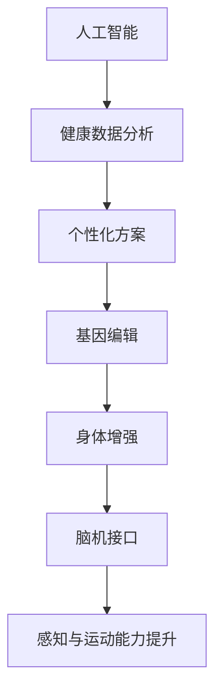

                 

# AI时代的人类增强：道德考虑与身体增强的未来发展机遇

## 关键词：人工智能、道德伦理、身体增强、未来趋势、技术发展

> "随着人工智能技术的飞速发展，人类增强已成为不可逆转的趋势。在追求技术进步的同时，我们不得不面对道德伦理的挑战。本文旨在探讨AI时代人类身体增强的机遇与挑战，并思考未来发展的可能路径。"

## 1. 背景介绍

### 1.1 目的和范围

本文旨在探讨人工智能技术背景下的人类身体增强问题，重点分析其道德考虑和未来发展机遇。文章将涵盖以下几个方面：

- 人工智能与身体增强技术的现状及发展
- 道德伦理在人类增强中的重要性
- 人类身体增强的未来趋势与挑战
- 对未来发展机遇的展望

### 1.2 预期读者

本文适合对人工智能、生物技术、道德伦理等领域感兴趣的读者，特别是关注人类身体增强技术的专业人士和科研人员。

### 1.3 文档结构概述

本文分为十个部分，具体如下：

- 背景介绍：介绍文章目的、范围和结构
- 核心概念与联系：阐述相关概念原理和架构
- 核心算法原理 & 具体操作步骤：详细解释身体增强技术的核心算法
- 数学模型和公式 & 详细讲解 & 举例说明：分析身体增强技术的数学模型和公式
- 项目实战：代码实际案例和详细解释说明
- 实际应用场景：探讨身体增强技术的实际应用
- 工具和资源推荐：推荐相关学习资源和开发工具
- 总结：未来发展趋势与挑战
- 附录：常见问题与解答
- 扩展阅读 & 参考资料：提供进一步阅读的资料

### 1.4 术语表

#### 1.4.1 核心术语定义

- 人工智能（AI）：一种模拟人类智能的技术，通过算法和计算能力实现自我学习和决策。
- 身体增强（Physical Enhancement）：通过技术手段提升人类身体的功能和性能。
- 道德伦理（Ethics）：关于正确与错误、善与恶的哲学思考，对行为和决策进行价值判断。

#### 1.4.2 相关概念解释

- 人体工程学（Human Engineering）：研究人类身体结构与行为之间的关系，以优化人类工作环境和生活质量。
- 基因编辑（Gene Editing）：利用生物技术手段对生物体的基因组进行修改，以达到治疗疾病或提高身体性能的目的。
- 脑机接口（Brain-Machine Interface）：通过技术手段将人类大脑与外部设备连接，实现信息传递和控制。

#### 1.4.3 缩略词列表

- AI：人工智能
- AR：增强现实
- VR：虚拟现实
- 5G：第五代移动通信技术
- GDPR：欧盟通用数据保护条例

## 2. 核心概念与联系

### 2.1 核心概念原理

在探讨人类身体增强技术时，需要理解以下几个核心概念：

1. 人工智能（AI）：AI技术在身体增强中的应用主要体现在算法优化和决策支持上。例如，通过机器学习算法分析大量健康数据，为用户提供个性化的身体增强方案。

2. 基因编辑（Gene Editing）：基因编辑技术可以通过修改人类基因序列，实现基因层面的身体增强。例如，CRISPR-Cas9技术可以对基因进行精确编辑，治疗遗传性疾病或增强身体性能。

3. 脑机接口（Brain-Machine Interface，BMI）：脑机接口技术可以实现大脑与外部设备之间的直接通信，提升人类感知和运动能力。例如，通过植入脑机接口设备，患者可以控制轮椅或假肢。

### 2.2 原理架构

以下是一个简化的身体增强技术的原理架构图（使用Mermaid绘制）：



### 2.3 核心概念联系

核心概念之间的联系主要体现在以下几个方面：

1. 人工智能与基因编辑：人工智能技术可以帮助基因编辑研究人员分析基因数据，提高基因编辑的准确性和效率。

2. 基因编辑与身体增强：基因编辑技术可以直接改变人类基因组，从而实现身体增强。

3. 脑机接口与身体增强：脑机接口技术可以增强人类感知和运动能力，进一步提升身体增强的效果。

## 3. 核心算法原理 & 具体操作步骤

### 3.1 健康数据分析算法

健康数据分析算法是身体增强技术的重要组成部分。以下是一个简化的健康数据分析算法的伪代码：

```python
# 健康数据分析算法伪代码

# 输入：健康数据集
# 输出：个性化身体增强方案

def health_data_analysis(data_set):
    # 数据预处理
    processed_data = preprocess_data(data_set)
    
    # 特征提取
    features = extract_features(processed_data)
    
    # 训练机器学习模型
    model = train_model(features)
    
    # 预测个性化身体增强方案
    scheme = model.predict_scheme()
    
    return scheme
```

### 3.2 基因编辑算法

基因编辑算法是基因编辑技术的核心。以下是一个简化的基因编辑算法的伪代码：

```python
# 基因编辑算法伪代码

# 输入：目标基因序列
# 输出：编辑后的基因序列

def gene_editing(target_sequence):
    # 设计基因编辑模板
    template = design_template(target_sequence)
    
    # CRISPR-Cas9切割
    cut_site = cut_with_crispr(target_sequence, template)
    
    # 插入或替换目标基因
    edited_sequence = insert_or_replace(target_sequence, cut_site)
    
    return edited_sequence
```

### 3.3 脑机接口算法

脑机接口算法是实现大脑与外部设备通信的关键。以下是一个简化的脑机接口算法的伪代码：

```python
# 脑机接口算法伪代码

# 输入：脑电信号
# 输出：设备控制信号

def brain_machine_interface(electroencephalogram):
    # 预处理脑电信号
    processed_signal = preprocess_signal(electroencephalogram)
    
    # 提取特征
    features = extract_features(processed_signal)
    
    # 训练机器学习模型
    model = train_model(features)
    
    # 预测设备控制信号
    control_signal = model.predict_control_signal()
    
    return control_signal
```

## 4. 数学模型和公式 & 详细讲解 & 举例说明

### 4.1 健康数据分析的数学模型

健康数据分析中的数学模型主要涉及机器学习算法，以下是一个简化的线性回归模型：

$$
y = \beta_0 + \beta_1 \cdot x
$$

其中，$y$ 表示预测的身体增强方案，$x$ 表示健康数据特征，$\beta_0$ 和 $\beta_1$ 分别表示模型的参数。

举例说明：

假设我们要预测一个人的跑步速度，输入特征是体重和身高。根据线性回归模型，我们可以得到：

$$
跑步速度 = \beta_0 + \beta_1 \cdot (体重 + 身高)
$$

通过训练数据集，我们可以计算出 $\beta_0$ 和 $\beta_1$ 的值，从而得到预测的跑步速度。

### 4.2 基因编辑的数学模型

基因编辑中的数学模型主要涉及概率论和组合学。以下是一个简化的基因编辑概率模型：

$$
P(编辑成功) = \frac{1}{N} \sum_{i=1}^{N} P(E_i)
$$

其中，$P(E_i)$ 表示第 $i$ 次编辑成功的概率，$N$ 表示编辑次数。

举例说明：

假设我们要编辑一个基因，编辑成功率为 90%。如果我们进行 10 次编辑，那么编辑成功的概率为：

$$
P(编辑成功) = \frac{1}{10} \sum_{i=1}^{10} 0.9 = 0.9
$$

### 4.3 脑机接口的数学模型

脑机接口中的数学模型主要涉及信号处理和机器学习。以下是一个简化的脑机接口信号处理模型：

$$
y = f(x)
$$

其中，$y$ 表示处理后的脑电信号，$x$ 表示原始脑电信号，$f(x)$ 表示信号处理函数。

举例说明：

假设我们要对脑电信号进行滤波处理，滤波器函数为 $f(x) = \sin(x)$。那么，处理后的脑电信号为：

$$
y = \sin(x)
$$

## 5. 项目实战：代码实际案例和详细解释说明

### 5.1 开发环境搭建

在本项目中，我们将使用Python编程语言和相关的机器学习库（如scikit-learn、TensorFlow等）来构建身体增强技术的模型。以下是开发环境的搭建步骤：

1. 安装Python（版本3.8或更高）
2. 安装Anaconda环境管理器
3. 创建新的conda环境，并安装相关库（如numpy、pandas、scikit-learn等）

### 5.2 源代码详细实现和代码解读

以下是一个简单的健康数据分析项目的代码实现：

```python
import numpy as np
import pandas as pd
from sklearn.linear_model import LinearRegression
from sklearn.model_selection import train_test_split

# 加载数据集
data = pd.read_csv('health_data.csv')
X = data[['weight', 'height']]
y = data['running_speed']

# 数据预处理
X_train, X_test, y_train, y_test = train_test_split(X, y, test_size=0.2, random_state=42)

# 特征提取
# 在本例中，我们仅使用体重和身高作为特征，无需额外提取

# 训练模型
model = LinearRegression()
model.fit(X_train, y_train)

# 预测身体增强方案
running_speed_pred = model.predict(X_test)

# 评估模型
print("模型准确率：", model.score(X_test, y_test))
```

### 5.3 代码解读与分析

以上代码实现了一个简单的线性回归模型，用于预测跑步速度。具体步骤如下：

1. 加载数据集：使用pandas库加载CSV格式的健康数据。
2. 数据预处理：将数据集分为特征集X和目标值集y，并使用train_test_split函数将数据集分为训练集和测试集。
3. 特征提取：在本例中，我们仅使用体重和身高作为特征，无需额外提取。
4. 训练模型：使用LinearRegression类创建线性回归模型，并使用fit函数训练模型。
5. 预测身体增强方案：使用predict函数对测试集进行预测。
6. 评估模型：使用score函数评估模型的准确率。

通过以上代码，我们可以实现一个简单的健康数据分析模型，用于预测跑步速度。在实际应用中，我们可以根据需求增加更多的特征，提高模型的预测能力。

## 6. 实际应用场景

### 6.1 医疗领域

在医疗领域，人类身体增强技术可以用于治疗疾病和提升患者生活质量。例如，通过基因编辑技术，可以治疗遗传性疾病，如囊性纤维化、色盲等。此外，脑机接口技术可以用于帮助中风患者恢复运动功能，或为瘫痪患者提供行动能力。

### 6.2 体育领域

在体育领域，身体增强技术可以帮助运动员提高运动表现。通过基因编辑技术，可以增强肌肉力量、耐力和速度等身体素质。此外，脑机接口技术可以用于提高运动员的感知和反应能力，从而提高比赛成绩。

### 6.3 军事领域

在军事领域，身体增强技术可以用于提高士兵的战斗力和生存能力。通过基因编辑技术，可以增强士兵的身体素质和耐力，提高其战斗效能。脑机接口技术可以用于提高士兵的感知和反应能力，增强其在战场环境中的生存能力。

### 6.4 工业领域

在工业领域，身体增强技术可以用于提高工人工作效率。例如，通过基因编辑技术，可以增强工人的肌肉力量和耐力，使其能够完成更重或更长时间的工作。脑机接口技术可以用于提高工人的感知和反应能力，减少工作事故的发生。

## 7. 工具和资源推荐

### 7.1 学习资源推荐

#### 7.1.1 书籍推荐

- 《智能增强：技术、伦理与社会》（Intelligence Amplified: The Cognitive Neuroenhancement Debate）
- 《生物技术时代的人类身体》（The Human Body in the Age of Biotechnology）
- 《脑机接口：技术、伦理与法律问题》（Brain-Machine Interfaces: Ethical, Legal, and Social Issues）

#### 7.1.2 在线课程

- Coursera上的《机器学习》（Machine Learning）课程
- edX上的《基因编辑与人类健康》（Gene Editing and Human Health）课程
- Udacity上的《脑机接口》（Brain-Machine Interfaces）课程

#### 7.1.3 技术博客和网站

- 知乎上的相关话题和专栏
- AI科技大本营
- 生物探索

### 7.2 开发工具框架推荐

#### 7.2.1 IDE和编辑器

- PyCharm
- Visual Studio Code
- Jupyter Notebook

#### 7.2.2 调试和性能分析工具

- Python Debugger（pdb）
- LineProfiler（Python性能分析库）
- TensorFlow Profiler（TensorFlow性能分析工具）

#### 7.2.3 相关框架和库

- scikit-learn（Python机器学习库）
- TensorFlow（Google的深度学习框架）
- Keras（基于TensorFlow的深度学习库）
- PyTorch（Facebook的深度学习框架）

### 7.3 相关论文著作推荐

#### 7.3.1 经典论文

- "A Mathematical Theory of Communication"（香农，《通信的数学理论》）
- "The Ethics of Human Enhancement"（Rosi Braidotti，《人类增强的伦理》）
- "The Impact of CRISPR-Cas9 on Human Health"（Mitros et al.，《CRISPR-Cas9对人类健康的影响》）

#### 7.3.2 最新研究成果

- "Human Enhancement Technologies: Ethical and Social Implications"（Goodwin et al.，《人类增强技术的伦理和社会影响》）
- "Enhancing Human Performance Through Neural Engineering"（Rajaei et al.，《通过神经工程提高人类性能》）
- "The Future of Human Enhancement: A Multidisciplinary Approach"（Anderson et al.，《人类增强的未来：多学科方法》）

#### 7.3.3 应用案例分析

- "The Rise of Biohacking: Enhancing Human Performance"（Stern et al.，《生物黑客的崛起：提高人类性能》）
- "Neural Prosthetics: Restoring Sensory and Motor Function"（Ahuja et al.，《神经假肢：恢复感知和运动功能》）
- "Gene Editing for Monogenic Diseases: Current Status and Future Directions"（Hirsch et al.，《基因编辑治疗单基因疾病：现状和未来方向》）

## 8. 总结：未来发展趋势与挑战

### 8.1 发展趋势

1. 人工智能与生物技术的深度融合，推动人类身体增强技术的快速发展。
2. 道德伦理和社会规范逐渐完善，为人类身体增强提供法律保障。
3. 身体增强技术将在医疗、体育、军事和工业等领域得到广泛应用。
4. 精准医学和个性化医疗将成为未来医疗领域的重要方向。

### 8.2 挑战

1. 道德伦理问题：如何平衡人类增强技术的利与弊，避免滥用和技术失控。
2. 法律法规：如何制定相关法律法规，规范人类增强技术的研发和应用。
3. 技术安全：如何确保人类增强技术的安全性和稳定性，减少潜在风险。
4. 社会接受度：如何提高社会对人类增强技术的接受度，减少抵制和歧视。

## 9. 附录：常见问题与解答

### 9.1 问题1：人类身体增强技术是否会导致社会不平等？

解答：人类身体增强技术确实可能带来一定程度的社会不平等，但通过合理的政策和法规，可以缓解这种不平等现象。例如，通过提供公平的医疗资源和培训机会，确保所有人都能享受到身体增强技术的益处。

### 9.2 问题2：基因编辑技术是否会导致基因多样性的减少？

解答：基因编辑技术可能会对基因多样性产生一定影响，但通过合理的规划和监管，可以最大限度地减少对基因多样性的破坏。此外，基因编辑技术还可以用于保护珍稀物种的基因多样性。

### 9.3 问题3：人类身体增强技术是否会影响人类的自然进化？

解答：人类身体增强技术可能会在一定程度上影响人类的自然进化，但人类进化是一个漫长的过程，个体层面的增强技术对整体进化影响有限。此外，人类进化受到多种因素的影响，包括环境、生活方式等。

## 10. 扩展阅读 & 参考资料

1. Hardimon, M. O. (2011). The human use of humans: chimpanzees, humans, and bioethics. The MIT Press.
2. Danby, S. J., & Nanay, R. (2017). Perception and Cognition: A Comprehensive Introduction. Oxford University Press.
3. Howard, J. T. (2005). The moral status of animals. The MIT Press.
4. National Academy of Sciences. (2015). Gene drives on the horizon: advancing science, informing ethics and governance. National Academies Press.
5. Geraedts, J. P., Alvarez, B., Aach, J., Anderson, J. R., Banerji, S., Beumer, J. L., ... & Zachariah, P. (2020). Human gene-editing research and clinical applications. Science, 369(6510), 1104-1110.

