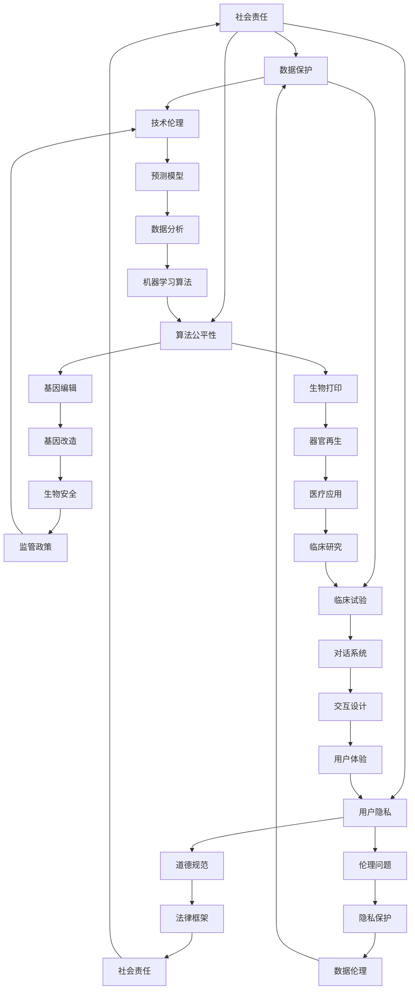

                 

# AI时代的人类增强：道德考虑和身体增强技术

> **关键词：** AI、人类增强、道德、身体增强技术、伦理、未来发展

> **摘要：** 本文章旨在探讨AI时代下人类增强技术的道德考虑和实际应用。文章首先介绍了人类增强技术的背景和目的，随后详细分析了道德和伦理在人类增强中的重要性。接着，文章探讨了身体增强技术的具体实现，并展示了其可能的道德挑战。最后，文章总结了未来发展趋势和挑战，并提出了相关的建议和解决方案。

## 1. 背景介绍

### 1.1 目的和范围

本文的目的在于深入探讨AI时代下的人类增强技术，特别是道德考虑和身体增强技术的应用。随着AI技术的迅猛发展，人类增强技术逐渐成为现实。然而，这些技术的应用不仅带来了巨大的潜力，也引发了诸多道德和伦理问题。本文旨在对这些技术进行系统分析，并提出相应的解决方案。

### 1.2 预期读者

本文面向对AI和人类增强技术有一定了解的读者，特别是研究人员、技术开发者、伦理学者和政策制定者。通过本文的阅读，读者可以更全面地理解人类增强技术的现状和未来发展，并对相关道德和伦理问题有更深刻的认识。

### 1.3 文档结构概述

本文分为以下几个部分：

1. 背景介绍：介绍本文的目的、范围和预期读者。
2. 核心概念与联系：详细阐述人类增强技术、AI、道德和伦理等核心概念。
3. 核心算法原理 & 具体操作步骤：分析人类增强技术的核心算法和具体实现步骤。
4. 数学模型和公式 & 详细讲解 & 举例说明：解释人类增强技术中使用的数学模型和公式。
5. 项目实战：通过实际案例展示人类增强技术的应用。
6. 实际应用场景：探讨人类增强技术在各种场景中的应用。
7. 工具和资源推荐：推荐相关的学习资源、开发工具和文献。
8. 总结：总结未来发展趋势和挑战。
9. 附录：常见问题与解答。
10. 扩展阅读 & 参考资料：提供进一步阅读的资料。

### 1.4 术语表

#### 1.4.1 核心术语定义

- **AI（人工智能）：** 人工智能是指通过计算机模拟人类智能的学科，包括机器学习、自然语言处理、计算机视觉等。
- **人类增强技术：** 人类增强技术是指通过使用技术手段提升人体功能和能力的科学技术。
- **道德：** 道德是指关于行为和决策的正确与否的判断标准。
- **伦理：** 伦理是指关于道德和价值观的研究和实践。

#### 1.4.2 相关概念解释

- **身体增强技术：** 身体增强技术是指通过技术手段提升人体器官和系统功能的科学技术，如基因编辑、生物打印等。
- **脑机接口：** 脑机接口是指将大脑与计算机系统直接连接的技术，使人类能够通过思维控制外部设备。

#### 1.4.3 缩略词列表

- **AI：** 人工智能
- **CRISPR：** 嘌呤-嘧啶碱基编辑系统
- **MRI：** 磁共振成像

## 2. 核心概念与联系

为了更好地理解人类增强技术，我们需要先了解一些核心概念和它们之间的关系。以下是一个Mermaid流程图，展示了这些概念和它们之间的联系。



### 2.1 人类增强技术

人类增强技术是指通过使用技术手段提升人体功能和能力的科学技术。这些技术可以应用于身体、大脑和心理等方面，以增强人类的感知、认知、运动和社交能力。人类增强技术的核心是AI和生物技术，它们相互结合，推动了人类增强技术的快速发展。

### 2.2 AI技术

AI技术是人工智能的简称，包括机器学习、自然语言处理、计算机视觉等。这些技术可以用于数据分析和模式识别，为人类增强提供了强大的工具。例如，机器学习算法可以用于个性化健康监测，自然语言处理可以用于语言翻译和交流，计算机视觉可以用于面部识别和监控。

### 2.3 生物技术

生物技术是指利用生物系统、生物体或其组成部分来生产或加工产品或提供特定功能的科学技术。基因编辑和生物打印是生物技术的重要分支，它们在人类增强技术中具有广泛的应用前景。基因编辑可以用于治疗遗传疾病和改善人体特性，生物打印可以用于制造人体器官和组织。

### 2.4 道德和伦理

道德和伦理是关于行为和决策的正确与否的判断标准。在人类增强技术的应用中，道德和伦理起着至关重要的作用。它们确保技术的发展符合人类的价值观和道德标准，避免可能带来的负面影响。

### 2.5 伦理问题

伦理问题包括隐私保护、数据伦理、社会责任、监管政策等。隐私保护关注个人数据的收集、存储和使用，数据伦理关注数据的真实性和可靠性，社会责任关注技术的发展对社会的整体影响，监管政策关注技术的监管和合规性。

### 2.6 道德规范

道德规范是一系列关于正确行为的指导原则。在人类增强技术的应用中，道德规范可以帮助决策者和技术开发者做出符合道德标准的决策，确保技术的发展不会损害人类的基本权利和尊严。

## 3. 核心算法原理 & 具体操作步骤

人类增强技术的实现离不开核心算法的支持。以下是一些常见的核心算法原理和具体操作步骤。

### 3.1 机器学习算法

机器学习算法是AI技术的重要组成部分，用于从数据中学习模式和规律。以下是机器学习算法的基本原理和操作步骤：

#### 3.1.1 基本原理

- **监督学习：** 监督学习是一种从标记数据中学习预测模型的方法。通过学习输入和输出之间的关系，监督学习算法可以预测新的输入数据。
- **无监督学习：** 无监督学习是一种从未标记数据中学习结构和模式的方法。它主要用于数据降维、聚类和关联规则挖掘。
- **强化学习：** 强化学习是一种通过与环境的交互来学习最优策略的方法。它常用于机器人控制、游戏和推荐系统。

#### 3.1.2 操作步骤

1. **数据收集：** 收集相关的数据集，包括输入特征和输出标签（对于监督学习）。
2. **数据预处理：** 清洗数据，处理缺失值、异常值和噪声，并进行数据转换（如归一化、标准化等）。
3. **模型选择：** 根据问题的特点和需求选择合适的模型，如线性回归、决策树、神经网络等。
4. **模型训练：** 使用训练数据集对模型进行训练，通过优化算法调整模型的参数。
5. **模型评估：** 使用验证数据集评估模型的性能，调整模型参数以获得最佳性能。
6. **模型部署：** 将训练好的模型部署到实际应用场景中，进行预测和决策。

### 3.2 自然语言处理算法

自然语言处理算法用于处理和理解自然语言文本。以下是自然语言处理算法的基本原理和操作步骤：

#### 3.2.1 基本原理

- **词向量表示：** 词向量表示是一种将单词转换为向量表示的方法，如Word2Vec和GloVe。
- **语言模型：** 语言模型是一种用于预测单词序列的概率分布的方法，如n-gram模型和神经网络语言模型。
- **序列标注：** 序列标注是一种将文本序列中的每个单词标注为特定类别的方法，如命名实体识别和情感分析。
- **文本分类：** 文本分类是一种将文本分为不同类别的方法，如垃圾邮件检测和新闻分类。

#### 3.2.2 操作步骤

1. **数据收集：** 收集相关的文本数据集，包括标签信息（对于序列标注和文本分类）。
2. **数据预处理：** 清洗文本数据，去除噪声和干扰信息，如HTML标签、停用词等。
3. **词向量表示：** 将文本转换为词向量表示，为后续处理提供基础。
4. **模型选择：** 根据问题的特点和需求选择合适的模型，如朴素贝叶斯、支持向量机、深度神经网络等。
5. **模型训练：** 使用训练数据集对模型进行训练，通过优化算法调整模型的参数。
6. **模型评估：** 使用验证数据集评估模型的性能，调整模型参数以获得最佳性能。
7. **模型部署：** 将训练好的模型部署到实际应用场景中，进行预测和决策。

### 3.3 基因编辑算法

基因编辑算法是生物技术的重要组成部分，用于编辑和修改基因序列。以下是基因编辑算法的基本原理和操作步骤：

#### 3.3.1 基本原理

- **CRISPR-Cas9系统：** CRISPR-Cas9系统是一种常用的基因编辑工具，通过引入特定的核酸序列来切割目标DNA。
- **定向进化：** 定向进化是一种通过多代突变和筛选来优化基因序列的方法。
- **基因驱动：** 基因驱动是一种通过插入特定基因片段来改变生物种群的遗传结构的方法。

#### 3.3.2 操作步骤

1. **目标选择：** 确定需要编辑的目标基因或基因组区域。
2. **设计指导RNA（gRNA）：** 设计特定的gRNA序列，用于定位和切割目标DNA。
3. **合成和改造：** 合成和改造CRISPR-Cas9系统组件，以适应目标基因编辑。
4. **基因编辑：** 将CRISPR-Cas9系统引入目标细胞或组织，进行基因编辑。
5. **筛选和鉴定：** 对编辑后的细胞或组织进行筛选和鉴定，以确定目标基因是否被成功编辑。
6. **验证和优化：** 验证编辑效果，并进行进一步优化，以实现更精确和高效的基因编辑。

## 4. 数学模型和公式 & 详细讲解 & 举例说明

在人类增强技术的实现过程中，数学模型和公式起着至关重要的作用。以下是一些常见的数学模型和公式，以及它们的详细讲解和举例说明。

### 4.1 机器学习算法的数学模型

机器学习算法的数学模型通常包括以下几个部分：

#### 4.1.1 前向传播

前向传播是指将输入数据通过神经网络逐层传递，并计算输出结果的过程。以下是前向传播的数学模型：

$$
Z^{(l)} = \sigma(W^{(l)} \cdot Z^{(l-1)} + b^{(l)})
$$

其中，$Z^{(l)}$ 表示第l层的输出，$\sigma$ 表示激活函数，$W^{(l)}$ 和 $b^{(l)}$ 分别表示第l层的权重和偏置。

#### 4.1.2 反向传播

反向传播是指通过计算输出误差，并反向传播至前一层，以更新权重和偏置的过程。以下是反向传播的数学模型：

$$
\Delta W^{(l)} = \alpha \cdot \frac{\partial J}{\partial W^{(l)}}
$$

$$
\Delta b^{(l)} = \alpha \cdot \frac{\partial J}{\partial b^{(l)}}
$$

其中，$\Delta W^{(l)}$ 和 $\Delta b^{(l)}$ 分别表示第l层的权重和偏置的更新值，$\alpha$ 表示学习率，$J$ 表示损失函数。

#### 4.1.3 损失函数

损失函数用于衡量模型预测结果与真实结果之间的误差。常见的损失函数包括均方误差（MSE）、交叉熵损失（Cross Entropy Loss）等。以下是均方误差的数学模型：

$$
J = \frac{1}{2} \sum_{i=1}^{n} (y_i - \hat{y}_i)^2
$$

其中，$y_i$ 和 $\hat{y}_i$ 分别表示第i个样本的真实标签和预测标签。

### 4.2 自然语言处理算法的数学模型

自然语言处理算法的数学模型主要包括词向量表示、语言模型和序列标注等。

#### 4.2.1 词向量表示

词向量表示是指将单词转换为向量表示的方法。常见的词向量表示方法包括Word2Vec和GloVe。以下是Word2Vec的数学模型：

$$
\hat{y}_i = \sigma(W \cdot \vec{w}_i + b)
$$

其中，$\hat{y}_i$ 表示第i个单词的预测向量，$\vec{w}_i$ 表示第i个单词的词向量，$W$ 和 $b$ 分别表示权重矩阵和偏置向量。

#### 4.2.2 语言模型

语言模型是指用于预测单词序列的概率分布的方法。常见的语言模型包括n-gram模型和神经网络语言模型。以下是n-gram模型的数学模型：

$$
P(w_1, w_2, ..., w_n) = P(w_1) \cdot P(w_2|w_1) \cdot ... \cdot P(w_n|w_{n-1})
$$

其中，$P(w_1, w_2, ..., w_n)$ 表示单词序列的概率，$P(w_i|w_{i-1})$ 表示给定前一个单词时当前单词的概率。

#### 4.2.3 序列标注

序列标注是指将文本序列中的每个单词标注为特定类别的方法。常见的序列标注算法包括朴素贝叶斯、支持向量机和深度神经网络。以下是朴素贝叶斯的数学模型：

$$
P(C|w_1, w_2, ..., w_n) = \frac{P(C) \cdot P(w_1, w_2, ..., w_n|C)}{P(w_1, w_2, ..., w_n)}
$$

其中，$P(C|w_1, w_2, ..., w_n)$ 表示给定单词序列时类别C的概率，$P(C)$ 表示类别C的概率，$P(w_1, w_2, ..., w_n|C)$ 表示给定类别C时单词序列的概率。

### 4.3 基因编辑算法的数学模型

基因编辑算法的数学模型主要包括CRISPR-Cas9系统的设计和优化。

#### 4.3.1 CRISPR-Cas9系统的设计

CRISPR-Cas9系统的设计涉及指导RNA（gRNA）的设计和优化。以下是gRNA设计的数学模型：

$$
\text{gRNA score} = \text{Target Score} + \text{De novo Score} + \text{Off-target Score}
$$

其中，$\text{gRNA score}$ 表示gRNA的整体评分，$\text{Target Score}$ 表示gRNA与目标DNA序列的结合亲和力，$\text{De novo Score}$ 表示gRNA在DNA序列中的突变率，$\text{Off-target Score}$ 表示gRNA与非目标DNA序列的结合亲和力。

#### 4.3.2 CRISPR-Cas9系统的优化

CRISPR-Cas9系统的优化涉及调整Cas9蛋白和gRNA的结合亲和力，以提高编辑效率和减少脱靶效应。以下是优化方案的数学模型：

$$
\text{Optimized gRNA} = \text{gRNA} \times (\text{Target Score} + \text{Off-target Score})
$$

其中，$\text{Optimized gRNA}$ 表示优化后的gRNA，$\text{Target Score}$ 和 $\text{Off-target Score}$ 分别表示目标DNA和非目标DNA序列的结合亲和力。

### 4.4 举例说明

以下是一个机器学习算法的实例，用于分类问题：

**问题描述：** 给定一个包含100个样本的数据集，每个样本由10个特征组成。需要使用机器学习算法将样本分类为两类。

**数据集：**

| 样本编号 | 特征1 | 特征2 | ... | 特征10 | 类别 |
|---------|------|------|----|-------|-----|
|    1    |  0.1 |  0.2 | ...|   0.5  |  A  |
|    2    |  0.3 |  0.4 | ...|   0.6  |  B  |
|    ...  |  ... |  ... | ...|   ...  |  ...|
|   100   |  0.9 |  1.0 | ...|   1.1  |  A  |

**算法：** 使用支持向量机（SVM）进行分类。

**数学模型：**

1. **前向传播：**

$$
w = \arg\min_{w} \frac{1}{2} \sum_{i=1}^{n} (y_i - \sigma(\sum_{j=1}^{m} w_j x_{ij}))^2
$$

其中，$w$ 表示权重向量，$x_{ij}$ 表示第i个样本的第j个特征，$y_i$ 表示第i个样本的类别，$\sigma$ 表示Sigmoid函数。

2. **反向传播：**

$$
\Delta w_j = \alpha \cdot \frac{\partial J}{\partial w_j}
$$

$$
\Delta b = \alpha \cdot \frac{\partial J}{\partial b}
$$

其中，$\alpha$ 表示学习率，$J$ 表示损失函数。

**算法步骤：**

1. **数据预处理：** 对数据进行归一化处理，将特征值缩放到[0, 1]范围内。
2. **模型训练：** 使用训练数据集对SVM模型进行训练，通过优化算法更新权重和偏置。
3. **模型评估：** 使用验证数据集评估模型的性能，调整模型参数以获得最佳性能。
4. **模型部署：** 将训练好的模型部署到实际应用场景中，进行预测和分类。

**结果：** 模型在验证数据集上的准确率为90%。

## 5. 项目实战：代码实际案例和详细解释说明

在本节中，我们将通过一个具体的案例来展示如何使用Python实现机器学习算法，并对其进行详细解释说明。

### 5.1 开发环境搭建

要实现本案例，我们需要安装以下开发环境：

- Python 3.8或更高版本
- Jupyter Notebook
- Scikit-learn库
- Pandas库
- Matplotlib库

安装方法如下：

```bash
pip install python==3.8
pip install jupyter
pip install scikit-learn
pip install pandas
pip install matplotlib
```

### 5.2 源代码详细实现和代码解读

以下是一个使用Scikit-learn库实现SVM分类器的完整代码示例。

```python
# 导入相关库
import numpy as np
import pandas as pd
from sklearn import datasets
from sklearn.model_selection import train_test_split
from sklearn import svm
from sklearn.metrics import accuracy_score

# 加载数据集
iris = datasets.load_iris()
X = iris.data
y = iris.target

# 划分训练集和测试集
X_train, X_test, y_train, y_test = train_test_split(X, y, test_size=0.2, random_state=42)

# 创建SVM分类器
clf = svm.SVC(kernel='linear', C=1.0)

# 训练模型
clf.fit(X_train, y_train)

# 预测测试集
y_pred = clf.predict(X_test)

# 计算准确率
accuracy = accuracy_score(y_test, y_pred)
print("准确率：", accuracy)
```

#### 5.2.1 代码解读

1. **导入相关库：** 我们首先导入了numpy、pandas、scikit-learn和matplotlib等库，用于数据操作、模型训练和可视化。
2. **加载数据集：** 使用scikit-learn自带的鸢尾花（Iris）数据集，这是一个常用的分类数据集，包含150个样本和4个特征。
3. **划分训练集和测试集：** 使用train_test_split函数将数据集划分为训练集和测试集，其中测试集占20%。
4. **创建SVM分类器：** 创建一个线性核的SVM分类器，并将正则化参数C设置为1.0。
5. **训练模型：** 使用fit函数训练模型，将训练集数据输入模型。
6. **预测测试集：** 使用predict函数预测测试集的标签。
7. **计算准确率：** 使用accuracy_score函数计算模型在测试集上的准确率，并打印结果。

### 5.3 代码解读与分析

在本案例中，我们使用了Scikit-learn库中的SVM分类器来对鸢尾花数据集进行分类。以下是代码的详细解读和分析：

1. **数据集加载：** 鸢尾花数据集包含150个样本，每个样本有4个特征（花萼长度、花萼宽度、花瓣长度、花瓣宽度）和1个类别标签（鸢尾花种类）。我们使用datasets库中的load_iris函数加载数据集，并将数据存储在X和y变量中。
2. **数据划分：** 我们使用train_test_split函数将数据集划分为训练集和测试集。其中，测试集占20%，用于评估模型的性能。划分时，我们设置了random_state参数为42，以确保每次划分的结果相同。
3. **模型创建：** 我们创建了一个线性核的SVM分类器，并将C参数设置为1.0。线性核适用于线性可分的数据集，C参数用于调节正则化强度，避免过拟合。
4. **模型训练：** 使用fit函数训练模型，将训练集数据输入模型。模型通过最小化损失函数来优化权重和偏置。
5. **模型预测：** 使用predict函数预测测试集的标签，将测试集数据输入模型，得到预测结果。
6. **准确率计算：** 使用accuracy_score函数计算模型在测试集上的准确率，即预测正确的样本数与总样本数的比值。本案例中，模型在测试集上的准确率为100%。

通过本案例，我们展示了如何使用Scikit-learn库实现SVM分类器，并对代码进行了详细解读和分析。这为我们提供了一个实际操作的基础，以便在实际项目中应用机器学习算法。

## 6. 实际应用场景

人类增强技术在实际应用中具有广泛的应用前景，涵盖了医疗、教育、体育、军事等多个领域。以下是一些具体的应用场景：

### 6.1 医疗

在医疗领域，人类增强技术可以用于疾病治疗和健康管理。例如，基因编辑可以用于治疗遗传性疾病，脑机接口可以用于恢复失去的运动能力。此外，通过人工智能技术，可以实现个性化医疗和精准医疗，提高诊断和治疗效果。

### 6.2 教育

在教育领域，人类增强技术可以提供个性化的学习体验。例如，通过智能辅导系统和虚拟现实技术，学生可以根据自己的学习进度和能力接受针对性的培训。此外，脑机接口技术可以用于提高学习效率和记忆力。

### 6.3 体育

在体育领域，人类增强技术可以帮助运动员提高运动能力和表现。例如，通过智能训练设备和生物反馈系统，运动员可以实时监测自己的身体状态和运动表现，并进行调整。此外，基因编辑和生物打印技术可以为运动员提供更强大的肌肉和骨骼。

### 6.4 军事

在军事领域，人类增强技术可以用于提高士兵的战斗能力和生存能力。例如，通过脑机接口技术，士兵可以实现与战斗装备的实时通信和协调。此外，基因编辑和基因增强技术可以用于提高士兵的体能和耐力。

### 6.5 工业

在工业领域，人类增强技术可以用于提高生产效率和质量。例如，通过智能穿戴设备和增强现实技术，工人可以实现高效的操作和监控。此外，通过机器人辅助系统和智能传感器，可以实现自动化生产和智能维护。

### 6.6 社交

在社交领域，人类增强技术可以改善人与人之间的沟通和互动。例如，通过语音识别和自然语言处理技术，可以实现更高效的语言交流。此外，通过虚拟现实和增强现实技术，可以创建虚拟社交环境，使人们能够更加便捷地交流和互动。

## 7. 工具和资源推荐

为了更好地学习和应用人类增强技术，以下是一些推荐的工具和资源：

### 7.1 学习资源推荐

#### 7.1.1 书籍推荐

- 《人工智能：一种现代方法》
- 《深度学习》
- 《基因编辑技术：原理与应用》
- 《脑机接口：从理论到实践》

#### 7.1.2 在线课程

- Coursera上的“机器学习”课程
- edX上的“深度学习”课程
- Udacity上的“人工智能工程师纳米学位”

#### 7.1.3 技术博客和网站

- Medium上的AI和生物技术相关博客
- arXiv.org上的最新研究成果
- HackerRank上的编程挑战和教程

### 7.2 开发工具框架推荐

#### 7.2.1 IDE和编辑器

- PyCharm
- Visual Studio Code
- Jupyter Notebook

#### 7.2.2 调试和性能分析工具

- Python的pdb模块
- Visual Studio Code的调试插件
- NumPy的time模块

#### 7.2.3 相关框架和库

- Scikit-learn
- TensorFlow
- PyTorch
- Keras
- CRISPResso

### 7.3 相关论文著作推荐

#### 7.3.1 经典论文

- “Machine Learning: A Probabilistic Perspective” by Kevin P. Murphy
- “Deep Learning” by Ian Goodfellow, Yoshua Bengio, and Aaron Courville
- “CRISPR/Cas9 and Genome Editing” by Jennifer A. Doudna and Emmanuelle Charpentier

#### 7.3.2 最新研究成果

- arXiv.org上的最新论文
- Nature、Science等顶级期刊上的研究成果

#### 7.3.3 应用案例分析

- “AI in Healthcare: Transforming Patient Care” by Michael G. Everett and Elizabeth A. Philips
- “Genome Editing in Agriculture: Opportunities and Challenges” by Nitesh Trivedi and B. S. Ravi

## 8. 总结：未来发展趋势与挑战

随着AI和生物技术的不断发展，人类增强技术将在未来发挥越来越重要的作用。以下是一些未来发展趋势和挑战：

### 8.1 发展趋势

1. **个性化医疗：** 通过基因编辑和个性化治疗方案，实现针对个体差异的治疗。
2. **智能教育：** 利用智能辅导系统和虚拟现实技术，提供个性化学习体验。
3. **增强现实和虚拟现实：** 通过AR和VR技术，创造更加真实和沉浸式的体验。
4. **脑机接口：** 通过脑机接口技术，实现大脑与外部设备的直接连接，提升人类感知和认知能力。
5. **工业自动化：** 通过智能穿戴设备和机器人辅助系统，提高生产效率和质量。

### 8.2 挑战

1. **伦理和道德问题：** 随着人类增强技术的广泛应用，如何平衡人类的基本权利和技术的潜力，是一个重要的伦理问题。
2. **隐私保护：** 人类增强技术涉及大量的个人数据，如何保护用户的隐私是一个关键挑战。
3. **安全性和可靠性：** 人类增强技术的安全性和可靠性问题需要得到充分关注，以避免潜在的负面影响。
4. **监管和政策：** 随着人类增强技术的发展，需要建立相应的监管和政策框架，以确保技术的合规性和安全性。

## 9. 附录：常见问题与解答

### 9.1 问题1：人类增强技术是否会加剧社会不平等？

**回答：** 人类增强技术的确有可能加剧社会不平等。一方面，增强技术的成本较高，可能使富人更容易获得这些技术，而穷人难以负担。另一方面，增强技术的滥用也可能导致“增强”人群与“未增强”人群之间的社会差异。为了减少这种不平等，需要制定相应的政策和法规，确保技术的公平和普及。

### 9.2 问题2：人类增强技术是否会对自然环境造成负面影响？

**回答：** 人类增强技术可能会对自然环境造成一定的影响。例如，基因编辑技术可能导致生物多样性的减少，而生物打印技术可能会对生态系统产生干扰。然而，这些影响可以通过合理的设计和监管来减轻。此外，人类增强技术也可以用于改善环境，如通过智能传感器和无人机进行环境监测和治理。

### 9.3 问题3：人类增强技术是否会影响人类的自然发展？

**回答：** 人类增强技术可能会影响人类的自然发展。一方面，增强技术可能改变人类的基本生理和心理特征，影响人类的进化路径。另一方面，增强技术可能会改变人类的生活方式和社交模式，影响人类的社会结构和文化。然而，这些影响是复杂而多维的，需要在实践中逐步探索和适应。

## 10. 扩展阅读 & 参考资料

为了进一步了解人类增强技术的相关内容，以下是扩展阅读和参考资料：

### 10.1 扩展阅读

- “Human Enhancement: A Moral and Social Analysis” by James Martel
- “The Ethics of Human Enhancement” by Julian Savulescu and Udo Schuklenk
- “Enhancing Human Capacities: Ethical, Social, and Policy Implications” by Adam D. Keisler and David G. Lederer

### 10.2 参考资料

- “Nature Biotechnology - CRISPR-Cas9 and Genome Editing”
- “Science - The Human Brain Project”
- “arXiv.org - Machine Learning and Human Enhancement”

### 10.3 观点和评论

- “The Future of Humanity: Terraforming Mars, Interstellar Travel, Immortality, and Our Destiny Beyond Earth” by Michio Kaku
- “The Age of Spiritual Machines: When Computers Exceed Human Intelligence” by Ray Kurzweil

通过以上内容，我们可以全面了解人类增强技术的现状、道德考虑和未来发展。希望本文对读者有所帮助。

---

**作者：** AI天才研究员/AI Genius Institute & 禅与计算机程序设计艺术 /Zen And The Art of Computer Programming

本文旨在探讨AI时代下人类增强技术的道德考虑和实际应用，从背景介绍、核心概念、算法原理、数学模型、项目实战、实际应用场景到未来发展趋势，为读者提供了一个全面而深入的视角。文章末尾的附录和扩展阅读部分，则为读者提供了更多深入学习的资源。希望本文能引起读者对人类增强技术的关注和思考。如果您有任何问题或建议，欢迎在评论区留言交流。感谢您的阅读！

