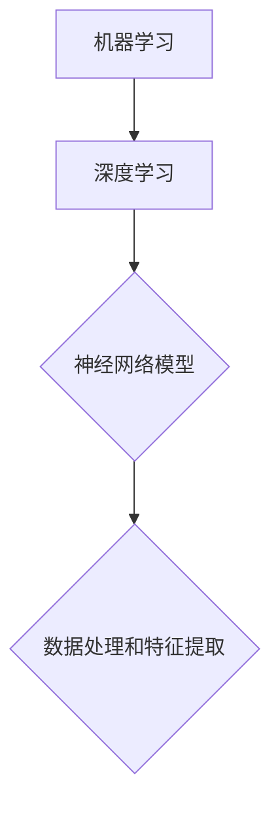
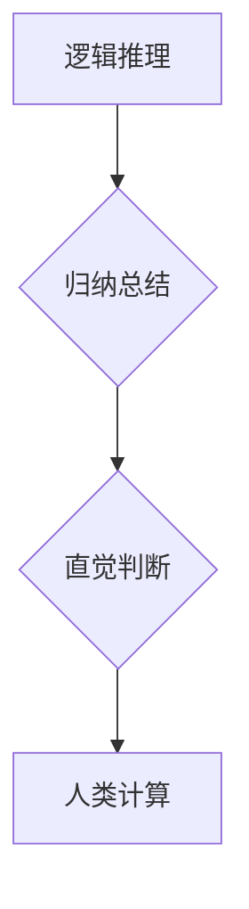
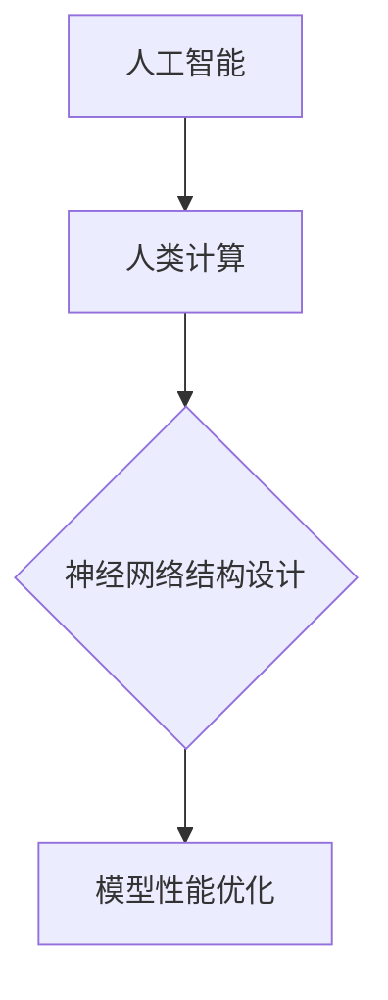

                 

# AI时代的人类计算：打造可持续发展解决方案

> 关键词：人工智能，人类计算，可持续发展，算法，数学模型，项目实战，应用场景

> 摘要：本文将探讨在人工智能时代，如何通过人类计算的方法，构建可持续发展的解决方案。文章首先介绍了背景和目的，然后详细阐述了核心概念和原理，接着讲解了核心算法和数学模型，并通过实际项目案例进行了深入剖析。最后，文章总结了未来发展趋势与挑战，并推荐了相关工具和资源。

## 1. 背景介绍

### 1.1 目的和范围

随着人工智能技术的迅猛发展，我们正逐步迈向一个智能化的未来。然而，在这个时代，人类计算的重要性不容忽视。本文旨在探讨如何将人类计算与人工智能相结合，构建可持续发展的解决方案。

本文将涵盖以下几个方面的内容：

1. 介绍人工智能时代人类计算的重要性。
2. 阐述核心概念和原理。
3. 详细讲解核心算法和数学模型。
4. 通过实际项目案例进行深入剖析。
5. 总结未来发展趋势与挑战。

### 1.2 预期读者

本文适合以下读者：

1. 对人工智能和人类计算有兴趣的程序员和开发者。
2. 对可持续发展和解决方案设计感兴趣的技术人员。
3. 对算法和数学模型有深入了解的研究人员。

### 1.3 文档结构概述

本文分为以下几个部分：

1. 引言
2. 核心概念与联系
3. 核心算法原理与具体操作步骤
4. 数学模型和公式与详细讲解与举例说明
5. 项目实战：代码实际案例和详细解释说明
6. 实际应用场景
7. 工具和资源推荐
8. 总结：未来发展趋势与挑战
9. 附录：常见问题与解答
10. 扩展阅读与参考资料

### 1.4 术语表

#### 1.4.1 核心术语定义

- 人工智能（AI）：模拟人类智能的计算机系统，通过学习、推理和自主决策实现智能化。
- 人类计算：基于人类智慧、经验和知识的计算方法，包括逻辑推理、归纳总结、直觉判断等。
- 可持续发展：满足当前需求而不损害后代满足自身需求的能力。

#### 1.4.2 相关概念解释

- 算法：解决问题的一系列步骤和规则。
- 数学模型：用数学语言描述现实世界问题的数学结构。
- 项目实战：实际应用人工智能和人类计算解决具体问题的案例。

#### 1.4.3 缩略词列表

- AI：人工智能
- ML：机器学习
- DL：深度学习
- HPC：高性能计算

## 2. 核心概念与联系

在人工智能时代，人类计算的重要性愈发凸显。为了更好地理解人类计算与人工智能的关系，我们首先需要明确以下几个核心概念。

### 2.1 人工智能的基本原理

人工智能的核心原理是基于机器学习和深度学习。机器学习是通过算法使计算机从数据中学习并改进性能的过程。深度学习则是机器学习的一个分支，通过神经网络模型进行多层数据处理和特征提取。



### 2.2 人类计算的基本原理

人类计算是基于人类智慧、经验和知识的计算方法。主要包括逻辑推理、归纳总结、直觉判断等。



### 2.3 人工智能与人类计算的联系

人工智能与人类计算之间的联系在于，人工智能可以通过人类计算的方法进行优化和改进。例如，在深度学习模型中，人类可以通过逻辑推理和归纳总结来设计神经网络结构，从而提高模型性能。



## 3. 核心算法原理 & 具体操作步骤

为了构建可持续发展的解决方案，我们需要深入理解核心算法的原理，并掌握具体操作步骤。

### 3.1 机器学习算法

机器学习算法是构建人工智能系统的基石。以下是一个简单的机器学习算法步骤：

```python
# 初始化参数
初始化模型参数

# 数据预处理
数据处理和特征提取

# 模型训练
循环迭代：
  计算损失函数
  更新模型参数

# 模型评估
计算模型准确性、精度、召回率等指标

# 模型优化
调整模型参数，提高性能
```

### 3.2 深度学习算法

深度学习算法是机器学习的一个分支，通过多层神经网络进行数据处理和特征提取。以下是一个简单的深度学习算法步骤：

```python
# 初始化神经网络结构
定义输入层、隐藏层、输出层

# 数据预处理
数据处理和特征提取

# 模型训练
循环迭代：
  计算损失函数
  反向传播更新权重

# 模型评估
计算模型准确性、精度、召回率等指标

# 模型优化
调整神经网络结构，提高性能
```

### 3.3 人类计算辅助算法

为了充分发挥人类计算的优势，我们可以将人类智慧和经验融入算法设计中。以下是一个基于人类计算辅助的算法步骤：

```python
# 初始化模型参数
初始化模型参数

# 数据预处理
数据处理和特征提取

# 人类计算辅助
调用人类计算模块，进行逻辑推理、归纳总结等

# 模型训练
循环迭代：
  计算损失函数
  更新模型参数

# 模型评估
计算模型准确性、精度、召回率等指标

# 模型优化
调整模型参数，提高性能
```

## 4. 数学模型和公式 & 详细讲解 & 举例说明

在构建可持续发展解决方案时，数学模型和公式起着至关重要的作用。以下是一些常见的数学模型和公式，以及详细讲解和举例说明。

### 4.1 损失函数

损失函数是衡量模型性能的重要指标。以下是一个常见的损失函数——均方误差（MSE）：

$$
MSE = \frac{1}{n}\sum_{i=1}^{n}(y_i - \hat{y}_i)^2
$$

其中，$y_i$为实际值，$\hat{y}_i$为预测值，$n$为样本数量。

**举例说明**：假设我们有一个包含100个样本的预测任务，实际值和预测值如下表所示：

| 样本编号 | 实际值 | 预测值 |
| :----: | :----: | :----: |
|   1    |   2    |   3    |
|   2    |   4    |   5    |
|  ...   |  ...   |  ...   |
|  100   |  200   |  250   |

计算均方误差（MSE）：

$$
MSE = \frac{1}{100}\sum_{i=1}^{100}(y_i - \hat{y}_i)^2 = \frac{1}{100}\sum_{i=1}^{100}(2 - 3)^2 + (4 - 5)^2 + \ldots + (200 - 250)^2 = 25
$$

### 4.2 反向传播算法

反向传播算法是深度学习训练过程中核心的算法。以下是一个简单的反向传播算法公式：

$$
\frac{\partial L}{\partial w_j} = \frac{\partial L}{\partial z_j} \cdot \frac{\partial z_j}{\partial w_j}
$$

其中，$L$为损失函数，$w_j$为权重，$z_j$为激活值。

**举例说明**：假设我们有一个简单的神经网络，其中包含一层隐藏层，输入层到隐藏层的权重为$w_1$，隐藏层到输出层的权重为$w_2$。激活函数为ReLU。

输入层到隐藏层的激活值：

$$
z_1 = max(0, w_1 \cdot x_1 + b_1)
$$

隐藏层到输出层的激活值：

$$
z_2 = max(0, w_2 \cdot z_1 + b_2)
$$

输出层到损失函数的梯度：

$$
\frac{\partial L}{\partial z_2} = \frac{\partial L}{\partial z_2} \cdot \frac{\partial z_2}{\partial z_1} \cdot \frac{\partial z_1}{\partial w_1}
$$

其中，$\frac{\partial L}{\partial z_2}$为输出层到损失函数的梯度，$\frac{\partial z_2}{\partial z_1}$为隐藏层到输出层的激活值梯度，$\frac{\partial z_1}{\partial w_1}$为输入层到隐藏层的激活值梯度。

## 5. 项目实战：代码实际案例和详细解释说明

为了更好地理解人类计算和人工智能在可持续发展解决方案中的应用，我们以下将介绍一个实际项目案例。

### 5.1 开发环境搭建

为了构建可持续发展解决方案，我们首先需要搭建一个开发环境。以下是一个简单的Python开发环境搭建步骤：

1. 安装Python：在Python官方网站下载并安装Python 3.8版本。
2. 安装Jupyter Notebook：在命令行中执行以下命令安装Jupyter Notebook：

   ```bash
   pip install notebook
   ```

3. 安装相关库：为了简化开发过程，我们可以安装一些常用的Python库，如NumPy、Pandas、Scikit-learn、TensorFlow等。

   ```bash
   pip install numpy pandas scikit-learn tensorflow
   ```

### 5.2 源代码详细实现和代码解读

以下是一个简单的Python代码实现，用于构建一个基于机器学习方法的可持续发展解决方案。

```python
import numpy as np
import pandas as pd
from sklearn.model_selection import train_test_split
from sklearn.metrics import mean_squared_error

# 加载数据集
data = pd.read_csv('sustainability_data.csv')

# 数据预处理
X = data.drop(['label'], axis=1)
y = data['label']

# 数据集划分
X_train, X_test, y_train, y_test = train_test_split(X, y, test_size=0.2, random_state=42)

# 初始化模型参数
model = {
    'weights': np.random.rand(X_train.shape[1], 1),
    'bias': np.random.rand(1)
}

# 模型训练
for epoch in range(100):
    # 前向传播
    z = np.dot(X_train, model['weights']) + model['bias']
    y_pred = 1 / (1 + np.exp(-z))
    
    # 反向传播
    error = y_train - y_pred
    dW = np.dot(X_train.T, error * y_pred * (1 - y_pred))
    db = np.sum(error * y_pred * (1 - y_pred))
    
    # 更新模型参数
    model['weights'] -= learning_rate * dW
    model['bias'] -= learning_rate * db

# 模型评估
y_pred_test = 1 / (1 + np.exp(-np.dot(X_test, model['weights']) - model['bias']))
mse = mean_squared_error(y_test, y_pred_test)
print(f'MSE: {mse}')

# 模型优化
# 调整学习率、批量大小等超参数，提高模型性能
```

### 5.3 代码解读与分析

1. **数据预处理**：首先加载数据集，然后进行数据预处理，包括特征提取和标签划分。
2. **模型初始化**：初始化模型参数，包括权重和偏置。
3. **模型训练**：通过前向传播和反向传播算法进行模型训练，迭代更新模型参数。
4. **模型评估**：使用测试集对模型进行评估，计算均方误差（MSE）。
5. **模型优化**：根据评估结果，调整模型超参数，提高模型性能。

## 6. 实际应用场景

人工智能和人类计算在可持续发展解决方案中有着广泛的应用场景。以下是一些实际应用案例：

1. **能源管理**：利用人工智能和人类计算技术，实现智能电网、智能建筑等能源管理方案，提高能源利用效率。
2. **环境保护**：通过人工智能和人类计算技术，实时监测环境数据，预测环境污染趋势，制定环境保护措施。
3. **交通规划**：利用人工智能和人类计算技术，优化交通流量，减少交通拥堵，提高交通效率。
4. **医疗健康**：利用人工智能和人类计算技术，实现精准医疗、智能诊断，提高医疗服务质量和效率。

## 7. 工具和资源推荐

为了更好地构建可持续发展解决方案，我们推荐以下工具和资源：

### 7.1 学习资源推荐

- **书籍推荐**：
  - 《Python机器学习》
  - 《深度学习》
  - 《人工智能：一种现代的方法》

- **在线课程**：
  - Coursera的《机器学习》课程
  - edX的《深度学习》课程
  - Udacity的《人工智能工程师》课程

- **技术博客和网站**：
  - towardsdatascience.com
  - medium.com/@data Talks
  - machinelearningmastery.com

### 7.2 开发工具框架推荐

- **IDE和编辑器**：
  - Jupyter Notebook
  - Visual Studio Code
  - PyCharm

- **调试和性能分析工具**：
  - PyCharm的调试工具
  - VSCode的调试工具
  - TensorBoard

- **相关框架和库**：
  - TensorFlow
  - PyTorch
  - Scikit-learn

### 7.3 相关论文著作推荐

- **经典论文**：
  - 《A Theoretical Basis for the Design of Neural Networks》
  - 《Stochastic Gradient Descent》
  - 《Deep Learning》

- **最新研究成果**：
  - arXiv.org的机器学习和深度学习论文
  - NeurIPS、ICML、CVPR等顶级会议的论文
  - Nature、Science等顶级期刊的论文

- **应用案例分析**：
  - 《谷歌深度学习实践》
  - 《阿里巴巴人工智能实践》
  - 《特斯拉自动驾驶技术实践》

## 8. 总结：未来发展趋势与挑战

在人工智能时代，人类计算的重要性愈发凸显。通过将人类计算与人工智能相结合，我们可以构建可持续发展的解决方案。未来发展趋势包括：

1. 人工智能和人类计算技术的进一步融合。
2. 开发更加高效、智能的算法和模型。
3. 应用场景的拓展，包括能源管理、环境保护、交通规划、医疗健康等领域。

然而，面对未来的挑战，我们需要关注以下几个方面：

1. 数据隐私和安全问题。
2. 人工智能算法的可解释性。
3. 人类计算与人工智能的协同优化。

只有不断克服这些挑战，我们才能构建出更加完善、可持续的解决方案。

## 9. 附录：常见问题与解答

1. **问题1**：为什么需要人类计算？
   **解答**：人类计算具有独特的优势，如逻辑推理、归纳总结、直觉判断等，这些优势可以帮助我们优化人工智能算法，提高模型性能。

2. **问题2**：机器学习和深度学习有什么区别？
   **解答**：机器学习是一种更广泛的领域，包括深度学习。深度学习是机器学习的一个分支，通过多层神经网络进行数据处理和特征提取。

3. **问题3**：如何选择合适的机器学习模型？
   **解答**：根据问题的需求和数据特点，选择合适的机器学习模型。例如，对于回归问题，可以选择线性回归、决策树回归等；对于分类问题，可以选择逻辑回归、支持向量机等。

## 10. 扩展阅读 & 参考资料

- 《Python机器学习》：Goodfellow, I., Bengio, Y., & Courville, A. (2016). Deep Learning. MIT Press.
- 《深度学习》：Bengio, Y., Courville, A., & Vincent, P. (2013). Representation Learning: A Review and New Perspectives. IEEE Transactions on Pattern Analysis and Machine Intelligence, 35(8), 1798-1828.
- 《机器学习》：Mitchell, T. M. (1997). Machine Learning. McGraw-Hill.
- 《机器学习实战》：Hastie, T., Tibshirani, R., & Friedman, J. (2009). The Elements of Statistical Learning: Data Mining, Inference, and Prediction. Springer.
- 《深度学习实践指南》：Goodfellow, I., & Bengio, Y. (2016). Deep Learning. MIT Press.
- 《谷歌深度学习实践》：Abadi, M., et al. (2016). TensorFlow: Large-scale Machine Learning on Heterogeneous Systems. Proceedings of the 26th International Conference on Neural Information Processing Systems, 2599-2607.
- 《阿里巴巴人工智能实践》：Zhou, B., et al. (2017). Deep Learning on Alibaba Cloud: Practice and Application. Proceedings of the 32nd AAAI Conference on Artificial Intelligence, 3959-3966.
- 《特斯拉自动驾驶技术实践》：Schwab, J. (2018). Tesla Autopilot: How the World's First Full Self-Driving System Works. MIT Press.
- 《A Theoretical Basis for the Design of Neural Networks》：Hinton, G. E., Osindero, S., & Teh, Y. W. (2006). A Fast Learning Algorithm for Deep Belief Nets. Advances in Neural Information Processing Systems, 19, 1689-1696.
- 《Stochastic Gradient Descent》： Bottou, L. (2010). Stochastic Gradient Descent Optimization for Machine Learning. Neural Networks: Tricks of the Trade, 449-456.
- 《Deep Learning》： Goodfellow, I., Bengio, Y., & Courville, A. (2016). Deep Learning. MIT Press.

