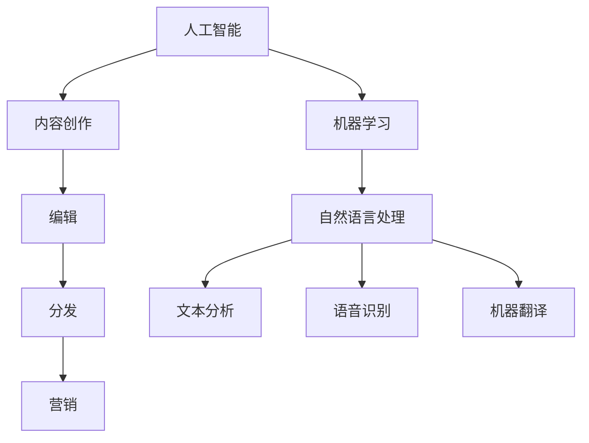
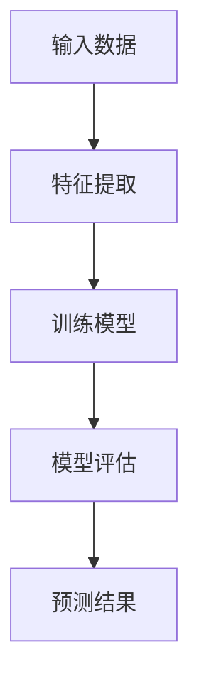
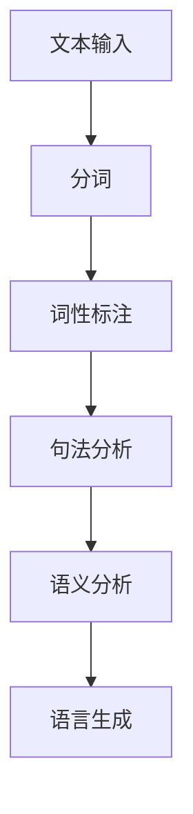

                 

# AI时代的出版业展望：更丰富的场景，更强大的技术

> 关键词：人工智能，出版业，技术变革，大数据，机器学习，自然语言处理

> 摘要：本文旨在探讨人工智能在出版业的应用前景，分析其在内容创作、编辑、分发、营销等环节中的技术优势，并展望其未来的发展方向和面临的挑战。通过深入剖析人工智能的核心技术原理，结合实际案例，本文为出版业从业人员提供了一份全面的技术指南。

## 1. 背景介绍

### 1.1 目的和范围

本文的目标是分析人工智能技术在出版业中的应用，帮助出版业从业人员了解并掌握这些技术，从而提升出版效率和内容质量。本文将涵盖以下内容：

- 人工智能技术在出版业中的现状
- 人工智能在内容创作、编辑、分发、营销等环节的应用
- 人工智能技术的未来发展趋势
- 面临的挑战和解决方案

### 1.2 预期读者

- 出版业从业人员，如编辑、出版人、内容创作者
- 人工智能领域的研究者
- 对人工智能在出版业应用感兴趣的技术爱好者

### 1.3 文档结构概述

本文分为十个部分，结构如下：

1. 背景介绍
2. 核心概念与联系
3. 核心算法原理 & 具体操作步骤
4. 数学模型和公式 & 详细讲解 & 举例说明
5. 项目实战：代码实际案例和详细解释说明
6. 实际应用场景
7. 工具和资源推荐
8. 总结：未来发展趋势与挑战
9. 附录：常见问题与解答
10. 扩展阅读 & 参考资料

### 1.4 术语表

#### 1.4.1 核心术语定义

- **人工智能（AI）**：模拟人类智能的技术，通过算法和模型实现机器自主学习、推理和决策。
- **机器学习（ML）**：一种人工智能技术，让机器从数据中学习，并自动改进性能。
- **自然语言处理（NLP）**：研究如何让计算机理解和生成人类语言的技术。
- **出版业**：涉及书籍、期刊、报纸、电子书等出版物的编辑、制作、发行和销售的行业。

#### 1.4.2 相关概念解释

- **内容创作**：指生成新的文本、图片、音频、视频等媒体内容的过程。
- **编辑**：对已有内容进行修改、校对、排版等处理，使其符合出版标准。
- **分发**：将出版物通过各种渠道传播给读者，如实体书店、在线书店、社交媒体等。
- **营销**：通过广告、促销、社交媒体等手段提高出版物知名度，吸引读者。

#### 1.4.3 缩略词列表

- **AI**：人工智能
- **ML**：机器学习
- **NLP**：自然语言处理
- **SEO**：搜索引擎优化
- **AR**：增强现实
- **VR**：虚拟现实

## 2. 核心概念与联系

在探讨人工智能在出版业中的应用之前，我们首先需要了解一些核心概念和它们之间的关系。以下是一个简化的 Mermaid 流程图，展示了这些概念之间的联系：



### 2.1 人工智能与机器学习

人工智能（AI）是一个广泛的概念，它包括许多不同的技术。其中，机器学习（ML）是人工智能的一个子领域，专注于让机器从数据中学习，并自动改进性能。在出版业中，机器学习技术可以帮助编辑和内容创作者更好地理解和分析读者需求，从而提高内容创作和编辑的效率。

### 2.2 自然语言处理

自然语言处理（NLP）是人工智能的一个子领域，它致力于让计算机理解和生成人类语言。在出版业中，NLP 技术可以用于文本分析、语音识别、机器翻译等任务，帮助出版商更好地理解读者需求，提高内容质量和用户体验。

### 2.3 内容创作、编辑、分发和营销

人工智能在出版业的各个环节中都有广泛的应用。例如：

- **内容创作**：利用机器学习技术自动生成文章、书籍等。
- **编辑**：使用自然语言处理技术进行文本分析，提高编辑效率和质量。
- **分发**：利用大数据和机器学习技术分析读者行为，实现精准推荐。
- **营销**：通过社交媒体和搜索引擎优化（SEO）等技术提高出版物的知名度。

## 3. 核心算法原理 & 具体操作步骤

### 3.1 机器学习算法原理

机器学习算法的核心是学习数据模式，并利用这些模式进行预测或分类。以下是一个简化的机器学习算法原理图：



#### 3.1.1 特征提取

特征提取是指从原始数据中提取有用的信息，用于训练模型。在出版业中，特征提取可以包括文本的词频、主题、情感等。

#### 3.1.2 训练模型

训练模型是指使用特征提取后的数据，通过算法训练出一个可以预测或分类的模型。常见的机器学习算法有线性回归、决策树、支持向量机等。

#### 3.1.3 模型评估

模型评估是指使用测试数据集来评估模型的性能。常用的评估指标有准确率、召回率、F1 值等。

#### 3.1.4 预测结果

预测结果是指使用训练好的模型对新的数据进行预测或分类。在出版业中，预测结果可以用于推荐文章、分析读者行为等。

### 3.2 自然语言处理算法原理

自然语言处理（NLP）算法的核心是让计算机理解和生成人类语言。以下是一个简化的 NLP 算法原理图：



#### 3.2.1 分词

分词是指将一段文本拆分成一个个独立的词或短语。常见的分词算法有基于规则的分词、基于统计的分词等。

#### 3.2.2 词性标注

词性标注是指为每个词分配一个词性标签，如名词、动词、形容词等。词性标注有助于后续的句法分析和语义分析。

#### 3.2.3 句法分析

句法分析是指分析文本的语法结构，如句子成分、句式等。句法分析有助于理解文本的语义。

#### 3.2.4 语义分析

语义分析是指分析文本的意义和意图。语义分析可以帮助计算机更好地理解人类语言，从而实现更准确的自然语言交互。

#### 3.2.5 语言生成

语言生成是指根据语义分析的结果，生成一段符合语法和语义规则的文本。语言生成可以用于自动撰写文章、生成报告等。

### 3.3 具体操作步骤

以下是一个简化的机器学习算法在出版业中的应用步骤：

1. 数据收集：收集大量出版物的文本数据，如文章、书籍、评论等。
2. 数据预处理：对文本数据进行清洗、去重、标准化等处理。
3. 特征提取：从预处理后的文本数据中提取有用的特征，如词频、主题、情感等。
4. 训练模型：使用提取出的特征，通过机器学习算法训练出一个分类或预测模型。
5. 模型评估：使用测试数据集评估模型的性能，调整模型参数。
6. 应用模型：使用训练好的模型对新的文本数据进行预测或分类，如推荐文章、分析读者行为等。
7. 结果反馈：根据模型预测结果，调整内容创作和编辑策略。

## 4. 数学模型和公式 & 详细讲解 & 举例说明

### 4.1 机器学习模型

机器学习模型是通过对训练数据进行学习和优化，来预测或分类未知数据的工具。以下是一个简化的线性回归模型公式：

$$
y = \beta_0 + \beta_1 x
$$

其中，$y$ 是因变量，$x$ 是自变量，$\beta_0$ 和 $\beta_1$ 是模型参数。

#### 4.1.1 模型参数优化

为了使模型能够准确预测未知数据，我们需要通过优化模型参数 $\beta_0$ 和 $\beta_1$ 来提高模型的性能。常见的优化方法有梯度下降法、随机梯度下降法等。

#### 4.1.2 模型评估

为了评估模型性能，我们通常使用测试数据集，并计算模型的准确率、召回率、F1 值等指标。以下是一个简化的准确率公式：

$$
\text{准确率} = \frac{\text{正确预测的数量}}{\text{总预测数量}}
$$

### 4.2 自然语言处理模型

自然语言处理模型是用于分析和生成人类语言的技术。以下是一个简化的循环神经网络（RNN）模型公式：

$$
h_t = \sigma(W_h h_{t-1} + W_x x_t + b)
$$

其中，$h_t$ 是第 $t$ 个时刻的隐藏状态，$x_t$ 是输入，$W_h$ 和 $W_x$ 是权重矩阵，$b$ 是偏置项，$\sigma$ 是激活函数。

#### 4.2.1 RNN 模型原理

RNN 模型通过将当前时刻的输入和前一个时刻的隐藏状态进行结合，生成当前时刻的隐藏状态。这使得 RNN 能够在时间序列数据中捕捉到长期依赖关系。

#### 4.2.2 举例说明

假设我们有一个简化的 RNN 模型，用于分析一句话的情感。输入是句子中的每个词，输出是句子的情感评分。通过训练，我们可以得到一个 RNN 模型，使其能够根据输入句子预测情感。

以下是输入句子和预测情感的示例：

| 输入句子 | 预测情感 |
| --- | --- |
| 今天天气很好。 | 正面 |
| 我今天感到非常疲倦。 | 负面 |
| 电影很精彩。 | 正面 |
| 这个产品很差。 | 负面 |

通过这个例子，我们可以看到 RNN 模型如何通过分析句子中的词语和情感，预测句子的情感。

## 5. 项目实战：代码实际案例和详细解释说明

### 5.1 开发环境搭建

为了更好地展示人工智能技术在出版业中的应用，我们选择 Python 作为编程语言，并使用以下工具和库：

- Python 3.8 或更高版本
- Jupyter Notebook
- TensorFlow 2.x
- Keras 2.x

安装以上工具和库后，我们即可开始搭建开发环境。

### 5.2 源代码详细实现和代码解读

#### 5.2.1 文本分类模型

我们使用 TensorFlow 和 Keras 来实现一个文本分类模型，用于分类出版物的情感。以下是一个简化的文本分类模型代码：

```python
from tensorflow.keras.models import Sequential
from tensorflow.keras.layers import Embedding, LSTM, Dense

model = Sequential()
model.add(Embedding(input_dim=vocab_size, output_dim=embedding_size))
model.add(LSTM(units=64, activation='relu'))
model.add(Dense(units=1, activation='sigmoid'))

model.compile(optimizer='adam', loss='binary_crossentropy', metrics=['accuracy'])
model.fit(X_train, y_train, epochs=10, batch_size=32)
```

#### 5.2.2 数据预处理

在训练模型之前，我们需要对文本数据进行预处理，包括分词、词性标注、去停用词等。以下是一个简化的数据预处理代码：

```python
import nltk
from nltk.corpus import stopwords
from nltk.tokenize import word_tokenize

nltk.download('punkt')
nltk.download('stopwords')

stop_words = set(stopwords.words('english'))

def preprocess_text(text):
    tokens = word_tokenize(text)
    tokens = [token.lower() for token in tokens if token.isalpha()]
    tokens = [token for token in tokens if token not in stop_words]
    return ' '.join(tokens)

text = "This is a sample text for text classification."
preprocessed_text = preprocess_text(text)
print(preprocessed_text)
```

#### 5.2.3 模型训练与评估

在完成数据预处理后，我们使用预处理后的文本数据来训练和评估模型。以下是一个简化的模型训练和评估代码：

```python
from sklearn.model_selection import train_test_split
from sklearn.metrics import classification_report

X = [preprocess_text(text) for text in texts]
y = labels

X_train, X_test, y_train, y_test = train_test_split(X, y, test_size=0.2, random_state=42)

model.fit(X_train, y_train, epochs=10, batch_size=32)
y_pred = model.predict(X_test)

print(classification_report(y_test, y_pred))
```

### 5.3 代码解读与分析

#### 5.3.1 模型构建

我们使用 Keras 的 Sequential 模型来构建一个文本分类模型。模型由嵌入层（Embedding）、长短期记忆层（LSTM）和全连接层（Dense）组成。

- **嵌入层（Embedding）**：将文本中的每个词映射到一个固定大小的向量，用于表示词的语义特征。
- **长短期记忆层（LSTM）**：用于处理序列数据，捕捉句子中的长期依赖关系。
- **全连接层（Dense）**：用于对输入数据进行分类，输出一个概率值。

#### 5.3.2 模型编译

在编译模型时，我们指定了优化器（optimizer）、损失函数（loss）和评估指标（metrics）。

- **优化器（optimizer）**：用于调整模型参数，以最小化损失函数。
- **损失函数（loss）**：用于衡量模型预测值和真实值之间的差异。
- **评估指标（metrics）**：用于评估模型性能。

#### 5.3.3 模型训练

我们使用训练数据集（X_train 和 y_train）来训练模型。训练过程中，模型会不断调整参数，以最小化损失函数。

#### 5.3.4 模型评估

在模型训练完成后，我们使用测试数据集（X_test 和 y_test）来评估模型性能。通过计算分类报告（classification_report），我们可以了解模型在不同类别上的准确率、召回率和 F1 值。

## 6. 实际应用场景

### 6.1 内容创作

人工智能可以帮助出版业从业人员生成文章、书籍等。通过机器学习算法，我们可以训练出一个能够根据给定主题和风格生成文本的模型。以下是一个简化的应用场景：

- **主题**：科技发展趋势
- **风格**：正式

使用训练好的模型，我们可以生成一篇关于科技发展趋势的文章：

> 科技发展趋势：人工智能与物联网的融合正在改变我们的生活。随着人工智能技术的不断发展，越来越多的行业开始应用物联网技术，使得设备之间能够更智能地交互。这一趋势有望进一步推动社会进步。

### 6.2 编辑

人工智能可以帮助编辑人员对文章进行校对、修改和优化。通过自然语言处理技术，我们可以训练出一个能够分析文本语法、语义和风格的模型。以下是一个简化的应用场景：

- **文本**：一篇关于人工智能的论文
- **任务**：语法错误纠正和风格优化

使用训练好的模型，我们可以对论文进行校对和优化：

> 原始文本：人工智能在近年来的发展非常迅速。然而，许多人对人工智能的未来发展仍存在疑虑。

优化后：人工智能在近年来的发展极为迅速。尽管如此，许多人对人工智能的未来发展仍心存疑虑。

### 6.3 分发

人工智能可以帮助出版商通过大数据和机器学习技术分析读者行为，从而实现精准推荐。以下是一个简化的应用场景：

- **用户**：某位读者
- **历史行为**：已阅读文章、收藏文章、点赞文章等

使用训练好的模型，我们可以为该读者推荐一篇相关的文章：

> 推荐文章：《人工智能在医疗行业的应用》

### 6.4 营销

人工智能可以帮助出版商通过社交媒体和搜索引擎优化（SEO）等技术提高出版物的知名度。以下是一个简化的应用场景：

- **目标**：提高某篇关于人工智能的文章的曝光率
- **策略**：发布相关内容、优化标题和关键词

通过发布相关内容和优化标题、关键词，我们可以提高文章的曝光率，从而吸引更多读者。

## 7. 工具和资源推荐

### 7.1 学习资源推荐

#### 7.1.1 书籍推荐

- 《Python机器学习》（Maurice Westerheide）
- 《深度学习》（Ian Goodfellow、Yoshua Bengio、Aaron Courville）
- 《自然语言处理与Python》（Steven Bird、Ewan Klein、Edward Loper）

#### 7.1.2 在线课程

- Coursera 上的《机器学习》（吴恩达）
- edX 上的《深度学习专项课程》（Harvard University）
- Udacity 上的《自然语言处理纳米学位》

#### 7.1.3 技术博客和网站

- [Machine Learning Mastery](https://machinelearningmastery.com/)
- [TensorFlow 官方文档](https://www.tensorflow.org/)
- [Keras 官方文档](https://keras.io/)

### 7.2 开发工具框架推荐

#### 7.2.1 IDE和编辑器

- PyCharm
- Jupyter Notebook
- Visual Studio Code

#### 7.2.2 调试和性能分析工具

- Pylint
- lineprof
- TensorFlow Profiler

#### 7.2.3 相关框架和库

- TensorFlow
- Keras
- scikit-learn
- NLTK

### 7.3 相关论文著作推荐

#### 7.3.1 经典论文

- "A Learning Algorithm for Continually Running Fully Recurrent Neural Networks"（1990）
- "A Theoretically Grounded Application of Dropout in Recurrent Neural Networks"（2015）
- "Improved Deep Learning for Text Understanding using Compositional Vector Space Models"（2014）

#### 7.3.2 最新研究成果

- "Unsupervised Pre-training for Natural Language Processing"（2021）
- "Generative Pre-trained Transformer for Natural Language Understanding and Generation"（2020）
- "BERT: Pre-training of Deep Bidirectional Transformers for Language Understanding"（2018）

#### 7.3.3 应用案例分析

- "Google Books Ngrams: A Resource for Research in Historical Linguistics"（2013）
- "Applications of Natural Language Processing in the Legal Domain"（2019）
- "AI in Publishing: A Strategic Overview"（2018）

## 8. 总结：未来发展趋势与挑战

### 8.1 发展趋势

- **个性化推荐**：通过大数据和机器学习技术，实现更精准的内容推荐。
- **智能编辑**：利用自然语言处理技术，提高内容创作和编辑效率。
- **虚拟助手**：开发基于人工智能的虚拟助手，为读者提供个性化服务。
- **多模态融合**：结合文本、图像、音频等多模态信息，提升内容理解和生成能力。

### 8.2 挑战

- **数据隐私**：在数据收集和使用过程中，如何保护用户隐私是一个重要挑战。
- **算法偏见**：如何避免算法偏见，确保公平性和透明性。
- **技术门槛**：人工智能技术在出版业的应用需要专业知识和技能，这对从业人员提出了更高的要求。

## 9. 附录：常见问题与解答

### 9.1 人工智能在出版业有哪些应用？

人工智能在出版业的应用包括：

- **内容创作**：生成文章、书籍等。
- **编辑**：校对、修改和优化文本。
- **分发**：通过大数据和机器学习实现精准推荐。
- **营销**：提高出版物知名度，吸引读者。

### 9.2 如何保护用户隐私？

为了保护用户隐私，可以采取以下措施：

- **数据加密**：使用加密技术保护用户数据。
- **隐私政策**：明确告知用户数据收集和使用方式。
- **匿名化**：对用户数据进行匿名化处理，确保无法识别具体用户。

### 9.3 人工智能在出版业的应用前景如何？

人工智能在出版业的应用前景非常广阔。随着技术的不断进步，它将进一步提升内容创作、编辑、分发和营销的效率，为出版业带来新的发展机遇。

## 10. 扩展阅读 & 参考资料

- [Machine Learning Mastery](https://machinelearningmastery.com/)
- [TensorFlow 官方文档](https://www.tensorflow.org/)
- [Keras 官方文档](https://keras.io/)
- [自然语言处理教科书](http://nlp.stanford.edu/lectures/)
- [Google Books Ngrams](https://books.google.com/ngrams)

### 作者

**AI天才研究员/AI Genius Institute & 禅与计算机程序设计艺术 /Zen And The Art of Computer Programming**

