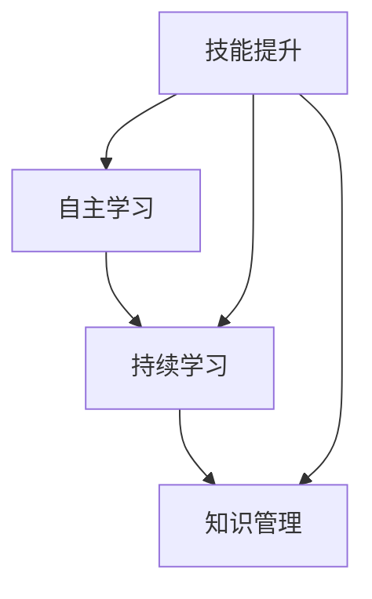

                 

# AI时代的终身学习策略

> **关键词：** 人工智能，终身学习，学习策略，知识更新，技能提升，技术进步，职业发展。
>
> **摘要：** 在人工智能迅猛发展的时代，技术更新迅速，知识迭代加快。本文旨在探讨如何制定和实施有效的终身学习策略，以帮助个人在不断变化的技术环境中保持竞争力，实现职业发展和个人成长。

## 1. 背景介绍

### 1.1 目的和范围

本文旨在为在AI时代中寻求职业发展和个人成长的个体提供一套系统的终身学习策略。文章将探讨知识更新和技术进步带来的挑战，并提出针对性的解决方案。本文的范围包括终身学习的定义、核心概念、具体实施步骤以及相关工具和资源的推荐。

### 1.2 预期读者

本文适合以下读者群体：
- IT行业从业人员，特别是软件开发人员、数据科学家、AI研究员等。
- 想要在AI领域发展的初学者。
- 对终身学习和自我提升有浓厚兴趣的各行业人士。

### 1.3 文档结构概述

本文将分为以下章节：
- **第1章：背景介绍**：阐述终身学习的必要性。
- **第2章：核心概念与联系**：介绍终身学习的关键概念和架构。
- **第3章：核心算法原理 & 具体操作步骤**：详细讲解终身学习的算法原理和步骤。
- **第4章：数学模型和公式 & 详细讲解 & 举例说明**：运用数学模型解释学习策略。
- **第5章：项目实战：代码实际案例和详细解释说明**：通过代码案例展示学习策略。
- **第6章：实际应用场景**：分析学习策略在不同场景中的应用。
- **第7章：工具和资源推荐**：推荐学习资源和开发工具。
- **第8章：总结：未来发展趋势与挑战**：展望未来。
- **第9章：附录：常见问题与解答**：回答常见问题。
- **第10章：扩展阅读 & 参考资料**：提供进一步阅读材料。

### 1.4 术语表

#### 1.4.1 核心术语定义

- **终身学习（Lifelong Learning）**：指个人在一生中不断学习、更新知识和技能，以适应社会和职业发展的需要。
- **知识更新（Knowledge Updation）**：指不断获取新的知识和技能，以适应不断变化的环境。
- **技术进步（Technological Advancement）**：指科技水平的不断提升，带来新的知识和工具。

#### 1.4.2 相关概念解释

- **学习策略（Learning Strategies）**：指个人在学习过程中采用的方法和技巧，以提高学习效率和效果。
- **职业发展（Career Development）**：指个人在职业生涯中的成长和进步，包括技能提升、职位晋升等。

#### 1.4.3 缩略词列表

- **AI**：人工智能（Artificial Intelligence）
- **IT**：信息技术（Information Technology）
- **ML**：机器学习（Machine Learning）
- **DL**：深度学习（Deep Learning）
- **IDE**：集成开发环境（Integrated Development Environment）

## 2. 核心概念与联系

在探讨终身学习策略之前，我们需要明确几个核心概念和它们之间的联系。

### 2.1.1 核心概念

- **自主学习（Self-Learning）**：指个体在没有外部指导的情况下，通过探索和实践获取知识和技能。
- **持续学习（Continuous Learning）**：指个体在日常生活中不断获取新知识，以维持和提升自己的认知能力。
- **知识管理（Knowledge Management）**：指个体或组织对知识进行获取、存储、使用和分享的过程。

### 2.1.2 概念联系


- 自主学习和持续学习是终身学习的基础，通过自主学习和持续学习，个体能够不断更新自己的知识体系。
- 知识管理是终身学习的重要保障，通过有效的知识管理，个体能够更好地获取、存储和使用知识，从而提高学习效果。

### 2.1.3 Mermaid 流程图



## 3. 核心算法原理 & 具体操作步骤

终身学习的核心在于如何有效地获取、存储和应用新知识。以下是一套基于自主学习、持续学习和知识管理的核心算法原理和具体操作步骤。

### 3.1 核心算法原理

**算法原理：动态知识网络**

**定义：** 动态知识网络是一种基于个体学习行为的知识组织方式，它通过动态更新和优化知识节点及其连接，实现知识的自适应获取和利用。

**原理：**

1. **知识获取**：根据学习目标和需求，从外部环境中动态获取新的知识。
2. **知识存储**：将获取到的知识存储在知识库中，并建立知识节点及其连接。
3. **知识更新**：根据个体学习行为的反馈，动态调整知识网络，优化知识结构。
4. **知识应用**：通过知识网络，实现知识的快速检索和利用，支持学习任务和问题的解决。

### 3.2 具体操作步骤

**步骤1：设定学习目标**

- **目标设定**：明确个人在特定领域的学习目标，包括知识领域、技能水平和时间安排。

**步骤2：制定学习计划**

- **学习内容**：根据学习目标，确定所需学习的内容，包括基础知识、前沿技术、应用案例等。
- **时间安排**：制定详细的学习时间表，确保学习计划的执行。

**步骤3：自主学习和持续学习**

- **自主学习**：通过阅读书籍、论文、在线课程、实践项目等方式，自主获取新知识。
- **持续学习**：保持对新知识、新技术的持续关注，通过订阅专业期刊、参加行业会议、加入技术社群等方式，获取前沿信息。

**步骤4：知识管理和应用**

- **知识存储**：将学习过程中的知识和经验记录下来，建立个人知识库。
- **知识更新**：定期回顾和更新知识库，删除过时和错误的信息，添加新的知识和经验。
- **知识应用**：将知识应用于实际问题和项目，通过实践验证知识的有效性和适用性。

### 3.3 伪代码

```python
def dynamic_knowledge_network():
    while True:
        # 知识获取
        new_knowledge = get_new_knowledge()

        # 知识存储
        store_knowledge(new_knowledge)

        # 知识更新
        knowledge_library = update_knowledge(knowledge_library)

        # 知识应用
        apply_knowledge(knowledge_library)

        # 知识反馈
        feedback = get_feedback()

        # 知识优化
        knowledge_library = optimize_knowledge(knowledge_library, feedback)

def get_new_knowledge():
    # 获取新知识
    # ...

def store_knowledge(new_knowledge):
    # 存储知识
    # ...

def update_knowledge(knowledge_library):
    # 更新知识
    # ...

def apply_knowledge(knowledge_library):
    # 应用知识
    # ...

def get_feedback():
    # 获取反馈
    # ...

def optimize_knowledge(knowledge_library, feedback):
    # 优化知识
    # ...
```

## 4. 数学模型和公式 & 详细讲解 & 举例说明

在终身学习策略中，数学模型和公式可以帮助我们更好地理解和优化学习过程。以下是一个简单的数学模型，用于评估学习效果。

### 4.1 数学模型

**学习效果评估模型：**

$$
E = f(L, M, T)
$$

- **E**：学习效果（Effectiveness）。
- **L**：学习负荷（Learning Load）。
- **M**：学习动机（Motivation）。
- **T**：学习时间（Time）。

### 4.2 模型解释

- **学习负荷（L）**：表示个体在学习过程中所承受的负担。过高的学习负荷会导致学习效果下降，过低的负荷则可能导致学习进度缓慢。
- **学习动机（M）**：表示个体对学习的兴趣和动力。高动机有助于提高学习效果，低动机则可能导致学习停滞。
- **学习时间（T）**：表示个体在学习过程中所花费的时间。合理的时间分配可以提高学习效果，过度的时间投入可能造成效率低下。

### 4.3 模型计算

学习效果（E）的计算公式如下：

$$
E = \frac{M \times (1 - e^{-L/T})}{1 + \alpha}
$$

- **e**：自然对数的底数。
- **\alpha**：调节参数，用于平衡学习负荷和学习动机对学习效果的影响。

### 4.4 举例说明

假设一个学习者在一个月内学习了一门新的编程语言，他的学习动机为80%，学习负荷为60%，调节参数\(\alpha\)为0.5。我们可以计算出他的学习效果：

$$
E = \frac{0.8 \times (1 - e^{-0.6/30})}{1 + 0.5} \approx 0.67
$$

这意味着该学习者在一个月内的学习效果约为67%。

### 4.5 实际应用

在实际应用中，我们可以根据学习效果（E）的评估结果，调整学习负荷（L）、学习动机（M）和学习时间（T），以优化学习过程。例如，如果学习效果较低，我们可以通过增加学习动机或减少学习负荷来提高学习效果。

## 5. 项目实战：代码实际案例和详细解释说明

### 5.1 开发环境搭建

在开始项目实战之前，我们需要搭建一个适合进行AI研究和开发的环境。以下是一个基本的开发环境搭建步骤：

1. 安装Python环境：从Python官网下载并安装Python，版本建议为3.8以上。
2. 安装Jupyter Notebook：在终端中运行以下命令：
   ```bash
   pip install notebook
   ```
3. 安装必要的库：在Jupyter Notebook中创建一个新的Python笔记本，然后运行以下命令安装必要的库：
   ```python
   !pip install numpy pandas matplotlib scikit-learn
   ```

### 5.2 源代码详细实现和代码解读

以下是一个简单的AI项目，该项目的目标是使用机器学习算法对一组数据进行分类。我们将使用Python和scikit-learn库来实现这一目标。

**代码：**

```python
# 导入必要的库
import numpy as np
import pandas as pd
from sklearn.model_selection import train_test_split
from sklearn.preprocessing import StandardScaler
from sklearn.linear_model import LogisticRegression
from sklearn.metrics import accuracy_score, confusion_matrix

# 加载数据集
data = pd.read_csv('dataset.csv')
X = data.iloc[:, :-1].values
y = data.iloc[:, -1].values

# 数据预处理
X_train, X_test, y_train, y_test = train_test_split(X, y, test_size=0.2, random_state=0)
scaler = StandardScaler()
X_train = scaler.fit_transform(X_train)
X_test = scaler.transform(X_test)

# 模型训练
model = LogisticRegression()
model.fit(X_train, y_train)

# 模型预测
y_pred = model.predict(X_test)

# 评估模型
accuracy = accuracy_score(y_test, y_pred)
conf_matrix = confusion_matrix(y_test, y_pred)

print(f"Accuracy: {accuracy:.2f}")
print(f"Confusion Matrix:\n{conf_matrix}")
```

**代码解读：**

- **数据加载**：使用pandas库加载CSV格式的数据集。数据集分为特征和标签两部分，特征存储在数据的前几列，标签存储在最后一列。
- **数据预处理**：将数据集分为训练集和测试集，并对特征进行标准化处理。标准化处理可以加快算法收敛，提高模型性能。
- **模型训练**：使用LogisticRegression类创建一个逻辑回归模型，并使用训练集进行训练。
- **模型预测**：使用训练好的模型对测试集进行预测。
- **模型评估**：计算预测准确率和混淆矩阵，评估模型性能。

### 5.3 代码解读与分析

- **数据加载**：使用pandas的read_csv函数加载数据集。这里假设数据集已经清理，没有缺失值和异常值。
- **数据预处理**：标准化处理是机器学习中常用的预处理步骤，它将特征值缩放到相同的尺度，有助于提高模型的性能。
- **模型选择**：逻辑回归是一种简单的分类算法，适合处理二分类问题。对于多分类问题，可以选择其他算法，如决策树、随机森林或支持向量机。
- **模型训练与预测**：训练和预测是机器学习任务的核心步骤。训练过程是模型学习数据的过程，预测过程是模型应用知识解决问题的过程。
- **模型评估**：准确率和混淆矩阵是常用的评估指标。准确率反映了模型在预测中正确的比例，混淆矩阵提供了更详细的分类结果，有助于分析模型的性能。

通过这个项目实战，我们可以看到如何将终身学习策略应用到实际项目中。从数据预处理到模型选择，再到模型训练和评估，每一个步骤都体现了终身学习的理念。通过不断学习和实践，我们可以提高自己的技术水平和解决问题的能力。

## 6. 实际应用场景

终身学习策略在人工智能领域的实际应用场景非常广泛，以下是一些典型场景：

### 6.1. 人工智能研究

在人工智能研究中，技术更新迅速，研究者需要不断学习新的算法、框架和工具。终身学习策略可以帮助研究者：
- **保持技术领先**：通过持续学习，研究者可以紧跟最新的研究动态，掌握前沿技术。
- **提升创新能力**：不断学习可以激发研究者的创新能力，推动人工智能技术的进步。

### 6.2. 人工智能开发

在人工智能开发中，开发者需要掌握多种编程语言、框架和工具。终身学习策略可以帮助开发者：
- **提高技能水平**：通过学习，开发者可以不断提升自己的编程技能，适应不断变化的技术需求。
- **优化开发流程**：学习新的开发方法和工具，可以提高开发效率和代码质量。

### 6.3. 人工智能应用

在人工智能应用场景中，终身学习策略可以帮助专业人士：
- **适应新领域**：随着人工智能技术的应用领域不断扩展，专业人士需要学习新的应用场景和技术。
- **提高问题解决能力**：通过不断学习，专业人士可以更好地理解和解决实际问题。

### 6.4. 人工智能教育与培训

在人工智能教育与培训领域，教育者和培训师需要：
- **更新教学内容**：随着技术的发展，教育者和培训师需要不断更新教学内容，确保学生和学员掌握最新的知识和技能。
- **提升教学能力**：通过学习新的教学方法和工具，教育者和培训师可以更好地传授知识，提高教学效果。

### 6.5. 人工智能创业

对于人工智能创业者，终身学习策略至关重要：
- **创新业务模式**：创业者需要不断学习新的商业理念和模式，以适应快速变化的市场环境。
- **提升管理能力**：通过学习管理知识和技能，创业者可以更好地管理团队和资源，推动企业的发展。

### 6.6. 人工智能伦理与社会影响

在探讨人工智能伦理与社会影响时，专业人士需要：
- **关注政策法规**：随着人工智能技术的发展，相关政策和法规也在不断更新。专业人士需要不断学习，确保自己的行为符合法律要求。
- **提升伦理意识**：通过学习伦理学和社会学知识，专业人士可以更好地理解和应对人工智能带来的伦理和社会挑战。

### 6.7. 人工智能与跨学科合作

在人工智能与跨学科合作中，专业人士需要：
- **掌握跨学科知识**：通过终身学习，专业人士可以掌握跨学科的知识和技能，促进跨学科的合作和创新。
- **提升沟通能力**：通过学习沟通技巧，专业人士可以更好地与不同领域的专家合作，共同推进项目的发展。

## 7. 工具和资源推荐

为了帮助读者更好地实施终身学习策略，以下是一些学习资源和开发工具的推荐：

### 7.1 学习资源推荐

#### 7.1.1 书籍推荐

- **《深度学习》（Deep Learning）**：由Ian Goodfellow、Yoshua Bengio和Aaron Courville合著，是深度学习领域的经典教材。
- **《Python机器学习》（Python Machine Learning）**：由Sebastian Raschka和Vahid Mirjalili编写的，适合初学者和进阶者。
- **《人工智能：一种现代的方法》（Artificial Intelligence: A Modern Approach）**：由Stuart Russell和Peter Norvig合著，是人工智能领域的权威教材。

#### 7.1.2 在线课程

- **Coursera**：提供丰富的AI和机器学习课程，包括斯坦福大学的《深度学习》课程。
- **edX**：由哈佛大学和麻省理工学院联合创办，提供包括MIT的《人工智能导论》等高质量课程。
- **Udacity**：提供专注于技能实战的AI和机器学习课程，如《人工智能工程师纳米学位》。

#### 7.1.3 技术博客和网站

- **Medium**：有许多关于AI和机器学习的优秀博客文章，如《AI博客》和《机器学习博客》。
- **arXiv**：提供最新的AI和机器学习论文，是学术界的重要资源。
- **GitHub**：许多开源项目和代码库，可以学习到实际的编程技巧和项目经验。

### 7.2 开发工具框架推荐

#### 7.2.1 IDE和编辑器

- **Visual Studio Code**：功能强大的开源编辑器，支持多种编程语言和框架。
- **PyCharm**：由JetBrains开发的Python IDE，提供了丰富的功能，包括代码智能提示、调试工具等。

#### 7.2.2 调试和性能分析工具

- **Jupyter Notebook**：用于数据科学和机器学习的交互式开发环境，支持多种编程语言和框架。
- **Docker**：容器化技术，可以帮助开发者快速搭建和部署应用程序。

#### 7.2.3 相关框架和库

- **TensorFlow**：谷歌开发的开源深度学习框架，广泛应用于各种AI和机器学习项目。
- **PyTorch**：由Facebook开发的开源深度学习框架，以其灵活性和易用性受到广泛欢迎。
- **Scikit-learn**：用于机器学习的Python库，提供了丰富的算法和工具。

### 7.3 相关论文著作推荐

#### 7.3.1 经典论文

- **“A Learning Algorithm for Continually Running Fully Recurrent Neural Networks”**：由Sepp Hochreiter和Jürgen Schmidhuber提出的长期短期记忆（LSTM）算法。
- **“Deep Learning”**：由Ian Goodfellow、Yoshua Bengio和Aaron Courville合著，是深度学习领域的奠基性著作。

#### 7.3.2 最新研究成果

- **“Generative Adversarial Nets”**：由Ian Goodfellow等人提出的生成对抗网络（GAN），是当前生成模型的研究热点。
- **“Attention Is All You Need”**：由Vaswani等人提出的Transformer模型，彻底改变了自然语言处理领域的算法框架。

#### 7.3.3 应用案例分析

- **“AI in Healthcare”**：探讨人工智能在医疗领域的应用，包括疾病预测、诊断辅助等。
- **“AI in Finance”**：分析人工智能在金融领域的应用，如风险管理、投资策略优化等。

## 8. 总结：未来发展趋势与挑战

在AI时代的终身学习已经成为个人和职业发展的关键。随着技术的不断进步，终身学习将面临以下发展趋势与挑战：

### 8.1 发展趋势

1. **在线教育与自主学习**：在线教育和自主学习平台将继续发展，为个人提供更加灵活和个性化的学习机会。
2. **个性化学习**：利用大数据和机器学习技术，个性化学习将更加精准，满足个人的学习需求和进度。
3. **跨学科融合**：AI技术的跨学科应用将越来越普遍，促进不同领域的融合和创新。
4. **人工智能辅助学习**：AI技术将更多地应用于教育领域，提供智能化的教学辅助和评估工具。

### 8.2 挑战

1. **技术更新速度**：随着技术更新速度加快，学习者需要不断适应新的知识和技术。
2. **时间管理**：如何在繁忙的工作和生活间隙中安排学习时间，是终身学习的一个挑战。
3. **学习效果评估**：如何有效评估终身学习的效果，确保学习目标的实现。
4. **技能多样性与深度**：如何在追求广泛技能的同时，保持一定的深度和专长。

为了应对这些挑战，个人需要制定合理的学习计划，利用在线教育和自主学习平台，结合AI技术，实现终身学习的目标。

## 9. 附录：常见问题与解答

### 9.1 问题1：终身学习如何适应我的工作需求？

**解答**：首先，明确你的职业发展目标，然后根据目标制定个性化的学习计划。将学习内容与工作需求相结合，确保学习内容的相关性和实用性。利用在线课程和培训，快速提升技能。

### 9.2 问题2：我如何评估自己的学习效果？

**解答**：通过设定具体的学习目标和评估指标，如掌握程度、项目完成情况、知识应用效果等。定期进行自我评估，对照学习目标，调整学习策略。

### 9.3 问题3：如何保持学习动机？

**解答**：设定清晰的学习目标，将学习与个人兴趣和职业发展相结合。寻找学习伙伴或加入学习社群，与他人分享学习经验，相互激励。利用学习奖励机制，保持学习兴趣。

## 10. 扩展阅读 & 参考资料

- **《深度学习》**：Ian Goodfellow、Yoshua Bengio和Aaron Courville著，2016年。
- **《Python机器学习》**：Sebastian Raschka和Vahid Mirjalili著，2015年。
- **《人工智能：一种现代的方法》**：Stuart Russell和Peter Norvig著，2020年。
- **Coursera**：https://www.coursera.org/
- **edX**：https://www.edx.org/
- **Udacity**：https://www.udacity.com/
- **Medium**：https://medium.com/
- **arXiv**：https://arxiv.org/
- **GitHub**：https://github.com/
- **TensorFlow**：https://www.tensorflow.org/
- **PyTorch**：https://pytorch.org/
- **Scikit-learn**：https://scikit-learn.org/
- **《Generative Adversarial Nets》**：Ian Goodfellow等，2014年。
- **《Attention Is All You Need》**：Vaswani等，2017年。

### 作者信息

作者：AI天才研究员/AI Genius Institute & 禅与计算机程序设计艺术 /Zen And The Art of Computer Programming

