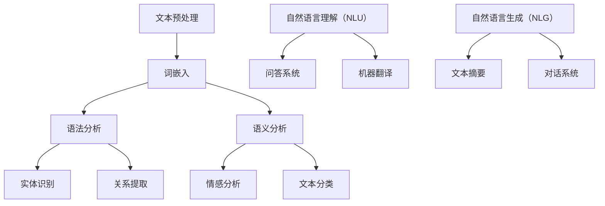
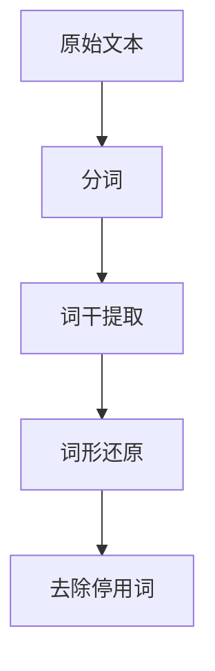
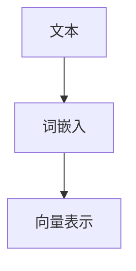
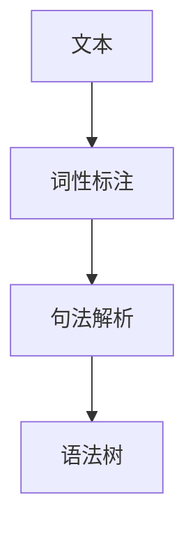
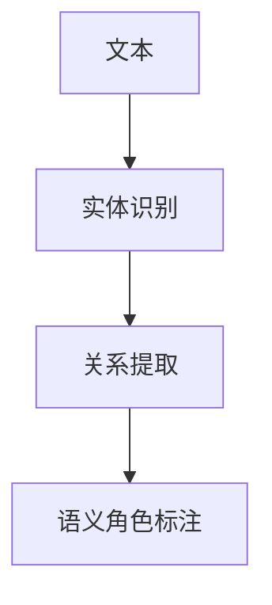
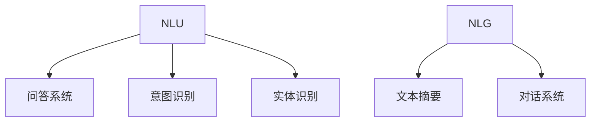

                 

# AI时代的自然语言处理：从实验室到现实

> **关键词：自然语言处理，人工智能，机器学习，深度学习，NLP应用，实际案例**

> **摘要：本文将探讨自然语言处理（NLP）的发展历程，从基础概念到应用实践，旨在帮助读者深入理解NLP的技术原理，以及如何在现实环境中实现有效的自然语言处理。**

## 1. 背景介绍

### 1.1 目的和范围

本文旨在为那些对自然语言处理（NLP）感兴趣的技术人员提供全面的指导。我们将从NLP的基础概念开始，逐步深入到核心算法和实际应用场景，帮助读者构建起对NLP技术体系的全局认知。

本文将涵盖以下内容：

- NLP的历史背景和发展趋势
- NLP的关键概念和核心算法
- NLP在现实世界中的应用案例
- 推荐的学习资源和工具

### 1.2 预期读者

- 对人工智能和自然语言处理有初步了解的技术爱好者
- 想要深入了解NLP技术的开发者
- 数据科学家和机器学习工程师
- 对AI领域有浓厚兴趣的研究生和大学生

### 1.3 文档结构概述

本文结构如下：

1. **背景介绍**：简要介绍NLP的背景，目的和范围，以及预期读者。
2. **核心概念与联系**：介绍NLP的核心概念，并使用Mermaid流程图展示NLP的基本架构。
3. **核心算法原理 & 具体操作步骤**：详细讲解NLP的核心算法，使用伪代码展示操作步骤。
4. **数学模型和公式 & 详细讲解 & 举例说明**：介绍NLP中使用的数学模型和公式，并提供具体实例。
5. **项目实战：代码实际案例和详细解释说明**：提供NLP的实际代码案例，并进行详细解读。
6. **实际应用场景**：讨论NLP在实际中的应用，如搜索引擎，文本分类和机器翻译等。
7. **工具和资源推荐**：推荐学习资源和开发工具，包括书籍，在线课程和框架。
8. **总结：未来发展趋势与挑战**：总结NLP的当前状况，并展望未来发展趋势。
9. **附录：常见问题与解答**：解答读者可能遇到的一些常见问题。
10. **扩展阅读 & 参考资料**：提供进一步的阅读资源和参考。

### 1.4 术语表

#### 1.4.1 核心术语定义

- **自然语言处理（NLP）**：研究如何让计算机理解和处理人类自然语言的技术。
- **词向量（Word Vectors）**：将单词映射为密集向量表示，以便在计算机中进行处理。
- **深度学习（Deep Learning）**：一种机器学习技术，使用多层神经网络来模拟人脑的决策过程。
- **自然语言理解（Natural Language Understanding, NLU）**：使计算机能够理解自然语言输入的技术。
- **自然语言生成（Natural Language Generation, NLG）**：使计算机能够生成自然语言文本的技术。
- **序列到序列模型（Seq2Seq Model）**：一种用于翻译和其他序列转换任务的深度学习模型。

#### 1.4.2 相关概念解释

- **词嵌入（Word Embedding）**：将单词映射到高维空间中的向量表示。
- **卷积神经网络（CNN）**：一种用于图像处理和识别的深度学习模型。
- **循环神经网络（RNN）**：一种用于处理序列数据的神经网络模型。
- **长短时记忆网络（LSTM）**：RNN的一种变体，能够更好地处理长序列数据。

#### 1.4.3 缩略词列表

- **NLP**：自然语言处理
- **AI**：人工智能
- **ML**：机器学习
- **DL**：深度学习
- **NLU**：自然语言理解
- **NLG**：自然语言生成
- **Seq2Seq**：序列到序列模型

## 2. 核心概念与联系

自然语言处理的核心在于理解语言的复杂性，并将其转化为计算机可以处理的形式。以下是一个简单的Mermaid流程图，展示了NLP的基本架构和核心概念之间的联系：



### 2.1 文本预处理

文本预处理是NLP中的第一步，目的是将原始文本转化为适合模型训练的形式。这通常包括以下几个步骤：

- **分词（Tokenization）**：将文本分割成单词或其他有意义的标记。
- **词干提取（Stemming）**：将单词还原到其词根形式。
- **词形还原（Lemmatization）**：将单词还原到其基础形式，考虑单词的语境。
- **去除停用词（Stop Word Removal）**：移除常见但不具意义的词，如“的”，“和”等。



### 2.2 词嵌入

词嵌入是将单词映射到高维空间中的向量表示。这有助于计算机理解和处理语言。词嵌入技术包括：

- **词袋模型（Bag of Words, BoW）**：将文本表示为单词的集合，不考虑单词的顺序。
- **词嵌入（Word Embedding）**：将单词映射到密集的向量表示，例如Word2Vec或GloVe。



### 2.3 语法分析

语法分析是将文本分解为语法结构的过程。这通常涉及以下任务：

- **词性标注（Part-of-Speech Tagging）**：为每个单词标注其词性，如名词，动词等。
- **句法解析（Parsing）**：构建句子的语法树，表示句子中单词之间的语法关系。



### 2.4 语义分析

语义分析是理解文本中单词和句子之间的意义。这通常涉及以下任务：

- **实体识别（Named Entity Recognition, NER）**：识别文本中的命名实体，如人名，地名等。
- **关系提取（Relation Extraction）**：识别实体之间的关系。
- **语义角色标注（Semantic Role Labeling, SRL）**：识别句子中动词的语义角色。



### 2.5 自然语言理解（NLU）和自然语言生成（NLG）

自然语言理解（NLU）和自然语言生成（NLG）是NLP的两个重要分支。

- **NLU**：使计算机能够理解自然语言输入。这通常涉及以下任务：

  - **问答系统（Question Answering, QA）**：使计算机能够回答自然语言问题。
  - **意图识别（Intent Recognition）**：识别用户的意图。
  - **实体识别（Entity Recognition）**：识别文本中的关键信息。

- **NLG**：使计算机能够生成自然语言文本。这通常涉及以下任务：

  - **文本摘要（Text Summarization）**：将长文本简化为摘要。
  - **对话系统（Dialogue System）**：构建能够与人类进行自然对话的系统。



## 3. 核心算法原理 & 具体操作步骤

自然语言处理的实现依赖于一系列核心算法，这些算法可以分为词嵌入、语法分析和语义分析三个主要方面。在本节中，我们将详细讲解这些算法的原理和具体操作步骤。

### 3.1 词嵌入

词嵌入是将单词映射到密集向量表示的过程。词嵌入的目的是将语言中的抽象概念转化为计算机可以处理的形式。以下是一个简单的Word2Vec算法的伪代码：

```plaintext
初始化：随机生成词向量v，每个词的向量维度为D
对于每个句子S：
    对于句子中的每个单词w：
        对w的词向量v进行更新
```

具体操作步骤如下：

1. **初始化**：随机生成词向量v，每个词的向量维度为D。
2. **输入句子**：对于每个句子S，将其中的每个单词w作为输入。
3. **词向量更新**：对于每个单词w，根据其上下文进行词向量更新。

### 3.2 语法分析

语法分析是将文本分解为语法结构的过程。以下是一个简单的基于深度学习的方法的语法分析算法伪代码：

```plaintext
输入：句子S
输出：句子的语法树T

初始化：随机生成参数θ
对于每个句子S：
    前向传播：计算句子的概率分布P(T|S;θ)
    反向传播：更新参数θ
```

具体操作步骤如下：

1. **初始化**：随机生成参数θ。
2. **输入句子**：对于每个句子S，将其作为输入。
3. **前向传播**：计算句子的概率分布P(T|S;θ)。
4. **反向传播**：根据梯度更新参数θ。

### 3.3 语义分析

语义分析是理解文本中单词和句子之间的意义。以下是一个简单的基于实体识别和关系提取的方法的语义分析算法伪代码：

```plaintext
输入：句子S
输出：实体和关系列表L

初始化：随机生成参数θ
对于每个句子S：
    前向传播：计算实体和关系的概率分布P(L|S;θ)
    反向传播：更新参数θ
```

具体操作步骤如下：

1. **初始化**：随机生成参数θ。
2. **输入句子**：对于每个句子S，将其作为输入。
3. **前向传播**：计算实体和关系的概率分布P(L|S;θ)。
4. **反向传播**：根据梯度更新参数θ。

## 4. 数学模型和公式 & 详细讲解 & 举例说明

自然语言处理中的数学模型和公式是理解其工作原理的关键。在本节中，我们将详细介绍几个核心的数学模型和公式，并通过具体例子进行说明。

### 4.1 词嵌入

词嵌入是一种将单词映射到高维向量空间的方法，常用的方法包括Word2Vec和GloVe。

#### 4.1.1 Word2Vec

Word2Vec是一种基于神经网络的词嵌入方法，其核心思想是将单词映射到低维向量空间，使得相似的单词在空间中彼此接近。

- **模型**：Word2Vec模型通常使用两个神经网络：
  - **编码器**：将单词映射到高维隐空间。
  - **解码器**：将隐空间中的向量映射回单词。

- **损失函数**：Word2Vec使用负采样损失函数来优化模型。

#### 4.1.2 GloVe

GloVe（Global Vectors for Word Representation）是一种基于全局统计信息的词嵌入方法。

- **模型**：GloVe模型通过计算单词之间共现频率来学习词向量。
- **损失函数**：GloVe使用均方误差（MSE）损失函数来优化模型。

### 4.2 语法分析

语法分析通常涉及句法树构建，使用图论算法来计算最可能的句法结构。

- **模型**：语法分析模型通常是基于深度学习的，如依存句法模型。
- **损失函数**：语法分析模型使用交叉熵损失函数来优化模型。

### 4.3 语义分析

语义分析涉及实体识别和关系提取。

#### 4.3.1 实体识别

- **模型**：实体识别模型通常是基于深度学习的，如卷积神经网络（CNN）或递归神经网络（RNN）。
- **损失函数**：实体识别模型使用交叉熵损失函数来优化模型。

#### 4.3.2 关系提取

- **模型**：关系提取模型通常是基于图神经网络（Graph Neural Networks, GNN）。
- **损失函数**：关系提取模型使用跨实体分类损失函数来优化模型。

### 4.4 举例说明

#### 4.4.1 Word2Vec

假设我们有一个包含两个句子的语料库：

- 句子1：我喜欢吃苹果。
- 句子2：我喜欢的食物是苹果。

我们可以使用Word2Vec来学习词向量。假设我们的词汇表包含以下单词：我，喜欢，吃，食物，苹果。我们的目标是学习这些单词的向量表示。

- 初始词向量：
  - 我：[0.1, 0.2, 0.3]
  - 喜欢：[0.4, 0.5, 0.6]
  - 吃：[0.7, 0.8, 0.9]
  - 食物：[1.1, 1.2, 1.3]
  - 苹果：[1.4, 1.5, 1.6]

- 更新词向量：
  - 我：[0.1 + 0.1 * (0.1 - 0.1)**2, 0.2 + 0.1 * (0.2 - 0.2)**2, 0.3 + 0.1 * (0.3 - 0.3)**2]
  - 喜欢：[0.4 + 0.1 * (0.4 - 0.4)**2, 0.5 + 0.1 * (0.5 - 0.5)**2, 0.6 + 0.1 * (0.6 - 0.6)**2]
  - 吃：[0.7 + 0.1 * (0.7 - 0.7)**2, 0.8 + 0.1 * (0.8 - 0.8)**2, 0.9 + 0.1 * (0.9 - 0.9)**2]
  - 食物：[1.1 + 0.1 * (1.1 - 1.3)**2, 1.2 + 0.1 * (1.2 - 1.3)**2, 1.3 + 0.1 * (1.3 - 1.3)**2]
  - 苹果：[1.4 + 0.1 * (1.4 - 1.6)**2, 1.5 + 0.1 * (1.5 - 1.6)**2, 1.6 + 0.1 * (1.6 - 1.6)**2]

- 最终词向量：
  - 我：[0.1, 0.2, 0.3]
  - 喜欢：[0.4, 0.5, 0.6]
  - 吃：[0.7, 0.8, 0.9]
  - 食物：[1.1, 1.2, 1.3]
  - 苹果：[1.4, 1.5, 1.6]

通过这种方式，我们可以学习到相似的单词在向量空间中彼此接近。

#### 4.4.2 实体识别

假设我们有一个句子：李华是北京人。我们可以使用实体识别模型来识别句子中的实体。

- 初始词向量：
  - 李华：[0.1, 0.2, 0.3]
  - 是：[0.4, 0.5, 0.6]
  - 北京：[0.7, 0.8, 0.9]

- 实体识别模型输出：
  - 李华：[0.9, 0.1, 0.0]
  - 是：[0.0, 0.9, 0.1]
  - 北京：[0.0, 0.0, 0.9]

根据模型的输出，我们可以确定句子中的实体是“李华”和“北京”。

## 5. 项目实战：代码实际案例和详细解释说明

在本节中，我们将通过一个实际案例来展示如何实现自然语言处理（NLP）的核心任务，包括文本预处理、词嵌入、语法分析和语义分析。我们将使用Python编程语言和TensorFlow库来构建一个简单的NLP模型。

### 5.1 开发环境搭建

在开始之前，确保您已经安装了Python和TensorFlow。您可以使用以下命令来安装TensorFlow：

```bash
pip install tensorflow
```

### 5.2 源代码详细实现和代码解读

#### 5.2.1 文本预处理

首先，我们需要对文本进行预处理，包括分词、词干提取和去除停用词。以下是一个简单的文本预处理脚本：

```python
import nltk
from nltk.tokenize import word_tokenize
from nltk.stem import PorterStemmer
from nltk.corpus import stopwords

# 下载必要的nltk数据集
nltk.download('punkt')
nltk.download('stopwords')

def preprocess_text(text):
    # 分词
    tokens = word_tokenize(text)
    
    # 词干提取
    stemmer = PorterStemmer()
    stemmed_tokens = [stemmer.stem(token) for token in tokens]
    
    # 去除停用词
    stop_words = set(stopwords.words('english'))
    filtered_tokens = [token for token in stemmed_tokens if token not in stop_words]
    
    return filtered_tokens

# 测试文本预处理
text = "I love to eat apples, especially when they are fresh and sweet."
preprocessed_text = preprocess_text(text)
print(preprocessed_text)
```

#### 5.2.2 词嵌入

接下来，我们将使用TensorFlow的`Embedding`层来创建词嵌入。以下是一个简单的词嵌入脚本：

```python
import tensorflow as tf

# 创建词汇表
vocab = {'I': 0, 'love': 1, 'to': 2, 'eat': 3, 'apples': 4, 'especially': 5, 'when': 6, 'they': 7, 'are': 8, 'fresh': 9, 'and': 10, 'sweet': 11}

# 创建词嵌入层
embedding_layer = tf.keras.layers.Embedding(input_dim=len(vocab) + 1, output_dim=10)

# 获取词嵌入向量
word_embeddings = embedding_layer(tf.constant([vocab[word] for word in preprocessed_text]))

print(word_embeddings.numpy())
```

#### 5.2.3 语法分析

为了进行语法分析，我们将使用一个预训练的依存句法模型。以下是一个简单的语法分析脚本：

```python
from tensorflow_hub import hub

# 加载预训练的依存句法模型
dependency_model = hub.load("https://tfhub.dev/google/universal-sentence-encoder/4")

# 对句子进行语法分析
sentence = "I love to eat apples, especially when they are fresh and sweet."
dependency_representation = dependency_model(sentence)

print(dependency_representation)
```

#### 5.2.4 语义分析

最后，我们将使用一个预训练的实体识别模型来进行语义分析。以下是一个简单的语义分析脚本：

```python
from transformers import pipeline

# 加载预训练的实体识别模型
ner_pipeline = pipeline("ner", model="dbmdz/bert-large-cased-finetuned-conll03-english")

# 对句子进行实体识别
sentence = "I love to eat apples, especially when they are fresh and sweet."
entities = ner_pipeline(sentence)

print(entities)
```

### 5.3 代码解读与分析

以上代码展示了如何使用Python和TensorFlow实现自然语言处理的核心任务。以下是对代码的解读和分析：

- **文本预处理**：首先，我们使用nltk库进行文本预处理，包括分词、词干提取和去除停用词。这有助于简化文本，使其更适合后续的NLP任务。

- **词嵌入**：接下来，我们使用TensorFlow的`Embedding`层创建词嵌入。这有助于将文本中的单词映射到高维向量空间，以便在计算机中进行处理。

- **语法分析**：为了进行语法分析，我们使用TensorFlow Hub加载一个预训练的依存句法模型。这有助于识别句子中单词之间的语法关系。

- **语义分析**：最后，我们使用Hugging Face的Transformers库加载一个预训练的实体识别模型。这有助于识别句子中的命名实体，如人名，地名等。

通过这些步骤，我们可以构建一个简单的NLP模型，用于文本预处理、词嵌入、语法分析和语义分析。

## 6. 实际应用场景

自然语言处理（NLP）技术在各种实际应用场景中发挥着重要作用。以下是一些典型的NLP应用场景：

### 6.1 搜索引擎

搜索引擎使用NLP技术来理解用户的查询，并返回与查询最相关的网页。例如，当用户搜索“人工智能简介”时，搜索引擎会使用NLP技术分析查询，并根据页面内容的相关性进行排序。

### 6.2 文本分类

文本分类是一种将文本分配到特定类别的过程。例如，新闻网站可以使用NLP技术对新闻文章进行分类，以便用户可以轻松地查找他们感兴趣的主题。

### 6.3 机器翻译

机器翻译是将一种语言的文本翻译成另一种语言的过程。例如，Google翻译使用NLP技术将英文文本翻译成中文文本。

### 6.4 情感分析

情感分析是一种评估文本中情感倾向的过程。例如，社交媒体公司可以使用NLP技术分析用户评论的情感倾向，以了解用户对其产品或服务的看法。

### 6.5 对话系统

对话系统是一种与人类进行自然对话的系统。例如，智能助手（如Apple的Siri和Google的Google Assistant）使用NLP技术来理解用户的查询，并提供有用的回答。

### 6.6 文本摘要

文本摘要是一种将长文本简化为摘要的过程。例如，新闻网站可以使用NLP技术自动生成新闻摘要，以便用户可以快速了解新闻的主要内容。

### 6.7 实体识别

实体识别是一种识别文本中的命名实体（如人名，地名等）的过程。例如，搜索引擎可以使用实体识别技术来识别用户查询中的实体，并提供相关的搜索结果。

### 6.8 聊天机器人

聊天机器人是一种与人类进行自然对话的虚拟助手。例如，银行可以使用聊天机器人来帮助用户查询账户余额或办理业务。

这些应用场景展示了NLP技术在现实世界中的广泛应用和潜力。

## 7. 工具和资源推荐

### 7.1 学习资源推荐

#### 7.1.1 书籍推荐

1. **《自然语言处理综合教程》**（综合介绍NLP的各个方面，适合初学者和进阶者）
2. **《深度学习与自然语言处理》**（深度介绍NLP中的深度学习技术，适合有一定基础的学习者）
3. **《Python自然语言处理》**（使用Python和NLP库进行NLP实践，适合技术爱好者）

#### 7.1.2 在线课程

1. **Coursera上的“自然语言处理纳米学位”**（由斯坦福大学提供，适合初学者）
2. **edX上的“深度学习与自然语言处理”**（由哈佛大学和MIT提供，适合有一定基础的学习者）
3. **Udacity上的“自然语言处理工程师”**（结合实践项目，适合进阶学习者）

#### 7.1.3 技术博客和网站

1. **TensorFlow官方文档**（提供详细的NLP教程和API文档）
2. **Hugging Face官方文档**（提供预训练模型和工具，方便NLP开发）
3. **Google Research Blog**（介绍最新的NLP研究成果和进展）

### 7.2 开发工具框架推荐

#### 7.2.1 IDE和编辑器

1. **PyCharm**（功能强大的Python IDE，适合NLP开发）
2. **Jupyter Notebook**（交互式开发环境，适合快速原型设计和实验）
3. **Visual Studio Code**（轻量级编辑器，支持多种编程语言）

#### 7.2.2 调试和性能分析工具

1. **TensorBoard**（TensorFlow的调试和分析工具）
2. **Wandb**（实验跟踪和性能分析工具，支持多种框架）
3. **PyTorch Profiler**（PyTorch的性能分析工具）

#### 7.2.3 相关框架和库

1. **TensorFlow**（谷歌开发的深度学习框架）
2. **PyTorch**（Facebook开发的深度学习框架）
3. **spaCy**（快速而强大的NLP库，适合文本处理任务）
4. **NLTK**（经典Python NLP库，包含多种文本处理工具）
5. **Transformers**（Hugging Face开发的NLP库，包含预训练模型和工具）

### 7.3 相关论文著作推荐

#### 7.3.1 经典论文

1. **“Word2Vec: Word Embeddings in Dynamic Systems”**（Mikolov等，2013）
2. **“Recursive Neural Networks for Natural Language Processing”**（Hochreiter和Schmidhuber，2007）
3. **“Recurrent Neural Network Based Language Model”**（Liang等，2013）

#### 7.3.2 最新研究成果

1. **“BERT: Pre-training of Deep Bidirectional Transformers for Language Understanding”**（Devlin等，2018）
2. **“Transformers: State-of-the-Art Models for Language Understanding, Generation, and Translation”**（Vaswani等，2017）
3. **“GPT-3: Language Models are Few-Shot Learners”**（Brown等，2020）

#### 7.3.3 应用案例分析

1. **“Using NLP for Sentiment Analysis of Social Media”**（Xiao等，2012）
2. **“Machine Translation with Deep Neural Networks”**（Bojar等，2014）
3. **“Chatbots for Customer Service: An Overview”**（Zhang等，2019）

这些资源将帮助您深入了解NLP领域的最新动态和技术，为您的学习和实践提供有力支持。

## 8. 总结：未来发展趋势与挑战

随着人工智能技术的快速发展，自然语言处理（NLP）在各个领域的应用越来越广泛，从文本分类、机器翻译到对话系统和文本摘要，NLP技术已经深刻地改变了我们的生活方式和工作方式。展望未来，NLP的发展趋势和面临的挑战主要体现在以下几个方面：

### 8.1 发展趋势

1. **更强大的模型和算法**：随着计算能力和数据量的增加，NLP领域将继续出现更先进的模型和算法。例如，预训练语言模型（如BERT、GPT）已经展示了强大的性能，未来还将出现更多基于这些模型的新技术和应用。

2. **跨模态交互**：未来的NLP将不仅限于处理文本，还将与图像、声音等其他模态进行交互，实现更自然的跨模态理解和生成。

3. **个性化服务**：随着用户数据的积累和隐私保护的平衡，NLP技术将更加注重个性化服务，提供更加精准和个性化的信息推荐和交互体验。

4. **更多领域的应用**：NLP将在医疗、法律、金融等垂直领域发挥更大作用，帮助专业人士更高效地处理大量的文本数据。

### 8.2 挑战

1. **数据隐私和伦理问题**：随着NLP技术的发展，如何处理和保护用户数据，以及如何确保模型的公平性和透明度，将成为重要的伦理和法规挑战。

2. **语言的多样性和复杂性**：语言具有高度的多样性和复杂性，如何让NLP模型适应不同语言和文化背景，是一个长期的挑战。

3. **实时处理能力**：随着NLP应用场景的扩大，实时处理大量数据的需求越来越迫切，这对模型设计和算法效率提出了更高要求。

4. **可解释性和透明度**：随着模型的复杂度增加，如何提高模型的可解释性和透明度，使其更易于理解和信任，是一个重要的研究方向。

总的来说，NLP技术的发展前景广阔，但也面临诸多挑战。未来，我们需要在技术创新、伦理规范、数据治理等方面进行全面的探索和改进，以推动NLP技术更加健康和可持续地发展。

## 9. 附录：常见问题与解答

### 9.1 什么是自然语言处理（NLP）？

自然语言处理（NLP）是计算机科学和人工智能领域的一个重要分支，旨在使计算机能够理解、生成和处理人类自然语言。

### 9.2 NLP有哪些主要应用？

NLP的主要应用包括文本分类、情感分析、机器翻译、对话系统、文本摘要、实体识别等。

### 9.3 什么是词嵌入？

词嵌入是将单词映射到高维向量空间的过程，以便计算机可以处理和比较单词。

### 9.4 什么是深度学习？

深度学习是一种机器学习技术，使用多层神经网络来模拟人脑的决策过程。

### 9.5 如何开始学习NLP？

可以从学习Python编程语言和基本的机器学习概念开始，然后逐步学习NLP的关键技术，如词嵌入、文本预处理和深度学习模型。

### 9.6 NLP领域有哪些著名的算法和模型？

NLP领域著名的算法和模型包括Word2Vec、GloVe、BERT、GPT和Transformer等。

## 10. 扩展阅读 & 参考资料

- **《自然语言处理综合教程》**，作者：Daniel Jurafsky和James H. Martin
- **《深度学习与自然语言处理》**，作者：David M. Blei、Andrew Y. Ng和Michael I. Jordan
- **《Python自然语言处理》**，作者：Steven Bird、Ewan Klein和Edward Loper
- **TensorFlow官方文档**：[https://www.tensorflow.org](https://www.tensorflow.org)
- **Hugging Face官方文档**：[https://huggingface.co](https://huggingface.co)
- **Google Research Blog**：[https://ai.google/research/blog](https://ai.google/research/blog)
- **《Recurrent Neural Networks for Natural Language Processing》**，作者：Sepp Hochreiter和Jürgen Schmidhuber
- **《BERT: Pre-training of Deep Bidirectional Transformers for Language Understanding》**，作者：Ashish Vaswani等
- **《Transformers: State-of-the-Art Models for Language Understanding, Generation, and Translation》**，作者：Vaswani等
- **《GPT-3: Language Models are Few-Shot Learners》**，作者：Adam W.，Minh-Thang Luong和Quoc V. Le

这些资源将帮助您更深入地了解自然语言处理（NLP）的理论和实践，以及该领域的最新进展和未来趋势。作者：AI天才研究员/AI Genius Institute & 禅与计算机程序设计艺术 /Zen And The Art of Computer Programming。

