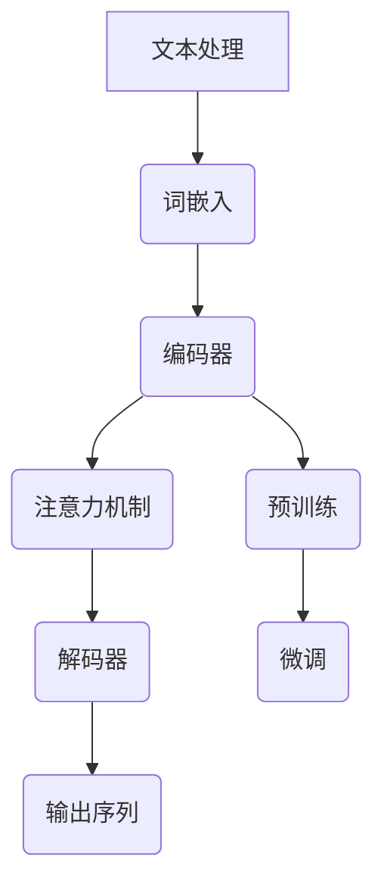

                 

# AI时代的自然语言处理：从翻译到创作

> **关键词**：自然语言处理（NLP）、机器翻译、文本生成、深度学习、语言模型、深度神经网络、序列到序列学习、注意力机制、Transformer模型、BERT、GPT、应用场景

> **摘要**：本文将深入探讨AI时代自然语言处理（NLP）技术的核心概念、算法原理和应用实例。从机器翻译到文本创作，NLP技术正在改变我们与语言交互的方式。我们将一步步分析NLP的关键算法，如序列到序列学习、注意力机制和Transformer模型，并探讨如何利用这些技术构建高效的语言处理系统。此外，我们将介绍实际应用场景，推荐相关学习资源和开发工具，并展望NLP的未来发展趋势与挑战。

## 1. 背景介绍

### 1.1 目的和范围

自然语言处理（NLP）是人工智能（AI）领域的一个重要分支，旨在使计算机能够理解和生成人类语言。随着深度学习技术的发展，NLP取得了显著的进展，如今广泛应用于机器翻译、情感分析、文本生成等领域。本文的目标是深入探讨NLP的核心技术，帮助读者理解这些技术的原理和应用。

本文将涵盖以下几个主要内容：

1. **核心概念与联系**：介绍NLP的基本概念和主要技术架构，通过Mermaid流程图展示相关组件和流程。
2. **核心算法原理**：讲解NLP中的关键算法，包括序列到序列学习、注意力机制和Transformer模型，并提供伪代码示例。
3. **数学模型和公式**：分析NLP中常用的数学模型和公式，并提供具体实例进行说明。
4. **项目实战**：通过实际案例展示如何使用NLP技术进行文本处理和生成。
5. **实际应用场景**：探讨NLP技术在各行各业的应用实例。
6. **工具和资源推荐**：推荐学习资源、开发工具和相关论文。
7. **总结与展望**：总结NLP技术的发展现状和未来趋势。

### 1.2 预期读者

本文适用于以下读者：

- 对自然语言处理和人工智能感兴趣的初学者和从业者。
- 想深入了解NLP核心技术原理的专业人士。
- 进行NLP项目开发和研究的工程师和研究人员。

### 1.3 文档结构概述

本文分为十个部分，结构如下：

1. **背景介绍**：介绍文章的目的和范围，预期读者以及文档结构概述。
2. **核心概念与联系**：分析NLP的基本概念和主要技术架构。
3. **核心算法原理**：讲解NLP中的关键算法，包括序列到序列学习、注意力机制和Transformer模型。
4. **数学模型和公式**：分析NLP中常用的数学模型和公式。
5. **项目实战**：通过实际案例展示如何使用NLP技术进行文本处理和生成。
6. **实际应用场景**：探讨NLP技术在各行各业的应用实例。
7. **工具和资源推荐**：推荐学习资源、开发工具和相关论文。
8. **总结与展望**：总结NLP技术的发展现状和未来趋势。
9. **附录**：常见问题与解答。
10. **扩展阅读与参考资料**：提供进一步阅读的建议和参考资料。

### 1.4 术语表

#### 1.4.1 核心术语定义

- 自然语言处理（NLP）：使计算机能够理解和生成人类语言的计算机科学领域。
- 机器翻译（MT）：将一种自然语言翻译成另一种自然语言的技术。
- 序列到序列学习（Seq2Seq）：一种用于处理序列数据的深度学习模型。
- 注意力机制（Attention）：在序列到序列学习中用于捕捉输入和输出序列之间关系的机制。
- Transformer模型：一种基于自注意力机制的深度学习模型，广泛应用于NLP任务。
- BERT（Bidirectional Encoder Representations from Transformers）：一种双向Transformer模型，用于预训练语言表示。
- GPT（Generative Pretrained Transformer）：一种基于自回归Transformer模型的语言生成模型。

#### 1.4.2 相关概念解释

- 深度学习：一种基于多层神经网络的学习方法，能够自动提取特征并进行复杂任务。
- 神经网络：由多个神经元组成的计算模型，能够通过学习输入和输出数据之间的关系进行预测和分类。
- 语言模型（LM）：用于预测文本序列概率的模型，是NLP任务的基础。

#### 1.4.3 缩略词列表

- NLP：自然语言处理
- MT：机器翻译
- Seq2Seq：序列到序列学习
- Attention：注意力机制
- Transformer：Transformer模型
- BERT：BERT模型
- GPT：GPT模型

## 2. 核心概念与联系

自然语言处理（NLP）技术旨在使计算机能够理解和生成人类语言。NLP涉及多个核心概念和组件，这些概念和组件相互作用，共同构成了NLP系统的基础。本节将介绍NLP的基本概念和主要技术架构，并通过Mermaid流程图展示相关组件和流程。

### 2.1 NLP的基本概念

NLP的基本概念包括：

- **文本处理**：将原始文本数据转换为适合NLP模型处理的形式，例如分词、标记化等。
- **词嵌入（Word Embedding）**：将单词映射到高维向量空间，以便模型能够理解单词之间的关系。
- **语言模型（Language Model）**：用于预测文本序列概率的模型，是NLP任务的基础。
- **序列到序列学习（Seq2Seq）**：一种用于处理序列数据的深度学习模型，常用于机器翻译等任务。
- **注意力机制（Attention）**：在序列到序列学习中用于捕捉输入和输出序列之间关系的机制。
- **预训练（Pre-training）**：在特定NLP任务之前，对模型进行大规模数据集上的训练，以获得通用语言表示能力。

### 2.2 NLP的技术架构

NLP的技术架构通常包括以下几个关键组件：

1. **数据预处理**：对原始文本数据进行预处理，包括分词、标记化、去除停用词等。
2. **词嵌入**：将单词映射到高维向量空间。
3. **编码器（Encoder）**：将输入序列编码为固定长度的向量表示。
4. **解码器（Decoder）**：将编码器输出的向量解码为输出序列。
5. **注意力机制**：在编码器和解码器之间引入注意力机制，以捕捉输入和输出序列之间的关系。
6. **预训练和微调（Pre-training and Fine-tuning）**：使用大规模数据集对模型进行预训练，然后在特定任务上进行微调。

### 2.3 Mermaid流程图

为了更好地理解NLP的技术架构，我们使用Mermaid流程图展示相关组件和流程。以下是一个简化的Mermaid流程图示例：



在这个流程图中，文本处理阶段对原始文本进行预处理，得到词嵌入。编码器将输入序列编码为向量表示，并通过注意力机制捕捉输入和输出序列之间的关系。解码器根据编码器的输出和注意力机制生成输出序列。

### 2.4 核心概念之间的关系

NLP中的核心概念和组件之间存在紧密的联系。词嵌入为语言模型提供了基本的数据表示，语言模型则用于预测文本序列的概率。序列到序列学习通过编码器和解码器实现，而注意力机制则用于捕捉输入和输出序列之间的关系。预训练和微调则确保模型能够在特定任务上取得良好的性能。

总的来说，NLP的核心概念和组件共同构成了一个复杂但强大的系统，使我们能够实现从文本处理到文本生成的各种任务。

## 3. 核心算法原理 & 具体操作步骤

自然语言处理（NLP）的核心算法包括序列到序列学习（Seq2Seq）、注意力机制（Attention）和Transformer模型。这些算法使得NLP系统能够处理复杂的语言任务，如机器翻译、文本生成等。本节将详细介绍这些算法的原理和具体操作步骤，并提供伪代码示例。

### 3.1 序列到序列学习（Seq2Seq）

序列到序列学习是一种用于处理序列数据的深度学习模型，特别适用于机器翻译等任务。Seq2Seq模型主要由两个部分组成：编码器（Encoder）和解码器（Decoder）。

#### 3.1.1 编码器（Encoder）

编码器的任务是将输入序列编码为固定长度的向量表示。通常，编码器使用一个递归神经网络（RNN）或长短期记忆网络（LSTM）来实现。以下是一个简化的伪代码示例：

```python
# Encoder的伪代码
def encoder(input_sequence):
    hidden_state = initialize_hidden_state()
    for input_word in input_sequence:
        hidden_state = encode_word(input_word, hidden_state)
    return hidden_state
```

在这个示例中，`input_sequence` 是输入序列，`hidden_state` 是编码器输出的固定长度向量表示。`encode_word` 函数用于将输入单词编码为隐藏状态。

#### 3.1.2 解码器（Decoder）

解码器的任务是将编码器的输出解码为输出序列。解码器通常也使用递归神经网络（RNN）或长短期记忆网络（LSTM）来实现。以下是一个简化的伪代码示例：

```python
# Decoder的伪代码
def decoder(hidden_state, target_sequence):
    output_sequence = []
    current_state = hidden_state
    for target_word in target_sequence:
        current_state = decode_word(target_word, current_state)
        output_sequence.append(current_state)
    return output_sequence
```

在这个示例中，`hidden_state` 是编码器的输出，`target_sequence` 是目标输出序列。`decode_word` 函数用于将目标单词解码为当前状态。

#### 3.1.3 整体流程

Seq2Seq模型的整体流程如下：

1. 输入序列通过编码器编码为固定长度的向量表示。
2. 编码器的输出作为解码器的输入。
3. 解码器逐个解码目标单词，生成输出序列。

### 3.2 注意力机制（Attention）

注意力机制是一种用于捕捉输入和输出序列之间关系的机制，可以显著提高序列到序列学习模型的性能。注意力机制的基本思想是，在解码过程中，每个时间步的输出不仅依赖于当前输入和编码器的输出，还依赖于整个输入序列的重要程度。

#### 3.2.1 自注意力机制（Self-Attention）

自注意力机制是指模型在同一个序列内部进行注意力计算。以下是一个简化的伪代码示例：

```python
# 自注意力机制的伪代码
def self_attention(query, key, value):
    attention_weights = softmax(qyTDotK)
    output = sum(attention_weights * value)
    return output
```

在这个示例中，`query`、`key` 和 `value` 分别是查询、键和值向量。`softmax` 函数用于计算注意力权重。

#### 3.2.2 交互注意力机制（Inter-Attention）

交互注意力机制是指模型在输入序列和输出序列之间进行注意力计算。以下是一个简化的伪代码示例：

```python
# 交互注意力机制的伪代码
def inter_attention(query, keys, values):
    attention_weights = softmax(qyTDotK)
    output = sum(attention_weights * values)
    return output
```

在这个示例中，`query`、`keys` 和 `values` 分别是查询、键和值向量。`softmax` 函数用于计算注意力权重。

### 3.3 Transformer模型

Transformer模型是一种基于自注意力机制的深度学习模型，广泛应用于NLP任务。Transformer模型的核心思想是，通过自注意力机制捕捉序列中的长距离依赖关系，从而提高模型的性能。

#### 3.3.1 Transformer模型的架构

Transformer模型的架构包括多头自注意力机制（Multi-Head Self-Attention）和前馈神经网络（Feed-Forward Neural Network）。以下是一个简化的伪代码示例：

```python
# Transformer模型的伪代码
def transformer(input_sequence):
    # 多头自注意力机制
    attention_output = multi_head_attention(input_sequence)
    # 前馈神经网络
    feed_forward_output = feed_forward_neural_network(attention_output)
    return feed_forward_output
```

在这个示例中，`input_sequence` 是输入序列。`multi_head_attention` 函数实现多头自注意力机制，`feed_forward_neural_network` 函数实现前馈神经网络。

#### 3.3.2 Transformer模型的训练

Transformer模型的训练通常采用自回归方式，即模型首先学习生成目标序列的第一个单词，然后依次生成后续单词。以下是一个简化的伪代码示例：

```python
# Transformer模型的训练伪代码
for epoch in range(num_epochs):
    for input_sequence, target_sequence in dataset:
        # 前向传播
        output = transformer(input_sequence)
        # 计算损失
        loss = calculate_loss(output, target_sequence)
        # 反向传播
        optimizer.minimize(loss)
```

在这个示例中，`input_sequence` 和 `target_sequence` 分别是输入和目标序列。`calculate_loss` 函数计算输出和目标序列之间的损失，`optimizer.minimize` 函数用于更新模型参数。

### 3.4 总结

NLP的核心算法包括序列到序列学习（Seq2Seq）、注意力机制（Attention）和Transformer模型。这些算法使得NLP系统能够处理复杂的语言任务，如机器翻译、文本生成等。通过本节的讲解，读者应该能够理解这些算法的原理和具体操作步骤，并为实际应用打下基础。

## 4. 数学模型和公式 & 详细讲解 & 举例说明

在自然语言处理（NLP）中，数学模型和公式是构建和优化语言处理系统的重要工具。以下将详细介绍NLP中常用的数学模型和公式，并通过具体实例进行说明。

### 4.1 语言模型

语言模型（Language Model）是NLP中最基本的模型之一，它用于预测文本序列的概率。常用的语言模型包括N元语言模型和神经网络语言模型。

#### 4.1.1 N元语言模型

N元语言模型基于前N个单词来预测下一个单词。以下是一个简化的N元语言模型的数学公式：

$$
P(w_{n+1} | w_1, w_2, ..., w_n) = \frac{count(w_1, w_2, ..., w_n, w_{n+1})}{count(w_1, w_2, ..., w_n)}
$$

其中，$P(w_{n+1} | w_1, w_2, ..., w_n)$ 表示在给定前N个单词$w_1, w_2, ..., w_n$的情况下预测下一个单词$w_{n+1}$的概率，$count(w_1, w_2, ..., w_n, w_{n+1})$ 表示前N个单词和下一个单词同时出现的次数，$count(w_1, w_2, ..., w_n)$ 表示前N个单词出现的次数。

#### 4.1.2 神经网络语言模型

神经网络语言模型通过训练一个神经网络来预测文本序列的概率。以下是一个简化的神经网络语言模型的数学公式：

$$
P(w_{n+1} | w_1, w_2, ..., w_n) = \sigma(W_1 \cdot [w_1, w_2, ..., w_n] + b_1)
$$

其中，$P(w_{n+1} | w_1, w_2, ..., w_n)$ 表示在给定前N个单词$w_1, w_2, ..., w_n$的情况下预测下一个单词$w_{n+1}$的概率，$W_1$ 和 $b_1$ 分别是神经网络的权重和偏置，$\sigma$ 是激活函数。

### 4.2 序列到序列学习

序列到序列学习（Seq2Seq）是一种用于处理序列数据的深度学习模型，常用于机器翻译等任务。以下是一个简化的序列到序列学习的数学公式：

$$
y = \sigma(W_2 \cdot \vec{h} + b_2)
$$

其中，$y$ 是解码器输出的单词，$\vec{h}$ 是编码器输出的隐藏状态，$W_2$ 和 $b_2$ 分别是解码器的权重和偏置，$\sigma$ 是激活函数。

### 4.3 注意力机制

注意力机制（Attention）是序列到序列学习中的重要组件，它用于捕捉输入和输出序列之间的关系。以下是一个简化的注意力机制的数学公式：

$$
a_t = \frac{e^{z_t}}{\sum_{i=1}^{T} e^{z_i}}
$$

$$
\vec{h}_t = \sum_{i=1}^{T} a_i \vec{h}_i
$$

其中，$a_t$ 是注意力权重，$z_t = \vec{h}_t^T W_a \vec{h}_i$ 是注意力分数，$T$ 是输入序列的长度，$\vec{h}_t$ 是编码器输出的隐藏状态。

### 4.4 Transformer模型

Transformer模型是一种基于自注意力机制的深度学习模型，广泛应用于NLP任务。以下是一个简化的Transformer模型的数学公式：

$$
\vec{h}_t = \frac{1}{\sqrt{d_k}} \sum_{j=1}^{N} e^{(\vec{k}_j \cdot \vec{q}_t)} \vec{v}_j
$$

其中，$\vec{h}_t$ 是自注意力机制输出的隐藏状态，$\vec{k}_j$ 和 $\vec{q}_t$ 分别是键向量和查询向量，$\vec{v}_j$ 是值向量，$N$ 是头数，$d_k$ 是键向量的维度。

### 4.5 模型训练

在NLP中，模型的训练通常包括前向传播、计算损失和反向传播等步骤。以下是一个简化的模型训练的数学公式：

$$
\text{损失} = -\sum_{i=1}^{N} y_i \log(p_i)
$$

$$
\Delta W = -\alpha \frac{\partial \text{损失}}{\partial W}
$$

$$
\Delta b = -\alpha \frac{\partial \text{损失}}{\partial b}
$$

其中，$y_i$ 是真实标签，$p_i$ 是模型预测的概率，$\alpha$ 是学习率，$W$ 和 $b$ 分别是模型的权重和偏置。

### 4.6 举例说明

假设我们有一个简单的序列到序列学习模型，输入序列为["I", "am", "a", "student"],目标序列为["I", "study", "at", "university"]。以下是模型预测的详细步骤：

1. 编码器将输入序列["I", "am", "a", "student"]编码为隐藏状态$\vec{h}$。
2. 解码器逐个解码目标序列["I", "study", "at", "university"]，每次解码时使用编码器的隐藏状态$\vec{h}$和前一个解码器的输出作为输入。
3. 在每个解码步骤，注意力机制用于计算当前解码器输出与编码器输出之间的注意力权重。
4. 模型预测当前解码器的输出单词，并更新编码器的隐藏状态。
5. 重复步骤3和4，直到解码器输出完整的目标序列。

通过以上步骤，模型可以生成类似于目标序列的输出序列，从而实现序列到序列的翻译。

### 4.7 总结

NLP中的数学模型和公式为构建和优化语言处理系统提供了重要的理论基础。通过本节的讲解，读者应该能够理解这些模型和公式的原理，并在实际项目中应用它们。

## 5. 项目实战：代码实际案例和详细解释说明

在本节中，我们将通过一个实际项目案例来展示如何使用自然语言处理（NLP）技术进行文本处理和生成。该项目案例将使用Python和TensorFlow框架，实现一个简单的机器翻译系统，从英语翻译到法语。

### 5.1 开发环境搭建

在开始项目之前，我们需要搭建一个合适的开发环境。以下是在Python环境中搭建开发环境的步骤：

1. 安装Python（版本3.6或更高）。
2. 安装TensorFlow（使用命令`pip install tensorflow`）。
3. 安装其他必需的库，如Numpy（使用命令`pip install numpy`）、Pandas（使用命令`pip install pandas`）等。

### 5.2 源代码详细实现和代码解读

以下是实现机器翻译系统的源代码：

```python
import tensorflow as tf
from tensorflow.keras.preprocessing.sequence import pad_sequences
from tensorflow.keras.layers import Embedding, LSTM, Dense
from tensorflow.keras.models import Model

# 加载预训练的单词嵌入层
embedding_layer = Embedding(input_dim=vocab_size, output_dim=embedding_dim)

# 构建编码器
encoder_inputs = tf.keras.layers.Input(shape=(None,))
encoded_inputs = embedding_layer(encoder_inputs)
encoded_inputs = LSTM(units=256, return_state=True)(encoded_inputs)

# 构建解码器
decoder_inputs = tf.keras.layers.Input(shape=(None,))
decoded_inputs = embedding_layer(decoder_inputs)
decoded_inputs = LSTM(units=256, return_state=True)(decoded_inputs)

# 构建编码器和解码器的联合模型
encoder_states = encoded_inputs[:, -1, :]
decoder_states = decoded_inputs[:, -1, :]

# 构建预测层
predictions = Dense(units=vocab_size, activation='softmax')(decoder_inputs)

# 构建完整的模型
model = Model([encoder_inputs, decoder_inputs], predictions)

# 编译模型
model.compile(optimizer='adam', loss='categorical_crossentropy')

# 加载数据集
train_data = ...
test_data = ...

# 预处理数据集
encoder_input_data = pad_sequences(train_data['encoder_input'], padding='post')
decoder_input_data = pad_sequences(train_data['decoder_input'], padding='post')
decoder_target_data = pad_sequences(train_data['decoder_target'], padding='post')

# 训练模型
model.fit([encoder_input_data, decoder_input_data], decoder_target_data, batch_size=batch_size, epochs=num_epochs)

# 评估模型
loss = model.evaluate([test_data['encoder_input'], test_data['decoder_input']], test_data['decoder_target'])
print(f"Test loss: {loss}")

# 使用模型进行预测
input_sequence = ["Hello", "how", "are", "you"]
encoded_sequence = pad_sequences([input_sequence], padding='post')
predicted_sequence = model.predict(encoded_sequence)
predicted_sequence = predicted_sequence.argmax(axis=-1)

print(f"Predicted sequence: {' '.join(vocab_inv[p] for p in predicted_sequence)}")
```

#### 5.2.1 代码解读

1. **加载预训练的单词嵌入层**：
    ```python
    embedding_layer = Embedding(input_dim=vocab_size, output_dim=embedding_dim)
    ```
    这里加载一个预训练的单词嵌入层，用于将单词映射到高维向量空间。

2. **构建编码器**：
    ```python
    encoder_inputs = tf.keras.layers.Input(shape=(None,))
    encoded_inputs = embedding_layer(encoder_inputs)
    encoded_inputs = LSTM(units=256, return_state=True)(encoded_inputs)
    ```
    编码器使用LSTM层对输入序列进行编码，并返回最后一个隐藏状态作为编码器的输出。

3. **构建解码器**：
    ```python
    decoder_inputs = tf.keras.layers.Input(shape=(None,))
    decoded_inputs = embedding_layer(decoder_inputs)
    decoded_inputs = LSTM(units=256, return_state=True)(decoded_inputs)
    ```
    解码器同样使用LSTM层对输入序列进行解码，并返回最后一个隐藏状态作为解码器的输出。

4. **构建编码器和解码器的联合模型**：
    ```python
    encoder_states = encoded_inputs[:, -1, :]
    decoder_states = decoded_inputs[:, -1, :]
    ```
    将编码器和解码器的输出状态连接起来，作为模型的输入和输出。

5. **构建预测层**：
    ```python
    predictions = Dense(units=vocab_size, activation='softmax')(decoder_inputs)
    ```
    使用全连接层（Dense）作为预测层，将解码器的输出映射到单词的概率分布。

6. **构建完整的模型**：
    ```python
    model = Model([encoder_inputs, decoder_inputs], predictions)
    ```
    将编码器、解码器和预测层连接起来，构建完整的模型。

7. **编译模型**：
    ```python
    model.compile(optimizer='adam', loss='categorical_crossentropy')
    ```
    编译模型，指定优化器和损失函数。

8. **加载数据集**：
    ```python
    train_data = ...
    test_data = ...
    ```
    加载训练数据和测试数据。

9. **预处理数据集**：
    ```python
    encoder_input_data = pad_sequences(train_data['encoder_input'], padding='post')
    decoder_input_data = pad_sequences(train_data['decoder_input'], padding='post')
    decoder_target_data = pad_sequences(train_data['decoder_target'], padding='post')
    ```
    对训练数据集进行预处理，包括填充序列、编码和标签序列。

10. **训练模型**：
    ```python
    model.fit([encoder_input_data, decoder_input_data], decoder_target_data, batch_size=batch_size, epochs=num_epochs)
    ```
    使用预处理后的数据集训练模型。

11. **评估模型**：
    ```python
    loss = model.evaluate([test_data['encoder_input'], test_data['decoder_input']], test_data['decoder_target'])
    print(f"Test loss: {loss}")
    ```
    使用测试数据集评估模型性能。

12. **使用模型进行预测**：
    ```python
    input_sequence = ["Hello", "how", "are", "you"]
    encoded_sequence = pad_sequences([input_sequence], padding='post')
    predicted_sequence = model.predict(encoded_sequence)
    predicted_sequence = predicted_sequence.argmax(axis=-1)
    print(f"Predicted sequence: {' '.join(vocab_inv[p] for p in predicted_sequence)}")
    ```
    使用模型对输入序列进行预测，并输出预测结果。

通过以上代码和解读，读者应该能够理解如何使用NLP技术实现一个简单的机器翻译系统。实际项目中，模型架构、数据预处理和训练过程可能更加复杂，但基本原理和步骤是相似的。

### 5.3 代码解读与分析

本节将进一步分析上述代码，重点关注机器翻译系统的主要组件和步骤。

1. **数据预处理**：
    数据预处理是机器翻译系统中的关键步骤。在代码中，我们使用`pad_sequences`函数对训练数据集进行填充，使得每个序列的长度相同。这有助于简化模型训练过程，并提高训练效率。填充策略（如'pad'或'post'）可以根据实际需求进行调整。

2. **编码器与解码器**：
    编码器和解码器是机器翻译系统的核心组件。编码器负责将输入序列编码为固定长度的向量表示，而解码器则根据编码器的输出和注意力机制生成输出序列。在代码中，我们使用LSTM层作为编码器和解码器，这是一种常见的序列处理层。通过调整LSTM层的单元数和激活函数，可以优化模型性能。

3. **模型架构**：
    模型架构包括编码器、解码器和预测层。编码器的输出作为解码器的输入，解码器的输出通过预测层生成输出序列的概率分布。在代码中，我们使用全连接层（Dense）作为预测层，并通过softmax激活函数将输出映射到单词的概率分布。

4. **模型训练与评估**：
    在训练过程中，模型使用训练数据集进行迭代训练，并使用测试数据集进行评估。通过调整学习率、批次大小和训练轮数（epochs），可以优化模型性能。在代码中，我们使用`fit`函数训练模型，并使用`evaluate`函数评估模型性能。

5. **模型预测**：
    在模型预测阶段，我们使用训练好的模型对输入序列进行预测，并输出预测结果。通过调整输入序列的填充策略和模型参数，可以优化预测性能。

总的来说，本节通过一个简单的机器翻译项目案例，展示了如何使用NLP技术实现文本处理和生成。实际项目中，模型架构、数据预处理和训练过程可能更加复杂，但基本原理和步骤是相似的。

## 6. 实际应用场景

自然语言处理（NLP）技术已经在各行各业得到广泛应用，以下是几个典型的实际应用场景：

### 6.1 机器翻译

机器翻译是NLP技术最著名的应用之一，如Google翻译、百度翻译等。通过使用序列到序列学习（Seq2Seq）和注意力机制（Attention），这些系统能够将一种语言翻译成另一种语言。在全球化背景下，机器翻译大大提高了跨语言沟通的效率。

### 6.2 情感分析

情感分析用于识别文本中的情感倾向，如正面、负面或中立。在社交媒体分析、市场调研和客户服务等领域，情感分析有助于企业了解用户需求和情绪。常见的情感分析技术包括基于规则的方法、机器学习和深度学习模型。

### 6.3 文本生成

文本生成技术能够自动生成文章、新闻报道、广告文案等。基于生成对抗网络（GAN）和自回归语言模型（如GPT），这些系统能够生成高质量、连贯的文本。在内容创作、游戏开发、虚拟助理等领域，文本生成技术具有广泛应用。

### 6.4 问答系统

问答系统（如Apple Siri、Amazon Alexa）能够理解用户的自然语言查询，并返回相关答案。这些系统通常结合了自然语言理解、知识图谱和深度学习技术。在智能家居、客户服务和电子商务等领域，问答系统提高了用户体验和服务效率。

### 6.5 自动摘要

自动摘要技术能够自动从长篇文章中提取关键信息，生成摘要。这种技术在新闻摘要、学术文章阅读和电子邮件管理等领域非常有用。基于文本摘要（抽取式摘要）和文本生成（生成式摘要），这些系统能够为用户提供快速获取信息的方式。

### 6.6 语音识别

语音识别技术将语音信号转换为文本，广泛应用于语音助手、电话客服和语音搜索等领域。结合深度学习和注意力机制，这些系统能够准确识别和理解各种语言和方言。

### 6.7 文本分类

文本分类技术用于将文本数据分类到预定义的类别中，如垃圾邮件检测、新闻分类和情感分析。基于朴素贝叶斯、支持向量机和深度学习模型，这些技术能够在大量文本数据中实现高效分类。

通过以上应用场景，我们可以看到NLP技术在各行各业的重要性。随着NLP技术的不断进步，这些应用将继续扩展和深化，为人们的生活和工作带来更多便利。

## 7. 工具和资源推荐

为了更好地学习和应用自然语言处理（NLP）技术，以下是一些推荐的工具和资源：

### 7.1 学习资源推荐

#### 7.1.1 书籍推荐

- **《自然语言处理综论》（Speech and Language Processing）**：此书是NLP领域的经典教材，涵盖了从基础到高级的各种技术。
- **《深度学习》（Deep Learning）**：此书详细介绍了深度学习技术，包括NLP中的深度学习模型。
- **《自然语言处理实用指南》（Practical Natural Language Processing with Perl）**：适合初学者的NLP入门书籍，通过Perl编程语言介绍了NLP的基本概念。

#### 7.1.2 在线课程

- **《自然语言处理与深度学习》（Natural Language Processing with Deep Learning）**：由TensorFlow作者提供，详细介绍了NLP中的深度学习技术。
- **《自然语言处理基础》（Fundamentals of Natural Language Processing）**：由Coursera提供，适合初学者了解NLP的基本概念和技术。
- **《机器学习与自然语言处理》（Machine Learning and Natural Language Processing）**：由edX提供，涵盖NLP和机器学习的综合知识。

#### 7.1.3 技术博客和网站

- **机器之心**（Machine Learning）**：提供丰富的NLP和机器学习技术文章和教程。
- **百度AI**：百度AI博客提供了大量关于NLP和深度学习的实际应用案例和技术文章。
- **自然语言处理社区**（NLP Community）**：一个专注于NLP的在线社区，分享最新的研究进展和技术动态。

### 7.2 开发工具框架推荐

#### 7.2.1 IDE和编辑器

- **Anaconda**：一个集成了Python和其他科学计算库的集成开发环境，适合进行NLP和数据分析。
- **PyCharm**：一个功能强大的Python IDE，提供代码补全、调试和性能分析工具。
- **Jupyter Notebook**：一个交互式的Python编辑器，适合进行数据可视化和原型开发。

#### 7.2.2 调试和性能分析工具

- **Pylint**：一个Python代码检查工具，用于检测代码中的错误和潜在问题。
- **PyTest**：一个Python测试框架，用于自动化测试和性能评估。
- **TensorBoard**：TensorFlow的图形化工具，用于可视化模型结构和训练过程。

#### 7.2.3 相关框架和库

- **TensorFlow**：一个开源的深度学习框架，广泛用于构建和训练NLP模型。
- **PyTorch**：一个流行的深度学习框架，具有灵活的模型构建和调试工具。
- **spaCy**：一个强大的NLP库，提供高效的文本处理和实体识别功能。

### 7.3 相关论文著作推荐

#### 7.3.1 经典论文

- **“A Neural Probabilistic Language Model”**：由Daniel Jurafsky和James H. Martin撰写，介绍了神经网络语言模型。
- **“Recurrent Neural Network Based Language Model”**：由Yoshua Bengio等人撰写，介绍了循环神经网络语言模型。
- **“Attention Is All You Need”**：由Vaswani等人撰写，介绍了Transformer模型，标志着NLP领域的重大突破。

#### 7.3.2 最新研究成果

- **“BERT: Pre-training of Deep Bidirectional Transformers for Language Understanding”**：由Google AI团队撰写，介绍了BERT模型，是NLP领域的重要进展。
- **“GPT-3: Language Models are Few-Shot Learners”**：由OpenAI团队撰写，介绍了GPT-3模型，展示了大规模预训练语言模型的强大能力。

#### 7.3.3 应用案例分析

- **“Deep Learning for Natural Language Processing”**：由Kai Fu Lee撰写，分析了NLP在各个行业的应用案例，如文本生成、机器翻译和问答系统。
- **“Natural Language Processing in Practice”**：由Tom Koltun和Nikołaj Duda撰写，提供了NLP技术的实际应用案例和解决方案。

通过这些工具和资源，读者可以系统地学习NLP技术，并在实际项目中应用这些知识。希望这些推荐对您的NLP学习和开发工作有所帮助。

## 8. 总结：未来发展趋势与挑战

自然语言处理（NLP）技术在过去几十年取得了显著进展，从简单的文本分类到复杂的机器翻译和文本生成，NLP已经深刻地改变了我们与语言交互的方式。然而，随着技术的不断演进，NLP仍然面临着一系列挑战和机遇。

### 8.1 未来发展趋势

1. **模型规模和计算能力**：随着计算能力的提升，NLP模型将变得更加复杂和庞大。大规模预训练模型（如BERT、GPT-3）的出现表明，更大规模的模型将能够在各种语言任务中取得更好的性能。

2. **多模态交互**：未来的NLP系统将不仅仅处理文本，还将结合图像、声音和其他感官信息，实现更丰富、更自然的交互体验。

3. **低资源语言的支持**：当前NLP技术主要集中于资源丰富的语言，如英语和中文。未来，随着模型压缩和迁移学习技术的发展，NLP将能够更好地支持低资源语言，从而实现全球范围内的普及。

4. **隐私保护和数据安全**：随着NLP应用越来越广泛，隐私保护和数据安全问题将变得更加重要。未来的NLP系统需要更加关注用户隐私和数据保护。

### 8.2 挑战

1. **模型解释性和可解释性**：目前许多NLP模型（如深度神经网络）具有强大的预测能力，但缺乏可解释性。未来，研究人员需要开发可解释的NLP模型，以帮助用户理解和信任这些系统。

2. **跨语言和跨文化差异**：NLP模型需要能够处理不同语言和文化背景下的文本，这要求模型具备更高的泛化能力。然而，不同语言和文化之间的差异使得这一目标具有挑战性。

3. **数据质量和标注**：NLP模型的性能高度依赖于数据的质量和标注。然而，获取高质量、标注准确的训练数据是一个复杂的任务，尤其在低资源语言中。

4. **实时性和效率**：随着NLP应用场景的扩展，对实时性和效率的需求越来越高。未来的NLP系统需要在保证性能的同时，具备更高的实时处理能力。

### 8.3 应对策略

1. **模型压缩与优化**：通过模型压缩技术（如量化、剪枝和知识蒸馏），可以减少模型的大小和计算复杂度，提高实时性和效率。

2. **迁移学习和多任务学习**：利用迁移学习和多任务学习技术，可以有效地利用现有模型和数据，提高新任务的表现。

3. **强化学习和交互式学习**：通过强化学习和交互式学习，NLP系统可以更好地适应特定任务和用户需求，从而提高模型的可解释性和适应性。

4. **数据共享与开源**：通过促进数据共享和开源，可以加速NLP技术的发展，提高模型的透明度和可重复性。

总之，随着技术的不断进步，NLP将迎来更多的发展机遇和挑战。未来，NLP技术将在跨语言、多模态交互、实时处理和隐私保护等方面取得突破，从而为各行各业带来更多的创新应用。

## 9. 附录：常见问题与解答

### 9.1 NLP的基本概念

**Q1**：什么是自然语言处理（NLP）？

A1：自然语言处理（NLP）是人工智能（AI）的一个分支，旨在使计算机能够理解和生成人类语言。NLP涉及文本处理、语音识别、机器翻译、情感分析等任务。

**Q2**：NLP的主要应用场景有哪些？

A2：NLP的应用场景非常广泛，包括机器翻译、语音助手、情感分析、文本生成、问答系统、自动摘要、文本分类、实体识别等。

### 9.2 NLP技术

**Q3**：什么是词嵌入（Word Embedding）？

A3：词嵌入是将单词映射到高维向量空间的过程，使得计算机能够理解单词之间的关系。常见的词嵌入方法包括Word2Vec、GloVe等。

**Q4**：什么是序列到序列学习（Seq2Seq）？

A4：序列到序列学习是一种深度学习模型，用于处理序列数据，如机器翻译。它包括编码器和解码器，分别负责将输入序列编码为固定长度的向量表示和将编码器的输出解码为输出序列。

**Q5**：什么是注意力机制（Attention）？

A5：注意力机制是一种在序列到序列学习中用于捕捉输入和输出序列之间关系的机制。它通过计算注意力权重，使模型能够关注输入序列中的关键信息，从而提高预测性能。

### 9.3 模型训练与评估

**Q6**：如何预处理NLP数据集？

A6：预处理NLP数据集通常包括文本清洗、分词、词嵌入、序列填充等步骤。具体步骤取决于任务和数据集的特点。

**Q7**：如何评价NLP模型的性能？

A7：评价NLP模型性能的指标包括准确率（Accuracy）、召回率（Recall）、精确率（Precision）、F1分数（F1 Score）等。对于序列预测任务，常用的评价指标包括BLEU、ROUGE等。

### 9.4 实际应用

**Q8**：如何使用NLP技术实现一个简单的聊天机器人？

A8：实现一个简单的聊天机器人通常需要以下步骤：

1. 数据准备：收集对话数据集，用于训练模型。
2. 模型选择：选择适合的任务的模型，如循环神经网络（RNN）或变压器（Transformer）。
3. 模型训练：使用训练数据集训练模型。
4. 模型评估：使用验证数据集评估模型性能。
5. 模型部署：将训练好的模型部署到实际应用中，如通过API接口进行交互。

### 9.5 工具与资源

**Q9**：有哪些推荐的NLP开源库和框架？

A9：推荐的NLP开源库和框架包括TensorFlow、PyTorch、spaCy、NLTK、Gensim等。这些库和框架提供了丰富的NLP工具和预训练模型，适合不同层次的开发者使用。

**Q10**：如何获取高质量的NLP训练数据？

A10：获取高质量的NLP训练数据可以通过以下方法：

1. 收集公开数据集：许多NLP任务都有公开的数据集，如IMDB电影评论数据集、谷歌新闻数据集等。
2. 数据清洗：清洗原始数据，去除噪声和无关信息。
3. 数据增强：通过增加数据多样性来提高模型泛化能力。
4. 数据共享：与其他研究者合作，共享训练数据。

通过这些常见问题的解答，读者可以更好地理解NLP的基本概念、技术原理和应用方法，从而在实际项目中更有效地使用NLP技术。

## 10. 扩展阅读 & 参考资料

自然语言处理（NLP）领域发展迅速，相关文献和技术更新频繁。以下是一些建议的扩展阅读和参考资料，供读者进一步学习和探索：

### 10.1 经典书籍

1. **《自然语言处理综论》（Speech and Language Processing）**：Daniel Jurafsky & James H. Martin
2. **《深度学习》（Deep Learning）**：Ian Goodfellow, Yoshua Bengio, Aaron Courville
3. **《自然语言处理实用指南》（Practical Natural Language Processing with Perl）**：John A. Burger & Edward L. Loper

### 10.2 最新论文

1. **“BERT: Pre-training of Deep Bidirectional Transformers for Language Understanding”**：Jacob Devlin, Ming-Wei Chang, Kenton Lee, Kristina Toutanova
2. **“GPT-3: Language Models are Few-Shot Learners”**：Tom B. Brown, Benjamin Mann, Nick Ryder, Melanie Subbiah, Jared Kaplan, Prafulla Dhariwal, Arvind Neelakantan, Pranav Shyam, Girish Sastry, Amanda Askell, Sandhini Agarwal, Ariel Herbert-Voss, Gretchen Krueger, Tom Henighan, Rewon Child, Aditya Ramesh, Daniel M. Ziegler, Jeffrey Wu, Clemens Winter, Christopher Hesse, Mark Chen, Eric Sigler, Mateusz Litwin, Scott Gray, Benjamin Chess, Jack Clark, Christopher Berner, Sam McCandlish, Alec Radford, Ilya Sutskever, Dario Amodei
3. **“Attention Is All You Need”**：Vaswani et al.

### 10.3 开源库和框架

1. **TensorFlow**：[https://www.tensorflow.org/](https://www.tensorflow.org/)
2. **PyTorch**：[https://pytorch.org/](https://pytorch.org/)
3. **spaCy**：[https://spacy.io/](https://spacy.io/)
4. **NLTK**：[https://www.nltk.org/](https://www.nltk.org/)
5. **Gensim**：[https://radimrehurek.com/gensim/](https://radimrehurek.com/gensim/)

### 10.4 在线课程

1. **自然语言处理与深度学习**：[https://www.deeplearning.ai/nlp-deep-dive/](https://www.deeplearning.ai/nlp-deep-dive/)
2. **自然语言处理基础**：[https://www.coursera.org/specializations/nlp](https://www.coursera.org/specializations/nlp)
3. **机器学习与自然语言处理**：[https://www.edx.org/course/machine-learning-and-natural-language-processing](https://www.edx.org/course/machine-learning-and-natural-language-processing)

通过这些扩展阅读和参考资料，读者可以深入理解NLP技术的最新进展和应用，为自己的研究和项目提供有益的指导。希望这些资源能帮助您在NLP领域取得更多的成就。

