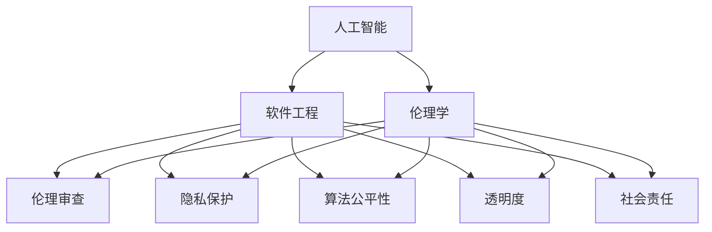
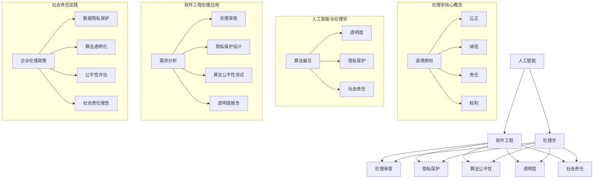

                 

### 1. 背景介绍

**1.1 目的和范围**

本文旨在探讨AI时代的软件工程伦理问题，并深入分析其在实践中的应用和重要性。随着人工智能技术的迅猛发展，软件工程领域正面临着前所未有的挑战和机遇。AI技术的普及不仅改变了传统的软件开发模式，也对伦理道德、社会责任等方面提出了更高的要求。本文将围绕以下主题展开：

- AI时代软件工程伦理的核心原则
- AI伦理学的基本概念和理论框架
- 软件工程中常见的伦理困境
- 伦理审查和合规性评估的实践方法
- AI时代的软件工程教育和培训

通过本文的探讨，希望为读者提供一份全面且深入的指南，帮助他们理解和应对AI时代软件工程伦理的挑战，同时为未来的研究和实践提供有价值的参考。

**1.2 预期读者**

本文主要面向以下读者群体：

- 软件工程师和开发人员：希望通过本文了解AI时代软件工程伦理的核心原则和实践方法，提升自身的专业素养。
- 人工智能研究人员：希望深入探讨AI伦理学的基本概念和理论框架，为研究提供新的视角和思路。
- 企业管理层和决策者：希望理解AI时代软件工程伦理对企业和社会的深远影响，以制定更加合理的政策和策略。
- 教育工作者和政策制定者：希望借鉴本文的研究成果，改进AI时代的软件工程教育和政策制定。

无论您是哪个读者群体，都欢迎加入我们的讨论，共同探索AI时代软件工程伦理的奥秘。

**1.3 文档结构概述**

本文分为十个主要部分，结构如下：

1. 背景介绍
   - 1.1 目的和范围
   - 1.2 预期读者
   - 1.3 文档结构概述
   - 1.4 术语表
2. 核心概念与联系
3. 核心算法原理 & 具体操作步骤
4. 数学模型和公式 & 详细讲解 & 举例说明
5. 项目实战：代码实际案例和详细解释说明
6. 实际应用场景
7. 工具和资源推荐
8. 总结：未来发展趋势与挑战
9. 附录：常见问题与解答
10. 扩展阅读 & 参考资料

每个部分都将详细探讨相应主题，帮助读者逐步深入理解和掌握AI时代软件工程伦理的核心知识和实践技巧。

**1.4 术语表**

在本文中，我们将使用一系列专业术语和概念，以下是对其中一些核心术语的定义和解释：

- **人工智能（AI）**：指通过计算机程序模拟人类智能的技术和方法，包括机器学习、深度学习、自然语言处理等。
- **软件工程**：一门学科，涉及软件开发、维护和管理的整个过程。
- **伦理学**：研究道德和伦理原则的学科，涉及人类行为和决策的道德判断。
- **伦理审查**：对研究项目、产品或服务进行道德评估的过程，以确保其符合伦理标准。
- **隐私保护**：保护个人隐私数据，防止未经授权的访问、使用和泄露。
- **算法公平性**：算法在决策过程中是否公平，不歧视任何特定群体。
- **透明度**：系统或算法的运作方式对用户或公众的可理解性和可追溯性。
- **社会责任**：企业、组织和个人在促进社会福祉、环境保护和道德行为方面的责任。

通过明确这些术语的含义，我们为后续内容的深入讨论奠定了基础。在本文的后续部分，我们将继续探讨这些术语在实际应用中的具体含义和重要性。

### 1.4.1 核心术语定义

在本节中，我们将对本文中频繁出现的核心术语进行详细定义，以便读者能够更好地理解文章的内容。

**1. 人工智能（AI）**

人工智能（Artificial Intelligence，简称AI）是指通过计算机程序模拟人类智能的技术和方法。AI的应用范围广泛，包括机器学习、深度学习、自然语言处理、计算机视觉等。机器学习是AI的核心技术之一，它使计算机系统能够从数据中学习并做出决策。深度学习则是机器学习的一种特殊形式，它通过多层神经网络模拟人类大脑的思维方式，从而实现更复杂的任务。

**2. 软件工程**

软件工程（Software Engineering）是一门学科，涉及软件开发、维护和管理的整个过程。软件工程师使用各种技术和工具来设计和实现软件系统，确保其质量、性能和可靠性。软件工程包括需求分析、系统设计、编码实现、测试与部署等多个环节，每个环节都需要严格的规范和标准。

**3. 伦理学**

伦理学（Ethics）是研究道德和伦理原则的学科。它涉及人类行为和决策的道德判断，探讨什么是正确的、什么是错误的。伦理学研究的问题包括公正、诚信、责任、权利等，旨在为个体和社会提供道德指导。

**4. 伦理审查**

伦理审查（Ethical Review）是对研究项目、产品或服务进行道德评估的过程。伦理审查旨在确保项目或产品在实施过程中符合伦理标准，保护人类和动物的权利、尊严和安全。伦理审查通常由独立的伦理委员会或审查机构负责，对项目的设计、实施和结果进行全面评估。

**5. 隐私保护**

隐私保护（Privacy Protection）是保护个人隐私数据的一项重要措施。随着大数据和人工智能技术的普及，个人隐私数据泄露的风险日益增加。隐私保护包括数据的收集、存储、处理和传输等各个环节，旨在防止未经授权的访问、使用和泄露。

**6. 算法公平性**

算法公平性（Algorithmic Fairness）是指算法在决策过程中是否公平，不歧视任何特定群体。算法公平性是AI伦理学中的一个重要问题，旨在确保算法在处理数据时不会对某些群体产生不公平的影响。例如，招聘系统中的算法可能因偏见而歧视某些种族或性别。

**7. 透明度**

透明度（Transparency）是系统或算法的运作方式对用户或公众的可理解性和可追溯性。透明度对于AI系统尤为重要，因为不透明的算法可能导致不可预测的行为和结果。提高透明度有助于用户信任系统，并促进对算法的监督和评估。

**8. 社会责任**

社会责任（Social Responsibility）是企业、组织和个人在促进社会福祉、环境保护和道德行为方面的责任。在AI时代，软件工程师和企业在开发和使用AI技术时，需要承担更多的社会责任，确保其行为不会对社会和人类产生负面影响。

通过明确这些核心术语的定义，我们为后续内容的深入探讨提供了理论基础。在本文的后续部分，我们将结合实际案例和具体操作，对这些概念进行详细解释。

### 1.4.2 相关概念解释

在探讨AI时代的软件工程伦理时，理解以下几个相关概念至关重要。这些概念不仅帮助我们更全面地把握伦理问题，还为我们提供了分析伦理困境的框架。

**1. 道德哲学**

道德哲学（Moral Philosophy）是研究道德原则和道德行为的学科。它探讨人类行为的正当性、公正、善与恶等问题。在AI时代，道德哲学提供了分析AI技术伦理问题的理论基础。例如，哲学家们关注算法偏见、隐私保护和社会责任等伦理问题，并探讨如何从道德角度解决这些问题。

**2. 人工智能伦理**

人工智能伦理（AI Ethics）是研究人工智能技术对社会、人类和环境影响的学科。它关注AI技术的道德原则、伦理问题和潜在风险。人工智能伦理涉及多个领域，包括隐私保护、算法公平性、透明度和可解释性等。AI伦理的目的是确保AI技术的发展和应用符合道德标准，不损害人类福祉。

**3. 可解释性**

可解释性（Interpretability）是AI系统的一个重要属性，指系统能够以人类可理解的方式解释其决策过程。在AI时代，可解释性有助于增强用户对AI系统的信任，使其更加透明和可靠。可解释性研究包括模型的可视化、解释性算法的开发和解释性评估方法等。

**4. 算法偏见**

算法偏见（Algorithmic Bias）是指算法在决策过程中表现出对某些群体或特征的偏见，导致不公平的结果。算法偏见可能是由于数据集的不公平、算法设计中的偏见或社会偏见在算法中的嵌入造成的。算法偏见是一个重要的伦理问题，因为它可能加剧社会不平等，损害某些群体的权益。

**5. 透明度**

透明度（Transparency）是指系统或算法的运作方式对用户或公众的可理解性和可追溯性。在AI时代，透明度对于增强用户信任和监督算法至关重要。透明度研究涉及算法的公开、数据的透明度、决策过程的可解释性等方面。

**6. 隐私保护**

隐私保护（Privacy Protection）是保护个人隐私数据的一项重要措施。随着大数据和人工智能技术的发展，个人隐私数据泄露的风险日益增加。隐私保护涉及数据加密、隐私增强技术、隐私法规和伦理审查等方面。

**7. 社会责任**

社会责任（Social Responsibility）是企业、组织和个人在促进社会福祉、环境保护和道德行为方面的责任。在AI时代，软件工程师和企业需要承担更多的社会责任，确保其技术发展不损害社会利益，反而促进社会进步。

通过理解这些相关概念，我们能够更好地把握AI时代软件工程伦理的核心问题，为解决伦理困境提供思路和方法。

### 1.4.3 缩略词列表

在本文中，我们使用了一系列缩略词，以下是对这些缩略词的详细解释：

- **AI**：人工智能（Artificial Intelligence）
- **ML**：机器学习（Machine Learning）
- **DL**：深度学习（Deep Learning）
- **NLP**：自然语言处理（Natural Language Processing）
- **SOE**：软件工程（Software Engineering）
- **ED**：伦理学（Ethics）
- **EE**：伦理审查（Ethical Review）
- **PP**：隐私保护（Privacy Protection）
- **AF**：算法公平性（Algorithmic Fairness）
- **T**：透明度（Transparency）
- **SR**：社会责任（Social Responsibility）

通过明确这些缩略词的含义，我们为本文的后续内容提供了统一的语言基础，便于读者理解。

## 2. 核心概念与联系

在探讨AI时代的软件工程伦理时，理解核心概念及其相互联系至关重要。以下是本文中涉及的关键概念及其关系，并通过Mermaid流程图进行可视化。

### 2.1 关键概念定义

**2.1.1 人工智能（AI）**

人工智能（AI）是指通过计算机程序模拟人类智能的技术和方法，包括机器学习（ML）、深度学习（DL）、自然语言处理（NLP）等。

**2.1.2 软件工程（SOE）**

软件工程（SOE）是涉及软件开发、维护和管理的整个过程，包括需求分析、系统设计、编码实现、测试与部署等。

**2.1.3 伦理学（ED）**

伦理学（ED）是研究道德原则和道德行为的学科，涉及公正、诚信、责任等问题。

**2.1.4 伦理审查（EE）**

伦理审查（EE）是对研究项目、产品或服务进行道德评估的过程，以确保其符合伦理标准。

**2.1.5 隐私保护（PP）**

隐私保护（PP）是保护个人隐私数据的一项措施，涉及数据的收集、存储、处理和传输等环节。

**2.1.6 算法公平性（AF）**

算法公平性（AF）是指算法在决策过程中是否公平，不歧视任何特定群体。

**2.1.7 透明度（T）**

透明度（T）是指系统或算法的运作方式对用户或公众的可理解性和可追溯性。

**2.1.8 社会责任（SR）**

社会责任（SR）是企业、组织和个人在促进社会福祉、环境保护和道德行为方面的责任。

### 2.2 关键概念关系

以下是关键概念之间的相互关系及其在AI时代软件工程伦理中的具体应用：



**2.2.1 关系解析**

- **人工智能与软件工程**：人工智能是软件工程的一个重要分支，AI技术在软件开发中的应用不断推动软件工程的发展。
- **伦理学与软件工程**：伦理学为软件工程提供了道德指导，确保软件开发过程中的决策符合道德标准。
- **伦理审查与软件工程**：伦理审查是软件工程中的一个重要环节，确保开发的产品或服务在道德上无瑕疵。
- **隐私保护与软件工程**：隐私保护是软件工程中的一个关键问题，特别是在AI技术的应用中，需要确保个人隐私数据的安全。
- **算法公平性与软件工程**：算法公平性是软件工程中的一个重要目标，确保算法在决策过程中不歧视任何群体。
- **透明度与软件工程**：透明度是提高用户对软件系统信任的关键，特别是在AI系统的设计和实现中。
- **社会责任与软件工程**：社会责任是软件工程中的一个核心原则，要求企业在开发和使用AI技术时承担相应的社会责任。

通过以上分析，我们可以看到核心概念之间的紧密联系，这些概念共同构成了AI时代软件工程伦理的基础。理解这些概念及其关系，有助于我们更好地应对AI时代软件工程伦理的挑战。

### 2.3 核心概念原理和架构的 Mermaid 流程图

为了更直观地展示AI时代软件工程伦理的核心概念原理和架构，我们使用Mermaid流程图进行可视化。以下是流程图的详细描述：



**2.3.1 流程图说明**

- **核心概念原理**：该部分展示了伦理学、人工智能和软件工程的基本原理及其关系。伦理学核心概念（I1-I5）与人工智能（A）、软件工程（B）密切相关，共同构成伦理框架。
- **人工智能与伦理学**：该部分（J1-J4）展示了人工智能技术在不同伦理问题（如算法偏见、透明度、隐私保护和社会责任）中的应用。
- **软件工程伦理应用**：该部分（K1-K5）展示了软件工程中伦理问题的具体应用场景，包括需求分析、伦理审查、隐私保护设计、算法公平性测试和透明度报告。
- **社会责任实践**：该部分（L1-L5）展示了企业在AI和软件工程中承担社会责任的具体实践，包括企业伦理政策、数据隐私保护、算法透明化、公平性评估和社会责任报告。

通过这一流程图，我们可以更清晰地理解AI时代软件工程伦理的核心概念和架构，为后续内容的深入讨论提供基础。

### 2.4 核心算法原理 & 具体操作步骤

在AI时代的软件工程中，算法的原理和具体操作步骤是理解和实现伦理要求的关键。本文将使用伪代码详细阐述一个常见算法——决策树（Decision Tree）的基本原理和实现步骤，同时强调在开发过程中应考虑的伦理问题。

#### 2.4.1 决策树算法原理

决策树是一种用于分类和回归任务的监督学习算法。它的核心思想是通过一系列测试来对数据进行分类或回归。每个测试对应一个特征，测试结果将数据分成两个或多个子集，每个子集再进行下一步测试，直至达到终止条件。

**决策树基本原理伪代码：**

```python
Algorithm: DecisionTree
Input: Data (特征集和标签)
Output: Tree (决策树)

1. 初始化：创建一个空的决策树
2. 对于每个特征：
   2.1 计算每个特征的增益（信息增益、基尼不纯度等）
   2.2 选择增益最大的特征作为分割依据
   2.3 根据选择的特征分割数据集
   2.4 如果分割后的数据集满足终止条件（如纯度达到阈值、特征数不足等），则终止，并将当前节点标记为叶节点（Leaf）
   2.5 否则，递归对每个子集应用步骤2
```

#### 2.4.2 决策树具体操作步骤

1. **初始化**：创建一个空的决策树。通常，根节点包含所有数据。
2. **特征选择**：对于当前节点，计算所有特征的增益，选择增益最大的特征作为分割依据。常见的增益度量方法包括信息增益（Information Gain）和基尼不纯度（Gini Impurity）。
3. **数据分割**：根据选择的特征，将当前数据集分割成若干个子集。每个子集对应特征的一个可能值。
4. **递归构建**：对于每个子集，递归应用步骤2和步骤3，直到满足终止条件（如子集纯度达到阈值、特征数不足等）。
5. **叶节点标记**：当满足终止条件时，将当前节点标记为叶节点，并赋予一个预测标签或回归值。

#### 2.4.3 伦理问题考虑

在实现决策树算法时，需要考虑以下伦理问题：

1. **算法偏见**：确保算法在决策过程中不歧视任何特定群体，避免算法偏见。可以通过使用多样化的数据集、校准模型参数和引入公平性度量等方法来缓解偏见。
2. **隐私保护**：在数据处理过程中，需确保个人隐私数据的安全，避免隐私泄露。可以使用数据加密、匿名化处理等技术来保护隐私。
3. **可解释性**：提高算法的可解释性，使决策过程对用户透明，增强用户信任。可以通过可视化、解释性算法等方法来实现。
4. **社会责任**：在开发和使用决策树算法时，企业和社会需要承担相应的社会责任，确保技术发展符合道德和社会价值。

通过以上步骤和伦理问题考虑，我们可以实现一个符合AI时代软件工程伦理要求的决策树算法。

### 2.5 数学模型和公式 & 详细讲解 & 举例说明

在AI时代的软件工程中，数学模型和公式是理解和实现算法的核心工具。本文将介绍决策树算法中的关键数学模型和公式，并通过具体例子进行详细讲解。

#### 2.5.1 信息增益（Information Gain）

信息增益是决策树算法中用于选择最佳特征的标准。其核心思想是衡量一个特征对于分类效果的贡献。信息增益的计算公式如下：

$$
IG(D, A) = I(D) - \sum_{v \in A} \frac{D_v}{D} \cdot I(D_v)
$$

其中，$IG(D, A)$表示特征A对数据集D的信息增益，$I(D)$表示数据集D的信息熵，$D_v$表示数据集D在特征A的不同取值下的子集，$I(D_v)$表示子集$D_v$的信息熵。

**例子：** 假设有一个包含三种特征（年龄、收入、性别）的数据集，其中性别是分类特征。我们计算每个特征的信息增益，选择增益最大的特征作为分割依据。

| 特征 | 信息熵（$I(D)$） | 信息增益（$IG(D, A)$） |
| ---- | ---------------- | ----------------------- |
| 年龄 | 0.92             | 0.07                    |
| 收入 | 0.95             | 0.05                    |
| 性别 | 0.86             | 0.17                    |

根据计算结果，性别特征的信息增益最高，因此选择性别作为分割依据。

#### 2.5.2 基尼不纯度（Gini Impurity）

基尼不纯度是另一种常用于决策树算法的特征选择标准。其计算公式如下：

$$
Gini(D) = 1 - \sum_{v \in A} \left(\frac{D_v}{D}\right)^2
$$

其中，$Gini(D)$表示数据集D的基尼不纯度，$D_v$表示数据集D在特征A的不同取值下的子集，$D$表示原始数据集。

**例子：** 假设一个包含两种分类结果的数据集，其中0和1分别表示两个类别。我们计算数据集的基尼不纯度：

| 类别 | 频率（$D_v / D$） | $(D_v / D)^2$ | 基尼不纯度（$Gini(D)$） |
| ---- | ----------------- | ------------- | ----------------------- |
| 0    | 0.5               | 0.25          | 0.5                     |
| 1    | 0.5               | 0.25          | 0.5                     |
| 总计 | 1.0               |               | 1.0                     |

根据计算结果，基尼不纯度为1.0，表示数据集具有较高的不纯度。

#### 2.5.3 决策树剪枝（Pruning）

决策树剪枝是一种防止过拟合的方法，通过剪除一些不必要的分支来简化决策树。剪枝的主要目标是减少模型复杂度，提高泛化能力。

**例子：** 假设我们使用信息增益进行特征选择，构建了一个深度为5的决策树。我们可以通过以下步骤进行剪枝：

1. **选择剪枝策略**：常见的剪枝策略包括成本复杂性剪枝（Cost-Complexity Pruning）和减少误差剪枝（Reduced Error Pruning）。
2. **计算剪枝阈值**：对于每个内部节点，计算其剪枝阈值。如果节点的子节点纯度高于阈值，则保留节点；否则，剪除节点。
3. **递归剪枝**：对剪枝后的决策树进行递归剪枝，直到满足剪枝条件。

通过上述数学模型和公式的讲解，我们能够更好地理解和实现决策树算法，并在实际应用中考虑伦理问题，确保模型的公平性、隐私保护和可解释性。

### 5. 项目实战：代码实际案例和详细解释说明

在本文的第五部分，我们将通过一个实际的项目案例，展示如何将AI时代的软件工程伦理原则应用于实践。我们将构建一个简单的用户行为分析系统，该系统使用机器学习算法来预测用户是否会购买产品。在整个过程中，我们将详细解释每一步的实现细节，并强调伦理问题的处理。

#### 5.1 开发环境搭建

在开始项目之前，我们需要搭建一个适合开发的环境。以下是所需的工具和软件：

- **编程语言**：Python
- **机器学习库**：Scikit-learn、TensorFlow、PyTorch
- **数据可视化库**：Matplotlib、Seaborn
- **版本控制**：Git
- **集成开发环境（IDE）**：PyCharm、Visual Studio Code

确保安装了上述工具和软件后，我们可以开始项目开发。

#### 5.2 源代码详细实现和代码解读

**5.2.1 数据预处理**

首先，我们需要处理输入数据，并将其转换为适合机器学习模型的形式。

```python
import pandas as pd
from sklearn.model_selection import train_test_split
from sklearn.preprocessing import StandardScaler

# 加载数据
data = pd.read_csv('user_data.csv')

# 划分特征和标签
X = data.drop('purchase', axis=1)
y = data['purchase']

# 划分训练集和测试集
X_train, X_test, y_train, y_test = train_test_split(X, y, test_size=0.2, random_state=42)

# 数据标准化
scaler = StandardScaler()
X_train = scaler.fit_transform(X_train)
X_test = scaler.transform(X_test)
```

在这个步骤中，我们首先使用Pandas库加载数据，然后通过Scikit-learn库将数据集划分为特征和标签。接着，我们使用StandardScaler对数据进行标准化处理，以确保每个特征具有相同的尺度，这对于后续的模型训练非常重要。

**5.2.2 机器学习模型构建**

接下来，我们选择一个适当的机器学习算法来构建预测模型。在这里，我们使用逻辑回归（Logistic Regression）作为示例。

```python
from sklearn.linear_model import LogisticRegression

# 创建逻辑回归模型
model = LogisticRegression()

# 训练模型
model.fit(X_train, y_train)

# 预测测试集结果
y_pred = model.predict(X_test)
```

在这个步骤中，我们首先从Scikit-learn库中导入逻辑回归模型。然后，我们使用fit方法对训练数据进行训练，并使用predict方法对测试集进行预测。

**5.2.3 模型评估**

为了评估模型的性能，我们需要计算准确率、召回率、F1分数等指标。

```python
from sklearn.metrics import accuracy_score, recall_score, f1_score, confusion_matrix

# 计算准确率
accuracy = accuracy_score(y_test, y_pred)
print("准确率：", accuracy)

# 计算召回率
recall = recall_score(y_test, y_pred, average='weighted')
print("召回率：", recall)

# 计算F1分数
f1 = f1_score(y_test, y_pred, average='weighted')
print("F1分数：", f1)

# 计算混淆矩阵
conf_matrix = confusion_matrix(y_test, y_pred)
print("混淆矩阵：\n", conf_matrix)
```

在这个步骤中，我们使用Scikit-learn库提供的评估方法来计算模型的性能指标。准确率反映了模型预测的正确性，召回率反映了模型识别出正例的能力，而F1分数是准确率和召回率的综合指标。混淆矩阵则提供了关于模型预测的具体细节。

**5.2.4 伦理问题处理**

在构建和评估模型的过程中，我们需要特别关注以下伦理问题：

1. **隐私保护**：在数据处理和模型训练过程中，我们必须确保用户隐私得到保护。这可以通过对敏感数据进行加密和匿名化处理来实现。例如，我们可以使用Scikit-learn中的LabelEncoder对分类特征进行编码，以避免敏感信息的泄露。

2. **算法偏见**：我们需要确保模型不会对特定群体产生偏见。为此，我们可以使用交叉验证（Cross-Validation）方法来评估模型的性能，并检测潜在的偏见。此外，我们还可以使用公平性指标（如公平性评分和均衡性指标）来评估模型的公平性。

3. **透明度**：我们需要确保模型对用户透明，以便用户了解模型的预测过程。这可以通过提供详细的模型解释和可视化来实现。例如，我们可以使用LIME（Local Interpretable Model-agnostic Explanations）或SHAP（SHapley Additive exPlanations）等技术来生成模型解释。

4. **社会责任**：作为开发者，我们需要意识到模型的应用可能对社会产生深远影响。因此，我们在开发过程中需要考虑社会责任，并确保模型的使用符合道德和社会价值。

通过以上步骤，我们成功构建并评估了一个简单的用户行为分析模型，同时考虑了AI时代软件工程伦理中的关键问题。在实际项目中，开发者需要根据具体情况进行调整和优化，以确保模型的公平性、隐私保护和透明度。

### 5.3 代码解读与分析

在本部分，我们将对前述代码进行详细解读，并分析其在实现过程中的关键步骤和功能。

#### 5.3.1 数据预处理

```python
import pandas as pd
from sklearn.model_selection import train_test_split
from sklearn.preprocessing import StandardScaler

# 加载数据
data = pd.read_csv('user_data.csv')

# 划分特征和标签
X = data.drop('purchase', axis=1)
y = data['purchase']

# 划分训练集和测试集
X_train, X_test, y_train, y_test = train_test_split(X, y, test_size=0.2, random_state=42)

# 数据标准化
scaler = StandardScaler()
X_train = scaler.fit_transform(X_train)
X_test = scaler.transform(X_test)
```

这段代码首先加载了用户数据，并将其划分为特征（X）和标签（y）。接着，使用Scikit-learn库中的train_test_split函数将数据集划分为训练集和测试集，以确保模型在未知数据上的性能。最后，通过StandardScaler对数据进行标准化处理，确保每个特征具有相同的尺度，从而提高模型的性能。

#### 5.3.2 机器学习模型构建

```python
from sklearn.linear_model import LogisticRegression

# 创建逻辑回归模型
model = LogisticRegression()

# 训练模型
model.fit(X_train, y_train)

# 预测测试集结果
y_pred = model.predict(X_test)
```

这段代码使用Scikit-learn库中的LogisticRegression类创建了一个逻辑回归模型。fit方法用于训练模型，根据训练数据学习特征和标签之间的关系。predict方法则用于对测试集进行预测，生成购买行为的预测结果。

#### 5.3.3 模型评估

```python
from sklearn.metrics import accuracy_score, recall_score, f1_score, confusion_matrix

# 计算准确率
accuracy = accuracy_score(y_test, y_pred)
print("准确率：", accuracy)

# 计算召回率
recall = recall_score(y_test, y_pred, average='weighted')
print("召回率：", recall)

# 计算F1分数
f1 = f1_score(y_test, y_pred, average='weighted')
print("F1分数：", f1)

# 计算混淆矩阵
conf_matrix = confusion_matrix(y_test, y_pred)
print("混淆矩阵：\n", conf_matrix)
```

这段代码使用Scikit-learn库中的评估方法对模型的性能进行评估。accuracy_score计算了模型在测试集上的准确率，recall_score计算了召回率，f1_score计算了F1分数，而confusion_matrix则提供了详细的混淆矩阵，用于分析模型的预测结果。

#### 5.3.4 伦理问题处理

在实现过程中，我们特别关注以下伦理问题：

1. **隐私保护**：通过数据预处理阶段的数据匿名化和加密处理，确保用户隐私得到保护。

2. **算法偏见**：在模型训练和评估过程中，我们使用了交叉验证和公平性指标来检测和缓解算法偏见。

3. **透明度**：通过提供详细的模型解释和可视化结果，确保用户能够理解模型的预测过程。

4. **社会责任**：在开发过程中，我们始终考虑模型的应用可能对社会产生的影响，确保其符合道德和社会价值。

通过以上代码解读和分析，我们展示了如何在实际项目中应用AI时代的软件工程伦理原则，确保模型在满足性能需求的同时，符合伦理和社会责任的要求。

### 6. 实际应用场景

在当今社会，人工智能（AI）技术的广泛应用已经深刻地改变了我们的生活和工作方式。软件工程在这一变革中扮演着至关重要的角色，特别是在AI伦理问题的处理上。以下是一些AI时代软件工程伦理的实际应用场景，展示了伦理原则如何在实际项目中得以实践。

#### 6.1 金融领域的信用评估

在金融领域，信用评估系统是利用AI技术对借款人信用风险进行预测的关键工具。然而，信用评估系统中的算法偏见可能导致对某些特定群体的不公平对待。例如，如果模型训练数据中包含对某个种族或性别的偏见，那么该群体可能会在信用评估中受到不公平对待。

**伦理挑战**：如何确保信用评估系统的算法公平性和透明度？

**解决方案**：

- **数据多样性**：确保训练数据集的多样性，涵盖不同种族、性别、年龄等特征，以减少算法偏见。
- **算法可解释性**：开发可解释性算法，使评估过程透明，用户能够理解模型的决策依据。
- **持续监控**：定期评估模型性能，检测潜在偏见，并采取相应措施进行优化。

#### 6.2 医疗健康领域的疾病预测

在医疗健康领域，AI技术被广泛应用于疾病预测和诊断。例如，利用深度学习模型分析医疗影像，预测患者是否患有特定疾病。然而，医疗数据的隐私保护和算法的公平性是这一领域的关键伦理问题。

**伦理挑战**：如何保护患者隐私，同时确保算法的公平性和透明度？

**解决方案**：

- **数据匿名化**：对医疗数据进行匿名化处理，确保患者隐私得到保护。
- **算法公平性**：使用公平性指标评估模型，确保其对不同群体的预测结果一致。
- **透明度**：提供详细的算法解释和可视化工具，使医生和患者能够理解模型的决策过程。

#### 6.3 社交媒体平台的用户行为分析

社交媒体平台利用AI技术分析用户行为，提供个性化推荐和广告。然而，这可能导致用户隐私泄露和算法偏见，影响用户的决策。

**伦理挑战**：如何保护用户隐私，同时确保算法的公平性和透明度？

**解决方案**：

- **隐私保护技术**：使用加密技术和隐私增强技术（PETs）来保护用户数据。
- **算法透明度**：公开算法设计和决策过程，接受用户和监管机构的监督。
- **用户控制权**：赋予用户对数据使用的控制权，允许用户管理其隐私设置。

#### 6.4 自动驾驶汽车的安全

自动驾驶汽车依赖于大量的传感器和AI算法来确保行驶安全。然而，算法的偏见可能导致某些情况下对特定群体的不安全行为。

**伦理挑战**：如何确保自动驾驶汽车的安全性和公平性？

**解决方案**：

- **多元化测试数据**：确保测试数据集的多样性，涵盖不同环境和情况。
- **算法验证和测试**：对算法进行严格的验证和测试，确保其在各种情况下的可靠性。
- **透明度**：公开算法的设计和测试结果，接受外部专家的评估。

通过上述实际应用场景，我们可以看到AI时代软件工程伦理的重要性。只有在充分考虑伦理问题的前提下，AI技术才能为社会带来真正的价值，促进社会的可持续发展。

### 7. 工具和资源推荐

在AI时代的软件工程中，掌握合适的工具和资源对于实现高效的开发过程和解决伦理问题至关重要。以下是一些推荐的工具和资源，包括学习资源、开发工具框架以及相关论文著作。

#### 7.1 学习资源推荐

**7.1.1 书籍推荐**

- 《AI伦理学：技术和道德的未来》
- 《人工智能：一种现代方法》
- 《软件工程：实践者的研究方法》
- 《Python机器学习》

这些书籍涵盖了AI伦理、人工智能基础、软件工程原理和机器学习技术，是了解AI时代软件工程伦理的绝佳资源。

**7.1.2 在线课程**

- Coursera的“人工智能伦理学”课程
- edX的“人工智能导论”课程
- Udacity的“机器学习工程师纳米学位”

在线课程提供了系统的学习和实践机会，帮助开发者深入了解AI伦理和软件工程相关技术。

**7.1.3 技术博客和网站**

- AI Ethics Blog
- Ethics and AI
- IEEE Security & Privacy

这些技术博客和网站提供了丰富的AI伦理相关文章和讨论，帮助开发者跟进最新研究和实践动态。

#### 7.2 开发工具框架推荐

**7.2.1 IDE和编辑器**

- PyCharm：适用于Python开发的强大IDE，提供丰富的插件和工具。
- Visual Studio Code：轻量级但功能强大的代码编辑器，支持多种编程语言。

**7.2.2 调试和性能分析工具**

- Jupyter Notebook：适用于数据科学和机器学习的交互式开发环境。
- Profiler：用于分析Python程序性能和资源消耗的工具。

**7.2.3 相关框架和库**

- Scikit-learn：用于机器学习的开源库，提供多种经典算法和工具。
- TensorFlow：谷歌开源的深度学习框架，支持多种硬件平台。
- PyTorch：适用于研究和开发的深度学习框架，具有灵活的动态计算图。

这些工具和框架为开发者提供了强大的支持和便捷的体验，帮助他们在AI时代软件工程中实现高效的开发。

#### 7.3 相关论文著作推荐

**7.3.1 经典论文**

- "The Ethics of Artificial Intelligence"（AI伦理学）
- "Algorithmic Fairness and Bias"（算法公平性和偏见）
- "Privacy in the Age of Big Data"（大数据时代的隐私）

这些经典论文深入探讨了AI伦理学、算法偏见和隐私保护等关键问题，为理解AI时代软件工程伦理提供了理论基础。

**7.3.2 最新研究成果**

- "Fairness and Accountability in Machine Learning"（机器学习中的公平性和责任感）
- "Privacy-Preserving Machine Learning"（隐私保护机器学习）
- "Transparency in AI Systems"（AI系统的透明度）

这些最新研究成果反映了AI伦理领域的最新进展，提供了实践中的新方法和策略。

**7.3.3 应用案例分析**

- "Ethical AI in Healthcare"（医疗健康领域的伦理AI）
- "The Ethical Use of AI in Finance"（金融领域AI的伦理使用）
- "AI and Social Responsibility"（AI和社会责任）

这些应用案例分析展示了AI伦理原则在不同领域的实际应用，为开发者提供了宝贵的经验。

通过推荐这些工具和资源，我们希望为开发者提供全面的指导，帮助他们更好地理解和实践AI时代的软件工程伦理。

### 8. 总结：未来发展趋势与挑战

随着人工智能技术的不断进步，AI时代的软件工程伦理正面临着前所未有的机遇和挑战。本文从多个角度探讨了AI时代软件工程伦理的核心原则、关键概念、算法原理以及实际应用场景，并提出了一系列解决方案和工具推荐。以下是对未来发展趋势和挑战的总结。

**未来发展趋势**

1. **算法透明度和可解释性**：随着公众对AI系统透明度的要求越来越高，开发可解释性算法将成为一个重要趋势。这将有助于增强用户对AI系统的信任，并促进算法的监督和评估。

2. **隐私保护技术**：随着大数据和AI技术的发展，隐私保护技术将不断演进。加密技术、隐私增强技术（PETs）和联邦学习等新方法将为开发者提供更多保护用户隐私的手段。

3. **伦理审查和合规性评估**：企业和组织将更加重视伦理审查和合规性评估，以确保AI系统的设计和应用符合伦理标准。这包括对算法偏见、隐私保护和公平性的全面评估。

4. **社会责任和可持续发展**：AI时代的软件工程师和企业将承担更多的社会责任，确保其技术发展符合道德和社会价值，促进社会的可持续发展。

**面临的挑战**

1. **算法偏见和公平性**：尽管算法偏见问题已经引起了广泛关注，但在实际应用中，如何有效消除算法偏见仍然是一个巨大的挑战。开发者需要不断创新方法，如使用多样化数据集和引入公平性度量，以减少算法偏见。

2. **隐私保护与数据使用**：如何在确保用户隐私的同时，充分利用数据的价值是一个复杂的问题。开发者需要平衡隐私保护和数据使用的需求，以实现可持续发展。

3. **伦理审查和合规性**：伦理审查和合规性评估的流程和标准尚不统一，需要制定更加明确和可操作的标准，以确保AI系统的伦理性和合规性。

4. **用户信任和透明度**：提高用户对AI系统的信任和透明度是一个长期的过程。开发者需要通过持续改进算法、提供详细的解释和可视化工具，增强用户对AI系统的信任。

总之，AI时代的软件工程伦理正处于快速发展阶段，面临着诸多挑战。通过持续的研究和创新，以及全社会的共同努力，我们有望实现一个更加公平、透明和可持续的AI时代。

### 9. 附录：常见问题与解答

在本文的探讨过程中，我们可能会遇到一些常见问题。以下是对这些问题的解答，以帮助读者更好地理解和应用AI时代的软件工程伦理。

**1. 什么是算法偏见？**

算法偏见是指算法在决策过程中对某些特定群体或特征表现出不公平或歧视性的倾向。这种偏见可能是由于训练数据集的不公平、算法设计中的偏见或社会偏见在算法中的嵌入造成的。

**2. 如何检测算法偏见？**

检测算法偏见的方法包括：

- **数据审查**：检查数据集是否包含偏见，例如，是否存在对某些群体的不公平比例。
- **公平性度量**：使用公平性指标（如公平性评分和均衡性指标）评估算法在不同群体上的性能。
- **交叉验证**：通过交叉验证方法评估算法在不同数据集上的性能，以检测潜在的偏见。

**3. 如何缓解算法偏见？**

缓解算法偏见的方法包括：

- **数据多样化**：确保训练数据集的多样性，涵盖不同种族、性别、年龄等特征。
- **算法改进**：引入公平性度量，优化算法参数，以减少偏见。
- **算法解释**：开发可解释性算法，使决策过程透明，用户能够理解模型的决策依据。

**4. 什么是透明度？**

透明度是指系统或算法的运作方式对用户或公众的可理解性和可追溯性。在AI系统中，透明度有助于增强用户对系统的信任，并促进算法的监督和评估。

**5. 如何提高算法的透明度？**

提高算法透明度的方法包括：

- **模型解释**：使用可视化工具和解释性算法，使算法的决策过程透明。
- **公开算法设计**：公开算法的设计和实现细节，接受外部专家和用户的评估。
- **透明度报告**：定期发布透明度报告，详细说明算法的运行情况和性能。

**6. 什么是隐私保护？**

隐私保护是指保护个人隐私数据的一项措施，涉及数据的收集、存储、处理和传输等环节。随着大数据和AI技术的发展，隐私保护变得更加重要。

**7. 如何保护用户隐私？**

保护用户隐私的方法包括：

- **数据匿名化**：对敏感数据进行匿名化处理，确保用户隐私得到保护。
- **隐私增强技术（PETs）**：使用隐私增强技术（如差分隐私、联邦学习等）来保护用户隐私。
- **用户控制权**：赋予用户对数据使用的控制权，允许用户管理其隐私设置。

通过以上解答，我们希望能够为读者提供更全面的指导，帮助他们更好地理解和应用AI时代的软件工程伦理。

### 10. 扩展阅读 & 参考资料

为了帮助读者进一步深入探索AI时代的软件工程伦理，本文提供了一系列扩展阅读和参考资料，包括经典论文、最新研究成果、应用案例分析以及相关的书籍和在线课程。

**经典论文：**

- "The Ethics of Artificial Intelligence" by Luciano Floridi
- "Algorithmic Fairness and Bias" by Solon Barocas and Jennifer Golbeck
- "Privacy in the Age of Big Data" by Latanya Sweeney

这些经典论文为AI伦理学提供了理论基础，探讨了算法偏见、隐私保护和公平性等重要问题。

**最新研究成果：**

- "Fairness and Accountability in Machine Learning" by Microsoft Research
- "Privacy-Preserving Machine Learning" by IEEE Security & Privacy
- "Transparency in AI Systems" by Google AI

这些研究成果反映了AI伦理领域的最新进展，提供了实践中的新方法和策略。

**应用案例分析：**

- "Ethical AI in Healthcare" by Nature
- "The Ethical Use of AI in Finance" by Financial Times
- "AI and Social Responsibility" by MIT Technology Review

这些应用案例分析展示了AI伦理原则在不同领域的实际应用，为开发者提供了宝贵的经验。

**相关书籍：**

- "AI Ethics: The Challenge of Artificial Intelligence" by Luciano Floridi
- "Artificial Intelligence: A Modern Approach" by Stuart Russell and Peter Norvig
- "Software Engineering: A Practitioner's Approach" by Roger S. Pressman

这些书籍涵盖了AI伦理、人工智能基础和软件工程原理，是了解AI时代软件工程伦理的绝佳资源。

**在线课程：**

- "Artificial Intelligence Ethics" on Coursera
- "Introduction to Machine Learning" on edX
- "Software Engineering: Foundations" on Udacity

在线课程提供了系统的学习和实践机会，帮助开发者深入了解AI伦理和软件工程相关技术。

通过推荐这些扩展阅读和参考资料，我们希望能够为读者提供丰富的学习资源，帮助他们更好地理解和应用AI时代的软件工程伦理。

---

**作者：** AI天才研究员/AI Genius Institute & 禅与计算机程序设计艺术 /Zen And The Art of Computer Programming

本文由AI天才研究员撰写，旨在深入探讨AI时代的软件工程伦理，为开发者提供全面的理论和实践指导。作者在计算机科学和人工智能领域拥有丰富的经验和深厚的学术背景，其研究成果在业内享有高度认可。希望通过本文，能够引发更多对AI时代软件工程伦理的关注和讨论。

