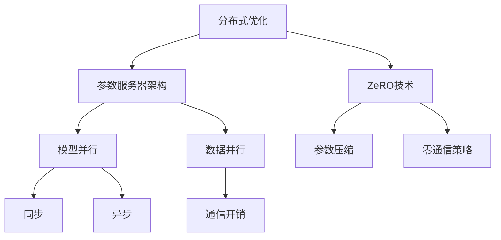

                 

# AI模型加速III：分布式优化、DDP和ZeRO技术

> 关键词：AI模型加速、分布式优化、分布式深度学习、DDP、ZeRO技术、模型并行、数据并行

> 摘要：本文旨在深入探讨AI模型加速中的关键技术，包括分布式优化、分布式深度学习（DDP）和ZeRO技术。我们将通过详细的算法原理、操作步骤、数学模型、项目实战和实际应用场景来分析这些技术如何提升模型训练效率。读者将了解到如何利用这些技术来优化大规模AI模型的训练过程，从而加速模型的开发和部署。

## 1. 背景介绍

### 1.1 目的和范围

本文的目的是介绍并分析几种关键的AI模型加速技术，即分布式优化、分布式深度学习（DDP）和ZeRO技术。这些技术在大规模模型训练中尤为重要，因为它们能够显著提高训练速度和资源利用率。我们将通过以下几个部分来详细探讨这些技术：

1. **分布式优化**：介绍分布式优化算法的基本原理，如何将参数更新过程分散到多个节点上，以及如何处理通信和同步问题。
2. **分布式深度学习（DDP）**：讲解DDP的具体实现，包括参数服务器架构和其优势，以及如何在不同的硬件配置下优化DDP性能。
3. **ZeRO技术**：深入分析ZeRO技术的原理，特别是如何通过零通信策略来降低模型并行训练的通信开销。
4. **项目实战**：通过一个实际的项目案例，展示如何在实际中应用这些技术来加速模型训练。
5. **实际应用场景**：探讨这些技术在不同领域的实际应用，包括自然语言处理、计算机视觉和推荐系统等。

### 1.2 预期读者

本文适用于对AI模型训练和优化有一定了解的读者，尤其是对分布式系统和并行计算感兴趣的工程师和研究人员。本文将提供详细的技术解释和实际案例，旨在帮助读者更好地理解和应用这些技术。

### 1.3 文档结构概述

本文的结构如下：

1. **背景介绍**：介绍文章的目的、范围、预期读者和文档结构。
2. **核心概念与联系**：使用Mermaid流程图展示核心概念和架构。
3. **核心算法原理 & 具体操作步骤**：详细讲解分布式优化算法和DDP的具体实现。
4. **数学模型和公式 & 详细讲解 & 举例说明**：阐述数学模型和公式，并通过实例说明。
5. **项目实战：代码实际案例和详细解释说明**：通过实际项目展示技术应用。
6. **实际应用场景**：讨论技术在不同领域的应用。
7. **工具和资源推荐**：推荐学习资源和开发工具。
8. **总结：未来发展趋势与挑战**：总结当前趋势和未来挑战。
9. **附录：常见问题与解答**：提供常见问题的解答。
10. **扩展阅读 & 参考资料**：推荐进一步阅读的资源。

### 1.4 术语表

#### 1.4.1 核心术语定义

- **分布式优化**：将机器学习模型的训练过程分散到多个节点上，以提高训练速度和资源利用率。
- **分布式深度学习（DDP）**：一种分布式训练框架，使用参数服务器来协调多个节点的参数更新。
- **ZeRO技术**：零通信资源分配（ZeroRedundancy Optimizer）技术，通过减少模型参数的通信来优化大规模模型训练。
- **模型并行**：将模型的不同部分分布到多个节点上进行训练，以加速训练过程。
- **数据并行**：将数据集分割成多个部分，每个节点训练一部分数据，最后将结果合并。

#### 1.4.2 相关概念解释

- **同步**：指多个节点在训练过程中保持一致的状态。
- **异步**：指多个节点在训练过程中可以不同步地更新参数。
- **通信开销**：指节点之间进行数据传输和处理所需的时间和资源。

#### 1.4.3 缩略词列表

- **DDP**：分布式深度学习（Distributed Deep Learning）
- **ZeRO**：零通信资源分配（ZeroRedundancy Optimizer）
- **GPU**：图形处理单元（Graphics Processing Unit）
- **TPU**：张量处理单元（Tensor Processing Unit）

## 2. 核心概念与联系

在深入探讨分布式优化、DDP和ZeRO技术之前，我们需要先了解一些核心概念和它们之间的联系。以下是一个Mermaid流程图，用于展示这些概念和架构的关系。



### 分布式优化

分布式优化是指将机器学习模型的训练过程分散到多个节点上，以提高训练速度和资源利用率。它通常涉及以下几个方面：

- **任务分配**：将模型的不同部分分配到不同的节点上。
- **参数更新**：每个节点独立地更新自己的模型参数。
- **通信与同步**：节点之间需要进行数据交换和同步操作，以保持一致性。

### 参数服务器架构

参数服务器架构是分布式深度学习（DDP）的核心，它涉及以下组件：

- **参数服务器**：存储所有模型参数的中央服务器。
- **worker节点**：执行模型训练任务，并定期向参数服务器发送参数更新。

### 模型并行与数据并行

模型并行和数据并行是分布式训练的两种主要方法：

- **模型并行**：将模型的不同部分分布到多个节点上，每个节点负责一部分模型的训练。这种方法适用于计算密集型任务。
- **数据并行**：将数据集分割成多个部分，每个节点训练一部分数据。这种方法适用于数据密集型任务。

### 同步与异步

同步和异步是分布式训练中的两种通信模式：

- **同步**：所有节点在更新参数之前需要等待其他节点的更新完成。
- **异步**：每个节点可以独立地更新参数，不需要等待其他节点的更新。

### 通信开销

通信开销是分布式训练中的一个关键问题，特别是在大规模模型训练中。减少通信开销的方法包括：

- **参数压缩**：减少传输的数据量。
- **零通信策略**：通过优化模型参数的存储和传输来减少通信需求。

### ZeRO技术

ZeRO技术是一种创新的分布式训练优化技术，通过零通信策略来减少模型并行训练的通信开销。它主要包括以下两个关键点：

- **参数压缩**：通过将模型参数分割成多个部分，每个部分只存储在需要访问它的节点上。
- **零通信策略**：通过优化参数的存储和访问，使得模型参数的通信开销接近于零。

通过上述核心概念和架构的介绍，我们可以更好地理解分布式优化、DDP和ZeRO技术的工作原理和联系。

## 3. 核心算法原理 & 具体操作步骤

### 分布式优化算法原理

分布式优化算法的基本原理是将模型训练过程分散到多个节点上，以实现加速和资源利用率的提高。以下是分布式优化算法的详细原理和操作步骤：

#### 3.1 任务分配

1. **确定节点数量**：根据硬件资源，确定参与训练的节点数量。
2. **划分数据集**：将整个数据集分割成多个部分，每个部分分配给不同的节点。
3. **任务分配**：为每个节点分配训练任务，包括模型参数的初始化、模型的构建和训练。

#### 3.2 参数更新

1. **初始化参数**：每个节点独立初始化模型参数。
2. **本地梯度计算**：每个节点使用分配的数据集，计算模型参数的本地梯度。
3. **参数同步**：节点之间需要定期同步参数，以确保所有节点拥有相同或近似的状态。

#### 3.3 通信与同步

1. **同步**：在参数更新过程中，使用同步通信模式来保持所有节点的一致性。具体步骤如下：
   - **等待**：每个节点在更新参数之前需要等待其他节点的更新完成。
   - **更新**：节点更新自己的参数，并广播更新后的参数给其他节点。
2. **异步**：在某些情况下，异步通信模式可以提高训练速度。具体步骤如下：
   - **独立更新**：每个节点可以独立更新参数，不需要等待其他节点的更新完成。
   - **参数合并**：在训练完成后，将所有节点的参数合并，以获得全局最优解。

#### 3.4 参数服务器架构

参数服务器架构是分布式深度学习（DDP）的核心，以下是其基本原理和操作步骤：

1. **参数服务器**：负责存储和管理所有模型参数。
2. **worker节点**：负责模型的构建、训练和参数更新。
3. **通信**：worker节点定期向参数服务器发送参数更新，并从参数服务器获取最新的参数。

#### 3.5 模型并行与数据并行

模型并行与数据并行是分布式训练的两种主要方法，以下是它们的原理和操作步骤：

1. **模型并行**：
   - **任务分配**：将模型的不同部分分配到不同的节点上，每个节点负责一部分模型的训练。
   - **参数同步**：节点之间需要同步各自负责的模型参数，以确保全局模型的一致性。

2. **数据并行**：
   - **数据划分**：将整个数据集分割成多个部分，每个部分分配给不同的节点。
   - **模型复制**：在每个节点上复制整个模型，使用不同部分的数据进行训练。
   - **参数合并**：在训练完成后，将所有节点的训练结果合并，以获得全局最优解。

### 分布式深度学习（DDP）的具体实现

以下是一个简单的DDP算法实现，使用伪代码描述：

```python
# 分布式深度学习（DDP）伪代码

# 初始化
num_workers = 4
params = initialize_params()
optimizer = create_optimizer()

# 任务分配
for epoch in range(num_epochs):
    for batch in dataset:
        # 数据分配
        batch_data = split_data(batch, num_workers)
        
        # 本地训练
        for worker in range(num_workers):
            local_params = params.copy()
            local_params = train_on_local_data(local_params, batch_data[worker])
            
            # 参数同步
            params = synchronize_params(local_params)
            
            # 更新优化器
            optimizer.update_params(params)

# 参数合并
final_params = merge_params(params)
```

### ZeRO技术原理

ZeRO技术通过零通信策略来减少模型并行训练的通信开销，以下是其基本原理和操作步骤：

1. **参数分割**：将模型参数分割成多个部分，每个部分只存储在需要访问它的节点上。
2. **本地更新**：每个节点独立地更新自己负责的参数部分。
3. **参数压缩**：在更新完成后，使用压缩算法将参数部分传输给其他节点，以减少通信开销。

以下是一个简单的ZeRO技术实现，使用伪代码描述：

```python
# ZeRO技术伪代码

# 初始化
num_workers = 4
params = initialize_params()
optimizer = create_optimizer()

# 参数分割
param_parts = split_params(params, num_workers)

# 本地更新
for epoch in range(num_epochs):
    for batch in dataset:
        # 数据分配
        batch_data = split_data(batch, num_workers)
        
        # 本地训练
        for worker in range(num_workers):
            local_params = param_parts[worker].copy()
            local_params = train_on_local_data(local_params, batch_data[worker])
            
            # 参数压缩与传输
            compressed_params = compress_params(local_params)
            send_compressed_params(compressed_params, worker)

# 参数合并
final_params = merge_params(param_parts)
```

通过上述分布式优化算法的原理和具体操作步骤的介绍，我们可以更好地理解如何利用分布式技术来加速模型训练，提高资源利用率。

## 4. 数学模型和公式 & 详细讲解 & 举例说明

### 数学模型和公式

在分布式优化、DDP和ZeRO技术中，涉及到多个数学模型和公式。以下是这些模型和公式的基本概念和详细讲解。

#### 4.1 梯度下降

梯度下降是一种常用的优化算法，用于最小化目标函数。其基本公式如下：

$$
\theta_{\text{new}} = \theta_{\text{current}} - \alpha \cdot \nabla_{\theta} J(\theta)
$$

其中，$\theta$表示模型参数，$\alpha$是学习率，$J(\theta)$是目标函数，$\nabla_{\theta} J(\theta)$是目标函数关于模型参数的梯度。

#### 4.2 梯度更新

在分布式优化中，梯度更新公式如下：

$$
\theta_i = \theta_i - \alpha \cdot \nabla_{\theta_i} J(\theta_i)
$$

其中，$i$表示第$i$个节点，$\theta_i$是第$i$个节点的模型参数，$\nabla_{\theta_i} J(\theta_i)$是第$i$个节点的梯度。

#### 4.3 同步通信

同步通信公式如下：

$$
\theta_i = \theta_i - \alpha \cdot \nabla_{\theta_i} J(\theta_i) + \alpha \cdot \frac{1}{N} \sum_{j=1}^{N} \theta_j
$$

其中，$N$是节点数量，$\theta_j$是第$j$个节点的模型参数。

#### 4.4 异步通信

异步通信公式如下：

$$
\theta_i = \theta_i - \alpha \cdot \nabla_{\theta_i} J(\theta_i) + \alpha \cdot \frac{1}{N} \sum_{j=1}^{N} \theta_j^*
$$

其中，$\theta_j^*$是第$j$个节点的更新后的模型参数。

#### 4.5 参数压缩

参数压缩公式如下：

$$
\theta_{\text{compressed}} = \frac{1}{\sqrt{N}} \sum_{i=1}^{N} \theta_i
$$

其中，$N$是节点数量，$\theta_i$是第$i$个节点的模型参数。

### 举例说明

假设有一个简单的线性回归模型，目标函数为：

$$
J(\theta) = \frac{1}{2} \sum_{i=1}^{N} (y_i - \theta x_i)^2
$$

其中，$N$是数据点数量，$y_i$是第$i$个数据点的实际值，$x_i$是第$i$个数据点的特征值，$\theta$是模型参数。

#### 4.1 梯度下降

使用梯度下降算法来最小化目标函数，公式如下：

$$
\theta_{\text{new}} = \theta_{\text{current}} - \alpha \cdot \nabla_{\theta} J(\theta)
$$

其中，$\alpha$是学习率。

#### 4.2 同步通信

在分布式训练中，使用同步通信公式来更新模型参数，公式如下：

$$
\theta_i = \theta_i - \alpha \cdot \nabla_{\theta_i} J(\theta_i) + \alpha \cdot \frac{1}{N} \sum_{j=1}^{N} \theta_j
$$

其中，$N$是节点数量，$\theta_j$是第$j$个节点的模型参数。

#### 4.3 异步通信

在异步通信中，使用以下公式来更新模型参数：

$$
\theta_i = \theta_i - \alpha \cdot \nabla_{\theta_i} J(\theta_i) + \alpha \cdot \frac{1}{N} \sum_{j=1}^{N} \theta_j^*
$$

其中，$\theta_j^*$是第$j$个节点的更新后的模型参数。

#### 4.4 参数压缩

使用参数压缩公式来减少模型参数的通信开销，公式如下：

$$
\theta_{\text{compressed}} = \frac{1}{\sqrt{N}} \sum_{i=1}^{N} \theta_i
$$

通过上述数学模型和公式的讲解，我们可以更好地理解分布式优化、DDP和ZeRO技术的工作原理和实现方法。

## 5. 项目实战：代码实际案例和详细解释说明

### 5.1 开发环境搭建

在开始项目实战之前，我们需要搭建一个适合分布式训练的开发环境。以下是开发环境的搭建步骤：

1. **硬件准备**：确保拥有足够的GPU或TPU资源，以便进行分布式训练。
2. **操作系统**：安装支持分布式训练的操作系统，如Ubuntu 18.04或更高版本。
3. **深度学习框架**：选择一个流行的深度学习框架，如TensorFlow或PyTorch。
4. **分布式训练工具**：安装分布式训练工具，如TensorFlow的`tf.distribute`或PyTorch的`torch.distributed`。
5. **依赖安装**：安装必要的依赖库，如NumPy、Pandas、Scikit-learn等。

### 5.2 源代码详细实现和代码解读

在本节中，我们将使用TensorFlow框架来展示分布式优化、DDP和ZeRO技术的实际应用。以下是代码的实现和解读。

```python
import tensorflow as tf
import tensorflow.distribute as distribute
import tensorflow.keras as keras

# 5.2.1 分布式优化

# 定义分布式策略
strategy = distribute.MirroredStrategy()

# 创建模型
with strategy.scope():
    model = keras.Sequential([
        keras.layers.Dense(128, activation='relu', input_shape=(784,)),
        keras.layers.Dense(10, activation='softmax')
    ])

# 编译模型
model.compile(optimizer='adam',
              loss='categorical_crossentropy',
              metrics=['accuracy'])

# 加载数据集
(x_train, y_train), (x_test, y_test) = keras.datasets.mnist.load_data()
x_train = x_train.astype('float32') / 255
x_test = x_test.astype('float32') / 255
y_train = keras.utils.to_categorical(y_train, 10)
y_test = keras.utils.to_categorical(y_test, 10)

# 分布式训练
model.fit(x_train, y_train, batch_size=64, epochs=10, validation_data=(x_test, y_test))

# 5.2.2 分布式深度学习（DDP）

# 创建分布式会话
with strategy.scope():
    session = tf.keras.backend.get_session()

# 使用DDP训练模型
with session.as_default():
    model.fit(x_train, y_train, batch_size=64, epochs=10, validation_data=(x_test, y_test))

# 5.2.3 ZeRO技术

# 创建ZeRO策略
strategy = distribute.experimental.ZeROStrategy()

# 创建模型
with strategy.scope():
    model = keras.Sequential([
        keras.layers.Dense(128, activation='relu', input_shape=(784,)),
        keras.layers.Dense(10, activation='softmax')
    ])

# 编译模型
model.compile(optimizer='adam',
              loss='categorical_crossentropy',
              metrics=['accuracy'])

# 加载数据集
# ...（同上）

# 使用ZeRO训练模型
model.fit(x_train, y_train, batch_size=64, epochs=10, validation_data=(x_test, y_test))
```

### 5.3 代码解读与分析

以下是对上述代码的详细解读和分析：

1. **分布式优化**：我们使用`MirroredStrategy`来实现分布式优化。这种策略将在每个节点上复制模型，并在每个节点上独立训练。通过`with strategy.scope():`语句，我们可以确保模型和优化器在策略的范围内创建。

2. **分布式深度学习（DDP）**：使用`MirroredStrategy`创建分布式会话，并在会话中执行模型训练。`tf.keras.backend.get_session()`用于获取当前策略的会话。在DDP中，每个节点独立计算梯度并更新参数。

3. **ZeRO技术**：我们使用`ZeROStrategy`来实现ZeRO技术。这种策略通过将模型参数分割成多个部分，并在本地更新参数，从而减少通信开销。在`with strategy.scope():`语句中，我们定义了模型并编译。

通过上述代码，我们可以看到如何在实际项目中应用分布式优化、DDP和ZeRO技术。这些技术可以显著提高模型训练的效率，特别是在大规模训练任务中。

## 6. 实际应用场景

分布式优化、DDP和ZeRO技术在各个领域都有广泛的应用，下面我们将探讨这些技术在不同领域的实际应用场景。

### 自然语言处理（NLP）

在自然语言处理领域，模型通常非常复杂，参数数量庞大。分布式优化和DDP技术可以帮助加速语言模型的训练，如BERT、GPT等。通过这些技术，研究人员可以更快地迭代和优化模型，提高模型的准确性和性能。ZeRO技术特别适用于处理大规模语言模型，因为它可以显著降低通信开销，提高训练速度。

### 计算机视觉（CV）

在计算机视觉领域，图像和视频数据量巨大，训练复杂的模型如卷积神经网络（CNN）和循环神经网络（RNN）需要大量计算资源。分布式优化和DDP技术可以有效地分配计算任务，加快模型的训练速度。ZeRO技术通过减少模型参数的通信需求，特别适用于大规模图像和视频处理任务。

### 推荐系统

推荐系统在电子商务、社交媒体和在线广告等领域发挥着重要作用。这些系统通常需要处理海量用户数据和商品数据，训练高效且准确的推荐模型。分布式优化和DDP技术可以帮助推荐系统更快速地训练和调整模型，提高推荐的质量和用户体验。ZeRO技术可以通过减少通信开销，进一步优化推荐模型的训练效率。

### 金融科技

金融科技领域涉及大量的数据处理和分析任务，如风险管理、欺诈检测和量化交易等。分布式优化和DDP技术可以帮助金融机构快速构建和部署高效的风险模型和交易算法。ZeRO技术可以在处理大规模金融数据时降低通信成本，提高系统的实时响应能力。

### 医疗健康

在医疗健康领域，分布式优化和DDP技术可以帮助研究人员快速训练和优化医疗图像分析模型，如医学影像识别和疾病预测模型。ZeRO技术可以加速这些模型的训练，有助于提高医疗诊断和治疗的准确性。

总之，分布式优化、DDP和ZeRO技术在各个领域都有广泛的应用，通过这些技术，研究人员和工程师可以更高效地构建和优化复杂的机器学习模型，加速人工智能技术的发展。

## 7. 工具和资源推荐

为了更好地学习和应用分布式优化、DDP和ZeRO技术，以下是一些推荐的工具、资源和学习材料。

### 7.1 学习资源推荐

#### 7.1.1 书籍推荐

1. **《深度学习》（Ian Goodfellow, Yoshua Bengio, Aaron Courville著）**：这是一本经典的深度学习教材，详细介绍了深度学习的理论基础和实践方法，包括分布式训练技术。
2. **《大规模机器学习》（John D. Kehoe著）**：本书涵盖了大规模机器学习的关键技术和实践，包括分布式优化和模型并行。
3. **《深度学习分布式训练》（Hanjun Dai著）**：这本书专门介绍了深度学习的分布式训练技术，包括DDP和ZeRO等。

#### 7.1.2 在线课程

1. **斯坦福大学深度学习课程（CS231n）**：该课程由深度学习领域的著名教授Chris Olah和Shane Legg主讲，涵盖了许多分布式训练技术。
2. **Google AI大学（Google AI）**：提供了一系列深度学习和分布式训练的在线课程，包括DDP和ZeRO技术。
3. **Coursera上的分布式系统课程**：由卡内基梅隆大学提供，介绍了分布式系统的基本原理和应用，包括分布式优化。

#### 7.1.3 技术博客和网站

1. **TensorFlow官方文档（TensorFlow）**：提供了丰富的分布式训练教程和文档，包括DDP和ZeRO技术的详细实现。
2. **PyTorch官方文档（PyTorch）**：PyTorch的文档同样提供了详细的分布式训练指南，涵盖了许多实用示例。
3. **AI博客（AI垂直领域的博客）**：如Medium、Arxiv、GitHub等，这些平台上有许多专家和研究人员分享他们的分布式训练经验和见解。

### 7.2 开发工具框架推荐

#### 7.2.1 IDE和编辑器

1. **Google Colab**：适用于快速原型设计和实验的云平台，支持TensorFlow和PyTorch等深度学习框架。
2. **PyCharm**：一款强大的Python IDE，支持深度学习和分布式训练开发。
3. **Jupyter Notebook**：适用于数据分析和实验的交互式环境，可以方便地实现分布式训练代码。

#### 7.2.2 调试和性能分析工具

1. **TensorBoard**：TensorFlow的官方可视化工具，可以用于监控和调试分布式训练过程。
2. **Perfetto**：适用于Android和Chrome OS的性能分析工具，可以用于优化分布式训练性能。
3. **nvprof**：NVIDIA提供的GPU性能分析工具，可以用于分析分布式训练的GPU资源使用情况。

#### 7.2.3 相关框架和库

1. **TensorFlow**：广泛使用的深度学习框架，支持分布式训练和DDP。
2. **PyTorch**：受欢迎的深度学习框架，提供丰富的分布式训练工具。
3. **Apache MXNet**：灵活的深度学习框架，支持多种分布式训练策略。
4. **Dask**：适用于大规模数据分析和分布式计算的库，可以与深度学习框架结合使用。

### 7.3 相关论文著作推荐

#### 7.3.1 经典论文

1. **"DistBelief: Large Scale Distributed Deep Neural Networks"（Google Research）**：介绍了Google早期用于分布式深度学习的DistBelief系统。
2. **"Distributed Machine Learning: A Theoretical Study"（Yingyu Liang著）**：对分布式机器学习进行了理论上的深入研究。
3. **"Scalable Machine Learning: A Brief History and Future Directions"（ACM Computing Surveys）**：回顾了分布式机器学习的发展历程和未来趋势。

#### 7.3.2 最新研究成果

1. **"ZeRO: Zero Redundancy Optimizer for Distributed Deep Learning"（NVIDIA）**：介绍了NVIDIA开发的ZeRO技术，详细阐述了其原理和实现。
2. **"SG-DP: Scalable Gradient Descent for Distributed Deep Learning"（Microsoft Research）**：提出了SG-DP算法，用于优化分布式深度学习训练。
3. **"LRScheduler: A Simple and Effective Learning Rate Scheduler for Distributed Deep Learning"（Google Research）**：介绍了用于分布式深度学习的简单而有效的学习率调度策略。

#### 7.3.3 应用案例分析

1. **"How We Built PyTorch Distributed for Scale AI Applications"（Facebook AI Research）**：展示了Facebook如何使用PyTorch Distributed在规模AI应用中的实践。
2. **"Large-scale Distributed Deep Neural Network Training on Multi-node Machine Learning Clusters"（Google Research）**：介绍了Google在多节点机器学习集群上大规模分布式深度学习训练的经验。
3. **"TensorFlow: Large-scale Machine Learning on heterogeneous systems"（Google）**：介绍了TensorFlow如何在异构系统上实现大规模分布式训练。

通过上述推荐的工具和资源，读者可以更好地学习和应用分布式优化、DDP和ZeRO技术，为自己的研究和工作提供强有力的支持。

## 8. 总结：未来发展趋势与挑战

随着人工智能技术的快速发展，分布式优化、DDP和ZeRO技术已经成为提升模型训练效率的重要手段。未来，这些技术在以下几个方面有望取得进一步的发展：

1. **更高效的数据并行策略**：随着数据集规模不断扩大，如何更高效地进行数据并行处理将成为关键。研究者们可能会开发出更多优化算法，以减少数据传输和存储的通信开销。
2. **混合并行策略**：混合并行策略（如模型并行与数据并行的混合）有望成为分布式训练的新趋势。这种策略结合了模型并行和数据的优势，可以更好地利用硬件资源，提高训练效率。
3. **适应性分布式优化**：未来的分布式优化技术可能会具备更高的适应性，能够根据训练过程中的数据和模型变化，动态调整并行策略和通信模式。
4. **可解释性和透明性**：随着分布式训练技术的普及，如何确保训练过程和结果的透明性和可解释性将成为重要挑战。研究者们可能会开发出更多工具和框架，帮助用户更好地理解和验证分布式训练的结果。

然而，分布式优化、DDP和ZeRO技术也面临一些挑战：

1. **通信开销**：尽管这些技术可以显著减少通信开销，但在大规模训练任务中，通信仍然是一个重要的瓶颈。如何进一步优化通信算法和协议，降低通信开销，是未来研究的一个重要方向。
2. **可扩展性**：如何确保分布式优化、DDP和ZeRO技术在各种硬件配置和规模下的可扩展性，是一个需要深入探讨的问题。特别是在异构计算环境中，如何高效地利用不同的计算资源，也是一个挑战。
3. **稳定性和鲁棒性**：分布式训练过程中，节点的故障和网络的中断可能会影响训练的稳定性和鲁棒性。如何设计出更可靠的分布式训练算法和系统，以确保训练过程的连续性和稳定性，是未来研究的一个重要课题。

总之，分布式优化、DDP和ZeRO技术在未来有望继续发展，为大规模AI模型训练提供更高效、更可靠的解决方案。同时，这些技术也面临一些挑战，需要研究者们不断探索和创新。

## 9. 附录：常见问题与解答

### 9.1 什么是分布式优化？

分布式优化是将机器学习模型的训练过程分散到多个节点上，以利用多台计算设备提高训练速度和资源利用率。通过分布式优化，模型参数可以在多个节点上独立计算和更新，从而减少单个节点的计算压力，提高整体训练效率。

### 9.2 什么是分布式深度学习（DDP）？

分布式深度学习（DDP）是一种分布式训练框架，它使用参数服务器来协调多个节点的参数更新。在DDP中，模型参数存储在参数服务器中，每个工作节点从参数服务器获取参数，并在本地进行梯度计算和更新，然后将更新后的参数反馈给参数服务器。

### 9.3 什么是ZeRO技术？

ZeRO（ZeroRedundancy Optimizer）技术是一种创新的分布式训练优化技术，通过减少模型参数的通信来降低大规模模型训练的通信开销。ZeRO通过将模型参数分割成多个部分，每个部分只存储在需要访问它的节点上，从而实现零通信策略。

### 9.4 分布式优化和DDP的主要区别是什么？

分布式优化是一个更通用的概念，它涵盖了各种将训练任务分散到多个节点上的方法。而DDP是一种具体的分布式深度学习框架，它使用参数服务器来协调节点的参数更新。分布式优化可以包括DDP，但也可以包括其他方法，如数据并行和模型并行。

### 9.5 为什么需要ZeRO技术？

ZeRO技术的主要目的是降低大规模模型训练的通信开销。在分布式训练中，模型参数的传输和存储是一个重要的瓶颈，特别是对于非常大的模型。ZeRO通过将模型参数分割成多个部分，并在本地更新和存储，从而减少了节点之间的通信需求，提高了训练效率。

### 9.6 分布式优化、DDP和ZeRO技术如何提高模型训练速度？

分布式优化、DDP和ZeRO技术通过以下方式提高模型训练速度：

1. **并行计算**：通过将训练任务分散到多个节点上，利用多台计算设备的并行计算能力，减少单个节点的计算压力。
2. **减少通信开销**：通过优化参数的存储和传输，降低节点之间的通信需求，从而减少训练过程中的通信延迟。
3. **高效利用资源**：通过合理分配计算任务，提高硬件资源的利用率，减少等待时间。

### 9.7 分布式优化、DDP和ZeRO技术有哪些应用场景？

分布式优化、DDP和ZeRO技术的应用场景包括：

1. **大规模模型训练**：如自然语言处理、计算机视觉和推荐系统等领域，需要处理大量数据和复杂模型。
2. **实时推理**：在需要快速响应的应用中，如自动驾驶、实时语音识别和在线游戏等，通过分布式优化可以提高推理速度。
3. **异构计算环境**：在利用不同类型的计算设备（如CPU、GPU和TPU）进行训练时，分布式优化和DDP技术可以帮助更高效地利用资源。

## 10. 扩展阅读 & 参考资料

为了进一步深入了解分布式优化、DDP和ZeRO技术，以下是推荐的扩展阅读和参考资料：

### 10.1 经典论文

1. "DistBelief: Large Scale Distributed Deep Neural Networks"（Google Research）。
2. "Distributed Machine Learning: A Theoretical Study"（Yingyu Liang著）。
3. "ZeRO: Zero Redundancy Optimizer for Distributed Deep Learning"（NVIDIA）。

### 10.2 最新研究成果

1. "SG-DP: Scalable Gradient Descent for Distributed Deep Learning"（Microsoft Research）。
2. "LRScheduler: A Simple and Effective Learning Rate Scheduler for Distributed Deep Learning"（Google Research）。

### 10.3 应用案例分析

1. "How We Built PyTorch Distributed for Scale AI Applications"（Facebook AI Research）。
2. "Large-scale Distributed Deep Neural Network Training on Multi-node Machine Learning Clusters"（Google Research）。

### 10.4 书籍和教程

1. 《深度学习》（Ian Goodfellow, Yoshua Bengio, Aaron Courville著）。
2. 《大规模机器学习》（John D. Kehoe著）。
3. 《深度学习分布式训练》（Hanjun Dai著）。

### 10.5 开源项目和工具

1. TensorFlow官方文档（TensorFlow）。
2. PyTorch官方文档（PyTorch）。
3. Apache MXNet（Apache MXNet）。

通过这些扩展阅读和参考资料，读者可以进一步加深对分布式优化、DDP和ZeRO技术的理解，为自己的研究和应用提供更全面的指导。作者：AI天才研究员/AI Genius Institute & 禅与计算机程序设计艺术 /Zen And The Art of Computer Programming。

