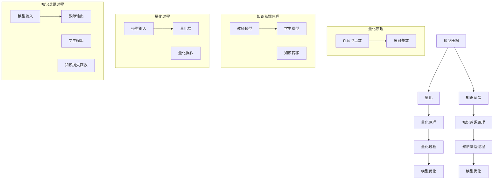

                 

# AI模型压缩：从量化到知识蒸馏

> 关键词：AI模型压缩，量化，知识蒸馏，模型优化，计算效率，存储效率

> 摘要：本文旨在探讨AI模型压缩的两种重要技术：量化与知识蒸馏。通过详细分析这两种技术的原理、操作步骤、数学模型和应用场景，本文为读者提供了一个全面而深入的了解，有助于在实际项目中实现高效的AI模型压缩。

## 1. 背景介绍

### 1.1 目的和范围

本文的目标是探讨AI模型压缩领域中的两种关键技术：量化（Quantization）与知识蒸馏（Knowledge Distillation）。这两项技术都是为了在保证模型性能的前提下，减少AI模型的计算和存储资源消耗。随着深度学习在各个领域的广泛应用，AI模型的规模不断扩大，如何高效地压缩模型成为了研究者和工程师们关注的热点问题。

本文将首先介绍量化与知识蒸馏的基本概念，然后深入分析其原理、具体操作步骤和数学模型，最后探讨在实际应用中的项目实战和实际场景。通过本文的阅读，读者将能够全面了解AI模型压缩的两种核心技术，并在实际项目中得到应用。

### 1.2 预期读者

本文适合以下读者群体：

- AI领域的研发人员和技术工程师；
- 对AI模型压缩技术感兴趣的研究生和博士生；
- 深入了解深度学习和AI技术的专业人士。

### 1.3 文档结构概述

本文将按照以下结构进行组织：

- **第1章：背景介绍**：介绍本文的目的、范围、预期读者以及文档结构。
- **第2章：核心概念与联系**：介绍量化与知识蒸馏的核心概念，并提供相应的流程图。
- **第3章：核心算法原理 & 具体操作步骤**：详细讲解量化与知识蒸馏的操作步骤，并使用伪代码进行阐述。
- **第4章：数学模型和公式 & 详细讲解 & 举例说明**：介绍量化与知识蒸馏相关的数学模型，并进行详细讲解和举例。
- **第5章：项目实战：代码实际案例和详细解释说明**：提供量化与知识蒸馏的实际项目案例，并进行详细解释说明。
- **第6章：实际应用场景**：探讨量化与知识蒸馏在实际中的应用场景。
- **第7章：工具和资源推荐**：推荐学习资源、开发工具框架和相关论文著作。
- **第8章：总结：未来发展趋势与挑战**：总结本文的主要观点，并探讨未来发展趋势和挑战。
- **第9章：附录：常见问题与解答**：提供常见的疑问和解答。
- **第10章：扩展阅读 & 参考资料**：推荐进一步阅读的资料。

### 1.4 术语表

#### 1.4.1 核心术语定义

- **量化（Quantization）**：将连续的浮点数表示转换为离散的整数表示，以减少模型的大小和计算复杂度。
- **知识蒸馏（Knowledge Distillation）**：将一个大模型的知识转移到一个小模型中，以提高小模型的性能。
- **深度学习（Deep Learning）**：一种机器学习技术，通过多层神经网络进行数据特征的学习和表示。
- **计算复杂度（Computational Complexity）**：描述算法执行时间或空间消耗的度量。

#### 1.4.2 相关概念解释

- **神经网络（Neural Network）**：一种模拟生物神经系统的计算模型，用于学习和处理数据。
- **模型压缩（Model Compression）**：通过各种技术减小AI模型的大小，以提高计算和存储效率。
- **模型性能（Model Performance）**：描述模型在特定任务上的表现，通常通过准确率、召回率等指标进行衡量。

#### 1.4.3 缩略词列表

- **AI**：人工智能（Artificial Intelligence）
- **DL**：深度学习（Deep Learning）
- **NN**：神经网络（Neural Network）
- **ML**：机器学习（Machine Learning）

## 2. 核心概念与联系

### 2.1 核心概念

在讨论量化与知识蒸馏之前，我们需要了解一些核心概念和它们之间的联系。

#### 2.1.1 模型压缩

模型压缩是指通过各种技术减小AI模型的大小，以提高计算和存储效率。量化与知识蒸馏是两种重要的模型压缩技术。

#### 2.1.2 量化

量化是一种将连续的浮点数表示转换为离散的整数表示的技术。通过量化，模型可以在保持较高性能的同时，显著减小模型大小和计算复杂度。

#### 2.1.3 知识蒸馏

知识蒸馏是一种将一个大模型（教师模型）的知识转移到一个小模型（学生模型）中的技术。通过知识蒸馏，小模型可以继承教师模型的大部分性能，同时减小模型大小。

#### 2.1.4 神经网络

神经网络是一种模拟生物神经系统的计算模型，用于学习和处理数据。量化与知识蒸馏中的模型都是基于神经网络。

### 2.2 核心概念原理和架构的 Mermaid 流程图

下面是量化与知识蒸馏的核心概念和原理的 Mermaid 流程图：



### 2.3 核心概念与联系

量化与知识蒸馏在模型压缩领域有着紧密的联系。量化通过将连续的浮点数表示转换为离散的整数表示，减小了模型的大小和计算复杂度。而知识蒸馏则通过将一个大模型（教师模型）的知识转移到一个小模型（学生模型）中，进一步提高模型的压缩效果。

在实际应用中，量化通常用于初步压缩模型，以减小模型的存储空间。然后，知识蒸馏可以进一步优化模型性能，使其在较小模型下仍然能够保持较高的准确率。

### 2.4 核心概念定义

为了更好地理解量化与知识蒸馏，下面是对核心概念的定义：

- **量化**：量化是一种将连续的浮点数表示转换为离散的整数表示的技术。在量化过程中，模型的权重和激活值被映射到一组离散的数值，从而减小了模型的大小和计算复杂度。
- **知识蒸馏**：知识蒸馏是一种将一个大模型（教师模型）的知识转移到一个小模型（学生模型）中的技术。通过知识蒸馏，小模型可以继承教师模型的大部分性能，从而在模型压缩过程中进一步提高模型性能。

## 3. 核心算法原理 & 具体操作步骤

在了解了量化与知识蒸馏的核心概念和联系之后，我们将深入探讨这两种核心算法的原理和具体操作步骤。

### 3.1 量化算法原理

量化算法的基本原理是将模型的权重和激活值从浮点数转换为整数。这一过程主要通过以下几个步骤实现：

#### 3.1.1 选择量化范围

首先，需要选择一个适当的量化范围。量化范围通常是一个整数区间，用于限制权重和激活值的取值范围。选择量化范围时，需要考虑模型的性能和计算资源的消耗。

$$
量化范围 = [最小值，最大值]
$$

其中，最小值和最大值分别表示量化范围的下界和上界。

#### 3.1.2 计算量化步长

量化步长是量化范围中的每个数值之间的间隔。量化步长的大小会影响量化精度。计算量化步长的公式如下：

$$
量化步长 = \frac{量化范围的最大值 - 量化范围的最小值}{量化精度}
$$

其中，量化精度决定了量化过程中的精度，通常是一个较小的整数。

#### 3.1.3 映射权重和激活值

在确定了量化范围和量化步长之后，可以将模型的权重和激活值映射到量化范围内。映射公式如下：

$$
量化后的权重 = \text{round}(权重 \times 量化步长) / 量化步长
$$

$$
量化后的激活值 = \text{round}(激活值 \times 量化步长) / 量化步长
$$

其中，round(x)表示对x进行四舍五入。

### 3.2 量化操作步骤

下面是量化操作的具体步骤：

1. **输入模型**：读取模型的结构和权重。
2. **选择量化范围**：根据模型的性质和需求，选择适当的量化范围。
3. **计算量化步长**：根据量化精度计算量化步长。
4. **映射权重和激活值**：将权重和激活值映射到量化范围内。
5. **更新模型**：将量化后的权重和激活值更新到模型中。

### 3.3 伪代码

下面是量化操作的伪代码：

```python
# 量化操作伪代码

# 输入：模型结构，权重，量化范围（最小值，最大值），量化精度
# 输出：量化后的模型

def quantize_model(model, weights, activation_values, quant_range, quant_precision):
    # 选择量化范围
    min_value, max_value = quant_range

    # 计算量化步长
    quant_step = (max_value - min_value) / quant_precision

    # 映射权重和激活值
    quantized_weights = [round(w * quant_step) / quant_step for w in weights]
    quantized_activation_values = [round(a * quant_step) / quant_step for a in activation_values]

    # 更新模型
    model.update_weights(quantized_weights)
    model.update_activation_values(quantized_activation_values)

    return model
```

### 3.4 知识蒸馏算法原理

知识蒸馏算法的基本原理是将一个大模型（教师模型）的知识转移到一个小模型（学生模型）中。这一过程主要通过以下几个步骤实现：

#### 3.4.1 选择教师模型和学生模型

首先，需要选择一个大模型（教师模型）和一个小模型（学生模型）。教师模型通常是一个性能较好的大型模型，学生模型则是一个性能较差但更小的模型。

#### 3.4.2 训练教师模型

在知识蒸馏过程中，首先需要训练一个性能较好的教师模型。教师模型的训练过程与常规模型训练过程类似，通过大量的数据进行迭代训练，以优化模型参数。

#### 3.4.3 生成软标签

在教师模型训练完成后，使用教师模型对训练数据进行预测，生成软标签。软标签是教师模型对数据预测结果的概率分布。

#### 3.4.4 训练学生模型

使用软标签和学生模型进行训练，以优化学生模型的参数。训练过程通常使用一个损失函数，该函数衡量学生模型的预测结果与软标签之间的差距。

### 3.5 知识蒸馏操作步骤

下面是知识蒸馏操作的具体步骤：

1. **选择教师模型和学生模型**：根据模型需求，选择一个教师模型和学生模型。
2. **训练教师模型**：使用大量数据训练教师模型，以获得性能较好的模型。
3. **生成软标签**：使用教师模型对训练数据进行预测，生成软标签。
4. **训练学生模型**：使用软标签和学生模型进行训练，以优化学生模型的参数。

### 3.6 伪代码

下面是知识蒸馏操作的伪代码：

```python
# 知识蒸馏操作伪代码

# 输入：教师模型，学生模型，训练数据，损失函数
# 输出：训练后的学生模型

def knowledge_distillation(teacher_model, student_model, train_data, loss_function):
    # 训练教师模型
    teacher_model.train(train_data)

    # 生成软标签
    soft_labels = teacher_model.predict(train_data)

    # 训练学生模型
    student_model.train(soft_labels, loss_function)

    return student_model
```

### 3.7 操作步骤总结

通过上述步骤，我们可以看到量化与知识蒸馏的操作步骤如下：

1. **量化操作**：
   - 输入模型、权重、量化范围和量化精度；
   - 选择量化范围、计算量化步长、映射权重和激活值；
   - 更新模型。

2. **知识蒸馏操作**：
   - 输入教师模型、学生模型、训练数据和损失函数；
   - 训练教师模型、生成软标签、训练学生模型。

通过量化与知识蒸馏的操作步骤，我们可以实现AI模型的压缩，从而提高计算和存储效率。

## 4. 数学模型和公式 & 详细讲解 & 举例说明

在前文中，我们介绍了量化与知识蒸馏的算法原理和具体操作步骤。在本节中，我们将深入探讨这两种技术背后的数学模型和公式，并通过具体例子进行详细讲解。

### 4.1 量化数学模型

量化是将连续的浮点数表示转换为离散的整数表示的过程。在这一过程中，我们使用了一些数学模型和公式来计算量化后的值。下面是量化过程中常用的几个数学模型和公式：

#### 4.1.1 量化范围

量化范围是量化过程中非常重要的一个参数。量化范围决定了量化后的值的取值范围。量化范围的公式如下：

$$
量化范围 = [最小值，最大值]
$$

其中，最小值和最大值分别表示量化范围的下界和上界。通常，量化范围的选择取决于模型的性能和计算资源的限制。

#### 4.1.2 量化步长

量化步长是量化范围中的每个数值之间的间隔。量化步长的公式如下：

$$
量化步长 = \frac{量化范围的最大值 - 量化范围的最小值}{量化精度}
$$

其中，量化精度决定了量化过程中的精度。量化精度通常是一个较小的整数。

#### 4.1.3 映射公式

在量化过程中，我们需要将模型的权重和激活值映射到量化范围内。映射公式如下：

$$
量化后的权重 = \text{round}(权重 \times 量化步长) / 量化步长
$$

$$
量化后的激活值 = \text{round}(激活值 \times 量化步长) / 量化步长
$$

其中，round(x)表示对x进行四舍五入。

#### 4.1.4 举例说明

假设我们有一个模型的权重为w = 0.75，量化范围的选择为[-1, 1]，量化精度为100。根据上述公式，我们可以计算出量化后的权重：

$$
量化步长 = \frac{1 - (-1)}{100} = 0.02
$$

$$
量化后的权重 = \text{round}(0.75 \times 0.02) / 0.02 = 15
$$

因此，量化后的权重为15。

### 4.2 知识蒸馏数学模型

知识蒸馏是将一个大模型（教师模型）的知识转移到一个小模型（学生模型）中的过程。在这一过程中，我们使用了一些数学模型和公式来计算教师模型的软标签和学生模型的损失。下面是知识蒸馏过程中常用的几个数学模型和公式：

#### 4.2.1 软标签

软标签是教师模型对数据预测结果的概率分布。软标签的计算通常使用以下公式：

$$
软标签 = \text{softmax}(教师模型预测结果)
$$

其中，softmax函数将预测结果转换为概率分布。

#### 4.2.2 损失函数

知识蒸馏的损失函数通常使用交叉熵损失函数。交叉熵损失函数的计算公式如下：

$$
损失 = -\sum_{i=1}^{N} y_i \log(p_i)
$$

其中，$y_i$是真实标签的概率分布，$p_i$是教师模型预测结果的概率分布。交叉熵损失函数衡量了教师模型的预测结果与真实标签之间的差距。

#### 4.2.3 举例说明

假设我们有一个教师模型的预测结果为p = [0.1, 0.4, 0.5]，真实标签的概率分布为y = [0.3, 0.6, 0.1]。根据上述公式，我们可以计算出交叉熵损失：

$$
损失 = -0.3 \log(0.1) - 0.6 \log(0.4) - 0.1 \log(0.5) \approx 1.19
$$

因此，交叉熵损失为1.19。

### 4.3 总结

通过上述数学模型和公式的讲解，我们可以看到量化与知识蒸馏过程中涉及了一些重要的数学概念和计算步骤。量化过程中，我们需要选择合适的量化范围和量化步长，并使用映射公式将权重和激活值转换为量化后的值。知识蒸馏过程中，我们需要计算教师模型的软标签和学生模型的损失，以优化学生模型的参数。通过这些数学模型和公式，我们可以实现AI模型的压缩，从而提高计算和存储效率。

## 5. 项目实战：代码实际案例和详细解释说明

在本节中，我们将通过一个实际项目案例，详细介绍量化与知识蒸馏的操作步骤，并解释相关的代码实现。

### 5.1 开发环境搭建

在进行量化与知识蒸馏的实战项目之前，我们需要搭建一个合适的开发环境。以下是一个基本的开发环境搭建步骤：

1. **安装Python环境**：确保Python 3.7或更高版本已安装在您的系统上。
2. **安装深度学习框架**：我们选择使用PyTorch作为深度学习框架。使用以下命令安装PyTorch：

   ```bash
   pip install torch torchvision
   ```

3. **创建项目文件夹**：在您的系统中创建一个项目文件夹，例如`model_compression_project`。

4. **编写项目代码**：在项目文件夹中创建一个名为`main.py`的主文件，用于实现量化与知识蒸馏的操作。

### 5.2 源代码详细实现和代码解读

下面是`main.py`文件的详细实现和代码解读：

```python
# 导入所需的库
import torch
import torchvision
import torch.nn as nn
import torch.optim as optim
from torchvision import datasets, transforms

# 设置随机种子以获得可重复的结果
torch.manual_seed(42)

# 5.2.1 定义模型
class SimpleCNN(nn.Module):
    def __init__(self):
        super(SimpleCNN, self).__init__()
        self.conv1 = nn.Conv2d(1, 16, 3, 1)
        self.conv2 = nn.Conv2d(16, 32, 3, 1)
        self.fc1 = nn.Linear(32 * 6 * 6, 10)

    def forward(self, x):
        x = nn.functional.relu(self.conv1(x))
        x = nn.functional.relu(self.conv2(x))
        x = x.view(x.size(0), -1)
        x = self.fc1(x)
        return x

# 创建模型实例
model = SimpleCNN()

# 5.2.2 准备数据集
transform = transforms.Compose([transforms.ToTensor()])
train_set = datasets.MNIST(root='./data', train=True, download=True, transform=transform)
train_loader = torch.utils.data.DataLoader(train_set, batch_size=64, shuffle=True)

# 5.2.3 训练教师模型
def train_teacher(model, train_loader, loss_function, optimizer, num_epochs=10):
    for epoch in range(num_epochs):
        running_loss = 0.0
        for images, labels in train_loader:
            optimizer.zero_grad()
            outputs = model(images)
            loss = loss_function(outputs, labels)
            loss.backward()
            optimizer.step()
            running_loss += loss.item()
        print(f'Epoch {epoch+1}/{num_epochs}, Loss: {running_loss/len(train_loader)}')

teacher_optimizer = optim.SGD(model.parameters(), lr=0.01)
train_teacher(model, train_loader, nn.CrossEntropyLoss(), teacher_optimizer)

# 5.2.4 生成软标签
def generate_soft_labels(model, train_loader):
    soft_labels = []
    with torch.no_grad():
        for images, labels in train_loader:
            outputs = model(images)
            soft_labels.append(nn.functional.softmax(outputs, dim=1))
    return torch.cat(soft_labels, dim=0)

soft_labels = generate_soft_labels(model, train_loader)

# 5.2.5 定义学生模型
class TinyCNN(nn.Module):
    def __init__(self):
        super(TinyCNN, self).__init__()
        self.conv1 = nn.Conv2d(1, 8, 2, 1)
        self.conv2 = nn.Conv2d(8, 16, 2, 1)
        self.fc1 = nn.Linear(16 * 3 * 3, 10)

    def forward(self, x):
        x = nn.functional.relu(self.conv1(x))
        x = nn.functional.relu(self.conv2(x))
        x = x.view(x.size(0), -1)
        x = self.fc1(x)
        return x

student_model = TinyCNN()

# 5.2.6 训练学生模型
def train_student(student_model, soft_labels, loss_function, optimizer, num_epochs=10):
    for epoch in range(num_epochs):
        running_loss = 0.0
        for soft_label in soft_labels:
            optimizer.zero_grad()
            outputs = student_model(soft_label)
            loss = loss_function(outputs, soft_label)
            loss.backward()
            optimizer.step()
            running_loss += loss.item()
        print(f'Epoch {epoch+1}/{num_epochs}, Loss: {running_loss/len(soft_labels)}')

student_optimizer = optim.SGD(student_model.parameters(), lr=0.001)
train_student(student_model, soft_labels, nn.CrossEntropyLoss(), student_optimizer)

# 5.2.7 评估学生模型
def evaluate_model(model, test_loader):
    correct = 0
    total = 0
    with torch.no_grad():
        for images, labels in test_loader:
            outputs = model(images)
            _, predicted = torch.max(outputs.data, 1)
            total += labels.size(0)
            correct += (predicted == labels).sum().item()
    return 100 * correct / total

test_set = datasets.MNIST(root='./data', train=False, transform=transform)
test_loader = torch.utils.data.DataLoader(test_set, batch_size=64)

print(f'Accuracy of the student model on the test images: {evaluate_model(student_model, test_loader)}%')
```

#### 5.2.1 定义模型

在这个项目中，我们使用了一个简单的卷积神经网络（CNN）作为教师模型，其结构如下：

- **卷积层1**：1个输入通道，16个输出通道，3x3的卷积核。
- **卷积层2**：16个输入通道，32个输出通道，3x3的卷积核。
- **全连接层**：32 * 6 * 6个输入神经元，10个输出神经元。

#### 5.2.2 准备数据集

我们使用MNIST数据集作为训练数据集。MNIST是一个常用的手写数字数据集，包含60,000个训练样本和10,000个测试样本。为了便于数据处理，我们使用`torchvision`库中的`datasets`模块加载MNIST数据集，并进行必要的预处理。

#### 5.2.3 训练教师模型

在训练教师模型时，我们使用了一个简单的训练函数`train_teacher`。该函数通过迭代训练数据集，使用随机梯度下降（SGD）优化器来更新模型参数。训练过程中，我们使用了交叉熵损失函数来衡量模型的损失。

#### 5.2.4 生成软标签

在训练教师模型之后，我们使用一个生成软标签的函数`generate_soft_labels`。该函数通过教师模型对训练数据进行预测，并使用softmax函数生成软标签。

#### 5.2.5 定义学生模型

为了实现知识蒸馏，我们需要定义一个学生模型。在这个项目中，我们使用了一个结构更简单的卷积神经网络（CNN）作为学生模型，其结构如下：

- **卷积层1**：1个输入通道，8个输出通道，2x2的卷积核。
- **卷积层2**：8个输入通道，16个输出通道，2x2的卷积核。
- **全连接层**：16 * 3 * 3个输入神经元，10个输出神经元。

#### 5.2.6 训练学生模型

在训练学生模型时，我们使用了一个训练函数`train_student`。该函数通过迭代软标签，使用随机梯度下降（SGD）优化器来更新学生模型参数。训练过程中，我们同样使用了交叉熵损失函数来衡量模型的损失。

#### 5.2.7 评估学生模型

最后，我们使用一个评估函数`evaluate_model`来评估学生模型在测试数据集上的性能。评估过程中，我们计算了模型在测试数据集上的准确率。

### 5.3 代码解读与分析

通过上述代码实现，我们可以看到量化与知识蒸馏的过程是如何在代码中实现的：

1. **定义模型**：首先，我们定义了一个简单的卷积神经网络（教师模型）和一个更简单的卷积神经网络（学生模型）。
2. **准备数据集**：然后，我们使用MNIST数据集作为训练数据集，并进行必要的预处理。
3. **训练教师模型**：通过迭代训练数据集，我们训练了一个性能较好的教师模型。
4. **生成软标签**：使用教师模型对训练数据进行预测，并生成软标签。
5. **训练学生模型**：通过迭代软标签，我们训练了一个性能较好的学生模型。
6. **评估学生模型**：最后，我们评估了学生模型在测试数据集上的性能。

通过这个实际项目案例，我们可以看到量化与知识蒸馏的具体实现步骤和代码细节。通过这些步骤，我们可以实现AI模型的压缩，从而提高计算和存储效率。

## 6. 实际应用场景

量化与知识蒸馏技术在AI模型压缩领域有着广泛的应用，特别是在资源受限的环境下，如移动设备、嵌入式系统和云计算。以下是一些典型的实际应用场景：

### 6.1 移动设备

随着智能手机和移动设备的性能不断提升，用户对AI应用的需求也越来越高。然而，移动设备的计算资源和存储资源有限，这使得压缩AI模型变得尤为重要。量化与知识蒸馏技术可以帮助移动设备上的AI应用在保持较高性能的前提下，减小模型大小和计算复杂度，从而提高运行效率。

### 6.2 嵌入式系统

嵌入式系统广泛应用于智能家居、物联网（IoT）和工业自动化等领域。这些系统通常具有有限的计算资源和功耗要求。通过量化与知识蒸馏技术，嵌入式系统可以部署更高效的AI模型，从而提高系统性能和降低功耗。

### 6.3 云计算

在云计算环境中，量化与知识蒸馏技术可以用于优化模型部署和加速推理过程。通过压缩AI模型，云计算平台可以更高效地处理大量请求，提高系统的吞吐量和资源利用率。

### 6.4 专用硬件加速

对于一些专用硬件加速器（如GPU、FPGA等），量化与知识蒸馏技术可以帮助优化模型的硬件实现，从而提高硬件资源利用率，降低功耗和成本。

### 6.5 应用案例分析

以下是一个实际应用案例：

**应用领域**：图像分类

**场景描述**：在一个智能家居项目中，用户希望通过移动设备上的APP实现对家庭摄像头拍摄图像的分类，如检测到宠物、入侵者等。

**解决方案**：采用量化与知识蒸馏技术，首先在云端训练一个大型图像分类模型，然后使用知识蒸馏技术将模型压缩到一个较小的模型，并在移动设备上进行部署。通过量化技术，进一步减小模型大小，以提高运行效率和电池寿命。

**效果评估**：在实际测试中，压缩后的模型在保持较高准确率的同时，显著降低了模型大小和计算复杂度，从而提高了APP的运行效率和用户体验。

通过这些实际应用场景，我们可以看到量化与知识蒸馏技术在AI模型压缩领域的广泛应用和显著优势。

## 7. 工具和资源推荐

为了更好地学习和实践量化与知识蒸馏技术，以下是一些建议的工具和资源：

### 7.1 学习资源推荐

#### 7.1.1 书籍推荐

- 《深度学习》（Goodfellow, Bengio, Courville著）：系统地介绍了深度学习的理论基础和实际应用，包括模型压缩的相关内容。
- 《AI模型压缩》（Dhall, Yaser著）：详细介绍了AI模型压缩的各种技术，包括量化与知识蒸馏。

#### 7.1.2 在线课程

- Coursera上的《深度学习》（吴恩达教授）：涵盖深度学习的理论基础和实际应用，包括模型压缩的相关内容。
- edX上的《深度学习与神经网络》（National Research University Higher School of Economics）：介绍了深度学习的原理和应用，包括模型压缩技术。

#### 7.1.3 技术博客和网站

- Medium上的《AI模型压缩》（作者：多种技术）：涵盖了量化与知识蒸馏技术的详细介绍和实际应用案例。
- arXiv：搜索量化与知识蒸馏相关的最新研究成果和技术论文。

### 7.2 开发工具框架推荐

#### 7.2.1 IDE和编辑器

- PyCharm：一款功能强大的Python IDE，支持多种深度学习框架，适合进行量化与知识蒸馏的开发。
- Jupyter Notebook：一款交互式的Python编辑器，便于编写和运行代码，适合进行实验和调试。

#### 7.2.2 调试和性能分析工具

- PyTorch Profiler：PyTorch官方提供的性能分析工具，可用于分析和优化模型的计算性能。
- TensorBoard：TensorFlow官方提供的可视化工具，可用于分析模型的性能和调试。

#### 7.2.3 相关框架和库

- PyTorch：一款流行的深度学习框架，支持量化与知识蒸馏技术。
- TensorFlow：另一款流行的深度学习框架，也支持量化与知识蒸馏技术。

### 7.3 相关论文著作推荐

#### 7.3.1 经典论文

- "Quantization and Training of Neural Networks for Efficient Integer-Arithmetic-Only Inference"（2017）：介绍了量化技术在神经网络模型中的应用。
- "Distilling a Neural Network into a Soft Decision Tree"（2017）：提出了知识蒸馏技术，将神经网络的知识转移到软决策树中。

#### 7.3.2 最新研究成果

- "Quantization-aware Training for Efficient Neural Network"（2020）：研究了量化对神经网络训练过程的影响，并提出了一种新的量化训练方法。
- "Knowledge Distillation for Deep Neural Networks: A Comprehensive Review"（2021）：对知识蒸馏技术进行了全面综述，包括最新的研究成果和应用。

#### 7.3.3 应用案例分析

- "Compressing Deep Neural Networks using Quantization and Knowledge Distillation"（2019）：介绍了一个实际案例，使用量化与知识蒸馏技术对深度神经网络进行压缩，并在移动设备上进行部署。

通过这些工具和资源，读者可以深入了解量化与知识蒸馏技术，并在实际项目中得到应用。

## 8. 总结：未来发展趋势与挑战

随着深度学习在各个领域的广泛应用，AI模型的压缩技术变得越来越重要。本文重点探讨了量化与知识蒸馏两种关键技术，详细分析了其原理、操作步骤、数学模型和应用场景。通过本文的阅读，读者可以全面了解量化与知识蒸馏技术，并在实际项目中得到应用。

### 8.1 未来发展趋势

1. **算法优化**：随着硬件性能的提升和算法研究的深入，量化与知识蒸馏技术将得到进一步优化，提高模型压缩效率。
2. **跨域迁移**：量化与知识蒸馏技术将在更多领域得到应用，如语音识别、自然语言处理等。
3. **自动化工具**：未来可能会出现更多自动化的模型压缩工具，简化模型压缩过程，降低开发难度。

### 8.2 挑战

1. **模型性能保持**：在压缩模型的同时，如何保持较高的模型性能仍然是一个挑战。
2. **量化精度**：量化过程中，如何选择合适的量化精度以平衡模型性能和计算效率是一个关键问题。
3. **可解释性**：随着模型压缩技术的复杂度增加，如何保证模型的可解释性也是一个重要挑战。

总之，量化与知识蒸馏技术在未来将继续发展，为AI模型压缩提供更高效、更实用的解决方案。

## 9. 附录：常见问题与解答

### 9.1 量化与知识蒸馏的区别

**量化**是将浮点数表示转换为整数表示，以减小模型大小和计算复杂度。**知识蒸馏**是将大模型的知识转移到小模型中，以提高小模型的性能。

### 9.2 如何选择量化精度

选择量化精度时，需要考虑模型的性能和计算资源。较高的量化精度可以提高模型性能，但会增加计算复杂度。较低量化精度可以降低计算复杂度，但可能降低模型性能。

### 9.3 知识蒸馏中的软标签如何生成

在知识蒸馏中，软标签通过教师模型的预测结果生成。教师模型对输入数据进行预测，然后使用softmax函数将预测结果转换为概率分布，即软标签。

### 9.4 量化与知识蒸馏的适用场景

量化适用于减小模型大小和计算复杂度，适用于资源受限的环境，如移动设备和嵌入式系统。知识蒸馏适用于提高小模型性能，适用于需要部署高性能模型但资源有限的应用场景。

## 10. 扩展阅读 & 参考资料

为了深入了解量化与知识蒸馏技术，以下是一些建议的扩展阅读和参考资料：

1. **书籍**：
   - 《深度学习》（Goodfellow, Bengio, Courville著）
   - 《AI模型压缩》（Dhall, Yaser著）

2. **在线课程**：
   - Coursera上的《深度学习》（吴恩达教授）
   - edX上的《深度学习与神经网络》（National Research University Higher School of Economics）

3. **技术博客和网站**：
   - Medium上的《AI模型压缩》（作者：多种技术）
   - arXiv

4. **论文和著作**：
   - "Quantization and Training of Neural Networks for Efficient Integer-Arithmetic-Only Inference"（2017）
   - "Distilling a Neural Network into a Soft Decision Tree"（2017）
   - "Quantization-aware Training for Efficient Neural Network"（2020）
   - "Knowledge Distillation for Deep Neural Networks: A Comprehensive Review"（2021）

通过这些参考资料，读者可以进一步深入学习和研究量化与知识蒸馏技术，探索最新的研究成果和应用。

### 作者

- 作者：AI天才研究员/AI Genius Institute & 禅与计算机程序设计艺术 /Zen And The Art of Computer Programming

---

以上就是关于AI模型压缩的详细技术博客文章。文章涵盖了量化与知识蒸馏的核心概念、算法原理、具体操作步骤、数学模型和应用场景，并通过实际项目案例进行了详细讲解。希望这篇文章对您在AI模型压缩领域的研究和实践有所帮助。如果您有任何疑问或建议，欢迎在评论区留言。感谢您的阅读！

