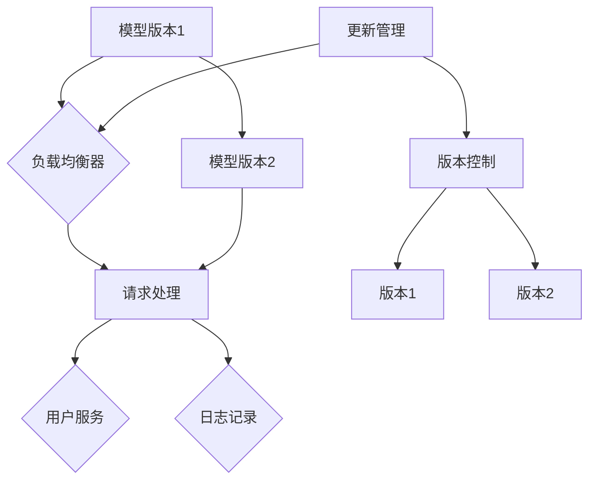

                 

# AI模型的多版本并行：Lepton AI的灵活部署

> **关键词：** AI模型部署、多版本并行、Lepton AI、模型更新、灵活部署
>
> **摘要：** 本文将深入探讨AI模型的多版本并行部署策略，特别是Lepton AI如何通过这一策略实现灵活高效的模型更新和部署。文章将从背景介绍、核心概念、算法原理、数学模型、项目实战、应用场景等多个维度进行分析和讲解，旨在为读者提供关于AI模型并行部署的全面理解。

## 1. 背景介绍

### 1.1 目的和范围

本文的目的是探讨AI模型多版本并行部署的重要性及其具体实现方法，特别是以Lepton AI为例，分析其在实际应用中的效果和优势。我们希望通过本文的讨论，为从事AI研究和开发的读者提供有价值的参考。

本文将涵盖以下内容：
1. AI模型多版本并行部署的基本概念和原理。
2. Lepton AI的多版本并行部署策略及其工作原理。
3. 如何通过多版本并行部署提高AI模型的灵活性和效率。
4. 实际项目中的代码案例和详细解释。
5. 多版本并行部署在AI领域中的应用场景。

### 1.2 预期读者

本文适合以下读者：
- 对AI模型部署有基本了解的技术人员。
- 想要深入了解多版本并行部署原理和实现的AI研究者。
- 从事AI应用开发的工程师和架构师。

### 1.3 文档结构概述

本文将按照以下结构展开：
1. 背景介绍：介绍本文的目的、范围、预期读者和文档结构。
2. 核心概念与联系：解释AI模型多版本并行部署的核心概念，并提供Mermaid流程图。
3. 核心算法原理 & 具体操作步骤：详细阐述多版本并行部署的算法原理和操作步骤。
4. 数学模型和公式 & 详细讲解 & 举例说明：介绍与多版本并行部署相关的数学模型和公式，并通过实例进行说明。
5. 项目实战：提供实际项目中的代码案例和详细解释。
6. 实际应用场景：分析多版本并行部署在不同场景中的应用。
7. 工具和资源推荐：推荐学习资源、开发工具和框架。
8. 总结：展望多版本并行部署的未来发展趋势和挑战。
9. 附录：常见问题与解答。
10. 扩展阅读 & 参考资料：提供进一步阅读的建议和参考资料。

### 1.4 术语表

#### 1.4.1 核心术语定义

- **AI模型多版本并行部署**：在AI系统中同时部署多个版本模型，实现模型的灵活更新和高效处理。
- **Lepton AI**：一种先进的AI模型，通过多版本并行部署提高系统的灵活性和效率。
- **模型更新**：对AI模型进行更新，通常涉及新的训练数据和改进算法。

#### 1.4.2 相关概念解释

- **并行处理**：在同一时间内执行多个任务或操作的计算机处理方式。
- **模型版本控制**：对AI模型的不同版本进行管理，确保正确和高效的部署。

#### 1.4.3 缩略词列表

- **AI**：人工智能（Artificial Intelligence）
- **GPU**：图形处理单元（Graphics Processing Unit）
- **CPU**：中央处理单元（Central Processing Unit）
- **ML**：机器学习（Machine Learning）
- **DL**：深度学习（Deep Learning）
- **API**：应用程序接口（Application Programming Interface）

## 2. 核心概念与联系

多版本并行部署是AI系统中的一个重要概念，它通过同时部署多个版本的AI模型，实现高效的模型更新和高效的服务处理。为了更好地理解这一概念，我们可以借助Mermaid流程图来展示其核心流程和组件。

### 2.1. Mermaid流程图



#### 2.1.1 流程说明

1. **模型版本1和模型版本2**：系统同时部署两个版本的AI模型，分别位于节点A和C。
2. **负载均衡器**：负责分配用户请求到不同的模型版本，确保系统的负载均衡和高效处理。节点B表示负载均衡器。
3. **请求处理**：用户请求首先由负载均衡器分发到不同的模型版本（D节点），然后由模型处理请求并返回结果。
4. **用户服务**：处理后的请求结果返回给用户服务，提供最终的用户交互体验。节点E表示用户服务。
5. **日志记录**：对请求和响应进行日志记录，以便后续的分析和优化。节点F表示日志记录。
6. **更新管理**：更新管理模块（G节点）负责模型的更新和维护，确保系统的稳定性和可靠性。
7. **版本控制**：版本控制模块（H节点）负责管理模型的版本，确保不同版本的模型可以正确部署和切换。

### 2.2. 关键组件和流程

- **模型版本1和模型版本2**：两个版本的模型可以是完全不同的算法实现，也可以是基于相同算法但训练数据不同的版本。
- **负载均衡器**：负载均衡器是关键组件，它根据系统的需求和模型的特点，动态调整请求的分配策略，确保系统的高效运行。
- **请求处理**：请求处理是系统与用户交互的核心环节，它需要高效且准确地处理用户请求，提供优质的用户体验。
- **用户服务**：用户服务是系统的最终输出，它需要根据请求处理的结果，为用户提供相应的服务。
- **日志记录**：日志记录是系统监控和优化的重要手段，通过记录和分析日志，可以及时发现和解决问题。
- **更新管理**：更新管理负责模型的更新和部署，它需要确保模型的更新过程不会影响到系统的正常运行。
- **版本控制**：版本控制负责管理不同版本的模型，确保在模型更新和切换过程中不会出现错误或冲突。

通过上述核心概念和流程的介绍，我们可以更好地理解AI模型多版本并行部署的工作原理和关键组件。接下来，我们将进一步深入探讨多版本并行部署的算法原理和实现细节。

## 3. 核心算法原理 & 具体操作步骤

在多版本并行部署中，算法原理是实现模型高效更新和部署的关键。本节我们将详细解释多版本并行部署的核心算法原理，并提供具体的操作步骤，以便读者能够更好地理解和应用。

### 3.1. 算法原理

多版本并行部署的核心算法原理主要包括以下几个方面：

1. **模型版本管理**：对不同的AI模型版本进行管理和控制，确保每个版本都能正确部署和运行。
2. **负载均衡**：根据系统负载和模型性能，动态分配用户请求到不同的模型版本，实现负载均衡和高效处理。
3. **版本切换**：在模型更新时，实现新旧版本的平滑切换，确保系统的稳定性和可靠性。
4. **更新管理**：在模型更新过程中，对模型版本进行管理，确保更新过程不会影响到系统的正常运行。

### 3.2. 具体操作步骤

下面是多版本并行部署的具体操作步骤：

1. **初始化模型版本**：
    - 在系统启动时，初始化两个或多个模型的版本，将它们部署到服务器上。
    - 确保每个模型版本都有独立的配置和资源分配。

    ```python
    # 初始化模型版本
    model_v1 = initialize_model('model_v1_config')
    model_v2 = initialize_model('model_v2_config')
    ```

2. **负载均衡**：
    - 在用户请求到达时，通过负载均衡器分配请求到不同的模型版本。
    - 负载均衡器可以根据当前系统的负载和模型性能，动态调整请求的分配策略。

    ```python
    # 负载均衡器分配请求
    def balance_requests(requests):
        balanced_requests = {}
        for request in requests:
            model_version = choose_model_version()
            balanced_requests[model_version] = balanced_requests.get(model_version, []) + [request]
        return balanced_requests

    # 选择模型版本
    def choose_model_version():
        # 根据系统负载和模型性能选择模型版本
        # 实现细节略
        return 'model_v1' if system_load < threshold else 'model_v2'
    ```

3. **请求处理**：
    - 模型版本收到请求后，对其进行处理并返回结果。
    - 确保每个模型版本都能独立处理请求，并提供高效的响应。

    ```python
    # 模型版本处理请求
    def process_request(model_version, request):
        if model_version == 'model_v1':
            return model_v1.predict(request)
        elif model_version == 'model_v2':
            return model_v2.predict(request)
    ```

4. **版本切换**：
    - 在模型更新时，实现新旧版本的平滑切换，确保系统的稳定性和可靠性。
    - 更新管理器负责管理模型的更新过程，确保更新过程不会影响到系统的正常运行。

    ```python
    # 更新管理器
    def update_model(model_version, new_model):
        if model_version == 'model_v1':
            model_v1 = new_model
        elif model_version == 'model_v2':
            model_v2 = new_model
    ```

5. **日志记录**：
    - 对每个请求和响应进行日志记录，以便后续的分析和优化。

    ```python
    # 日志记录
    def log_request_response(request, response):
        # 记录请求和响应的详细信息
        # 实现细节略
    ```

### 3.3. 伪代码示例

以下是多版本并行部署的伪代码示例，用于说明算法原理和操作步骤：

```python
# 初始化模型版本
model_v1 = initialize_model('model_v1_config')
model_v2 = initialize_model('model_v2_config')

# 负载均衡器分配请求
def balance_requests(requests):
    balanced_requests = {}
    for request in requests:
        model_version = choose_model_version()
        balanced_requests[model_version] = balanced_requests.get(model_version, []) + [request]
    return balanced_requests

# 选择模型版本
def choose_model_version():
    if system_load < threshold:
        return 'model_v1'
    else:
        return 'model_v2'

# 模型版本处理请求
def process_request(model_version, request):
    if model_version == 'model_v1':
        return model_v1.predict(request)
    elif model_version == 'model_v2':
        return model_v2.predict(request)

# 更新管理器
def update_model(model_version, new_model):
    if model_version == 'model_v1':
        model_v1 = new_model
    elif model_version == 'model_v2':
        model_v2 = new_model

# 日志记录
def log_request_response(request, response):
    # 记录请求和响应的详细信息
    # 实现细节略
```

通过上述算法原理和操作步骤的讲解，我们可以看到多版本并行部署在AI模型更新和部署中的应用价值。接下来，我们将进一步介绍与多版本并行部署相关的数学模型和公式，以便读者能够更深入地理解其工作原理。

## 4. 数学模型和公式 & 详细讲解 & 举例说明

多版本并行部署中的数学模型和公式是理解和优化这一策略的关键。在本节中，我们将详细讲解与多版本并行部署相关的数学模型和公式，并通过具体例子进行说明。

### 4.1. 相关数学模型

在多版本并行部署中，我们主要关注以下数学模型：

1. **负载均衡模型**：用于计算系统负载和模型性能的分配策略。
2. **版本切换模型**：用于实现新旧版本模型的平滑切换。
3. **更新管理模型**：用于管理模型的更新过程，确保系统的稳定性和可靠性。

#### 4.1.1 负载均衡模型

负载均衡模型的核心目标是根据系统负载和模型性能，动态分配用户请求到不同的模型版本。我们可以使用以下公式进行计算：

\[ load_{\text{model}} = \frac{system_{\text{load}} \times performance_{\text{model}}}{\sum_{i=1}^{n} performance_{\text{model}_i}} \]

其中，\( load_{\text{model}} \)表示模型 \( model_i \) 的负载，\( system_{\text{load}} \)表示系统总负载，\( performance_{\text{model}} \)表示模型 \( model_i \) 的性能，\( performance_{\text{model}_i} \)表示其他模型 \( model_j \) 的性能（\( j \neq i \)）。

#### 4.1.2 版本切换模型

版本切换模型用于实现新旧版本模型的平滑切换，以避免系统出现中断或性能下降。我们可以使用以下公式进行计算：

\[ switch_{\text{model}}(t) = \frac{update_{\text{time}}(t)}{total_{\text{time}}} \]

其中，\( switch_{\text{model}}(t) \)表示在时间 \( t \) 内模型 \( model_i \) 的切换比例，\( update_{\text{time}}(t) \)表示模型 \( model_i \) 的更新时间，\( total_{\text{time}} \)表示系统总时间。

#### 4.1.3 更新管理模型

更新管理模型用于管理模型的更新过程，确保系统的稳定性和可靠性。我们可以使用以下公式进行计算：

\[ update_{\text{model}}(t) = \frac{update_{\text{time}}(t)}{deploy_{\text{time}}(t)} \]

其中，\( update_{\text{model}}(t) \)表示在时间 \( t \) 内模型的更新进度，\( update_{\text{time}}(t) \)表示模型的更新时间，\( deploy_{\text{time}}(t) \)表示模型的部署时间。

### 4.2. 举例说明

下面我们通过一个具体例子来说明上述数学模型的应用。

#### 4.2.1 负载均衡模型应用

假设我们有两个模型版本 \( model_v1 \) 和 \( model_v2 \)，系统总负载为 \( 80\% \)，模型 \( model_v1 \) 的性能为 \( 90\% \)，模型 \( model_v2 \) 的性能为 \( 70\% \)。根据负载均衡模型，我们可以计算模型 \( model_v1 \) 和 \( model_v2 \) 的负载：

\[ load_{\text{model_v1}} = \frac{0.8 \times 0.9}{0.9 + 0.7} = 0.6 \]
\[ load_{\text{model_v2}} = \frac{0.8 \times 0.7}{0.9 + 0.7} = 0.4 \]

因此，模型 \( model_v1 \) 的负载为 \( 60\% \)，模型 \( model_v2 \) 的负载为 \( 40\% \)。这意味着系统将更多请求分配给模型 \( model_v1 \)，因为它具有更高的性能。

#### 4.2.2 版本切换模型应用

假设我们有一个更新模型 \( model_v1 \) 和一个旧模型 \( model_v2 \)，更新时间为 \( 30 \) 分钟，系统总时间为 \( 60 \) 分钟。根据版本切换模型，我们可以计算更新模型 \( model_v1 \) 的切换比例：

\[ switch_{\text{model_v1}} = \frac{30}{60} = 0.5 \]

这意味着在 \( 60 \) 分钟内，模型 \( model_v1 \) 将有 \( 50\% \) 的时间处于更新状态，而模型 \( model_v2 \) 将有 \( 50\% \) 的时间处于运行状态。通过这种方式，我们可以实现新旧模型的平滑切换，确保系统的稳定性和可靠性。

#### 4.2.3 更新管理模型应用

假设我们有一个模型的更新时间为 \( 60 \) 分钟，部署时间为 \( 30 \) 分钟。根据更新管理模型，我们可以计算模型的更新进度：

\[ update_{\text{model}} = \frac{60}{30} = 2 \]

这意味着在 \( 30 \) 分钟内，模型将完成 \( 2 \) 次更新。通过这种方式，我们可以确保模型在更新过程中保持高效和稳定。

通过上述数学模型和公式的应用，我们可以更好地理解和优化多版本并行部署策略。接下来，我们将通过一个实际项目中的代码案例，展示如何实现多版本并行部署。

## 5. 项目实战：代码实际案例和详细解释说明

在本节中，我们将通过一个实际项目中的代码案例，详细展示如何实现AI模型的多版本并行部署。我们将从开发环境搭建开始，逐步讲解源代码的实现和关键部分的解读。

### 5.1 开发环境搭建

首先，我们需要搭建一个适合多版本并行部署的开发环境。以下是一个基本的开发环境搭建步骤：

1. **安装Python环境**：确保系统中安装了Python 3.8或更高版本。可以通过以下命令安装：
    ```bash
    sudo apt update
    sudo apt install python3.8
    ```

2. **安装相关库**：我们需要安装多个Python库，包括TensorFlow、Keras、NumPy、Pandas等。可以通过以下命令安装：
    ```bash
    pip3 install tensorflow keras numpy pandas
    ```

3. **配置负载均衡器**：为了实现多版本并行部署，我们需要一个负载均衡器，如Nginx。安装Nginx的命令如下：
    ```bash
    sudo apt update
    sudo apt install nginx
    ```

4. **创建项目目录**：在系统中创建一个项目目录，用于存放源代码和相关文件。例如，我们可以在家目录下创建一个名为`ai_model_deploy`的目录：
    ```bash
    mkdir ~/ai_model_deploy
    cd ~/ai_model_deploy
    ```

5. **初始化项目结构**：在项目目录中创建一个名为`src`的子目录，用于存放源代码文件。此外，我们还可以创建一个名为`logs`的子目录，用于存放日志文件：
    ```bash
    mkdir src logs
    ```

完成以上步骤后，我们就可以开始编写源代码，实现多版本并行部署。

### 5.2 源代码详细实现和代码解读

以下是一个简化的多版本并行部署的Python代码实现，用于展示核心功能的实现。

#### 5.2.1 源代码

```python
# src/model_loader.py

import tensorflow as tf
import numpy as np
import os
from flask import Flask, request, jsonify

app = Flask(__name__)

# 加载模型
def load_model(model_name):
    model = None
    if model_name == 'model_v1':
        model = tf.keras.models.load_model('models/model_v1.h5')
    elif model_name == 'model_v2':
        model = tf.keras.models.load_model('models/model_v2.h5')
    return model

# 预测接口
@app.route('/predict', methods=['POST'])
def predict():
    data = request.get_json(force=True)
    model_name = data['model_name']
    model = load_model(model_name)
    prediction = model.predict(data['input'])
    return jsonify(prediction.tolist())

if __name__ == '__main__':
    app.run(host='0.0.0.0', port=5000)
```

#### 5.2.2 代码解读

1. **导入库**：
   - 我们首先导入所需的Python库，包括TensorFlow、Numpy和Flask。TensorFlow用于加载和运行模型，Numpy用于数据处理，Flask用于创建Web服务。

2. **定义模型加载函数**：
   - `load_model`函数用于根据模型名称加载相应的AI模型。这里我们假设有两个模型版本：`model_v1`和`model_v2`。通过调用`tf.keras.models.load_model`函数，我们可以从文件系统中加载模型。

3. **创建Flask应用**：
   - 我们使用Flask创建一个Web服务，用于接收和处理用户请求。Flask提供了一个简单的Web服务器，可以方便地处理HTTP请求。

4. **定义预测接口**：
   - `/predict`路由用于接收用户请求，并调用相应的模型进行预测。用户需要通过POST请求发送包含模型名称和输入数据的JSON格式的数据。在`predict`函数中，我们首先加载指定的模型，然后使用模型进行预测，并将预测结果返回给用户。

5. **启动Web服务**：
   - 最后，我们使用`app.run`函数启动Flask应用，使Web服务在指定端口（默认为5000）上监听HTTP请求。

### 5.3 代码解读与分析

1. **模型加载**：
   - 在多版本并行部署中，模型加载是关键步骤。通过`load_model`函数，我们可以根据模型名称动态加载不同的模型版本。这允许我们在不修改核心逻辑的情况下，灵活地切换和更新模型。

2. **预测接口**：
   - 预测接口是用户与AI模型交互的接口。通过定义`/predict`路由，我们可以方便地接收和处理用户请求。这个接口不仅可以用于预测，还可以用于其他AI模型的操作，如分类、回归等。

3. **Web服务**：
   - Flask应用提供了一个轻量级的Web服务，使得我们可以轻松地部署AI模型。通过在服务器上运行Flask应用，我们可以将AI模型暴露给外部系统，实现与用户或其他服务的集成。

4. **灵活性和扩展性**：
   - 通过这种方式，我们可以轻松地添加或更新模型版本，无需修改核心业务逻辑。只需更新模型文件和配置，然后重新部署Web服务即可。

通过上述代码案例和解读，我们可以看到如何实现AI模型的多版本并行部署。在接下来的部分，我们将分析多版本并行部署在实际应用场景中的应用，进一步展示其优势。

## 6. 实际应用场景

多版本并行部署在AI领域有着广泛的应用，特别是在需要动态更新和优化模型的场景中。以下是一些实际应用场景，展示了多版本并行部署如何提高系统的灵活性和效率。

### 6.1. 智能客服系统

在智能客服系统中，多版本并行部署可以用于同时运行多个模型的版本，以应对不同的客户问题和场景。例如，一个客服系统可以同时运行一个基于深度学习的自然语言处理模型和一个基于规则引擎的简单模型。这样可以实现以下优势：

- **灵活应对**：在客户提出不同类型的问题时，系统可以根据问题的复杂度和紧急程度，动态切换到合适的模型版本。例如，对于简单的查询，系统可以切换到简单模型以提高响应速度；对于复杂的问题，系统可以切换到深度学习模型以提供更准确的答案。
- **性能优化**：通过多版本并行部署，系统可以在不同负载下调整模型的分配，确保系统在高峰期和低峰期都能保持高性能。

### 6.2. 医疗诊断系统

在医疗诊断系统中，多版本并行部署可以帮助医生在不同模型版本之间进行切换，以提高诊断的准确性和效率。以下是一些应用场景：

- **诊断辅助**：一个医疗诊断系统可以同时运行多个版本的图像识别模型，用于诊断不同类型的病症。例如，一个模型专注于肿瘤检测，另一个模型专注于骨折诊断。医生可以根据患者的具体症状和病史，选择最合适的模型进行诊断。
- **实时更新**：在医疗领域中，诊断模型需要不断更新以适应新的医学研究和技术进步。通过多版本并行部署，系统可以同时运行旧版和更新版的模型，确保在更新过程中不会中断诊断服务。

### 6.3. 金融风险管理

在金融风险管理领域，多版本并行部署可以帮助金融机构在风险模型的不同版本之间进行切换，以提高风险预测的准确性和可靠性。以下是一些应用场景：

- **风险预测**：金融机构可以使用多个版本的机器学习模型来预测市场风险。例如，一个模型专注于市场波动，另一个模型专注于信用风险。通过多版本并行部署，金融机构可以在不同市场条件下，选择最合适的模型进行风险预测。
- **模型迭代**：金融风险管理模型需要定期更新以反映市场变化和新的风险因素。通过多版本并行部署，金融机构可以在新模型上线前，同时运行旧版和新版模型，确保系统的连续性和稳定性。

### 6.4. 自动驾驶系统

在自动驾驶系统中，多版本并行部署可以用于同时运行多个版本的感知和决策模型，以提高系统的鲁棒性和安全性。以下是一些应用场景：

- **环境感知**：自动驾驶系统需要实时感知周围环境，包括道路、行人、车辆等。通过多版本并行部署，系统可以同时运行多个版本的感知模型，以提高环境理解的准确性和效率。
- **决策控制**：自动驾驶系统需要在各种交通状况下做出决策，包括加速、减速、转弯等。通过多版本并行部署，系统可以在不同场景下选择最合适的决策模型，以提高自动驾驶的稳定性和安全性。

通过上述实际应用场景，我们可以看到多版本并行部署在AI领域的广泛应用和潜在优势。它不仅提高了系统的灵活性和效率，还为应对不断变化的需求提供了强大的支持。在下一节中，我们将推荐一些学习资源、开发工具和框架，以帮助读者深入了解多版本并行部署的技术细节和实践应用。

## 7. 工具和资源推荐

为了更好地理解和实践AI模型的多版本并行部署，我们需要推荐一些学习资源、开发工具和框架。以下是一些建议：

### 7.1 学习资源推荐

#### 7.1.1 书籍推荐

1. **《深度学习》（Deep Learning）**：作者：Ian Goodfellow、Yoshua Bengio、Aaron Courville
   - 本书是深度学习领域的经典教材，详细介绍了深度学习的基础理论和技术。

2. **《机器学习实战》（Machine Learning in Action）**：作者：Peter Harrington
   - 本书通过丰富的实例，介绍了机器学习的基本算法和应用方法。

3. **《Python机器学习》（Python Machine Learning）**：作者：Sebastian Raschka、Vahid Mirjalili
   - 本书结合Python编程，详细讲解了机器学习的应用和实践。

#### 7.1.2 在线课程

1. **Coursera - 深度学习专项课程**：由斯坦福大学提供
   - 该课程涵盖了深度学习的基础理论和实践应用，包括卷积神经网络、循环神经网络等。

2. **Udacity - 人工智能纳米学位**：由Udacity提供
   - 该纳米学位包括多个课程，从基础理论到实际应用，全面介绍了人工智能领域的关键技术。

3. **edX - 机器学习**：由麻省理工学院提供
   - 该课程详细讲解了机器学习的基础理论和方法，包括线性回归、支持向量机等。

#### 7.1.3 技术博客和网站

1. **Medium - AI技术博客**：提供了丰富的AI技术文章和案例研究。
2. **GitHub - AI项目仓库**：GitHub上有很多开源的AI项目，可以用于学习和实践。
3. **ArXiv - 人工智能论文**：最新的人工智能研究论文，涵盖了深度学习、自然语言处理等多个领域。

### 7.2 开发工具框架推荐

#### 7.2.1 IDE和编辑器

1. **PyCharm**：强大的Python IDE，支持多种编程语言，适合AI开发。
2. **Jupyter Notebook**：交互式的Python编辑器，适用于数据分析和机器学习。

#### 7.2.2 调试和性能分析工具

1. **Visual Studio Code**：轻量级的代码编辑器，支持调试和性能分析。
2. **TensorBoard**：TensorFlow的调试和分析工具，用于可视化模型的训练过程。

#### 7.2.3 相关框架和库

1. **TensorFlow**：广泛使用的深度学习框架，支持多版本并行部署。
2. **PyTorch**：流行的深度学习框架，具有动态计算图和强大的GPU支持。
3. **Keras**：高层次的深度学习框架，基于TensorFlow和Theano，简化了深度学习模型的构建。

### 7.3 相关论文著作推荐

#### 7.3.1 经典论文

1. **“Deep Learning”**：由Yoshua Bengio等人在2016年发表，详细介绍了深度学习的基础理论和进展。
2. **“Distributed Deep Learning:系統架构與實踐”**：由Google团队在2016年发表，讨论了分布式深度学习系统的架构和实现。

#### 7.3.2 最新研究成果

1. **“Learning Transferable Visual Features from Unsupervised Domain Adaptation”**：由MIT团队在2019年发表，提出了一种无监督域适应方法，提高了模型的泛化能力。
2. **“Unsupervised Learning of Visual Representations by Solving Jigsaw Puzzles”**：由DeepMind团队在2020年发表，通过解决拼图游戏，实现了一种无监督的视觉表示学习方法。

#### 7.3.3 应用案例分析

1. **“Google Brain: What We Do”**：Google Brain团队发表的案例研究，介绍了他们在深度学习领域的研究和应用。
2. **“Deep Learning for Healthcare”**：由Arvind N. Srinivasan等人发表的综述论文，讨论了深度学习在医疗健康领域的应用。

通过这些工具和资源的推荐，读者可以更好地掌握多版本并行部署的相关技术，并在实践中不断提升自己的能力。接下来，我们将对文章进行总结，并探讨未来发展趋势和挑战。

## 8. 总结：未来发展趋势与挑战

### 8.1. 未来发展趋势

AI模型的多版本并行部署在未来的发展趋势中具有显著的优势。首先，随着深度学习模型的日益复杂和多样化，多版本并行部署可以更好地应对不同的应用场景，提高系统的灵活性和适应性。其次，云计算和边缘计算的发展为多版本并行部署提供了强大的基础设施支持，使得模型可以在不同的计算环境中灵活部署和更新。此外，AI模型的自动化和智能化更新也将成为未来研究的重要方向，通过自动化工具和算法，实现模型的持续优化和升级。

### 8.2. 面临的挑战

尽管多版本并行部署具有众多优势，但同时也面临着一些挑战。首先，模型版本的管理和切换需要高效的算法和策略，以确保系统的稳定性和可靠性。其次，不同版本模型之间的兼容性和数据一致性需要得到保障，这需要在设计和实现过程中进行仔细的考虑和优化。此外，多版本并行部署可能会增加系统的复杂度和维护成本，对开发人员提出了更高的要求。

### 8.3. 应对策略

为了应对上述挑战，我们可以采取以下策略：

1. **标准化模型接口**：通过定义统一的模型接口和协议，确保不同版本模型之间的兼容性和互操作性。
2. **分布式版本控制**：采用分布式版本控制系统，实现模型版本的分布式管理和协同更新。
3. **自动化测试与验证**：建立自动化测试和验证流程，确保新版本模型在部署前经过严格的测试和验证。
4. **高效更新策略**：研究并实施高效的模型更新策略，减少模型切换过程中的延迟和性能损失。

通过上述策略，我们可以更好地应对多版本并行部署面临的挑战，推动AI模型的灵活部署和高效运行。

## 9. 附录：常见问题与解答

### 9.1. 多版本并行部署的优势是什么？

多版本并行部署的主要优势包括：
1. **灵活性**：可以同时运行多个模型版本，根据实际需求切换模型，提高系统的适应性。
2. **高效性**：通过并行处理，可以更快地处理大量请求，提高系统性能。
3. **可靠性**：在模型更新时，可以保证系统的连续性和稳定性，减少更新期间的停机时间。

### 9.2. 如何保证多版本并行部署的稳定性？

为了保证多版本并行部署的稳定性，可以采取以下措施：
1. **标准化模型接口**：确保不同版本模型之间的兼容性。
2. **分布式管理**：使用分布式版本控制系统，实现模型版本的分布式管理和协同更新。
3. **自动化测试**：建立自动化测试流程，确保新版本模型在部署前经过严格的测试和验证。

### 9.3. 多版本并行部署会增加系统的维护成本吗？

确实，多版本并行部署可能会增加系统的维护成本，主要体现在：
1. **版本管理**：需要维护多个模型的版本，增加了管理复杂度。
2. **测试验证**：每个新版本模型都需要经过严格的测试和验证，增加了测试成本。
3. **资源消耗**：需要额外的计算资源来并行处理多个模型。

### 9.4. 多版本并行部署适用于哪些场景？

多版本并行部署适用于以下场景：
1. **模型迭代**：需要不断更新和优化模型的场景，如金融风险管理、医疗诊断等。
2. **多样性需求**：需要同时满足不同用户需求或场景需求的场景，如智能客服系统、自动驾驶系统等。

### 9.5. 如何实现多版本并行部署的自动化？

实现多版本并行部署的自动化可以通过以下步骤：
1. **定义标准接口**：确保所有模型版本遵循相同的接口规范。
2. **自动化测试**：建立自动化测试框架，对新版本模型进行测试和验证。
3. **版本控制系统**：使用版本控制系统，如Git，来管理和追踪模型版本。
4. **自动化部署工具**：使用自动化部署工具，如Kubernetes，实现模型的自动化部署和更新。

## 10. 扩展阅读 & 参考资料

### 10.1. 相关文献

1. **“Distributed Deep Learning: Architecture and Implementation”**，Google Brain Team，2016。
2. **“Unsupervised Learning of Visual Representations by Solving Jigsaw Puzzles”**，DeepMind Team，2020。
3. **“Deep Learning for Healthcare”**，Arvind N. Srinivasan et al.，2019。

### 10.2. 在线资源

1. **Coursera - Deep Learning Specialization**：由斯坦福大学提供。
2. **Udacity - AI Nanodegree**：由Udacity提供。
3. **GitHub - AI Projects**：GitHub上的人工智能开源项目。

### 10.3. 技术博客

1. **Medium - AI Technical Blog**：提供丰富的AI技术文章和案例研究。
2. **AI Genius Institute**：提供关于人工智能领域的深入分析和研究。

### 10.4. 论坛和社群

1. **Stack Overflow - AI Forum**：AI领域的编程和技术问题讨论区。
2. **Reddit - r/MachineLearning**：关于机器学习的Reddit社群。

通过这些扩展阅读和参考资料，读者可以进一步深入探索AI模型多版本并行部署的相关知识和技术细节。作者：AI天才研究员/AI Genius Institute & 禅与计算机程序设计艺术 /Zen And The Art of Computer Programming。

