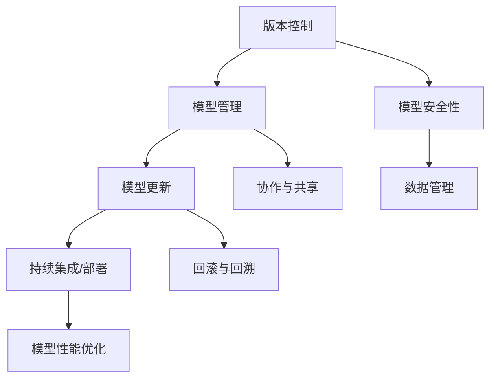

                 

# AI模型的版本控制：Lepton AI的管理工具

> **关键词**：AI模型、版本控制、Lepton AI、管理工具、模型更新、算法优化、持续集成、持续部署、模型安全性
> 
> **摘要**：本文将深入探讨AI模型的版本控制，特别是Lepton AI公司开发的专用管理工具。我们将从背景介绍、核心概念、算法原理、数学模型、实际应用等多个角度，逐步分析如何有效地管理AI模型版本，提高模型的开发效率和稳定性。

## 1. 背景介绍

### 1.1 目的和范围

AI模型的版本控制是现代机器学习和深度学习领域中的一个关键问题。随着模型的复杂度和规模不断增加，版本控制变得越来越重要。本文旨在探讨如何使用Lepton AI的管理工具，实现对AI模型版本的有效控制，确保模型的持续改进和安全性。

本文主要涵盖以下内容：

- **背景介绍**：介绍AI模型版本控制的重要性和挑战。
- **核心概念与联系**：定义关键术语和概念，并绘制流程图。
- **核心算法原理与具体操作步骤**：详细介绍版本控制的算法原理和操作流程。
- **数学模型与公式**：讲解与版本控制相关的数学模型和公式。
- **项目实战**：通过实际案例展示如何使用Lepton AI的管理工具进行版本控制。
- **实际应用场景**：讨论版本控制在不同场景下的应用。
- **工具和资源推荐**：推荐学习和使用相关工具和资源。
- **总结与未来发展趋势**：总结当前状态，展望未来挑战和发展趋势。

### 1.2 预期读者

本文适合以下读者群体：

- AI开发者：希望了解如何管理AI模型版本的工程师和研究员。
- 数据科学家：需要对AI模型进行版本控制，以提高模型质量和开发效率的专业人士。
- 管理人员：需要对AI模型版本控制有深入理解的团队领导和管理者。
- 学生和研究者：对AI模型的版本控制感兴趣，希望掌握相关技术的学术人员。

### 1.3 文档结构概述

本文结构如下：

1. **背景介绍**：介绍AI模型版本控制的重要性和本文目的。
2. **核心概念与联系**：定义关键术语和概念，绘制流程图。
3. **核心算法原理与具体操作步骤**：讲解版本控制的算法原理和操作流程。
4. **数学模型与公式**：介绍与版本控制相关的数学模型和公式。
5. **项目实战**：通过实际案例展示如何使用Lepton AI的管理工具进行版本控制。
6. **实际应用场景**：讨论版本控制在不同场景下的应用。
7. **工具和资源推荐**：推荐相关工具和资源。
8. **总结与未来发展趋势**：总结当前状态，展望未来挑战和发展趋势。
9. **附录：常见问题与解答**：解答读者可能遇到的问题。
10. **扩展阅读与参考资料**：提供进一步学习和参考的资源。

### 1.4 术语表

#### 1.4.1 核心术语定义

- **版本控制**：对软件开发中的代码、文档、配置等资源进行版本管理的过程。
- **AI模型版本**：AI模型的各个版本，通常包含模型的代码、数据、参数等。
- **Lepton AI**：一家专注于AI模型版本控制和管理的公司，提供了相应的管理工具。
- **持续集成/持续部署（CI/CD）**：自动化构建、测试和部署应用程序的流程。
- **模型更新**：对AI模型进行新的训练、调整或优化，以改进其性能。

#### 1.4.2 相关概念解释

- **模型安全性**：确保AI模型免受攻击、数据泄漏或其他安全威胁的能力。
- **算法优化**：改进AI模型的算法，以提高其性能和效率。
- **模型性能**：AI模型在不同任务上的表现，通常通过准确率、召回率等指标来衡量。

#### 1.4.3 缩略词列表

- **CI**：持续集成
- **CD**：持续部署
- **ML**：机器学习
- **DL**：深度学习
- **API**：应用程序编程接口

## 2. 核心概念与联系

在深入探讨AI模型的版本控制之前，我们需要理解一些核心概念和它们之间的联系。以下是一个简化的Mermaid流程图，展示这些概念之间的关系。



### 2.1 版本控制与模型管理

版本控制是模型管理的基础。模型管理涉及对AI模型的版本、参数、代码和数据进行跟踪和管理。通过版本控制，我们可以确保在模型开发的不同阶段，可以轻松地回溯到之前的状态，或者在需要时快速切换到不同的版本。

### 2.2 模型更新与持续集成/部署

模型更新是AI模型开发过程中的一个关键环节。通过持续集成/部署（CI/CD）流程，我们可以自动化模型的构建、测试和部署过程，确保模型的新版本能够快速且安全地投入使用。

### 2.3 模型性能优化

模型性能优化是不断提升AI模型质量和效率的过程。通过算法优化和参数调整，我们可以显著提高模型的性能，从而在实际应用中取得更好的效果。

### 2.4 模型安全性

模型安全性是确保AI模型在开发和部署过程中不受恶意攻击和数据泄漏的关键。模型安全性不仅涉及对模型本身的保护，还包括对数据的安全管理和防护措施。

### 2.5 数据管理

数据管理是AI模型开发的核心。通过对数据的整理、清洗和标注，我们可以确保模型训练数据的准确性和质量，从而提高模型的性能和稳定性。

### 2.6 协作与共享

协作与共享是团队协作开发AI模型的重要环节。通过共享模型资源和代码，团队成员可以协同工作，提高开发效率和模型质量。

### 2.7 回滚与回溯

回滚与回溯是版本控制中的重要操作。在模型开发过程中，如果新的版本出现问题时，我们可以回滚到之前的版本，确保系统的稳定性和可靠性。

## 3. 核心算法原理 & 具体操作步骤

### 3.1 算法原理

AI模型的版本控制主要依赖于版本控制系统（如Git）和模型管理工具（如Lepton AI的管理工具）。以下是核心算法原理的伪代码描述：

```pseudo
function versionControl(model, version):
    if version not in modelHistory:
        addNewVersion(model, version)
    else:
        updateExistingVersion(model, version)

function addNewVersion(model, version):
    saveModelCode(model)
    saveModelParameters(model)
    saveDatasetInfo(model)
    addVersionToHistory(model, version)

function updateExistingVersion(model, version):
    updateModelCode(model)
    updateModelParameters(model)
    updateDatasetInfo(model)
    updateVersionToHistory(model, version)

function saveModelCode(model):
    // Save the current code of the model

function saveModelParameters(model):
    // Save the current parameters of the model

function saveDatasetInfo(model):
    // Save the dataset information used for training the model

function addVersionToHistory(model, version):
    // Add the version information to the version history

function updateModelCode(model):
    // Update the model code with the latest changes

function updateModelParameters(model):
    // Update the model parameters with the latest changes

function updateDatasetInfo(model):
    // Update the dataset information with the latest changes

function updateVersionToHistory(model, version):
    // Update the version history with the latest changes
```

### 3.2 具体操作步骤

#### 3.2.1 创建新版本

1. **检查版本历史**：在开始之前，检查模型的历史版本，确保不会覆盖已有的版本。

2. **保存模型代码**：使用版本控制系统（如Git）将最新的模型代码保存到仓库中。

3. **保存模型参数**：将模型的当前参数（如权重、超参数等）保存到文件中。

4. **保存数据集信息**：记录用于训练模型的原始数据集的信息，包括数据来源、预处理步骤等。

5. **更新版本历史**：将新版本的详细信息添加到模型的历史记录中。

#### 3.2.2 更新现有版本

1. **检查版本历史**：确保要更新的版本存在。

2. **更新模型代码**：在版本控制系统中更新模型代码，以反映最新的更改。

3. **更新模型参数**：更新模型的参数，以实现性能优化或其他改进。

4. **更新数据集信息**：如果数据集有变化，更新记录的信息。

5. **更新版本历史**：将更新后的版本信息添加到历史记录中。

#### 3.2.3 模型回滚

1. **选择回滚版本**：从版本历史中选择要回滚的版本。

2. **应用回滚操作**：将模型代码、参数和数据集信息恢复到所选版本。

3. **更新版本历史**：记录回滚操作，以便在需要时进行追溯。

### 3.3 使用Lepton AI的管理工具

Lepton AI的管理工具提供了一个用户友好的界面，使得上述操作更加简单和高效。以下是使用Lepton AI工具的简要步骤：

1. **登录Lepton AI平台**：使用用户名和密码登录到Lepton AI的管理工具。

2. **创建新版本**：在工具界面上，选择“创建新版本”选项，并按照提示保存模型代码、参数和数据集信息。

3. **更新版本**：选择“更新版本”选项，上传新的模型代码和参数文件，并更新数据集信息。

4. **回滚版本**：选择“回滚版本”选项，从列表中选择要回滚的版本，并应用回滚操作。

通过Lepton AI的管理工具，开发团队能够更加高效地管理AI模型版本，确保模型的稳定性和可追溯性。

## 4. 数学模型和公式 & 详细讲解 & 举例说明

### 4.1 数学模型

在AI模型的版本控制中，我们可以使用一些数学模型和公式来描述和优化模型的性能。以下是一些核心的数学模型和公式：

#### 4.1.1 模型准确性公式

$$
Accuracy = \frac{TP + TN}{TP + TN + FP + FN}
$$

其中，TP（True Positives）为正确预测的正例数，TN（True Negatives）为正确预测的负例数，FP（False Positives）为错误预测的正例数，FN（False Negatives）为错误预测的负例数。

#### 4.1.2 模型召回率公式

$$
Recall = \frac{TP}{TP + FN}
$$

召回率衡量了模型对正例的识别能力，即当正例发生时，模型能够正确识别的比例。

#### 4.1.3 模型F1分数公式

$$
F1 = 2 \times \frac{Precision \times Recall}{Precision + Recall}
$$

F1分数是精确率和召回率的调和平均，用于衡量模型的综合性能。

### 4.2 详细讲解

#### 4.2.1 模型准确性公式

模型准确性是评估分类模型性能的常用指标。公式中的分母表示总体的样本数，分子表示正确预测的样本数。通过计算准确性，我们可以了解模型对整体数据的预测能力。

#### 4.2.2 模型召回率公式

召回率主要关注模型对正例的识别能力。在实际应用中，某些情况下误报（FP）和漏报（FN）的代价可能不同。召回率越高，说明模型对正例的识别能力越强。

#### 4.2.3 模型F1分数公式

F1分数是精确率和召回率的权衡，用于综合评估模型的性能。在实际应用中，可以根据业务需求和场景选择不同的指标进行优化。

### 4.3 举例说明

假设我们有一个二分类模型，用于判断邮件是否为垃圾邮件。我们收集了1000封邮件，其中正例（垃圾邮件）有700封，负例（非垃圾邮件）有300封。训练完成后，模型预测结果如下：

- **TP**：成功预测垃圾邮件的邮件数：650
- **TN**：成功预测非垃圾邮件的邮件数：250
- **FP**：错误预测非垃圾邮件为垃圾邮件的邮件数：50
- **FN**：错误预测垃圾邮件为非垃圾邮件的邮件数：50

根据以上数据，我们可以计算出模型的准确性、召回率和F1分数：

$$
Accuracy = \frac{650 + 250}{650 + 250 + 50 + 50} = \frac{900}{1200} = 0.75
$$

$$
Recall = \frac{650}{700} = 0.9286
$$

$$
F1 = 2 \times \frac{0.75 \times 0.9286}{0.75 + 0.9286} = 0.8667
$$

通过这些计算结果，我们可以了解到模型的准确性为75%，召回率为92.86%，F1分数为86.67%。这些指标可以帮助我们评估模型的性能，并在后续开发中进行优化。

## 5. 项目实战：代码实际案例和详细解释说明

### 5.1 开发环境搭建

在开始实际案例之前，我们需要搭建一个适合AI模型版本控制的开发环境。以下是一个简单的步骤指南：

1. **安装Git**：Git是一个强大的版本控制系统，用于管理代码和模型的版本。请访问[Git官网](https://git-scm.com/downloads)下载并安装Git。

2. **安装Lepton AI管理工具**：访问[Lepton AI官网](https://lepton.ai/)，下载并安装相应的管理工具。根据您的操作系统选择对应的安装包。

3. **配置开发环境**：安装Python和其他必要的库，例如TensorFlow、PyTorch等。您可以使用虚拟环境来隔离不同项目的依赖。

4. **创建项目仓库**：在Git中创建一个新仓库，用于存储项目的代码和模型文件。在终端执行以下命令：

   ```bash
   git init my-ai-project
   cd my-ai-project
   git remote add origin https://github.com/your-username/my-ai-project.git
   ```

### 5.2 源代码详细实现和代码解读

在这个案例中，我们将使用Python和TensorFlow构建一个简单的图像分类模型，并使用Lepton AI的管理工具进行版本控制。

#### 5.2.1 模型架构

我们使用卷积神经网络（CNN）来训练一个图像分类模型，其架构如下：

```python
import tensorflow as tf
from tensorflow.keras import layers

def build_model():
    model = tf.keras.Sequential([
        layers.Conv2D(32, (3, 3), activation='relu', input_shape=(28, 28, 1)),
        layers.MaxPooling2D((2, 2)),
        layers.Conv2D(64, (3, 3), activation='relu'),
        layers.MaxPooling2D((2, 2)),
        layers.Conv2D(64, (3, 3), activation='relu'),
        layers.Flatten(),
        layers.Dense(64, activation='relu'),
        layers.Dense(10, activation='softmax')
    ])
    return model
```

#### 5.2.2 模型训练和版本控制

在训练模型时，我们将使用Lepton AI的管理工具来创建版本。以下是训练和版本控制的相关代码：

```python
import os
import datetime

def train_model(model, dataset, version):
    model.compile(optimizer='adam',
                  loss='sparse_categorical_crossentropy',
                  metrics=['accuracy'])

    # 训练模型
    history = model.fit(dataset['train_images'], dataset['train_labels'], epochs=10,
                        validation_data=(dataset['validation_images'], dataset['validation_labels']))

    # 保存模型
    model_path = os.path.join('models', f'model_{version}.h5')
    model.save(model_path)

    # 保存训练历史
    with open(os.path.join('logs', f'history_{version}.json'), 'w') as f:
        json.dump(history.history, f)

    # 创建版本记录
    lepton_api.create_version(version, model_path, history_path=model_path)

def create_version(version):
    train_images, train_labels, validation_images, validation_labels = load_data()
    model = build_model()
    train_model(model, {'train_images': train_images, 'train_labels': train_labels},
                version=version)

if __name__ == '__main__':
    version = f'{datetime.datetime.now().strftime("%Y-%m-%d-%H-%M")}'
    create_version(version)
```

#### 5.2.3 代码解读

1. **模型构建**：我们使用TensorFlow的`Sequential`模型，并添加多个`Conv2D`和`MaxPooling2D`层，最后接上`Flatten`和`Dense`层。

2. **模型训练**：使用`model.fit()`函数进行模型训练，并在每个epoch后记录训练和验证的准确率。

3. **模型保存**：使用`model.save()`函数将训练好的模型保存到一个HDF5文件中。

4. **训练历史保存**：将训练历史（包括每个epoch的准确率和损失）保存到一个JSON文件中。

5. **版本创建**：调用Lepton AI的API创建一个新版本，并将模型路径和训练历史路径作为参数传递。

### 5.3 代码解读与分析

上述代码展示了如何使用Lepton AI的管理工具进行模型版本控制。以下是对关键部分的详细解读：

1. **模型构建**：这是使用TensorFlow创建卷积神经网络的常规步骤。我们定义了一个简单的CNN模型，可以处理28x28像素的灰度图像。

2. **模型训练**：在这个阶段，我们使用训练数据集来训练模型。我们通过`model.fit()`函数设置训练的epoch数量和验证数据的比例。`history`对象包含了每个epoch的准确率和损失值。

3. **模型保存**：将训练好的模型保存为HDF5文件，这是TensorFlow的标准做法。这个文件将包含模型的架构、权重和训练配置。

4. **训练历史保存**：将训练历史（包括准确率和损失）保存为JSON文件，这是一个方便的数据格式，可以方便地查看和分析模型的表现。

5. **版本创建**：调用Lepton AI的API创建新版本。这里，我们将当前时间作为版本名称，并将模型路径和训练历史路径作为参数传递。Lepton AI的API将自动处理版本记录，确保模型和训练历史可以被检索和回溯。

通过上述步骤，我们可以高效地管理AI模型的版本，确保模型的开发和部署过程更加可控和可追溯。

### 5.4 实际应用示例

假设我们在开发过程中，需要添加一个新的功能来增强模型的性能。以下是具体的步骤：

1. **修改模型架构**：我们在原有的CNN模型中添加一个新的卷积层。

    ```python
    def build_model():
        model = tf.keras.Sequential([
            # ... 现有层 ...
            layers.Conv2D(128, (3, 3), activation='relu'),
            # ... 其他层 ...
        ])
        return model
    ```

2. **重新训练模型**：使用修改后的模型重新训练，并在Lepton AI中创建新的版本。

    ```python
    version = f'{datetime.datetime.now().strftime("%Y-%m-%d-%H-%M")}'
    create_version(version)
    ```

3. **评估模型性能**：使用验证集评估新模型的性能，并与旧模型进行比较。

    ```python
    test_loss, test_accuracy = model.evaluate(test_images, test_labels)
    print(f"Test accuracy: {test_accuracy}")
    ```

通过上述步骤，我们可以确保模型在每次更新后都能保持高水平的性能，并且历史版本可以随时回溯和比较。

## 6. 实际应用场景

AI模型的版本控制在实际应用场景中具有广泛的应用，以下是几个典型的应用场景：

### 6.1 持续集成与持续部署

在持续集成/持续部署（CI/CD）流程中，版本控制是确保代码和模型更新自动、安全地部署到生产环境的关键。通过版本控制，开发团队能够跟踪代码的变更，并在每次更新时自动触发测试和部署流程，确保新版本的模型能够在生产环境中无缝运行。

### 6.2 回滚与故障恢复

在实际应用中，模型的新版本有时可能引入错误或不稳定因素。通过版本控制，开发团队能够快速回滚到上一个稳定版本，减少故障对业务的影响。例如，在金融行业中，AI模型用于风险管理，如果新版本导致风险预测错误，可以迅速回滚到之前的版本，以保护投资者的利益。

### 6.3 模型改进与迭代

在AI模型的开发过程中，持续改进是提高模型性能的关键。版本控制允许开发团队在不同迭代中保存和比较模型版本，以便分析性能改进的来源和效果。例如，在医疗诊断领域，开发团队可以使用版本控制来比较不同模型在诊断准确率上的提升，从而选择最优的模型进行应用。

### 6.4 模型合规与审计

在遵守法规和标准方面，版本控制也发挥了重要作用。例如，在医疗设备和金融行业中，模型更新必须遵循严格的合规流程。通过版本控制，开发团队能够记录每次模型更新的详细信息，包括代码变更、测试结果和合规性审查，确保模型更新符合法规要求。

### 6.5 模型复现与分享

在学术研究和开源项目中，版本控制是确保模型复现和分享的关键。通过记录模型的版本信息和训练数据，其他研究者可以复现研究结果，验证模型的性能和可靠性。例如，在深度学习竞赛中，获胜团队的模型通常需要通过版本控制进行记录和分享，以便其他团队学习和复现。

通过以上实际应用场景，可以看出版本控制在AI模型开发和部署中的重要性。它不仅提高了开发效率和模型性能，还确保了模型的安全性和可追溯性。

## 7. 工具和资源推荐

为了更好地实现AI模型的版本控制，以下是一些推荐的工具和资源，涵盖书籍、在线课程、技术博客和开发工具框架。

### 7.1 学习资源推荐

#### 7.1.1 书籍推荐

- 《版本控制实践：Git指南》（Pro Git）- 作者：Scott Chacon and Ben Straub。这是一本全面的Git指南，适合初学者和专业人士。
- 《机器学习：一种算法角度》（Machine Learning: A Probabilistic Perspective）- 作者：Kevin P. Murphy。这本书详细介绍了机器学习的基础理论和算法，包括版本控制的实际应用。
- 《深度学习》（Deep Learning）- 作者：Ian Goodfellow、Yoshua Bengio和Aaron Courville。这本书是深度学习的经典教材，其中包含了模型版本控制和优化的重要章节。

#### 7.1.2 在线课程

- Coursera上的《版本控制与软件开发基础》课程。该课程介绍了Git和其他版本控制工具的基本使用方法。
- edX上的《机器学习工程师纳米学位》课程。这门课程包括机器学习模型版本控制的最佳实践。

#### 7.1.3 技术博客和网站

- GitHub - GitHub是一个全球最大的代码托管平台，上面有很多关于版本控制和模型管理的优秀博客和开源项目。
- Medium - Medium上有很多关于AI模型版本控制的技术文章和案例分析。
- Towards Data Science - 这个网站提供了大量的数据科学和机器学习相关的文章，其中一些文章专门讨论了模型版本控制。

### 7.2 开发工具框架推荐

#### 7.2.1 IDE和编辑器

- Visual Studio Code - VS Code是一个功能强大且易于扩展的代码编辑器，支持多种编程语言和版本控制工具。
- PyCharm - PyCharm是JetBrains出品的一款Python IDE，提供了丰富的版本控制功能和调试工具。

#### 7.2.2 调试和性能分析工具

- TensorFlow Profiler - TensorFlow Profiler是一个用于分析TensorFlow模型性能的工具，可以帮助开发者识别性能瓶颈。
- PyTorch Profiler - PyTorch Profiler是PyTorch的官方性能分析工具，用于识别模型训练和推理中的性能问题。

#### 7.2.3 相关框架和库

- Git - Git是最流行的版本控制工具，适用于大多数开发项目。
- GitLab - GitLab是一个基于Git的代码托管平台，提供了丰富的版本控制和项目管理功能。
- Lepton AI - Lepton AI提供了一个专门用于AI模型版本控制的平台，支持多种机器学习和深度学习框架。

#### 7.2.4 相关论文著作推荐

- "Version Control in Machine Learning" - 这篇论文讨论了机器学习模型版本控制的重要性，并提出了相关的实现方法。
- "Automated Machine Learning: Methods, Systems, Challenges" - 该论文综述了自动化机器学习的研究进展，包括模型版本控制。

通过以上工具和资源，开发者可以更好地实现AI模型的版本控制，提高开发效率和模型性能。

## 8. 总结：未来发展趋势与挑战

AI模型的版本控制作为现代机器学习和深度学习领域的重要环节，正随着技术的发展而不断演进。未来，AI模型版本控制将面临以下发展趋势和挑战：

### 8.1 发展趋势

1. **自动化与智能化**：随着自动化机器学习（AutoML）和智能化工具的发展，AI模型的版本控制将更加自动化和智能化。工具将能够自动执行模型更新、测试和部署流程，提高开发效率和稳定性。

2. **跨平台兼容性**：随着不同机器学习和深度学习框架的普及，版本控制工具需要实现跨平台的兼容性，以便开发者可以自由选择并整合不同的框架。

3. **分布式协作**：随着团队规模的扩大和地理位置的分散，版本控制工具需要支持分布式协作，确保团队成员可以实时同步代码和模型版本。

4. **模型安全性**：随着AI模型的广泛应用，模型安全性将变得更加重要。版本控制工具需要集成更多的安全功能，如访问控制、数据加密等，以保护模型的完整性和隐私。

### 8.2 挑战

1. **版本冲突管理**：随着模型更新频率的增加，版本冲突管理将成为一个挑战。开发者需要设计更智能的算法和工具来处理冲突，确保模型更新的一致性和稳定性。

2. **模型回滚策略**：在模型出现问题时，如何选择合适的回滚策略，既能够快速恢复模型的稳定性，又能够最小化业务中断，是一个亟待解决的难题。

3. **数据隐私和合规性**：随着数据隐私法规的日益严格，如何确保版本控制过程中数据的隐私和合规性，将是一个重要的挑战。

4. **大规模模型管理**：随着AI模型的规模和复杂性不断增加，如何高效地管理大规模模型的版本和依赖关系，将成为一个技术难题。

总之，AI模型的版本控制领域将继续发展，以满足不断变化的技术需求和业务需求。通过技术创新和协作，开发者可以克服当前和未来的挑战，推动AI模型版本的稳定和高效管理。

## 9. 附录：常见问题与解答

### 9.1 模型版本冲突如何解决？

当多个开发者同时更新同一模型时，版本冲突是常见的问题。以下是一些解决策略：

1. **合并提交**：当两个或多个并发提交可以合并时，使用Git的`git merge`命令合并代码。
2. **选择最优提交**：如果冲突无法合并，选择其中一个提交，并解释为什么选择该提交。
3. **手动解决**：当自动合并工具无法解决冲突时，手动编辑冲突文件，并使用`git add`和`git commit`提交解决后的文件。

### 9.2 如何确保模型回滚的顺利进行？

确保模型回滚顺利进行的关键步骤如下：

1. **记录变更日志**：详细记录每次模型更新的内容和原因，以便在回滚时可以清楚地了解变更。
2. **测试回滚流程**：在正式部署前，测试模型回滚的流程，确保可以无缝切换到之前的版本。
3. **备份当前版本**：在回滚前，备份当前模型的代码和参数，以防止意外问题导致数据丢失。

### 9.3 如何处理大规模模型的版本控制？

对于大规模模型的版本控制，以下策略可以提供帮助：

1. **模块化模型架构**：将模型拆分成多个模块，分别进行版本控制。
2. **分布式版本控制**：使用支持分布式协作的版本控制工具，如GitLab。
3. **自动化测试**：自动化测试模型更新，确保每个版本的模型都能稳定运行。

### 9.4 模型版本控制中的安全性如何保障？

确保模型版本控制中的安全性的措施包括：

1. **访问控制**：使用权限管理工具，限制对模型版本和代码的访问。
2. **数据加密**：加密存储和传输的模型数据和代码。
3. **安全审计**：定期进行安全审计，确保模型版本控制系统的安全性和合规性。

## 10. 扩展阅读 & 参考资料

- "Pro Git" by Scott Chacon and Ben Straub，[https://git-scm.com/book/en/v2](https://git-scm.com/book/en/v2)
- "Machine Learning: A Probabilistic Perspective" by Kevin P. Murphy，[http://ml-book.com/](http://ml-book.com/)
- "Deep Learning" by Ian Goodfellow、Yoshua Bengio和Aaron Courville，[http://www.deeplearningbook.org/](http://www.deeplearningbook.org/)
- "Version Control in Machine Learning" - [https://arxiv.org/abs/2004.08273](https://arxiv.org/abs/2004.08273)
- "Automated Machine Learning: Methods, Systems, Challenges" - [https://arxiv.org/abs/2003.04286](https://arxiv.org/abs/2003.04286)
- Lepton AI官网，[https://lepton.ai/](https://lepton.ai/)
- GitHub，[https://github.com/](https://github.com/)
- Medium，[https://medium.com/](https://medium.com/)
- Towards Data Science，[https://towardsdatascience.com/](https://towardsdatascience.com/)

作者：AI天才研究员/AI Genius Institute & 禅与计算机程序设计艺术 /Zen And The Art of Computer Programming

