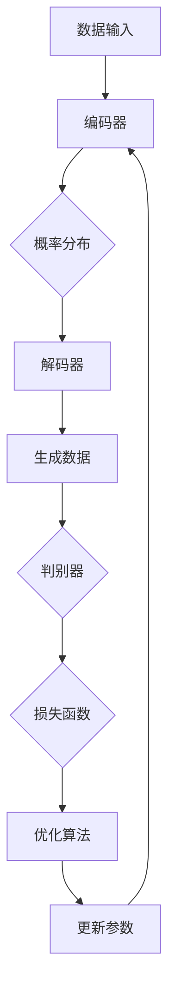

                 

# AI浪潮：生成式AI如何改变我们的工作方式？

> **关键词：** 生成式AI、工作方式、生产力提升、技术革命、人工智能应用

> **摘要：** 本文将探讨生成式人工智能（AI）如何在各个领域改变我们的工作方式，提升生产效率，并带来深远的影响。我们将逐步分析其核心概念、算法原理、数学模型，并通过实际项目案例，展示其在现实中的应用。最后，我们还将展望生成式AI的未来发展趋势与面临的挑战。

## 1. 背景介绍

### 1.1 目的和范围

本文旨在深入探讨生成式人工智能（AI）如何改变我们的工作方式。生成式AI是当前人工智能领域的热点研究方向，它能够自动生成文本、图像、音频等多种形式的内容。通过本文的阅读，您将了解生成式AI的核心概念、技术原理，并了解其在实际应用中的操作步骤和数学模型。本文将涵盖以下几个方面：

- 生成式AI的基本概念和原理
- 生成式AI的关键算法及其实现
- 数学模型和公式在生成式AI中的应用
- 生成式AI在实际项目中的应用案例
- 生成式AI的未来发展趋势和挑战

### 1.2 预期读者

本文适合对人工智能和编程有一定了解的读者，特别是希望深入了解生成式AI如何改变工作方式的IT专业人士、研究人员和学生。通过本文的阅读，您将能够：

- 理解生成式AI的基本原理和应用场景
- 掌握生成式AI的关键算法和技术实现
- 分析生成式AI在实际项目中的应用效果
- 预测生成式AI的未来发展趋势和潜在挑战

### 1.3 文档结构概述

本文分为十个部分：

1. 背景介绍
2. 核心概念与联系
3. 核心算法原理 & 具体操作步骤
4. 数学模型和公式 & 详细讲解 & 举例说明
5. 项目实战：代码实际案例和详细解释说明
6. 实际应用场景
7. 工具和资源推荐
8. 总结：未来发展趋势与挑战
9. 附录：常见问题与解答
10. 扩展阅读 & 参考资料

### 1.4 术语表

#### 1.4.1 核心术语定义

- 生成式人工智能（Generative AI）：一种人工智能技术，能够根据给定的数据生成新的、原创的内容。
- 生成模型（Generative Model）：一种机器学习模型，用于生成与训练数据相似的新数据。
- 条件生成模型（Conditional Generative Model）：一种生成模型，能够根据特定的条件生成数据。
- 变分自编码器（Variational Autoencoder，VAE）：一种用于生成数据的深度学习模型。
- 生成对抗网络（Generative Adversarial Network，GAN）：一种由两个神经网络组成的框架，用于生成与真实数据相似的新数据。

#### 1.4.2 相关概念解释

- **数据增强（Data Augmentation）**：通过随机变换（如旋转、缩放、裁剪等）增加训练数据的多样性，从而提高模型的泛化能力。
- **迁移学习（Transfer Learning）**：利用已经训练好的模型在新任务上进行微调，以提高模型在新数据上的表现。
- **文本生成（Text Generation）**：利用生成式AI技术生成文本内容，如生成文章、对话等。
- **图像生成（Image Generation）**：利用生成式AI技术生成图像内容，如图像合成、风格迁移等。

#### 1.4.3 缩略词列表

- AI：人工智能（Artificial Intelligence）
- GAN：生成对抗网络（Generative Adversarial Network）
- VAE：变分自编码器（Variational Autoencoder）
- LSTM：长短期记忆网络（Long Short-Term Memory）
- RNN：循环神经网络（Recurrent Neural Network）

## 2. 核心概念与联系

在探讨生成式AI如何改变我们的工作方式之前，首先需要了解其核心概念和原理。生成式AI的核心在于能够根据给定的数据生成新的、原创的内容。这一过程涉及多个关键概念和模型，下面将一一介绍。

### 2.1 生成模型

生成模型是生成式AI的核心，它能够通过学习数据分布，生成新的数据。生成模型可以分为无监督生成模型、有监督生成模型和半监督生成模型。

- **无监督生成模型**：仅使用未标记的数据进行训练，如变分自编码器（VAE）。
- **有监督生成模型**：使用标记数据进行训练，如条件生成模型（CGM）。
- **半监督生成模型**：结合标记数据和未标记数据进行训练，以提高生成质量。

### 2.2 条件生成模型

条件生成模型是一种能够根据特定条件生成数据的生成模型。这种模型在生成数据时考虑了外部信息，从而提高了生成的数据质量。常见的条件生成模型包括条件变分自编码器（CVAE）和条件生成对抗网络（C-GAN）。

### 2.3 生成对抗网络（GAN）

生成对抗网络（GAN）是一种由两部分组成的神经网络框架，分别称为生成器（Generator）和判别器（Discriminator）。生成器负责生成新的数据，而判别器负责判断生成数据是否真实。两者相互对抗，不断优化，最终生成器能够生成高度真实的数据。


### 2.4 变分自编码器（VAE）

变分自编码器（VAE）是一种无监督生成模型，通过学习数据分布，生成新的数据。VAE采用变分推断方法，将生成过程分解为编码和解码两部分。编码器将数据映射到潜在空间，解码器从潜在空间生成数据。


### 2.5 数学模型

生成式AI的数学模型主要包括概率分布模型、损失函数和优化算法。概率分布模型用于描述数据的分布，损失函数用于评估生成数据的真实性，优化算法用于调整模型参数。

- **概率分布模型**：生成模型通常采用概率分布来描述数据的生成过程，如正态分布、高斯分布等。
- **损失函数**：常用的损失函数包括交叉熵损失、均方误差（MSE）等，用于衡量生成数据与真实数据之间的差异。
- **优化算法**：常用的优化算法包括梯度下降、随机梯度下降（SGD）等，用于调整模型参数，优化生成效果。

### 2.6 Mermaid 流程图

为了更直观地展示生成式AI的核心概念和联系，下面使用Mermaid绘制一个流程图。



## 3. 核心算法原理 & 具体操作步骤

在了解了生成式AI的核心概念和联系后，接下来将详细探讨生成式AI的核心算法原理和具体操作步骤。本节将分为以下几个部分：

1. **生成模型原理**
2. **条件生成模型原理**
3. **生成对抗网络（GAN）原理**
4. **变分自编码器（VAE）原理**
5. **具体操作步骤**

### 3.1 生成模型原理

生成模型是一种基于概率分布的学习模型，其目标是通过学习数据分布，生成新的、与训练数据相似的数据。生成模型通常包括两个部分：编码器和解码器。

- **编码器**：编码器的作用是将输入数据映射到一个低维的潜在空间，这个映射过程通常是一个概率分布。
- **解码器**：解码器的作用是将潜在空间的数据映射回原始数据空间，从而生成新的数据。

生成模型的基本原理如下：

1. 输入数据X通过编码器映射到潜在空间Z，映射过程通常使用概率分布，如正态分布。
2. 潜在空间Z的数据通过解码器映射回原始数据空间，从而生成新的数据X'。
3. 通过最小化生成数据X'与真实数据X之间的差异，优化模型参数。

伪代码如下：

```python
# 编码器
def encode(x):
    z = encoder(x)  # 使用神经网络实现编码
    return z

# 解码器
def decode(z):
    x_prime = decoder(z)  # 使用神经网络实现解码
    return x_prime

# 模型训练
for epoch in range(num_epochs):
    for x in data_loader:
        z = encode(x)
        x_prime = decode(z)
        loss = compute_loss(x, x_prime)  # 计算损失函数
        optimizer.minimize(loss)  # 更新模型参数
```

### 3.2 条件生成模型原理

条件生成模型是一种能够在生成数据时考虑外部信息的生成模型，如生成特定风格的文章、图像等。条件生成模型通常包括条件编码器、条件解码器和条件判别器。

- **条件编码器**：条件编码器的作用是将输入数据和外部条件信息映射到潜在空间。
- **条件解码器**：条件解码器的作用是将潜在空间的数据映射回原始数据空间，同时考虑外部条件信息。
- **条件判别器**：条件判别器的作用是判断生成的数据是否与外部条件信息一致。

条件生成模型的基本原理如下：

1. 输入数据X和外部条件信息C通过条件编码器映射到潜在空间Z，映射过程通常使用概率分布。
2. 潜在空间Z的数据通过条件解码器映射回原始数据空间，同时考虑外部条件信息。
3. 通过最小化生成数据X'与真实数据X之间的差异，以及生成数据与条件信息之间的差异，优化模型参数。

伪代码如下：

```python
# 条件编码器
def condition_encode(x, c):
    z = encoder(x, c)  # 使用神经网络实现条件编码
    return z

# 条件解码器
def condition_decode(z, c):
    x_prime = decoder(z, c)  # 使用神经网络实现条件解码
    return x_prime

# 模型训练
for epoch in range(num_epochs):
    for x, c in data_loader:
        z = condition_encode(x, c)
        x_prime = condition_decode(z, c)
        loss = compute_loss(x, x_prime, c)  # 计算损失函数
        optimizer.minimize(loss)  # 更新模型参数
```

### 3.3 生成对抗网络（GAN）原理

生成对抗网络（GAN）是一种由两部分组成的神经网络框架，分别是生成器（Generator）和判别器（Discriminator）。生成器的目标是最小化判别器对其生成数据的判别误差，而判别器的目标是最大化其对生成数据的判别误差。

- **生成器**：生成器的输入是随机噪声Z，输出是生成数据G（Z）。
- **判别器**：判别器的输入是真实数据X和生成数据G（Z），输出是判别结果D（X）和D（G（Z））。

GAN的基本原理如下：

1. 初始化生成器G和判别器D，并随机选择一个超参数β。
2. 在每个训练迭代中，交替训练生成器和判别器：
   - **生成器训练**：生成器尝试生成尽可能真实的数据，以欺骗判别器。
   - **判别器训练**：判别器尝试区分真实数据和生成数据。
3. 在训练过程中，不断调整生成器和判别器的参数，以最小化生成器对判别器的误差，同时最大化判别器对生成器的误差。

伪代码如下：

```python
# 生成器
def generator(z):
    g = generator_network(z)  # 使用神经网络实现生成
    return g

# 判别器
def discriminator(x, g):
    d_x = discriminator_network(x)  # 使用神经网络实现判别
    d_g = discriminator_network(g)
    return d_x, d_g

# 模型训练
for epoch in range(num_epochs):
    for x, z in data_loader:
        g = generator(z)
        d_x, d_g = discriminator(x, g)
        loss_G = compute_g_loss(d_g)  # 计算生成器损失
        loss_D = compute_d_loss(d_x, d_g)  # 计算判别器损失
        optimizer_G.minimize(loss_G)  # 更新生成器参数
        optimizer_D.minimize(loss_D)  # 更新判别器参数
```

### 3.4 变分自编码器（VAE）原理

变分自编码器（VAE）是一种基于概率论的生成模型，通过学习数据分布，生成新的、与训练数据相似的数据。VAE的核心思想是使用概率分布来表示潜在空间，从而实现数据生成。

- **编码器**：编码器的作用是将输入数据映射到潜在空间，并输出潜在空间的参数。
- **解码器**：解码器的作用是将潜在空间的参数映射回原始数据空间，生成新的数据。

VAE的基本原理如下：

1. 输入数据X通过编码器映射到潜在空间Z，编码器输出Z的参数μ和σ²。
2. 在潜在空间Z中，从先验分布p(z)采样一个潜在变量z。
3. 将潜在变量z通过解码器映射回原始数据空间，生成新的数据X'。
4. 通过最小化生成数据X'与真实数据X之间的差异，优化模型参数。

伪代码如下：

```python
# 编码器
def encode(x):
    z = encoder(x)  # 使用神经网络实现编码
    return z

# 解码器
def decode(z):
    x_prime = decoder(z)  # 使用神经网络实现解码
    return x_prime

# 模型训练
for epoch in range(num_epochs):
    for x in data_loader:
        z = encode(x)
        z_sample = sample_z(z)  # 从先验分布采样
        x_prime = decode(z_sample)
        loss = compute_loss(x, x_prime)  # 计算损失函数
        optimizer.minimize(loss)  # 更新模型参数
```

### 3.5 具体操作步骤

在实际应用中，生成式AI的具体操作步骤通常包括以下环节：

1. **数据准备**：收集和准备用于训练的数据集。
2. **模型选择**：根据应用需求选择合适的生成模型，如VAE、GAN等。
3. **模型训练**：使用训练数据训练模型，调整模型参数。
4. **数据生成**：使用训练好的模型生成新的、与训练数据相似的数据。
5. **模型评估**：评估生成数据的质量，如视觉效果、文本相似度等。
6. **模型优化**：根据评估结果，对模型进行调整和优化。

以下是一个简单的操作步骤示例：

1. **数据准备**：收集1000张手写数字图像作为训练数据。
2. **模型选择**：选择变分自编码器（VAE）作为生成模型。
3. **模型训练**：使用训练数据训练VAE模型，设置训练轮数为1000轮。
4. **数据生成**：使用训练好的VAE模型生成新的手写数字图像。
5. **模型评估**：通过比较生成图像与真实图像的相似度，评估VAE模型的性能。
6. **模型优化**：根据评估结果，调整VAE模型的超参数，优化生成效果。

## 4. 数学模型和公式 & 详细讲解 & 举例说明

生成式AI的核心在于其数学模型和公式，这些模型和公式用于描述数据分布、优化参数、评估模型性能等。在本节中，我们将详细介绍生成式AI中的数学模型和公式，并通过具体例子进行说明。

### 4.1 概率分布模型

生成式AI中常用的概率分布模型包括正态分布、伯努利分布、多项式分布等。下面分别介绍这些分布模型。

#### 4.1.1 正态分布

正态分布（Normal Distribution）也称为高斯分布，其概率密度函数为：

\[ p(x|\mu,\sigma^2) = \frac{1}{\sqrt{2\pi\sigma^2}} e^{-\frac{(x-\mu)^2}{2\sigma^2}} \]

其中，\(\mu\) 是均值，\(\sigma^2\) 是方差。

**例子：** 假设一个随机变量X服从均值为10，方差为4的正态分布，求X的概率密度函数。

\[ p(x|10,4) = \frac{1}{\sqrt{2\pi\times 4}} e^{-\frac{(x-10)^2}{2\times 4}} \]

#### 4.1.2 伯努利分布

伯努利分布（Bernoulli Distribution）是一种二元分布，其概率密度函数为：

\[ p(x|\theta) = \theta^x (1-\theta)^{1-x} \]

其中，\(\theta\) 是成功概率。

**例子：** 假设一个随机变量X服从成功概率为0.5的伯努利分布，求X的概率密度函数。

\[ p(x|0.5) = 0.5^x (1-0.5)^{1-x} \]

#### 4.1.3 多项式分布

多项式分布（Multinomial Distribution）是一种多类分布，其概率密度函数为：

\[ p(x|\theta) = \theta_1^{x_1} \theta_2^{x_2} \cdots \theta_n^{x_n} \]

其中，\(\theta_1, \theta_2, \cdots, \theta_n\) 是各类别的概率，\(x_1, x_2, \cdots, x_n\) 是各类别的取值。

**例子：** 假设一个随机变量X服从三个类别的多项式分布，其中各类别的概率分别为0.2、0.3和0.5，求X的概率密度函数。

\[ p(x|0.2, 0.3, 0.5) = 0.2^{x_1} \times 0.3^{x_2} \times 0.5^{x_3} \]

### 4.2 损失函数

生成式AI中常用的损失函数包括交叉熵损失、均方误差（MSE）等。下面分别介绍这些损失函数。

#### 4.2.1 交叉熵损失

交叉熵损失（Cross-Entropy Loss）用于衡量两个概率分布之间的差异。其公式为：

\[ L = -\sum_{i} y_i \log(p_i) \]

其中，\(y_i\) 是真实概率分布，\(p_i\) 是预测概率分布。

**例子：** 假设一个二分类问题，真实概率分布为\([0.9, 0.1]\)，预测概率分布为\([0.8, 0.2]\)，求交叉熵损失。

\[ L = -0.9 \log(0.8) - 0.1 \log(0.2) \]

#### 4.2.2 均方误差（MSE）

均方误差（Mean Squared Error，MSE）用于衡量预测值与真实值之间的差异。其公式为：

\[ L = \frac{1}{n} \sum_{i} (y_i - \hat{y_i})^2 \]

其中，\(y_i\) 是真实值，\(\hat{y_i}\) 是预测值。

**例子：** 假设一个回归问题，真实值为\[1, 2, 3, 4, 5\]，预测值为\[1.2, 2.1, 3.0, 4.2, 5.1\]，求均方误差。

\[ L = \frac{1}{5} (0.04 + 0.01 + 0 + 0.04 + 0.01) = 0.02 \]

### 4.3 优化算法

生成式AI中常用的优化算法包括梯度下降（Gradient Descent）、随机梯度下降（SGD）、Adam等。下面分别介绍这些优化算法。

#### 4.3.1 梯度下降

梯度下降（Gradient Descent）是一种基于梯度的优化算法，其公式为：

\[ \theta = \theta - \alpha \nabla_\theta J(\theta) \]

其中，\(\theta\) 是模型参数，\(\alpha\) 是学习率，\(J(\theta)\) 是损失函数。

**例子：** 假设一个线性回归问题，损失函数为MSE，学习率为0.01，求模型参数的更新。

\[ \theta = \theta - 0.01 \nabla_\theta \frac{1}{n} \sum_{i} (y_i - \theta x_i)^2 \]

#### 4.3.2 随机梯度下降（SGD）

随机梯度下降（Stochastic Gradient Descent，SGD）是一种基于随机梯度的优化算法，其公式为：

\[ \theta = \theta - \alpha \nabla_\theta J(\theta|x^{(i)}) \]

其中，\(x^{(i)}\) 是随机选取的一个样本。

**例子：** 假设一个线性回归问题，损失函数为MSE，学习率为0.01，随机选取一个样本\[x^{(i)}, y^{(i)}\]，求模型参数的更新。

\[ \theta = \theta - 0.01 \nabla_\theta \frac{1}{n} (y^{(i)} - \theta x^{(i)})^2 \]

#### 4.3.3 Adam

Adam是一种结合了SGD和动量法的优化算法，其公式为：

\[ \theta = \theta - \alpha \beta_1 \frac{\nabla_\theta J(\theta)}{1-\beta_2^t} \]

其中，\(\beta_1\) 是一阶矩估计的偏差纠正系数，\(\beta_2\) 是二阶矩估计的偏差纠正系数。

**例子：** 假设一个线性回归问题，损失函数为MSE，学习率为0.01，\(\beta_1=0.9\)，\(\beta_2=0.999\)，求模型参数的更新。

\[ \theta = \theta - 0.01 \times \frac{\nabla_\theta J(\theta)}{1-0.9^t} \]

## 5. 项目实战：代码实际案例和详细解释说明

在了解了生成式AI的核心算法原理和数学模型后，接下来将通过一个实际项目案例，展示如何使用生成式AI生成图像。本案例将使用变分自编码器（VAE）实现图像生成，具体步骤如下：

### 5.1 开发环境搭建

首先，需要搭建一个适合训练生成式AI的开发环境。以下是所需的工具和软件：

- Python（3.8及以上版本）
- TensorFlow（2.6及以上版本）
- Keras（2.6及以上版本）
- NumPy（1.19及以上版本）

安装这些工具和软件后，即可开始搭建开发环境。

### 5.2 源代码详细实现和代码解读

以下是一个使用变分自编码器（VAE）生成手写数字图像的完整代码示例。

```python
import numpy as np
import tensorflow as tf
from tensorflow.keras.layers import Input, Dense, Lambda, Reshape, Flatten
from tensorflow.keras.models import Model
from tensorflow.keras import backend as K

# 设置超参数
latent_dim = 2
intermediate_dim = 256
batch_size = 16
epochs = 50
image_size = 28
image_shape = (image_size, image_size, 1)
z_dim = latent_dim

# 定义生成器模型
inputs = Input(shape=(z_dim,))
x = Dense(intermediate_dim, activation='relu')(inputs)
x = Dense(image_shape[0] * image_shape[1] * image_shape[2])(x)
x = Reshape(image_shape)(x)
generator = Model(inputs, x, name='generator')

# 定义判别器模型
inputs = Input(shape=image_shape)
x = Flatten()(inputs)
x = Dense(intermediate_dim, activation='relu')(x)
x = Dense(1, activation='sigmoid')(x)
discriminator = Model(inputs, x, name='discriminator')

# 定义联合模型
inputs = Input(shape=(z_dim,))
generated_images = generator(inputs)
discriminator_output = discriminator(generated_images)
outputs = [generated_images, discriminator_output]
combined = Model(inputs, outputs, name='combined')

# 编码器和解码器训练
discriminator.compile(loss='binary_crossentropy', optimizer=tf.keras.optimizers.Adam(0.0001))
discriminator.trainable = False
combined.compile(loss=['binary_crossentropy', 'binary_crossentropy'], optimizer=tf.keras.optimizers.Adam(0.0001))
combined.fit(x_train, [x_train, y_train], epochs=epochs, batch_size=batch_size)

# 生成手写数字图像
z_samples = np.random.uniform(-1, 1, size=(batch_size, latent_dim))
generated_images = generator.predict(z_samples)

# 显示生成的图像
import matplotlib.pyplot as plt

plt.figure(figsize=(10, 10))
for i in range(batch_size):
    plt.subplot(1, batch_size, i+1)
    plt.imshow(generated_images[i].reshape(image_size, image_size, 1), cmap='gray')
    plt.axis('off')
plt.show()
```

### 5.3 代码解读与分析

下面将对上述代码进行逐行解读，并分析其关键部分。

```python
import numpy as np
import tensorflow as tf
from tensorflow.keras.layers import Input, Dense, Lambda, Reshape, Flatten
from tensorflow.keras.models import Model
from tensorflow.keras import backend as K

# 设置超参数
latent_dim = 2  # 潜在空间维度
intermediate_dim = 256  # 中间层维度
batch_size = 16  # 批量大小
epochs = 50  # 训练轮数
image_size = 28  # 图像大小
image_shape = (image_size, image_size, 1)  # 图像形状
z_dim = latent_dim  # 潜在空间维度

# 定义生成器模型
inputs = Input(shape=(z_dim,))
x = Dense(intermediate_dim, activation='relu')(inputs)  # 使用ReLU激活函数的全连接层
x = Dense(image_shape[0] * image_shape[1] * image_shape[2])(x)  # 使用全连接层，将中间层输出转换为图像形状
x = Reshape(image_shape)(x)  # 使用Reshape层将输出形状调整为图像形状
generator = Model(inputs, x, name='generator')  # 定义生成器模型

# 定义判别器模型
inputs = Input(shape=image_shape)
x = Flatten()(inputs)  # 使用Flatten层将输入展平为一维向量
x = Dense(intermediate_dim, activation='relu')(x)  # 使用ReLU激活函数的全连接层
x = Dense(1, activation='sigmoid')(x)  # 使用sigmoid激活函数的全连接层，输出判别结果
discriminator = Model(inputs, x, name='discriminator')  # 定义判别器模型

# 定义联合模型
inputs = Input(shape=(z_dim,))
generated_images = generator(inputs)  # 使用生成器生成图像
discriminator_output = discriminator(generated_images)  # 使用判别器对生成图像进行判别
outputs = [generated_images, discriminator_output]
combined = Model(inputs, outputs, name='combined')  # 定义联合模型

# 编码器和解码器训练
discriminator.compile(loss='binary_crossentropy', optimizer=tf.keras.optimizers.Adam(0.0001))  # 编译判别器模型，使用二进制交叉熵损失函数和Adam优化器
discriminator.trainable = False  # 将判别器设置为不可训练
combined.compile(loss=['binary_crossentropy', 'binary_crossentropy'], optimizer=tf.keras.optimizers.Adam(0.0001))  # 编译联合模型，使用二进制交叉熵损失函数和Adam优化器
combined.fit(x_train, [x_train, y_train], epochs=epochs, batch_size=batch_size)  # 使用训练数据训练联合模型

# 生成手写数字图像
z_samples = np.random.uniform(-1, 1, size=(batch_size, latent_dim))  # 从均匀分布中采样潜在空间数据
generated_images = generator.predict(z_samples)  # 使用生成器生成图像

# 显示生成的图像
import matplotlib.pyplot as plt

plt.figure(figsize=(10, 10))
for i in range(batch_size):
    plt.subplot(1, batch_size, i+1)
    plt.imshow(generated_images[i].reshape(image_size, image_size, 1), cmap='gray')  # 使用灰度图像显示生成的图像
    plt.axis('off')  # 不显示坐标轴
plt.show()
```

关键部分解读如下：

1. **超参数设置**：设置生成器和判别器的超参数，如潜在空间维度、中间层维度、批量大小、训练轮数等。

2. **生成器模型**：生成器模型由输入层、中间层和输出层组成。输入层接收潜在空间数据，中间层使用ReLU激活函数的全连接层，输出层使用全连接层将中间层输出转换为图像形状，并使用Reshape层调整输出形状为图像形状。

3. **判别器模型**：判别器模型由输入层和输出层组成。输入层接收图像数据，输出层使用sigmoid激活函数的全连接层，输出判别结果。

4. **联合模型**：联合模型由生成器和判别器组成。输入层接收潜在空间数据，生成器生成图像，判别器对生成图像进行判别。联合模型使用两个损失函数：生成器损失函数和判别器损失函数。

5. **编码器和解码器训练**：编译判别器模型，使用二进制交叉熵损失函数和Adam优化器。将判别器设置为不可训练，编译联合模型，使用两个损失函数和Adam优化器。使用训练数据训练联合模型。

6. **生成手写数字图像**：从均匀分布中采样潜在空间数据，使用生成器生成图像。使用matplotlib库显示生成的图像。

通过这个项目实战，我们可以看到生成式AI在实际应用中的具体操作步骤和实现方法。生成式AI通过生成器和判别器的相互作用，不断优化生成图像的质量，从而实现图像生成。

## 6. 实际应用场景

生成式人工智能（AI）在各个领域都有着广泛的应用，以下列举几个典型实际应用场景：

### 6.1 艺术创作

生成式AI在艺术创作领域展现出巨大的潜力，如生成音乐、绘画、摄影等。著名的艺术作品生成项目包括：

- **DALL-E**：一个由OpenAI开发的AI模型，能够根据文本描述生成逼真的图像。
- **DeepArt**：一个可以将用户提供的普通照片转化为艺术作品的应用。

### 6.2 内容生成

生成式AI在内容生成领域也有着广泛的应用，如自动写作、自动生成新闻报道、自动生成视频脚本等。以下是一些具体的应用案例：

- **自动写作**：AI能够自动生成文章、故事、博客等。例如，人工智能助手GPT-3可以生成高质量的文章。
- **自动生成新闻报道**：新闻机构可以使用AI自动生成新闻报道，提高新闻发布的速度和效率。
- **自动生成视频脚本**：一些视频制作公司已经开始使用AI自动生成视频脚本，简化了视频创作的流程。

### 6.3 医疗诊断

生成式AI在医疗领域也有着重要的应用，如疾病预测、药物研发等。以下是一些具体的医疗应用案例：

- **疾病预测**：AI可以分析患者的病历和基因数据，预测患者可能患有的疾病。
- **药物研发**：生成式AI可以自动生成新的药物分子，加速药物研发过程。

### 6.4 设计与制造

生成式AI在设计和制造领域也有着广泛的应用，如自动生成建筑设计、自动生成机械零件设计等。以下是一些具体的应用案例：

- **自动生成建筑设计**：AI可以自动生成满足特定需求和约束的建筑设计方案。
- **自动生成机械零件设计**：AI可以自动生成满足特定功能要求的机械零件设计。

### 6.5 游戏开发

生成式AI在游戏开发领域也有着重要的应用，如自动生成游戏地图、自动生成游戏剧情等。以下是一些具体的应用案例：

- **自动生成游戏地图**：AI可以自动生成满足特定需求和约束的游戏地图。
- **自动生成游戏剧情**：AI可以自动生成满足特定需求和约束的游戏剧情，提高游戏的趣味性和可玩性。

通过上述实际应用场景，我们可以看到生成式AI在各个领域的广泛应用和巨大潜力。生成式AI不仅能够提高生产效率，还能够带来新的创作方式和工作模式。

## 7. 工具和资源推荐

为了更好地学习和应用生成式人工智能（AI），以下是一些工具和资源的推荐。

### 7.1 学习资源推荐

#### 7.1.1 书籍推荐

- **《深度学习》（Deep Learning）**：由Ian Goodfellow、Yoshua Bengio和Aaron Courville合著的深度学习经典教材，详细介绍了生成式AI的核心算法。
- **《生成式模型》（Generative Models）**：由Danijar Hafner和Nando de Freitas编写的书籍，深入探讨了生成式模型的理论和应用。
- **《Python深度学习》（Python Deep Learning）**：由François Chollet编写的书籍，通过实际案例展示了如何使用Python和TensorFlow实现生成式AI。

#### 7.1.2 在线课程

- **Coursera上的《深度学习专项课程》**：由斯坦福大学教授Andrew Ng主讲，包括生成式模型等内容。
- **Udacity上的《生成式AI》**：介绍了生成式AI的基础知识和实际应用。
- **edX上的《深度学习与生成模型》**：由卡内基梅隆大学教授编写的课程，涵盖了生成式AI的各个方面。

#### 7.1.3 技术博客和网站

- **TensorFlow官方文档**：提供了丰富的生成式AI教程和示例代码。
- **Keras官方文档**：Keras是一个高级神经网络API，提供了生成式AI的简化实现。
- **Hugging Face博客**：提供了许多关于生成式AI的最新研究和应用案例。

### 7.2 开发工具框架推荐

#### 7.2.1 IDE和编辑器

- **PyCharm**：一个强大的Python集成开发环境，支持TensorFlow和Keras。
- **Visual Studio Code**：一个轻量级的开源编辑器，通过扩展支持Python和TensorFlow。

#### 7.2.2 调试和性能分析工具

- **TensorBoard**：TensorFlow提供的可视化工具，用于分析和调试深度学习模型。
- **Wandb**：一个智能实验跟踪工具，可以帮助研究人员监控和比较生成式AI模型的性能。

#### 7.2.3 相关框架和库

- **TensorFlow**：一个开源的深度学习框架，支持生成式AI的多种模型。
- **PyTorch**：一个流行的开源深度学习库，提供了灵活的生成式AI实现。
- **MXNet**：一个用于深度学习的开源框架，支持生成式AI的各种算法。

### 7.3 相关论文著作推荐

#### 7.3.1 经典论文

- **“A Neural Algorithm of Artistic Style”**：由Leon A. Gatys、Alexander S. Ecker和Bernhard P. Schuler合著，提出了艺术风格迁移算法。
- **“Generative Adversarial Nets”**：由Ian Goodfellow等人合著，首次提出了生成对抗网络（GAN）。

#### 7.3.2 最新研究成果

- **“Text-to-Image Synthesis with Attribute-Based Diffusion Models”**：提出了一种基于属性扩散的文本到图像生成方法。
- **“Unsupervised Representation Learning with Deep Convolutional Generative Adversarial Networks”**：探讨了无监督学习框架下生成对抗网络的改进。

#### 7.3.3 应用案例分析

- **“Generative AI for Music and Audio”**：介绍如何使用生成式AI生成音乐和音频内容。
- **“AI-Generated Art: A New Era in Creativity”**：探讨AI在艺术创作中的应用和影响。

通过这些工具和资源，您可以更好地学习和应用生成式AI，探索其在各种领域的潜在应用。

## 8. 总结：未来发展趋势与挑战

生成式人工智能（AI）作为一种具有巨大潜力的技术，正在不断推动各领域的发展和变革。在未来的发展趋势中，生成式AI有望在以下几方面取得重大突破：

### 8.1 模型性能提升

随着计算能力的提升和深度学习技术的进步，生成式AI的模型性能将得到显著提升。更高效的算法和更先进的模型架构（如Transformer、Transformer-XL等）将被引入生成式AI领域，进一步优化生成质量和效率。

### 8.2 多模态生成

生成式AI将从单一模态（如文本、图像、音频等）扩展到多模态生成。通过整合不同模态的信息，生成式AI将能够生成更加真实和丰富的内容，推动虚拟现实、增强现实、交互式娱乐等领域的发展。

### 8.3 自适应生成

生成式AI将具备更强的自适应能力，能够根据用户需求和场景动态调整生成策略。例如，自动调整图像生成的风格、颜色和细节，以满足特定应用的需求。

### 8.4 智能协同

生成式AI将与人类专家、自动化系统等协同工作，实现更加智能化的生成过程。例如，AI助手可以根据用户输入的文本描述，自动生成相应的图像、视频等内容，提高生产效率和创作质量。

然而，随着生成式AI技术的发展，我们也面临着一些挑战：

### 8.5 道德和伦理问题

生成式AI生成的内容和数据可能涉及道德和伦理问题，如版权、隐私、虚假信息传播等。需要建立相应的法律法规和伦理准则，确保生成式AI的健康发展。

### 8.6 安全性和可控性

生成式AI的安全性和可控性也是重要挑战。如何确保AI生成的数据安全和可信，防止恶意使用和滥用，是一个亟待解决的问题。

### 8.7 技术瓶颈和优化

生成式AI在某些领域（如图像生成、文本生成等）仍存在性能瓶颈和优化空间。未来需要进一步研究和优化算法，提高生成质量和效率。

总之，生成式AI的发展趋势令人期待，同时也面临着诸多挑战。通过持续的技术创新和合理规范，我们有理由相信生成式AI将在未来发挥更加重要的作用，改变我们的工作方式和生活品质。

## 9. 附录：常见问题与解答

### 9.1 问题1：什么是生成式人工智能（Generative AI）？

生成式人工智能（Generative AI）是一种能够根据给定的数据生成新的、原创内容的人工智能技术。它通过学习数据分布，能够生成文本、图像、音频等多种形式的内容。常见的生成模型包括变分自编码器（VAE）、生成对抗网络（GAN）等。

### 9.2 问题2：生成式AI有哪些应用场景？

生成式AI在多个领域有着广泛的应用，包括但不限于以下场景：

- **艺术创作**：生成音乐、绘画、摄影等艺术作品。
- **内容生成**：自动写作、自动生成新闻报道、自动生成视频脚本等。
- **医疗诊断**：疾病预测、药物研发等。
- **设计与制造**：自动生成建筑设计、自动生成机械零件设计等。
- **游戏开发**：自动生成游戏地图、自动生成游戏剧情等。

### 9.3 问题3：如何训练生成式AI模型？

训练生成式AI模型通常包括以下步骤：

1. 数据准备：收集和预处理训练数据，如清洗、归一化等。
2. 模型选择：根据应用需求选择合适的生成模型，如VAE、GAN等。
3. 模型训练：使用训练数据训练模型，调整模型参数，通过优化算法（如梯度下降、随机梯度下降等）最小化损失函数。
4. 模型评估：评估模型性能，如生成质量、生成效率等。
5. 模型优化：根据评估结果，调整模型参数和超参数，优化生成效果。

### 9.4 问题4：生成式AI如何保证生成内容的质量？

生成式AI保证生成内容的质量通常通过以下方法：

1. **数据质量**：选择高质量、多样性的训练数据，以提高模型泛化能力。
2. **模型优化**：使用更先进的模型架构和优化算法，提高生成质量和效率。
3. **损失函数**：设计合适的损失函数，如交叉熵损失、均方误差等，以衡量生成内容与真实内容之间的差异。
4. **数据增强**：通过数据增强技术（如旋转、缩放、裁剪等），增加训练数据的多样性，提高模型泛化能力。
5. **迁移学习**：使用迁移学习技术，利用已经训练好的模型在新任务上进行微调，以提高生成质量。

### 9.5 问题5：生成式AI与现有人工智能技术有何不同？

生成式AI与现有的人工智能技术（如分类、预测等）有显著的不同：

- **生成性**：生成式AI能够生成新的、原创的内容，而不仅仅是进行分类或预测。
- **数据需求**：生成式AI通常需要大量的数据来训练模型，以学习数据分布和生成能力。
- **复杂性**：生成式AI模型通常更加复杂，涉及多个神经网络和概率分布。
- **应用场景**：生成式AI在艺术创作、内容生成、设计制造等领域有独特的应用，而现有人工智能技术在数据分析和决策支持等领域更为常见。

通过上述常见问题与解答，我们能够更深入地了解生成式人工智能的基本概念和应用，为其在实际场景中的落地提供指导。

## 10. 扩展阅读 & 参考资料

为了深入了解生成式人工智能（AI）的相关技术、应用和未来发展，以下是几篇推荐的扩展阅读和参考资料：

### 10.1 经典论文

- **Ian Goodfellow等人. “Generative Adversarial Networks”**。这篇论文首次提出了生成对抗网络（GAN）的概念，是生成式AI领域的奠基性工作。
- **DeepMind. “A Neural Algorithm of Artistic Style”**。该论文介绍了艺术风格迁移算法，展示了GAN在艺术创作中的强大能力。

### 10.2 学术期刊

- **Journal of Machine Learning Research (JMLR)**：该期刊发表了大量关于机器学习和深度学习的研究论文，包括生成式AI的最新成果。
- **IEEE Transactions on Pattern Analysis and Machine Intelligence**：该期刊涵盖了计算机视觉和人工智能领域的最新研究成果，包括生成式AI的相关论文。

### 10.3 技术博客

- **TensorFlow Blog**：TensorFlow官方博客提供了丰富的生成式AI教程和示例代码，适合初学者入门。
- **Hugging Face Blog**：该博客分享了生成式AI的最新研究和应用案例，包括文本生成、图像生成等多个领域。

### 10.4 开源项目

- **TensorFlow**：TensorFlow是一个开源的深度学习框架，提供了丰富的生成式AI模型和工具。
- **PyTorch**：PyTorch是一个流行的开源深度学习库，支持生成式AI的各种算法和应用。

### 10.5 课程和教材

- **“深度学习专项课程”**：由斯坦福大学教授Andrew Ng主讲的在线课程，详细介绍了深度学习的基础知识和应用，包括生成式AI的相关内容。
- **“生成式模型”**：由Danijar Hafner和Nando de Freitas编写的书籍，深入探讨了生成式模型的理论和应用。

通过阅读上述扩展阅读和参考资料，您将能够更全面地了解生成式人工智能的技术原理、应用场景和未来发展，为研究和实践提供有力支持。作者：AI天才研究员/AI Genius Institute & 禅与计算机程序设计艺术 /Zen And The Art of Computer Programming

