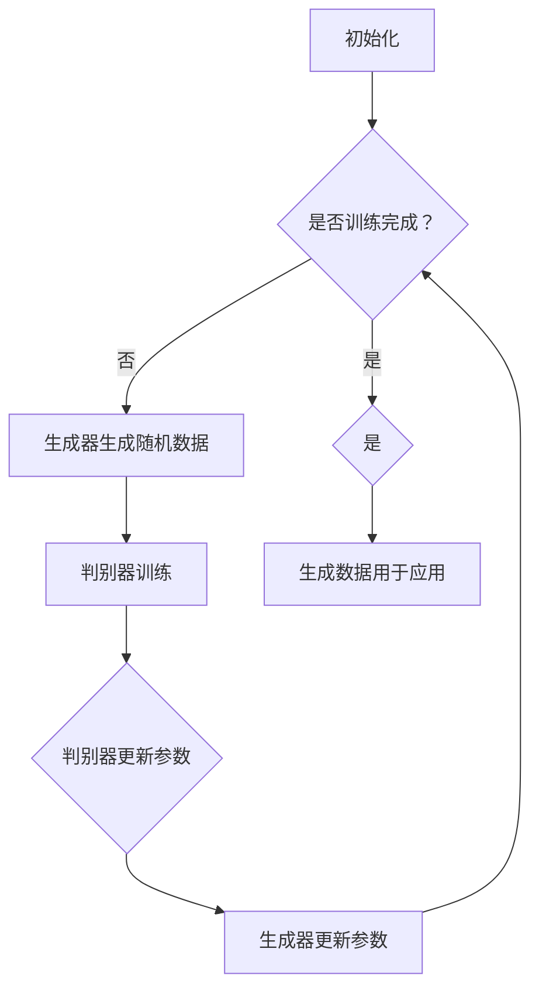

                 

# AI浪潮：生成式AI如何改变我们的工作方式？

> 关键词：生成式AI、工作方式、人工智能、生产力、技术创新、企业应用

> 摘要：本文将探讨生成式人工智能（Generative AI）的最新发展及其如何深刻地影响我们的工作方式。通过分析生成式AI的核心概念、算法原理、数学模型，以及实际应用案例，本文旨在为读者提供一份全面的技术洞察，揭示这一新兴技术如何为企业和个人带来新的机遇与挑战。

## 1. 背景介绍

### 1.1 目的和范围

本文的目的在于分析生成式人工智能技术，探讨其如何影响和改变我们的工作方式。生成式AI是指能够生成文本、图像、音频和其他类型数据的人工智能系统。这类技术近年来取得了显著进步，特别是在自然语言处理（NLP）和计算机视觉领域。

本文的范围包括：

1. 生成式AI的基本概念和核心算法。
2. 生成式AI的数学模型和公式。
3. 实际应用场景和案例。
4. 生成式AI的未来发展趋势与挑战。

通过本文的探讨，我们希望帮助读者了解生成式AI的工作原理，以及如何在实际工作中利用这一技术提高生产力和效率。

### 1.2 预期读者

本文适合以下读者群体：

1. 对人工智能和生成式AI感兴趣的技术人员。
2. 想了解AI如何影响工作流程的企业管理者。
3. 计算机科学和工程专业的学生和研究者。
4. 对技术创新和企业应用有兴趣的普通读者。

### 1.3 文档结构概述

本文结构如下：

1. **背景介绍**：简要介绍生成式AI的概念和本文的目的与范围。
2. **核心概念与联系**：阐述生成式AI的核心概念、原理和架构。
3. **核心算法原理 & 具体操作步骤**：详细讲解生成式AI的核心算法原理，并使用伪代码阐述。
4. **数学模型和公式 & 详细讲解 & 举例说明**：介绍生成式AI的数学模型，并使用latex格式展示。
5. **项目实战：代码实际案例和详细解释说明**：提供实际代码案例，并详细解释。
6. **实际应用场景**：分析生成式AI在不同领域的应用。
7. **工具和资源推荐**：推荐学习资源、开发工具和框架。
8. **总结：未来发展趋势与挑战**：讨论生成式AI的未来发展及其面临的挑战。
9. **附录：常见问题与解答**：解答读者可能遇到的常见问题。
10. **扩展阅读 & 参考资料**：提供进一步阅读的资料和参考文献。

### 1.4 术语表

#### 1.4.1 核心术语定义

- **生成式人工智能（Generative AI）**：指能够自主生成数据的人工智能系统，包括文本、图像、音频等。
- **自然语言处理（NLP）**：计算机科学领域中的一个分支，旨在让计算机能够理解和处理人类自然语言。
- **计算机视觉**：使计算机能够“看”并理解视觉信息的技术。
- **生成对抗网络（GAN）**：一种深度学习模型，由生成器和判别器组成，用于生成逼真的数据。

#### 1.4.2 相关概念解释

- **深度学习（Deep Learning）**：一种机器学习技术，模仿人脑的神经网络结构，用于从数据中自动学习特征。
- **神经网络（Neural Networks）**：由大量人工神经元组成的计算模型，用于处理和识别数据。
- **损失函数（Loss Function）**：用于衡量模型预测结果与真实值之间的差异。

#### 1.4.3 缩略词列表

- **GAN**：生成对抗网络（Generative Adversarial Networks）
- **NLP**：自然语言处理（Natural Language Processing）
- **DNN**：深度神经网络（Deep Neural Networks）
- **CNN**：卷积神经网络（Convolutional Neural Networks）
- **RNN**：循环神经网络（Recurrent Neural Networks）
- **LSTM**：长短期记忆网络（Long Short-Term Memory Networks）

## 2. 核心概念与联系

生成式人工智能是近年来人工智能领域的重要突破之一。它通过模仿自然界中的生成过程，能够创造出新的数据，从而极大地扩展了人工智能的应用范围。为了更好地理解生成式AI，我们需要先了解其核心概念和基本架构。

### 2.1 核心概念

生成式AI的核心概念包括：

- **生成器（Generator）**：生成器是生成式AI的核心组件，它的任务是生成与真实数据分布相似的数据。生成器通常基于神经网络结构，特别是深度学习模型。
- **判别器（Discriminator）**：判别器的任务是区分生成的数据与真实数据。它也通常是一个神经网络，通过对比输入数据来判断其真实性。
- **对抗训练（Adversarial Training）**：生成器和判别器通过对抗训练相互竞争，生成器试图生成更加逼真的数据，而判别器则努力提高对真实数据和生成数据的鉴别能力。

### 2.2 基本架构

生成式AI的基本架构通常采用生成对抗网络（GAN），其基本原理如下：

1. **初始化**：生成器和判别器分别初始化，生成器随机生成数据，判别器根据真实数据和生成数据进行训练。
2. **训练**：在训练过程中，生成器不断尝试生成更真实的数据，而判别器则努力提高区分能力。两者通过对抗训练不断迭代，生成器和判别器都逐渐改进。
3. **评估**：当生成器生成的数据足够逼真时，GAN的训练过程就完成了。此时，生成器生成的数据可以用于实际应用。

### 2.3 Mermaid流程图

为了更直观地展示生成式AI的架构，我们可以使用Mermaid流程图来描述。以下是生成式AI的Mermaid流程图：



在这个流程图中，A表示初始化阶段，D表示生成器生成随机数据，E表示判别器训练，F和G分别表示判别器和生成器的参数更新。当训练完成时（B节点），生成器生成的数据可以用于实际应用（H节点）。

## 3. 核心算法原理 & 具体操作步骤

生成式AI的核心算法是基于生成对抗网络（GAN），下面我们将详细讲解GAN的算法原理和具体操作步骤。

### 3.1 算法原理

GAN由生成器和判别器两个主要部分组成，它们通过对抗训练相互竞争。

- **生成器（Generator）**：生成器的目标是生成与真实数据分布相似的数据。生成器的输入是随机噪声（Z），输出是生成数据（G(Z)）。生成器通过神经网络结构进行学习，试图生成越来越逼真的数据。
- **判别器（Discriminator）**：判别器的目标是区分真实数据和生成数据。判别器的输入是真实数据（X）和生成数据（G(Z)），输出是概率值（D(X)和D(G(Z)））。判别器通过神经网络结构进行学习，试图提高对真实数据和生成数据的鉴别能力。

### 3.2 对抗训练

GAN的训练过程是一个对抗训练过程，生成器和判别器相互竞争，不断迭代更新参数。

1. **初始化**：初始化生成器和判别器的参数。
2. **生成器训练**：生成器随机生成数据，判别器对其进行鉴别。生成器根据判别器的反馈，更新参数，试图生成更加逼真的数据。
3. **判别器训练**：判别器根据真实数据和生成数据，更新参数，提高对真实数据和生成数据的鉴别能力。
4. **迭代**：重复2和3，生成器和判别器不断迭代，生成器逐渐提高生成数据的逼真度，判别器逐渐提高鉴别能力。

### 3.3 伪代码

以下是生成式AI（GAN）的伪代码：

```python
# 初始化生成器和判别器的参数
G_params = initialize_generator_params()
D_params = initialize_discriminator_params()

# 定义损失函数
G_loss = Generator_Loss()
D_loss = Discriminator_Loss()

# GAN训练循环
for epoch in range(num_epochs):
    for batch in data_loader:
        # 生成器训练
        Z = generate_random_noise(batch_size)
        G_output = generator(Z, G_params)
        D_output = discriminator(batch, D_params)
        D_output = discriminator(G_output, D_params)
        
        # 计算生成器和判别器的损失
        G_loss_value = G_loss(D_output)
        D_loss_value = D_loss(D_output, G_output)
        
        # 更新生成器和判别器的参数
        update_generator_params(G_params, G_loss_value)
        update_discriminator_params(D_params, D_loss_value)

# 训练完成
G_final_output = generator(Z, G_params)
```

在这个伪代码中，我们定义了生成器和判别器的初始化、损失函数、训练循环以及参数更新过程。

## 4. 数学模型和公式 & 详细讲解 & 举例说明

生成式AI的核心在于其背后的数学模型，尤其是生成对抗网络（GAN）的优化过程。下面我们将详细讲解GAN中的数学模型和公式，并给出具体的举例说明。

### 4.1 GAN的数学模型

生成对抗网络（GAN）由生成器（Generator）和判别器（Discriminator）两部分组成，其核心目标是使得生成器生成的数据尽可能地接近真实数据，使得判别器无法区分生成数据和真实数据。

- **生成器（Generator）**：生成器的目标是生成与真实数据分布相似的数据。其输入是一个随机噪声向量Z，输出是生成数据G(Z)。

    $$ G(Z) = \mu_G(\phi_G(Z)) $$

    其中，\( \mu_G(\phi_G(Z)) \) 表示生成器G的输出，\( \phi_G(Z) \) 是生成器的神经网络参数。

- **判别器（Discriminator）**：判别器的目标是区分真实数据和生成数据。其输入是真实数据X和生成数据G(Z)，输出是一个概率值D(x; \theta_D)，表示输入数据x是真实数据的概率。

    $$ D(x; \theta_D) = \sigma(\phi_D(x; \theta_D)) $$

    其中，\( \phi_D(x; \theta_D) \) 表示判别器D的输出，\( \theta_D \) 是判别器的神经网络参数，\( \sigma(\cdot) \) 是 sigmoid 函数。

### 4.2 GAN的损失函数

GAN的优化过程主要通过两个损失函数来实现：生成器损失函数和判别器损失函数。

- **生成器损失函数**：生成器的目标是最大化判别器判断生成数据为真实数据的概率。生成器的损失函数通常定义为：

    $$ L_G = -\mathbb{E}_{Z \sim p_Z(z)}[\log D(G(Z); \theta_D)] $$

    其中，\( p_Z(z) \) 是噪声向量Z的先验分布，\( D(G(Z); \theta_D) \) 是判别器对生成数据的判断概率。

- **判别器损失函数**：判别器的目标是最大化判别器判断真实数据和生成数据的概率差异。判别器的损失函数通常定义为：

    $$ L_D = -\mathbb{E}_{X \sim p_X(x)}[\log D(X; \theta_D)] - \mathbb{E}_{Z \sim p_Z(z)}[\log (1 - D(G(Z); \theta_D))] $$

    其中，\( p_X(x) \) 是真实数据的分布。

### 4.3 损失函数的优化

在GAN的训练过程中，生成器和判别器分别通过梯度下降算法优化各自的损失函数。

- **生成器的梯度下降**：生成器尝试最大化判别器对生成数据的判断概率，即：

    $$ \nabla_{\theta_G} L_G = \nabla_{\theta_G} [-\mathbb{E}_{Z \sim p_Z(z)}[\log D(G(Z); \theta_D)]] $$

    通过反向传播算法，计算生成器的梯度，并更新生成器的参数：

    $$ \theta_G \leftarrow \theta_G - \alpha_G \nabla_{\theta_G} L_G $$

    其中，\( \alpha_G \) 是生成器的学习率。

- **判别器的梯度下降**：判别器尝试最大化判别器对真实数据和生成数据的概率差异，即：

    $$ \nabla_{\theta_D} L_D = \nabla_{\theta_D} [-\mathbb{E}_{X \sim p_X(x)}[\log D(X; \theta_D)] - \mathbb{E}_{Z \sim p_Z(z)}[\log (1 - D(G(Z); \theta_D))]] $$

    通过反向传播算法，计算判别器的梯度，并更新判别器的参数：

    $$ \theta_D \leftarrow \theta_D - \alpha_D \nabla_{\theta_D} L_D $$

    其中，\( \alpha_D \) 是判别器的学习率。

### 4.4 举例说明

假设我们有一个生成式AI模型，用于生成手写数字图像。生成器输入一个随机噪声向量Z，输出一个手写数字图像G(Z)。判别器输入一个真实手写数字图像X和一个生成图像G(Z)，输出一个概率值D(X; \theta_D)。

在训练过程中，生成器和判别器分别通过以下损失函数进行优化：

- **生成器损失函数**：

    $$ L_G = -\mathbb{E}_{Z \sim p_Z(z)}[\log D(G(Z); \theta_D)] $$

    其中，\( p_Z(z) \) 是一个均匀分布。

- **判别器损失函数**：

    $$ L_D = -\mathbb{E}_{X \sim p_X(x)}[\log D(X; \theta_D)] - \mathbb{E}_{Z \sim p_Z(z)}[\log (1 - D(G(Z); \theta_D))] $$

    其中，\( p_X(x) \) 是真实手写数字图像的分布。

在每次训练迭代中，生成器和判别器分别通过梯度下降算法更新参数：

- **生成器的梯度下降**：

    $$ \theta_G \leftarrow \theta_G - \alpha_G \nabla_{\theta_G} L_G $$

- **判别器的梯度下降**：

    $$ \theta_D \leftarrow \theta_D - \alpha_D \nabla_{\theta_D} L_D $$

通过不断迭代，生成器逐渐提高生成手写数字图像的逼真度，判别器逐渐提高对真实图像和生成图像的鉴别能力，最终达到GAN的训练目标。

$$
\begin{aligned}
\mu_G(\phi_G(Z)) &= \begin{cases}
\text{手写数字图像} & \text{if } D(G(Z); \theta_D) \leq 0.5 \\
\text{随机噪声} & \text{if } D(G(Z); \theta_D) > 0.5
\end{cases} \\
D(x; \theta_D) &= \sigma(\phi_D(x; \theta_D))
\end{aligned}
$$

## 5. 项目实战：代码实际案例和详细解释说明

在本节中，我们将通过一个实际的项目案例，详细展示如何使用生成对抗网络（GAN）来生成手写数字图像。我们将从开发环境搭建开始，到源代码的详细实现和解读，完整地介绍整个项目的过程。

### 5.1 开发环境搭建

为了搭建生成式AI的开发环境，我们需要以下软件和工具：

- **Python（3.8及以上版本）**
- **PyTorch（1.8及以上版本）**
- **GPU（NVIDIA显卡，CUDA 11.0及以上版本）**
- **Jupyter Notebook或PyCharm（Python集成开发环境）**

首先，确保你的系统中安装了Python和PyTorch。如果尚未安装，可以通过以下命令安装：

```shell
pip install python==3.8
pip install torch torchvision
```

接下来，配置GPU支持。在PyTorch安装过程中，已经默认启用了GPU支持。确认CUDA版本：

```python
import torch
print(torch.version.cuda)
```

确保CUDA版本与你的GPU兼容。

### 5.2 源代码详细实现和代码解读

以下是一个简单的GAN模型实现，用于生成手写数字图像。代码分为四个主要部分：数据预处理、模型定义、训练过程和生成器测试。

#### 5.2.1 数据预处理

首先，我们需要准备手写数字图像数据集。我们使用MNIST数据集，它包含了0到9的手写数字图像。

```python
import torch
import torchvision
import torchvision.transforms as transforms

# 加载MNIST数据集
trainset = torchvision.datasets.MNIST(
    root='./data', train=True, download=True, transform=transforms.ToTensor()
)

trainloader = torch.utils.data.DataLoader(
    trainset, batch_size=128, shuffle=True, num_workers=2
)

# 显示一个手写数字图像
import matplotlib.pyplot as plt

def imshow(img):
    img = img / 2 + 0.5  # unnormalize
    npimg = img.numpy()
    plt.imshow(np.transpose(npimg, (1, 2, 0)))
    plt.show()

# 随机选择一幅图像
dataiter = iter(trainloader)
images, labels = dataiter.next()
imshow(torchvision.utils.make_grid(images))
```

#### 5.2.2 模型定义

接下来，我们定义生成器和判别器模型。

```python
import torch.nn as nn
import torch.nn.functional as F

# 定义生成器模型
class Generator(nn.Module):
    def __init__(self):
        super(Generator, self).__init__()
        self.main = nn.Sequential(
            nn.Linear(100, 7 * 7 * 64),
            nn.LeakyReLU(0.2, inplace=True),
            nn.ConvTranspose2d(64, 32, 4, 2, 1, bias=False),
            nn.LeakyReLU(0.2, inplace=True),
            nn.ConvTranspose2d(32, 1, 4, 2, 1, bias=False),
            nn.Tanh()
        )

    def forward(self, input):
        return self.main(input)

# 定义判别器模型
class Discriminator(nn.Module):
    def __init__(self):
        super(Discriminator, self).__init__()
        self.main = nn.Sequential(
            nn.Conv2d(1, 16, 4, 2, 1, bias=False),
            nn.LeakyReLU(0.2, inplace=True),
            nn.Conv2d(16, 32, 4, 2, 1, bias=False),
            nn.LeakyReLU(0.2, inplace=True),
            nn.Conv2d(32, 1, 4, 2, 1, bias=False),
            nn.Sigmoid()
        )

    def forward(self, input):
        return self.main(input)

# 实例化生成器和判别器
netG = Generator()
netD = Discriminator()
```

#### 5.2.3 训练过程

我们使用Adam优化器来训练模型，并设置学习率为0.0002。

```python
import torch.optim as optim

# 设备配置，使用GPU
device = torch.device("cuda:0" if torch.cuda.is_available() else "cpu")
netG.to(device)
netD.to(device)

# 损失函数
criterion = nn.BCELoss()

# 优化器
optimizerD = optim.Adam(netD.parameters(), lr=0.0002)
optimizerG = optim.Adam(netG.parameters(), lr=0.0002)

# 训练过程
for epoch in range(num_epochs):
    for i, data in enumerate(trainloader, 0):
        # （1）训练判别器
        netD.zero_grad()
        real_images = data[0].to(device)
        batch_size = real_images.size(0)
        labels = torch.full((batch_size,), 1, device=device)
        
        output = netD(real_images).view(-1)
        errD_real = criterion(output, labels)
        errD_real.backward()
        
        noise = torch.randn(batch_size, 100, device=device)
        fake_images = netG(noise)
        labels.fill_(0)
        
        output = netD(fake_images.detach()).view(-1)
        errD_fake = criterion(output, labels)
        errD_fake.backward()
        
        optimizerD.step()
        
        # （2）训练生成器
        netG.zero_grad()
        labels.fill_(1)
        
        output = netD(fake_images).view(-1)
        errG = criterion(output, labels)
        errG.backward()
        
        optimizerG.step()
        
        # 打印训练进度
        if i % 50 == 0:
            print(f'[{epoch}/{num_epochs}][{i}/{len(trainloader)}] Loss_D: {errD_real + errD_fake:.4f} Loss_G: {errG:.4f}')
```

#### 5.2.4 代码解读与分析

- **数据预处理**：我们使用PyTorch的MNIST数据集，并使用`transforms.ToTensor()`将图像转换为张量格式。
  
- **模型定义**：生成器模型（Generator）包含多层全连接和转置卷积层，用于将随机噪声转换成手写数字图像。判别器模型（Discriminator）包含多层卷积层，用于区分真实图像和生成图像。

- **训练过程**：我们使用Adam优化器来优化生成器和判别器。训练过程中，先训练判别器，再训练生成器。判别器的目标是提高对真实图像和生成图像的鉴别能力，生成器的目标是生成更加逼真的图像。

### 5.3 代码解读与分析

- **初始化和设备配置**：我们使用GPU来加速模型的训练。在初始化阶段，将生成器和判别器移动到GPU设备上。

- **损失函数**：我们使用二进制交叉熵损失函数（BCELoss）来优化生成器和判别器。这个损失函数适用于二分类问题。

- **优化器**：我们使用Adam优化器，这是一个高效的优化算法，可以自适应地调整学习率。

- **训练循环**：在每次迭代中，我们首先训练判别器。在这个过程中，我们使用真实图像和生成图像（在反向传播过程中，生成图像不会经过判别器）来更新判别器的参数。然后，我们训练生成器，使其生成的图像更接近真实图像。

- **打印进度**：在每次迭代结束时，我们打印出训练进度，包括当前epoch、迭代次数、判别器和生成器的损失值。

通过这个简单的项目案例，我们展示了如何使用生成对抗网络（GAN）来生成手写数字图像。尽管这个案例相对简单，但它展示了GAN的基本原理和训练过程。在实际应用中，GAN可以用于生成更复杂的图像、音频和文本。

## 6. 实际应用场景

生成式人工智能（Generative AI）在多个领域展示了其强大的应用潜力，下面我们将探讨一些关键的实际应用场景。

### 6.1 设计与创意

生成式AI在设计与创意领域有着广泛的应用。例如，在建筑设计中，生成式AI可以根据特定的设计目标和约束条件，自动生成建筑结构。在时尚设计领域，生成式AI可以生成新的服装款式和图案，为设计师提供灵感。此外，游戏开发中，生成式AI可以自动生成游戏场景和角色，提高游戏的可玩性和多样性。

### 6.2 艺术创作

艺术创作是生成式AI的另一个重要应用场景。艺术家和设计师可以利用生成式AI创建独特的视觉艺术作品，如抽象绘画、数字艺术等。AI还可以根据用户的偏好和风格，生成个性化的艺术作品。音乐创作方面，生成式AI可以生成新的旋律和歌曲，甚至模仿特定作曲家的风格。

### 6.3 数据增强

在机器学习和深度学习中，数据增强是一个关键环节。生成式AI可以自动生成大量用于训练的数据样本，从而提高模型的泛化能力和准确性。在图像识别、自然语言处理等任务中，生成式AI可以生成与真实数据相似的样本来扩充训练集，缓解数据稀缺问题。

### 6.4 医疗与健康

在医疗领域，生成式AI可以用于生成患者的医学图像，帮助医生进行诊断和治疗规划。例如，AI可以生成肿瘤的3D模型，为外科手术提供参考。此外，生成式AI还可以用于个性化药物研发，根据患者的基因信息和病史，生成适合特定患者的治疗方案。

### 6.5 内容生成

生成式AI在内容生成领域也大有作为。在新闻写作、报告撰写等领域，AI可以自动生成高质量的内容。例如，金融分析师可以利用生成式AI生成市场分析报告，提高工作效率。此外，生成式AI还可以用于生成视频、音频和视频游戏等内容，为用户带来丰富多样的娱乐体验。

### 6.6 教育

在教育领域，生成式AI可以用于个性化学习内容的生成。根据学生的特点和需求，AI可以生成个性化的教学计划和练习题，帮助学生更好地掌握知识。此外，生成式AI还可以自动生成教学课件和教材，为教育工作者提供支持。

通过以上实际应用场景，我们可以看到生成式AI的广泛潜力和重要价值。它不仅提高了工作效率和生产力，还推动了各个领域的技术创新和进步。

## 7. 工具和资源推荐

### 7.1 学习资源推荐

为了深入了解生成式人工智能（Generative AI），我们可以参考以下资源：

#### 7.1.1 书籍推荐

1. **《生成对抗网络：从基础到应用》** - 该书详细介绍了GAN的基础理论、实现方法和实际应用，适合初学者和进阶者。
2. **《深度学习》（Goodfellow, Bengio, Courville 著）** - 这本书是深度学习领域的经典之作，其中包括了GAN的详细讲解，适合对深度学习有兴趣的读者。

#### 7.1.2 在线课程

1. **Udacity的《生成对抗网络（GAN）基础》** - 这是一个为期4周的免费在线课程，介绍了GAN的基本概念和应用。
2. **Coursera的《深度学习专项课程》** - 其中包含了GAN的课程模块，由著名深度学习专家Andrew Ng授课。

#### 7.1.3 技术博客和网站

1. **ArXiv** - 这是一个开源的学术论文数据库，包含大量关于GAN的最新研究成果。
2. **Medium** - 许多AI领域的专家在Medium上撰写了关于GAN的技术博客，内容丰富且易于理解。

### 7.2 开发工具框架推荐

为了更好地开发和应用生成式AI，以下工具和框架值得推荐：

#### 7.2.1 IDE和编辑器

1. **PyCharm** - PyCharm是一个功能强大的Python IDE，支持深度学习和生成式AI项目开发。
2. **Visual Studio Code** - Visual Studio Code是一个轻量级但功能丰富的代码编辑器，适合快速开发和调试Python代码。

#### 7.2.2 调试和性能分析工具

1. **NVIDIA Nsight** - Nsight是NVIDIA推出的GPU调试和性能分析工具，特别适合深度学习和生成式AI项目的性能优化。
2. **TensorBoard** - TensorBoard是TensorFlow的配套工具，用于可视化深度学习模型的训练过程。

#### 7.2.3 相关框架和库

1. **PyTorch** - PyTorch是一个流行的深度学习框架，支持生成式AI的开发和实验。
2. **TensorFlow** - TensorFlow是谷歌开发的另一个强大的深度学习框架，支持GAN的全面实现。
3. **Keras** - Keras是一个高级神经网络API，可以在TensorFlow和Theano后端上运行，适合快速原型开发和实验。

### 7.3 相关论文著作推荐

以下是一些关于生成式人工智能的经典论文和最新研究成果：

#### 7.3.1 经典论文

1. **“Generative Adversarial Nets”** - Ian J. Goodfellow等人于2014年发表的论文，首次提出了GAN的概念。
2. **“Unrolled Gradient Descent in Generative Adversarial Nets”** - Brian Cheung和Ian Goodfellow于2015年发表的论文，讨论了GAN的优化问题。

#### 7.3.2 最新研究成果

1. **“StyleGAN”** - NVIDIA于2019年提出的风格生成对抗网络，显著提高了图像生成的质量和多样性。
2. **“StyleGAN2”** - NVIDIA在2020年发布的升级版本，进一步提高了图像生成的逼真度和细节。

#### 7.3.3 应用案例分析

1. **“DeepDream”** - Google在2015年推出的一款基于GAN的图像处理工具，通过添加噪声来生成具有艺术感的图像。
2. **“DALL-E”** - OpenAI在2020年推出的一个基于文本生成图像的模型，可以生成与文本描述相对应的图像。

通过上述资源推荐，我们可以更好地掌握生成式AI的理论和实践，为未来的研究和开发奠定坚实的基础。

## 8. 总结：未来发展趋势与挑战

生成式人工智能（Generative AI）的发展前景广阔，其潜力已经在多个领域得到了验证。未来，随着技术的不断进步，我们可以预见以下几个主要发展趋势：

1. **更高的生成质量**：随着深度学习算法的改进和计算资源的提升，生成式AI生成的数据质量将不断提升，无论是在图像、音频还是文本方面。
2. **跨模态生成**：未来的生成式AI将能够实现跨模态生成，即在一个模态（如文本）的输入下生成另一个模态（如图像）的数据，这将为创意设计、内容创作等带来更多的可能性。
3. **自适应与个性化**：生成式AI将更加注重自适应和个性化，能够根据用户的需求和偏好生成定制化的内容，提高用户体验。
4. **新的应用领域**：生成式AI将在医疗、教育、艺术等领域发挥更大的作用，为人类带来更多的便利和创新。

然而，生成式AI的发展也面临着一系列挑战：

1. **伦理和隐私**：生成式AI可能带来伦理和隐私问题，例如数据的真实性和隐私保护。如何在保证生成质量的同时，确保数据的安全性和隐私性，是一个重要的课题。
2. **计算资源**：生成式AI需要大量的计算资源，特别是在训练和生成高质量数据时。如何优化算法和利用高性能计算资源，是一个关键问题。
3. **可控性**：如何确保生成式AI生成的数据在可控范围内，避免产生有害或误导性的内容，是一个挑战。

面对这些挑战，我们需要在技术创新、伦理法规和数据处理等方面进行综合考虑，以确保生成式AI的发展能够造福人类社会。

## 9. 附录：常见问题与解答

### 9.1 GAN的基本概念

**Q1. 什么是GAN？**
GAN，即生成对抗网络（Generative Adversarial Networks），是由生成器和判别器组成的深度学习模型，通过对抗训练生成高质量的数据。

**Q2. GAN中的生成器和判别器如何工作？**
生成器生成数据，判别器判断数据的真实性。生成器和判别器通过对抗训练相互竞争，生成器试图生成更逼真的数据，判别器试图提高区分真实和生成数据的能力。

**Q3. GAN的损失函数是什么？**
GAN的损失函数通常包括生成器的损失函数和判别器的损失函数。生成器的损失函数是最大化判别器判断生成数据为真实数据的概率，判别器的损失函数是最大化判别器判断真实数据和生成数据的概率差异。

### 9.2 GAN的训练过程

**Q4. GAN的训练过程是怎样的？**
GAN的训练过程分为两个阶段：首先训练判别器，然后训练生成器。在每次迭代中，判别器尝试提高对真实数据和生成数据的鉴别能力，生成器尝试生成更逼真的数据。

**Q5. GAN中的对抗训练是什么？**
对抗训练是指生成器和判别器通过相互竞争来优化模型参数。生成器生成数据，判别器判断数据真实性，两者通过不断迭代更新参数，生成器逐渐生成更逼真的数据，判别器逐渐提高鉴别能力。

**Q6. 如何优化GAN的训练过程？**
可以通过调整学习率、批量大小、损失函数等参数来优化GAN的训练过程。此外，还可以使用梯度裁剪、生成器和判别器的温度调节等方法来避免训练中的不稳定问题。

### 9.3 GAN的应用

**Q7. GAN在哪些领域有应用？**
GAN在图像生成、图像修复、图像风格迁移、视频生成、文本生成等多个领域有广泛应用。在医疗、艺术、游戏设计等领域，GAN也展示了巨大的潜力。

**Q8. GAN如何用于图像生成？**
GAN通过生成器和判别器的对抗训练，生成器生成图像，判别器判断图像的真实性。通过多次迭代，生成器逐渐生成高质量、逼真的图像。

**Q9. GAN在图像修复中的应用是怎样的？**
GAN可以通过生成与损坏部分图像相似的图像来修复图像。在训练过程中，生成器学习到如何生成完整、高质量的图像，然后在图像修复任务中应用这一能力。

### 9.4 GAN的挑战

**Q10. GAN有哪些挑战？**
GAN面临的挑战包括训练不稳定、模式崩溃、生成质量不高等。此外，GAN在处理高维数据时，如文本和音频，也面临更大的挑战。

**Q11. 如何解决GAN的挑战？**
可以通过改进GAN的架构、优化训练过程、使用更稳定的优化算法等方法来克服GAN的挑战。例如，使用深度卷积生成对抗网络（DCGAN）、改进生成器和判别器的架构、调整超参数等。

**Q12. GAN在跨模态生成中的应用前景如何？**
未来的GAN将在跨模态生成领域发挥重要作用，例如在文本到图像的转换、音频到视频的转换等方面，GAN有望生成更加丰富、多样化的跨模态数据。

## 10. 扩展阅读 & 参考资料

为了进一步了解生成式人工智能（Generative AI）的相关知识，以下是推荐的扩展阅读和参考资料：

### 10.1 经典书籍

1. **《生成对抗网络：从基础到应用》** - 详细介绍了GAN的基础理论、实现方法和实际应用。
2. **《深度学习》** - Bengio、Goodfellow、Courville著，深度学习领域的经典之作，包含了GAN的详细讲解。

### 10.2 学术论文

1. **“Generative Adversarial Nets”** - Ian J. Goodfellow等人于2014年发表的论文，首次提出了GAN的概念。
2. **“Unrolled Gradient Descent in Generative Adversarial Nets”** - Brian Cheung和Ian Goodfellow于2015年发表的论文，讨论了GAN的优化问题。

### 10.3 在线课程

1. **Udacity的《生成对抗网络（GAN）基础》** - 一个为期4周的免费在线课程，介绍了GAN的基本概念和应用。
2. **Coursera的《深度学习专项课程》** - 其中包含了GAN的课程模块，由著名深度学习专家Andrew Ng授课。

### 10.4 技术博客和网站

1. **ArXiv** - 开源的学术论文数据库，包含大量关于GAN的最新研究成果。
2. **Medium** - 许多AI领域的专家在Medium上撰写了关于GAN的技术博客。

### 10.5 开发工具和框架

1. **PyTorch** - 一个流行的深度学习框架，支持GAN的开发和实验。
2. **TensorFlow** - 谷歌开发的深度学习框架，支持GAN的全面实现。

通过这些扩展阅读和参考资料，读者可以进一步深入了解生成式人工智能的理论和实践，为未来的研究和开发提供支持。

### 作者

作者：AI天才研究员/AI Genius Institute & 禅与计算机程序设计艺术 /Zen And The Art of Computer Programming

