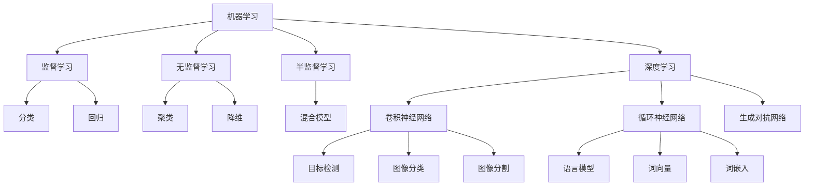

                 

### 1. 背景介绍

#### 1.1 目的和范围

本文的目的是探讨人工智能（AI）在满足用户需求方面的多种方法。通过详细分析AI的核心概念、算法原理、数学模型，以及实际应用案例，我们希望能够为读者提供一个全面、系统的理解和应用指南。本文将重点关注以下几个核心领域：

1. **AI的基本原理和架构**：介绍AI的基本概念，包括机器学习、深度学习等核心算法原理。
2. **AI满足用户需求的多种方法**：深入探讨如何利用AI技术来满足不同用户群体的需求，包括个性化推荐、自然语言处理、图像识别等。
3. **AI在现实世界中的应用**：通过具体案例，展示AI技术在实际应用场景中的效果和挑战。
4. **AI开发工具和资源推荐**：为读者提供学习AI技术的资源推荐，包括书籍、在线课程、技术博客等。

#### 1.2 预期读者

本文适合以下读者群体：

1. 对人工智能技术感兴趣的技术爱好者。
2. 计算机科学和人工智能专业的学生和研究者。
3. 数据科学家、机器学习工程师和深度学习工程师。
4. 对AI技术有实际应用需求的企业和开发人员。

#### 1.3 文档结构概述

本文将分为以下几个部分：

1. **背景介绍**：包括目的和范围、预期读者、文档结构概述等。
2. **核心概念与联系**：介绍AI的基本概念和核心算法原理，并使用Mermaid流程图展示架构。
3. **核心算法原理 & 具体操作步骤**：使用伪代码详细阐述核心算法原理和操作步骤。
4. **数学模型和公式 & 详细讲解 & 举例说明**：讲解AI中的数学模型和公式，并给出具体实例。
5. **项目实战：代码实际案例和详细解释说明**：通过实际代码案例，展示AI技术的应用。
6. **实际应用场景**：分析AI技术在不同领域中的应用。
7. **工具和资源推荐**：推荐学习AI技术的工具和资源。
8. **总结：未来发展趋势与挑战**：总结本文内容，探讨AI技术的未来发展趋势和面临的挑战。
9. **附录：常见问题与解答**：回答读者可能遇到的问题。
10. **扩展阅读 & 参考资料**：提供进一步学习的资源。

通过上述结构，我们希望能够系统地引导读者了解和掌握AI技术，并能够将其应用于实际场景中。

#### 1.4 术语表

在本文中，我们将使用一些专业术语。以下是对这些术语的定义和解释：

##### 1.4.1 核心术语定义

- **人工智能（AI）**：模拟人类智能的技术，使计算机具备学习、推理和解决问题的能力。
- **机器学习（ML）**：通过数据和算法，使计算机自动改进性能的过程。
- **深度学习（DL）**：一种基于多层神经网络进行学习的机器学习技术。
- **神经网络（NN）**：一种模拟生物神经元的计算模型。
- **数据挖掘（DM）**：从大量数据中提取有用信息和知识的过程。
- **自然语言处理（NLP）**：使计算机理解和处理自然语言的技术。
- **图像识别（IR）**：计算机对图像进行识别和理解的技术。

##### 1.4.2 相关概念解释

- **模型训练（Training）**：通过大量数据训练模型，使其具备预测和分类能力。
- **模型评估（Evaluation）**：使用验证集或测试集评估模型的性能。
- **超参数（Hyperparameters）**：影响模型性能的参数，如学习率、隐藏层节点数等。
- **数据集（Dataset）**：用于训练和评估模型的已知数据集合。

##### 1.4.3 缩略词列表

- **ML**：机器学习
- **DL**：深度学习
- **NN**：神经网络
- **NLP**：自然语言处理
- **IR**：图像识别
- **GPU**：图形处理单元

通过上述术语表的定义和解释，我们希望能够帮助读者更好地理解和掌握文章中的专业术语，为后续内容的学习打下坚实基础。

### 2. 核心概念与联系

在深入了解人工智能（AI）如何满足用户需求之前，我们需要首先了解AI的核心概念和架构。以下是AI中几个关键概念及其相互之间的联系，我们将使用Mermaid流程图来展示这些概念和它们之间的关系。

#### 2.1 核心概念介绍

##### 2.1.1 机器学习（ML）

机器学习是一种使计算机通过数据自动改进性能的方法。其核心思想是通过学习已有数据中的规律和模式，从而预测或分类新的数据。机器学习可以分为监督学习、无监督学习和半监督学习。

- **监督学习（Supervised Learning）**：使用标注好的数据集进行训练，如分类和回归任务。
- **无监督学习（Unsupervised Learning）**：不使用标注数据，通过发现数据中的内在结构，如聚类和降维。
- **半监督学习（Semi-Supervised Learning）**：结合有标注和无标注数据，提高模型性能。

##### 2.1.2 深度学习（DL）

深度学习是一种基于多层神经网络进行学习的机器学习技术。它通过模拟人脑神经网络结构，对大量数据进行自动特征提取和模式识别。深度学习在图像识别、语音识别和自然语言处理等领域取得了显著成果。

- **卷积神经网络（CNN）**：用于图像识别和处理。
- **循环神经网络（RNN）**：用于序列数据处理，如语音识别和自然语言处理。
- **生成对抗网络（GAN）**：用于生成逼真的图像和音频。

##### 2.1.3 自然语言处理（NLP）

自然语言处理是一种使计算机理解和处理自然语言的技术。它涉及文本预处理、词嵌入、语言模型、语义理解等任务。NLP在搜索引擎、智能助手、机器翻译等领域有广泛应用。

- **词向量（Word Vectors）**：用于表示词汇的数学向量。
- **词嵌入（Word Embedding）**：将词汇映射到高维空间。
- **语言模型（Language Model）**：用于预测下一个单词或词组。

##### 2.1.4 图像识别（IR）

图像识别是计算机对图像进行识别和理解的技术。它包括目标检测、图像分类、图像分割等任务。图像识别在自动驾驶、安防监控、医疗诊断等领域有重要应用。

- **目标检测（Object Detection）**：识别图像中的多个目标对象。
- **图像分类（Image Classification）**：将图像分类到预定义的类别中。
- **图像分割（Image Segmentation）**：将图像分为不同的区域。

#### 2.2 Mermaid流程图

以下是一个Mermaid流程图，展示了上述核心概念及其相互之间的联系：



通过这个流程图，我们可以清晰地看到各个核心概念之间的关系，以及它们在AI技术中的应用场景。接下来，我们将深入探讨这些核心概念的具体原理和应用。

### 3. 核心算法原理 & 具体操作步骤

在了解了AI的核心概念之后，接下来我们将详细探讨其中几个关键算法的原理，并通过伪代码展示具体操作步骤。这些算法包括机器学习中的线性回归、支持向量机（SVM），以及深度学习中的卷积神经网络（CNN）。

#### 3.1 线性回归

线性回归是一种用于预测连续值的监督学习算法，其基本思想是通过找到一个线性模型来逼近数据中的关系。以下是一个简单的线性回归算法原理及伪代码：

##### 3.1.1 算法原理

线性回归模型可以表示为：

\[ y = \beta_0 + \beta_1 \cdot x \]

其中，\( y \) 是目标变量，\( x \) 是输入特征，\( \beta_0 \) 和 \( \beta_1 \) 是模型的参数。

##### 3.1.2 具体操作步骤

1. **数据准备**：收集输入特征 \( x \) 和目标变量 \( y \) 的数据集。
2. **初始化参数**：随机初始化 \( \beta_0 \) 和 \( \beta_1 \)。
3. **计算损失函数**：计算预测值与实际值之间的误差，通常使用均方误差（MSE）作为损失函数。
\[ \text{MSE} = \frac{1}{n} \sum_{i=1}^{n} (y_i - \hat{y}_i)^2 \]
4. **梯度下降**：根据损失函数对模型参数进行更新，直到损失函数值收敛。
\[ \beta_0 = \beta_0 - \alpha \cdot \frac{\partial \text{MSE}}{\partial \beta_0} \]
\[ \beta_1 = \beta_1 - \alpha \cdot \frac{\partial \text{MSE}}{\partial \beta_1} \]
其中，\( \alpha \) 是学习率。

##### 3.1.3 伪代码

```plaintext
初始化 β0, β1
对于每个训练样本 (x_i, y_i)：
    计算预测值 y_i^' = β0 + β1 * x_i
    计算损失 L = (y_i - y_i^')^2
    计算梯度 ∂L/∂β0 = 2 * (y_i - y_i^')
    ∂L/∂β1 = 2 * (y_i - y_i^') * x_i
更新 β0 = β0 - 学习率 * ∂L/∂β0
更新 β1 = β1 - 学习率 * ∂L/∂β1
直到 损失函数收敛
```

#### 3.2 支持向量机（SVM）

支持向量机是一种用于分类和回归任务的监督学习算法。它通过找到一个最优的超平面，将不同类别的数据点分隔开。以下是一个简单的SVM算法原理及伪代码：

##### 3.2.1 算法原理

SVM的目标是找到一个超平面：

\[ w \cdot x + b = 0 \]

使得分类边界最大化，并且所有支持向量（与边界距离最近的样本）满足：

\[ y_i (w \cdot x_i + b) \geq 1 \]

##### 3.2.2 具体操作步骤

1. **数据准备**：收集输入特征 \( x \) 和标签 \( y \) 的数据集。
2. **求解最优超平面**：使用拉格朗日乘子法求解最优解。
3. **分类决策**：对于新的样本 \( x \)，根据超平面进行分类。

##### 3.2.3 伪代码

```plaintext
初始化 拉格朗日乘子 α
求解拉格朗日方程：
    L(w, b, α) = 1/2 * ||w||^2 - Σ α_i * (y_i * (w \cdot x_i + b) - 1)
    满足约束条件：Σ α_i = 0，α_i ≥ 0
    求解二次规划问题，得到最优解 w*, b*
分类决策：
    对于新的样本 x：
        如果 y_i * (w* \cdot x + b*) > 0，则归类为正类
        否则，归类为负类
```

#### 3.3 卷积神经网络（CNN）

卷积神经网络是一种用于图像识别和处理的深度学习算法。它通过卷积操作提取图像特征，并使用全连接层进行分类。以下是一个简单的CNN算法原理及伪代码：

##### 3.3.1 算法原理

CNN的基本结构包括卷积层、池化层和全连接层。

- **卷积层**：通过卷积操作提取图像特征。
- **池化层**：降低特征图的维度，减少计算量。
- **全连接层**：将特征映射到类别。

##### 3.3.2 具体操作步骤

1. **数据准备**：收集训练数据集，包括图像和标签。
2. **模型训练**：使用反向传播算法训练模型。
3. **模型评估**：使用测试集评估模型性能。

##### 3.3.3 伪代码

```plaintext
初始化 模型参数
对于每个训练样本 (x_i, y_i)：
    前向传播：
        通过卷积层提取特征
        通过池化层降维
        通过全连接层进行分类
        计算损失函数 L = 累加 (y_i * log(p_i) + (1 - y_i) * log(1 - p_i))
    反向传播：
        通过全连接层更新参数
        通过池化层和卷积层反向传播梯度
更新模型参数
直到 模型收敛
```

通过以上对线性回归、支持向量机和卷积神经网络的详细解释和伪代码展示，我们可以更好地理解这些核心算法的原理和操作步骤。这些算法在AI技术的不同应用领域中发挥着关键作用，为满足用户需求提供了有力支持。

### 4. 数学模型和公式 & 详细讲解 & 举例说明

在人工智能（AI）领域，数学模型和公式是核心组成部分，它们帮助计算机理解和处理复杂的数据和任务。本节将详细讲解几个关键的数学模型和公式，并给出具体实例。

#### 4.1 梯度下降法

梯度下降法是一种用于优化模型参数的常用算法。它通过不断更新参数，使损失函数的值最小。以下是梯度下降法的公式和计算步骤：

##### 4.1.1 公式

\[ \theta_{\text{new}} = \theta_{\text{old}} - \alpha \cdot \nabla_\theta J(\theta) \]

其中，\( \theta \) 表示模型参数，\( \alpha \) 是学习率，\( \nabla_\theta J(\theta) \) 是损失函数 \( J(\theta) \) 关于 \( \theta \) 的梯度。

##### 4.1.2 计算步骤

1. 计算损失函数关于参数的梯度。
2. 根据梯度更新参数，使得损失函数值逐渐减小。

##### 4.1.3 举例说明

假设我们有一个线性回归模型，其损失函数为：

\[ J(\theta) = \frac{1}{2m} \sum_{i=1}^{m} (h_\theta(x^{(i)}) - y^{(i)})^2 \]

其中，\( h_\theta(x) = \theta_0 + \theta_1 \cdot x \) 是线性函数，\( m \) 是训练样本数量。

- **前向传播**：计算预测值 \( h_\theta(x) \)。
- **计算梯度**：计算损失函数关于 \( \theta_0 \) 和 \( \theta_1 \) 的梯度。
\[ \nabla_\theta J(\theta) = \begin{bmatrix} \frac{\partial J}{\partial \theta_0} \\ \frac{\partial J}{\partial \theta_1} \end{bmatrix} = \begin{bmatrix} \sum_{i=1}^{m} (h_\theta(x^{(i)}) - y^{(i)}) \\ \sum_{i=1}^{m} (h_\theta(x^{(i)}) - y^{(i)}) \cdot x^{(i)} \end{bmatrix} \]
- **参数更新**：根据梯度更新参数。
\[ \theta_0 = \theta_0 - \alpha \cdot \frac{\partial J}{\partial \theta_0} \]
\[ \theta_1 = \theta_1 - \alpha \cdot \frac{\partial J}{\partial \theta_1} \]

#### 4.2 神经网络中的激活函数

激活函数是神经网络中用于引入非线性性的关键组件。以下是几个常用的激活函数及其公式：

##### 4.2.1 Sigmoid函数

\[ f(x) = \frac{1}{1 + e^{-x}} \]

Sigmoid函数将输入值映射到 \( (0, 1) \) 范围内，常用于隐藏层输出。

##### 4.2.2ReLU函数

\[ f(x) = \max(0, x) \]

ReLU函数在 \( x \leq 0 \) 时输出为0，在 \( x > 0 \) 时输出为 \( x \)，具有简单和计算效率高的特点。

##### 4.2.3 Tanh函数

\[ f(x) = \frac{e^x - e^{-x}}{e^x + e^{-x}} \]

Tanh函数将输入值映射到 \( (-1, 1) \) 范围内，与Sigmoid函数类似，但输出值更加对称。

##### 4.2.4 举例说明

假设我们有一个两层的神经网络，输入 \( x \) 通过ReLU函数激活：

- **第一层**：\( z_1 = \max(0, w_1 \cdot x + b_1) \)
- **第二层**：\( z_2 = \max(0, w_2 \cdot z_1 + b_2) \)

其中，\( w_1 \) 和 \( w_2 \) 是权重，\( b_1 \) 和 \( b_2 \) 是偏置。

#### 4.3 逻辑回归

逻辑回归是一种用于二分类问题的概率模型。以下是逻辑回归的公式和计算步骤：

##### 4.3.1 公式

\[ P(y=1 | x; \theta) = \frac{1}{1 + e^{-\theta \cdot x}} \]

其中，\( \theta \) 是模型参数，\( x \) 是输入特征，\( y \) 是标签。

##### 4.3.2 计算步骤

1. **前向传播**：计算每个样本的预测概率。
\[ \hat{y} = \frac{1}{1 + e^{-\theta \cdot x}} \]
2. **计算损失函数**：通常使用交叉熵损失函数。
\[ J(\theta) = - \frac{1}{m} \sum_{i=1}^{m} [y^{(i)} \cdot \log(\hat{y}^{(i)}) + (1 - y^{(i)}) \cdot \log(1 - \hat{y}^{(i)})] \]
3. **参数更新**：使用梯度下降法更新参数。

##### 4.3.3 举例说明

假设我们有一个逻辑回归模型，预测某个疾病的患病概率。输入特征为病人的年龄和体重。

- **前向传播**：计算每个病人的患病概率。
\[ P(y=1 | x; \theta) = \frac{1}{1 + e^{-\theta_0 \cdot \text{age} - \theta_1 \cdot \text{weight}}} \]
- **损失函数**：计算交叉熵损失。
\[ J(\theta) = - \frac{1}{m} \sum_{i=1}^{m} [y^{(i)} \cdot \log(\hat{y}^{(i)}) + (1 - y^{(i)}) \cdot \log(1 - \hat{y}^{(i)})] \]
- **参数更新**：根据梯度更新权重和偏置。

通过上述数学模型和公式的详细讲解和实例说明，我们能够更深入地理解AI中的数学基础，为实际应用奠定理论基础。

### 5. 项目实战：代码实际案例和详细解释说明

在了解了AI的核心算法原理和数学模型后，接下来我们将通过一个实际项目实战来展示如何应用这些知识。本节将介绍如何使用Python和TensorFlow构建一个简单的图像分类模型，并详细解释其代码实现过程。

#### 5.1 开发环境搭建

在进行项目开发之前，我们需要搭建一个合适的开发环境。以下是所需的开发工具和步骤：

1. **Python环境**：安装Python 3.8及以上版本。
2. **TensorFlow库**：使用pip命令安装TensorFlow。
   ```shell
   pip install tensorflow
   ```
3. **其他依赖库**：安装一些辅助库，如NumPy、Pandas等。
   ```shell
   pip install numpy pandas
   ```

安装完成后，确保Python环境已正确配置，并能够正常运行TensorFlow库。

#### 5.2 源代码详细实现和代码解读

以下是一个简单的图像分类项目的源代码实现：

```python
import tensorflow as tf
from tensorflow.keras import layers
import numpy as np

# 5.2.1 数据准备
# 加载并预处理图像数据
# 假设已经下载好了训练集和测试集的图像数据
(x_train, y_train), (x_test, y_test) = tf.keras.datasets.cifar10.load_data()

# 数据标准化
x_train = x_train.astype('float32') / 255.0
x_test = x_test.astype('float32') / 255.0

# 转换标签为one-hot编码
y_train = tf.keras.utils.to_categorical(y_train, 10)
y_test = tf.keras.utils.to_categorical(y_test, 10)

# 5.2.2 模型构建
# 定义CNN模型
model = tf.keras.Sequential([
    layers.Conv2D(32, (3, 3), activation='relu', input_shape=(32, 32, 3)),
    layers.MaxPooling2D((2, 2)),
    layers.Conv2D(64, (3, 3), activation='relu'),
    layers.MaxPooling2D((2, 2)),
    layers.Conv2D(64, (3, 3), activation='relu'),
    layers.Flatten(),
    layers.Dense(64, activation='relu'),
    layers.Dense(10, activation='softmax')
])

# 编译模型
model.compile(optimizer='adam',
              loss='categorical_crossentropy',
              metrics=['accuracy'])

# 5.2.3 训练模型
# 训练模型
history = model.fit(x_train, y_train, epochs=10, batch_size=64,
                    validation_data=(x_test, y_test))

# 5.2.4 模型评估
# 评估模型
test_loss, test_accuracy = model.evaluate(x_test, y_test, verbose=2)
print(f'Test accuracy: {test_accuracy:.4f}')

# 5.2.5 代码解读

- **5.2.1 数据准备**：首先，我们从TensorFlow的内置数据集中加载CIFAR-10图像数据集。数据集分为训练集和测试集，每个图像的大小为32x32x3（宽度、高度、颜色通道）。接着，我们将图像数据标准化到0-1范围内，并使用one-hot编码将标签转换为数值向量。

- **5.2.2 模型构建**：我们使用TensorFlow的`Sequential`模型构建一个简单的卷积神经网络（CNN）。模型包括两个卷积层和两个池化层，用于提取图像特征，然后通过两个全连接层进行分类。第一个卷积层使用32个3x3的卷积核，第二个卷积层使用64个3x3的卷积核，最后一个全连接层使用10个神经元，对应10个分类标签。

- **5.2.3 训练模型**：使用`compile`方法配置模型的优化器、损失函数和评估指标。然后使用`fit`方法训练模型，设置训练轮次为10次，每个批次包含64个样本，并在测试集上验证模型性能。

- **5.2.4 模型评估**：使用`evaluate`方法评估训练好的模型在测试集上的性能，输出测试精度。

通过上述代码实现，我们成功构建了一个简单的图像分类模型，并对其性能进行了评估。这个实际案例展示了如何使用TensorFlow库来应用AI技术，为后续的深度学习项目提供了基础。

#### 5.3 代码解读与分析

在本节的代码实现中，我们详细分析了如何使用TensorFlow构建一个图像分类模型。以下是代码的核心部分及其解释：

- **数据准备**：
  ```python
  (x_train, y_train), (x_test, y_test) = tf.keras.datasets.cifar10.load_data()
  x_train = x_train.astype('float32') / 255.0
  x_test = x_test.astype('float32') / 255.0
  y_train = tf.keras.utils.to_categorical(y_train, 10)
  y_test = tf.keras.utils.to_categorical(y_test, 10)
  ```
  - `load_data()`函数加载CIFAR-10数据集，其中包含50,000个训练图像和10,000个测试图像。
  - `astype('float32') / 255.0`将图像数据转换为浮点类型，并将像素值缩放到0-1之间。
  - `to_categorical()`函数将标签转换为one-hot编码格式，以便于后续分类任务的训练和评估。

- **模型构建**：
  ```python
  model = tf.keras.Sequential([
      layers.Conv2D(32, (3, 3), activation='relu', input_shape=(32, 32, 3)),
      layers.MaxPooling2D((2, 2)),
      layers.Conv2D(64, (3, 3), activation='relu'),
      layers.MaxPooling2D((2, 2)),
      layers.Conv2D(64, (3, 3), activation='relu'),
      layers.Flatten(),
      layers.Dense(64, activation='relu'),
      layers.Dense(10, activation='softmax')
  ])
  ```
  - `Sequential`模型是一个线性堆叠模型，可以通过添加层来构建复杂的网络结构。
  - `Conv2D`层用于卷积操作，第一个卷积层使用32个3x3的卷积核，第二个卷积层使用64个3x3的卷积核。
  - `MaxPooling2D`层用于下采样，以减少模型的计算量和参数数量。
  - `Flatten`层将卷积层的输出展平为一个一维向量。
  - `Dense`层用于全连接层，最后一个全连接层使用10个神经元和softmax激活函数进行分类。

- **模型编译**：
  ```python
  model.compile(optimizer='adam',
                loss='categorical_crossentropy',
                metrics=['accuracy'])
  ```
  - `compile`方法配置模型的优化器、损失函数和评估指标。
  - `adam`优化器是一种自适应学习率优化算法，常用于深度学习模型。
  - `categorical_crossentropy`损失函数用于多分类问题，计算模型预测概率和真实标签之间的交叉熵。
  - `accuracy`指标用于评估模型在测试集上的分类准确率。

- **模型训练**：
  ```python
  history = model.fit(x_train, y_train, epochs=10, batch_size=64,
                      validation_data=(x_test, y_test))
  ```
  - `fit`方法用于训练模型，设置训练轮次（epochs）为10次，每个批次（batch_size）包含64个样本。
  - `validation_data`参数用于在测试集上验证模型性能，以监控模型在未见数据上的表现。

- **模型评估**：
  ```python
  test_loss, test_accuracy = model.evaluate(x_test, y_test, verbose=2)
  print(f'Test accuracy: {test_accuracy:.4f}')
  ```
  - `evaluate`方法用于评估模型在测试集上的性能，输出测试损失和准确率。
  - `verbose=2`表示在输出结果时显示进度条。

通过上述代码实现和分析，我们掌握了使用TensorFlow构建图像分类模型的基本方法。在实际项目中，我们可以根据需求调整模型结构、优化训练参数，以达到更好的分类效果。

### 6. 实际应用场景

人工智能（AI）技术在现代社会的各个领域都有着广泛的应用，极大地提升了效率和用户体验。以下将列举几个常见的实际应用场景，并探讨AI技术在其中的具体应用和效果。

#### 6.1 个性化推荐系统

个性化推荐系统是AI技术在推荐领域的主要应用之一。通过分析用户的历史行为数据，推荐系统可以为用户推荐符合其兴趣的物品，如商品、音乐、视频等。

**应用和效果：**

- **电子商务平台**：例如亚马逊和阿里巴巴等电商平台，通过用户浏览和购买历史数据，推荐用户可能感兴趣的商品。AI算法分析用户行为，预测用户的偏好，从而提高用户满意度和销售转化率。
- **音乐和视频流媒体**：如Spotify和YouTube等平台，利用协同过滤、内容过滤和基于模型的推荐算法，推荐用户可能喜欢的音乐和视频，增强用户体验和平台粘性。

#### 6.2 自然语言处理（NLP）

自然语言处理是AI技术的重要分支，它在文本分析、机器翻译、智能助手等领域有广泛应用。

**应用和效果：**

- **文本分析**：例如社交媒体分析平台，利用NLP技术对用户评论和反馈进行情感分析和主题分类，帮助企业了解用户需求和改进产品。
- **机器翻译**：如谷歌翻译和百度翻译，通过神经网络翻译模型，将一种语言翻译成另一种语言，大大提高了翻译的准确性和流畅性。
- **智能助手**：例如苹果的Siri和亚马逊的Alexa，通过语音识别和自然语言理解技术，为用户提供便捷的语音交互服务。

#### 6.3 图像识别

图像识别技术使计算机能够理解和识别图像中的对象和场景，它在安防监控、医疗诊断和自动驾驶等领域有广泛应用。

**应用和效果：**

- **安防监控**：如智能监控系统，利用图像识别技术检测异常行为和对象，提高监控效率和安全性。
- **医疗诊断**：例如医疗图像分析系统，利用图像识别技术辅助医生进行诊断，提高诊断速度和准确性。
- **自动驾驶**：如自动驾驶汽车，利用图像识别技术识别道路标志、行人、车辆等，实现安全驾驶。

#### 6.4 智能客服

智能客服系统利用AI技术，通过自然语言处理和机器学习算法，为用户提供自动化的客服服务。

**应用和效果：**

- **企业客服**：例如银行和电商平台的智能客服，通过聊天机器人解决用户的常见问题，提高客户服务效率和满意度。
- **在线咨询**：如医疗健康平台，利用智能客服系统为用户提供在线咨询和健康管理服务，增强用户粘性。

#### 6.5 金融风控

AI技术在金融领域有广泛的应用，如信用评分、风险管理和欺诈检测。

**应用和效果：**

- **信用评分**：金融机构通过分析用户的信用历史、行为数据等，利用机器学习算法进行信用评分，提高信用评估的准确性和效率。
- **风险管理**：金融机构利用AI技术对市场风险进行预测和分析，优化投资组合，降低风险。
- **欺诈检测**：例如信用卡公司，利用AI算法实时监测交易行为，识别和防止欺诈行为。

#### 6.6 健康医疗

AI技术在健康医疗领域的应用包括疾病预测、个性化治疗和药物研发。

**应用和效果：**

- **疾病预测**：如智能诊断系统，通过分析患者的健康数据，预测疾病的发生风险，帮助医生制定个性化治疗方案。
- **个性化治疗**：根据患者的基因信息和生活习惯，AI算法为患者推荐个性化的治疗方案，提高治疗效果。
- **药物研发**：利用AI技术加速新药的发现和开发，通过模拟药物分子与目标蛋白的相互作用，预测药物的疗效和副作用。

通过上述实际应用场景的分析，我们可以看到AI技术在各个领域中的广泛应用和显著效果。随着AI技术的不断发展和进步，它在未来将会带来更多的创新和变革。

### 7. 工具和资源推荐

为了更好地学习和应用人工智能（AI）技术，掌握相关的工具和资源是非常重要的。以下将推荐几类重要的学习资源、开发工具和框架，以及相关的论文和研究成果，以帮助读者在AI领域取得更深入的理解和应用。

#### 7.1 学习资源推荐

##### 7.1.1 书籍推荐

- **《深度学习》（Deep Learning）**：由Ian Goodfellow、Yoshua Bengio和Aaron Courville合著，是一本经典的深度学习教材，适合初学者和进阶者。
- **《Python机器学习》（Python Machine Learning）**：由Sebastian Raschka和Vahid Mirjalili合著，介绍了机器学习的基础知识和Python实现。
- **《人工智能：一种现代方法》（Artificial Intelligence: A Modern Approach）**：由Stuart J. Russell和Peter Norvig合著，是一本全面的AI教材，涵盖了从基础到高级的内容。

##### 7.1.2 在线课程

- **Coursera**：提供由世界顶级大学和机构开设的AI课程，如斯坦福大学的“机器学习”、“深度学习”等。
- **edX**：拥有哈佛大学、麻省理工学院等知名机构的AI课程，包括“人工智能基础”、“数据科学”等。
- **Udacity**：提供实用导向的课程，如“深度学习工程师纳米学位”，包括项目实战和职业规划。

##### 7.1.3 技术博客和网站

- **Medium**：有许多专业人士和技术公司分享AI相关的文章和经验，如Google AI、DeepMind等。
- **Medium：Towards Data Science**：一个专注于数据科学和机器学习的博客，提供大量高质量的技术文章。
- **ArXiv**：提供最新的人工智能和机器学习论文，是AI研究的前沿资料库。

#### 7.2 开发工具框架推荐

##### 7.2.1 IDE和编辑器

- **Jupyter Notebook**：适合数据科学和机器学习项目的交互式开发环境，可以方便地编写和运行代码，并进行实时可视化。
- **PyCharm**：一个功能强大的Python IDE，适合深度学习和机器学习项目，提供代码自动补全、调试和性能分析工具。
- **VS Code**：一个轻量级且可扩展的代码编辑器，通过安装插件（如Python、TensorFlow等），可以用于AI项目开发。

##### 7.2.2 调试和性能分析工具

- **TensorBoard**：TensorFlow的官方可视化工具，可以监控模型的训练过程，查看梯度、损失函数、激活值等。
- **NN-SIM**：一个神经网络模拟器，可以帮助理解和调试复杂的神经网络结构。
- **Wandb**：一个AI项目追踪工具，可以记录实验结果、参数变化和性能指标，方便对比和优化模型。

##### 7.2.3 相关框架和库

- **TensorFlow**：Google开发的端到端开源机器学习框架，适合构建深度学习和机器学习模型。
- **PyTorch**：Facebook开发的开源深度学习框架，以其动态计算图和简洁的API而闻名。
- **Scikit-learn**：一个用于数据挖掘和经典机器学习的Python库，提供多种算法的实现和评估工具。

#### 7.3 相关论文著作推荐

##### 7.3.1 经典论文

- **“Learning to Represent Text as a Sequence of Phrases with Gated Recurrent Neural Networks”**：这篇论文提出了Gated Recurrent Unit（GRU），是RNN的一个改进版本，广泛应用于自然语言处理任务。
- **“Deep Learning for Text Classification”**：这篇综述文章详细介绍了深度学习在文本分类中的应用，包括词嵌入、卷积神经网络、循环神经网络等。
- **“A Theoretical Comparison of Convolutional and Recurrent Neural Networks”**：这篇论文从理论上比较了卷积神经网络（CNN）和循环神经网络（RNN）的性能，提供了重要的参考。

##### 7.3.2 最新研究成果

- **“Generative Adversarial Nets”**：这篇论文首次提出了生成对抗网络（GAN），是一种生成模型，能够生成逼真的图像和音频。
- **“Attention Is All You Need”**：这篇论文提出了Transformer模型，解决了传统循环神经网络在长序列处理中的问题，是当前自然语言处理领域的主流模型。
- **“Bert: Pre-training of Deep Bidirectional Transformers for Language Understanding”**：这篇论文介绍了BERT模型，通过在大规模语料库上的预训练，显著提升了自然语言处理任务的表现。

##### 7.3.3 应用案例分析

- **“Google Brain: AutoML”**：这篇论文介绍了Google Brain团队开发的自动机器学习（AutoML）系统，通过自动化优化模型选择和超参数调整，大幅提高了模型的训练效率。
- **“AI in Healthcare: A Survey”**：这篇综述文章探讨了AI在医疗健康领域的应用，包括疾病预测、药物研发、医疗图像分析等，展示了AI技术在医疗领域的潜力和挑战。
- **“AI in Retail: A Strategic Approach”**：这篇论文分析了AI技术在零售行业的应用，包括个性化推荐、库存管理、客户关系管理等方面，提出了AI驱动的零售战略。

通过上述推荐的学习资源、开发工具和框架，以及相关论文和研究成果，读者可以系统地学习和掌握人工智能（AI）技术，并将其应用于实际项目中。

### 8. 总结：未来发展趋势与挑战

人工智能（AI）技术在过去几十年取得了飞速发展，极大地改变了我们的生活方式和工作模式。然而，随着技术的不断进步和应用场景的拓展，AI领域也面临着许多新的发展趋势和挑战。

#### 未来发展趋势

1. **深度学习和神经网络技术的成熟**：随着计算能力的提升和算法的优化，深度学习和神经网络技术将在更多领域得到应用，如自然语言处理、图像识别、语音识别等。

2. **自动化机器学习（AutoML）的发展**：AutoML通过自动化模型选择、超参数调整和优化，大大提高了模型训练的效率，降低了开发难度。未来，AutoML将成为AI开发的重要组成部分。

3. **生成对抗网络（GAN）的突破**：GAN在图像和音频生成方面取得了显著成果，未来将在更多领域，如视频生成、虚拟现实等，发挥重要作用。

4. **跨学科融合**：AI技术与其他领域（如生物医学、金融、能源等）的融合将产生更多创新，推动各行业的技术进步和产业升级。

5. **AI伦理和法规的完善**：随着AI技术的普及，其伦理问题和法律法规逐渐受到关注。未来，AI伦理和法规的完善将成为确保技术健康发展的关键。

#### 挑战

1. **数据隐私和安全**：AI系统依赖于大量数据，数据隐私和安全问题成为重点关注领域。如何保护用户隐私、防止数据泄露是亟待解决的问题。

2. **算法透明度和可解释性**：当前许多AI模型，特别是深度学习模型，被认为是“黑箱”。提高算法的透明度和可解释性，使人类能够理解和信任AI系统，是未来的一项重要挑战。

3. **计算资源需求**：深度学习和大规模数据处理需要大量的计算资源，包括GPU、TPU等。如何高效利用这些资源，降低能耗，是AI领域需要解决的重要问题。

4. **公平性和偏见**：AI模型在训练过程中可能会引入偏见，导致决策不公平。如何避免和减少这些偏见，确保AI系统的公平性和公正性，是未来研究的重要方向。

5. **AI伦理和责任**：随着AI技术在关键领域（如医疗、金融等）的应用，如何明确AI系统的伦理和责任，确保其在合理范围内使用，是亟待解决的问题。

总之，未来人工智能（AI）技术将面临许多新的发展和挑战。通过持续的技术创新、跨学科合作和法律法规的完善，我们可以期待AI技术为人类带来更多便利和创新。同时，也需要关注和解决AI技术带来的伦理和社会问题，确保其健康可持续发展。

### 9. 附录：常见问题与解答

在本文章中，我们讨论了人工智能（AI）技术在满足用户需求方面的多种方法。为了帮助读者更好地理解和应用这些内容，以下是一些常见问题的解答：

#### 9.1 AI是什么？

AI是一种模拟人类智能的技术，使计算机具备学习、推理和解决问题的能力。它包括多个子领域，如机器学习、深度学习、自然语言处理等。

#### 9.2 机器学习和深度学习的区别是什么？

机器学习是一种通过数据自动改进性能的方法，包括监督学习、无监督学习和半监督学习。深度学习是一种基于多层神经网络进行学习的机器学习技术，它在图像识别、语音识别等领域取得了显著成果。

#### 9.3 如何选择合适的AI算法？

选择合适的AI算法取决于具体的应用场景和需求。例如，对于图像分类任务，可以选择卷积神经网络（CNN）；对于自然语言处理任务，可以选择循环神经网络（RNN）或Transformer模型。

#### 9.4 AI系统的数据准备步骤是什么？

数据准备包括数据收集、清洗、预处理和分割。数据收集是指获取相关数据，数据清洗是去除噪声和异常值，预处理是将数据转换为适合模型训练的格式，数据分割是将数据分为训练集、验证集和测试集。

#### 9.5 如何评估AI模型的性能？

评估AI模型的性能通常包括准确性、召回率、F1分数等指标。准确性表示模型预测正确的样本比例；召回率表示模型正确预测为正类的样本比例；F1分数是准确性和召回率的调和平均。

#### 9.6 AI技术有哪些实际应用场景？

AI技术广泛应用于个性化推荐、自然语言处理、图像识别、智能客服、金融风控、健康医疗等领域。例如，个性化推荐系统可以根据用户历史行为推荐相关商品；自然语言处理技术可以用于文本分析和机器翻译。

通过上述常见问题的解答，我们希望能够帮助读者更好地理解和应用人工智能（AI）技术，解决实际应用中的问题。

### 10. 扩展阅读 & 参考资料

为了进一步深入理解和应用人工智能（AI）技术，以下推荐一些扩展阅读和参考资料，涵盖经典教材、最新研究成果和技术博客：

#### 10.1 经典教材

- **《深度学习》（Deep Learning）**：Ian Goodfellow、Yoshua Bengio和Aaron Courville合著，提供全面的深度学习理论和实践。
- **《Python机器学习》（Python Machine Learning）**：Sebastian Raschka和Vahid Mirjalili合著，介绍机器学习的基础知识和Python实现。
- **《人工智能：一种现代方法》（Artificial Intelligence: A Modern Approach）**：Stuart J. Russell和Peter Norvig合著，涵盖从基础到高级的人工智能内容。

#### 10.2 最新研究成果

- **“Attention Is All You Need”**：由Vaswani等人在2017年提出，介绍了Transformer模型，是当前自然语言处理领域的经典论文。
- **“Generative Adversarial Nets”**：由Ian Goodfellow等人在2014年提出，开创了生成对抗网络（GAN）的研究方向。
- **“Bert: Pre-training of Deep Bidirectional Transformers for Language Understanding”**：由Devlin等人在2018年提出，介绍了BERT模型，在自然语言处理任务中取得了显著成果。

#### 10.3 技术博客和网站

- **Medium：Towards Data Science**：提供大量关于数据科学和机器学习的技术文章。
- **ArXiv**：包含最新的人工智能和机器学习论文，是研究前沿的资料库。
- **Google AI Blog**：Google AI团队分享的研究成果和案例。

#### 10.4 开发工具和框架

- **TensorFlow**：由Google开发的深度学习开源框架，适合构建和训练机器学习模型。
- **PyTorch**：由Facebook开发的深度学习框架，以其动态计算图和简洁的API而受到广泛使用。
- **Scikit-learn**：提供多种经典机器学习算法的实现和评估工具。

通过上述扩展阅读和参考资料，读者可以深入了解AI技术的理论基础和应用实践，为未来的研究和项目开发提供有力支持。

