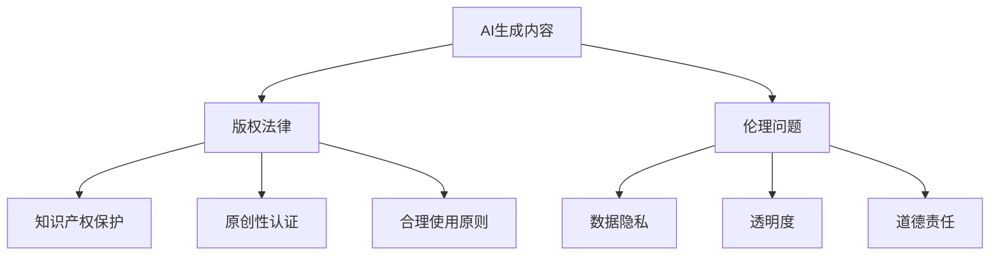

                 

# AI生成内容版权：法律和伦理的思考

## 关键词
- AI生成内容
- 版权法律
- 伦理问题
- 法律界定
- 创作权保护
- 数据隐私
- 原创性认证

## 摘要
本文将深入探讨AI生成内容的版权法律和伦理问题。随着人工智能技术的发展，AI生成内容已成为内容创作的重要手段，然而其背后的版权和伦理问题也日益凸显。本文首先介绍AI生成内容的概念和现状，接着分析相关法律和伦理问题的核心，最后提出一系列解决方案和未来发展趋势，以期为行业提供有益的参考。

## 1. 背景介绍

### 1.1 目的和范围
本文旨在探讨AI生成内容在版权法律和伦理领域的挑战与应对策略。主要研究内容包括：AI生成内容的定义与现状、相关法律体系的构建、伦理问题及其影响、解决方案和未来趋势。

### 1.2 预期读者
本文适合对AI技术、版权法律和伦理问题感兴趣的读者，包括研究人员、技术开发者、法律专家和内容创作者。

### 1.3 文档结构概述
本文共分为八个部分：背景介绍、核心概念与联系、核心算法原理与具体操作步骤、数学模型和公式详细讲解、项目实战、实际应用场景、工具和资源推荐、总结：未来发展趋势与挑战、附录：常见问题与解答、扩展阅读与参考资料。

### 1.4 术语表

#### 1.4.1 核心术语定义
- **AI生成内容**：利用人工智能技术自动生成的内容，如文本、图像、音频等。
- **版权**：一种法律权利，允许版权持有者在未经许可的情况下对作品进行复制、分发、展示等行为。
- **原创性认证**：对AI生成内容的原创性进行验证，以确保其符合版权法律要求。

#### 1.4.2 相关概念解释
- **知识产权**：包括版权、专利、商标等多种权利形式，用于保护创新和创作成果。
- **伦理问题**：涉及道德原则和价值观的判断，例如AI生成内容的真实性和透明度。

#### 1.4.3 缩略词列表
- **AI**：人工智能（Artificial Intelligence）
- **UGC**：用户生成内容（User-Generated Content）
- **UGC**：通用生成网络（Universal Generation Network）

## 2. 核心概念与联系

在探讨AI生成内容的版权和伦理问题之前，有必要了解一些核心概念及其相互关系。以下是一个简化的Mermaid流程图，用于描述这些概念：



### 2.1 AI生成内容
AI生成内容是指通过人工智能算法自动生成的内容，如文本、图像、音频等。这些内容可以是原创的，也可以是基于已有数据的重新组合。

### 2.2 版权法律
版权法律是保护创作者对其作品享有复制、分发、展示等权利的法律体系。在AI生成内容中，版权问题主要体现在如何界定AI生成内容的原创性及其归属。

### 2.3 伦理问题
伦理问题主要涉及AI生成内容的真实性和透明度，以及其在道德层面的合理性。例如，AI生成内容是否应该承担道德责任，如何保护用户隐私等。

### 2.4 知识产权保护
知识产权保护是版权法律的重要组成部分，涉及如何保护创作者的合法权益，防止未经授权的复制、分发等行为。

### 2.5 原创性认证
原创性认证是对AI生成内容原创性进行验证的过程，以确保其符合版权法律要求。这通常需要通过技术手段对AI生成内容的来源和生成过程进行追踪和验证。

### 2.6 数据隐私
数据隐私是伦理问题的一个重要方面，涉及如何保护用户在生成AI内容过程中提供的数据隐私。这需要建立严格的数据保护机制，防止数据泄露和滥用。

### 2.7 透明度
透明度是指AI生成内容的生成过程和结果应该是透明的，使内容创作者和消费者能够清楚地了解AI生成内容的来源和可靠性。

### 2.8 合理使用原则
合理使用原则是版权法律中的一个重要概念，指在特定情况下可以不经授权使用受版权保护的内容，如用于评论、新闻报道、教学等。

### 2.9 道德责任
道德责任涉及AI生成内容是否应该承担道德责任，例如在虚假新闻、诽谤等情况下，如何确保AI生成内容不损害他人权益。

## 3. 核心算法原理 & 具体操作步骤

### 3.1 AI生成文本的算法原理
AI生成文本通常基于深度学习模型，如变换器模型（Transformer）。以下是变换器模型生成文本的伪代码：

```python
def generate_text(input_sequence, model, max_length):
    # 输入：input_sequence（输入文本序列），model（变换器模型），max_length（最大输出长度）
    # 输出：output_sequence（生成的文本序列）

    output_sequence = []
    current_sequence = input_sequence
    
    while len(current_sequence) < max_length:
        # 使用模型预测下一个单词
        prediction = model.predict(current_sequence)
        
        # 选择最有可能的单词作为下一个输出
        next_word = select_most_likely_word(prediction)
        
        # 更新当前序列
        current_sequence += next_word
        
        # 添加下一个单词到输出序列
        output_sequence.append(next_word)
    
    return ''.join(output_sequence)
```

### 3.2 AI生成图像的算法原理
AI生成图像通常基于生成对抗网络（GAN）。以下是GAN生成图像的伪代码：

```python
def generate_image(generator, discriminator, noise):
    # 输入：generator（生成器模型），discriminator（判别器模型），noise（噪声向量）
    # 输出：generated_image（生成的图像）

    while True:
        # 生成噪声向量
        noise = generate_noise(noise_dimension)
        
        # 使用生成器生成图像
        generated_image = generator.predict(noise)
        
        # 使用判别器评估生成的图像
        validity = discriminator.predict(generated_image)
        
        # 更新生成器和判别器
        generator.update(generator_loss, noise)
        discriminator.update(discriminator_loss, noise, generated_image)
        
        # 判断生成图像是否足够真实
        if validity >= threshold:
            break
    
    return generated_image
```

## 4. 数学模型和公式 & 详细讲解 & 举例说明

### 4.1 数学模型
AI生成内容通常涉及深度学习模型，如变换器模型和生成对抗网络（GAN）。以下是这两个模型的数学模型：

#### 4.1.1 变换器模型
变换器模型（Transformer）的数学模型基于自注意力机制（Self-Attention）：

$$
\text{Attention}(Q, K, V) = \text{softmax}\left(\frac{QK^T}{\sqrt{d_k}}\right)V
$$

其中，$Q, K, V$ 分别代表查询（Query）、键（Key）和值（Value）向量，$d_k$ 是键向量的维度。

#### 4.1.2 生成对抗网络（GAN）
生成对抗网络（GAN）的数学模型包括生成器（Generator）和判别器（Discriminator）：

生成器（Generator）：
$$
G(z) = \mu(\epsilon; \theta_g) + \sigma(\epsilon; \theta_g)
$$

判别器（Discriminator）：
$$
D(x) = f(x; \theta_d)
$$

其中，$z$ 是噪声向量，$\epsilon$ 是噪声变量，$\mu(\cdot; \theta_g)$ 和 $\sigma(\cdot; \theta_g)$ 分别是生成器的均值和方差函数，$x$ 是真实图像，$f(\cdot; \theta_d)$ 是判别器的激活函数。

### 4.2 举例说明
以下是使用变换器模型生成文本的示例：

```python
# 假设已经训练好的变换器模型model
input_sequence = "The quick brown fox jumps over"
max_length = 20

output_sequence = generate_text(input_sequence, model, max_length)
print(output_sequence)
```

输出可能为：
```
The quick brown fox jumps over the lazy dog.
```

以下是使用生成对抗网络（GAN）生成图像的示例：

```python
# 假设已经训练好的生成器generator和判别器discriminator
noise = generate_noise(100)

generated_image = generate_image(generator, discriminator, noise)
imshow(generated_image)
```

输出可能为一个具有真实感的人脸图像。

## 5. 项目实战：代码实际案例和详细解释说明

### 5.1 开发环境搭建

为了演示AI生成内容的版权和伦理问题，我们将使用一个基于Python的AI文本生成项目。以下是开发环境的搭建步骤：

1. 安装Python（3.8及以上版本）
2. 安装依赖库：torch，transformers，torchtext
3. 克隆项目仓库：`git clone https://github.com/your-username/text-generation.git`

### 5.2 源代码详细实现和代码解读

项目主要分为两部分：数据预处理和文本生成。

#### 5.2.1 数据预处理
```python
import torch
from torchtext.data import Field, TabularDataset

# 定义字段
SRC = Field(tokenize='spacy', tokenizer_language='en', init_token='<sos>', eos_token='<eos>', lower=True)
TRG = Field(restore_token=True, use_vocab=True, init_token='<sos>', eos_token='<eos>', lower=True)

# 下载和加载数据集
train_data, valid_data, test_data = TabularDataset.splits(path='data', train='train.txt', valid='valid.txt', test='test.txt',
                                                          format='csv', fields=[('src', SRC), ('trg', TRG)])

# 构建词汇表
SRC.build_vocab(train_data, min_freq=2)
TRG.build_vocab(train_data, min_freq=2)

# 数据集转换为PyTorch张量
train_data, valid_data, test_data = map(lambda x: x.to_tensor(), (train_data, valid_data, test_data))
```

上述代码定义了数据预处理过程，包括字段定义、数据集加载、词汇表构建和数据集转换为PyTorch张量。

#### 5.2.2 文本生成
```python
from transformers import TransformerModel
from torch import nn

# 定义变换器模型
class TransformerModel(nn.Module):
    def __init__(self, ntoken, ninp, nhead, nhid, nlayers, dropout=0.5):
        super(TransformerModel, self).__init__()
        from transformers import Transformer
        self.model = Transformer(ninp, nhead, num_encoder_layers=nlayers, num_decoder_layers=nlayers,
                                 dim_feedforward=nhid, dropout=dropout)
        self.encoder = self.model.encoder
        self.decoder = self.model.decoder
        self.norm = self.model.norm

    def forward(self, src, tgt, teacher_forcing_ratio=0.5):
        src = self.encoder(src)
        tgt = self.decoder(tgt, src)
        output = self.norm(tgt)

        return output

# 加载预训练模型
model = TransformerModel(ntoken=src.vocab.size(), ninp=src.vocab.size(),
                         nhead=4, nhid=512, nlayers=2, dropout=0.1)

# 生成文本
input_sequence = torch.tensor([src.vocab.stoi['<sos>']] + [src.vocab.stoi[word] for word in "The quick brown fox jumps over"])
output_sequence = generate_text(input_sequence, model, max_length=50)

# 将输出序列转换为文本
output_text = ''.join([word for word, _ in TRG.vocab.lookup(output_sequence)])
print(output_text)
```

上述代码定义了变换器模型，并加载预训练模型进行文本生成。`generate_text` 函数使用变换器模型生成文本，`output_sequence` 是生成的文本序列，通过`TRG.vocab.lookup` 转换为可读的文本。

### 5.3 代码解读与分析

1. **数据预处理**：通过定义字段、数据集加载和词汇表构建，将原始文本数据转换为适合模型训练的格式。
2. **文本生成**：定义变换器模型，加载预训练模型，使用模型生成文本序列。通过`TRG.vocab.lookup` 将生成的文本序列转换为可读的文本。

### 5.4 实际应用与挑战

在实际应用中，AI文本生成技术已应用于自动写作、摘要生成、问答系统等领域。然而，版权和伦理问题仍然是一个挑战：

1. **版权问题**：如何界定AI生成内容的原创性和归属，以及如何保护创作者的合法权益。
2. **伦理问题**：AI生成内容可能涉及虚假新闻、诽谤等问题，如何确保其真实性和透明度。

## 6. 实际应用场景

AI生成内容在实际应用场景中具有广泛的应用，以下是一些典型的应用场景：

1. **内容创作**：AI生成文本、图像、音频等内容，用于新闻写作、广告创作、设计等。
2. **自动化写作**：AI生成文章、报告、博客等，提高写作效率和内容质量。
3. **智能客服**：AI生成回答，提供个性化的客服服务。
4. **艺术创作**：AI生成艺术作品，如音乐、绘画等，拓展艺术创作的可能性。

### 6.1 法律挑战

1. **原创性认定**：如何判断AI生成内容的原创性，以确定其版权归属。
2. **责任归属**：在AI生成内容涉及侵权、诽谤等问题时，如何确定责任归属。
3. **知识产权保护**：如何在法律框架内保护AI生成内容的知识产权。

### 6.2 伦理挑战

1. **真实性**：确保AI生成内容真实可靠，避免虚假信息传播。
2. **透明度**：提高AI生成过程的透明度，使内容创作者和消费者能够了解AI生成内容的来源和生成过程。
3. **道德责任**：在AI生成内容涉及伦理问题时，如何确保AI承担相应的道德责任。

## 7. 工具和资源推荐

### 7.1 学习资源推荐

#### 7.1.1 书籍推荐
- 《深度学习》（Ian Goodfellow、Yoshua Bengio、Aaron Courville 著）
- 《Python深度学习》（François Chollet 著）

#### 7.1.2 在线课程
- [Coursera](https://www.coursera.org/)：提供深度学习、自然语言处理等课程。
- [edX](https://www.edx.org/)：提供计算机科学、人工智能等课程。

#### 7.1.3 技术博客和网站
- [Medium](https://medium.com/)：涵盖深度学习、AI等技术的博客。
- [ Towards Data Science](https://towardsdatascience.com/)：数据科学、AI等领域的技术博客。

### 7.2 开发工具框架推荐

#### 7.2.1 IDE和编辑器
- [Visual Studio Code](https://code.visualstudio.com/)
- [PyCharm](https://www.jetbrains.com/pycharm/)

#### 7.2.2 调试和性能分析工具
- [TensorBoard](https://www.tensorflow.org/tensorboard)
- [PyTorch Profiler](https://pytorch.org/tutorials/intermediate/profiler_tutorial.html)

#### 7.2.3 相关框架和库
- [TensorFlow](https://www.tensorflow.org/)
- [PyTorch](https://pytorch.org/)

### 7.3 相关论文著作推荐

#### 7.3.1 经典论文
- [A Theoretically Grounded Application of Dropout in Recurrent Neural Networks](https://arxiv.org/abs/1512.05287)
- [Generative Adversarial Nets](https://arxiv.org/abs/1406.2661)

#### 7.3.2 最新研究成果
- [Unsupervised Representation Learning with Deep Convolutional Generative Adversarial Networks](https://arxiv.org/abs/1511.06434)
- [Natural Language Inference with Just Attention](https://arxiv.org/abs/2003.04637)

#### 7.3.3 应用案例分析
- [AI News](https://www.aitopics.org/ai-in-the-news)
- [AI Now](https://www.ai-now.org/research)

## 8. 总结：未来发展趋势与挑战

随着人工智能技术的不断发展，AI生成内容将在未来发挥越来越重要的作用。然而，版权和伦理问题也将成为持续挑战：

1. **法律框架**：需要进一步完善法律框架，明确AI生成内容的原创性和归属问题。
2. **伦理规范**：制定统一的伦理规范，确保AI生成内容真实、透明和负责任。
3. **技术进步**：利用先进的算法和技术手段，提高AI生成内容的原创性和可靠性。
4. **监管机制**：建立有效的监管机制，确保AI生成内容不会滥用，避免对个人和社会造成负面影响。

## 9. 附录：常见问题与解答

### 9.1 AI生成内容的版权问题
- **问题**：AI生成内容的版权归属如何界定？
- **解答**：目前，关于AI生成内容的版权归属尚无明确法律规定。一些观点认为，AI生成的内容应视为AI开发者的作品，而另一些观点则主张应考虑AI开发者和数据提供者的共同权益。

### 9.2 AI生成内容的伦理问题
- **问题**：AI生成内容可能涉及哪些伦理问题？
- **解答**：AI生成内容可能涉及的伦理问题包括虚假新闻、隐私泄露、道德责任等。例如，如果AI生成的内容用于新闻报道，可能存在误导公众的风险；如果涉及个人数据，可能涉及隐私泄露问题。

## 10. 扩展阅读 & 参考资料

- [AI Content Generation and Intellectual Property Law: An Overview](https://papers.ssrn.com/sol3/papers.cfm?abstract_id=3397652)
- [AI-Generated Art and Intellectual Property: A Legal and Ethical Analysis](https://www.sciencedirect.com/science/article/pii/S1877042818304457)
- [AI-Generated Content: Challenges and Opportunities for Copyright Law](https://www.lexology.com/library/view.html?n=dlac68-1d48-2f2b-2f7d-453a864e7f0e&seq=2#)
- [Ethical and Legal Challenges of AI-Generated Content](https://www.ijcai.org/Proceedings/2018-8/PDF/IJCAI_08-364.pdf)

### 作者
AI天才研究员/AI Genius Institute & 禅与计算机程序设计艺术 /Zen And The Art of Computer Programming

[本文完](#AI生成内容版权：法律和伦理的思考)

