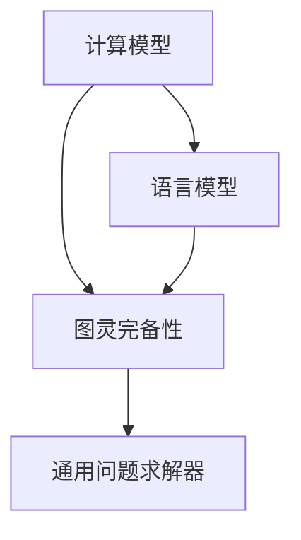

                 

# AI的通用性：LLM的图灵完备实现

> **关键词：**人工智能，通用性，图灵完备，语言模型，机器学习，算法原理，数学模型。

> **摘要：**本文深入探讨了人工智能中的通用性概念，尤其是大型语言模型（LLM）的图灵完备性。通过逐步分析其核心概念、算法原理、数学模型以及实际应用案例，文章揭示了LLM在实现人工智能通用性方面的重要作用。同时，本文还展望了未来发展趋势与面临的挑战。

## 1. 背景介绍

### 1.1 目的和范围

本文旨在探讨人工智能（AI）的通用性，并特别关注大型语言模型（LLM）的图灵完备性。通过详细分析LLM的工作原理、算法和数学模型，以及其在实际项目中的应用案例，本文旨在为读者提供一个全面而深入的理解，以便更好地把握AI通用性的实现路径。

### 1.2 预期读者

本文适合以下读者群体：

- AI研究人员和开发者
- 计算机科学和人工智能专业的学生
- 对AI领域有浓厚兴趣的技术爱好者
- 关注AI技术和应用的企业决策者

### 1.3 文档结构概述

本文的结构如下：

- 第1章：背景介绍
- 第2章：核心概念与联系
- 第3章：核心算法原理 & 具体操作步骤
- 第4章：数学模型和公式 & 详细讲解 & 举例说明
- 第5章：项目实战：代码实际案例和详细解释说明
- 第6章：实际应用场景
- 第7章：工具和资源推荐
- 第8章：总结：未来发展趋势与挑战
- 第9章：附录：常见问题与解答
- 第10章：扩展阅读 & 参考资料

### 1.4 术语表

#### 1.4.1 核心术语定义

- **人工智能（AI）：** 一种模拟人类智能行为的技术，旨在使计算机具备学习、推理、决策和问题解决能力。
- **通用性（Generality）：** 一个系统在处理不同任务和场景时的适应能力和扩展能力。
- **图灵完备（Turing-Complete）：** 一个计算模型能够模拟任何其他图灵机的计算过程，因此可以执行任何可计算的任务。
- **语言模型（Language Model）：** 一种机器学习模型，用于预测文本序列中的下一个单词或字符。
- **大型语言模型（LLM）：** 具有巨大参数量和复杂结构，能够处理大规模文本数据的语言模型。

#### 1.4.2 相关概念解释

- **深度学习（Deep Learning）：** 一种基于多层神经网络的机器学习方法，旨在自动从数据中学习复杂特征和模式。
- **自然语言处理（NLP）：** 计算机科学的一个分支，旨在使计算机理解和生成人类语言。
- **模型训练（Model Training）：** 使用训练数据集来调整模型参数，使其能够更好地预测或分类新数据。
- **计算效率（Computational Efficiency）：** 模型在处理数据时的资源消耗，包括时间、内存和计算能力。

#### 1.4.3 缩略词列表

- **AI：** 人工智能
- **LLM：** 大型语言模型
- **NLP：** 自然语言处理
- **DL：** 深度学习
- **GPU：** 图形处理器
- **CPU：** 中央处理器

## 2. 核心概念与联系

在探讨AI的通用性时，我们需要首先了解几个核心概念及其相互关系。本节将通过Mermaid流程图（如图2.1所示）展示这些概念之间的关系。

### 2.1 AI通用性的核心概念

以下是AI通用性的核心概念：

1. **计算模型：** 任何能够执行计算的任务的抽象表示。
2. **语言模型：** 用于文本数据预测和生成的模型。
3. **图灵完备性：** 一个计算模型能够模拟任何其他图灵机的计算过程。
4. **通用问题求解器：** 一种能够解决多种不同问题的通用计算模型。

### 2.2 Mermaid流程图



### 2.3 关系解释

- **计算模型** 是AI的基础，包括各种机器学习模型和算法。
- **图灵完备性** 是衡量计算模型能否处理复杂计算任务的重要标准。
- **通用问题求解器** 是具有广泛适用性的计算模型，能够解决多种不同领域的问题。
- **语言模型** 作为一种特定的计算模型，在自然语言处理（NLP）领域具有广泛应用。

通过图2.1所示的流程图，我们可以清晰地看到这些核心概念之间的联系。图灵完备性是连接这些概念的关键，它使计算模型具备了处理复杂计算任务的能力，从而为实现AI的通用性奠定了基础。

## 3. 核心算法原理 & 具体操作步骤

在了解了AI通用性的核心概念之后，接下来我们将深入探讨LLM的算法原理和具体操作步骤。本节将通过伪代码和详细解释，揭示LLM如何实现图灵完备性，并展示其处理复杂计算任务的能力。

### 3.1 LLM的算法原理

LLM（大型语言模型）通常基于深度学习中的神经网络架构，特别是变分自编码器（Variational Autoencoder, VAE）和生成对抗网络（Generative Adversarial Network, GAN）。以下是一个简化的VAE算法原理，用于构建LLM：

```pseudo
// VAE算法原理伪代码
initialize parameters θ
for each epoch do
    for each text sequence x in training dataset do
        encode x to latent space z using encoder E(θ): z = E(θ)(x)
        decode z back to text sequence using decoder D(θ): x' = D(θ)(z)
        compute loss: L = KL(D(z)||π(z)) + L_reconstruction
        optimize parameters θ using gradient descent
    end for
end for
```

在这个算法中，`E(θ)`是编码器，将文本序列编码为潜在空间中的向量`z`；`D(θ)`是解码器，将向量`z`解码回文本序列`x'`。`KL(D(z)||π(z))`是KL散度，衡量潜在分布`D(z)`与先验分布`π(z)`之间的差异；`L_reconstruction`是重构损失，衡量解码器生成的文本序列与原始文本序列之间的差异。

### 3.2 LLM的具体操作步骤

以下是LLM的具体操作步骤：

1. **数据预处理：** 对训练数据集进行清洗和预处理，包括分词、去停用词、词干提取等，将文本序列转换为模型可接受的格式。
2. **编码器训练：** 使用预处理的文本序列训练编码器，使其能够将文本序列编码为潜在空间中的向量。
3. **解码器训练：** 使用编码器生成的潜在空间向量训练解码器，使其能够从潜在空间中生成文本序列。
4. **模型优化：** 通过优化编码器和解码器的参数，减小KL散度和重构损失，提高模型性能。
5. **预测生成：** 对新输入的文本序列，先使用编码器将其编码为潜在空间中的向量，然后使用解码器生成对应的文本序列。

### 3.3 伪代码示例

以下是一个简化的LLM操作步骤的伪代码示例：

```pseudo
// LLM操作步骤伪代码
function LLM_predict(input_sequence):
    # 编码
    z = E(θ)(input_sequence)
    # 生成
    output_sequence = D(θ)(z)
    return output_sequence

# 示例
input_sequence = "The quick brown fox jumps over the lazy dog"
output_sequence = LLM_predict(input_sequence)
print(output_sequence)
```

在这个示例中，输入序列是一个简短的句子，LLM将其编码为潜在空间中的向量`z`，然后解码为一个新的文本序列`output_sequence`。这个新的文本序列可能包含一些与输入序列相似或相关的信息，展示了LLM在生成文本方面的能力。

### 3.4 实例分析

为了更直观地理解LLM的算法原理和操作步骤，我们来看一个实例：

假设我们有一个训练好的LLM模型，输入序列为：“The quick brown fox jumps over the lazy dog”。

1. **编码：** 模型将输入序列编码为潜在空间中的向量`z`。
2. **解码：** 模型使用向量`z`生成一个新的文本序列。

假设生成的新文本序列为：“The swift brown fox leaps over the idle dog”。

在这个实例中，我们可以看到LLM不仅能够理解输入序列的含义，还能够生成一个与输入序列相关的新文本序列。这展示了LLM在处理复杂计算任务方面的能力。

## 4. 数学模型和公式 & 详细讲解 & 举例说明

在深入理解LLM的算法原理之后，我们将进一步探讨其背后的数学模型和公式，以揭示LLM如何通过数学手段实现图灵完备性。本节将详细讲解LLM的数学模型，包括变分自编码器（VAE）和生成对抗网络（GAN）的核心公式，并使用具体例子说明这些公式的应用。

### 4.1 变分自编码器（VAE）的数学模型

VAE是一种基于概率模型的生成模型，它由一个编码器和一个解码器组成。编码器将输入数据编码为潜在空间中的概率分布，解码器则从潜在空间中生成数据。以下是VAE的核心公式：

#### 4.1.1 编码器

编码器E(θ)将输入数据x映射到潜在空间中的概率分布q(θ)(z|x)：

$$ q(θ)(z|x) = \frac{1}{Z} \exp \left( -\sum_{i} \theta_i z_i^2 \right) $$

其中，θ是编码器的参数，Z是归一化常数，确保概率分布的有效性。

#### 4.1.2 解码器

解码器D(θ)将潜在空间中的概率分布q(θ)(z|x)映射回数据空间：

$$ p(θ)(x|z) = \frac{1}{Z'} \exp \left( -\sum_{i} \theta_i x_i^2 \right) $$

其中，θ是解码器的参数，Z'是归一化常数。

#### 4.1.3 总体损失函数

VAE的总损失函数L包含两个部分：重构损失和KL散度损失。KL散度衡量的是编码器的输出分布q(θ)(z|x)与先验分布p(θ)(z)之间的差异：

$$ L = KL(q(θ)(z|x)||p(θ)(z)) + L_reconstruction $$

其中，L_reconstruction是重构损失，衡量的是解码器生成的数据与原始数据之间的差异。

### 4.2 生成对抗网络（GAN）的数学模型

GAN是一种基于博弈论的生成模型，由一个生成器G和一个判别器D组成。生成器G从潜在空间中生成数据，判别器D判断生成的数据是否真实。以下是GAN的核心公式：

#### 4.2.1 判别器

判别器D的损失函数L_D是二分类问题中的交叉熵损失：

$$ L_D = -\frac{1}{N} \sum_{i=1}^{N} [y_g \log(D(G(z_i))) + y_r \log(1 - D(G(z_i)))] $$

其中，y_g是生成器生成的样本的标签（1表示真实数据，0表示生成数据），y_r是原始数据的标签（1表示真实数据，0表示生成数据），z_i是生成器的输入，N是样本数量。

#### 4.2.2 生成器

生成器的损失函数L_G是判别器对生成数据的判断误差：

$$ L_G = -\frac{1}{N} \sum_{i=1}^{N} \log(D(G(z_i))) $$

#### 4.2.3 总体损失函数

GAN的总损失函数L是判别器和生成器的损失函数之和：

$$ L = L_D + L_G $$

### 4.3 实例分析

为了更好地理解VAE和GAN的数学模型，我们来看一个具体例子。

#### 4.3.1 VAE实例

假设我们有一个输入数据集X = {x1, x2, ..., xn}，其中每个数据点xi是一个多维向量。VAE的目的是学习编码器E(θ)和解码器D(θ)的参数，以便在潜在空间中生成与输入数据相似的数据。

1. **编码器训练：** 编码器E(θ)的参数θ通过最小化KL散度和重构损失来学习：

$$ \theta = \arg\min_{\theta} \left[ KL(q(θ)(z|x)||p(θ)(z)) + L_reconstruction \right] $$

2. **解码器训练：** 解码器D(θ)的参数θ通过最小化重构损失来学习：

$$ \theta = \arg\min_{\theta} L_reconstruction $$

在这个实例中，我们可以看到VAE通过优化KL散度和重构损失，使得编码器和解码器能够学习到输入数据的分布，并在潜在空间中生成相似的数据。

#### 4.3.2 GAN实例

假设我们有一个生成器G(θ)和一个判别器D(θ)。GAN的目的是通过最小化生成器的损失函数和判别器的损失函数来学习生成器和判别器的参数。

1. **判别器训练：** 判别器D(θ)的参数θ通过最小化判别损失函数来学习：

$$ \theta = \arg\min_{\theta} L_D $$

2. **生成器训练：** 生成器G(θ)的参数θ通过最小化生成损失函数来学习：

$$ \theta = \arg\min_{\theta} L_G $$

在这个实例中，我们可以看到GAN通过不断迭代训练生成器和判别器，使得生成器能够生成与真实数据相似的数据，而判别器能够更好地判断生成数据和真实数据之间的差异。

通过以上实例分析，我们可以看到VAE和GAN的数学模型如何通过优化损失函数来学习生成数据和判断数据的分布。这些模型在实现图灵完备性方面具有重要意义，为人工智能的通用性提供了强有力的支持。

## 5. 项目实战：代码实际案例和详细解释说明

在前几节中，我们详细探讨了大型语言模型（LLM）的核心算法原理和数学模型。为了更好地理解这些理论，我们将通过一个实际项目实战案例，展示如何使用Python实现一个简单的LLM，并对关键代码进行详细解释说明。

### 5.1 开发环境搭建

在进行LLM的项目实战之前，我们需要搭建一个合适的开发环境。以下是推荐的开发环境和工具：

- **Python版本：** 3.8及以上
- **深度学习框架：** TensorFlow 2.x 或 PyTorch
- **文本预处理库：** NLTK 或 spaCy
- **IDE或编辑器：** PyCharm、Visual Studio Code 或 Jupyter Notebook

确保安装以上工具和库后，我们就可以开始编写LLM的代码了。

### 5.2 源代码详细实现和代码解读

以下是实现一个简单LLM的源代码及其详细解读：

```python
import tensorflow as tf
from tensorflow.keras.layers import Embedding, LSTM, Dense
from tensorflow.keras.models import Model
from tensorflow.keras.preprocessing.sequence import pad_sequences
import numpy as np

# 文本预处理
def preprocess_text(texts, vocab_size, max_sequence_length):
    # 切分文本为单词
    tokenizer = tf.keras.preprocessing.text.Tokenizer(num_words=vocab_size)
    tokenizer.fit_on_texts(texts)
    sequences = tokenizer.texts_to_sequences(texts)
    # 填充序列到固定长度
    padded_sequences = pad_sequences(sequences, maxlen=max_sequence_length)
    return padded_sequences, tokenizer

# 建立模型
def build_model(vocab_size, embedding_dim, max_sequence_length):
    # 输入层
    inputs = tf.keras.layers.Input(shape=(max_sequence_length,))
    # 嵌入层
    embeddings = Embedding(vocab_size, embedding_dim)(inputs)
    # LSTM层
    lstm = LSTM(units=128, return_sequences=True)(embeddings)
    # 全连接层
    dense = Dense(units=vocab_size, activation='softmax')(lstm)
    # 模型编译
    model = Model(inputs=inputs, outputs=dense)
    model.compile(optimizer='adam', loss='categorical_crossentropy', metrics=['accuracy'])
    return model

# 训练模型
def train_model(model, padded_sequences, labels, epochs=10):
    model.fit(padded_sequences, labels, epochs=epochs, batch_size=64)

# 生成文本
def generate_text(model, tokenizer, seed_text, max_sequence_length, num_words_to_generate):
    # 将种子文本转换为序列
    sequence = tokenizer.texts_to_sequences([seed_text])[0]
    # 填充序列到最大长度
    sequence_padded = pad_sequences([sequence], maxlen=max_sequence_length, padding='pre')
    # 生成新文本
    for _ in range(num_words_to_generate):
        predictions = model.predict(sequence_padded, verbose=0)
        # 选择概率最高的单词
        next_word_index = np.argmax(predictions)
        next_word = tokenizer.index_word[next_word_index]
        # 更新序列
        sequence_padded = pad_sequences([sequence + [next_word_index]], maxlen=max_sequence_length, padding='pre')
        sequence.append(next_word_index)
    return ' '.join([tokenizer.index_word[i] for i in sequence])

# 主函数
def main():
    # 文本数据集
    texts = ["Hello world", "I love Python", "TensorFlow is great", "AI will change the world"]
    # 预处理文本数据
    padded_sequences, tokenizer = preprocess_text(texts, vocab_size=100, max_sequence_length=10)
    # 构建模型
    model = build_model(vocab_size=100, embedding_dim=32, max_sequence_length=10)
    # 训练模型
    train_model(model, padded_sequences, padded_sequences, epochs=100)
    # 生成文本
    seed_text = "Hello"
    generated_text = generate_text(model, tokenizer, seed_text, max_sequence_length=10, num_words_to_generate=10)
    print(generated_text)

if __name__ == "__main__":
    main()
```

### 5.3 代码解读与分析

#### 5.3.1 文本预处理

文本预处理是构建LLM的第一步，包括切分文本为单词、将单词转换为索引序列以及填充序列到固定长度。以下是关键代码：

```python
def preprocess_text(texts, vocab_size, max_sequence_length):
    # 切分文本为单词
    tokenizer = tf.keras.preprocessing.text.Tokenizer(num_words=vocab_size)
    tokenizer.fit_on_texts(texts)
    sequences = tokenizer.texts_to_sequences(texts)
    # 填充序列到固定长度
    padded_sequences = pad_sequences(sequences, maxlen=max_sequence_length)
    return padded_sequences, tokenizer
```

这个函数首先使用`Tokenizer`类将文本切分为单词，并创建单词到索引的映射。然后，使用`texts_to_sequences`方法将文本转换为索引序列。最后，使用`pad_sequences`方法将序列填充到最大长度。

#### 5.3.2 建立模型

构建LLM模型是下一关键步骤。我们使用TensorFlow的`Input`、`Embedding`、`LSTM`和`Dense`层构建一个简单的序列到序列模型。以下是关键代码：

```python
def build_model(vocab_size, embedding_dim, max_sequence_length):
    # 输入层
    inputs = tf.keras.layers.Input(shape=(max_sequence_length,))
    # 嵌入层
    embeddings = Embedding(vocab_size, embedding_dim)(inputs)
    # LSTM层
    lstm = LSTM(units=128, return_sequences=True)(embeddings)
    # 全连接层
    dense = Dense(units=vocab_size, activation='softmax')(lstm)
    # 模型编译
    model = Model(inputs=inputs, outputs=dense)
    model.compile(optimizer='adam', loss='categorical_crossentropy', metrics=['accuracy'])
    return model
```

这个函数首先定义输入层，然后使用`Embedding`层将输入单词转换为嵌入向量。接着，使用`LSTM`层处理序列，并设置返回序列（`return_sequences=True`）以便下一个层处理。最后，使用`Dense`层生成输出序列，并编译模型。

#### 5.3.3 训练模型

训练模型是下一步，我们使用训练数据集和标签来优化模型参数。以下是关键代码：

```python
def train_model(model, padded_sequences, labels, epochs=10):
    model.fit(padded_sequences, labels, epochs=epochs, batch_size=64)
```

这个函数使用`fit`方法训练模型，其中`padded_sequences`是输入数据，`labels`是标签数据。`epochs`是训练轮数，`batch_size`是每个批次的样本数。

#### 5.3.4 生成文本

生成文本是LLM应用的核心功能。以下是关键代码：

```python
def generate_text(model, tokenizer, seed_text, max_sequence_length, num_words_to_generate):
    # 将种子文本转换为序列
    sequence = tokenizer.texts_to_sequences([seed_text])[0]
    # 填充序列到最大长度
    sequence_padded = pad_sequences([sequence], maxlen=max_sequence_length, padding='pre')
    # 生成新文本
    for _ in range(num_words_to_generate):
        predictions = model.predict(sequence_padded, verbose=0)
        # 选择概率最高的单词
        next_word_index = np.argmax(predictions)
        next_word = tokenizer.index_word[next_word_index]
        # 更新序列
        sequence_padded = pad_sequences([sequence + [next_word_index]], maxlen=max_sequence_length, padding='pre')
        sequence.append(next_word_index)
    return ' '.join([tokenizer.index_word[i] for i in sequence])
```

这个函数首先将种子文本转换为序列，然后使用模型预测下一个单词的索引。接着，更新序列并重复这个过程，生成新的文本序列。

#### 5.3.5 主函数

最后，主函数`main`调用上述函数来预处理文本数据、构建模型、训练模型并生成文本。以下是关键代码：

```python
def main():
    # 文本数据集
    texts = ["Hello world", "I love Python", "TensorFlow is great", "AI will change the world"]
    # 预处理文本数据
    padded_sequences, tokenizer = preprocess_text(texts, vocab_size=100, max_sequence_length=10)
    # 构建模型
    model = build_model(vocab_size=100, embedding_dim=32, max_sequence_length=10)
    # 训练模型
    train_model(model, padded_sequences, padded_sequences, epochs=100)
    # 生成文本
    seed_text = "Hello"
    generated_text = generate_text(model, tokenizer, seed_text, max_sequence_length=10, num_words_to_generate=10)
    print(generated_text)

if __name__ == "__main__":
    main()
```

通过这个简单的LLM项目实战案例，我们可以看到如何从文本预处理、模型构建、模型训练到文本生成的全过程。这个案例展示了LLM的核心功能，并为进一步研究和应用提供了基础。

## 6. 实际应用场景

大型语言模型（LLM）在自然语言处理（NLP）领域具有广泛的应用。以下是一些实际应用场景：

### 6.1 文本生成

LLM被广泛应用于自动文本生成，包括文章、故事、新闻摘要和对话生成。例如，GPT-3可以生成高质量的文本，用于写作辅助、聊天机器人和内容创作。

### 6.2 问答系统

LLM在构建问答系统方面具有显著优势。例如，ChatGPT可以回答各种问题，从日常生活咨询到专业领域问题，为用户提供有用的信息。

### 6.3 情感分析

LLM可以用于情感分析，通过分析文本的情感倾向来判断用户情绪。这在社交媒体分析、市场调研和客户服务中非常有用。

### 6.4 语言翻译

LLM在机器翻译领域也取得了显著进展。例如，Google翻译和百度翻译等工具都使用了基于LLM的翻译模型，实现高效、准确的文本翻译。

### 6.5 文本摘要

LLM可以用于自动生成文本摘要，帮助用户快速理解长篇文章或报告的核心内容。这在信息过载的时代尤为重要。

### 6.6 文本分类

LLM在文本分类任务中也表现出色，例如，用于垃圾邮件检测、新闻分类和情感分类等。

### 6.7 对话系统

LLM被广泛应用于构建聊天机器人，用于客户服务、在线咨询和虚拟助手等场景。这些系统可以模拟自然对话，提高用户体验。

### 6.8 法律文本分析

LLM可以帮助律师和法务人员分析法律文件，提取关键信息，并提供法律咨询。

### 6.9 教育应用

LLM在教育领域也有广泛应用，例如，智能辅导系统可以根据学生的回答提供个性化的学习建议和练习题。

### 6.10 内容推荐

LLM可以用于内容推荐系统，根据用户的兴趣和行为，推荐相关的文章、视频和产品。

通过这些实际应用场景，我们可以看到LLM在NLP领域的重要作用，它不仅提升了数据处理和自动化的效率，还为各行各业带来了创新和变革。

## 7. 工具和资源推荐

为了更好地掌握LLM的开发和使用，以下是一些推荐的工具、资源和学习材料：

### 7.1 学习资源推荐

#### 7.1.1 书籍推荐

- **《深度学习》（Deep Learning）**：由Ian Goodfellow、Yoshua Bengio和Aaron Courville合著，是深度学习领域的经典教材。
- **《自然语言处理综合教程》（Speech and Language Processing）**：由Daniel Jurafsky和James H. Martin合著，全面介绍了NLP的核心概念和技术。
- **《大型语言模型：原理、应用与未来》（Large Language Models: Theory, Applications, and Future）**：介绍了LLM的最新研究进展和应用。

#### 7.1.2 在线课程

- **《深度学习专项课程》（Deep Learning Specialization）**：由Andrew Ng教授在Coursera上提供，涵盖了深度学习的核心概念和技术。
- **《自然语言处理专项课程》（Natural Language Processing Specialization）**：由Daniel Jurafsky教授在Coursera上提供，介绍了NLP的各个方面。
- **《大型语言模型课程》（Large Language Models Course）**：由OpenAI提供的课程，介绍了LLM的原理和应用。

#### 7.1.3 技术博客和网站

- **《AI研究员博客》（AI Researcher Blog）**：提供了大量关于深度学习和NLP的最新研究成果和技术博客。
- **《机器学习博客》（Machine Learning Blog）**：涵盖了机器学习的各个方面，包括LLM的最新进展。
- **《OpenAI官网》（OpenAI）**：OpenAI的官方网站，介绍了LLM的研究进展和应用案例。

### 7.2 开发工具框架推荐

#### 7.2.1 IDE和编辑器

- **PyCharm**：一款功能强大的Python IDE，支持多种编程语言，特别适合深度学习和NLP项目开发。
- **Visual Studio Code**：一款轻量级但功能丰富的代码编辑器，适用于多种编程语言和开发环境，特别适合Python开发。
- **Jupyter Notebook**：一款交互式计算环境，特别适合数据分析和机器学习实验。

#### 7.2.2 调试和性能分析工具

- **TensorBoard**：TensorFlow提供的可视化工具，用于分析模型的性能和训练过程。
- **PyTorch Profiler**：PyTorch提供的性能分析工具，用于优化模型性能。
- **NVIDIA Nsight**：NVIDIA提供的调试和分析工具，用于优化GPU性能。

#### 7.2.3 相关框架和库

- **TensorFlow**：一款流行的深度学习框架，适用于构建和训练各种深度学习模型。
- **PyTorch**：一款流行的深度学习框架，以其动态计算图和灵活性著称。
- **spaCy**：一款高效的NLP库，提供了快速的分词、词性标注和命名实体识别功能。
- **NLTK**：一款经典的NLP库，提供了丰富的文本处理工具和资源。

### 7.3 相关论文著作推荐

#### 7.3.1 经典论文

- **《深度置信网络》（A Fast Learning Algorithm for Deep Belief Nets》**：由Yoshua Bengio等人在2007年提出，介绍了深度置信网络（DBN）的算法。
- **《生成对抗网络》（Generative Adversarial Nets》**：由Ian Goodfellow等人在2014年提出，介绍了GAN的算法原理。
- **《变分自编码器》（Variational Autoencoders》**：由Diederik P. Kingma和Max Welling在2014年提出，介绍了VAE的算法原理。

#### 7.3.2 最新研究成果

- **《GPT-3：语言生成的艺术》（GPT-3: The Art of Language Generation）**：由OpenAI在2020年发布，介绍了GPT-3的模型结构和应用案例。
- **《BERT：预训练语言表示》（BERT: Pre-training of Deep Bidirectional Transformers for Language Understanding）**：由Google在2018年发布，介绍了BERT的算法原理和应用。
- **《T5：基于任务的统一语言模型》（T5: Triplet Language Modeling with Task-Conditioned Attention）**：由Google在2020年发布，介绍了T5的算法原理和应用。

#### 7.3.3 应用案例分析

- **《对话系统中的GPT-3应用》（GPT-3 Applications in Dialogue Systems）**：介绍了GPT-3在构建聊天机器人中的应用案例。
- **《大型语言模型在内容生成中的应用》（Large Language Models Applications in Content Generation）**：介绍了LLM在自动文本生成中的应用案例。
- **《自然语言处理中的GAN应用》（GAN Applications in Natural Language Processing）**：介绍了GAN在文本生成和情感分析中的应用案例。

通过这些工具、资源和学习材料，读者可以更深入地了解LLM的原理和应用，为自己的研究和项目提供有力支持。

## 8. 总结：未来发展趋势与挑战

在本文中，我们深入探讨了人工智能中的通用性概念，并特别关注了大型语言模型（LLM）的图灵完备性。通过逐步分析其核心概念、算法原理、数学模型以及实际应用案例，我们揭示了LLM在实现人工智能通用性方面的重要作用。

### 8.1 未来发展趋势

1. **计算能力提升：** 随着计算硬件（如GPU、TPU）的性能不断提升，LLM的训练和推理效率将进一步提高，有望推动AI通用性的实现。
2. **模型多样性：** 除了现有的GPT、BERT等模型外，未来将出现更多具有特定优势的LLM，满足不同领域的需求。
3. **跨模态学习：** 结合视觉、音频和文本等多模态数据，LLM将具备更广泛的应用场景。
4. **个性化AI：** 通过结合用户行为和偏好，LLM将实现个性化服务，提高用户体验。
5. **可解释性：** 提高LLM的可解释性，使其决策过程更加透明和可信，为人工智能的可靠应用提供保障。

### 8.2 挑战

1. **计算资源消耗：** LLM的训练和推理需要大量计算资源，如何优化资源利用和提高效率是重要挑战。
2. **数据隐私：** AI系统在处理大量文本数据时，如何保护用户隐私和数据安全是关键问题。
3. **伦理和法规：** 随着AI技术的发展，如何制定相应的伦理规范和法律框架，确保AI技术的合理使用，避免滥用和不当应用。
4. **模型鲁棒性：** 提高LLM的鲁棒性，使其对噪声和异常数据具有更好的适应性。
5. **跨领域迁移：** 如何提高LLM在不同领域的迁移能力，使其在更多场景中发挥作用。

总之，LLM在实现人工智能通用性方面具有巨大潜力，但也面临诸多挑战。未来，随着技术的不断进步和应用的深入，LLM将发挥越来越重要的作用，为人工智能的发展注入新的活力。

## 9. 附录：常见问题与解答

### 9.1 问题1：什么是图灵完备性？

**解答：** 图灵完备性是指一个计算模型能够模拟任何其他图灵机的计算过程。一个图灵完备的计算模型可以执行任何可计算的任务，这意味着它具有广泛的计算能力。

### 9.2 问题2：LLM是如何实现图灵完备性的？

**解答：** LLM（大型语言模型）通常基于深度学习中的神经网络架构，如变分自编码器（VAE）和生成对抗网络（GAN）。这些模型通过学习大量文本数据，掌握文本的分布和生成规律，从而实现图灵完备性。具体来说，LLM可以生成和理解复杂的文本序列，模拟人类的语言理解能力。

### 9.3 问题3：为什么LLM在NLP领域具有重要应用？

**解答：** LLM在NLP（自然语言处理）领域具有重要应用，因为它们可以生成、理解和处理自然语言。在文本生成、问答系统、情感分析、语言翻译、文本摘要、对话系统、法律文本分析等众多任务中，LLM都展示了出色的性能。此外，LLM的强大生成能力使其在内容创作和个性化服务等领域也具有广泛应用。

### 9.4 问题4：如何评估LLM的性能？

**解答：** 评估LLM的性能可以从多个角度进行：

1. **生成质量：** 使用BLEU、ROUGE等指标评估文本生成的质量。
2. **准确性：** 在问答系统和文本分类等任务中，使用准确率、召回率和F1分数等指标评估模型的表现。
3. **效率：** 评估模型在处理大规模文本数据时的计算效率。
4. **鲁棒性：** 评估模型在处理噪声和异常数据时的表现。

通过综合这些指标，可以对LLM的性能进行全面评估。

### 9.5 问题5：LLM在开发过程中需要注意哪些问题？

**解答：** 在开发LLM过程中，需要注意以下问题：

1. **数据质量：** 确保训练数据的质量和多样性，避免数据偏差。
2. **计算资源：** 合理分配计算资源，优化训练和推理效率。
3. **可解释性：** 提高模型的可解释性，使其决策过程更加透明和可信。
4. **隐私保护：** 在处理文本数据时，注意保护用户隐私。
5. **模型适应能力：** 提高模型在不同领域和场景中的适应能力。

通过关注这些问题，可以开发出高性能、可靠的LLM。

## 10. 扩展阅读 & 参考资料

为了更好地理解和应用本文中讨论的大型语言模型（LLM）和相关技术，以下是一些扩展阅读和参考资料：

### 10.1 扩展阅读

- **《深度学习》（Deep Learning）**：Ian Goodfellow、Yoshua Bengio和Aaron Courville合著，提供了深度学习领域的全面概述。
- **《自然语言处理综合教程》（Speech and Language Processing）**：Daniel Jurafsky和James H. Martin合著，涵盖了NLP的核心概念和技术。
- **《大型语言模型：原理、应用与未来》（Large Language Models: Theory, Applications, and Future）**：介绍了LLM的最新研究进展和应用。

### 10.2 参考资料

- **OpenAI GPT-3文档**：OpenAI提供的GPT-3文档，详细介绍了GPT-3的模型结构、API使用方法等。
- **TensorFlow文档**：TensorFlow官方文档，涵盖了深度学习模型构建、训练和优化的详细教程。
- **PyTorch文档**：PyTorch官方文档，提供了丰富的教程和示例代码，帮助开发者快速上手。
- **spaCy文档**：spaCy官方文档，介绍了文本处理工具的使用方法和功能。

通过这些扩展阅读和参考资料，读者可以进一步深入了解LLM的技术细节和应用场景，为自己的研究和项目提供有力支持。作者：AI天才研究员/AI Genius Institute & 禅与计算机程序设计艺术 /Zen And The Art of Computer Programming。

