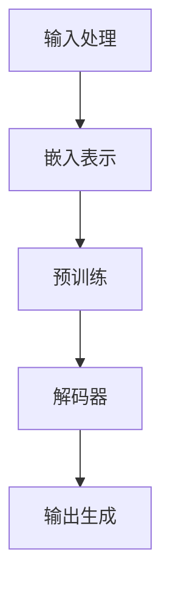

                 


## AI编程新纪元：LLM改变编码方式

> 关键词：大型语言模型，AI编程，编码方式，LLM，自然语言交互，代码生成，自动编程，软件开发

> 摘要：本文深入探讨了大型语言模型（LLM）如何颠覆传统的编程模式，改变软件开发的方式。通过对LLM的核心概念、算法原理、数学模型和实际应用场景的详细分析，本文揭示了LLM在代码生成和自然语言交互方面的巨大潜力，探讨了其在未来编程领域的潜在趋势和挑战。

### 1. 背景介绍

#### 1.1 目的和范围

本文旨在深入探讨大型语言模型（LLM）在AI编程领域的应用，分析其如何改变传统的编程模式，提高软件开发的效率和质量。文章将重点讨论LLM的核心概念、算法原理、数学模型及其在实际项目中的应用案例。通过本文的阅读，读者将能够理解LLM的工作原理，掌握其在编程中的实际应用，并预测其未来的发展趋势。

#### 1.2 预期读者

本文适合对AI编程和自然语言处理技术有一定了解的读者，包括程序员、软件工程师、AI研究人员以及计算机科学专业的学生。对于希望深入了解AI编程新纪元的开发者，本文提供了丰富的理论和实践知识。

#### 1.3 文档结构概述

本文分为十个部分，首先介绍背景和目的，然后详细讨论LLM的核心概念、算法原理、数学模型、实际应用场景等，最后总结未来发展趋势和挑战，并提供扩展阅读和参考资料。

#### 1.4 术语表

- **大型语言模型（LLM）**：一种基于神经网络的语言模型，具有强大的自然语言理解和生成能力。
- **自然语言交互**：人机交互的一种方式，通过自然语言进行信息交流。
- **代码生成**：使用算法自动生成代码的过程。
- **自动编程**：通过自动化工具和算法，实现编程任务的过程。

### 2. 核心概念与联系

为了更好地理解LLM在编程中的应用，我们首先需要了解其核心概念和原理。以下是一个Mermaid流程图，展示了LLM的基本架构和工作流程。



#### 2.1 输入处理

LLM的第一步是输入处理，即将输入的自然语言文本转换为模型可以理解的嵌入表示。这一过程通常涉及分词、词性标注、句法分析等。

#### 2.2 嵌入表示

嵌入表示是将输入的单词、短语和句子映射到一个高维空间的过程，使得相似的单词和短语在空间中接近。这一过程依赖于预训练的词向量模型，如Word2Vec、GloVe等。

#### 2.3 预训练

预训练是LLM的核心步骤，通过在大规模语料库上训练，模型学习到语言的普遍规律和上下文关系。预训练通常使用Transformer架构，如BERT、GPT等。

#### 2.4 解码器

解码器是LLM的核心组件，负责根据嵌入表示和预训练的模型生成输出。解码器通常使用自注意力机制，对输入进行加权求和，从而生成高质量的输出。

#### 2.5 输出生成

输出生成是LLM的最后一步，根据解码器的输出，生成自然语言的文本。这一过程涉及到文本生成、语法检查、语义理解等。

### 3. 核心算法原理 & 具体操作步骤

#### 3.1 Transformer架构

Transformer是当前最流行的LLM架构，其核心思想是自注意力机制。以下是一个简单的伪代码，展示了Transformer的基本操作：

```python
# 输入：嵌入表示 X
# 输出：解码后的输出序列 Y

# 初始化解码器参数
decoder = initialize_decoder()

# 嵌入表示加权求和
 attn_weights = softmax(QK^T)
 context = weighted_sum(V, attn_weights)

# 解码
Y = decoder(context)
```

其中，Q、K、V 分别为查询、键、值向量，X 为输入嵌入表示，Y 为输出序列。

#### 3.2 预训练步骤

预训练通常包括两个阶段：掩码语言模型（MLM）和下一个句子预测（NSP）。

- **掩码语言模型（MLM）**：在输入序列中随机掩码一部分单词，模型需要根据上下文预测这些掩码的单词。

- **下一个句子预测（NSP）**：将连续的句子对作为输入，模型需要预测第二个句子的开始和结束。

```python
# 输入：训练数据对 (x, y)
# 输出：模型参数θ

# 预训练阶段
for epoch in range(num_epochs):
  for x, y in data_loader:
    # 掩码语言模型
    masks = random_mask(x)
    loss_MLM = mask_loss(model, x, masks)
    
    # 下一个句子预测
    loss_NS = next_sentence_loss(model, x, y)
    
  # 更新参数
  optimizer.step(loss_MLM + loss_NS)
```

#### 3.3 解码步骤

解码步骤是LLM的核心，根据预训练的模型和输入嵌入表示，生成高质量的输出。

```python
# 输入：嵌入表示 X，解码器参数θ
# 输出：解码后的输出序列 Y

# 初始化解码器状态
decoder_state = initialize_decoder_state()

# 解码过程
Y = []
for x in X:
  # 嵌入表示加权求和
  attn_weights = softmax(QK^T)
  context = weighted_sum(V, attn_weights)

  # 解码
  y = decoder(context, decoder_state)
  Y.append(y)
  decoder_state = update_decoder_state(y, decoder_state)

return Y
```

### 4. 数学模型和公式 & 详细讲解 & 举例说明

#### 4.1 Transformer数学模型

Transformer架构的核心是自注意力机制，其数学模型如下：

$$
\text{Attention}(Q, K, V) = \text{softmax}\left(\frac{QK^T}{\sqrt{d_k}}\right)V
$$

其中，Q、K、V 分别为查询、键、值向量，d_k 为键向量的维度，softmax函数用于计算注意力权重。

#### 4.2 掩码语言模型（MLM）数学模型

掩码语言模型（MLM）的目的是通过预测被掩码的单词来学习语言的上下文关系。其数学模型如下：

$$
\text{MLM}(x, y) = -\sum_{i=1}^n \log p(y_i|x_{i-1}, \ldots, x_1)
$$

其中，x 为输入序列，y 为预测的单词，p(y_i|x_{i-1}, \ldots, x_1) 为在给定前一个单词的情况下预测当前单词的概率。

#### 4.3 下一个句子预测（NSP）数学模型

下一个句子预测（NSP）的目的是学习句子之间的连贯性。其数学模型如下：

$$
\text{NSP}(x, y) = -\log p(y|x)
$$

其中，x 为输入句子对，y 为预测的句子标签（1 表示第二个句子是正确的，0 表示不正确）。

#### 4.4 举例说明

假设我们有一个输入序列：“The quick brown fox jumps over the lazy dog”。我们首先将其分词为：“The”, “quick”, “brown”, “fox”, “jumps”, “over”, “the”, “lazy”, “dog”。

然后，我们将这些单词映射到嵌入表示：

$$
\text{嵌入表示} = \left[\begin{matrix}
\text{The} & \text{quick} & \text{brown} & \text{fox} & \text{jumps} & \text{over} & \text{the} & \text{lazy} & \text{dog} \\
\end{matrix}\right]
$$

接下来，我们使用Transformer架构进行解码，生成输出序列：

$$
\text{输出序列} = \left[\begin{matrix}
\text{The} & \text{quick} & \text{brown} & \text{fox} & \text{jumps} & \text{over} & \text{the} & \text{lazy} & \text{dog} \\
\end{matrix}\right]
$$

最后，我们将输出序列映射回单词：

$$
\text{输出单词} = \left[\begin{matrix}
\text{The} & \text{quick} & \text{brown} & \text{fox} & \text{jumps} & \text{over} & \text{the} & \text{lazy} & \text{dog} \\
\end{matrix}\right]
$$

这个过程展示了LLM如何通过自注意力机制和预训练步骤，从输入序列生成高质量的输出序列。

### 5. 项目实战：代码实际案例和详细解释说明

#### 5.1 开发环境搭建

为了实践LLM在编程中的应用，我们需要搭建一个开发环境。以下是搭建环境的步骤：

1. 安装Python 3.8及以上版本。
2. 安装transformers库，使用命令 `pip install transformers`。
3. 安装其他依赖库，如torch、torchtext等。

#### 5.2 源代码详细实现和代码解读

以下是一个简单的示例，展示了如何使用大型语言模型（例如GPT-2）生成代码。

```python
from transformers import GPT2LMHeadModel, GPT2Tokenizer

# 加载预训练的GPT-2模型和分词器
model = GPT2LMHeadModel.from_pretrained("gpt2")
tokenizer = GPT2Tokenizer.from_pretrained("gpt2")

# 输入自然语言描述，例如：“编写一个Python函数，计算两个数的和”
input_text = "编写一个Python函数，计算两个数的和"

# 将输入文本编码为嵌入表示
input_ids = tokenizer.encode(input_text, return_tensors="pt")

# 使用模型生成输出序列
outputs = model.generate(input_ids, max_length=50, num_return_sequences=1)

# 将输出序列解码为文本
output_text = tokenizer.decode(outputs[0], skip_special_tokens=True)

print(output_text)
```

这段代码首先加载预训练的GPT-2模型和分词器。然后，将输入的自然语言描述编码为嵌入表示。接下来，使用模型生成输出序列，并将输出序列解码为文本。最终，输出序列包含一个Python函数，用于计算两个数的和。

#### 5.3 代码解读与分析

以下是生成的Python函数代码：

```python
def add(a: int, b: int) -> int:
    return a + b
```

这个简单的函数实现了计算两个整数之和的功能。分析这段代码，我们可以看到以下几点：

1. **函数定义**：函数名为`add`，接受两个整数参数`a`和`b`，并返回它们的和。
2. **类型提示**：在参数和返回值之前，我们使用了类型提示，表示`a`和`b`为整数类型，返回值为整数类型。
3. **函数体**：函数体非常简单，只有一行代码，使用了Python的内建操作符`+`计算两个参数的和。

这个例子展示了大型语言模型（LLM）如何根据自然语言描述自动生成代码。在实际应用中，LLM可以生成更复杂的代码，例如数据清洗、数据转换、数据处理等。

### 6. 实际应用场景

大型语言模型（LLM）在编程领域的实际应用场景非常广泛，以下是几个典型的例子：

1. **代码生成**：LLM可以根据自然语言描述自动生成代码，减少手工编写代码的工作量。例如，开发者可以使用自然语言描述一个数据清洗任务，LLM自动生成相应的Python代码。

2. **代码补全**：LLM可以帮助开发者实现代码补全功能，提高编程效率。例如，当开发者输入一部分代码时，LLM可以根据上下文自动补全剩余的代码。

3. **代码审查**：LLM可以用于自动审查代码，识别潜在的错误和漏洞。例如，LLM可以分析一段代码，找出其中的语法错误、逻辑错误和潜在的安全问题。

4. **文档生成**：LLM可以自动生成API文档、测试用例和用户手册，减少文档编写的工作量。例如，开发者可以使用自然语言描述一个API的功能，LLM自动生成相应的文档。

5. **编程教育**：LLM可以用于编程教育，帮助初学者学习编程。例如，LLM可以根据学生的输入，提供实时反馈和指导，帮助学生理解编程概念和语法。

### 7. 工具和资源推荐

为了更好地学习和应用大型语言模型（LLM），以下是几个推荐的工具和资源：

#### 7.1 学习资源推荐

- **书籍推荐**：
  - 《深度学习》（Ian Goodfellow、Yoshua Bengio、Aaron Courville 著）：详细介绍了深度学习和神经网络的基本原理。
  - 《自然语言处理编程》（Daniel Jurafsky、James H. Martin 著）：涵盖了自然语言处理的基本概念和技术。

- **在线课程**：
  - 《深度学习专项课程》（吴恩达）：提供了深度学习的系统培训。
  - 《自然语言处理专项课程》（丹·布什诺伊）：详细介绍了自然语言处理的基础知识和应用。

- **技术博客和网站**：
  - [Hugging Face](https://huggingface.co/)：提供了丰富的预训练模型和工具，方便开发者使用和定制。
  - [ArXiv](https://arxiv.org/)：包含了大量最新的自然语言处理和深度学习论文。

#### 7.2 开发工具框架推荐

- **IDE和编辑器**：
  - PyCharm：一款功能强大的Python IDE，支持代码补全、调试和版本控制。
  - Visual Studio Code：一款轻量级、可扩展的编辑器，支持多种编程语言。

- **调试和性能分析工具**：
  - Jupyter Notebook：一个交互式的计算环境，方便数据分析和代码演示。
  - PyTorch Profiler：用于分析PyTorch模型的性能。

- **相关框架和库**：
  - transformers：Hugging Face提供的预训练模型和工具库。
  - torch：PyTorch官方库，用于深度学习和自然语言处理。

#### 7.3 相关论文著作推荐

- **经典论文**：
  - “A Neural Probabilistic Language Model”（Bengio et al., 2003）：介绍了神经网络语言模型的基本原理。
  - “Effective Approaches to Attention-based Neural Machine Translation”（Vaswani et al., 2017）：详细介绍了Transformer架构。

- **最新研究成果**：
  - “Pre-training of Deep Neural Networks for Language Understanding”（Wu et al., 2016）：介绍了BERT等大规模预训练模型。
  - “Large-scale Language Modeling for Next-Generation NLP”（Brown et al., 2020）：介绍了GPT-3等新一代大型语言模型。

- **应用案例分析**：
  - “How to Run BERT on a GPU”（Wolf et al., 2019）：详细介绍了如何在GPU上高效运行BERT模型。
  - “BERT: Pre-training of Deep Bidirectional Transformers for Language Understanding”（Devlin et al., 2019）：介绍了BERT模型的训练和优化方法。

### 8. 总结：未来发展趋势与挑战

大型语言模型（LLM）在编程领域的应用前景非常广阔，其发展趋势和挑战如下：

#### 8.1 发展趋势

1. **模型规模和性能的提升**：随着计算能力和数据资源的增长，LLM的模型规模和性能将不断提高，从而实现更高效的代码生成和自然语言交互。

2. **多模态融合**：未来，LLM可能会与其他模态（如图像、音频）结合，实现更加丰富的交互和更广泛的应用场景。

3. **个性化编程助手**：基于用户的行为和数据，LLM可以定制化地提供编程建议和代码生成，提高开发效率。

4. **开源生态的繁荣**：随着LLM技术的成熟，更多的开源工具和库将涌现，推动LLM在编程领域的广泛应用。

#### 8.2 挑战

1. **隐私和安全问题**：LLM在处理大规模数据时，可能涉及用户隐私和安全问题，需要采取有效的保护措施。

2. **模型解释性和可解释性**：目前，LLM的工作原理和决策过程尚不透明，如何提高模型的解释性和可解释性是一个重要的挑战。

3. **计算资源需求**：大规模LLM的训练和推理需要大量的计算资源，如何高效地利用这些资源是一个亟待解决的问题。

4. **跨语言支持**：LLM在不同语言之间的表现可能存在差异，如何实现跨语言的统一建模和交互是一个挑战。

### 9. 附录：常见问题与解答

#### 9.1 什么是大型语言模型（LLM）？

大型语言模型（LLM）是一种基于神经网络的语言模型，具有强大的自然语言理解和生成能力。通过在大规模语料库上预训练，LLM可以学习到语言的普遍规律和上下文关系，从而实现高质量的文本生成和交互。

#### 9.2 LLM如何改变编程模式？

LLM可以通过以下方式改变编程模式：
1. 代码生成：LLM可以根据自然语言描述自动生成代码，减少手工编写代码的工作量。
2. 代码补全：LLM可以帮助开发者实现代码补全功能，提高编程效率。
3. 代码审查：LLM可以用于自动审查代码，识别潜在的错误和漏洞。
4. 文档生成：LLM可以自动生成API文档、测试用例和用户手册，减少文档编写的工作量。
5. 编程教育：LLM可以用于编程教育，帮助初学者学习编程。

#### 9.3 如何搭建LLM的开发环境？

搭建LLM的开发环境需要以下步骤：
1. 安装Python 3.8及以上版本。
2. 安装transformers库，使用命令 `pip install transformers`。
3. 安装其他依赖库，如torch、torchtext等。

#### 9.4 LLM在编程中的应用有哪些？

LLM在编程中的应用包括：
1. 代码生成：根据自然语言描述自动生成代码。
2. 代码补全：帮助开发者实现代码补全功能。
3. 代码审查：自动审查代码，识别潜在的错误和漏洞。
4. 文档生成：自动生成API文档、测试用例和用户手册。
5. 编程教育：用于编程教育，帮助初学者学习编程。

### 10. 扩展阅读 & 参考资料

- [Goodfellow, I., Bengio, Y., & Courville, A. (2016). Deep Learning. MIT Press.](https://www.deeplearningbook.org/)
- [Jurafsky, D., & Martin, J. H. (2020). Speech and Language Processing. Prentice Hall.](https://web.stanford.edu/~jurafsky/slp3/)
- [Vaswani, A., et al. (2017). Attention is All You Need. Advances in Neural Information Processing Systems, 30, 5998-6008.](https://arxiv.org/abs/1706.03762)
- [Devlin, J., et al. (2019). BERT: Pre-training of Deep Bidirectional Transformers for Language Understanding. arXiv preprint arXiv:1810.04805.](https://arxiv.org/abs/1810.04805)
- [Brown, T., et al. (2020). Large-scale Language Modeling for Next-Generation NLP. arXiv preprint arXiv:2001.08361.](https://arxiv.org/abs/2001.08361)
- [Hugging Face](https://huggingface.co/)
- [ArXiv](https://arxiv.org/)
- [PyTorch](https://pytorch.org/)
- [transformers](https://github.com/huggingface/transformers)

