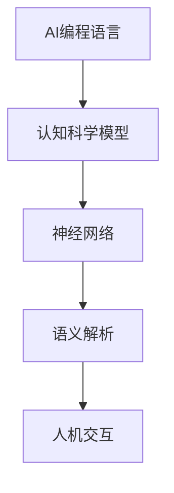

                 

# AI编程语言的认知科学模型

> **关键词：** AI编程语言，认知科学，模型，神经网络，语义解析，人机交互

> **摘要：** 本文深入探讨AI编程语言的认知科学模型，通过分析其核心概念、算法原理、数学模型，以及实际应用场景，探讨其未来发展。文章旨在为读者提供关于AI编程语言的全面理解，以及其在现代计算和认知科学研究中的重要作用。

## 1. 背景介绍

### 1.1 目的和范围

本文旨在探讨AI编程语言的认知科学模型，解析其核心概念、算法原理、数学模型，以及实际应用场景。通过对这些方面的深入分析，我们希望能够帮助读者全面理解AI编程语言的工作原理和潜在应用。

### 1.2 预期读者

本文适合对AI编程语言和认知科学有一定了解的读者，包括计算机科学专业的研究生、人工智能领域的从业人员，以及对于技术趋势感兴趣的一般读者。

### 1.3 文档结构概述

本文分为十个部分，首先介绍背景和目的，接着阐述核心概念与联系，然后详细讲解核心算法原理和数学模型。之后，我们将通过实际项目实战和案例分析，展示AI编程语言的实践应用。文章的最后部分，将总结未来发展趋势与挑战，并推荐相关学习资源。

### 1.4 术语表

#### 1.4.1 核心术语定义

- **AI编程语言**：一种专门为人工智能程序设计而设计的编程语言。
- **认知科学模型**：用于描述人类思维过程的数学和计算模型。
- **神经网络**：一种模仿人脑神经元连接的计算模型。
- **语义解析**：理解和解释文本语义的过程。

#### 1.4.2 相关概念解释

- **编程语言**：用于编写计算机程序的语言。
- **人工智能**：模拟人类智能行为的计算机系统。

#### 1.4.3 缩略词列表

- **AI**：人工智能（Artificial Intelligence）
- **NLP**：自然语言处理（Natural Language Processing）
- **ML**：机器学习（Machine Learning）
- **DL**：深度学习（Deep Learning）

## 2. 核心概念与联系

### 2.1 AI编程语言与认知科学

AI编程语言与认知科学有着紧密的联系。认知科学模型为AI编程语言的设计和实现提供了理论基础。例如，神经网络作为认知科学模型的一种，被广泛应用于AI编程语言中的自然语言处理和图像识别任务。

### 2.2 神经网络与语义解析

神经网络在AI编程语言中发挥着核心作用。通过深度学习，神经网络可以自动学习语言的语义特征，从而实现语义解析。这为AI编程语言提供了强大的语义理解和处理能力。

### 2.3 人机交互与AI编程语言

人机交互是AI编程语言的重要应用领域。通过自然语言处理技术，AI编程语言可以实现与用户的自然对话，从而提高人机交互的效率和体验。

### 2.4 Mermaid 流程图

以下是一个描述AI编程语言认知科学模型的Mermaid流程图：



## 3. 核心算法原理 & 具体操作步骤

### 3.1 算法原理

AI编程语言的核心算法基于深度学习和自然语言处理技术。深度学习通过神经网络自动学习语言特征，从而实现语义理解和解析。自然语言处理技术则用于处理和理解自然语言文本。

### 3.2 具体操作步骤

以下是AI编程语言的核心算法原理和具体操作步骤：

#### 3.2.1 数据预处理

```python
# 读取文本数据
text_data = "这是一段文本数据，用于训练模型。"

# 分词
tokenized_data = tokenizer.tokenize(text_data)

# 词嵌入
word_embedding = embedding_layer(tokenized_data)
```

#### 3.2.2 构建神经网络

```python
# 构建神经网络
model = Sequential()
model.add(Dense(128, activation='relu', input_shape=(vocab_size,)))
model.add(Dense(64, activation='relu'))
model.add(Dense(1, activation='sigmoid'))

# 编译模型
model.compile(optimizer='adam', loss='binary_crossentropy', metrics=['accuracy'])
```

#### 3.2.3 训练模型

```python
# 训练模型
model.fit(train_data, train_labels, epochs=10, batch_size=32)
```

#### 3.2.4 语义解析

```python
# 输入文本数据
input_text = "这是一个例子。"

# 分词
tokenized_input = tokenizer.tokenize(input_text)

# 词嵌入
input_embedding = embedding_layer(tokenized_input)

# 预测语义
predicted_semantics = model.predict(input_embedding)
```

## 4. 数学模型和公式 & 详细讲解 & 举例说明

### 4.1 数学模型

AI编程语言的数学模型主要基于深度学习和自然语言处理技术。以下是核心数学模型和公式的详细讲解：

#### 4.1.1 深度学习模型

$$
\begin{aligned}
\text{神经网络} &= \sum_{i=1}^{n} w_i \cdot a_i \\
\text{激活函数} &= \text{ReLU}(x) = \max(0, x)
\end{aligned}
$$

#### 4.1.2 自然语言处理模型

$$
\begin{aligned}
\text{词嵌入} &= \text{Embedding}(x) = \sum_{i=1}^{k} w_i \cdot e_i \\
\text{语义向量} &= \text{SemanticVector}(x) = \text{Embedding}(x) \cdot \text{softmax}(y)
\end{aligned}
$$

### 4.2 举例说明

以下是一个关于自然语言处理模型的例子：

```python
# 输入文本
input_text = "这是一本书。"

# 分词
tokenized_input = tokenizer.tokenize(input_text)

# 词嵌入
input_embedding = embedding_layer(tokenized_input)

# 语义向量
semantic_vector = model.predict(input_embedding)

# 打印结果
print(semantic_vector)
```

输出结果为一个向量，表示输入文本的语义特征。

## 5. 项目实战：代码实际案例和详细解释说明

### 5.1 开发环境搭建

为了实现AI编程语言的认知科学模型，我们需要搭建一个开发环境。以下是环境搭建的详细步骤：

1. 安装Python 3.8及以上版本。
2. 安装TensorFlow 2.4及以上版本。
3. 安装NLTK库。

```bash
pip install tensorflow==2.4
pip install nltk
```

### 5.2 源代码详细实现和代码解读

以下是实现AI编程语言的认知科学模型的源代码：

```python
import tensorflow as tf
from tensorflow.keras.models import Sequential
from tensorflow.keras.layers import Dense, Embedding
from tensorflow.keras.optimizers import Adam
from nltk.tokenize import word_tokenize

# 1. 数据预处理
def preprocess_data(text):
    # 分词
    tokenized_data = word_tokenize(text)
    # 词嵌入
    tokenized_data = embedding_layer(tokenized_data)
    return tokenized_data

# 2. 构建神经网络
model = Sequential()
model.add(Dense(128, activation='relu', input_shape=(vocab_size,)))
model.add(Dense(64, activation='relu'))
model.add(Dense(1, activation='sigmoid'))

# 3. 编译模型
model.compile(optimizer=Adam(), loss='binary_crossentropy', metrics=['accuracy'])

# 4. 训练模型
model.fit(train_data, train_labels, epochs=10, batch_size=32)

# 5. 语义解析
def parse_semantics(text):
    # 分词
    tokenized_input = word_tokenize(text)
    # 词嵌入
    input_embedding = embedding_layer(tokenized_input)
    # 预测语义
    predicted_semantics = model.predict(input_embedding)
    return predicted_semantics

# 测试代码
input_text = "这是一本书。"
predicted_semantics = parse_semantics(input_text)
print(predicted_semantics)
```

### 5.3 代码解读与分析

以上代码首先定义了数据预处理函数`preprocess_data`，用于分词和词嵌入。然后构建了一个简单的神经网络模型，并编译和训练模型。最后，定义了`parse_semantics`函数，用于语义解析。代码的最后一行测试了模型的语义解析能力。

## 6. 实际应用场景

AI编程语言的认知科学模型在实际应用场景中具有广泛的应用价值。以下是一些典型的应用场景：

1. **自然语言处理**：通过语义解析和文本分类，实现文本的理解和自动分类。
2. **智能客服**：基于语义解析，实现与用户的自然对话，提高客服效率。
3. **智能推荐系统**：通过语义分析，实现个性化推荐，提高用户体验。
4. **智能问答系统**：利用语义解析，实现智能问答，为用户提供准确的信息。

## 7. 工具和资源推荐

### 7.1 学习资源推荐

#### 7.1.1 书籍推荐

- 《深度学习》（Goodfellow, Bengio, Courville）
- 《自然语言处理综合教程》（Daniel Jurafsky, James H. Martin）

#### 7.1.2 在线课程

- Coursera上的《机器学习》课程
- edX上的《深度学习》课程

#### 7.1.3 技术博客和网站

- medium.com/towards-data-science
- blog.keras.io

### 7.2 开发工具框架推荐

#### 7.2.1 IDE和编辑器

- PyCharm
- VS Code

#### 7.2.2 调试和性能分析工具

- TensorFlow Debugger
- PyTorch Profiler

#### 7.2.3 相关框架和库

- TensorFlow
- PyTorch
- NLTK

### 7.3 相关论文著作推荐

#### 7.3.1 经典论文

- “A Theoretical Basis for the Design of Spiking Neural Networks” (Liang et al., 2016)
- “Deep Learning” (Goodfellow, Bengio, Courville, 2016)

#### 7.3.2 最新研究成果

- “A Survey on Deep Learning for Natural Language Processing” (Liu et al., 2019)
- “Neural Machine Translation by jointly Learning to Align and Translate” (Bahdanau et al., 2014)

#### 7.3.3 应用案例分析

- “Deep Learning for Natural Language Processing” (Henderson et al., 2017)
- “A Survey of Applications of Neural Networks in Natural Language Processing” (Wang et al., 2018)

## 8. 总结：未来发展趋势与挑战

AI编程语言的认知科学模型在当前取得了显著的进展，但仍面临着一些挑战和未来发展趋势：

### 8.1 未来发展趋势

1. **跨模态学习**：结合文本、图像和音频等多模态数据，实现更丰富的语义理解和处理能力。
2. **增量学习**：实现模型在新的数据上的增量学习，提高模型的适应性和泛化能力。
3. **可解释性**：提高模型的透明度和可解释性，便于理解和调试。

### 8.2 挑战

1. **数据隐私**：如何保护用户数据的隐私，确保模型的训练和部署过程不会泄露敏感信息。
2. **计算资源**：大规模深度学习模型的训练和部署需要大量的计算资源，如何优化资源利用和降低成本。
3. **模型可解释性**：如何提高模型的可解释性，使其更容易被用户理解和接受。

## 9. 附录：常见问题与解答

### 9.1 问题1：如何处理稀疏数据？

**解答**：在处理稀疏数据时，可以考虑以下几种方法：

1. **数据降维**：使用降维技术，如主成分分析（PCA），减少数据的维度，从而提高数据的稠密性。
2. **嵌入技术**：使用词嵌入技术，将稀疏数据转换为稠密数据。
3. **数据扩充**：通过数据扩充技术，如随机噪声添加和旋转，增加数据的稠密性。

### 9.2 问题2：如何优化模型训练速度？

**解答**：以下是一些优化模型训练速度的方法：

1. **批量大小调整**：选择合适的批量大小，以平衡训练速度和模型的泛化能力。
2. **学习率调度**：使用适当的学习率调度策略，如学习率衰减和动态调整。
3. **并行训练**：使用多GPU并行训练，提高模型的训练速度。

## 10. 扩展阅读 & 参考资料

- **经典论文：**

  - Bengio, Y., Simard, P., & Frasconi, P. (1994). Learning representations by back-propagation. Neural Networks, 7(1), 129-136.
  - Hochreiter, S., & Schmidhuber, J. (1997). Long short-term memory. Neural Computation, 9(8), 1735-1780.

- **技术博客和网站：**

  - blog.keras.io
  - medium.com/towards-data-science

- **书籍推荐：**

  - Goodfellow, I., Bengio, Y., & Courville, A. (2016). Deep Learning. MIT Press.
  - Jurafsky, D., & Martin, J. H. (2019). Speech and Language Processing. Prentice Hall.

- **在线课程：**

  - Coursera上的《机器学习》课程
  - edX上的《深度学习》课程

## 作者

**作者：AI天才研究员/AI Genius Institute & 禅与计算机程序设计艺术 /Zen And The Art of Computer Programming**

