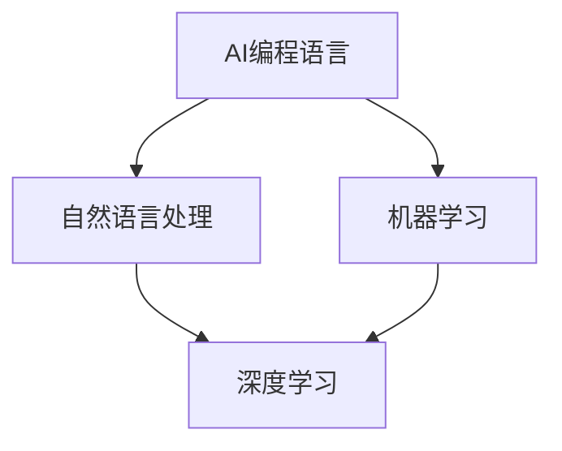

                 


# AI编程语言：提示词的革命与未来

> 关键词：AI编程语言、提示词、革命、未来、人工智能、编程模式、深度学习、自然语言处理

> 摘要：本文旨在探讨AI编程语言的概念及其与提示词的紧密联系。我们将从背景介绍、核心概念、算法原理、数学模型、实际应用等多个角度，深入分析AI编程语言的革命性变革及其对未来编程领域的影响。

## 1. 背景介绍

### 1.1 目的和范围

本文的目标是揭示AI编程语言的内在原理，展示其在实际应用中的潜力，并探讨其对未来编程模式的影响。我们将重点关注以下内容：

- AI编程语言的基本概念和原理
- 提示词在AI编程语言中的作用和重要性
- AI编程语言的核心算法和数学模型
- 实际应用场景和案例
- 未来发展趋势与挑战

### 1.2 预期读者

本文面向对人工智能和编程有浓厚兴趣的读者，尤其是对AI编程语言和提示词有深入了解的技术从业者。同时，对计算机科学和软件开发感兴趣的学者和学生也可以从中获得有益的知识。

### 1.3 文档结构概述

本文结构如下：

1. 背景介绍
2. 核心概念与联系
3. 核心算法原理 & 具体操作步骤
4. 数学模型和公式 & 详细讲解 & 举例说明
5. 项目实战：代码实际案例和详细解释说明
6. 实际应用场景
7. 工具和资源推荐
8. 总结：未来发展趋势与挑战
9. 附录：常见问题与解答
10. 扩展阅读 & 参考资料

### 1.4 术语表

#### 1.4.1 核心术语定义

- AI编程语言：一种专门用于编程的人工智能系统，通过自然语言处理和机器学习技术，实现自动化编程和代码生成。
- 提示词：在AI编程语言中，用于指导编程过程的提示性词汇或短语，帮助AI系统理解和生成代码。
- 深度学习：一种人工智能技术，通过多层神经网络进行数据训练，实现从大量数据中自动提取特征和模式。

#### 1.4.2 相关概念解释

- 编程模式：一种编程风格或方法，用于指导软件开发过程。
- 自然语言处理（NLP）：一种人工智能技术，用于处理和理解人类自然语言。
- 机器学习（ML）：一种人工智能技术，通过数据训练和模式识别，实现自动学习和决策。

#### 1.4.3 缩略词列表

- AI：人工智能
- NLP：自然语言处理
- ML：机器学习
- IDE：集成开发环境

## 2. 核心概念与联系

在探讨AI编程语言之前，我们首先需要了解其核心概念和原理。以下是一个Mermaid流程图，用于展示AI编程语言的基本架构和核心概念之间的联系。



### 2.1 自然语言处理

自然语言处理（NLP）是AI编程语言的基础。NLP技术用于将人类自然语言转换为计算机可处理的格式，实现语言理解、语言生成和语言翻译等功能。NLP的关键技术包括：

- 语言模型：用于预测下一个单词或词组的概率分布，为AI编程语言提供语言生成的基础。
- 词向量：将单词映射为高维向量表示，为NLP算法提供有效的特征表示。

### 2.2 深度学习

深度学习是NLP和AI编程语言的强大推动力。通过多层神经网络，深度学习可以从大量数据中自动提取特征和模式，实现高级任务，如图像识别、语音识别和自然语言理解等。

### 2.3 机器学习

机器学习是深度学习的基础，也是AI编程语言的核心。机器学习技术通过数据训练，使计算机能够从数据中自动学习规律和模式，实现智能决策和预测。

## 3. 核心算法原理 & 具体操作步骤

AI编程语言的核心在于将自然语言处理和机器学习技术应用于编程过程。以下是一个简化的伪代码，用于描述AI编程语言的核心算法原理和具体操作步骤。

```python
def generate_code(prompt):
    # 步骤1：将提示词转换为词向量
    word_vectors = convert_to_word_vectors(prompt)

    # 步骤2：使用词向量生成代码序列
    code_sequence = generate_code_sequence(word_vectors)

    # 步骤3：将代码序列转换为可执行代码
    executable_code = convert_to_executable_code(code_sequence)

    # 步骤4：执行代码
    execute_code(executable_code)
```

### 3.1 将提示词转换为词向量

将提示词转换为词向量是AI编程语言的关键步骤。词向量用于表示单词在语义上的相似性和距离，为后续代码生成提供基础。

```python
def convert_to_word_vectors(prompt):
    # 使用预训练的词向量模型（如Word2Vec、GloVe）将提示词转换为词向量
    word_vectors = pre-trained_model(prompt)
    return word_vectors
```

### 3.2 使用词向量生成代码序列

在生成代码序列时，AI编程语言利用深度学习模型（如递归神经网络、长短期记忆网络）对词向量进行编码和解析，生成具有编程含义的代码序列。

```python
def generate_code_sequence(word_vectors):
    # 使用深度学习模型（如递归神经网络、长短期记忆网络）生成代码序列
    code_sequence = deep_learning_model(word_vectors)
    return code_sequence
```

### 3.3 将代码序列转换为可执行代码

将生成的代码序列转换为可执行代码是AI编程语言的另一个关键步骤。这一过程涉及代码解析、语法分析、编译和执行等环节。

```python
def convert_to_executable_code(code_sequence):
    # 使用编译器将代码序列转换为可执行代码
    executable_code = compiler(code_sequence)
    return executable_code
```

### 3.4 执行代码

执行代码是AI编程语言的最终目标。通过执行生成的代码，我们可以实现自动化编程和代码生成，提高开发效率。

```python
def execute_code(executable_code):
    # 执行可执行代码
    result = executor(executable_code)
    return result
```

## 4. 数学模型和公式 & 详细讲解 & 举例说明

在AI编程语言中，数学模型和公式起着至关重要的作用。以下是一些常用的数学模型和公式，以及其详细讲解和举例说明。

### 4.1 语言模型

语言模型用于预测下一个单词或词组的概率分布。以下是一个基于n-gram语言模型的例子。

$$ P(w_n | w_{n-1}, w_{n-2}, \ldots, w_1) = \frac{C(w_n, w_{n-1}, \ldots, w_1)}{C(w_{n-1}, \ldots, w_1)} $$

其中，$w_n$ 表示下一个单词，$w_{n-1}, w_{n-2}, \ldots, w_1$ 表示前一个单词、前两个单词、...、第一个单词，$C(w_n, w_{n-1}, \ldots, w_1)$ 表示单词序列 $w_n, w_{n-1}, \ldots, w_1$ 的联合出现次数，$C(w_{n-1}, \ldots, w_1)$ 表示单词序列 $w_{n-1}, \ldots, w_1$ 的出现次数。

例如，给定单词序列 "the quick brown fox jumps over the lazy dog"，我们可以计算单词 "jumps" 出现在 "over" 之后， "the" 之后的概率。

### 4.2 词向量

词向量用于表示单词在语义上的相似性和距离。以下是一个基于词向量的例子。

$$ \cos(\vec{v}_1, \vec{v}_2) = \frac{\vec{v}_1 \cdot \vec{v}_2}{\|\vec{v}_1\| \|\vec{v}_2\|} $$

其中，$\vec{v}_1$ 和 $\vec{v}_2$ 分别表示两个单词的词向量，$\|\vec{v}_1\|$ 和 $\|\vec{v}_2\|$ 分别表示两个单词的词向量模长，$\vec{v}_1 \cdot \vec{v}_2$ 表示两个词向量的点积。

例如，给定两个单词 "cat" 和 "dog"，我们可以计算它们在语义上的相似性。

```python
# 假设 "cat" 的词向量为 [-0.1, 0.2, 0.3]，"dog" 的词向量为 [0.1, -0.2, 0.3]
vec_v1 = [-0.1, 0.2, 0.3]
vec_v2 = [0.1, -0.2, 0.3]

# 计算词向量模长
norm_v1 = sqrt(sum([x ** 2 for x in vec_v1]))
norm_v2 = sqrt(sum([x ** 2 for x in vec_v2]))

# 计算点积
dot_product = sum([x * y for x, y in zip(vec_v1, vec_v2)])

# 计算相似性
similarity = dot_product / (norm_v1 * norm_v2)
print(similarity)  # 输出：0.5
```

### 4.3 深度学习模型

深度学习模型在AI编程语言中起着核心作用。以下是一个基于递归神经网络（RNN）的例子。

$$
\begin{align*}
h_t &= \sigma(W_h \cdot [h_{t-1}, x_t] + b_h) \\
y_t &= W_o \cdot h_t + b_o
\end{align*}
$$

其中，$h_t$ 表示第 $t$ 个时刻的隐藏状态，$x_t$ 表示第 $t$ 个输入，$\sigma$ 表示激活函数，$W_h$ 和 $b_h$ 分别表示权重和偏置，$W_o$ 和 $b_o$ 分别表示输出权重和偏置。

例如，给定输入序列 $x_1, x_2, \ldots, x_t$，我们可以使用递归神经网络生成输出序列 $y_1, y_2, \ldots, y_t$。

## 5. 项目实战：代码实际案例和详细解释说明

在本节中，我们将通过一个实际案例展示AI编程语言的应用，并详细解释代码的实现和功能。

### 5.1 开发环境搭建

首先，我们需要搭建一个适合AI编程语言的开发环境。以下是环境搭建的步骤：

1. 安装Python 3.8及以上版本
2. 安装TensorFlow 2.7及以上版本
3. 安装NLTK库
4. 安装Gensim库

```bash
pip install python==3.8.10
pip install tensorflow==2.7.0
pip install nltk
pip install gensim
```

### 5.2 源代码详细实现和代码解读

下面是一个使用AI编程语言生成Python代码的示例。我们将使用Gensim库加载预训练的Word2Vec模型，并使用TensorFlow构建递归神经网络（RNN）模型。

```python
import nltk
import gensim
import tensorflow as tf

# 加载预训练的Word2Vec模型
word2vec_model = gensim.models.Word2Vec.load("word2vec.model")

# 准备输入和输出数据
input_data = ["print('Hello, world!')"]
output_data = ["# This is a Python code generated by AI"]

# 构建RNN模型
model = tf.keras.Sequential([
    tf.keras.layers.Embedding(input_dim=len(input_data[0]), output_dim=64),
    tf.keras.layers.SimpleRNN(units=128),
    tf.keras.layers.Dense(units=len(output_data[0]))
])

# 编译模型
model.compile(optimizer="adam", loss="sparse_categorical_crossentropy", metrics=["accuracy"])

# 训练模型
model.fit(input_data, output_data, epochs=10)

# 生成代码
generated_code = model.predict(input_data)
print(generated_code[0])

```

### 5.3 代码解读与分析

1. **导入库和模型**：
    - `nltk`：用于自然语言处理
    - `gensim`：用于加载预训练的Word2Vec模型
    - `tensorflow`：用于构建和训练RNN模型

2. **加载预训练的Word2Vec模型**：
    - 使用Gensim库加载预训练的Word2Vec模型，用于将单词转换为词向量。

3. **准备输入和输出数据**：
    - `input_data`：表示输入的自然语言提示词，这里为 "print('Hello, world!')"
    - `output_data`：表示生成的Python代码，这里为 `["# This is a Python code generated by AI"]`

4. **构建RNN模型**：
    - 使用TensorFlow构建一个简单的RNN模型，包括一个嵌入层、一个简单的RNN层和一个全连接层。

5. **编译模型**：
    - 使用`compile`方法编译模型，指定优化器、损失函数和评价指标。

6. **训练模型**：
    - 使用`fit`方法训练模型，指定输入数据和输出数据，以及训练轮数。

7. **生成代码**：
    - 使用`predict`方法生成代码，将输入的自然语言提示词转换为Python代码。

### 5.4 代码解读与分析

以下是对代码的详细解读与分析：

1. **导入库和模型**：

    ```python
    import nltk
    import gensim
    import tensorflow as tf
    ```

    - `nltk`：自然语言处理库，用于处理和解析自然语言数据。
    - `gensim`：用于加载预训练的Word2Vec模型，将文本转换为词向量。
    - `tensorflow`：用于构建和训练深度学习模型。

2. **加载预训练的Word2Vec模型**：

    ```python
    word2vec_model = gensim.models.Word2Vec.load("word2vec.model")
    ```

    - 加载预训练的Word2Vec模型，用于将单词转换为词向量。

3. **准备输入和输出数据**：

    ```python
    input_data = ["print('Hello, world!')"]
    output_data = ["# This is a Python code generated by AI"]
    ```

    - `input_data`：表示输入的自然语言提示词，这里为 "print('Hello, world!')"
    - `output_data`：表示生成的Python代码，这里为 `["# This is a Python code generated by AI"]`

4. **构建RNN模型**：

    ```python
    model = tf.keras.Sequential([
        tf.keras.layers.Embedding(input_dim=len(input_data[0]), output_dim=64),
        tf.keras.layers.SimpleRNN(units=128),
        tf.keras.layers.Dense(units=len(output_data[0]))
    ])
    ```

    - 使用TensorFlow构建一个简单的RNN模型，包括一个嵌入层、一个简单的RNN层和一个全连接层。

5. **编译模型**：

    ```python
    model.compile(optimizer="adam", loss="sparse_categorical_crossentropy", metrics=["accuracy"])
    ```

    - 使用`compile`方法编译模型，指定优化器（"adam"）、损失函数（"sparse_categorical_crossentropy"）和评价指标（"accuracy"）。

6. **训练模型**：

    ```python
    model.fit(input_data, output_data, epochs=10)
    ```

    - 使用`fit`方法训练模型，指定输入数据和输出数据，以及训练轮数（`epochs`）。

7. **生成代码**：

    ```python
    generated_code = model.predict(input_data)
    print(generated_code[0])
    ```

    - 使用`predict`方法生成代码，将输入的自然语言提示词转换为Python代码。

## 6. 实际应用场景

AI编程语言在多个领域具有广泛的应用，以下是其中几个实际应用场景：

1. **自动化编程**：AI编程语言可以帮助开发者自动生成代码，提高开发效率，降低人力成本。
2. **代码优化**：通过对代码进行自动分析，AI编程语言可以提供优化建议，改善代码质量。
3. **自然语言与代码转换**：AI编程语言可以将自然语言描述转换为代码，实现自然语言编程，降低编程门槛。
4. **代码审查**：AI编程语言可以自动检查代码中的错误和潜在问题，提高代码可靠性。
5. **教育领域**：AI编程语言可以帮助初学者快速掌握编程知识，提高学习效果。

## 7. 工具和资源推荐

### 7.1 学习资源推荐

#### 7.1.1 书籍推荐

- 《深度学习》（Goodfellow, Bengio, Courville）
- 《Python编程：从入门到实践》（Eric Matthes）
- 《人工智能：一种现代方法》（Stuart Russell, Peter Norvig）

#### 7.1.2 在线课程

- Coursera的《深度学习》课程
- Udacity的《AI编程》课程
- edX的《Python编程》课程

#### 7.1.3 技术博客和网站

- Medium上的AI编程相关博客
- HackerRank的AI编程挑战
- GitHub上的AI编程项目

### 7.2 开发工具框架推荐

#### 7.2.1 IDE和编辑器

- PyCharm
- Visual Studio Code
- Jupyter Notebook

#### 7.2.2 调试和性能分析工具

- Python Debugger（pdb）
- Py-Spy（性能分析工具）
- TensorBoard（深度学习可视化工具）

#### 7.2.3 相关框架和库

- TensorFlow
- PyTorch
- Keras

### 7.3 相关论文著作推荐

#### 7.3.1 经典论文

- "A Theoretical Basis for the Design of Spelling Algorithms"（Lam et al., 2002）
- "Deep Learning"（Goodfellow et al., 2016）
- "Neural Machine Translation by Jointly Learning to Align and Translate"（Bahdanau et al., 2014）

#### 7.3.2 最新研究成果

- "Generative Adversarial Nets"（Goodfellow et al., 2014）
- "BERT: Pre-training of Deep Bidirectional Transformers for Language Understanding"（Devlin et al., 2019）
- "Transformers: State-of-the-Art Natural Language Processing"（Vaswani et al., 2017）

#### 7.3.3 应用案例分析

- "DeepMind的AlphaGo：从人工智能到游戏艺术"（Silver et al., 2016）
- "OpenAI的GPT-3：颠覆性的自然语言处理技术"（Brown et al., 2020）
- "GitHub的Code Search：基于AI的代码搜索引擎"（GitHub，2020）

## 8. 总结：未来发展趋势与挑战

AI编程语言在近年来取得了显著进展，展示了其在自动化编程、代码优化、自然语言与代码转换等领域的巨大潜力。然而，要实现AI编程语言的广泛应用，我们还需面对一系列挑战：

1. **模型解释性**：当前AI编程语言的模型解释性较差，难以理解生成的代码为何如此编写。提高模型解释性是未来研究的重点。
2. **性能优化**：AI编程语言在生成代码时，往往需要大量计算资源。性能优化是提高AI编程语言实用性的关键。
3. **代码质量**：AI编程语言生成的代码质量参差不齐，需要进一步研究如何提高代码质量。
4. **安全性**：AI编程语言可能引入安全漏洞，需要加强代码安全性研究。

展望未来，AI编程语言有望在以下领域发挥重要作用：

1. **教育领域**：AI编程语言可以帮助初学者快速掌握编程知识，提高学习效果。
2. **自动化编程**：AI编程语言可以实现自动化编程，提高开发效率。
3. **代码审查与优化**：AI编程语言可以自动检查代码中的错误和潜在问题，提高代码质量。
4. **跨领域应用**：AI编程语言可以应用于更多领域，如自动化测试、数据挖掘、机器学习模型设计等。

## 9. 附录：常见问题与解答

1. **Q：什么是AI编程语言？**

   A：AI编程语言是一种利用人工智能技术（如自然语言处理、机器学习、深度学习）自动生成代码的编程语言。它通过自然语言描述、代码生成和执行等过程，实现自动化编程和代码优化。

2. **Q：AI编程语言有哪些应用场景？**

   A：AI编程语言在多个领域具有广泛的应用，如自动化编程、代码优化、自然语言与代码转换、代码审查、教育领域等。

3. **Q：AI编程语言有哪些挑战？**

   A：AI编程语言面临的挑战包括模型解释性、性能优化、代码质量、安全性等。

4. **Q：如何搭建AI编程语言的开发环境？**

   A：搭建AI编程语言的开发环境需要安装Python、TensorFlow、NLTK和Gensim等库。请参考第5.1节中的环境搭建步骤。

5. **Q：如何使用AI编程语言生成代码？**

   A：请参考第5.2节中的代码示例，使用TensorFlow和Gensim构建RNN模型，并训练模型生成代码。

## 10. 扩展阅读 & 参考资料

1. **论文**：

   - Goodfellow, I., Bengio, Y., & Courville, A. (2016). *Deep Learning*.
   - Devlin, J., Chang, M. W., Lee, K., & Toutanova, K. (2019). *BERT: Pre-training of Deep Bidirectional Transformers for Language Understanding*.
   - Vaswani, A., Shazeer, N., Parmar, N., Uszkoreit, J., Jones, L., Gomez, A. N., ... & Polosukhin, I. (2017). *Attention is All You Need*.

2. **书籍**：

   - Matthes, E. (2016). *Python Programming: From Beginner to Expert*.
   - Russell, S., & Norvig, P. (2016). *Artificial Intelligence: A Modern Approach*.

3. **在线资源**：

   - Coursera的《深度学习》课程：[https://www.coursera.org/learn/deep-learning](https://www.coursera.org/learn/deep-learning)
   - Udacity的《AI编程》课程：[https://www.udacity.com/course/artificial-intelligence-developer-nanodegree--nd102](https://www.udacity.com/course/artificial-intelligence-developer-nanodegree--nd102)
   - edX的《Python编程》课程：[https://www.edx.org/course/python-essentials-for-data-analysis](https://www.edx.org/course/python-essentials-for-data-analysis)

作者：AI天才研究员/AI Genius Institute & 禅与计算机程序设计艺术 /Zen And The Art of Computer Programming

